# Week 1 · Day 4 — Thursday 24 Sep 2026 · Taflove Ch. 3

*Simple-English study version of Taflove & Hagness, Computational Electrodynamics (2nd ed.), Chapter 3 — Maxwell's equations and the Yee algorithm*

---

!!! abstract "What today's slot asks"
    **Morning 06:15–07:45 — "Taflove ch. 3: Yee grid, Courant condition, PML — *why* FDTD works and when it fails."**

    This page covers all of Chapter 3 (§3.1–3.8). Here is where each part of the task is answered:

    - **The Yee grid and *why* FDTD works:** §3.6 is the heart of it. §3.6.1 gives the three big ideas, §3.6.3 gives the update equations, §3.6.8 shows that the grid obeys Faraday's and Ampère's laws in loop form, and §3.6.9 proves that the grid never creates fake electric charge.
    - **When it fails:** Chapter 3 only hints at this. §3.7 introduces *numerical phase-velocity anisotropy* (the grid makes waves travel at slightly different speeds in different directions). The "Common confusions" box at the end lists the other failure modes.
    - **Courant condition:** this is **not** derived in Chapter 3. It is derived in **Chapter 4, §4.7** (see the companion page [Taflove Ch. 4](day-04-thu-24-sep-2026-taflove-ch4.md)). Chapter 3 only hints at it in its homework problems (time steps of $0.99$, $1.0$ and $1.01\,\Delta x/c$). The Python example below shows the blow-up in practice.
    - **PML (perfectly matched layer):** this is in **Chapter 7**, not in Chapters 3 or 4. This page only says why it is needed: a finite grid needs edges that swallow waves instead of reflecting them.

## Before you start: the big picture

Light is an electromagnetic wave. Its behaviour is fully described by **Maxwell's equations**. For a few simple shapes (an infinite slab, a perfect cylinder) you can solve these equations with pen and paper. For a real photonic device, such as a grating coupler, a Y-branch or an inverse-designed blob of silicon, there is no formula. You need a computer.

The **finite-difference time-domain (FDTD)** method is the most "brute force" way to do this. It is like a film camera for light:

- Chop space into a 3-D grid of tiny boxes, like voxels in a video game.
- Store the electric and magnetic field at fixed spots in each box.
- Advance time in tiny ticks. At each tick, use Maxwell's equations to compute the new fields from the old fields next door.
- Repeat millions of times. Watch the wave move, bounce, split and leak, frame by frame.

An everyday picture: a stadium "Mexican wave". Each person only looks at their neighbours and stands up a moment after them. No one knows the shape of the whole wave, yet the wave travels round the stadium. FDTD works the same way. Each field value only "looks" at its neighbours. Yet the whole pattern of light moves correctly.

Why is this attractive?

- **It is general.** The same code handles any shape and any material. You just fill the grid with different numbers.
- **It is simple.** There are no big matrices to invert. Each update is a few multiplications and additions.
- **One run gives many wavelengths.** You send in a short pulse, which contains many frequencies at once. A Fourier transform of the result gives the response at all of them.

Why must you understand it, not just use it?

- The grid is not real space. Waves on a grid travel at slightly the wrong speed (Chapter 4).
- If the time tick is too long compared with the box size, the numbers explode (the Courant condition, Chapter 4).
- The grid has to end somewhere. The edges must absorb waves (PML, Chapter 7).
- Curved surfaces become "staircases" of little cubes.

Chapter 3 builds the basic machine: **Kane Yee's 1966 algorithm**. Almost every FDTD code in the world, including commercial photonics tools such as Lumerical FDTD and the open-source Meep, is a version of it.

## Background you need

### Fields and vectors

A **field** is a quantity that has a value at every point in space (and at every moment in time). Temperature in a room is a field: each point has one number. That is a **scalar field**.

Wind is also a field, but at each point it has a size *and* a direction. That is a **vector field**. A vector in 3-D has three parts, called **components**: for example $\mathbf{E} = (E_x, E_y, E_z)$. Bold letters are vectors. A subscript like $E_x$ means "the part of $\mathbf{E}$ that points along $x$".

Electromagnetism has four vector fields:

| Symbol | Name | Units | Plain meaning |
|---|---|---|---|
| $\mathbf{E}$ | electric field | V/m | push on a charge |
| $\mathbf{H}$ | magnetic field | A/m | the "magnetising" field made by currents |
| $\mathbf{D}$ | electric flux density | C/m² | $\mathbf{E}$ as modified by the material |
| $\mathbf{B}$ | magnetic flux density | Wb/m² (tesla) | $\mathbf{H}$ as modified by the material |

### Partial derivatives

A field depends on four numbers: $x, y, z, t$. A **partial derivative** like $\partial E_z/\partial x$ asks: "if I step a tiny bit in $x$, keeping $y$, $z$, $t$ fixed, how fast does $E_z$ change?" It is the slope of the field along one direction. $\partial E_z/\partial t$ is how fast $E_z$ changes in time at one fixed point.

### Curl and divergence, seen geometrically

Maxwell's equations are written with two operations on vector fields. Both have a simple picture.

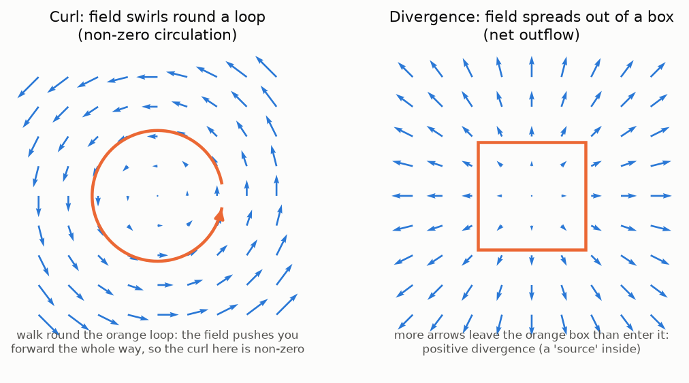

*Left: a swirling field has curl (walk round the loop and the field pushes you along). Right: a field pouring out of a box has divergence (net outflow).*

**Curl ($\nabla\times$) measures circulation.** Imagine a tiny loop at a point. Walk round it and add up how much the field pushes you along your path. That total, divided by the loop area, is the curl (more exactly, one component of it: the loop's facing direction picks which component). A whirlpool has a big curl. A river flowing straight with the same speed everywhere has zero curl. In Cartesian components:

$$
\nabla\times\mathbf{E} =
\left(
\frac{\partial E_z}{\partial y}-\frac{\partial E_y}{\partial z},\;
\frac{\partial E_x}{\partial z}-\frac{\partial E_z}{\partial x},\;
\frac{\partial E_y}{\partial x}-\frac{\partial E_x}{\partial y}
\right)
$$

Look at the $z$ part: $\partial E_y/\partial x - \partial E_x/\partial y$. It only involves the field components that lie *in* the $xy$ plane, and it measures how they turn round a loop lying in that plane. This "loop in the plane, result pointing out of the plane" picture is exactly what Yee's grid is built on.

**Divergence ($\nabla\cdot$) measures net outflow.** Imagine a tiny box. Count how much field flows out through its walls, minus how much flows in, divided by the box volume. A tap (source) has positive divergence; a drain has negative divergence. In components:

$$\nabla\cdot\mathbf{D} = \frac{\partial D_x}{\partial x}+\frac{\partial D_y}{\partial y}+\frac{\partial D_z}{\partial z}$$

**Integral forms.** The two pictures above become two famous theorems. *Stokes' theorem*: the circulation round a loop equals the total curl over the surface inside the loop. *Gauss' (divergence) theorem*: the flow out of a closed surface equals the total divergence inside. That is why every Maxwell equation comes in two equivalent forms: a "pointwise" (differential) form and a "loops and surfaces" (integral) form.

### Maxwell's two curl equations in words

- **Faraday's law:** a magnetic field that changes in time creates an electric field that circulates around it. (This is how a generator works.)
- **Ampère's law (with Maxwell's correction):** an electric field that changes in time (and any electric current) creates a magnetic field that circulates around it.

Put them together and you get a self-sustaining chain: changing $\mathbf{E}$ makes circulating $\mathbf{H}$; changing $\mathbf{H}$ makes circulating $\mathbf{E}$; and so on. That chain *is* a light wave. FDTD simulates exactly this chain, step by step.

The two **Gauss laws** say there is no net outflow of $\mathbf{D}$ where there is no charge, and never any net outflow of $\mathbf{B}$ (no magnetic charges exist).

### Permittivity, permeability, conductivity

Materials change how fields behave. Three numbers describe a simple material:

- **Permittivity $\varepsilon$** (F/m): how strongly the material responds to an electric field. $\varepsilon = \varepsilon_r\varepsilon_0$, with $\varepsilon_0 = 8.854\times10^{-12}$ F/m (vacuum) and $\varepsilon_r$ the **relative permittivity**. For optics, $\varepsilon_r = n^2$, where $n$ is the refractive index. Silicon at 1550 nm: $n\approx 3.48$, so $\varepsilon_r\approx 12.1$.
- **Permeability $\mu$** (H/m): the magnetic version. $\mu = \mu_r\mu_0$, with $\mu_0 = 4\pi\times10^{-7}$ H/m. At optical frequencies almost every material has $\mu_r = 1$.
- **Conductivity $\sigma$** (S/m): how easily current flows when you apply $\mathbf{E}$. It turns field energy into heat, so it makes waves lose energy (loss, absorption). The book also uses a "magnetic conductivity" $\sigma^*$ (Ω/m). It does not exist in nature, but it is a handy mathematical tool (for example in absorbing layers like PML).

The speed of light in a material is $c = 1/\sqrt{\mu\varepsilon}$. In vacuum, $c_0 = 1/\sqrt{\mu_0\varepsilon_0}\approx 3\times10^8$ m/s.

### What a finite difference is

A computer cannot take a true derivative. It only has numbers at separate points. So we replace the slope by "rise over run" between nearby points. This is a **finite difference**. With grid spacing $h$:

- **Forward difference:** $\dfrac{u(x+h)-u(x)}{h}$ — uses the point and the one ahead.
- **Central difference:** $\dfrac{u(x+h/2)-u(x-h/2)}{h}$ — uses one point just behind and one just ahead, *centred* on $x$.

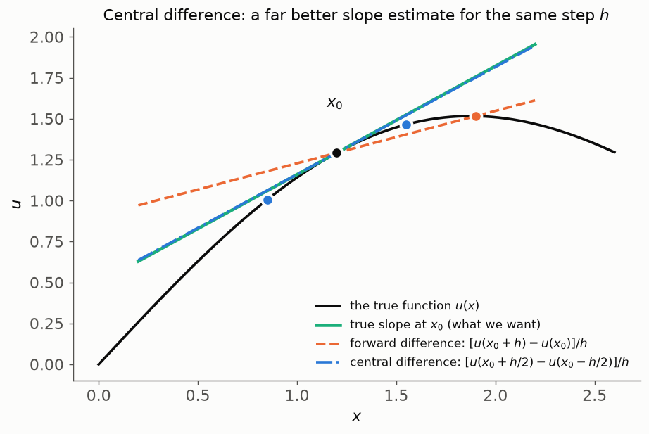

*The blue central-difference line almost lies on top of the true tangent (green); the orange forward-difference line is clearly tilted the wrong way.*

### Why central differences are second-order accurate (Taylor series)

A **Taylor series** writes a smooth function near a point as a polynomial:

$$u(x+a) = u(x) + a\,u'(x) + \frac{a^2}{2}u''(x) + \frac{a^3}{6}u'''(x) + \dots$$

**Forward difference.** Put $a=h$, subtract $u(x)$, divide by $h$:

$$\frac{u(x+h)-u(x)}{h} = u'(x) + \frac{h}{2}u''(x) + \dots$$

The error starts with a term proportional to $h$. We write the error as $O(h)$ ("order $h$"). Halve $h$, and the error halves. This is **first-order accurate**.

**Central difference.** Write the series for $a=+h/2$ and $a=-h/2$ and subtract:

$$u(x+\tfrac h2) - u(x-\tfrac h2) = h\,u'(x) + \frac{h^3}{24}u'''(x) + \dots$$

The $u(x)$ terms cancel. The $u''$ terms also cancel, because $(h/2)^2$ and $(-h/2)^2$ are equal. Divide by $h$:

$$\frac{u(x+\tfrac h2) - u(x-\tfrac h2)}{h} = u'(x) + \frac{h^2}{24}u'''(x) + \dots$$

The error is $O(h^2)$. Halve $h$, and the error drops by a factor of **4**. This is **second-order accurate**. The symmetry is what kills the first error term. This free accuracy is the reason Yee places fields at half-step offsets: every derivative he needs then becomes a centred one.

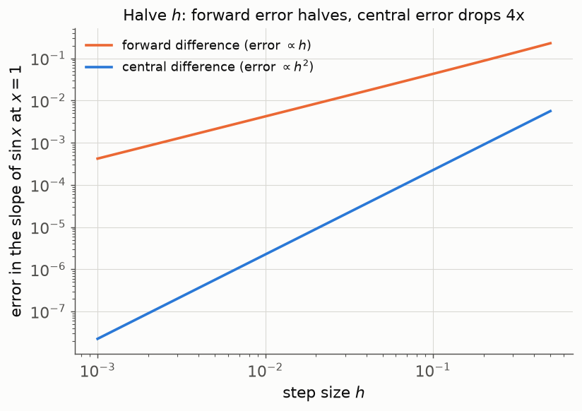

*On a log–log plot the forward error falls with slope 1 and the central error with slope 2, so the central one is far smaller at every $h$.*

### Notation used in FDTD

- $\Delta x, \Delta y, \Delta z$: grid spacing in each direction. $\Delta t$: time step.
- $(i,j,k)$: the grid point at $(i\Delta x, j\Delta y, k\Delta z)$. Indices can be half-integers, like $i+\tfrac12$, meaning half a cell along.
- $n$: time index, $t = n\Delta t$.
- $u^n_{i,j,k}$ means "the value of $u$ at point $(i,j,k)$ at time step $n$". In the book, $E_x\big|^{n}_{i,j,k}$ means the same thing for $E_x$.

---

## 3.1 Introduction

> **In one sentence:** This chapter is about the 1966 Yee algorithm, whose key idea is *where* on the grid each field component is stored.

In 1966 Kane Yee proposed a way to place the six field components ($E_x, E_y, E_z, H_x, H_y, H_z$) on a grid. His arrangement is clever because the same grid represents Maxwell's equations both in the pointwise (differential) form and in the loop (integral) form. Many other grids have been proposed since. None has been as widely used or as long-lived. Everything later in the book builds on this one idea.

## 3.2 Maxwell's equations in three dimensions

> **In one sentence:** Write down Maxwell's four laws, add simple material rules, and you get six coupled equations, one for each field component; these six are what FDTD solves.

The book assumes a region with **no free sources of charge**, but it may contain materials that absorb energy.

**Faraday's law:**

$$\frac{\partial \mathbf{B}}{\partial t} = -\nabla\times\mathbf{E} - \mathbf{M} \tag{3.1a}$$

$$\frac{\partial}{\partial t}\iint_{A}\mathbf{B}\cdot d\mathbf{A} = -\oint_{\ell}\mathbf{E}\cdot d\boldsymbol{\ell} - \iint_{A}\mathbf{M}\cdot d\mathbf{A} \tag{3.1b}$$

In words: the rate of change of $\mathbf{B}$ equals minus the curl (circulation) of $\mathbf{E}$, minus a "magnetic current" $\mathbf{M}$. The integral form (3.1b) says the same for a finite surface $A$ with edge loop $\ell$: the rate of change of magnetic flux through the surface equals minus the push of $\mathbf{E}$ around its edge. The minus sign is **Lenz's law**: the induced field opposes the change.

$\mathbf{M}$ (V/m²) is a **magnetic current density**. Real magnetic currents do not exist. It is kept because it is useful: as a source in simulations and to model magnetic loss.

**Ampère's law:**

$$\frac{\partial \mathbf{D}}{\partial t} = \nabla\times\mathbf{H} - \mathbf{J} \tag{3.2a}$$

$$\frac{\partial}{\partial t}\iint_{A}\mathbf{D}\cdot d\mathbf{A} = \oint_{\ell}\mathbf{H}\cdot d\boldsymbol{\ell} - \iint_{A}\mathbf{J}\cdot d\mathbf{A} \tag{3.2b}$$

In words: the rate of change of $\mathbf{D}$ equals the curl of $\mathbf{H}$ minus the electric current density $\mathbf{J}$ (A/m²). Note the sign pattern: Faraday has a minus in front of the curl, Ampère a plus. This sign difference is what makes waves travel instead of just growing.

**Gauss' law for the electric field:**

$$\nabla\cdot\mathbf{D} = 0 \tag{3.3a}$$

$$\oint_{A}\mathbf{D}\cdot d\mathbf{A} = 0 \tag{3.3b}$$

No net outflow of $\mathbf{D}$ from any closed surface, because there is no free charge in the region.

**Gauss' law for the magnetic field:**

$$\nabla\cdot\mathbf{B} = 0 \tag{3.4a}$$

$$\oint_{A}\mathbf{B}\cdot d\mathbf{A} = 0 \tag{3.4b}$$

No net outflow of $\mathbf{B}$, ever.

Symbols: $A$ is any surface, $d\mathbf{A}$ a tiny piece of it with its normal direction (m²); $\ell$ is the closed loop around its edge, $d\boldsymbol{\ell}$ a tiny piece of the loop (m). The small circle on an integral sign means "closed" (a closed loop or a closed surface).

**Material rules.** For **linear** (response proportional to field), **isotropic** (same in every direction) and **non-dispersive** (same at every frequency) materials:

$$\mathbf{D} = \varepsilon\mathbf{E} = \varepsilon_r\varepsilon_0\mathbf{E}, \qquad \mathbf{B} = \mu\mathbf{H} = \mu_r\mu_0\mathbf{H} \tag{3.5}$$

**Loss.** The currents are split into a *source* part (something you put in on purpose, like an antenna) and a *loss* part that is proportional to the field:

$$\mathbf{J} = \mathbf{J}_{source} + \sigma\mathbf{E}, \qquad \mathbf{M} = \mathbf{M}_{source} + \sigma^{*}\mathbf{H} \tag{3.6}$$

$\sigma\mathbf{E}$ is just Ohm's law: current flows in proportion to the field. $\sigma^*\mathbf{H}$ is its magnetic mirror image.

**Putting it together.** Substitute (3.5) and (3.6) into (3.1a) and (3.2a), and divide by $\mu$ or $\varepsilon$:

$$\frac{\partial\mathbf{H}}{\partial t} = -\frac{1}{\mu}\nabla\times\mathbf{E} - \frac{1}{\mu}\left(\mathbf{M}_{source} + \sigma^{*}\mathbf{H}\right) \tag{3.7}$$

$$\frac{\partial\mathbf{E}}{\partial t} = \frac{1}{\varepsilon}\nabla\times\mathbf{H} - \frac{1}{\varepsilon}\left(\mathbf{J}_{source} + \sigma\mathbf{E}\right) \tag{3.8}$$

These are the two equations FDTD lives on. Read them as "update rules": the left side is "how fast this field changes now"; the right side tells you that rate from the *other* field's curl, plus sources and loss.

**Writing out the components.** Using the curl formula from the background section gives six scalar equations:

$$\frac{\partial H_x}{\partial t} = \frac{1}{\mu}\left[\frac{\partial E_y}{\partial z} - \frac{\partial E_z}{\partial y} - \left(M_{source,x} + \sigma^{*}H_x\right)\right] \tag{3.9a}$$

$$\frac{\partial H_y}{\partial t} = \frac{1}{\mu}\left[\frac{\partial E_z}{\partial x} - \frac{\partial E_x}{\partial z} - \left(M_{source,y} + \sigma^{*}H_y\right)\right] \tag{3.9b}$$

$$\frac{\partial H_z}{\partial t} = \frac{1}{\mu}\left[\frac{\partial E_x}{\partial y} - \frac{\partial E_y}{\partial x} - \left(M_{source,z} + \sigma^{*}H_z\right)\right] \tag{3.9c}$$

$$\frac{\partial E_x}{\partial t} = \frac{1}{\varepsilon}\left[\frac{\partial H_z}{\partial y} - \frac{\partial H_y}{\partial z} - \left(J_{source,x} + \sigma E_x\right)\right] \tag{3.10a}$$

$$\frac{\partial E_y}{\partial t} = \frac{1}{\varepsilon}\left[\frac{\partial H_x}{\partial z} - \frac{\partial H_z}{\partial x} - \left(J_{source,y} + \sigma E_y\right)\right] \tag{3.10b}$$

$$\frac{\partial E_z}{\partial t} = \frac{1}{\varepsilon}\left[\frac{\partial H_y}{\partial x} - \frac{\partial H_x}{\partial y} - \left(J_{source,z} + \sigma E_z\right)\right] \tag{3.10c}$$

How to read one, say (3.10c): "$E_z$ grows at a rate set by how much $\mathbf{H}$ circulates in the $xy$ plane around it (the bracket of slopes), minus any current flowing along $z$." Notice the pattern: the change of a $z$ component depends only on $x$ and $y$ components and their $x$ and $y$ slopes. Each equation is a little loop in the plane at right angles to the component.

Where did the minus sign in (3.7) go? $-(\nabla\times\mathbf{E})_x = -(\partial E_z/\partial y - \partial E_y/\partial z) = \partial E_y/\partial z - \partial E_z/\partial y$. The book has simply swapped the order of the two terms.

**What about Gauss' laws?** FDTD only uses the six curl equations. It never imposes (3.3) and (3.4) directly. This is fine for two reasons. First, in theory, the Gauss laws follow from the curl equations (take the divergence of (3.1a): the divergence of a curl is always zero, so $\nabla\cdot\mathbf{B}$ never changes; if it starts at zero, it stays zero). Second, Yee's grid has this property *built in* to its geometry, as §3.6.9 proves.

## 3.3 Reduction to two dimensions

> **In one sentence:** If nothing changes along $z$, the six equations split into two independent groups of three, called TM$_z$ and TE$_z$.

Suppose the structure is infinitely long in $z$ and its cross-section never changes (think of an infinitely long pipe, or a 2-D photonic crystal of rods). Suppose the light source also does not vary in $z$. Then nothing depends on $z$: every $\partial/\partial z$ is zero. Cross out those terms in (3.9)–(3.10):

$$\frac{\partial H_x}{\partial t} = \frac{1}{\mu}\left[-\frac{\partial E_z}{\partial y} - \left(M_{source,x}+\sigma^{*}H_x\right)\right] \tag{3.11a}$$

$$\frac{\partial H_y}{\partial t} = \frac{1}{\mu}\left[\frac{\partial E_z}{\partial x} - \left(M_{source,y}+\sigma^{*}H_y\right)\right] \tag{3.11b}$$

$$\frac{\partial H_z}{\partial t} = \frac{1}{\mu}\left[\frac{\partial E_x}{\partial y}-\frac{\partial E_y}{\partial x} - \left(M_{source,z}+\sigma^{*}H_z\right)\right] \tag{3.11c}$$

$$\frac{\partial E_x}{\partial t} = \frac{1}{\varepsilon}\left[\frac{\partial H_z}{\partial y} - \left(J_{source,x}+\sigma E_x\right)\right] \tag{3.12a}$$

$$\frac{\partial E_y}{\partial t} = \frac{1}{\varepsilon}\left[-\frac{\partial H_z}{\partial x} - \left(J_{source,y}+\sigma E_y\right)\right] \tag{3.12b}$$

$$\frac{\partial E_z}{\partial t} = \frac{1}{\varepsilon}\left[\frac{\partial H_y}{\partial x}-\frac{\partial H_x}{\partial y} - \left(J_{source,z}+\sigma E_z\right)\right] \tag{3.12c}$$

Now look at who talks to whom. $H_x$ and $H_y$ only need $E_z$. $E_z$ only needs $H_x$ and $H_y$. Separately, $E_x$ and $E_y$ only need $H_z$, and $H_z$ only needs $E_x$ and $E_y$. So there are two separate "conversations" that never mix.

### 3.3.1 TM$_z$ mode

Equations (3.11a), (3.11b), (3.12c) form the **transverse-magnetic mode with respect to $z$** (TM$_z$): the magnetic field lies entirely in the $xy$ plane (transverse to $z$), and the electric field points along $z$. Fields involved: $E_z, H_x, H_y$.

$$\frac{\partial H_x}{\partial t} = \frac{1}{\mu}\left[-\frac{\partial E_z}{\partial y} - \left(M_{source,x}+\sigma^{*}H_x\right)\right] \tag{3.13a}$$

$$\frac{\partial H_y}{\partial t} = \frac{1}{\mu}\left[\frac{\partial E_z}{\partial x} - \left(M_{source,y}+\sigma^{*}H_y\right)\right] \tag{3.13b}$$

$$\frac{\partial E_z}{\partial t} = \frac{1}{\varepsilon}\left[\frac{\partial H_y}{\partial x}-\frac{\partial H_x}{\partial y} - \left(J_{source,z}+\sigma E_z\right)\right] \tag{3.13c}$$

### 3.3.2 TE$_z$ mode

Equations (3.12a), (3.12b), (3.11c) form the **transverse-electric mode with respect to $z$** (TE$_z$): the electric field lies in the $xy$ plane and the magnetic field points along $z$. Fields involved: $E_x, E_y, H_z$.

$$\frac{\partial E_x}{\partial t} = \frac{1}{\varepsilon}\left[\frac{\partial H_z}{\partial y} - \left(J_{source,x}+\sigma E_x\right)\right] \tag{3.14a}$$

$$\frac{\partial E_y}{\partial t} = \frac{1}{\varepsilon}\left[-\frac{\partial H_z}{\partial x} - \left(J_{source,y}+\sigma E_y\right)\right] \tag{3.14b}$$

$$\frac{\partial H_z}{\partial t} = \frac{1}{\mu}\left[\frac{\partial E_x}{\partial y}-\frac{\partial E_y}{\partial x} - \left(M_{source,z}+\sigma^{*}H_z\right)\right] \tag{3.14c}$$

**Are they really independent?** Yes, as long as the material does not mix directions. That holds for isotropic materials, and for anisotropic ones whose property tables have no off-diagonal terms. Then any 2-D problem is a TM$_z$ problem plus a TE$_z$ problem, solved separately and added.

**Do they behave differently?** Yes, a lot, near metal surfaces. Picture a long metal cylinder along $z$:

- In **TE$_z$** the electric field lines lie in the cross-section plane, so they can point straight into the metal surface (normal to it). Metal allows a normal electric field. Such fields can cling to the surface and travel along it as **surface waves**. A famous example is the "creeping wave" that crawls round the shadow side of a curved metal object.
- In **TM$_z$** the electric field is along $z$, which is *parallel* to the metal surface. A perfect conductor forces the parallel electric field to zero at its surface. So $E_z$ must almost vanish near the metal, and surface waves are suppressed.

These differences show up clearly when you compute how objects scatter or radiate.

!!! note "Photonics naming warning"
    The names TE/TM here are "with respect to $z$, the invariant axis". Photonics books often call the slab-waveguide mode with $E$ in the plane of the chip "TE", using the propagation direction as reference. The labels can look swapped between communities. Always ask: "transverse to *which* axis?"

## 3.4 Reduction to one dimension

> **In one sentence:** If nothing changes along $y$ either, each 2-D mode shrinks to a plane wave travelling along $x$ with just one $E$ and one $H$ component.

Now also assume nothing depends on $y$: $\partial/\partial y = 0$. The wave can only travel along $x$. The result is a **TEM wave** (transverse electromagnetic): both $\mathbf{E}$ and $\mathbf{H}$ are at right angles to the direction of travel.

### 3.4.1 x-directed, z-polarized TEM mode

Start from TM$_z$ (3.13) and cross out the $\partial/\partial y$ terms:

$$\frac{\partial H_x}{\partial t} = -\frac{1}{\mu}\left(M_{source,x}+\sigma^{*}H_x\right) \tag{3.15a}$$

$$\frac{\partial H_y}{\partial t} = \frac{1}{\mu}\left[\frac{\partial E_z}{\partial x} - \left(M_{source,y}+\sigma^{*}H_y\right)\right] \tag{3.15b}$$

$$\frac{\partial E_z}{\partial t} = \frac{1}{\varepsilon}\left[\frac{\partial H_y}{\partial x} - \left(J_{source,z}+\sigma E_z\right)\right] \tag{3.15c}$$

Look at (3.15a). It has no space derivative at all. If there is no magnetic source $M_{source,x}$ and $H_x$ starts at zero, then its rate of change is zero at $t=0$, so it is still zero a moment later, so its rate is still zero, and so on forever. (This step-by-step argument is called *induction*.) $H_x$ is a field along the direction of travel, and it simply never appears. We are left with a pair:

$$\frac{\partial H_y}{\partial t} = \frac{1}{\mu}\left[\frac{\partial E_z}{\partial x} - \left(M_{source,y}+\sigma^{*}H_y\right)\right] \tag{3.16a}$$

$$\frac{\partial E_z}{\partial t} = \frac{1}{\varepsilon}\left[\frac{\partial H_y}{\partial x} - \left(J_{source,z}+\sigma E_z\right)\right] \tag{3.16b}$$

This is a wave travelling along $x$, with $\mathbf{E}$ pointing along $z$ ("$z$-polarized") and $\mathbf{H}$ along $y$. It is the simplest possible light wave, and the one we will code up below.

### 3.4.2 x-directed, y-polarized TEM mode

Do the same to TE$_z$ (3.14):

$$\frac{\partial E_x}{\partial t} = -\frac{1}{\varepsilon}\left(J_{source,x}+\sigma E_x\right) \tag{3.17a}$$

$$\frac{\partial E_y}{\partial t} = \frac{1}{\varepsilon}\left[-\frac{\partial H_z}{\partial x} - \left(J_{source,y}+\sigma E_y\right)\right] \tag{3.17b}$$

$$\frac{\partial H_z}{\partial t} = \frac{1}{\mu}\left[-\frac{\partial E_y}{\partial x} - \left(M_{source,z}+\sigma^{*}H_z\right)\right] \tag{3.17c}$$

By the same argument, $E_x$ stays zero if it starts at zero and $J_{source,x}=0$. What is left:

$$\frac{\partial E_y}{\partial t} = \frac{1}{\varepsilon}\left[-\frac{\partial H_z}{\partial x} - \left(J_{source,y}+\sigma E_y\right)\right] \tag{3.18a}$$

$$\frac{\partial H_z}{\partial t} = \frac{1}{\mu}\left[-\frac{\partial E_y}{\partial x} - \left(M_{source,z}+\sigma^{*}H_z\right)\right] \tag{3.18b}$$

This is the same kind of plane wave rotated by 90°: $\mathbf{E}$ along $y$, $\mathbf{H}$ along $z$. The minus signs differ from (3.16) because the right-hand rule fixes how $\mathbf{E}$, $\mathbf{H}$ and the travel direction relate.

## 3.5 Equivalence to the wave equation in one dimension

> **In one sentence:** Combining the two first-order 1-D equations gives the familiar second-order wave equation, so the pair really does describe waves moving at $c = 1/\sqrt{\mu\varepsilon}$.

Take (3.16) with no sources and no loss ($\sigma = \sigma^* = 0$, $J_{source,z} = M_{source,y} = 0$):

$$\frac{\partial H_y}{\partial t} = \frac{1}{\mu}\frac{\partial E_z}{\partial x}, \qquad \frac{\partial E_z}{\partial t} = \frac{1}{\varepsilon}\frac{\partial H_y}{\partial x}$$

**Step 1.** Differentiate the first equation in time:

$$\frac{\partial^2 H_y}{\partial t^2} = \frac{1}{\mu}\frac{\partial^2 E_z}{\partial t\,\partial x} \tag{3.19a}$$

**Step 2.** Differentiate the second equation in $x$:

$$\frac{\partial^2 E_z}{\partial x\,\partial t} = \frac{1}{\varepsilon}\frac{\partial^2 H_y}{\partial x^2} \tag{3.19b}$$

**Step 3.** For smooth functions, the order of differentiation does not matter, so the mixed derivatives in (3.19a) and (3.19b) are the same thing. Substitute:

$$\frac{\partial^2 H_y}{\partial t^2} = \frac{1}{\mu\varepsilon}\frac{\partial^2 H_y}{\partial x^2} = c^2\,\frac{\partial^2 H_y}{\partial x^2}, \qquad c = \frac{1}{\sqrt{\mu\varepsilon}} \tag{3.19c}$$

The same steps in the other order (time derivative of the $E_z$ equation, $x$ derivative of the $H_y$ equation) give

$$\frac{\partial^2 E_z}{\partial t^2} = c^2\,\frac{\partial^2 E_z}{\partial x^2} \tag{3.20c}$$

(Equations (3.20a) and (3.20b) in the book are the two intermediate steps.)

**What this means.** This is the **1-D scalar wave equation**. Its solutions are any shapes that slide along without changing: $f(x - ct)$ moving right and $g(x + ct)$ moving left. The sliding speed is $c$. With $\mu = \mu_0$ and $\varepsilon = \varepsilon_0$, $c\approx3\times10^8$ m/s, the speed of light. So the two coupled first-order equations carry light at the right speed. The same is true for (3.18).

Chapter 2 of the book analysed this scalar wave equation directly. Chapter 3 now says: we will not solve the wave equation for one field. We will solve the two coupled first-order equations for *both* fields. That is Yee's choice, explained next.

## 3.6 The Yee algorithm

### 3.6.1 Basic ideas

> **In one sentence:** Yee solves for $\mathbf{E}$ and $\mathbf{H}$ together, staggers them by half a cell in space so each is surrounded by a loop of the other, and staggers them by half a step in time so they leapfrog.

Yee's method has three defining features.

**Idea 1 — Solve for both $\mathbf{E}$ and $\mathbf{H}$ using the two curl equations.** One could instead turn everything into a wave equation for $\mathbf{E}$ alone (or $\mathbf{H}$ alone). Yee does not. Keeping both fields has benefits:

- It is more robust: accurate for a wider range of structures. (The book compares this with "combined-field" integral-equation methods that also use both fields.)
- Both electric and magnetic material properties ($\varepsilon$ and $\mu$) enter directly.
- Some features need special treatment of *one* field: the magnetic field running along sharp edges and corners, the magnetic field looping round a thin wire, the electric field pointing out from a sharp tip or edge. Having both fields as separate unknowns lets you treat each of these locally.

**Idea 2 — Stagger the components in space (Fig. 3.1).**

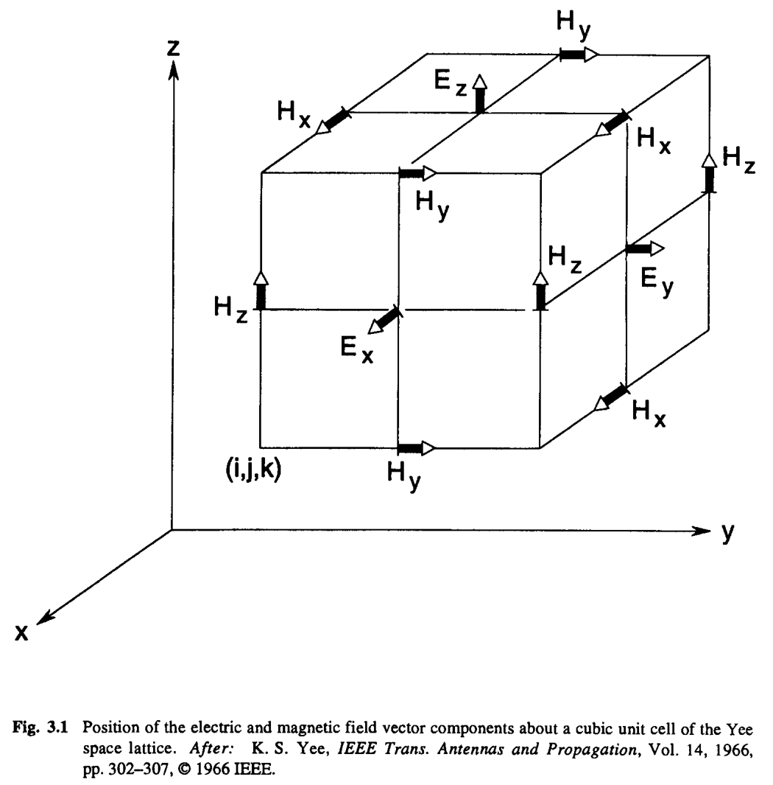

*Fig. 3.1: look at one cube. Each $E$ arrow sits in the middle of a face; each $H$ arrow sits in the middle of an edge. Each component points along its own axis.*

The six field components are **not** stored at the same point. In the book's (2nd-edition) convention, with the cube's corner at $(i,j,k)$:

| Component | Stored at | Where on the cube |
|---|---|---|
| $E_x$ | $(i,\ j+\tfrac12,\ k+\tfrac12)$ | centre of a face normal to $x$ |
| $E_y$ | $(i+\tfrac12,\ j,\ k+\tfrac12)$ | centre of a face normal to $y$ |
| $E_z$ | $(i+\tfrac12,\ j+\tfrac12,\ k)$ | centre of a face normal to $z$ |
| $H_x$ | $(i+\tfrac12,\ j,\ k)$ | middle of an edge along $x$ |
| $H_y$ | $(i,\ j+\tfrac12,\ k)$ | middle of an edge along $y$ |
| $H_z$ | $(i,\ j,\ k+\tfrac12)$ | middle of an edge along $z$ |

(Some other books and codes swap the roles, putting $E$ on edges and $H$ on faces. It is the same idea.)

The result: **every $E$ component is surrounded by four $H$ components that circulate around it, and every $H$ component is surrounded by four $E$ components that circulate around it.** For example, $E_z$ in the middle of the top face is ringed by the four $H_x$ and $H_y$ on the edges of that face. That ring is exactly what you need to compute the curl of $\mathbf{H}$ in the $z$ direction, which is what changes $E_z$ (equation 3.10c).

So space becomes filled with interlocking loops, like the links of chain mail: every $E$ is threaded by an $H$ loop (Ampère's law), and every $H$ is threaded by an $E$ loop (Faraday's law). This gives Yee's grid three bonus properties:

- **Every space derivative is a central difference**, so second-order accurate. The two values in each difference sit exactly half a cell either side of the point being updated.
- **Boundary conditions at material interfaces come out right automatically.** At a flat boundary between two materials, the components of $\mathbf{E}$ and $\mathbf{H}$ that are *parallel* (tangential) to the boundary must be continuous. In Yee's grid, if the interface lies along grid planes, this happens by itself. You only have to assign the right $\varepsilon$ and $\mu$ at each component's location when you set up the problem. A curved surface becomes a **staircase** of cube faces, with steps the size of one cell.
- **No fake charge is ever created.** The placement of the components plus the central differences guarantee that both Gauss laws hold on the grid (proof in §3.6.9). The grid is "divergence-free".

**Idea 3 — Stagger in time: leapfrog (Fig. 3.2).**

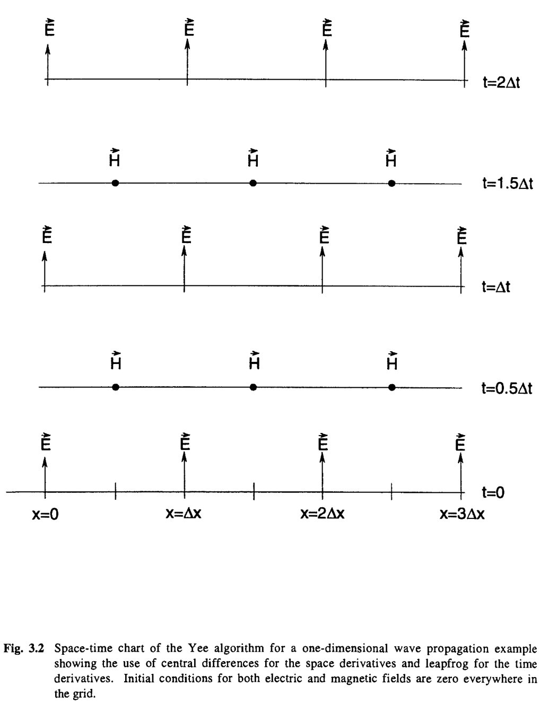

*Fig. 3.2: rows are moments in time, going upward. $E$ rows and $H$ rows alternate, and the $H$ points sit halfway between the $E$ points in space.*

$\mathbf{E}$ and $\mathbf{H}$ are also stored at different *times*, half a step apart. One cycle goes:

1. Using all the $H$ values stored for time $n$, compute every $E$ value in the whole grid for time $n+\tfrac12$. Store them (overwriting the old $E$).
2. Using those brand-new $E$ values, compute every $H$ value for time $n+1$. Store them.
3. Repeat.

Like two children playing leapfrog, $E$ jumps over $H$, then $H$ jumps over $E$.

!!! note "Label mismatch in Fig. 3.2"
    The figure draws $E$ at whole time steps ($t=0, \Delta t, 2\Delta t$) and $H$ at half steps. The equations in §3.6.2–3.6.3 do the opposite ($H$ at $n$, $E$ at $n+\tfrac12$). Only the labels differ. What matters is that the two fields are always half a step apart.

Leapfrogging has three benefits:

- **Fully explicit.** Each new value is computed directly from values already in memory. There are no simultaneous equations and no matrix to invert. This is why FDTD can handle billions of unknowns.
- **Time derivatives are central differences too**, so also second-order accurate.
- **Non-dissipative.** The time stepping does not artificially drain energy, so a wave does not fade away just because of the numerics. (It *does* get small speed errors; that is Chapter 4.)

Here is the same idea drawn cleanly for the 1-D case, showing exactly which values feed each update:

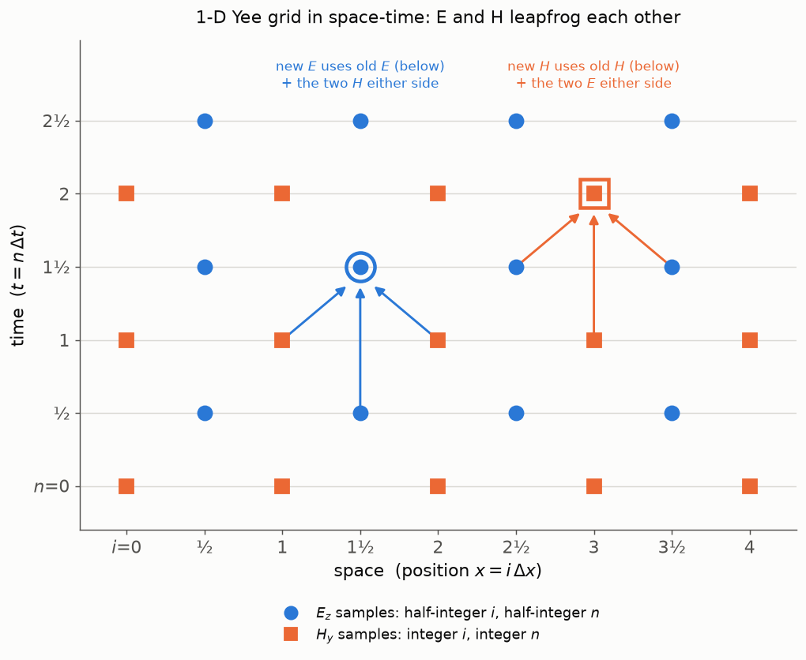

*Blue circles are $E_z$ samples, orange squares are $H_y$ samples. To make the circled new $E$, use the $E$ directly below it (one step earlier) and the two $H$ values on either side, half a step earlier. $H$ is updated the same way.*

### 3.6.2 Finite differences and notation

> **In one sentence:** Yee's central differences take values half a cell (or half a step) either side of the point you want, and this is exactly why $E$ and $H$ end up half a cell apart.

A grid point is

$$(i,j,k) = (i\Delta x,\; j\Delta y,\; k\Delta z) \tag{3.21}$$

and any field $u$ sampled at a grid point and a time step is written

$$u(i\Delta x,\, j\Delta y,\, k\Delta z,\, n\Delta t) = u^{n}_{i,j,k} \tag{3.22}$$

Here $\Delta x,\Delta y,\Delta z$ are the cell sizes, $\Delta t$ is the time step (assumed the same throughout the run), and $i,j,k,n$ are integers (or half-integers).

**Space derivative.** Yee's central difference for the $x$ slope at time $n$ is

$$\frac{\partial u}{\partial x}(i\Delta x, j\Delta y, k\Delta z, n\Delta t) = \frac{u^{n}_{i+\frac12,j,k} - u^{n}_{i-\frac12,j,k}}{\Delta x} + O\!\left[(\Delta x)^2\right] \tag{3.23}$$

In words: to get the slope at $i$, take the value half a cell ahead, subtract the value half a cell behind, and divide by the full distance between them, which is $\Delta x$. The error shrinks like $\Delta x^2$ (from the Taylor argument above).

Why "$\pm\tfrac12$" and not "$\pm 1$"? A difference over $\pm1$ would be $[u_{i+1}-u_{i-1}]/(2\Delta x)$. That is also centred, but it spans twice the distance, so its error is four times bigger. More importantly, the $\pm\tfrac12$ form says something about the grid: the $E$ slope you need for an $H$ update must come from $E$ values that sit half a cell either side of that $H$. So $E$ and $H$ must be interleaved. Slopes in $y$ and $z$ work the same way, shifting $j$ or $k$ by $\pm\tfrac12$.

**Time derivative.** Similarly, at the point $(i,j,k)$ and time $n$:

$$\frac{\partial u}{\partial t}(i\Delta x, j\Delta y, k\Delta z, n\Delta t) = \frac{u^{n+\frac12}_{i,j,k} - u^{n-\frac12}_{i,j,k}}{\Delta t} + O\!\left[(\Delta t)^2\right] \tag{3.24}$$

The time derivative at step $n$ uses values at $n+\tfrac12$ and $n-\tfrac12$. So the field being differentiated in time must live at half steps when the other field lives at whole steps. That is the leapfrog.

### 3.6.3 Finite-difference expressions for Maxwell's equations in three dimensions

> **In one sentence:** Replace every derivative in (3.9)–(3.10) by a Yee central difference, handle the loss term with a clever average, and you get six explicit "new = old + correction" update formulas.

**Worked derivation for $E_x$.** Start from (3.10a):

$$\frac{\partial E_x}{\partial t} = \frac{1}{\varepsilon}\left[\frac{\partial H_z}{\partial y} - \frac{\partial H_y}{\partial z} - \left(J_{source,x} + \sigma E_x\right)\right] \tag{3.10a}$$

Pick one $E_x$ location, $(i,\ j+\tfrac12,\ k+\tfrac12)$, and time step $n$. Replace each derivative by a centred difference:

- $\partial E_x/\partial t$ → $\big(E_x^{n+\frac12} - E_x^{n-\frac12}\big)/\Delta t$ at that location.
- $\partial H_z/\partial y$ → $\big(H_z|_{i,j+1,k+\frac12} - H_z|_{i,j,k+\frac12}\big)/\Delta y$, both at time $n$. Note these two $H_z$ sit exactly half a cell above and below our $E_x$ in $y$.
- $\partial H_y/\partial z$ → $\big(H_y|_{i,j+\frac12,k+1} - H_y|_{i,j+\frac12,k}\big)/\Delta z$, at time $n$.

This gives the raw equation (3.25). **One problem:** the loss term $\sigma E_x$ needs $E_x$ at time $n$. But $E_x$ is only stored at half steps ($n-\tfrac12$ and the not-yet-known $n+\tfrac12$). There is no $E_x^n$ in memory.

**The fix: the semi-implicit approximation.** Estimate the missing value as the average of the one before and the one after:

$$E_x\big|^{n}_{i,j+\frac12,k+\frac12} \approx \frac{E_x\big|^{n+\frac12}_{i,j+\frac12,k+\frac12} + E_x\big|^{n-\frac12}_{i,j+\frac12,k+\frac12}}{2} \tag{3.26}$$

"Semi-implicit" because it involves the unknown future value $E_x^{n+\frac12}$. But the unknown appears only at this *one* location, so a little algebra fixes it. Substitute (3.26), giving (3.27). Now the unknown $E_x^{n+\frac12}$ appears on both sides. Move all the $E_x^{n+\frac12}$ terms to the left (3.28) and divide by $(1 + \sigma\Delta t/2\varepsilon)$. Result:

$$
E_x\big|^{n+\frac12}_{i,j+\frac12,k+\frac12}
= C_a\, E_x\big|^{n-\frac12}_{i,j+\frac12,k+\frac12}
+ C_b \left[
\frac{H_z\big|^{n}_{i,j+1,k+\frac12} - H_z\big|^{n}_{i,j,k+\frac12}}{\Delta y}
- \frac{H_y\big|^{n}_{i,j+\frac12,k+1} - H_y\big|^{n}_{i,j+\frac12,k}}{\Delta z}
- J_{source,x}\big|^{n}_{i,j+\frac12,k+\frac12}
\right] \tag{3.29a}
$$

with the two **updating coefficients**, evaluated with the $\sigma$ and $\varepsilon$ at that $E_x$ location:

$$C_a = \frac{1 - \dfrac{\sigma\Delta t}{2\varepsilon}}{1 + \dfrac{\sigma\Delta t}{2\varepsilon}}, \qquad C_b = \frac{\dfrac{\Delta t}{\varepsilon}}{1 + \dfrac{\sigma\Delta t}{2\varepsilon}}$$

How to read (3.29a): **new $E_x$ = (a fraction $C_a$ of the old $E_x$) + $C_b$ × (the discrete curl of $H$ around it, minus any source current).**

- With no loss ($\sigma=0$): $C_a = 1$ and $C_b = \Delta t/\varepsilon$. Then (3.29a) is exactly "new = old + $\Delta t$ × rate of change", where the rate is the right side of (3.10a).
- With loss: $C_a < 1$, so the old field is partly forgotten each step — the wave decays.
- With huge loss ($\sigma\to\infty$, a perfect conductor): $C_a \to -1$ and $C_b \to 0$. Starting from zero, $E_x$ then stays zero, which is right for a perfect conductor.

The book reports that this semi-implicit trick stays stable and accurate for every conductivity from zero to infinity, while keeping the update explicit.

**All six 3-D updates.** The other five follow the same recipe. For the $H$ updates, swap $\varepsilon\to\mu$, $\sigma\to\sigma^*$, $J\to M$, and move every time index forward by half a step. The $H$ coefficients are

$$D_a = \frac{1 - \dfrac{\sigma^*\Delta t}{2\mu}}{1 + \dfrac{\sigma^*\Delta t}{2\mu}}, \qquad D_b = \frac{\dfrac{\Delta t}{\mu}}{1 + \dfrac{\sigma^*\Delta t}{2\mu}}$$

Here is the full set, using the location table from §3.6.1. Each $C$ or $D$ is evaluated at the location of the component on the left.

$$
E_y\big|^{n+\frac12}_{i+\frac12,j,k+\frac12}
= C_a E_y\big|^{n-\frac12}_{i+\frac12,j,k+\frac12}
+ C_b\left[
\frac{H_x\big|^{n}_{i+\frac12,j,k+1} - H_x\big|^{n}_{i+\frac12,j,k}}{\Delta z}
- \frac{H_z\big|^{n}_{i+1,j,k+\frac12} - H_z\big|^{n}_{i,j,k+\frac12}}{\Delta x}
- J_{source,y}\big|^{n}_{i+\frac12,j,k+\frac12}
\right] \tag{3.29b}
$$

$$
E_z\big|^{n+\frac12}_{i+\frac12,j+\frac12,k}
= C_a E_z\big|^{n-\frac12}_{i+\frac12,j+\frac12,k}
+ C_b\left[
\frac{H_y\big|^{n}_{i+1,j+\frac12,k} - H_y\big|^{n}_{i,j+\frac12,k}}{\Delta x}
- \frac{H_x\big|^{n}_{i+\frac12,j+1,k} - H_x\big|^{n}_{i+\frac12,j,k}}{\Delta y}
- J_{source,z}\big|^{n}_{i+\frac12,j+\frac12,k}
\right] \tag{3.29c}
$$

$$
H_x\big|^{n+1}_{i+\frac12,j,k}
= D_a H_x\big|^{n}_{i+\frac12,j,k}
+ D_b\left[
\frac{E_y\big|^{n+\frac12}_{i+\frac12,j,k+\frac12} - E_y\big|^{n+\frac12}_{i+\frac12,j,k-\frac12}}{\Delta z}
- \frac{E_z\big|^{n+\frac12}_{i+\frac12,j+\frac12,k} - E_z\big|^{n+\frac12}_{i+\frac12,j-\frac12,k}}{\Delta y}
- M_{source,x}\big|^{n+\frac12}_{i+\frac12,j,k}
\right] \tag{3.30a}
$$

$$
H_y\big|^{n+1}_{i,j+\frac12,k}
= D_a H_y\big|^{n}_{i,j+\frac12,k}
+ D_b\left[
\frac{E_z\big|^{n+\frac12}_{i+\frac12,j+\frac12,k} - E_z\big|^{n+\frac12}_{i-\frac12,j+\frac12,k}}{\Delta x}
- \frac{E_x\big|^{n+\frac12}_{i,j+\frac12,k+\frac12} - E_x\big|^{n+\frac12}_{i,j+\frac12,k-\frac12}}{\Delta z}
- M_{source,y}\big|^{n+\frac12}_{i,j+\frac12,k}
\right] \tag{3.30b}
$$

$$
H_z\big|^{n+1}_{i,j,k+\frac12}
= D_a H_z\big|^{n}_{i,j,k+\frac12}
+ D_b\left[
\frac{E_x\big|^{n+\frac12}_{i,j+\frac12,k+\frac12} - E_x\big|^{n+\frac12}_{i,j-\frac12,k+\frac12}}{\Delta y}
- \frac{E_y\big|^{n+\frac12}_{i+\frac12,j,k+\frac12} - E_y\big|^{n+\frac12}_{i-\frac12,j,k+\frac12}}{\Delta x}
- M_{source,z}\big|^{n+\frac12}_{i,j,k+\frac12}
\right] \tag{3.30c}
$$

!!! note "Cross-referencing the book's printed indices"
    The printed book writes each of (3.29a–c) and (3.30a–c) at a *particular* face or edge of the drawn cube in Fig. 3.1. For example, it gives $E_z$ at $(i-\tfrac12, j+\tfrac12, k+1)$ and $H_z$ at $(i, j+1, k+\tfrac12)$. Those are the same components shifted by whole cells. The structure — which neighbours, which signs, which coefficients — is identical to the forms above. The book also writes the coefficients out in full, with $\sigma$, $\varepsilon$, $\mu$ subscripted by location, rather than naming them $C_a, C_b, D_a, D_b$ at this point.

**Checklist for reading any Yee update:**

1. The left side is the new value of one component, half a step after its old value.
2. The first term on the right is that same component's old value, scaled by $C_a$ (or $D_a$).
3. The bracket is a discrete curl: two differences of the *other* field, each across exactly one cell, each centred on the point being updated, both at the half-step in between.
4. The signs in the bracket copy the signs in (3.9)–(3.10).

**Why it can run in parallel.** Each new value needs only (a) its own old value, (b) old values of the other field at neighbouring points, and (c) known sources. It never needs a *new* value of the same field from a neighbour. So all the $E$ updates in a time step can be done in any order, or all at once on $p$ processors, $p$ points at a time. The same is true for all the $H$ updates. This is why FDTD runs so well on GPUs and supercomputers.

### 3.6.4 Space region with a continuous variation of material properties

> **In one sentence:** If every cell can have its own material, precompute two coefficients per field component before time stepping; this costs about 18 numbers per cell.

The coefficients $C_a, C_b, D_a, D_b$ do not change with time. So compute them once, before the loop starts, and store them. In the most general case each component location can have its own $\varepsilon$, $\mu$, $\sigma$, $\sigma^*$:

$$C_a\big|_{i,j,k} = \left(1 - \frac{\sigma_{i,j,k}\Delta t}{2\varepsilon_{i,j,k}}\right)\bigg/\left(1 + \frac{\sigma_{i,j,k}\Delta t}{2\varepsilon_{i,j,k}}\right) \tag{3.31a}$$

$$C_{b1}\big|_{i,j,k} = \left(\frac{\Delta t}{\varepsilon_{i,j,k}\Delta_1}\right)\bigg/\left(1 + \frac{\sigma_{i,j,k}\Delta t}{2\varepsilon_{i,j,k}}\right) \tag{3.31b}$$

$$C_{b2}\big|_{i,j,k} = \left(\frac{\Delta t}{\varepsilon_{i,j,k}\Delta_2}\right)\bigg/\left(1 + \frac{\sigma_{i,j,k}\Delta t}{2\varepsilon_{i,j,k}}\right) \tag{3.31c}$$

and the same for $H$ with $\mu$, $\sigma^*$ (3.32a–c, giving $D_a$, $D_{b1}$, $D_{b2}$).

Here the cell size has been folded *into* the $C_b$ coefficient. $\Delta_1$ and $\Delta_2$ are the two cell sizes that appear in that component's update (for $E_x$: $\Delta y$ and $\Delta z$). For **cubic cells** ($\Delta x = \Delta y = \Delta z = \Delta$), $C_{b1} = C_{b2}$, so only two coefficients per component are needed. The updates then become the compact forms (3.33) for $E$ and (3.34) for $H$, which look like

$$E_x^{\text{new}} = C_a E_x^{\text{old}} + C_b\big(H_z^{\text{up}} - H_z^{\text{down}} + H_y^{\text{back}} - H_y^{\text{front}} - J_{source,x}\Delta\big)$$

(the $-J\Delta$ appears because $C_b$ now contains $1/\Delta$).

**Memory count.** Per cell: 6 field values + 6 components × 2 coefficients = **18 numbers**. For $N$ cells, about $18N$ words of memory.

### 3.6.5 Space region with a finite number of distinct media

> **In one sentence:** If there are only a few different materials, store a small material ID per component instead of full coefficients, cutting memory to about 12 numbers per cell.

Real problems usually contain only a handful of materials (say silicon, oxide, air). Then storing two full-precision coefficients at every point is wasteful. Instead:

- Make a short table: for each material $m = 1, 2, \dots, M$, store $C_a(m), C_b(m), D_a(m), D_b(m)$.
- At each field component location store only an integer $\mathrm{MEDIA}(i,j,k)$, saying which material is there.

The update becomes: look up $m = \mathrm{MEDIA}_{E_x}(i,j,k)$, then

$$E_x^{\text{new}} = C_a(m)\,E_x^{\text{old}} + C_b(m)\,\big(\text{curl of }H - J\Delta\big) \tag{3.35a}$$

and the same pattern for $E_y$, $E_z$ (3.35b,c) and for $H$ (3.36a–c, with $D_a(m), D_b(m)$).

**Memory:** 6 field values + 6 MEDIA integers per cell = about **12N**. The coefficient tables have only $M$ entries each, which is negligible.

**The catch:** every update now does an extra memory fetch (the pointer). On old vector supercomputers such as the Cray this could break the fast vector pipeline unless coded carefully.

**Squeezing further:**

- **Word packing:** store the material integer in the spare bits of the same memory word as its field value. Memory drops to about **6N**, at the cost of extra instructions to pack and unpack each time.
- **Bit packing:** a 64-bit word can hold sixteen 4-bit pointers (each 4-bit pointer selects one of up to $2^4 = 16$ materials). Then one word holds the material IDs for 16 field locations. This cuts the MEDIA storage by a factor of 15/16 (94%). Lawrence Livermore's TSAR code used this.

Today memory is cheap, but on GPUs memory *bandwidth* is often the bottleneck, so these ideas are still alive.

### 3.6.6 Space region with nonpermeable media

> **In one sentence:** If $\mu = \mu_0$ everywhere (true for almost all optics), rescale $E$ so that the $H$ updates need no multiplications at all.

Most problems, including essentially all silicon photonics, are **nonpermeable**: $\mu = \mu_0$ and $\sigma^* = 0$ everywhere. Use cubic cells of side $\Delta$. Define scaled fields:

$$\hat{\mathbf{E}} = \frac{\Delta t}{\mu_0\Delta}\,\mathbf{E}, \qquad \hat{\mathbf{M}} = \frac{\Delta t}{\mu_0\Delta}\,\mathbf{M} \tag{3.37a,b}$$

and a scaled electric coefficient

$$\hat{C}_b(m) = \frac{\Delta t}{\mu_0\Delta}\,C_b(m) \tag{3.38}$$

**$E$ updates (3.39a–c):** same as before, but acting on $\hat{\mathbf{E}}$ with $C_a(m)$ and $\hat{C}_b(m)$.

**$H$ updates (3.40a–c):** look at an $H$ update with $\mu=\mu_0$, $\sigma^*=0$: $D_a = 1$ and the factor in front of each $E$ difference is $\Delta t/(\mu_0\Delta)$. That factor is exactly the scaling we put into $\hat{E}$. So it disappears:

$$H_x^{n+1} = H_x^{n} + \Big(\hat E_y^{\,z+} - \hat E_y^{\,z-}\Big) - \Big(\hat E_z^{\,y+} - \hat E_z^{\,y-}\Big) - \hat M_{source,x} \tag{3.40a}$$

Here "$z+$" and "$z-$" mean the two $\hat{E}_y$ values half a cell either side in $z$, all at time $n+\tfrac12$. The $H$ update is now just additions and subtractions. No multiplications and no MEDIA arrays for $H$. That removes three multiplications per cell per step and half the pointer storage. At output time, recover the physical field by multiplying $\hat{E}$ by $\mu_0\Delta/\Delta t$.

The lesson is general: **choose units so that the commonest coefficients become 1.** The Python example below does the same trick (it scales $H$ by the impedance of free space instead).

### 3.6.7 Reduction to the two-dimensional TM$_z$ and TE$_z$ modes

> **In one sentence:** Set all $z$ slopes to zero in the 3-D Yee updates and you get a 2-D TM$_z$ grid ($E_z$ at cell centres, $H$ on edges) and a 2-D TE$_z$ grid ($H_z$ at corners, $E$ on edges).

Take the 3-D Yee lattice and assume nothing changes along $z$. Then:

1. The set of $(E_z, H_x, H_y)$ components in each horizontal slice $k$ is identical in every slice. One slice is enough. That slice is the **TM$_z$ mode**.
2. The set of $(H_z, E_x, E_y)$ components in each slice $k+\tfrac12$ is also identical from slice to slice. One slice represents the **TE$_z$ mode**.
3. The two sets share no components, so they are completely decoupled.

Drop the $k$ index and all $\partial/\partial z$ differences from (3.35)–(3.36):

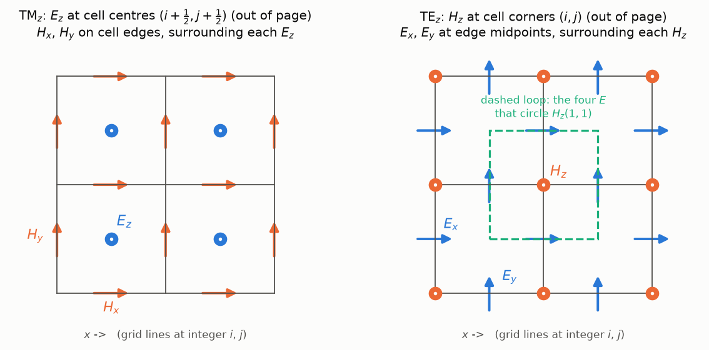

*Left: in TM$_z$ each blue $E_z$ dot (pointing out of the page) is boxed in by four orange $H$ arrows on the cell edges. Right: in TE$_z$ each orange $H_z$ dot is boxed in by four blue $E$ arrows on the dashed loop.*

**TM$_z$ updates** (cubic cells, side $\Delta$; I keep $\Delta$ explicit, while the book folds it into $C_b$ and $D_b$):

$$
E_z\big|^{n+\frac12}_{i+\frac12,j+\frac12}
= C_a(m)\,E_z\big|^{n-\frac12}_{i+\frac12,j+\frac12}
+ C_b(m)\left[
\frac{H_y\big|^{n}_{i+1,j+\frac12} - H_y\big|^{n}_{i,j+\frac12}}{\Delta}
- \frac{H_x\big|^{n}_{i+\frac12,j+1} - H_x\big|^{n}_{i+\frac12,j}}{\Delta}
- J_{source,z}\big|^{n}_{i+\frac12,j+\frac12}
\right] \tag{3.41a}
$$

$$
H_x\big|^{n+1}_{i+\frac12,j}
= D_a(m)\,H_x\big|^{n}_{i+\frac12,j}
+ D_b(m)\left[
-\,\frac{E_z\big|^{n+\frac12}_{i+\frac12,j+\frac12} - E_z\big|^{n+\frac12}_{i+\frac12,j-\frac12}}{\Delta}
- M_{source,x}\big|^{n+\frac12}_{i+\frac12,j}
\right] \tag{3.41b}
$$

$$
H_y\big|^{n+1}_{i,j+\frac12}
= D_a(m)\,H_y\big|^{n}_{i,j+\frac12}
+ D_b(m)\left[
\frac{E_z\big|^{n+\frac12}_{i+\frac12,j+\frac12} - E_z\big|^{n+\frac12}_{i-\frac12,j+\frac12}}{\Delta}
- M_{source,y}\big|^{n+\frac12}_{i,j+\frac12}
\right] \tag{3.41c}
$$

These are (3.13a–c) discretised. Note the minus sign in (3.41b), copied from (3.13a).

**TE$_z$ updates:**

$$
E_x\big|^{n+\frac12}_{i,j+\frac12}
= C_a(m)\,E_x\big|^{n-\frac12}_{i,j+\frac12}
+ C_b(m)\left[
\frac{H_z\big|^{n}_{i,j+1} - H_z\big|^{n}_{i,j}}{\Delta}
- J_{source,x}\big|^{n}_{i,j+\frac12}
\right] \tag{3.42a}
$$

$$
E_y\big|^{n+\frac12}_{i+\frac12,j}
= C_a(m)\,E_y\big|^{n-\frac12}_{i+\frac12,j}
+ C_b(m)\left[
-\,\frac{H_z\big|^{n}_{i+1,j} - H_z\big|^{n}_{i,j}}{\Delta}
- J_{source,y}\big|^{n}_{i+\frac12,j}
\right] \tag{3.42b}
$$

$$
H_z\big|^{n+1}_{i,j}
= D_a(m)\,H_z\big|^{n}_{i,j}
+ D_b(m)\left[
\frac{E_x\big|^{n+\frac12}_{i,j+\frac12} - E_x\big|^{n+\frac12}_{i,j-\frac12}}{\Delta}
- \frac{E_y\big|^{n+\frac12}_{i+\frac12,j} - E_y\big|^{n+\frac12}_{i-\frac12,j}}{\Delta}
- M_{source,z}\big|^{n+\frac12}_{i,j}
\right] \tag{3.42c}
$$

These are (3.14a–c) discretised. TE$_z$ is the "mirror image" (the **dual**) of TM$_z$: swap $\mathbf{E}\leftrightarrow\mathbf{H}$ and $\varepsilon\leftrightarrow\mu$ (with care over signs).

**1-D updates.** Drop the $j$ index too, and keep the $z$-polarised TEM wave (3.16). With $E_z$ at half-integer points and $H_y$ at integer points:

$$
E_z\big|^{n+\frac12}_{i+\frac12}
= C_a\,E_z\big|^{n-\frac12}_{i+\frac12}
+ C_b\left[
\frac{H_y\big|^{n}_{i+1} - H_y\big|^{n}_{i}}{\Delta x}
- J_{source,z}\big|^{n}_{i+\frac12}
\right]
$$

$$
H_y\big|^{n+1}_{i}
= D_a\,H_y\big|^{n}_{i}
+ D_b\left[
\frac{E_z\big|^{n+\frac12}_{i+\frac12} - E_z\big|^{n+\frac12}_{i-\frac12}}{\Delta x}
- M_{source,y}\big|^{n+\frac12}_{i}
\right]
$$

(These are not numbered in the book; they are the 1-D special case it asks you to code in its homework problems.)

#### Worked example: two time steps by hand

Free space, no loss, no sources. Then $C_a = D_a = 1$, $C_b = \Delta t/\varepsilon_0$, $D_b = \Delta t/\mu_0$.

**Clean the units first.** Store $\tilde{H} = \eta_0 H$ instead of $H$, where $\eta_0 = \sqrt{\mu_0/\varepsilon_0}\approx 377\ \Omega$ (the impedance of free space). Then both updates have the same factor:

$$\frac{\Delta t}{\varepsilon_0\,\Delta x}\cdot\frac{1}{\eta_0} = \frac{\Delta t}{\Delta x\sqrt{\mu_0\varepsilon_0}} = \frac{c\,\Delta t}{\Delta x} \equiv S, \qquad \frac{\Delta t}{\mu_0\Delta x}\cdot\eta_0 = S$$

$S$ is the **Courant number**: how many cells light could travel in one time step. The 1-D updates become

$$\tilde H_i \leftarrow \tilde H_i + S\,(E_{i+\frac12} - E_{i-\frac12}), \qquad E_{i+\frac12} \leftarrow E_{i+\frac12} + S\,(\tilde H_{i+1} - \tilde H_i)$$

Take $S = 0.5$. Use four $E_z$ cells at $x = \tfrac12, 1\tfrac12, 2\tfrac12, 3\tfrac12$ and five $\tilde{H}_y$ points at $x = 0,1,2,3,4$. Hold the two end $H$ values at zero (a "magnetic wall"). Start with a single spike: $E = 1$ at $x = 1\tfrac12$, everything else 0.

**Step 1, $H$ update** (uses the starting $E$):

- $\tilde H_1 = 0 + 0.5\,(E_{1\frac12} - E_{\frac12}) = 0.5\,(1 - 0) = 0.5$
- $\tilde H_2 = 0 + 0.5\,(E_{2\frac12} - E_{1\frac12}) = 0.5\,(0 - 1) = -0.5$
- $\tilde H_3 = 0 + 0.5\,(0 - 0) = 0$

**Step 1, $E$ update** (uses the *new* $H$):

- $E_{\frac12} = 0 + 0.5\,(\tilde H_1 - \tilde H_0) = 0.5\,(0.5 - 0) = 0.25$
- $E_{1\frac12} = 1 + 0.5\,(\tilde H_2 - \tilde H_1) = 1 + 0.5\,(-0.5 - 0.5) = 0.5$
- $E_{2\frac12} = 0 + 0.5\,(\tilde H_3 - \tilde H_2) = 0.5\,(0 + 0.5) = 0.25$
- $E_{3\frac12} = 0 + 0.5\,(\tilde H_4 - \tilde H_3) = 0$

The spike has started to spread to both sides: $E = [0.25,\ 0.5,\ 0.25,\ 0]$.

**Step 2:**

| | $x=0$ | $\tfrac12$ | $1$ | $1\tfrac12$ | $2$ | $2\tfrac12$ | $3$ | $3\tfrac12$ | $4$ |
|---|---|---|---|---|---|---|---|---|---|
| $\tilde H$ after step 2 | 0 | | 0.625 | | −0.625 | | −0.125 | | 0 |
| $E$ after step 2 | | 0.5625 | | −0.125 | | 0.5 | | 0.0625 | |

(Check one: $\tilde H_1 = 0.5 + 0.5\,(0.5 - 0.25) = 0.625$, then $E_{\frac12} = 0.25 + 0.5\,(0.625 - 0) = 0.5625$.)

What to notice:

- Information moves at most one cell per half-step update. Nothing can jump across the grid.
- The disturbance moves outward in both directions, as the wave equation says it should.
- The shape is ragged (it even goes negative at $x=1\tfrac12$). A one-cell spike is far too sharp for this grid. It contains wavelengths as short as two cells, which the grid cannot carry correctly. This is **numerical dispersion**, the topic of Chapter 4. Smooth pulses spanning many cells, like the Gaussian below, travel cleanly.

#### A runnable 1-D Yee FDTD loop

```python
import numpy as np
import matplotlib.pyplot as plt

# ---- grid and time step ----------------------------------------------------
N = 400            # number of E_z cells; E_z[k] lives at x = (k + 1/2) * dx
S = 0.5            # Courant number  S = c*dt/dx  (must be <= 1 in 1-D)
steps = 500

ez = np.zeros(N)       # E_z at half-integer points  i + 1/2
hy = np.zeros(N + 1)   # H_y at integer points i (scaled: hy = eta0 * H_y)

# initial condition: a Gaussian bump of E_z in the middle, H_y = 0
k = np.arange(N)
ez[:] = np.exp(-((k - N / 2) / 12.0) ** 2)

snapshots = {0: ez.copy()}
for n in range(1, steps + 1):
    # H update (3.16a): new H = old H + S * (E on the right - E on the left)
    # hy[0] and hy[N] are never touched, so they stay 0 (a "magnetic wall").
    hy[1:N] += S * (ez[1:N] - ez[0:N - 1])
    # E update (3.16b): new E = old E + S * (H on the right - H on the left)
    ez[:] += S * (hy[1:N + 1] - hy[0:N])
    if n in (100, 200, 500):
        snapshots[n] = ez.copy()

# ---- look at the result ----------------------------------------------------
for n, e in snapshots.items():
    plt.plot(k + 0.5, e, label=f"step {n}")
plt.xlabel("position (cells)"); plt.ylabel("E_z")
plt.legend(); plt.show()
```

How the code maps to the equations:

- `ez[k]` is $E_z\big|_{k+\frac12}$ and `hy[k]` is $\eta_0 H_y\big|_{k}$. So `ez[k] - ez[k-1]` is $E_{k+\frac12} - E_{k-\frac12}$, the centred difference around `hy[k]`. And `hy[k+1] - hy[k]` is the centred difference around `ez[k]`.
- The order inside the loop *is* the leapfrog: first all of $H$ from the current $E$, then all of $E$ from the just-updated $H$.
- NumPy slicing updates the whole array at once. This works because, as §3.6.3 said, no $H$ update needs another new $H$.

**What you should see:**

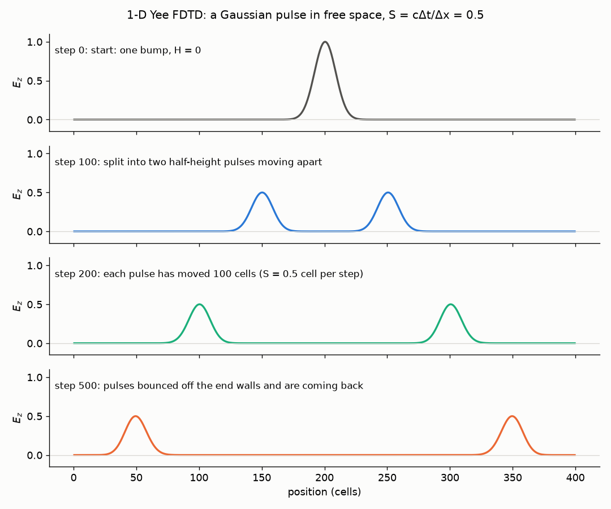

*The single bump splits into two half-height copies that move apart at half a cell per step, bounce off the end walls without flipping sign, and come back.*

- **Splitting.** The initial bump has $E$ but no $H$. That is not a single travelling wave. It is the sum of a right-moving and a left-moving wave, each half the height. (This is the d'Alembert solution of the wave equation.)
- **Correct speed.** With $S = 0.5$ the pulse moves 0.5 cells per step: 50 cells after 100 steps, 100 cells after 200 steps. Light covers $c\,\Delta t = 0.5\,\Delta x$ per step, so this is right.
- **Shape kept.** The pulse spans about 20 cells, so it is well resolved and keeps its shape.
- **Reflection.** The ends hold $H = 0$, which acts like a perfect *magnetic* conductor. The $E$ pulse comes back with the same sign. (Holding $E = 0$ at the ends instead would mimic a metal wall, and the $E$ pulse would flip sign.) In a real simulation you want the waves to leave, not bounce back. That is the job of absorbing boundaries such as the **PML** (Chapter 7).
- **Try the Courant limit.** Change `S` to `1.0`: still fine (in 1-D, $S=1$ is the "magic time step" where the update is exact). Change it to `1.01` and run 1500 steps: the field grows to about $10^{167}$ — the simulation has exploded. This is the instability that the **Courant condition** ($S \le 1$ in 1-D, $S\le 1/\sqrt{2}$ in 2-D, $S \le 1/\sqrt{3}$ in 3-D, for square/cubic cells) prevents. Chapter 4, §4.7 derives it.

### 3.6.8 Interpretation as Faraday's and Ampere's laws in integral form

> **In one sentence:** Each Yee update is also exactly what you get by applying Ampère's or Faraday's law around one small square loop of the grid, which is why the grid handles awkward geometry so naturally.

So far we got the Yee updates by replacing derivatives with differences. That view tells you little about how to handle tricky features smaller than a cell: thin wires, narrow slots, curved surfaces. A second view helps: think in **loops**.

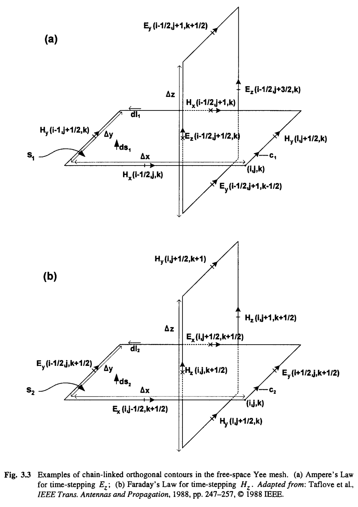

*Fig. 3.3: (a) a horizontal square loop $C_1$ made of four $H$ components threads the $E_z$ at its centre — Ampère's law. (b) A horizontal loop $C_2$ made of four $E$ components threads the $H_z$ at its centre — Faraday's law. Each vertical loop links through the horizontal one like chain links.*

Space is filled with small square loops, all at right angles to each other and interlocking like chain links. The loops made of $H$ components update $E$ (Ampère). The loops made of $E$ components update $H$ (Faraday). This lets you think in physical quantities:

- **EMF** (electromotive force) is the circulation of $\mathbf{E}$ round a loop. **MMF** (magnetomotive force) is the circulation of $\mathbf{H}$.
- **Magnetic flux** is $\mathbf{B}$ summed over the patch inside a loop. **Displacement current** is $\partial\mathbf{D}/\partial t$ summed over a patch.

**Deriving the $E_z$ update from Ampère's law.** Take lossless free space with no sources. Ampère's law in integral form around loop $C_1$ bounding patch $S_1$ (Fig. 3.3a):

$$\frac{\partial}{\partial t}\iint_{S_1}\mathbf{D}\cdot d\mathbf{S}_1 = \oint_{C_1}\mathbf{H}\cdot d\boldsymbol{\ell}_1 \tag{3.43a}$$

Assume the field value at the middle of each side equals the average along that side. The loop has four sides of length $\Delta x$ or $\Delta y$. Walking round it anticlockwise (seen from above), the circulation is:

$$\frac{\partial}{\partial t}\iint_{S_1}\varepsilon_0 E_z\big|_{i-\frac12,j+\frac12,k}\,dS_1 \cong H_x\big|_{i-\frac12,j,k}\Delta x + H_y\big|_{i,j+\frac12,k}\Delta y - H_x\big|_{i-\frac12,j+1,k}\Delta x - H_y\big|_{i-1,j+\frac12,k}\Delta y \tag{3.43b}$$

The two minus signs are the sides where you walk against the arrow direction. Now assume $E_z$ at the centre equals its average over the patch (area $\Delta x\Delta y$), and use a central difference in time:

$$\varepsilon_0\,\Delta x\,\Delta y\,\frac{E_z\big|^{n+\frac12}_{i-\frac12,j+\frac12,k} - E_z\big|^{n-\frac12}_{i-\frac12,j+\frac12,k}}{\Delta t} = \Big(H_x\big|^n_{i-\frac12,j,k} - H_x\big|^n_{i-\frac12,j+1,k}\Big)\Delta x + \Big(H_y\big|^n_{i,j+\frac12,k} - H_y\big|^n_{i-1,j+\frac12,k}\Big)\Delta y \tag{3.43c}$$

Multiply by $\Delta t/(\varepsilon_0\Delta x\Delta y)$ and solve for the new value:

$$E_z\big|^{n+\frac12}_{i-\frac12,j+\frac12,k} = E_z\big|^{n-\frac12}_{i-\frac12,j+\frac12,k} + \Big(H_x\big|^n_{i-\frac12,j,k} - H_x\big|^n_{i-\frac12,j+1,k}\Big)\frac{\Delta t}{\varepsilon_0\Delta y} + \Big(H_y\big|^n_{i,j+\frac12,k} - H_y\big|^n_{i-1,j+\frac12,k}\Big)\frac{\Delta t}{\varepsilon_0\Delta x} \tag{3.44}$$

Compare with (3.29c) with $\sigma = 0$ and $\varepsilon = \varepsilon_0$: it is the same formula (just written at a shifted $E_z$ location). The $\Delta x$ from the side length and the $\Delta x\Delta y$ from the area combine to give exactly the $1/\Delta y$ and $1/\Delta x$ of the finite differences.

**Deriving the $H_z$ update from Faraday's law.** The same steps round loop $C_2$ of $E$ components (Fig. 3.3b):

$$\frac{\partial}{\partial t}\iint_{S_2}\mathbf{B}\cdot d\mathbf{S}_2 = -\oint_{C_2}\mathbf{E}\cdot d\boldsymbol{\ell}_2 \tag{3.45a}$$

$$\frac{\partial}{\partial t}\iint_{S_2}\mu_0 H_z\big|_{i,j,k+\frac12}\,dS_2 \cong -E_x\big|_{i,j-\frac12,k+\frac12}\Delta x - E_y\big|_{i+\frac12,j,k+\frac12}\Delta y + E_x\big|_{i,j+\frac12,k+\frac12}\Delta x + E_y\big|_{i-\frac12,j,k+\frac12}\Delta y \tag{3.45b}$$

$$\mu_0\,\Delta x\,\Delta y\,\frac{H_z\big|^{n+1}_{i,j,k+\frac12} - H_z\big|^{n}_{i,j,k+\frac12}}{\Delta t} = \Big(E_x\big|^{n+\frac12}_{i,j+\frac12,k+\frac12} - E_x\big|^{n+\frac12}_{i,j-\frac12,k+\frac12}\Big)\Delta x + \Big(E_y\big|^{n+\frac12}_{i-\frac12,j,k+\frac12} - E_y\big|^{n+\frac12}_{i+\frac12,j,k+\frac12}\Big)\Delta y \tag{3.45c}$$

$$H_z\big|^{n+1}_{i,j,k+\frac12} = H_z\big|^{n}_{i,j,k+\frac12} + \Big(E_x\big|^{n+\frac12}_{i,j+\frac12,k+\frac12} - E_x\big|^{n+\frac12}_{i,j-\frac12,k+\frac12}\Big)\frac{\Delta t}{\mu_0\Delta y} + \Big(E_y\big|^{n+\frac12}_{i-\frac12,j,k+\frac12} - E_y\big|^{n+\frac12}_{i+\frac12,j,k+\frac12}\Big)\frac{\Delta t}{\mu_0\Delta x} \tag{3.46}$$

This is the free-space version of (3.30c). Check: it matches the $H_z$ update above with $D_a = 1$, $D_b = \Delta t/\mu_0$.

**Why the loop view matters.** The two views give identical equations on a regular grid. But the loop view tells you what to do when the grid is *not* regular. If a thin wire passes through a cell, you know $H$ circles it like $1/r$, so you can put that knowledge into the loop integral. If a curved metal surface cuts through a loop, you can shrink the loop to the part outside the metal. The book develops these "contour-path" methods in Chapter 10. Many modern photonics codes use the same idea for **conformal** (sub-pixel) meshing, which removes most of the staircase error.

### 3.6.9 Divergence-free nature

> **In one sentence:** On Yee's grid the net flux of $\mathbf{D}$ out of every cell never changes, so if it starts at zero (no charge), it stays exactly zero forever — the grid obeys Gauss' law automatically.

Any grid solver of the curl equations must also respect Gauss' laws (3.3) and (3.4): no electric charge can appear in a source-free region, and magnetic charge can never appear. A bad scheme can slowly build up fake "charge" that ruins the answer. Yee's scheme cannot.

**The idea of the proof.** Take one Yee cell. Its six faces each hold one $E$ component (pointing straight out through that face). The total electric flux out of the cell is the sum of (normal $D$ × face area):

$$\oint_{\text{cell}}\mathbf{D}\cdot d\mathbf{S} = \varepsilon\Big[(E_x^{\text{front}} - E_x^{\text{back}})\,\Delta y\,\Delta z + (E_y^{\text{right}} - E_y^{\text{left}})\,\Delta x\,\Delta z + (E_z^{\text{top}} - E_z^{\text{bottom}})\,\Delta x\,\Delta y\Big]$$

Take its time derivative (3.47). Into each $\partial E/\partial t$, substitute the Yee update (3.29): each one is a pair of $H$ differences. This gives three terms (3.48a–c), each a combination of $H$ values on the cell's 12 edges. Now look at any one edge $H$ value. It sits on the boundary of exactly two faces of the cell. It appears once in the update of each of those two faces' $E$, and the two appearances have **opposite signs**. So when you add everything up, every $H$ value cancels with its partner:

$$\frac{\partial}{\partial t}\oint_{\text{cell}}\mathbf{D}\cdot d\mathbf{S} = (\text{Term 1})\Delta y\Delta z + (\text{Term 2})\Delta x\Delta z + (\text{Term 3})\Delta x\Delta y = 0 \tag{3.49}$$

for every time step. So the flux out of each cell never changes. If the simulation starts with zero fields (zero flux),

$$\oint_{\text{cell}}\mathbf{D}(t)\cdot d\mathbf{S} = \oint_{\text{cell}}\mathbf{D}(0)\cdot d\mathbf{S} = 0 \tag{3.50}$$

for all time. Gauss' law holds exactly on every cell, and therefore on the whole grid.

**A shorter way to see it.** Write $\delta_x$ for "difference across one cell in $x$, divided by $\Delta x$", and similarly $\delta_y$, $\delta_z$. The Yee update makes $\partial\mathbf{E}/\partial t$ equal to a *discrete curl* built from these $\delta$'s. The flux out of a cell is a *discrete divergence*. So the time derivative of the flux is

$$\delta_x(\delta_y H_z - \delta_z H_y) + \delta_y(\delta_z H_x - \delta_x H_z) + \delta_z(\delta_x H_y - \delta_y H_x)$$

Differences in different directions commute ($\delta_x\delta_y = \delta_y\delta_x$, just like you can do "step right then up" or "up then right"). So the six terms cancel in pairs and the total is zero. This is the discrete copy of the identity "divergence of a curl is zero". The staggered placement is what makes the differences line up so that the cancellation is *exact*, not just approximate.

The proof for $\nabla\cdot\mathbf{B} = 0$ is the same with $\mathbf{E}$ and $\mathbf{H}$ swapped (it is homework problem 3.12 in the book).

## 3.7 Alternative finite-difference grids

> **In one sentence:** Yee's cubic grid is not the only option; other arrangements, especially hexagonal ones, can make the wave speed less dependent on direction, but are harder to build.

Yee's lattice is one choice among many. Two things decide whether a grid is good:

1. **Geometry:** how well can it represent the shape of the device?
2. **Wave accuracy:** how faithfully does it carry waves?

A key measure of (2) is **numerical phase-velocity anisotropy**. On a grid, a wave's speed depends slightly on its direction (along an axis vs. along a diagonal). Real space has no preferred direction, so this is purely a numerical artefact. Chapter 4, §4.5, calculates it.

### 3.7.1 Cartesian grids

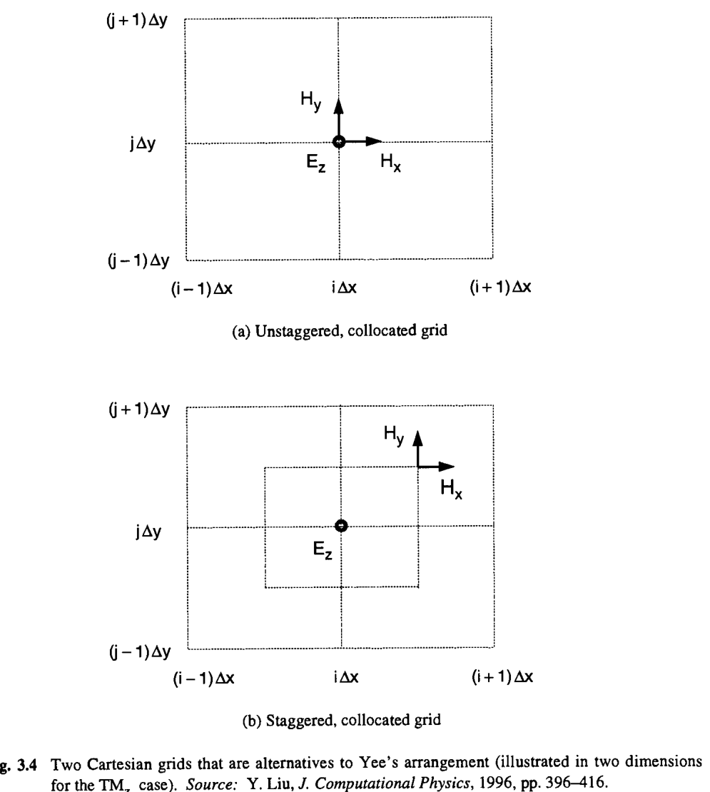

*Fig. 3.4: (a) all three components $E_z, H_x, H_y$ stored at the same corner point; (b) all $E$ at one set of points and all $H$ at another set, shifted half a cell diagonally.*

Two square-grid alternatives to Yee, shown for TM$_z$:

**(a) Unstaggered, collocated grid.** "Collocated" means all components share the same points. Every field is at every grid corner. To get a centred slope at a point, you must use the neighbours one *full* cell away on each side, so each difference spans $2\Delta$:

$$\frac{\partial H_x}{\partial t}\Big|_{i,j} = -\frac{1}{\mu_{i,j}}\left(\frac{E_z|_{i,j+1} - E_z|_{i,j-1}}{2\Delta y}\right) \tag{3.51a}$$

$$\frac{\partial H_y}{\partial t}\Big|_{i,j} = \frac{1}{\mu_{i,j}}\left(\frac{E_z|_{i+1,j} - E_z|_{i-1,j}}{2\Delta x}\right) \tag{3.51b}$$

$$\frac{\partial E_z}{\partial t}\Big|_{i,j} = \frac{1}{\varepsilon_{i,j}}\left(\frac{H_y|_{i+1,j} - H_y|_{i-1,j}}{2\Delta x} - \frac{H_x|_{i,j+1} - H_x|_{i,j-1}}{2\Delta y}\right) \tag{3.51c}$$

A wider stencil means a bigger error constant (the $h^2/24$ becomes $4h^2/24$).

**(b) Staggered, collocated grid.** All $E$ components at one set of points; all $H$ components together at a second set, shifted half a cell diagonally. Now $H_x$ needs an $E_z$ slope in $y$, but the $E_z$ points are diagonal neighbours, so you have to average pairs of $E_z$ values first (system 3.52a–c). The averaging blurs the result.

**Result.** To keep the direction-dependence of wave speed below 0.1%, you need about:

| Grid | Points per free-space wavelength |
|---|---|
| (a) unstaggered, collocated | 58 |
| (b) staggered, collocated | 41 |
| **Yee** | **29** |

Yee's grid needs the fewest points, so it is the most accurate (and cheapest) of the three. Putting each component exactly where its own curl loop needs it pays off.

### 3.7.2 Hexagonal grids

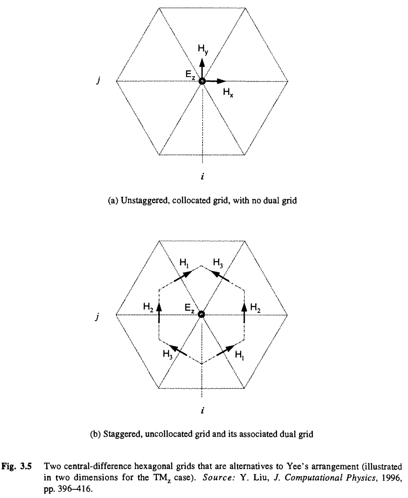

*Fig. 3.5: (a) all components at the corners of equilateral triangles; (b) Yee-style staggering on a hexagon: $E_z$ in the centre, ringed by six $H$ components along the edges of a smaller dual hexagon.*

A hexagonal grid looks "the same" in six directions instead of four, so it treats directions more evenly. The **primary grid** is made of regular hexagons with side $\Delta s$, each split into six equilateral triangles. Joining the centres of those triangles gives a second set of hexagons, the **dual grid**.

**(a) Unstaggered, collocated:** $E_z$, $H_x$, $H_y$ all at the triangle corners. No dual grid. Central differences give system (3.53).

**(b) Staggered, uncollocated:** $E_z$ at the triangle corners (which are the centres of the dual hexagons). The magnetic components $H_1, H_2, H_3$ lie along the edges of the dual hexagons, at their midpoints (which is also at right angles to, and centred on, the triangle edges). Each $E_z$ is ringed by six $H$ components. This is Yee's interlocking-loop idea moved onto hexagons. Central differences give system (3.54).

**Trade-offs:**

- Grid (b) has 33% more unknowns than (a) but simpler formulas, and needs about 50% fewer arithmetic operations in total.
- At 20 points per wavelength, the direction-dependence of wave speed is about **1/200** of Yee's for grid (a) and **1/1200** of Yee's for grid (b). That is a huge potential gain in accuracy. (Chapter 4, §4.9.3, returns to this.)

### 3.7.3 Tetradecahedron / dual-tetrahedron mesh in three dimensions

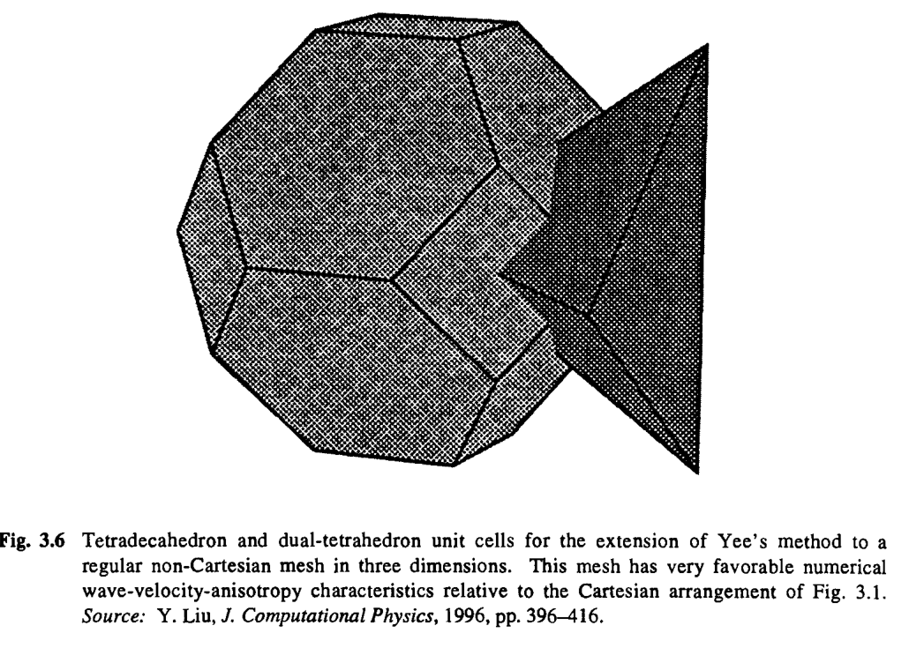

*Fig. 3.6: the large 14-faced cell (6 squares + 8 hexagons) is the primary cell; the sharp tetrahedron is one cell of the dual mesh.*

In 3-D, Yee's grid is a stack of rectangular bricks. That is very convenient: you can work out where every component is with pencil and paper. But §3.7.2 suggests other cell shapes could be more accurate.

A cell shape is only usable if copies of it can fill space with no gaps. Besides the brick (hexahedron), the space-filling shapes include the **tetradecahedron** (a "truncated octahedron", with 6 square and 8 regular-hexagon faces), the hexagonal prism, the rhombic dodecahedron and the elongated rhombic dodecahedron.

The 3-D version of the hexagonal grid (b) is the **tetradecahedron / dual-tetrahedron** mesh. The primary cells are tetradecahedra. The dual cells are tetrahedra whose faces are isosceles triangles (sides in the ratio $\sqrt3 : 2$). Yee's method extends to it with a centred scheme having **19 unknowns per unit cell**: 12 on the edges of the tetradecahedron and 7 on the edges of the dual tetrahedron. Its wave-speed anisotropy is very small compared with Yee's bricks.

So why does nobody use it? **Building the mesh is hard.** It was rarely used when the book was written, and the authors expected that to change as automatic mesh-generation software improves. In practice, today's mainstream photonics FDTD tools still use Yee's bricks, and fight the anisotropy simply by using more points per wavelength.

## 3.8 Summary

> **In one sentence:** Chapter 3 goes from Maxwell's equations to a complete, practical recipe — Yee's staggered, leapfrogging grid — that the rest of the book builds on.

The chapter covered:

- Maxwell's equations in 3-D, in differential and integral form, with simple lossy materials (§3.2).
- Reduction to 2-D TM$_z$ and TE$_z$ modes (§3.3) and to 1-D TEM plane waves (§3.4).
- Proof that the 1-D equations are equivalent to the wave equation, with wave speed $c = 1/\sqrt{\mu\varepsilon}$ (§3.5).
- The Yee algorithm (§3.6): its three basic ideas; notation and central differences; the full 3-D update equations with the semi-implicit treatment of loss; storage-saving versions for continuously varying media (18N), a few distinct media (12N, 6N), and nonmagnetic media (scaled fields); reduction to 2-D; the loop (Faraday/Ampère) interpretation; and the proof that the grid is divergence-free.
- Alternative grids: Cartesian, hexagonal and tetradecahedral (§3.7).

**The book's homework problems** (useful to try): prove Gauss' laws follow from the curl equations; derive the wave equation for the $y$-polarised mode; write a 1-D code with a metal (PEC) end and then a magnetic (PMC) end and compare reflections; rerun with $\Delta t = 0.99$, $1.0$ and $1.01\,\Delta x/c$ (stability!); write 2-D TM$_z$ and TE$_z$ codes and check the circular symmetry of an outgoing wave; add conductivity and watch the wave decay; check that the computed $H$ stays divergence-free.

---

!!! warning "Common confusions"
    - **"E and H are stored at the same point."** No. They are half a cell apart in space and half a step apart in time. When you plot or combine them (for example to compute power flow $\mathbf{E}\times\mathbf{H}$), you must interpolate one onto the other's location and time.
    - **"Second-order accurate means the answer is accurate."** It means the error *shrinks* like $\Delta^2$ as you refine the grid. On a coarse grid the error can still be large. You must still check convergence by refining the grid.
    - **"Smaller $\Delta t$ is always better."** Up to a point. $\Delta t$ must be small enough for stability (Courant, Ch. 4). But making it much smaller than needed just costs more steps, and does not fix the error from the space grid.
    - **"The Courant condition is in Chapter 3."** It is not; it is derived in Chapter 4, §4.7. Chapter 3 only shows the update equations. If you use them with too large a time step (in 1-D, $c\,\Delta t > \Delta x$), the numbers blow up exponentially.
    - **"The grid edge is a boundary condition I don't need to think about."** Simply stopping the grid creates a mirror (a perfect electric or magnetic wall). Waves bounce back and pollute the result. Absorbing boundaries (PML, Chapter 7) are essential.
    - **"FDTD solves the wave equation."** Yee's FDTD solves the two coupled first-order curl equations. The wave equation is a consequence (§3.5), not what the code steps.
    - **"Gauss' law must be enforced separately."** On Yee's grid it holds automatically (§3.6.9), as long as the fields start divergence-free and sources are added consistently.
    - **"TE and TM mean the same thing everywhere."** TE$_z$/TM$_z$ here are named relative to the invariant $z$ axis. Waveguide books may use the propagation direction or the chip plane. Check the reference axis.
    - **"$C_a$ and $C_b$ are physics constants."** They are numerical coefficients that combine $\Delta t$, $\varepsilon$ and $\sigma$ at one grid location. Change $\Delta t$ and they change.
    - **"Curved surfaces are modelled exactly."** In basic Yee FDTD they become staircases. The staircase error only falls as the cells shrink; conformal (contour-path) methods (Ch. 10) do better.

## Check yourself

**1.** In Yee's grid, which field components surround an $E_z$ component, and why does that arrangement make sense?

??? note "Answer"
    Four $H$ components: two $H_x$ and two $H_y$, on the edges of the face where $E_z$ sits, forming a little loop around it. Ampère's law (3.10c) says $\partial E_z/\partial t$ is set by $\partial H_y/\partial x - \partial H_x/\partial y$, which is the circulation of $\mathbf{H}$ round a loop in the $xy$ plane. The four surrounding $H$ values are exactly what is needed to compute that circulation with centred differences.

**2.** Use Taylor series to explain why $[u(x+h/2) - u(x-h/2)]/h$ is more accurate than $[u(x+h) - u(x)]/h$.

??? note "Answer"
    In the central form, the expansions of $u(x\pm h/2)$ have $u''$ terms with the same sign (because $(\pm h/2)^2$ is the same), so they cancel when you subtract. The first surviving error is $h^2 u'''/24$: error $O(h^2)$. In the forward form the $h u''/2$ term survives: error $O(h)$. Halving $h$ cuts the central error by 4, the forward error only by 2.

**3.** What does "leapfrog" mean in the Yee algorithm, and why does it avoid solving matrix equations?

??? note "Answer"
    $E$ is stored at half steps ($n\pm\tfrac12$) and $H$ at whole steps ($n$). You update all $E$ to $n+\tfrac12$ using the known $H$ at $n$, then all $H$ to $n+1$ using the just-computed $E$. Every value needed on the right side is already in memory, so each new value is computed directly. No simultaneous equations appear, so no matrix has to be inverted (the scheme is *explicit*).

**4.** Why is the loss term $\sigma E_x$ a problem in the $E_x$ update, and how does (3.26) solve it?

??? note "Answer"
    The centred time difference is evaluated at time $n$, so the loss term needs $E_x^n$. But $E_x$ is only stored at half steps. (3.26) approximates $E_x^n$ as the average of $E_x^{n-\frac12}$ (known) and $E_x^{n+\frac12}$ (unknown). The unknown appears only at that same point, so you can collect it on the left side and divide. The result stays explicit and gives the coefficients $C_a$ and $C_b$.

**5.** What are $C_a$ and $C_b$ when $\sigma = 0$? What happens to $C_a$ as $\sigma\to\infty$, and what does that mean physically?

??? note "Answer"
    With $\sigma = 0$: $C_a = 1$ and $C_b = \Delta t/\varepsilon$, so the update is simply old value + $\Delta t$ × rate of change. As $\sigma\to\infty$: $C_a\to -1$ and $C_b\to 0$. The curl of $H$ no longer drives $E_x$; starting from zero, $E_x$ stays zero, which is the behaviour of a perfect electric conductor.

**6.** Starting from the full six equations, which components survive in the TM$_z$ mode? Why are TM$_z$ and TE$_z$ independent?

??? note "Answer"
    TM$_z$ keeps $E_z$, $H_x$, $H_y$. With $\partial/\partial z = 0$, the equations for these three involve only each other; the equations for $E_x$, $E_y$, $H_z$ (TE$_z$) also involve only each other. No equation links a member of one set to a member of the other, so they evolve independently (for isotropic media, or anisotropic media with no off-diagonal terms).

**7.** Show in two lines how the 1-D pair (3.16) gives the wave equation, and state the wave speed.

??? note "Answer"
    Differentiate $\partial H_y/\partial t = (1/\mu)\partial E_z/\partial x$ in time, and $\partial E_z/\partial t = (1/\varepsilon)\partial H_y/\partial x$ in $x$. The mixed derivative $\partial^2 E_z/\partial t\partial x$ is common to both, so $\partial^2 H_y/\partial t^2 = (1/\mu\varepsilon)\partial^2 H_y/\partial x^2$. The speed is $c = 1/\sqrt{\mu\varepsilon}$, which is $3\times10^8$ m/s in vacuum.

**8.** In the 1-D example with $S = c\Delta t/\Delta x = 0.5$, how far does the pulse move in 300 steps? What would you see with $S = 1.01$?

??? note "Answer"
    $0.5$ cells per step × 300 steps = 150 cells. With $S = 1.01$ the time step breaks the Courant limit ($S\le1$ in 1-D). Small errors grow by a constant factor every step, so the field grows exponentially and soon overflows (about $10^{167}$ after 1500 steps in the example). The limit is derived in Chapter 4, §4.7.

**9.** How does the "loop" (integral) view of §3.6.8 give the same $E_z$ update as the finite-difference view? Why is the loop view useful?

??? note "Answer"
    Apply Ampère's law round the square loop of four $H$ components around $E_z$: the circulation is the sum of (side $H$ × side length); the rate of change of flux is $\varepsilon_0\Delta x\Delta y\,\partial E_z/\partial t$. Divide by the area and use a centred time difference: the side lengths and area combine to give $1/\Delta x$ and $1/\Delta y$, exactly the finite-difference formula (3.44 = free-space 3.29c). The loop view is useful because it tells you how to modify the update when the loop is cut by a curved surface or threaded by a wire, slot or sharp edge (Chapter 10).

**10.** In one paragraph: why is the Yee grid "divergence-free"?

??? note "Answer"
    The flux of $\mathbf{D}$ out of a cell is the sum of the six face-centred $E$ values times their face areas. Its time derivative, using the Yee updates, is a sum of $H$ differences around the 12 cell edges. Each edge $H$ appears twice with opposite signs (once for each of the two faces sharing that edge), so everything cancels. Equivalently, the discrete divergence of the discrete curl is zero because differences in different directions commute. So the flux never changes; starting at zero, it stays exactly zero.

**11.** Why does Yee's grid need fewer points per wavelength (29) than the unstaggered collocated grid (58) for the same 0.1% anisotropy?

??? note "Answer"
    In the collocated grid, a centred derivative has to use neighbours a full cell away on each side, spanning $2\Delta$. In Yee's grid, the other field is stored exactly half a cell away, so each derivative spans only $\Delta$. A shorter centred stencil has a smaller error (the $h^2$ error term is four times smaller), so fewer points per wavelength give the same accuracy.

**12.** What is the advantage of the scaled field $\hat{\mathbf{E}} = (\Delta t/\mu_0\Delta)\mathbf{E}$ in nonpermeable media?

??? note "Answer"
    With $\mu = \mu_0$ and $\sigma^* = 0$, every $H$ update multiplies $E$ differences by the same factor $\Delta t/(\mu_0\Delta)$. Putting that factor into the stored $E$ makes the $H$ updates pure additions and subtractions: three fewer multiplications per cell per step, and no material pointer arrays for $H$. You multiply back at output time to get physical $E$.

## Key takeaways

- FDTD simulates light by brute force: chop space into cells, chop time into ticks, and repeatedly apply Maxwell's two **curl equations** as local update rules.
- The six scalar equations (3.9)–(3.10) are the whole engine. Gauss' laws are not imposed; they follow automatically.
- If nothing varies along $z$, 3-D splits into two independent 2-D problems: **TM$_z$** ($E_z, H_x, H_y$) and **TE$_z$** ($H_z, E_x, E_y$). If nothing varies along $y$ either, you get a 1-D plane wave obeying the wave equation with speed $c = 1/\sqrt{\mu\varepsilon}$.
- **Yee's space staggering:** each $E$ is ringed by four $H$ and vice versa. This makes every space derivative a centred (second-order) difference, gets interface conditions right, and keeps the grid exactly divergence-free.
- **Yee's time staggering (leapfrog):** $E$ at half steps, $H$ at whole steps. Fully explicit (no matrices), second-order, and non-dissipative.
- Every update reads: **new = $C_a$ × old + $C_b$ × (discrete curl of the other field − source)**. $C_a$ and $C_b$ carry the material and the loss (via the semi-implicit average).
- Memory tricks (material IDs, scaled fields) matter for big runs: about 18N → 12N → 6N words.
- The same updates come from applying Faraday's and Ampère's laws round tiny interlocking loops; that view is the key to handling wires, slots and curved surfaces.
- Other grids (hexagonal, tetradecahedral) can reduce direction-dependent speed errors, but Yee's brick grid remains the standard because it is simple to build.
- **Where it fails (coming next):** numerical dispersion and anisotropy (Ch. 4), instability if $c\Delta t$ is too large (Courant condition, Ch. 4 §4.7), reflections from grid edges (PML, Ch. 7), and staircase errors on curved surfaces (Ch. 10).
