# Week 1 · Day 4 — Thursday 24 Sep 2026 · Taflove Ch. 4

*Simple-English study version of Taflove & Hagness, Computational Electrodynamics: The Finite-Difference Time-Domain Method (2nd ed.), Chapter 4 — Numerical dispersion and stability*

---

!!! abstract "What today's slot asks"
    **Morning 06:15–07:45 · "Taflove ch. 3: Yee grid, Courant condition, PML — *why* FDTD works and when it fails."**

    This page is the **second half** of that slot. The first half, Maxwell's equations and the Yee grid, is on the sibling page [Taflove Ch. 3 — Yee grid](day-04-thu-24-sep-2026-taflove-ch3.md). The two topics here, the Courant condition and the ways FDTD goes wrong, are covered in the book's **Chapter 4**:

    - **Numerical dispersion.** On a grid, light travels at slightly the wrong speed. The error depends on the wavelength, the direction of travel and the grid spacing. This is *when FDTD is inaccurate*.
    - **Numerical stability (the Courant condition).** If the time step is too large compared with the grid spacing, the simulation blows up. This is *when FDTD fails completely*.

    By the end you should be able to (1) write down the numerical dispersion relation and explain every symbol, (2) work out by hand how slow a wave travels for a given grid, (3) state the Courant limits $S \le 1$, $1/\sqrt2$, $1/\sqrt3$ in 1-D, 2-D and 3-D, and say where they come from, and (4) choose a sensible grid resolution and time step in Meep or Tidy3D for a silicon device.

    **PML** (the "perfectly matched layer", the absorbing boundary that soaks up outgoing waves) is in Taflove **Chapter 7**. It is not covered on this page.

## Before you start: the big picture

FDTD stands for **finite-difference time-domain**. It is the most common way to simulate light in photonic devices. The idea is simple. Chop space into small boxes (cells) of size $\Delta$. Chop time into small steps of length $\Delta t$. Store the electric and magnetic fields on the grid. Then move forward in time, one step after another, using Maxwell's equations with derivatives replaced by differences ("value here minus value there, divided by the distance"). The [Ch. 3 page](day-04-thu-24-sep-2026-taflove-ch3.md) explains how the Yee grid arranges these fields.

Two things can go wrong, and this chapter is about both.

**Problem 1: the grid makes waves travel at the wrong speed.** Think about drawing a smooth sine wave using only a few dots. With 50 dots per wave, the dots look like a sine wave. With 4 dots per wave, they look like a zig-zag. The finite-difference formulas only "see" the dots, so they get the slope of the wave slightly wrong. A wrong slope means a wrong speed. On the Yee grid the waves come out a little **too slow**. Worse, how slow depends on the wavelength (short waves suffer more) and on the direction (waves along the grid lines are slower than waves along the diagonals). Physicists call "speed depends on wavelength" **dispersion**. Because this dispersion is created by the computer, not by the material, it is called **numerical dispersion**. Taflove calls the grid a "numerical aether": empty space that is *almost* a vacuum, but not quite.

An everyday picture: a marching band where every musician copies the person in front with a small delay. The beat travels down the line, but a bit slower than it should. The slowness is not in the music; it is in the copying.

**Problem 2: too big a time step makes the simulation explode.** In one time step, information in the Yee algorithm can only move from a cell to its neighbour. Real light, though, moves a distance $c\,\Delta t$ in one step. If $c\,\Delta t$ is larger than the cell, light "should" have reached cells the algorithm has not told yet. The algorithm cannot keep up. Instead of failing politely, it produces a zig-zag pattern that doubles, triples, and quickly reaches $10^{300}$. This is **numerical instability**. The rule that prevents it is the **Courant condition** (also called the CFL condition, after Courant, Friedrichs and Lewy).

An everyday picture: a rumour passed by phone, one call per minute, only to next-door neighbours. Nobody can learn the rumour faster than one house per minute. If your model says the rumour must travel two houses per minute, the model is asking for something impossible, and the maths breaks.

The good news: both problems are fully understood. This chapter gives exact formulas for the speed error and an exact limit on $\Delta t$. Once you know them, you can choose a grid that keeps errors below whatever level you need.

## Background you need

### A plane wave written with complex numbers

A **plane wave** is a wave whose crests are flat sheets moving in one direction. In one dimension you can write it as $\cos(\omega t - kx)$. Engineers use complex exponentials instead, because they are easier to differentiate:

$$E(x,t) = E_0\, e^{j(\omega t - kx)}$$

Here $j=\sqrt{-1}$ (engineers write $j$, mathematicians $i$). The real part of this expression is the physical wave. Euler's formula $e^{j\theta} = \cos\theta + j\sin\theta$ links the two forms.

- $\omega$ ("omega") is the **angular frequency**, in radians per second. It says how fast the phase turns at one point. $\omega = 2\pi f$, where $f$ is the ordinary frequency. The time for one full cycle is the **period** $T = 2\pi/\omega$.
- $k$ is the **wavenumber**, in radians per metre. It says how fast the phase turns as you move in space at one instant. $k = 2\pi/\lambda$, where $\lambda$ is the wavelength. In 2-D or 3-D, $k$ becomes a **wavevector** $(k_x, k_y, k_z)$ pointing in the direction of travel; its length is $k$.

Why exponentials help: the derivative of $e^{j(\omega t - kx)}$ with respect to $t$ is just $j\omega$ times the same thing, and with respect to $x$ it is $-jk$ times the same thing. Derivatives become multiplications. We will see that finite *differences* of exponentials also become multiplications, only by slightly different numbers. That small difference is the whole story of numerical dispersion.

### Phase velocity and group velocity

The **phase velocity** is how fast a single crest moves: $v_p = \omega/k$. For light in vacuum, $v_p = c \approx 3\times10^8$ m/s. In a material with refractive index $n$, it is $c/n$.

The **group velocity** is how fast a pulse (a bundle of many frequencies) moves: $v_g = d\omega/dk$. When $\omega$ is exactly proportional to $k$, the two are equal and a pulse keeps its shape. When they are not proportional, different frequencies travel at different speeds and a pulse spreads out and grows ripples. That is what dispersion does to pulses.

### The dispersion relation

A **dispersion relation** is the equation that ties $\omega$ to $k$ for waves allowed in a medium. For light in a uniform, lossless medium (vacuum, or glass ignoring material dispersion):

$$\omega = c\,k \qquad\text{or in 3-D}\qquad \left(\frac{\omega}{c}\right)^2 = k_x^2 + k_y^2 + k_z^2$$

This is "no dispersion": all frequencies and all directions travel at the same speed $c$. A grid will replace this simple line by a slightly bent curve. The bend is the numerical dispersion.

### Complex wavenumber or frequency means decay or growth

What if $k$ is a complex number, $k = k_{real} - j\,k_{imag}$? Then

$$e^{-jkx} = e^{-jk_{real}x}\, e^{-k_{imag}x}$$

The first factor is an ordinary wave. The second factor is a real exponential: the wave **shrinks** as it travels (if $k_{imag}>0$). So a complex $k$ means **attenuation in space**.

The same trick with frequency: if $\omega = \omega_{real} + j\,\omega_{imag}$, then

$$e^{j\omega t} = e^{j\omega_{real} t}\, e^{-\omega_{imag} t}$$

If $\omega_{imag} < 0$, the factor $e^{-\omega_{imag}t}$ **grows** without limit in time. That is instability. So the stability question becomes: "Can the grid's dispersion relation ever force $\omega$ to have a negative imaginary part?"

Attenuation is measured in **nepers**: an amplitude factor $e^{-a}$ is "$a$ nepers" of loss. One neper is about 8.69 dB.

### Why $\sin^{-1}$ of a number bigger than 1 is complex

For real $x$, $\sin x$ is always between $-1$ and $+1$. So the equation $\sin\theta = 2$ has no real solution. It does have a complex one. Using $\sin(\pi/2 + jy) = \cosh y$ and $\cosh y = 2$ gives $y = \ln(2+\sqrt3)$. In general, for $\xi > 1$:

$$\sin^{-1}(\xi) = \frac{\pi}{2} - j\,\ln\!\left(\xi + \sqrt{\xi^2-1}\right) \tag{4.34}$$

(the sign of the imaginary part is a matter of which root you pick; both appear). This one identity produces every complex wavenumber and every instability in this chapter.

### Von Neumann (Fourier-mode) stability analysis, in plain words

Any field pattern on a grid can be written as a sum of plane waves (this is just a Fourier series). The FDTD update is linear, so each plane wave evolves on its own, without mixing with the others. So we can test the algorithm one plane wave at a time:

1. Assume the field is a single sampled plane wave $e^{j(\omega n\Delta t - k\,i\Delta)}$, where $n$ counts time steps and $i$ counts cells.
2. Put it into the update equations. All the exponentials cancel, leaving an equation linking $\omega$ and $k$: the **numerical dispersion relation**.
3. Read it two ways. For a given real $\omega$, solve for $k$: this tells you the wave's speed (and whether it decays). For a given real $k$, solve for $\omega$: if any real $k$ forces a complex $\omega$ with growth, the scheme is **unstable**.

This is called **von Neumann analysis**. Taflove calls the second reading the "complex-frequency analysis". Chapter 2 of the book did it for the scalar wave equation; Chapter 4 does it for the full Yee algorithm.

### Two key small-angle facts

For small $x$ (in radians):

$$\sin x \approx x - \frac{x^3}{6}, \qquad \sin^{-1}x \approx x + \frac{x^3}{6}$$

So $\sin x \approx x$ when $x$ is small. We will use this to show that the grid's dispersion relation turns back into $\omega = ck$ when the cells are small. The $x^3/6$ terms tell us how big the error is.

### The two grid numbers: $S$ and $N_\lambda$

Two dimensionless numbers control everything in this chapter.

**Courant number** (Taflove: "Courant stability factor"):

$$S = \frac{c\,\Delta t}{\Delta}$$

This is "how many cells light travels in one time step". $S = 0.5$ means light moves half a cell per step.

**Grid sampling density**:

$$N_\lambda = \frac{\lambda_0}{\Delta}$$

This is "how many cells fit in one wavelength". $N_\lambda = 10$ means 10 points per wavelength. Here $\lambda_0$ is the wavelength in the medium being modelled (for vacuum, the free-space wavelength; more on this for silicon later).

Combining them: $\omega\Delta t/2 = \pi c\,\Delta t/\lambda_0 = \pi S/N_\lambda$, and $k\Delta/2 = \pi/N_\lambda$. These two combinations appear in every formula below.

!!! note "Notation"
    The book writes the propagation angle as $\phi$ (measured from the grid's $x$-axis) and the numerical wavenumber with a tilde, $\tilde k$, to stress that it is the grid's wavenumber, not the true one $k = \omega/c$. The numerical phase velocity is written $\tilde v_p$. Some notes use $\alpha$ for the angle; it is the same thing.

## 4.1 Introduction

> **In one sentence:** the Yee algorithm makes simulated waves travel at a speed that depends on wavelength, direction and grid size, and it only works if the time step is below a limit; this chapter puts numbers on both facts.

Chapter 3 built the Yee algorithm. Chapter 4 asks how good it is.

The first issue is **nonphysical dispersion**. In the grid, the phase velocity of a wave is not exactly $c$. It differs by an amount that depends on three things: the wavelength, the direction the wave travels relative to the grid lines, and the cell size. These small errors build up and cause real damage:

- **phase errors** that grow with distance travelled;
- **pulse broadening and ringing** (different frequencies drift apart);
- **imprecise cancellation** of scattered waves (when two waves should cancel exactly, small phase errors leave a residue);
- **anisotropy** (the grid behaves like a crystal with a preferred direction);
- **pseudorefraction** (a wave bends slightly when it moves into a region with a different grid size, even if the material is the same).

You must understand these effects to judge how accurate an FDTD result is, especially for structures that are many wavelengths long ("electrically large").

The second issue is **numerical instability**. The time step $\Delta t$ must not exceed a bound set by the cell sizes. If it does, the computed fields grow without limit as time steps go by. The chapter derives this bound in 1-D, 2-D and 3-D.

Finally, the chapter surveys ways to reduce dispersion (modified algorithms) and a way to escape the time-step limit (ADI time-stepping).

## 4.2 Derivation of the numerical dispersion relation for two-dimensional wave propagation

> **In one sentence:** put a sampled plane wave into the Yee update equations; everything cancels except a relation between $\omega$ and $\tilde k$ that has sines where the true relation has plain $\omega$ and $k$.

### The 2-D equations

Take the 2-D **TM$_z$ mode**: the fields are $E_z$, $H_x$, $H_y$, and nothing changes along $z$ (see the [Ch. 3 page](day-04-thu-24-sep-2026-taflove-ch3.md) for why 3-D Maxwell splits into TM$_z$ and TE$_z$). For a lossless, source-free region:

$$\frac{\partial H_x}{\partial t} = -\frac{1}{\mu}\frac{\partial E_z}{\partial y}, \qquad
\frac{\partial H_y}{\partial t} = \frac{1}{\mu}\frac{\partial E_z}{\partial x}, \qquad
\frac{\partial E_z}{\partial t} = \frac{1}{\varepsilon}\left(\frac{\partial H_y}{\partial x} - \frac{\partial H_x}{\partial y}\right) \tag{4.1a–c}$$

$\mu$ is the permeability and $\varepsilon$ the permittivity of the medium. Read each equation as "the time change of one field is caused by the space change (curl) of the other". The Yee algorithm (system (4.2) in the book) replaces each derivative by a **central difference**: the value half a step ahead minus the value half a step behind, divided by the step. $E$ and $H$ live at points offset by half a cell in space and half a step in time ("leapfrog"). The result holds for TE$_z$ as well, and extends to 1-D and 3-D.

### The trial solution

Assume each field is a plane wave, sampled at the grid points:

$$E_z\big|^n_{I,J} = E_{z0}\, e^{j(\omega n\Delta t - \tilde k_x I\Delta x - \tilde k_y J\Delta y)} \tag{4.3a}$$

and the same form for $H_x$ (4.3b) and $H_y$ (4.3c), with amplitudes $H_{x0}$, $H_{y0}$. Here $n$ is the time-step number and $I$, $J$ are the (possibly half-integer) positions of each field in units of cells. $\tilde k_x$ and $\tilde k_y$ are the components of the **numerical wavevector**: the wavevector that the grid actually supports at frequency $\omega$.

### Substituting

Put (4.3) into the Yee differences and cancel the common exponential. After simplifying, the book gets three relations between the amplitudes:

$$H_{x0} = \frac{\Delta t\, E_{z0}}{\mu\,\Delta y}\cdot\frac{\sin(\tilde k_y\Delta y/2)}{\sin(\omega\Delta t/2)} \tag{4.4a}$$

$$H_{y0} = -\frac{\Delta t\, E_{z0}}{\mu\,\Delta x}\cdot\frac{\sin(\tilde k_x\Delta x/2)}{\sin(\omega\Delta t/2)} \tag{4.4b}$$

$$E_{z0}\sin\!\left(\frac{\omega\Delta t}{2}\right) = \frac{\Delta t}{\varepsilon}\left[\frac{H_{x0}}{\Delta y}\sin\!\left(\frac{\tilde k_y\Delta y}{2}\right) - \frac{H_{y0}}{\Delta x}\sin\!\left(\frac{\tilde k_x\Delta x}{2}\right)\right] \tag{4.4c}$$

Where do the sines come from? From one identity: a central difference of an exponential is the exponential times a sine,

$$e^{j\theta/2} - e^{-j\theta/2} = 2j\sin(\theta/2).$$

So "value half a step ahead minus value half a step behind" turns $e^{j\omega t}$ into $2j\sin(\omega\Delta t/2)\,e^{j\omega t}$. Compare this with the exact derivative, which gives $j\omega\,e^{j\omega t}$. The grid replaces $\omega$ by $\frac{2}{\Delta t}\sin(\omega\Delta t/2)$, and $k$ by $\frac{2}{\Delta}\sin(k\Delta/2)$. That replacement is numerical dispersion in a nutshell.

Now substitute (4.4a) and (4.4b) into (4.4c). $E_{z0}$ cancels, and with $c = 1/\sqrt{\mu\varepsilon}$:

$$\boxed{\left[\frac{1}{c\,\Delta t}\sin\!\left(\frac{\omega\Delta t}{2}\right)\right]^2 = \left[\frac{1}{\Delta x}\sin\!\left(\frac{\tilde k_x\Delta x}{2}\right)\right]^2 + \left[\frac{1}{\Delta y}\sin\!\left(\frac{\tilde k_y\Delta y}{2}\right)\right]^2} \tag{4.5}$$

This is the **general numerical dispersion relation of the Yee algorithm** (2-D, TM$_z$). Note that $c$ here is the speed of light **in the material being modelled**, $1/\sqrt{\mu\varepsilon}$, not necessarily the vacuum value.

How to read it: the left side depends only on time sampling ($\omega$, $\Delta t$). The right side depends only on space sampling ($\tilde k$, $\Delta x$, $\Delta y$). Compare with the true relation $(\omega/c)^2 = k_x^2 + k_y^2$: the shape is identical, but each quantity $q$ has been replaced by $\frac{2}{h}\sin(qh/2)$, where $h$ is the matching step.

### Square cells: the form you will actually use

For square cells, $\Delta x = \Delta y = \Delta$. Let the wave travel at angle $\phi$ from the $x$-axis, so $\tilde k_x = \tilde k\cos\phi$ and $\tilde k_y = \tilde k\sin\phi$. Multiply (4.5) by $\Delta^2$ and use $c\Delta t/\Delta = S$ and $\omega\Delta t/2 = \pi S/N_\lambda$:

$$\frac{1}{S^2}\sin^2\!\left(\frac{\pi S}{N_\lambda}\right) = \sin^2\!\left(\frac{\Delta\,\tilde k\cos\phi}{2}\right) + \sin^2\!\left(\frac{\Delta\,\tilde k\sin\phi}{2}\right) \tag{4.6}$$

Everything on the left is known once you choose $S$ and $N_\lambda$. The only unknown on the right is $\tilde k$. Solve for $\tilde k$ and you know the numerical wavelength $2\pi/\tilde k$ and the numerical phase velocity $\tilde v_p = \omega/\tilde k$.

### The 1-D case

For a wave along $x$, set $\phi = 0$. The second sine on the right vanishes, and taking square roots:

$$\frac{1}{S}\sin\!\left(\frac{\pi S}{N_\lambda}\right) = \sin\!\left(\frac{\tilde k\Delta}{2}\right) \tag{4.7a}$$

$$\tilde k = \frac{2}{\Delta}\sin^{-1}\!\left[\frac{1}{S}\sin\!\left(\frac{\pi S}{N_\lambda}\right)\right] \tag{4.7b}$$

### Deriving the 1-D relation yourself, step by step

It is worth doing the 1-D case by hand once, because it shows every idea with the least algebra. In 1-D (a wave along $x$ with $E_z$ and $H_y$) the Yee updates are

$$H_y\big|^{n+1/2}_{i+1/2} = H_y\big|^{n-1/2}_{i+1/2} + \frac{\Delta t}{\mu\Delta}\left(E_z\big|^n_{i+1} - E_z\big|^n_{i}\right)$$

$$E_z\big|^{n+1}_{i} = E_z\big|^{n}_{i} + \frac{\Delta t}{\varepsilon\Delta}\left(H_y\big|^{n+1/2}_{i+1/2} - H_y\big|^{n+1/2}_{i-1/2}\right)$$

(Here $E$ sits at whole cells and whole time steps, $H$ at half cells and half steps. Ch. 3's labelling differs by a half-cell shift; that changes nothing.)

**Step 1 — trial wave.** Let $E_z|^n_i = E_0\,e^{j(\omega n\Delta t - \tilde k i\Delta)}$ and $H_y|^{n+1/2}_{i+1/2} = H_0\,e^{j(\omega (n+\frac12)\Delta t - \tilde k (i+\frac12)\Delta)}$.

**Step 2 — the time difference of $E$.**

$$E_z\big|^{n+1}_i - E_z\big|^n_i = E_0\,e^{j(\omega(n+\frac12)\Delta t - \tilde k i\Delta)}\left(e^{j\omega\Delta t/2} - e^{-j\omega\Delta t/2}\right) = (\ldots)\cdot 2j\sin(\omega\Delta t/2)$$

**Step 3 — the space difference of $H$.**

$$H_y\big|^{n+1/2}_{i+1/2} - H_y\big|^{n+1/2}_{i-1/2} = H_0\,e^{j(\omega(n+\frac12)\Delta t - \tilde k i\Delta)}\left(e^{-j\tilde k\Delta/2} - e^{j\tilde k\Delta/2}\right) = (\ldots)\cdot(-2j)\sin(\tilde k\Delta/2)$$

**Step 4 — the $E$ equation.** The common exponential $(\ldots)$ is the same on both sides, so it cancels:

$$E_0\,\frac{\sin(\omega\Delta t/2)}{\Delta t} = -\frac{H_0}{\varepsilon}\,\frac{\sin(\tilde k\Delta/2)}{\Delta}$$

**Step 5 — the $H$ equation**, done the same way:

$$H_0\,\frac{\sin(\omega\Delta t/2)}{\Delta t} = -\frac{E_0}{\mu}\,\frac{\sin(\tilde k\Delta/2)}{\Delta}$$

**Step 6 — multiply the two equations.** $E_0 H_0$ cancels from both sides and $1/(\mu\varepsilon) = c^2$:

$$\left[\frac{\sin(\omega\Delta t/2)}{c\,\Delta t}\right]^2 = \left[\frac{\sin(\tilde k\Delta/2)}{\Delta}\right]^2$$

This is (4.5) with only one space term, and it is (4.7a) after multiplying by $\Delta$.

**Step 7 — check the limit $\Delta, \Delta t \to 0$.** Use $\sin x \approx x$ on both sides:

$$\frac{\omega\Delta t/2}{c\,\Delta t} \approx \frac{\tilde k\Delta/2}{\Delta} \quad\Longrightarrow\quad \frac{\omega}{c} = \tilde k$$

The true relation $\omega = ck$ comes back. So the Yee scheme is **consistent**: as the grid gets finer, the numerical wave becomes the real wave.

**Step 8 — how big is the error for a finite grid?** Use the next terms of the small-angle expansions in (4.7b):

$$\frac{\tilde v_p}{c} = \frac{\pi/N_\lambda}{\sin^{-1}\!\left[\frac{1}{S}\sin(\pi S/N_\lambda)\right]} \;\approx\; 1 - \frac{1}{6}\left(\frac{\pi}{N_\lambda}\right)^2\left(1 - S^2\right)$$

Two lessons are hidden in this approximation. First, the error falls like $1/N_\lambda^2$: double the points per wavelength and the speed error drops four times. That is what "second-order accurate" means. Second, the factor $(1-S^2)$: the time error and the space error have opposite signs and partly cancel. At $S=1$ they cancel exactly. This is the "magic time step" of §4.4.

!!! example "Worked example 1: $N_\lambda = 10$, $S = 0.5$, 1-D"
    - Left side of (4.7a): $\pi S/N_\lambda = \pi \times 0.5/10 = 0.15708$ rad. $\sin(0.15708) = 0.156434$. Divide by $S$: $\xi = 0.312869$.
    - Invert: $\sin^{-1}(0.312869) = 0.318212$ rad. This is $\tilde k\Delta/2$.
    - The true value would be $k\Delta/2 = \pi/N_\lambda = 0.314159$ rad.
    - So $\tilde v_p/c = 0.314159/0.318212 = 0.98726$.

    The numerical wave is about **1.27 % too slow**. The quick formula gives $1 - \frac16(0.31416)^2(0.75) = 0.98766$, close enough for estimates.

    What does 1.27 % mean in practice? The phase lag grows by $360^\circ \times (c/\tilde v_p - 1) \approx 4.6^\circ$ per wavelength travelled. After 10 wavelengths the simulated wave lags the true wave by about **46°**. For an interferometer that is a large error.

!!! example "Worked example 2: $N_\lambda = 20$, $S = 0.5$, 1-D"
    $\pi S/N_\lambda = 0.078540$; $\sin = 0.078459$; divided by $0.5$: $0.156918$; $\sin^{-1} = 0.157569$. True: $\pi/20 = 0.157080$. Ratio: $\tilde v_p/c = 0.996892$, i.e. **0.31 % slow**. Doubling $N_\lambda$ from 10 to 20 cut the error from 1.27 % to 0.31 %, about four times, as promised. Over 10 wavelengths the lag is about $11^\circ$.

## 4.3 Extension to three dimensions

> **In one sentence:** the same substitution in full 3-D Maxwell gives the same relation with a third sine term for $z$.

To keep the algebra short, the book uses a trick from Taflove & Brodwin (1975). Work in units where $\mu = \varepsilon = 1$ and $c = 1$, with no loss. Combine the two fields into one complex vector $\mathbf V = \mathbf H + j\mathbf E$. Then both Maxwell curl equations fold into one:

$$j\nabla\times\mathbf V = \frac{\partial\mathbf V}{\partial t} \tag{4.8}$$

(You can check this: the real part gives Faraday's law, the imaginary part gives Ampère's law.) Substitute a sampled 3-D plane wave

$$\mathbf V\big|^n_{I,J,K} = \mathbf V_0\, e^{j(\omega n\Delta t - \tilde k_x I\Delta x - \tilde k_y J\Delta y - \tilde k_z K\Delta z)} \tag{4.9}$$

into the Yee central differences. You get three linear equations for the three components of $\mathbf V_0$ (the book's (4.10)–(4.11)). A non-zero solution exists only if the determinant of that $3\times3$ system is zero. Setting it to zero and restoring the physical units gives

$$\left[\frac{1}{c\,\Delta t}\sin\!\left(\frac{\omega\Delta t}{2}\right)\right]^2 = \left[\frac{1}{\Delta x}\sin\!\left(\frac{\tilde k_x\Delta x}{2}\right)\right]^2 + \left[\frac{1}{\Delta y}\sin\!\left(\frac{\tilde k_y\Delta y}{2}\right)\right]^2 + \left[\frac{1}{\Delta z}\sin\!\left(\frac{\tilde k_z\Delta z}{2}\right)\right]^2 \tag{4.12}$$

This is the **3-D numerical dispersion relation of the Yee algorithm**. With $\tilde k_z = 0$ it becomes the 2-D result (4.5); with $\tilde k_y = \tilde k_z = 0$ it becomes the 1-D result.

("Determinant equals zero" is the standard way to ask "does this homogeneous linear system have a non-trivial solution?" It is the same idea as finding eigenvalues.)

## 4.4 Comparison with the ideal dispersion case

> **In one sentence:** the grid relation turns into the exact one as the cells shrink, and in a few special cases it is exact even for finite cells.

The real (ideal) dispersion relation for a plane wave in a lossless, uniform medium is

$$\left(\frac{\omega}{c}\right)^2 = k_x^2 + k_y^2 + k_z^2 \tag{4.13}$$

Apply $\sin x \approx x$ to every sine in (4.12): the $\Delta$'s cancel and you get exactly (4.13). So as $\Delta x, \Delta y, \Delta z, \Delta t \to 0$, the numerical dispersion can be made as small as you like. That is the main control knob in practice: **use a finer grid**.

But there are also special cases where (4.12) and (4.13) agree *exactly*, even for finite cells. They happen when the time error and the space error cancel perfectly:

- **3-D cubic grid, wave along a body diagonal** ($\tilde k_x = \tilde k_y = \tilde k_z = \tilde k/\sqrt3$), with $S = 1/\sqrt3$.
- **2-D square grid, wave along a diagonal** ($\phi = 45^\circ$), with $S = 1/\sqrt2$.
- **1-D grid, any wave**, with $S = 1$, i.e. $\Delta t = \Delta/c$.

Check the 1-D case yourself. With $S = 1$, $c\Delta t = \Delta$, so (4.7a) reads $\sin(\omega\Delta t/2) = \sin(\tilde k\Delta/2)$. Then $\omega\Delta t = \tilde k\Delta$, so $\omega/\tilde k = \Delta/\Delta t = c$. Exact, for every wavelength.

This $S = 1$ case is called the **magic time step**. At the magic time step, the 1-D Yee algorithm solves the 1-D wave equation *exactly* at the grid points. Physically: in one step, light moves exactly one cell, and the leapfrog simply shifts the wave over by one cell per step without any distortion.

The 2-D and 3-D special cases are of little practical use, because they only work for one direction. A real problem has waves going every way.

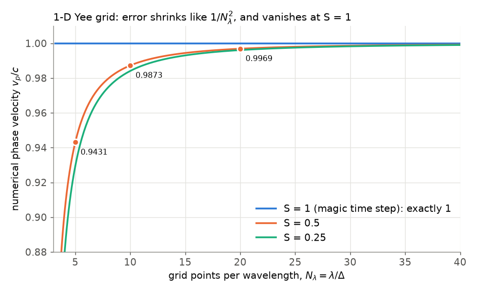

*Own plot from (4.7b). Look at how the $S=0.5$ and $S=0.25$ curves climb towards 1 as $N_\lambda$ grows (the dots give the worked-example values 0.9431, 0.9873, 0.9969), while the $S=1$ line sits exactly on 1. A smaller time step makes the error slightly worse, not better.*

## 4.5 Anisotropy of the numerical phase velocity

> **In one sentence:** in 2-D and 3-D the numerical speed depends on direction, so the grid acts like a slightly anisotropic crystal.

An **anisotropic** medium is one whose properties depend on direction. Real crystals such as calcite are like this. The Yee grid is too, a little: waves along the grid axes travel at a different speed from waves along the diagonals. Since vacuum is perfectly isotropic, this is pure error.

### 4.5.1 Sample values of numerical phase velocity

For a square 2-D grid, (4.6) can be solved in closed form in two directions.

**Along the axes** ($\phi = 0^\circ, 90^\circ, 180^\circ, 270^\circ$), only one sine survives, giving the 1-D result:

$$\tilde k = \frac{2}{\Delta}\sin^{-1}\!\left[\frac{1}{S}\sin\!\left(\frac{\pi S}{N_\lambda}\right)\right], \qquad \frac{\tilde v_p}{c} = \frac{\pi/N_\lambda}{\sin^{-1}\!\left[\frac{1}{S}\sin\!\left(\frac{\pi S}{N_\lambda}\right)\right]} \tag{4.14a,b}$$

**Along the diagonals** ($\phi = 45^\circ, 135^\circ, \ldots$), $\cos\phi = \sin\phi = 1/\sqrt2$, so the two sines are equal and (4.6) becomes $2\sin^2(\tilde k\Delta/(2\sqrt2)) = \frac{1}{S^2}\sin^2(\pi S/N_\lambda)$:

$$\tilde k = \frac{2\sqrt2}{\Delta}\sin^{-1}\!\left[\frac{1}{\sqrt2\,S}\sin\!\left(\frac{\pi S}{N_\lambda}\right)\right], \qquad \frac{\tilde v_p}{c} = \frac{\pi/(\sqrt2\,N_\lambda)}{\sin^{-1}\!\left[\frac{1}{\sqrt2\,S}\sin\!\left(\frac{\pi S}{N_\lambda}\right)\right]} \tag{4.15a,b}$$

**Example: $S = 0.5$, $N_\lambda = 20$.** From (4.14b), $\tilde v_p = 0.996892\,c$ on the axes. From (4.15b), $\tilde v_p = 0.998968\,c$ on the diagonal. Both are below $c$. They also differ: the diagonal wave is faster by a factor $0.998968/0.996892 = 1.00208$. That is a **0.208 % velocity anisotropy**.

**The experiment of Fig. 4.1.** The book checks this in a real FDTD run. A 360 × 360-cell TM$_z$ grid is driven at its centre by a sine wave applied to one $E_z$ value, with $N_\lambda = 20$ and $S = 0.5$. This launches a circular (cylindrical) wave. After 328 steps (before the wave hits the edges), the field is plotted along the axis and along the diagonal. Zooming in on a zero crossing about 63.6 cells out, the diagonal wave is ahead by 0.125 cells. That is $0.125/63.6 = 0.197\,\%$, within 5 % of the theoretical 0.208 %. Theory and simulation agree.

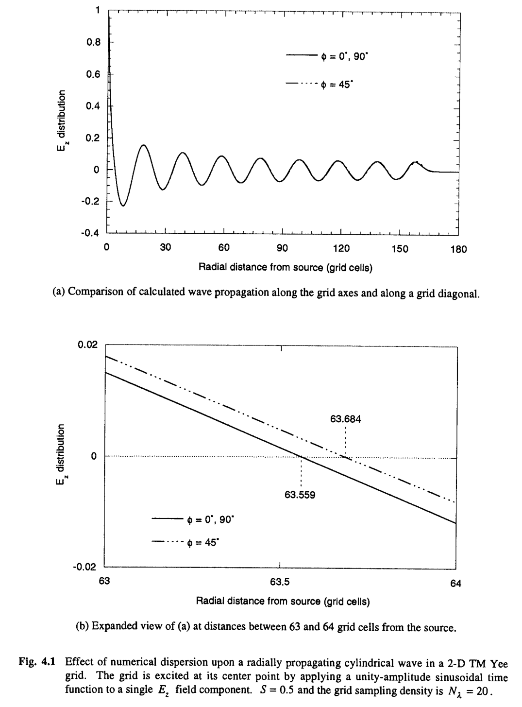

*Fig. 4.1. In (a) the axis and diagonal curves look identical. In (b), zoomed to between 63 and 64 cells, the diagonal wave (dash-dot) crosses zero at 63.684 cells and the axis wave at 63.559: the diagonal wave is ahead because it travels faster.*

**Arbitrary angles: Newton's method.** For other angles, (4.6) cannot be solved with a formula (it is **transcendental**: the unknown sits inside sines). The book solves it with **Newton's method**, the standard root-finding iteration $x_{new} = x - f(x)/f'(x)$:

$$\tilde k_{(i+1)} = \tilde k_{(i)} - \frac{\sin^2(A\tilde k_{(i)}) + \sin^2(B\tilde k_{(i)}) - C}{A\sin(2A\tilde k_{(i)}) + B\sin(2B\tilde k_{(i)})} \tag{4.16a}$$

$$A = \frac{\Delta\cos\phi}{2}, \qquad B = \frac{\Delta\sin\phi}{2}, \qquad C = \frac{1}{S^2}\sin^2\!\left(\frac{\pi S}{N_\lambda}\right) \tag{4.16b}$$

The top of the fraction is (4.6) rearranged as "something $= 0$". The bottom is its derivative with respect to $\tilde k$ (using $\frac{d}{dk}\sin^2(Ak) = A\sin(2Ak)$). If you measure lengths in wavelengths ($\lambda_0 = 1$, so $\Delta = 1/N_\lambda$), the true $k = 2\pi$ is an excellent starting guess, and two or three iterations are enough. Then

$$\frac{\tilde v_p}{c} = \frac{2\pi}{\tilde k_{final}} \tag{4.17}$$

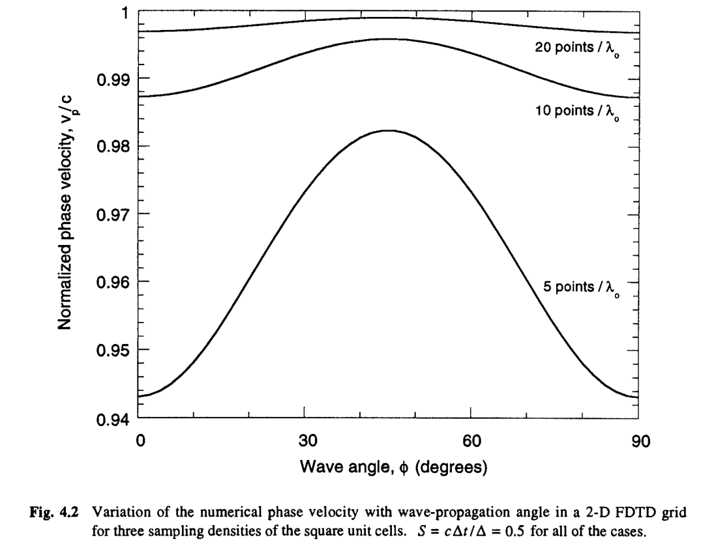

*Fig. 4.2 ($S=0.5$). Each curve is lowest at 0° and 90° (along the axes) and highest at 45° (the diagonal). All curves stay below 1. Going from 5 to 10 to 20 points per wavelength squeezes the curves up towards 1.*

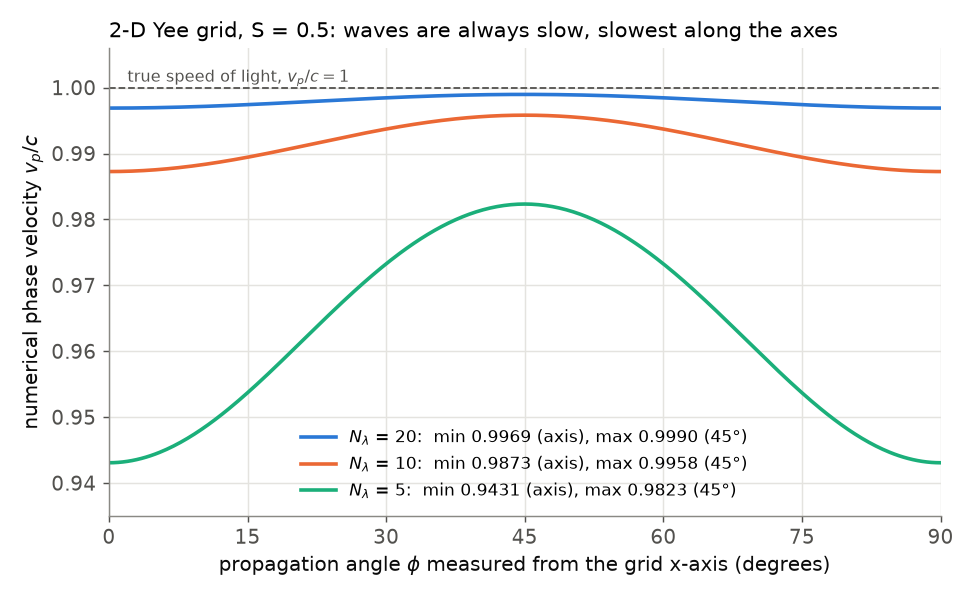

*Own reproduction of Fig. 4.2 by Newton iteration of (4.16). Check the legend numbers: at $N_\lambda=20$ the minimum is 0.9969 and the maximum 0.9990, exactly the book's 0.996892 and 0.998968.*

**Two error measures.** The book defines two numbers that summarise a whole $\tilde v_p(\phi)$ curve:

$$\Delta\tilde v_{physical} = \left|\frac{\tilde v_p(\phi)\big|_{min}}{c} - 1\right| \times 100\,\% \tag{4.18a}$$

$$\Delta\tilde v_{aniso} = \frac{\tilde v_p(\phi)\big|_{max} - \tilde v_p(\phi)\big|_{min}}{\tilde v_p(\phi)\big|_{min}} \times 100\,\% \tag{4.18b}$$

- $\Delta\tilde v_{physical}$ is the **worst-case speed error** compared with real light. It controls how much a wave's phase lags behind where it should be. At $N_\lambda = 20$, $S = 0.5$: 0.31 %. A wave that travels $10\lambda_0$ (200 cells) builds up about $11^\circ$ of lagging phase. For a pulse, the spread of this error over the pulse's frequencies causes the pulse to spread and distort.
- $\Delta\tilde v_{aniso}$ is the **spread of speeds between directions**. It controls how much a wavefront that should be round gets distorted. At $N_\lambda = 20$: 0.208 %, about 2.1 cells of distortion per 1000 cells travelled.

Both errors **grow linearly with the distance travelled**. That is a basic limitation of any grid-based Maxwell solver when the structure is many wavelengths long. Both errors also drop about **4:1 each time $N_\lambda$ doubles** (second-order accuracy). The basic cure is finer meshing.

### 4.5.2 Intrinsic grid velocity anisotropy

> **In one sentence:** the direction-dependence of speed comes almost entirely from the *space* grid, not from the time step, and it is about $\pi^2/(12N_\lambda^2)$.

How does $\Delta\tilde v_{aniso}$ change with $S$? The book compares, at $N_\lambda = 20$:

| $S$ | $\tilde v_p(0^\circ)/c$ | $\tilde v_p(45^\circ)/c$ | $\Delta\tilde v_{aniso}$ |
|---|---|---|---|
| $1/\sqrt2$ (2-D stability limit) | 0.997926 | 1.000000 (exact) | 0.208 % |
| 0.5 | 0.996892 | 0.998968 | 0.208 % |
| 0.01 | 0.995859 | 0.997937 | 0.208 % |

The anisotropy is the same to three decimal places, even though $\Delta t$ changed by a factor of 70. The *overall* speed error does change with $S$ (0.21 %, 0.31 %, 0.41 %). So:

1. Errors from the **time** discretisation are **isotropic**: they shift all directions by the same amount.
2. For $N_\lambda > 10$, the time discretisation barely affects $\Delta\tilde v_{aniso}$, whatever time-stepping method is used (leapfrog, Runge–Kutta, ...).
3. The time discretisation *does* affect $\Delta\tilde v_{physical}$. Space errors make waves slow; time errors make them fast. They can cancel partly. A fancier, more accurate time integrator can therefore *increase* $\Delta\tilde v_{physical}$, because it removes the helpful cancellation.

So $\Delta\tilde v_{aniso}$ is essentially an **intrinsic property of the space lattice**.

**The eigenvalue view.** To isolate the space grid, the book looks at the space-differenced equations with time left continuous (a "semi-discrete" system). Plane waves are eigenvectors of the discrete curl operator (4.19)–(4.23). The eigenvalue comes out as

$$\Lambda^2 = -4c^2\left[\frac{\sin^2(\tilde k_x\Delta x/2)}{(\Delta x)^2} + \frac{\sin^2(\tilde k_y\Delta y/2)}{(\Delta y)^2}\right], \qquad \Lambda = \pm j\,2c\left[\cdots\right]^{1/2} \tag{4.24, 4.25}$$

Since $\Lambda$ is purely imaginary, the semi-discrete waves oscillate without growing or shrinking. $|\Lambda|$ plays the role of a frequency, so $|\Lambda|/\tilde k$ is a speed. The book defines the **normalised numerical phase speed intrinsic to the grid**:

$$\frac{c^*}{c} = \frac{|\Lambda|/\tilde k}{c} = \frac{2}{\tilde k}\left[\frac{\sin^2(\tilde k_x\Delta x/2)}{(\Delta x)^2} + \frac{\sin^2(\tilde k_y\Delta y/2)}{(\Delta y)^2}\right]^{1/2} \tag{4.26}$$

For $N_\lambda > 10$ you can put in the true $k_x = (2\pi/\lambda_0)\cos\phi$, $k_y = (2\pi/\lambda_0)\sin\phi$ and a square grid:

$$\frac{c^*}{c} \cong \frac{N_\lambda}{\pi}\left[\sin^2\!\left(\frac{\pi\cos\phi}{N_\lambda}\right) + \sin^2\!\left(\frac{\pi\sin\phi}{N_\lambda}\right)\right]^{1/2} \tag{4.27}$$

$c^*$ contains no time-step information, so it is **not** $\tilde v_p$ and cannot give $\Delta\tilde v_{physical}$. But it gives the anisotropy directly. Expanding the sines (Taylor series) and keeping the leading term:

$$\Delta\tilde v_{aniso} = \frac{c^*/c\big|_{max} - c^*/c\big|_{min}}{c^*/c\big|_{min}} \times 100\,\% \;\cong\; \frac{\pi^2}{12\,N_\lambda^2}\times 100\,\% \tag{4.28}$$

At $N_\lambda = 20$ this gives 0.206 %, very close to the exact 0.208 %. Formula (4.28) is a handy yardstick: you can compare the anisotropy of different grids (§4.9) without running Newton's method.

## 4.6 Complex-valued numerical wavenumbers

> **In one sentence:** if the grid is too coarse for a wave (fewer than about 2–3 points per wavelength), the numerical wavenumber becomes complex, the wave decays quickly with distance, and it can even travel faster than light.

Chapter 2 of the book showed this for the 1-D wave equation; Schneider and Wagner (1999) extended it to the Yee algorithm. These coarsely sampled waves matter because a sharp pulse (for example a step or a narrow spike) contains very high frequencies, so some of its content is always poorly sampled. Those components cause weak, faster-than-light artifacts at the leading edge of the pulse.

### 4.6.1 Case 1: Numerical wave propagation along the principal lattice axes

Rewrite (4.14a) as

$$\tilde k = \frac{2}{\Delta}\sin^{-1}(\xi), \qquad \xi = \frac{1}{S}\sin\!\left(\frac{\pi S}{N_\lambda}\right) \tag{4.29a,b}$$

$\xi$ ("xi") is just the number inside the $\sin^{-1}$. If $\xi \le 1$, $\tilde k$ is real. If $\xi > 1$, $\tilde k$ is complex (see Background). The changeover is at $\xi = 1$, which happens at

$$N_{\lambda,transition} = \frac{\pi S}{\sin^{-1}(S)} \tag{4.30}$$

For $S = 0.5$: $N_{\lambda,transition} = 0.5\pi/(\pi/6) = 3$.

**Real-wavenumber regime, $N_\lambda > N_{\lambda,transition}$** (4.31)–(4.33). $\tilde k$ is real, so the wave keeps a constant amplitude, and $\tilde v_p < c$. This is the normal regime of §4.5.

**Complex-wavenumber regime, $N_\lambda < N_{\lambda,transition}$.** Now $\xi > 1$. Using (4.34),

$$\tilde k = \frac{2}{\Delta}\left[\frac{\pi}{2} - j\ln\!\left(\xi + \sqrt{\xi^2-1}\right)\right] = \frac{\pi}{\Delta} - j\,\frac{2}{\Delta}\ln\!\left(\xi + \sqrt{\xi^2-1}\right) \tag{4.35}$$

so

$$\tilde k_{real} = \frac{\pi}{\Delta}, \qquad \tilde k_{imag} = \frac{2}{\Delta}\ln\!\left(\xi + \sqrt{\xi^2-1}\right) \tag{4.36}$$

The real part is stuck at $\pi/\Delta$: a wavelength of exactly $2\Delta$, the shortest wave a grid can show (a + − + − pattern). The phase velocity is

$$\tilde v_p = \frac{\omega}{\tilde k_{real}} = \frac{2\pi c/\lambda_0}{\pi/\Delta} = \frac{2c}{N_\lambda} \tag{4.37a}$$

and the amplitude is multiplied, each cell it moves, by

$$e^{-\tilde k_{imag}\Delta} = \frac{1}{\left(\xi + \sqrt{\xi^2-1}\right)^2} \tag{4.37b}$$

Since $\xi > 1$ this is less than 1, so the wave **decays exponentially** with distance.

**The fastest possible numerical speed.** Sampling in time every $\Delta t$ can only represent frequencies up to $f_{max} = 1/(2\Delta t)$ (the **Nyquist limit**: you need at least two samples per cycle). So the shortest free-space wavelength the simulation can contain is $\lambda_{0,min} = c/f_{max} = 2c\Delta t$, i.e. $N_{\lambda,min} = \lambda_{0,min}/\Delta = 2S$. Putting that into (4.37a):

$$\tilde v_{p,max} = \frac{2c}{N_{\lambda,min}} = \frac{c}{S} = \frac{\Delta}{\Delta t} \tag{4.38–4.39}$$

So the fastest numerical wave moves exactly **one cell per time step**. That makes sense: the Yee update only uses nearest neighbours, so information cannot travel further than one cell in one step. This limit belongs to the grid, not the material: it is the same whatever $\varepsilon$ and $\mu$ are.

### 4.6.2 Case 2: Numerical wave propagation along a grid diagonal

The same steps, starting from (4.15a):

$$\tilde k = \frac{2\sqrt2}{\Delta}\sin^{-1}(\xi), \qquad \xi = \frac{1}{\sqrt2\,S}\sin\!\left(\frac{\pi S}{N_\lambda}\right) \tag{4.40a,b}$$

The changeover is at

$$N_{\lambda,transition} = \frac{\pi S}{\sin^{-1}(\sqrt2\,S)} \tag{4.41}$$

(this needs $\sqrt2\,S \le 1$, which is the 2-D stability limit anyway). For $S = 0.5$: $0.5\pi/\sin^{-1}(0.7071) = 0.5\pi/(\pi/4) = 2$.

Above the transition, $\tilde k$ is real and the amplitude is constant (4.42)–(4.44). Below it:

$$\tilde k_{real} = \frac{\sqrt2\,\pi}{\Delta}, \qquad \tilde k_{imag} = \frac{2\sqrt2}{\Delta}\ln\!\left(\xi + \sqrt{\xi^2-1}\right) \tag{4.45–4.46}$$

$$\tilde v_p = \frac{\sqrt2\,c}{N_\lambda}, \qquad e^{-\tilde k_{imag}\Delta} = \left(\xi + \sqrt{\xi^2-1}\right)^{-2\sqrt2} \tag{4.47a,b}$$

and the speed ceiling along the diagonal is

$$\tilde v_{p,max} = \frac{\sqrt2\,c}{2S} = \frac{\sqrt2}{2}\cdot\frac{\Delta}{\Delta t} \tag{4.48a,b}$$

Why smaller than on the axis? Data in the Yee grid move only along the grid lines. To reach the diagonal neighbour (distance $\sqrt2\,\Delta$) the information must take one step in $x$ and one step in $y$: two time steps. So along the diagonal, information covers at most $2\Delta$ of grid-line travel, i.e. $\sqrt2\,\Delta$ of straight-line distance, in $2\Delta t$.

### 4.6.3 Example calculation of numerical phase velocity and attenuation

The book plots these formulas for $S = 0.5$ (Fig. 4.3):

- **On the axes**: $\tilde v_p$ falls to a minimum of $(2/3)c$ at $N_\lambda = 3$, exactly where attenuation starts. Below that, $\tilde v_p = 2c/N_\lambda$ rises again, passes $c$ at $N_\lambda = 2$, and approaches $2c$ as $N_\lambda \to 1$. There the attenuation approaches **2.634 nepers per cell** (the amplitude drops by a factor $e^{2.634} \approx 14$ every cell).
- **On the diagonal**: minimum $\tilde v_p = (\sqrt2/2)c \approx 0.707c$ at $N_\lambda = 2$; exceeds $c$ for $N_\lambda < \sqrt2$; approaches $\sqrt2\,c$ as $N_\lambda \to 1$, with attenuation approaching **2.493 nepers per cell**.

So very coarsely sampled waves *can* go faster than light, but they die out within a few cells. They are mostly harmless, but they produce small "precursor" artifacts ahead of a sharp wavefront.

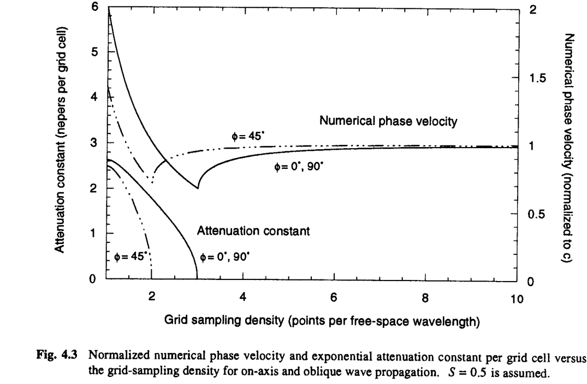

*Fig. 4.3 ($S=0.5$). Look at the V-shaped notches in the phase-velocity curves at $N_\lambda=3$ (axis) and $N_\lambda=2$ (diagonal); attenuation (lower curves) is zero to the right of those points and rises steeply to the left.*

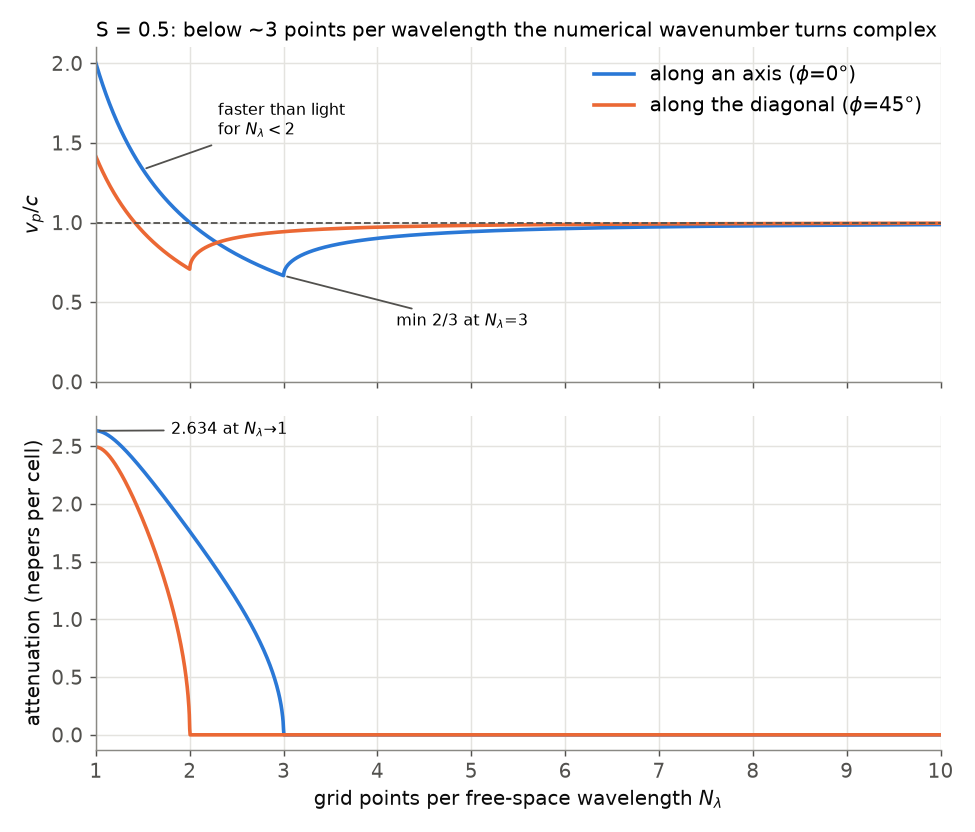

*Own reproduction of Fig. 4.3 from (4.36)–(4.47). The top panel shows the minimum $2/3$ at $N_\lambda=3$ and the faster-than-light region below $N_\lambda=2$; the bottom panel ends at 2.634 nepers per cell (axis) and 2.493 (diagonal), matching the book.*

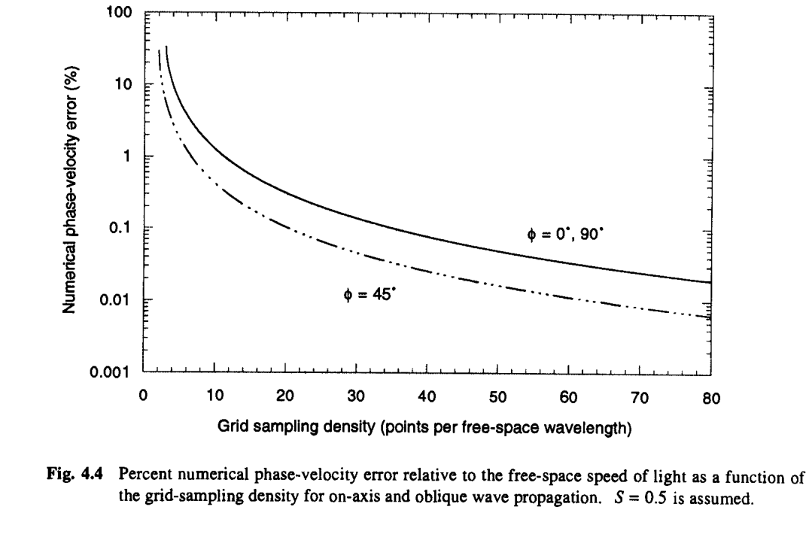

*Fig. 4.4 ($S=0.5$, log scale). For $N_\lambda \gg 10$ both curves fall by about 100× when $N_\lambda$ rises 10× — the $1/N_\lambda^2$ law of a second-order method. The diagonal (45°) error is always smaller than the axis error.*

### 4.6.4 Examples of calculations involving numerical wave propagation

To see these effects on a real wavefront, the book drives the same 360 × 360 TM$_z$ grid with a **unit step** (the source switches from 0 to 1 and stays on) at one $E_z$ point. The Courant number is $S = \sqrt2/2$, the value that makes diagonal plane waves dispersion-free. The step contains all frequencies, so it is a tough test. Two non-physical artifacts appear near the leading edge (Fig. 4.5):

1. **Jitter.** Behind the wavefront the field wiggles from cell to cell. The jitter is worst along the axes, but it is also present along the 45° diagonal, even though plane waves along the diagonal are dispersion-free at this $S$. Why? A circular wavefront is not a plane wave. The slightly anisotropic "free space" of the grid scatters a little energy sideways, from every direction into every other, so every point behind the wavefront gets contaminated.
2. **A superluminal (faster-than-light) precursor.** On the axis cuts, a small, quickly decaying bit of field arrives *ahead* of where light could be. This is the complex-wavenumber effect of §4.6.1. By causality it can never appear *behind* the wavefront, and it does not appear on the diagonal cut. There the field drops sharply to zero exactly at the wavefront, like the 1-D magic-time-step case.

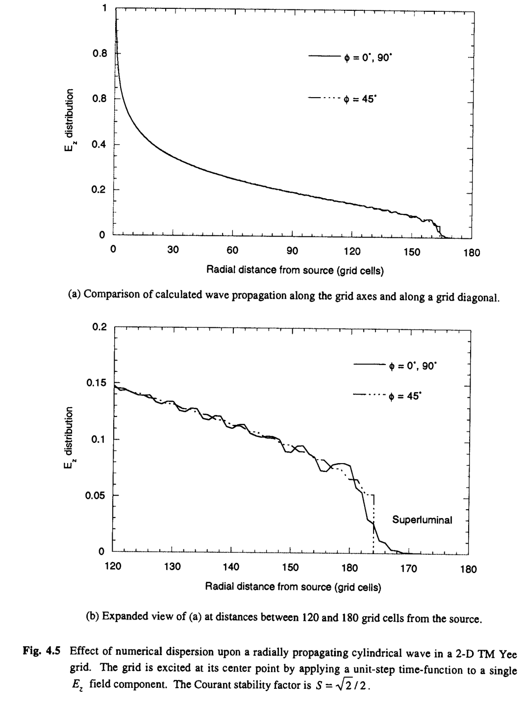

*Fig. 4.5 ($S=\sqrt2/2$). In (b), the zoom from 120 to 180 cells, look at the cell-to-cell wiggles on both curves, and at the solid (axis) curve that leaks past the sharp dotted drop — the part labelled "Superluminal". (The tick label "180" in the middle of the axis is a typo in the book; it should read 160.)*

## 4.7 Numerical stability

> **In one sentence:** if $\Delta t$ is larger than $\Delta/(c\sqrt{D})$ in $D$ dimensions, some grid-scale waves grow by a fixed factor every step, and the simulation explodes.

### 4.7.1 Complex-frequency analysis

Now read the dispersion relation the other way: pick a real wavevector $\tilde{\mathbf k}$ (any pattern that could exist on the grid, for example rounding noise) and ask what $\omega$ it gets. Allow $\omega$ to be complex:

$$\omega = \omega_{real} + j\,\omega_{imag}$$

As shown in Background, $\omega_{imag} < 0$ means the wave grows exponentially in time (4.49)–(4.50). Solve the 3-D relation (4.12) for $\omega$:

$$\omega = \frac{2}{\Delta t}\sin^{-1}(\xi) \tag{4.51a}$$

$$\xi = c\,\Delta t\left[\frac{\sin^2(\tilde k_x\Delta x/2)}{(\Delta x)^2} + \frac{\sin^2(\tilde k_y\Delta y/2)}{(\Delta y)^2} + \frac{\sin^2(\tilde k_z\Delta z/2)}{(\Delta z)^2}\right]^{1/2} \tag{4.51b}$$

For real wavevectors, each $\sin^2$ is at most 1. So $\xi$ lies between 0 and

$$\xi_{upper\,bound} = c\,\Delta t\left[\frac{1}{(\Delta x)^2} + \frac{1}{(\Delta y)^2} + \frac{1}{(\Delta z)^2}\right]^{1/2} \tag{4.52}$$

The maximum is reached when every sine equals ±1, i.e. for the wavevector components

$$\tilde k_x = \pm\frac{\pi}{\Delta x}, \qquad \tilde k_y = \pm\frac{\pi}{\Delta y}, \qquad \tilde k_z = \pm\frac{\pi}{\Delta z} \tag{4.53}$$

These are the "Nyquist" wavevectors: patterns that flip sign from every cell to the next in every direction (a 3-D checkerboard).

**Stable range, $0 \le \xi \le 1$.** $\sin^{-1}(\xi)$ is real, so $\omega$ is real and $\omega_{imag} = 0$. Every wave keeps a constant amplitude.

**Unstable range, $1 < \xi \le \xi_{upper\,bound}$.** This range exists only if $\xi_{upper\,bound} > 1$, i.e. if

$$\Delta t > \frac{1}{c\sqrt{\dfrac{1}{(\Delta x)^2} + \dfrac{1}{(\Delta y)^2} + \dfrac{1}{(\Delta z)^2}}} \tag{4.54}$$

In that case, by (4.34),

$$\omega = \frac{2}{\Delta t}\left[\frac{\pi}{2} - j\ln\!\left(\xi + \sqrt{\xi^2-1}\right)\right] \tag{4.55–4.56}$$

$$\omega_{real} = \frac{\pi}{\Delta t}, \qquad \omega_{imag} = -\frac{2}{\Delta t}\ln\!\left(\xi + \sqrt{\xi^2-1}\right) \tag{4.57}$$

$\omega_{real} = \pi/\Delta t$ means the unstable field flips sign every time step. $\omega_{imag} < 0$ means it grows. Putting this $\omega$ into the plane wave (4.58), each time step multiplies the amplitude by

$$q_{growth} = \frac{\tilde{\mathbf V}\big|^{n+1}}{\tilde{\mathbf V}\big|^{n}} = e^{-\omega_{imag}\Delta t} = \left(\xi + \sqrt{\xi^2-1}\right)^2 \tag{4.59}$$

The worst growth is at $\xi = \xi_{upper\,bound}$, i.e. for the checkerboard wavevectors of (4.53), which travel along the **grid diagonals**. That is the origin of numerical instability: the shortest, most jagged patterns on the grid. In practice they are seeded by rounding errors at the $10^{-16}$ level, and if $q > 1$ they grow until they swamp everything.

### The Courant limits

Setting the bound (4.54) as an equality gives the largest allowed time step.

**3-D, cubic cells** ($\Delta x = \Delta y = \Delta z = \Delta$):

$$\Delta t \le \frac{\Delta}{c\sqrt3}, \qquad S_{stability\,limit\text{-}3D} = \frac{1}{\sqrt3} \approx 0.577 \tag{4.60}$$

The dominant unstable wavevectors are $\tilde{\mathbf k} = \frac{\pi}{\Delta}(\pm\hat x \pm\hat y \pm\hat z)$ (4.61): along the body diagonals.

**2-D, square cells**:

$$\Delta t \le \frac{\Delta}{c\sqrt2}, \qquad S_{stability\,limit\text{-}2D} = \frac{1}{\sqrt2} \approx 0.707 \tag{4.66a}$$

The dominant unstable wavevectors are $\tilde{\mathbf k} = \frac{\pi}{\Delta}(\pm\hat x \pm\hat y)$, with $|\tilde{\mathbf k}| = \pi\sqrt2/\Delta$, i.e. a wavelength of $\sqrt2\,\Delta$ along the diagonal (4.66c).

**1-D**:

$$\Delta t \le \frac{\Delta}{c}, \qquad S_{stability\,limit\text{-}1D} = 1 \tag{4.67a}$$

The dominant unstable wavevectors are $\pm\frac{\pi}{\Delta}\hat x$: wavelength $2\Delta$ (4.67c).

A simple way to remember all three: in $D$ dimensions with equal cells, $S \le 1/\sqrt{D}$. In words, **light may not cross more than $1/\sqrt D$ of a cell per time step**. Note the 1-D limit is also the magic time step: the best accuracy sits right at the edge of instability.

**Why $\sqrt D$?** The update at a point uses only its nearest neighbours. In $D$ dimensions, a disturbance aimed along the body diagonal needs $D$ separate grid-line hops to reach the next diagonal cell, which is only $\sqrt D\,\Delta$ away in a straight line. The grid must therefore be "faster" than light along the grid lines to keep up along the diagonals, and that requires a smaller $\Delta t$.

### Normalised Courant number: one growth formula for all dimensions

Define the **normalised Courant number** $S_{norm} = S/S_{stability\,limit}$:

$$S_{norm\text{-}3D} = S\sqrt3 \;\;(4.63), \qquad S_{norm\text{-}2D} = S\sqrt2 \;\;(4.66b), \qquad S_{norm\text{-}1D} = S \;\;(4.67b)$$

Then, at the worst wavevector, $\xi_{upper\,bound} = S_{norm}$ in every case, and the growth factor per step is the same formula:

$$q_{growth} = \left[S_{norm} + \sqrt{S_{norm}^2 - 1}\,\right]^2, \qquad S_{norm} \ge 1 \tag{4.65, 4.66d, 4.67d}$$

The 1-D version (4.67d) is exactly the growth factor found for the scalar wave equation in Chapter 2.

So exceeding the limit by the same *fraction* gives the same blow-up rate in any dimension. For example, these three give identical growth:

- $S = 1.0005$ in a 1-D grid;
- $S = 1.0005 \times (1/\sqrt2) = 0.707460$ in a 2-D square grid;
- $S = 1.0005 \times (1/\sqrt3) = 0.577639$ in a 3-D cubic grid.

!!! example "Worked example 3: how fast does it blow up?"
    Take $S_{norm} = 1.0005$ (only 0.05 % over the limit). $\sqrt{1.0005^2 - 1} = \sqrt{0.00100025} = 0.031627$. So $q = (1.0005 + 0.031627)^2 = 1.03213^2 = 1.0653$.

    That looks harmless, but it compounds: after 200 steps the worst mode has grown by $1.0653^{200} \approx 3\times10^5$; after 1000 steps by about $10^{27}$. Rounding noise at $10^{-16}$ becomes larger than your signal in roughly $\ln(10^{16})/\ln(1.0653) \approx 580$ steps. A typical photonics run is $10^4$–$10^6$ steps. Even a tiny violation ruins it.

    At $S_{norm} = 1.01$: $q = (1.01 + 0.14177)^2 = 1.3266$ per step. Noise at $10^{-16}$ reaches order 1 in about 130 steps.

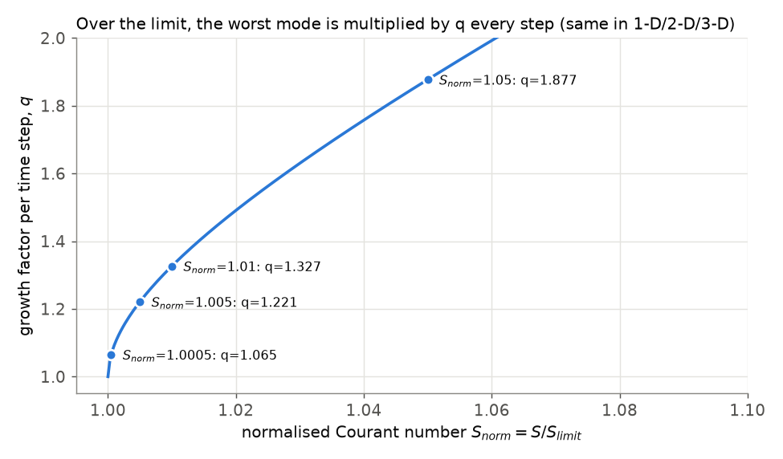

*Own plot of (4.65). Look at how steeply $q$ rises just above $S_{norm}=1$: the curve has a vertical tangent there, so even a 0.05 % violation already gives 6.5 % growth per step.*

### 4.7.2 Example of a numerically unstable two-dimensional FDTD model

The book reruns the unit-step problem of Fig. 4.5 with $S$ just over the 2-D limit.

- With $S = 1.005 \times (1/\sqrt2)$, after only $n = 40$ steps the $E_z$ map is a **checkerboard**: neighbouring cells alternate between positive and negative, spreading out from the source. This is the $(\pm\pi/\Delta, \pm\pi/\Delta)$ mode of (4.66c) made visible.
- With $S = 1.0005 \times (1/\sqrt2)$, at $n = 200$, the field along the axis flips sign at every cell (wavelength $2\Delta$), while along the 45° diagonal it varies smoothly. Why? The unstable mode has wavelength $\sqrt2\,\Delta$ along the diagonal, and diagonal neighbours are $\sqrt2\,\Delta$ apart, so they always have the *same* sign. Along the axis, neighbours are $\Delta$ apart, half the mode's $2\Delta$ wavelength along that cut, so they alternate in sign. The smooth diagonal curve traces the envelope of the axis oscillation.
- The growth measured in the simulation was 1.060–1.069 per step. The theory (4.66d) gives 1.0653. Excellent agreement.

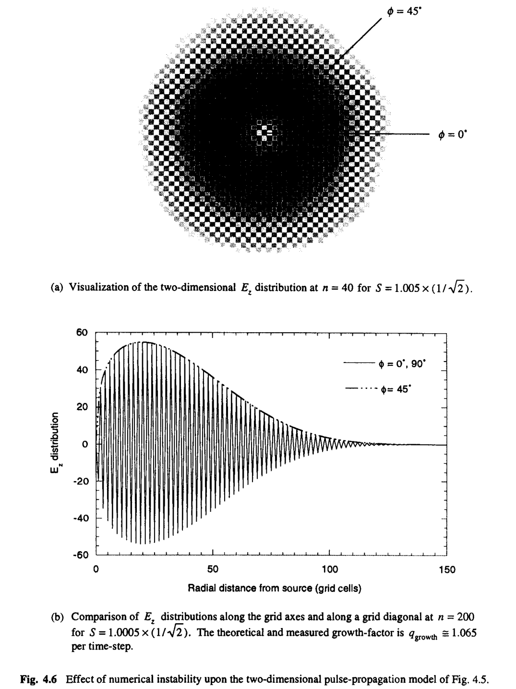

*Fig. 4.6. In (a), look at the checkerboard of alternating dark and grey pixels — the signature of instability. In (b), the axis curve (solid) oscillates from cell to cell between about ±55, while the diagonal curve (dash-dot) is a smooth envelope.*

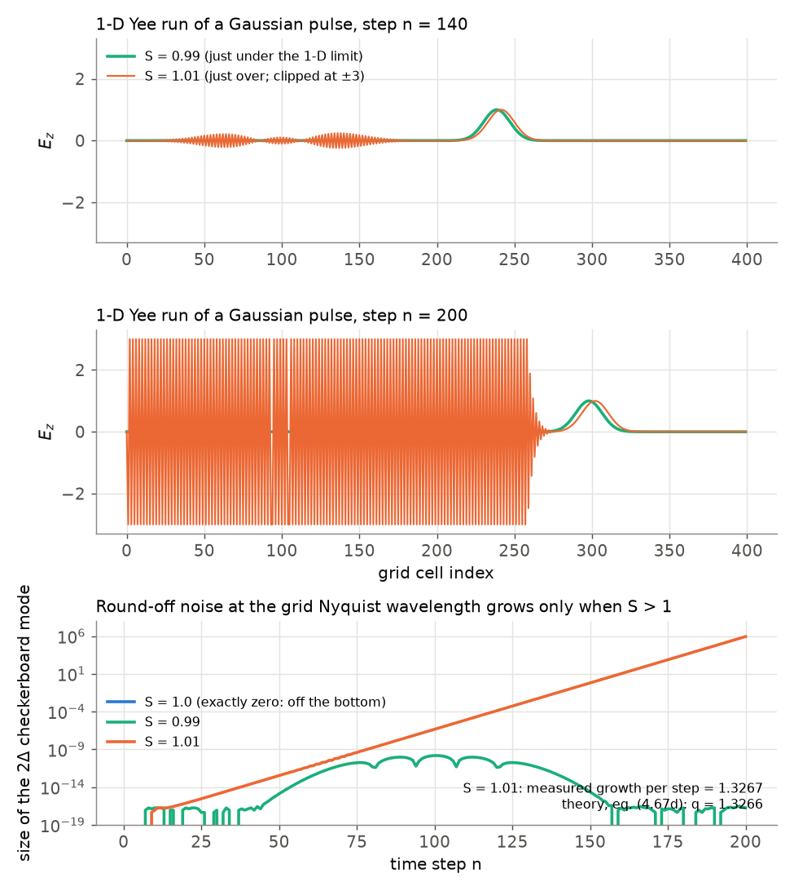

*Own 1-D Yee run of a Gaussian pulse. At step 140 the $S=1.01$ run already shows growing ripples; by step 200 they dwarf the pulse. The bottom panel tracks the size of the $2\Delta$ checkerboard mode: for $S=1.01$ it rises along a straight line on the log scale at 1.3267 per step (theory 1.3266); for $S=0.99$ it stays at the $10^{-10}$ level or below and dies away; for $S=1$ it is exactly zero.*

## 4.8 Generalized stability problem

> **In one sentence:** the Courant limit only guarantees stability of the plain Yee scheme in a uniform medium; boundaries, odd meshes and unusual materials can each bring their own instabilities.

A real FDTD code has more than the core Yee update. The book lists three add-ons that can destabilise it.

### 4.8.1 Boundary conditions

The grid has to end somewhere, and the boundary needs special update rules, called **absorbing boundary conditions (ABCs)**, to let waves leave without reflecting (Chapters 6–7). Many ABCs use field values from several cells and several past time steps (they are "non-local"). That can create instabilities the von Neumann analysis above does not see. Example: the Liao ABC (Chapter 6) turned out to be only *marginally* stable; to use it reliably people needed double precision and/or had to move its coefficients slightly away from the theoretical best values. Similar problems appeared for the Engquist–Majda and Higdon ABCs. Even so, with a sensible $\Delta t$, stable runs of many thousands of steps are normal, including with Berenger's PML (Chapter 7).

### 4.8.2 Variable and unstructured meshing

If cells vary in size, or the mesh is not a simple Cartesian grid (conformal or unstructured meshes, Chapters 10–12), an exact stability formula may not exist. Instead, people use upper bounds on $\Delta t$ that are part analytical and part found by experiment. A good rule of thumb: the smallest cell sets the time step for the whole grid.

### 4.8.3 Lossy, dispersive, nonlinear, and gain materials

Real materials can absorb (lossy), have an index that changes with frequency (dispersive), respond nonlinearly, or amplify (gain). For linear dispersive models (Chapter 9) an exact stability bound can usually be found. Nonlinear models often cannot be analysed, but in practice they run stably for long times with a well-chosen $\Delta t$.

For a photonics student this explains a common experience: a simulation that is stable in vacuum blows up when you add a metal with a Drude model, or a gain medium. It is the material model, not the Courant number, that needs attention (often a smaller Courant factor helps).

## 4.9 Modified Yee-based algorithms for mitigating numerical dispersion

> **In one sentence:** you can reduce numerical dispersion without just refining the grid, by rescaling constants, using wider (fourth-order) difference stencils, using hexagonal grids, or using FFT-based derivatives.

The Yee algorithm is very robust, but for electrically large problems its dispersion becomes the accuracy bottleneck. The book reviews four strategies.

### 4.9.1 Strategy 1: Center a specific numerical phase-velocity curve about $c$

Look again at Fig. 4.2. Every curve lies below $c$, and each is roughly symmetric about its middle value

$$\tilde v_{avg} = \frac{\tilde v_p(\phi = 0^\circ) + \tilde v_p(\phi = 45^\circ)}{2} \tag{4.68}$$

If your source is narrowband (essentially one frequency), one curve describes most waves in the grid. So you can **shift the whole curve up** until its middle sits at $c$. This cuts $\Delta\tilde v_{physical}$ by almost 3:1. The shift is easy: scale the free-space constants used in the update equations,

$$\varepsilon_0' = \left(\frac{\tilde v_{avg}}{c}\right)\varepsilon_0, \qquad \mu_0' = \left(\frac{\tilde v_{avg}}{c}\right)\mu_0 \tag{4.69}$$

Making both slightly smaller raises the model's "speed of light" ($1/\sqrt{\mu\varepsilon}$) by the factor $c/\tilde v_{avg}$, which cancels the average slowness. Scaling both by the same factor leaves the wave impedance $\sqrt{\mu/\varepsilon}$ unchanged, so reflections are not affected.

Four drawbacks: (1) the anisotropy $\Delta\tilde v_{aniso}$ is untouched; (2) the correction is only right on average over directions, so individual waves still have errors; (3) the faster model light speed means you must reduce $\Delta t$ in proportion to stay within the Courant limit; (4) a broadband pulse cannot be corrected at all its frequencies at once. Still, it is so easy that it is almost routine.

### 4.9.2 Strategy 2: Use fourth-order-accurate spatial differences

The ordinary Yee difference uses one pair of values, at $\pm\Delta/2$. Using two pairs, at $\pm\Delta/2$ and $\pm3\Delta/2$, cancels the leading error term and gives an error of order $\Delta^4$ instead of $\Delta^2$.

**Explicit method (Fang, 1989).** The fourth-order central difference for a derivative at the point midway between samples is

$$\frac{\partial V}{\partial x}\bigg|_{i+1/2} \approx \frac{27\,(V_{i+1} - V_i) - (V_{i+2} - V_{i-1})}{24\,\Delta x}$$

(the same as fitting a cubic through the four points and differentiating it). The full TM$_z$ update system is (4.70). The numerical dispersion relation (4.71) has the same shape as (4.5), but each space term $\sin(\tilde k_x\Delta x/2)$ is replaced by

$$\frac{27}{24}\sin\!\left(\frac{\tilde k_x\Delta x}{2}\right) - \frac{1}{24}\sin\!\left(\frac{3\tilde k_x\Delta x}{2}\right).$$

The intrinsic anisotropy (4.72) is much smaller:

$$\Delta\tilde v_{aniso}\big|_{explicit\;4th\text{-}order} \cong \frac{\pi^4}{18\,N_\lambda^4}\times100\,\% \tag{4.73}$$

Note the $N_\lambda^4$: doubling the points cuts the error 16 times, not 4. At $N_\lambda = 20$: $\pi^4/(18 \times 160000) = 0.0034\,\%$, versus 0.206 % for Yee.

The stability price: the complex-frequency analysis (4.74)–(4.76) gives $\xi_{upper\,bound} = \frac{28}{24}\,c\Delta t\,[\ldots]^{1/2}$, because the worst case is when the two sines reinforce: $\frac{27}{24} + \frac{1}{24} = \frac{28}{24} = \frac{7}{6}$. So the time step must be $6/7$ of the Yee limit, in 1-D, 2-D and 3-D (4.77)–(4.79). With $S_{norm}$ defined against these new limits (4.80), the growth factor under instability is again $q = [S_{norm} + \sqrt{S_{norm}^2-1}]^2$ (4.81).

**Implicit method: the Ty operator (Turkel, 1998).** Instead of computing each derivative from its neighbours alone, compute all derivatives along a grid line *together*, by solving a small linear system:

$$\frac{1}{24}\left(\frac{\partial V}{\partial x}\bigg|_{i+1} + \frac{\partial V}{\partial x}\bigg|_{i-1}\right) + \frac{11}{12}\,\frac{\partial V}{\partial x}\bigg|_{i} = \frac{V_{i+1/2} - V_{i-1/2}}{\Delta x} \tag{4.82}$$

The unknowns are the derivatives at every point on the line; the right-hand sides are known field values. Each equation links a point only to its two neighbours, so the matrix is **tridiagonal** (non-zero only on the main diagonal and the two next to it). Tridiagonal systems are solved very fast (the Thomas algorithm, cost proportional to the number of points). This is called "implicit" because each derivative depends on all field values along the line, not just nearby ones.

The intrinsic anisotropy (4.83) gives

$$\Delta\tilde v_{aniso}\big|_{Ty\;4th\text{-}order} \cong \frac{17\cdot3\cdot2\cdot\pi^4}{2880\,N_\lambda^4}\times100\,\% \cong \frac{\pi^4}{28\,N_\lambda^4}\times100\,\% \tag{4.84}$$

and the stable time step is $5/6$ of the Yee limit.

Fig. 4.7 shows the payoff for a sine-wave line source radiating in 2-D. Ty(2,4) means Ty space differences with ordinary second-order Yee time-stepping; Ty(4,4) means Ty with fourth-order Runge–Kutta time-stepping. **Ty at only $N_\lambda = 5$ is as accurate as Yee at $N_\lambda = 40$.** In 2-D, that is roughly $(40/5)^2 = 64$ times less memory, and about 23 times less run time even after paying for the tridiagonal solves. In 3-D the gain should approach $8^3 = 512$.

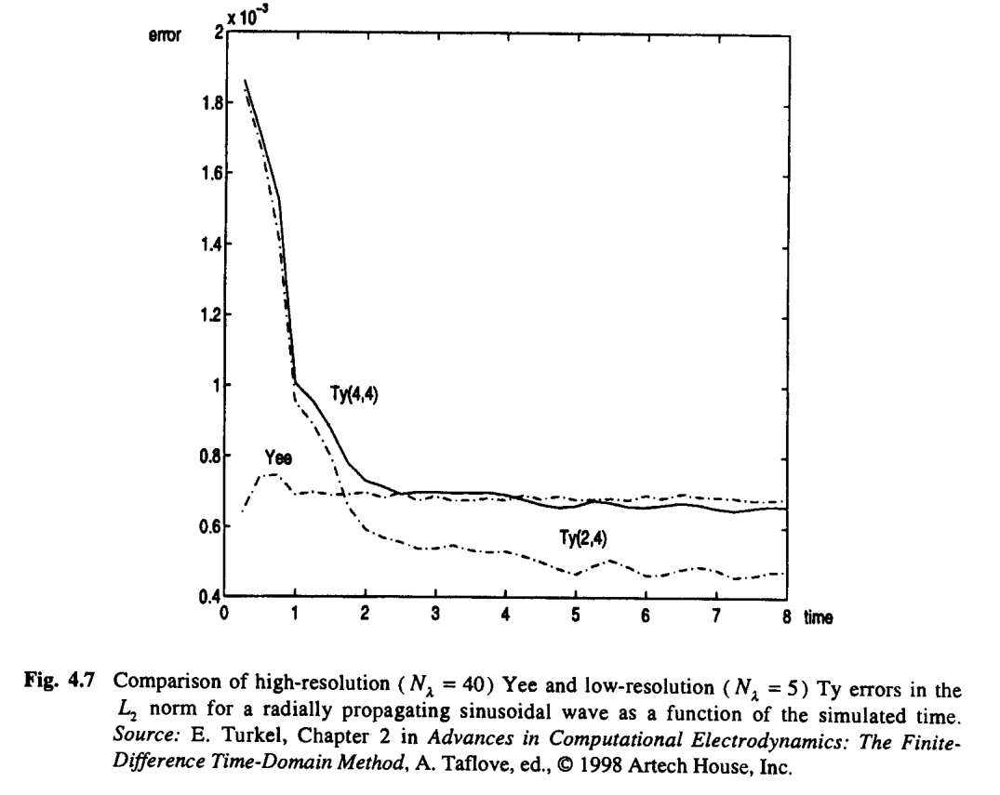

*Fig. 4.7. After the start-up transient (time > 2), the error of Ty at 5 points per wavelength (solid and dashed lower curves) settles at or below that of Yee at 40 points per wavelength (dash-dot).*

**Material interfaces.** Wider stencils have a catch. At a sudden jump in material (say silicon next to oxide), a stencil that reaches across the jump mixes values from both sides in a way that is not physical. Turkel's fix is to replace the sharp jump in $\varepsilon(x)$ (and $\mu$) by a fourth-order-accurate smooth interpolation (4.85)–(4.86). Fig. 4.8 compares Yee and Ty for standing waves inside a rectangular dielectric block with $\varepsilon_r = 4$, both at $N_\lambda = 30$. With simple arithmetic averaging at the interfaces (a second-order treatment), Ty is only modestly better than Yee, because the interface error dominates. With the fourth-order smoothing, Ty's error drops sharply; Yee would need about 8 times finer grid to match it.

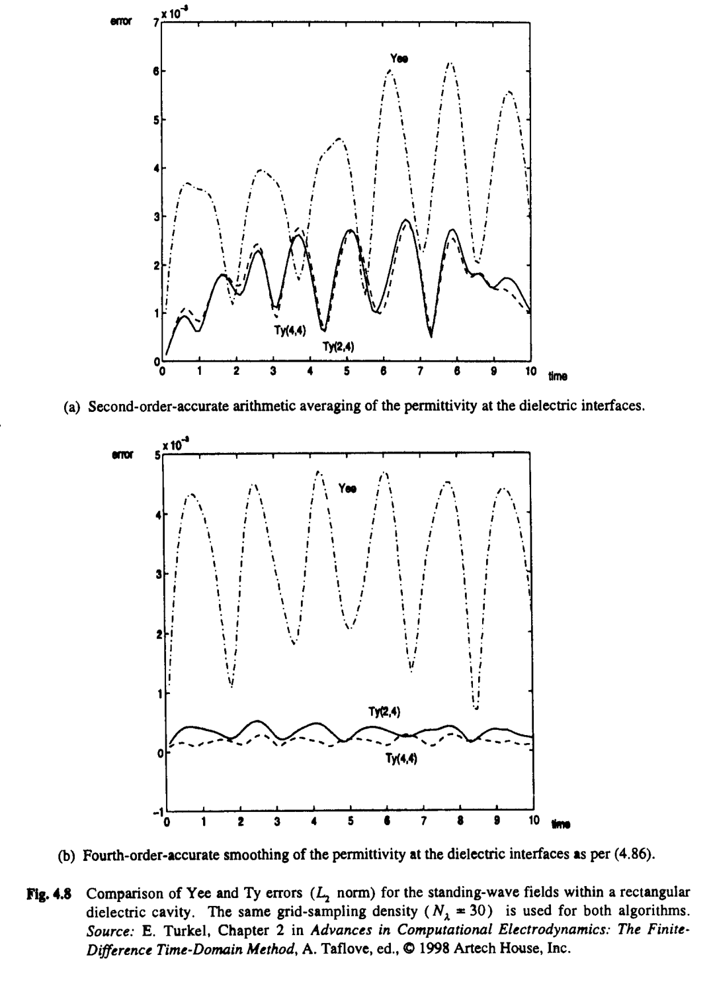

*Fig. 4.8. Compare the vertical scales: in (a), with simple averaging, the Ty curves reach about half the Yee error; in (b), with fourth-order smoothing, the Ty curves hug zero while Yee oscillates up to about $4.5\times10^{-3}$.*

This lesson matters for photonics: **how a code treats material boundaries** (Meep's subpixel smoothing, Tidy3D's subpixel averaging) can matter as much as the bulk accuracy of the stencil.

### 4.9.3 Strategy 3: Use hexagonal grids

Chapter 3 (§3.7.2) introduced two hexagonal grids for 2-D problems (Fig. 4.9 repeats them): (a) an unstaggered grid where all fields sit at the same points, and (b) a staggered grid with a dual grid, which is the direct hexagonal cousin of Yee. Each point has six neighbours instead of four, arranged more evenly in angle.

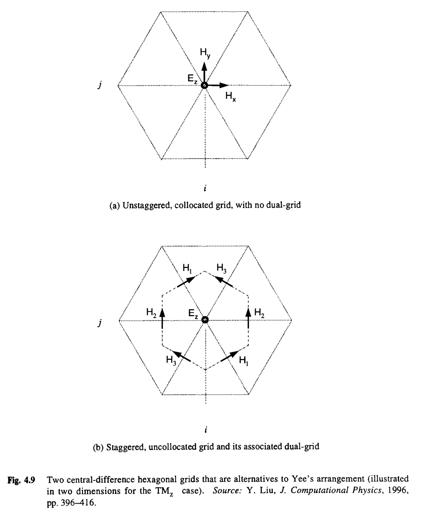

*Fig. 4.9. In (a) $E_z$, $H_x$, $H_y$ share one point; in (b) $E_z$ sits at the centre and three $H$ components ($H_1$, $H_2$, $H_3$) sit on the dashed hexagon around it, mimicking Yee's "E surrounded by circulating H".*

Applying the §4.5.2 analysis gives (4.87)–(4.90):

$$\Delta\tilde v_{aniso}\big|_{hex,\;(a)} \cong \frac{\pi^4}{60\,N_\lambda^4}\times100\,\% \approx \frac{1.62}{N_\lambda^4}\times100\,\% \tag{4.89}$$

$$\Delta\tilde v_{aniso}\big|_{hex,\;(b)} \cong \frac{\pi^4}{360\,N_\lambda^4}\times100\,\% \approx \frac{0.27}{N_\lambda^4}\times100\,\% \tag{4.90}$$

Remarkably, both are **fourth-order** in $N_\lambda$, even though they use only second-order (nearest-neighbour) differences. The reason: on a hexagonal grid the leading second-order error term is the same in every direction (it equals the angle-average of the Cartesian error), so it shifts all speeds equally and does not contribute to anisotropy. Compared with Yee (4.28), the ratios are $\pi^2/(5N_\lambda^2)$ for grid (a) and $\pi^2/(30N_\lambda^2)$ for grid (b) (4.91)–(4.92): at $N_\lambda = 20$, 1/200 and 1/1200. They also beat the fourth-order Cartesian schemes by a fixed factor (4.93)–(4.94).

Because hexagonal grids still use only nearest neighbours, they handle material jumps and metal surfaces as easily as Yee, with no special interface treatment. The main difficulty is 3-D: the natural extension (a tetradecahedron / dual-tetrahedron mesh) needs a computer mesh generator. For electrically 2-D problems the expected saving is at least $8^2 = 64$ times in computer resources.

### 4.9.4 Strategy 4: Use discrete Fourier transforms to calculate the spatial derivatives

The **pseudospectral time-domain (PSTD)** method computes space derivatives with the FFT. All field components sit at the same points (an unstaggered, "collocated" grid, Fig. 4.10). Along each grid line:

$$\left\{\frac{\partial V}{\partial x}\bigg|_i\right\} = -\mathcal F^{-1}\left(j\tilde k_x\,\mathcal F\{V_i\}\right) \tag{4.95}$$

where $\mathcal F$ and $\mathcal F^{-1}$ are the forward and inverse discrete Fourier transforms. In words: transform the line of values into a sum of waves, multiply each wave by its own $-j\tilde k_x$ (exact differentiation of $e^{-j\tilde k_x x}$), and transform back. All derivatives on the line come out at once.

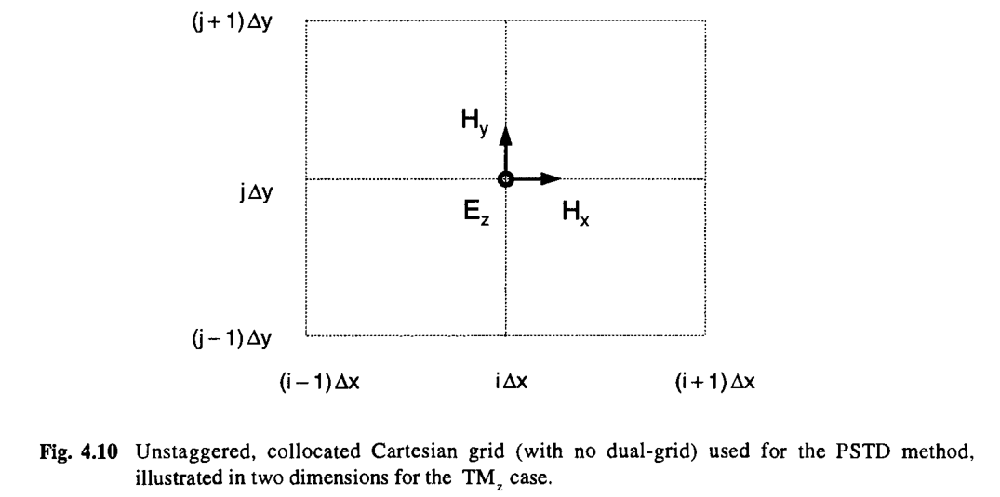

*Fig. 4.10. Note $E_z$, $H_x$ and $H_y$ all sit at the same grid point — no half-cell offsets, unlike Yee.*

By the Nyquist theorem, (4.95) is **exact** for every wave with at least 2 points per wavelength ($|\tilde k_x| \le \pi/\Delta x$). The space differencing is said to be of "infinite order". The FFT assumes the data repeat periodically, which would make waves wrap around from one edge to the other; PML boundaries absorb them before that happens. Time-stepping is still ordinary second-order leapfrog.

So the only remaining dispersion is from time-stepping, and it is the same in every direction:

$$|\tilde k| = \frac{2}{c\,\Delta t}\sin\!\left(\frac{\omega\Delta t}{2}\right), \qquad \frac{\tilde v_p}{c} = \frac{\omega\Delta t/2}{\sin(\omega\Delta t/2)} \tag{4.96a,b}$$

With the time-sampling density $N_t = T/\Delta t$ (time steps per period):

$$\Delta\tilde v_{physical} = \left|\frac{\pi/N_t}{\sin(\pi/N_t)} - 1\right|\times100\,\%, \qquad \Delta\tilde v_{aniso} = 0 \tag{4.97–4.98}$$

Note that PSTD waves are slightly **too fast** (the opposite of Yee), because only the time error is left and it has that sign.

**Table 4.1 — Residual phase-velocity error of PSTD versus time sampling**

| $N_t$ | $\Delta\tilde v_{physical}$ | $N_t$ | $\Delta\tilde v_{physical}$ |
|---|---|---|---|
| 2 | +57 % | 15 | +0.73 % |
| 4 | +11 % | 20 | +0.41 % |
| 8 | +2.6 % | 25 | +0.26 % |
| 10 | +1.7 % | 30 | +0.18 % |

Consequences: the **space** sampling can stay at about 2 points per wavelength regardless of the problem size, but the **time** sampling must get finer as the problem gets larger, because the time error still accumulates with distance. For pulses, $N_t$ must be counted for the highest significant frequency. The reported savings for 16–64-wavelength problems (with no details smaller than half a wavelength) reach $8^D$ in $D$ dimensions, and grow with problem size.

The weakness is interfaces. The FFT assumes smooth data along each line. Across a dielectric interface the tangential fields are continuous, so PSTD works. At a metal surface the fields jump (lit side versus shadow side), and the global FFT can carry field across the metal sheet in an unphysical way. Until special boundary treatments exist, PSTD suits all-dielectric problems and nonlinear optics (where having all components at one point avoids interpolation errors).

## 4.10 Alternating-direction-implicit time-stepping algorithm for operation beyond the Courant limit

> **In one sentence:** ADI splits each time step into two half-steps, each implicit in one direction; the result is stable for any $\Delta t$, so the time step is limited only by accuracy.

The 3-D Courant bound,

$$\Delta t \le \frac{1}{c\sqrt{\dfrac{1}{(\Delta x)^2} + \dfrac{1}{(\Delta y)^2} + \dfrac{1}{(\Delta z)^2}}} \tag{4.99}$$

is a real burden when tiny geometric details force tiny cells, but the physics happens slowly, so many cycles must be simulated. The time step is then set by the smallest cell, not by the wave.

**Table 4.2 — Problem classes made hard by the Courant limit**

| Problem class | $\Delta$ | Time to simulate $T_{sim}$ | $\Delta t_{max}$ | Number of steps $N_{sim}$ |
|---|---|---|---|---|
| Low-frequency bioelectromagnetics | ~1 mm | ~100 ms | ~2 ps | ~$5\times10^{10}$ |
| VLSI digital logic operation | ~0.25 µm | ~1 ns | ~0.5 fs | ~$2\times10^6$ |

With an unconditionally stable method, $\Delta t$ only needs to resolve the signal in time: about **20 or more samples per period** of the fastest significant frequency (or of the fastest rise time). For the bioelectromagnetics case, $\Delta t$ could be 0.1 ms instead of 2 ps: $10^3$ steps instead of $5\times10^{10}$.

### 4.10.1 Numerical formulation of the Zheng / Chen / Zhang algorithm

The ZCZ ADI method uses the same Yee space lattice, but all six field components are stored at the same time levels (collocated in time, not staggered). Each full step $n \to n+1$ has two sub-steps: $n \to n+\frac12$ and $n+\frac12 \to n+1$.

- In each sub-step, each curl has two derivative terms. One is treated **implicitly** (using the unknown field at the new time level) and the other **explicitly** (using the known field at the old time level) (4.100)–(4.103). In the second sub-step the roles swap. That is the "alternating direction".
- Eliminating the $H$ fields gives, for each $E$ component, a **tridiagonal system** along one family of grid lines (4.104), (4.106). Example: in sub-step 1, $E_x$ is found by solving one tridiagonal system along every $y$-directed line. The coefficients involve $(\Delta t)^2/(4\varepsilon\mu\Delta^2)$ multiplying the implicit terms.
- After the new $E$ values are known, the $H$ updates (4.105), (4.107) are explicit.

### 4.10.2 Numerical stability

Fourier-transform the fields in space. Each sub-step becomes multiplication of the six-component field vector (4.108) by a $6\times6$ matrix, $\mathbf M_1$ (4.110) and $\mathbf M_2$ (4.113), whose entries involve

$$W_\ell = \frac{\Delta t}{\Delta\ell}\,2j\sin\!\left(\frac{\tilde k_\ell\Delta\ell}{2}\right), \qquad \ell = x, y, z \tag{4.111}$$

A full step is $\mathbf F^{n+1} = \mathbf M_2\mathbf M_1\mathbf F^n$ (4.114). Using the computer-algebra program MAPLE, Zheng, Chen and Zhang showed that every eigenvalue of $\mathbf M_2\mathbf M_1$ has magnitude exactly 1 **for any $\Delta t$**. Magnitude 1 means no growth and no decay: the scheme is **unconditionally stable**. The Courant condition is gone.

### 4.10.3 Numerical dispersion

Zheng and Chen also derived the ADI dispersion relation (4.115), in terms of the $W_\ell$. Below the Courant limit it is close to ordinary Yee. Above the limit, accuracy degrades steadily as $\Delta t$ grows. Stability is free; accuracy is not. This is acceptable for the Table 4.2 problems as long as $\Delta t$ still samples the fastest important feature of the signal about 20 times.

### 4.10.4 Discussion

Early results showed stable, accurate runs at $\Delta t$ up to 10,000 times the Courant limit. For the problem classes of Table 4.2, ADI could cut the number of time steps by orders of magnitude.

For silicon photonics, ADI is rarely needed: the cells are set by the wavelength (tens of nanometres), so the Courant step is already matched to the optical period. It matters when tiny features (a 5 nm gap, a thin metal film) force cells far smaller than the wavelength.

## 4.11 Summary

> **In one sentence:** the Yee grid is a slightly slow, slightly anisotropic "aether" whose errors fall as $1/N_\lambda^2$, and it is stable only for $S \le 1/\sqrt D$; there are clever ways around both limits.

The chapter covered:

- the numerical dispersion relation of the Yee algorithm in 2-D (4.5) and 3-D (4.12);
- the extension to three dimensions;
- comparison with the ideal relation (4.13), and the special cases with zero dispersion (including the 1-D magic time step);
- anisotropy of the numerical phase velocity, sample values, Newton's method (4.16), the error measures (4.18), and the intrinsic grid anisotropy $c^*/c$ and $\pi^2/(12N_\lambda^2)$ (4.26)–(4.28);
- complex-valued numerical wavenumbers, strong decay and faster-than-light artifacts for $N_\lambda \lesssim 2$–3;
- numerical stability by complex-frequency analysis, the Courant limits for 1-D, 2-D and 3-D, and the common growth factor (4.65);
- the generalised stability problem (boundaries, meshes, materials);
- modified algorithms that reduce dispersion: velocity centring, explicit and implicit (Ty) fourth-order differences, hexagonal grids, and PSTD;
- ADI time-stepping, which is stable for any $\Delta t$.

The field moves fast; the book advises following *IEEE Transactions on Antennas and Propagation* and *IEEE Transactions on Microwave Theory and Techniques*.

## Practical rules for a photonics student (Meep, Tidy3D)

### Rule 1: count points per wavelength *in the material*

All formulas above use $c = 1/\sqrt{\mu\varepsilon}$ of the medium the wave is in (look again at (4.5)). Inside a material of index $n$, the wavelength shrinks to $\lambda_0/n$. So the sampling density that matters is

$$N_\lambda^{(material)} = \frac{\lambda_0/n}{\Delta} = \frac{\lambda_0}{n\,\Delta}$$

For telecom light ($\lambda_0 = 1.55$ µm):

| Material | $n$ | Wavelength in material | Cell for 10 pts/λ | Cell for 20 pts/λ |
|---|---|---|---|---|
| Air | 1.00 | 1.550 µm | 155 nm | 78 nm |
| SiO$_2$ (oxide) | 1.444 | 1.073 µm | 107 nm | 54 nm |
| Si | 3.48 | 0.445 µm | 45 nm | 22 nm |

**Silicon needs a grid about 3.5 times finer than air** for the same accuracy, because its wavelength is 3.5 times shorter. Since the grid is usually uniform, the highest-index material sets the cell size for the whole simulation.

### Rule 2: what Meep's "resolution" means

In Meep, `resolution` is the number of grid cells per unit of length. If your unit length is 1 µm, `resolution = 20` means $\Delta = 50$ nm. Then, at 1550 nm:

- in air, $N_\lambda = 1.55 \times 20 = 31$;
- in silicon, $N_\lambda = 1.55 \times 20 / 3.48 = 8.9$.

The plane-wave phase-velocity error (on-axis, from (4.14b)) for these settings is:

| `resolution` (px/µm) | $\Delta$ | $N_\lambda$ in Si | speed error in Si | $N_\lambda$ in air | speed error in air |
|---|---|---|---|---|---|
| 10 | 100 nm | 4.5 | 9.7 % | 15.5 | 0.52 % |
| 20 | 50 nm | 8.9 | 2.1 % | 31 | 0.13 % |
| 40 | 25 nm | 17.8 | 0.51 % | 62 | 0.03 % |
| 60 | 17 nm | 26.7 | 0.23 % | 93 | 0.01 % |

(These are worst-case numbers for a plane wave fully inside the material. A guided mode has part of its field in the cladding and travels partly sideways, so its error is somewhat smaller. Meep's subpixel smoothing also improves the accuracy at interfaces.) The trend is what matters: errors fall about 4 times per doubling of resolution, and they add up along the device. A 2 % speed error in silicon means an extra phase of about $7^\circ$ per wavelength travelled, which over a 100 µm path is several full cycles. For phase-sensitive devices (rings, MZIs, gratings) use resolution 30–50 px/µm or more, and always run a **convergence test**: double the resolution and check the result stops changing.

### Rule 3: what Meep's Courant factor means

Meep's `Courant` parameter is exactly the book's $S = c\,\Delta t/\Delta$ (with $c$ the vacuum speed). Its default is **0.5**. Meep keeps one $S$ whatever the dimension, and stability needs $S \le n_{min}/\sqrt{D}$, where $n_{min}$ is the smallest refractive index in the cell (usually 1 for air). With $S = 0.5$, the 3-D limit $1/\sqrt3 = 0.577$ is satisfied, so the default is safe in 1-D, 2-D and 3-D.

Two subtleties:

- **Inside a material the effective Courant number is $S/n$**, because light there is slower. In silicon with Meep's default, $S_{Si} = 0.5/3.48 = 0.14$. That is far from 1, so the time error does not cancel much of the space error: the error in silicon is close to the pure space error (the $(1-S^2)$ factor is about 0.98).
- **Vacuum (or the lowest-index region) is the stability bottleneck**, because light is fastest there. Materials with index below 1 (e.g. some metal or plasma models near certain frequencies) can force a smaller Courant factor.

### Rule 4: what Tidy3D's settings mean

Tidy3D's `courant` parameter is a *normalised* Courant number, the book's $S_{norm} = S/S_{limit}$. Its default is 0.99, i.e. 99 % of the stability limit. Its automatic grid (`AutoGrid`) uses a minimum number of steps per wavelength *in each material* (`min_steps_per_wvl`, default 10), and refines the grid inside high-index regions like silicon. If a Tidy3D run diverges, the usual fixes are lowering `courant` (for example to 0.5–0.9, especially with dispersive or metallic materials, per §4.8) or checking the material models.

### Rule 5: quick checklist

1. Find the highest index $n_{max}$ and the shortest wavelength $\lambda_{min}$ in your source band.
2. Choose $\Delta \le \lambda_{min}/(n_{max} N_\lambda)$ with $N_\lambda \ge 10$ for rough work, 20–30 for phase-sensitive work.
3. Keep $S$ below $1/\sqrt D$ (in vacuum terms). In Meep leave `Courant = 0.5`; in Tidy3D leave `courant = 0.99` unless the run diverges.
4. Never trust one resolution. Do a convergence test.
5. Remember errors accumulate with distance: a long device needs a finer grid than a short one for the same phase accuracy.

!!! warning "Common confusions"
    - **"A smaller time step makes FDTD more accurate."** Not for dispersion. Below the Courant limit, reducing $S$ makes the phase error slightly *worse* (the time error that used to cancel part of the space error goes away), and the anisotropy does not change. Accuracy is controlled mainly by the **space** step. A smaller $\Delta t$ only costs run time.
    - **"Numerical dispersion is the same as material dispersion."** No. Material dispersion is real physics (silicon's index changes with wavelength). Numerical dispersion is an error of the grid, present even in a simulated vacuum.
    - **"The Courant limit depends on the material."** The Yee stability limit is set by the fastest wave on the grid, which is in the lowest-index region (usually air), so $S \le 1/\sqrt D$ in vacuum terms. Silicon itself does not tighten it.
    - **"$N_\lambda$ uses the free-space wavelength."** The book writes $\lambda_0$ for a vacuum grid. In a material, use the wavelength inside the material, $\lambda_0/n$. That is why silicon needs a finer grid.
    - **"Waves in FDTD can never go faster than light, so the superluminal stuff is wrong."** Badly sampled waves ($N_\lambda < 2$ on axis at $S = 0.5$) really do have $\tilde v_p > c$ in the grid; they just decay within a few cells. It is a grid artifact, but a real one.
    - **"The magic time step works in 2-D and 3-D too."** Only for waves along the exact diagonal. In general 2-D/3-D problems, $S = 1/\sqrt2$ or $1/\sqrt3$ is the stability limit, not a dispersion-free setting.
    - **"Instability means the physics is unstable."** No. Numerical instability is a grid-scale checkerboard ($2\Delta$ wavelength) growing from rounding noise. If you see a checkerboard pattern exploding, suspect $\Delta t$, a boundary condition, or a material model, not your device.
    - **"Errors are small, so they don't matter."** A 0.3 % speed error is small per wavelength but grows linearly with distance. Over 100 wavelengths it is about 100° of phase.

## Check yourself

**1. Write the 1-D numerical dispersion relation of the Yee algorithm and show it becomes $\omega = ck$ for small cells.**

??? note "Answer"
    $\frac{1}{c\Delta t}\sin(\omega\Delta t/2) = \frac{1}{\Delta}\sin(\tilde k\Delta/2)$. For small arguments $\sin x \approx x$, so $\frac{\omega\Delta t/2}{c\Delta t} = \frac{\tilde k\Delta/2}{\Delta}$, i.e. $\omega/c = \tilde k$.

**2. Where do the sine functions in the dispersion relation come from?**

??? note "Answer"
    From central differences of a complex exponential: $e^{j\theta/2} - e^{-j\theta/2} = 2j\sin(\theta/2)$. An exact derivative multiplies a plane wave by $j\omega$ (or $-jk$); a central difference multiplies it by $\frac{2j}{\Delta t}\sin(\omega\Delta t/2)$ (or the matching space version). So the grid effectively replaces $\omega$ by $\frac{2}{\Delta t}\sin(\omega\Delta t/2)$ and $k$ by $\frac{2}{\Delta}\sin(k\Delta/2)$.

**3. A 1-D grid has $N_\lambda = 10$ and $S = 0.5$. How slow is the numerical wave, and what phase error builds up over 10 wavelengths?**

??? note "Answer"
    $\xi = \sin(0.05\pi)/0.5 = 0.312869$; $\sin^{-1}\xi = 0.318212$; $\tilde v_p/c = 0.314159/0.318212 = 0.98726$, i.e. 1.27 % slow. Phase lag $\approx 3600^\circ \times (1/0.98726 - 1) \approx 46^\circ$.

**4. What is the magic time step and why is it special?**

??? note "Answer"
    $S = 1$, i.e. $\Delta t = \Delta/c$, in 1-D. Then $\sin(\omega\Delta t/2) = \sin(\tilde k\Delta/2)$, so $\omega/\tilde k = \Delta/\Delta t = c$ exactly for every wavelength: no numerical dispersion at all. Light moves exactly one cell per step and the leapfrog just shifts the wave. It is also exactly at the 1-D stability limit.

**5. State the Courant limits for uniform 1-D, 2-D and 3-D Yee grids, and the general formula for unequal cells.**

??? note "Answer"
    $S \le 1$, $S \le 1/\sqrt2 \approx 0.707$, $S \le 1/\sqrt3 \approx 0.577$. In general $\Delta t \le 1\big/\left(c\sqrt{1/\Delta x^2 + 1/\Delta y^2 + 1/\Delta z^2}\right)$.

**6. Which wave pattern becomes unstable first, and how can you recognise it in a field plot?**

??? note "Answer"
    The Nyquist wavevector $\tilde{\mathbf k} = \frac{\pi}{\Delta}(\pm\hat x \pm\hat y \pm\hat z)$: a pattern that flips sign from each cell to the next in every direction, travelling along the grid diagonals. In a plot it looks like a growing checkerboard; along an axis the field alternates sign every cell (wavelength $2\Delta$), and in time it flips sign every step.

**7. A 3-D simulation uses $S = 0.578$. Is it stable? If not, how fast does it grow?**

??? note "Answer"
    The limit is $1/\sqrt3 = 0.57735$, so $S_{norm} = 0.578\sqrt3 = 1.0011$. Unstable. $q = (1.0011 + \sqrt{1.0011^2-1})^2 = (1.0011 + 0.0469)^2 \approx 1.098$ per step: rounding noise reaches order 1 in about $\ln(10^{16})/\ln(1.098) \approx 390$ steps.

**8. At $N_\lambda = 20$, the anisotropy is 0.208 % at both $S = 0.5$ and $S = 0.01$. What does this tell you?**

??? note "Answer"
    The direction-dependence of the speed comes from the space grid, not from the time step. Time errors are the same in every direction, so they shift all speeds equally. The anisotropy is an intrinsic property of the lattice, approximately $\pi^2/(12N_\lambda^2)$.

**9. Why can a badly sampled wave travel faster than light in the grid, and why is it not a disaster?**

??? note "Answer"
    Below $N_{\lambda,transition}$ (3 on axis at $S = 0.5$) the numerical wavenumber is complex with real part stuck at $\pi/\Delta$, so $\tilde v_p = 2c/N_\lambda$, which exceeds $c$ for $N_\lambda < 2$. But the imaginary part makes it decay strongly (up to about 2.6 nepers per cell), so it only shows up as a small precursor at sharp wavefronts.

**10. You simulate a silicon waveguide at 1550 nm in Meep with `resolution = 20` (µm units). How many points per wavelength are there in the silicon, and roughly how big is the plane-wave speed error?**

??? note "Answer"
    $\Delta = 50$ nm; wavelength in Si $= 1.55/3.48 = 0.445$ µm; $N_\lambda \approx 8.9$. The effective Courant number in Si is $0.5/3.48 \approx 0.14$, so the error is about $\frac16(\pi/8.9)^2(1 - 0.02) \approx 2\,\%$. That is too coarse for phase-sensitive work; go to 40 or more and check convergence.

**11. Why does the explicit fourth-order scheme need a smaller time step than Yee?**

??? note "Answer"
    Its space operator, $\frac{27}{24}\sin(\cdot) - \frac{1}{24}\sin(3\,\cdot)$, can reach $\frac{28}{24} = \frac76$ instead of 1 (for the worst wavevector both terms reinforce). The stability bound scales with the inverse of this maximum, so $\Delta t$ must be $6/7$ of the Yee limit.

**12. What does ADI buy you, and what does it not?**

??? note "Answer"
    It removes the Courant stability limit entirely (all eigenvalues of the step matrix have magnitude 1 for any $\Delta t$), so tiny cells no longer force tiny time steps. It does not give accuracy for free: dispersion error grows as $\Delta t$ exceeds the Courant value, so $\Delta t$ must still give about 20 samples per period of the fastest important signal component.

## Key takeaways

- Replacing derivatives by central differences replaces $\omega$ by $\frac{2}{\Delta t}\sin\frac{\omega\Delta t}{2}$ and $k$ by $\frac{2}{\Delta}\sin\frac{k\Delta}{2}$. That substitution, in the Yee grid, gives the numerical dispersion relation (4.5)/(4.12).
- On the Yee grid, waves are **too slow**, slowest along the axes and fastest along the diagonals. The speed error is about $\frac16(\pi/N_\lambda)^2(1-S^2)$ in 1-D; the anisotropy is about $\pi^2/(12N_\lambda^2)$. Both fall 4× per doubling of points per wavelength, and both **accumulate with distance**.
- The 1-D **magic time step** $S = 1$ is exactly dispersion-free. In 2-D/3-D there is no such general setting.
- With fewer than about 2–3 points per wavelength, the wavenumber becomes complex: strong decay and faster-than-light precursors.
- **Courant condition**: $S = c\Delta t/\Delta \le 1/\sqrt D$ ($1$, $0.707$, $0.577$). Above it, the checkerboard mode grows by $q = [S_{norm} + \sqrt{S_{norm}^2-1}]^2$ per step, the same in any dimension. Even 0.05 % over the limit gives 6.5 % growth per step.
- Boundaries, non-uniform meshes and unusual materials can cause instability too (§4.8).
- Dispersion can be reduced by velocity centring, fourth-order stencils (explicit or implicit Ty), hexagonal grids, or PSTD; ADI removes the time-step limit.
- For photonics: count points per wavelength **inside the material** ($\lambda_0/n$). Silicon ($n \approx 3.48$) needs a grid about 3.5 times finer than air. In Meep, `resolution` 30–50 px/µm and `Courant = 0.5` are typical; in Tidy3D, `courant` is $S/S_{limit}$ (default 0.99). Always run a convergence test.
