# Week 2 · Day 2 — Tuesday 29 Sep 2026 · Yariv 1973 (coupled-mode theory)

*Simple-English study version of Amnon Yariv, "Coupled-Mode Theory for Guided-Wave Optics", IEEE Journal of Quantum Electronics QE-9(9), 919–933 (1973)*

---

!!! abstract "Today's slot"
    **Morning 06:15–07:45 (1.5 h):** "Coupled-mode derivation by hand (Yariv 1973): two coupled first-order ODEs → sinusoidal power transfer."

    **EXIT:** *Derivation reproduced with the book closed.*

    The schedule's HOW block says: *"do the derivation, do not read it."* So this page is built around one long derivation (the section "The core derivation, step by step" below). Work through it with a pen. Then close the page and redo it on a blank sheet. At the end you must be able to write down, from memory, three facts:

    1. Power moves between the two guides **sinusoidally** (up and down like a wave), not in one direction only. So a length sweep must use small enough steps, or it will miss the peaks.
    2. With no phase mismatch, **all** the power has crossed at $\kappa L = \pi/2$, so the full-transfer length is $L_c = \pi/(2\kappa)$. The **50:50** split happens at half that length, $\kappa L = \pi/4$, so $L_{50} = \pi/(4\kappa) = L_c/2$.
    3. The light that has crossed over is **90° behind** (phase factor $-i$) the light that stayed. This is where the ±90° phase difference in real MZIs and couplers comes from.

    **Evening 20:00–21:30:** Meep 2-D directional coupler, sweep the coupler length, find the 50:50 point. EXIT: Meep's $L_{50}$ agrees with the coupled-mode $L_{50}$ within 10 %. The section "Tonight's Meep sweep" near the end gives you the predicted number in advance (about **11.7 µm** for the schedule's geometry with air cladding).

!!! warning "A small slip in the schedule"
    The HOW block says "complete transfer at $\kappa z = \pi/2$, i.e. $L_{50} = \pi/(2\kappa) = L_\pi/2$". The first half is right: complete transfer is at $\kappa z = \pi/2$. But that length is the **full** cross-over length $L_\pi = \pi/(2\kappa)$, not the 50:50 length. The 50:50 length is $L_{50} = \pi/(4\kappa) = L_\pi/2$. The "$= L_\pi/2$" at the end of the line is the correct one. Use it tonight.

## Before you start: the big picture

Light in a chip travels in **waveguides**: thin strips of high-index material that trap light. A single, perfect, straight waveguide is boring. Light goes in one end and comes out the other end unchanged. Every useful device works by **disturbing** that perfect guide in some way, so that light moves from one pattern of travel to another:

- Put a second waveguide close by, and light leaks across into it. This is a **directional coupler** (a splitter).
- Carve small regular teeth into the guide, and light bounces backwards. This is a **Bragg grating** (a mirror or filter).
- Apply a voltage, a sound wave or a magnetic field, and light can change polarization or frequency. These are **modulators** and **switches**.

Before 1973 each of these effects had its own special theory. Yariv's paper shows that **all of them are the same mathematics**. You list the "patterns" (modes) the light could travel in. You say how strongly the disturbance links each pair of patterns (a number called the **coupling coefficient** $\kappa$). You say how badly their rhythms are out of step (the **phase mismatch** $\Delta$). Then two short equations tell you everything.

An everyday analogy: two identical pendulums hang from the same slightly springy bar. Start one swinging. The bar wobbles a little, and the second pendulum slowly picks up the motion, until the first stands still. Then the motion flows back. That is **codirectional coupling**. If the two pendulums have different lengths (different natural rhythms), the first one only ever passes a small part of its energy across. That is **phase mismatch**. Coupled-mode theory is the mathematics of these two pendulums, written for light.

This paper is the reason you can design a directional coupler, a Bragg grating or a ring resonator with a pocket calculator before you open Meep. In inverse design you will later let a computer invent the shape. But to know whether the computer's answer is sensible, you need this picture.

## Background you need

### Waves written as complex numbers

A light field oscillates in time and space. We write one frequency component as

$$E(z,t) = \mathrm{Re}\left[ A\, e^{i(\omega t - \beta z)} \right].$$

- $\omega$ (omega) is the **angular frequency**: how fast the field wiggles in time (radians per second).
- $\beta$ (beta) is the **propagation constant**: how fast the phase turns per unit length along the guide (radians per metre). For a mode with effective index $n_{\text{eff}}$, $\beta = 2\pi n_{\text{eff}}/\lambda$. Example: $n_{\text{eff}} = 2.44$, $\lambda = 1.55$ µm gives $\beta = 9.89$ rad/µm.
- $A$ is a **complex amplitude**. Its size $|A|$ is how big the wave is. Its angle (phase) says where the wave is in its cycle.
- $e^{-i\beta z}$ with $\omega t - \beta z$ means the wave moves towards $+z$. If you see $\omega t + \beta z$, the wave moves towards $-z$.

Multiplying by $-i = e^{-i\pi/2}$ means "shift the wave 90° later". Multiplying by $e^{-i\Delta z}$ means "a phase that keeps turning as you move along $z$".

The paper uses the engineering habit of writing $e^{i\omega t}$ (physicists often write $e^{-i\omega t}$). It also writes "c.c." for "plus the complex conjugate", which turns a complex expression into a real field.

### Modes and effective index

A **mode** is a field shape across the waveguide that keeps its shape as it travels. Only its phase moves forward, as $e^{-i\beta z}$. Each mode has its own $\beta$, and so its own **effective index** $n_{\text{eff}} = \beta\lambda/(2\pi)$. A 500 nm × 220 nm silicon strip in oxide at 1550 nm has a fundamental TE mode with $n_{\text{eff}} \approx 2.44$.

Two facts about modes matter a lot today:

1. **Modes are orthogonal.** If you multiply two different mode shapes and integrate across the guide, you get zero. This is like two perpendicular arrows having zero dot product. It means you can measure "how much of mode $m$ is in this field" by projecting onto mode $m$.
2. **Modes form a basis.** Any field in the guide can be written as a sum of modes (plus some "radiation" that escapes). So instead of tracking a whole field, we can track a short list of complex numbers: one amplitude per mode.

### Evanescent tails and overlap

A mode does not stop at the edge of the core. It has an **evanescent tail** that dies off exponentially in the cladding. If a second waveguide sits inside that tail, the two guides "feel" each other. The strength of that feeling is measured by an **overlap integral**: multiply the field of one mode by the field of the other and by the extra index that couples them, then add it up across the cross-section. Small gap → large overlap → strong coupling.

### Perturbation: a small change to a known problem

**Perturbation theory** means: solve a simple problem exactly, then treat a small extra change as a "push" that slowly alters the simple solution. Here the simple problem is a perfect waveguide with known modes. The push is the second guide, the grating teeth, the applied voltage, or the sound wave. Because the push is small, the mode amplitudes change **slowly** along $z$. That one assumption turns the full wave equation into two easy first-order equations.

### Polarization as a source

Inside a material, light pushes electrons around. The displaced charges form a **polarization** $\mathbf{P}$, and the material's response is written $\mathbf{D} = \epsilon_0 \mathbf{E} + \mathbf{P}$. If the material is changed slightly (a bump, a voltage, a strain), the polarization changes by some $\mathbf{P}_{\text{pert}}$. Yariv's key move is to treat $\mathbf{P}_{\text{pert}}$ as an **antenna** that radiates new light into the modes. If the antenna's pattern in $z$ moves in step with a mode, it pumps that mode efficiently. If not, its contributions cancel out.

### Phase matching

Imagine pushing a child on a swing. If you push at the swing's own rhythm, the swing goes higher and higher. If your rhythm is a bit off, sometimes you push with the motion and sometimes against it, and the swing never grows much. In waveguides the "rhythm" is $\beta$. Two modes exchange power well only if their phases advance together along $z$. The difference in their rhythms is the **phase mismatch** $\Delta$. Phase matching means making $\Delta = 0$.

### Two linear first-order ODEs and eigenvalues

An **ordinary differential equation (ODE)** relates a function to its derivatives. The equations today look like

$$\frac{d}{dz}\begin{bmatrix} a \\ b \end{bmatrix} = M \begin{bmatrix} a \\ b \end{bmatrix},$$

with $M$ a constant 2×2 matrix. The standard recipe: look for solutions $e^{\lambda z}$. Then $\lambda$ must be an **eigenvalue** of $M$, i.e. a root of $\det(M - \lambda I) = 0$. If the eigenvalues are imaginary, $\lambda = \pm i s$, the solutions are $\cos(sz)$ and $\sin(sz)$: things oscillate. If they are real, $\lambda = \pm s$, the solutions are $\cosh(sz)$ and $\sinh(sz)$: things grow or decay. This single fact explains the difference between a directional coupler (oscillation) and a Bragg mirror (exponential decay).

Reminder: $\cosh x = (e^x + e^{-x})/2$, $\sinh x = (e^x - e^{-x})/2$, $\cosh^2 x - \sinh^2 x = 1$, and $\sinh(ix) = i\sin x$, $\cosh(ix) = \cos x$.

### Power and amplitude normalisation

Yariv scales every mode shape so that a mode with amplitude $A$ carries exactly $|A|^2$ watts (per metre of width in a slab). This is a choice, but it is a very useful one. It makes "conservation of energy" into a simple statement about the amplitudes.

## I. Introduction

In plain words: by 1973 people were building the first "integrated optics", that is, many optical functions on one small chip, linked by thin-film waveguides. They also hoped for efficient nonlinear devices and modulators. Each phenomenon had been treated with its own ad hoc method. Yariv proposes one unified method, **coupled-mode theory**, and applies it to five families:

1. nonlinear optical interactions (making new frequencies, e.g. second-harmonic generation);
2. phase matching using a periodic perturbation;
3. electro-optic switching and modulation (a voltage changes the index);
4. photoelastic (acousto-optic) switching and modulation (a sound wave changes the index);
5. optical filtering and reflection by a periodic perturbation (gratings).

Our job today is mostly the general machinery (Section II) and its link to directional couplers. The other sections show how the same two equations reappear again and again, each time with a different $\kappa$ and $\Delta$.

## II. The coupled-mode formalism

### The two unperturbed modes, Eq. (1)

Start with two modes of a perfect guide, with amplitudes $A$ and $B$:

$$a(z,x,t) = A\, e^{i(\omega_a t - \beta_a z)} f_a(x), \qquad b(z,x,t) = B\, e^{i(\omega_b t \pm \beta_b z)} f_b(x). \tag{1}$$

- $f_a(x)$, $f_b(x)$ are the mode shapes across the guide.
- $A$, $B$ are **constant** when nothing disturbs the guide. Each mode just travels.
- The frequencies $\omega_a$, $\omega_b$ may differ (for example in nonlinear optics or with a sound wave). For a directional coupler they are the same.

### Adding a perturbation, Eq. (2)

Now add a perturbation. Power can move between the modes, so $A$ and $B$ start to depend on $z$. Yariv states (and later proves) that they always obey equations of this shape:

$$\frac{dA}{dz} = \kappa_{ab}\, B\, e^{-i\Delta z}, \qquad \frac{dB}{dz} = \kappa_{ba}\, A\, e^{+i\Delta z}. \tag{2}$$

Read the first one in words: "the amplitude of $a$ grows at a rate proportional to how much $b$ there is, times a coupling strength, times a turning phase." The turning phase $e^{-i\Delta z}$ is the key. If $\Delta \ne 0$, the push from $b$ to $a$ keeps changing its phase. Over a distance $\pi/\Delta$ it flips from helping to hurting, so the gains cancel. If $\Delta = 0$, every bit of push adds up.

**Where does $\Delta$ come from?** Write the full fields as amplitude × carrier: $a = A(z) e^{-i\beta_a z}$, $b = B(z) e^{-i\beta_b z}$. Suppose the physics says "field $a$ is driven by field $b$": $\frac{d}{dz}$ of $a$'s envelope times its carrier equals $-i\kappa$ times $b$. Then

$$\frac{dA}{dz} e^{-i\beta_a z} = -i\kappa\, B e^{-i\beta_b z} \quad\Longrightarrow\quad \frac{dA}{dz} = -i\kappa\, B\, e^{-i(\beta_b - \beta_a) z}.$$

So $\Delta = \beta_b - \beta_a$ for two guides side by side. In other situations the perturbation itself has a pattern $e^{-iKz}$ (a grating, a sound wave), and then $\Delta$ also contains $K$. For example, for a grating that couples forward and backward waves, $\Delta = 2\pi/\Lambda - 2\beta$. The general rule is: **$\Delta$ is the total phase rate left over** when you multiply all the $z$-dependent phases together.

### A. Codirectional coupling

"Codirectional" means both modes carry power in the **same** direction ($+z$). A directional coupler is the classic example.

#### Energy conservation forces a relation between $\kappa_{ab}$ and $\kappa_{ba}$, Eqs. (3)–(4)

With Yariv's normalisation, $|A|^2$ and $|B|^2$ are the powers. Without loss, the total must stay fixed:

$$\frac{d}{dz}\left(|A|^2 + |B|^2\right) = 0. \tag{3}$$

**Derivation.** Use $\frac{d}{dz}|A|^2 = A^*\frac{dA}{dz} + A\frac{dA^*}{dz} = 2\,\mathrm{Re}\left[A^* \frac{dA}{dz}\right]$. Insert Eq. (2):

$$\frac{d}{dz}|A|^2 = 2\,\mathrm{Re}\left[\kappa_{ab} A^* B e^{-i\Delta z}\right], \qquad \frac{d}{dz}|B|^2 = 2\,\mathrm{Re}\left[\kappa_{ba} B^* A e^{+i\Delta z}\right].$$

The second term is the real part of a number; the real part of a number equals the real part of its conjugate. So $\mathrm{Re}[\kappa_{ba} B^* A e^{i\Delta z}] = \mathrm{Re}[\kappa_{ba}^* A^* B e^{-i\Delta z}]$. Adding:

$$\frac{d}{dz}\left(|A|^2 + |B|^2\right) = 2\,\mathrm{Re}\left[(\kappa_{ab} + \kappa_{ba}^*)\, A^* B\, e^{-i\Delta z}\right].$$

For this to vanish for **every** possible $A$ and $B$, the bracket must vanish:

$$\kappa_{ab} = -\kappa_{ba}^*. \tag{4}$$

The common modern way to satisfy Eq. (4) is to write $\kappa_{ab} = -i\kappa$ and $\kappa_{ba} = -i\kappa^*$. Check: $-\kappa_{ba}^* = -(-i\kappa^*)^* = -(i\kappa) = -i\kappa = \kappa_{ab}$. ✓. The paper itself switches to this form from Eq. (70) on, and so does your schedule. **From here on we use**

$$\boxed{\;\frac{dA}{dz} = -i\kappa\, B\, e^{-i\Delta z}, \qquad \frac{dB}{dz} = -i\kappa^*\, A\, e^{+i\Delta z}\;}$$

with $\kappa$ real and positive in most simple cases (then $\kappa^* = \kappa$). Your schedule writes $2\delta$ instead of $\Delta$, so $\delta = \Delta/2$.

#### Boundary condition, Eq. (5)

Only mode $b$ enters at $z = 0$; mode $a$ starts empty:

$$B(0) = B_0, \qquad A(0) = 0. \tag{5}$$

#### The solution, Eqs. (6)–(7)

The paper states the answer. Below we **derive** it. The result, in our convention, is

$$A(z) = -i\,\frac{\kappa}{s}\, B_0\, e^{-i\Delta z/2}\, \sin(sz), \qquad B(z) = B_0\, e^{+i\Delta z/2}\left[\cos(sz) - i\,\frac{\Delta}{2s}\sin(sz)\right], \tag{6}$$

$$s \equiv \sqrt{\kappa^2 + (\Delta/2)^2} = \tfrac{1}{2}\sqrt{4\kappa^2 + \Delta^2}.$$

This is exactly the paper's Eq. (6) (the paper's $\tfrac12(4\kappa^2+\Delta^2)^{1/2}$ is our $s$). One remark: the paper's prefactor $-2i\kappa_{ab}/(4\kappa^2+\Delta^2)^{1/2}$ matches equations written with an explicit $-i$, as in its Eq. (70). If you use Eq. (2) literally, the prefactor is $\kappa_{ab}/s$ instead. The difference is only a constant phase; the **powers** are identical either way.

When phase matched ($\Delta = 0$, so $s = \kappa$):

$$A(z) = -i B_0 \sin(\kappa z), \qquad B(z) = B_0 \cos(\kappa z). \tag{7}$$

The paper writes Eq. (7) with the full carriers $e^{i(\omega t - \beta z)}$ attached and with the factor $\kappa_{ab}/\kappa$ (a pure phase) in front of the sine.

### The core derivation, step by step

This is the part you must redo on paper. There are two routes. Do both. They meet in the same place.

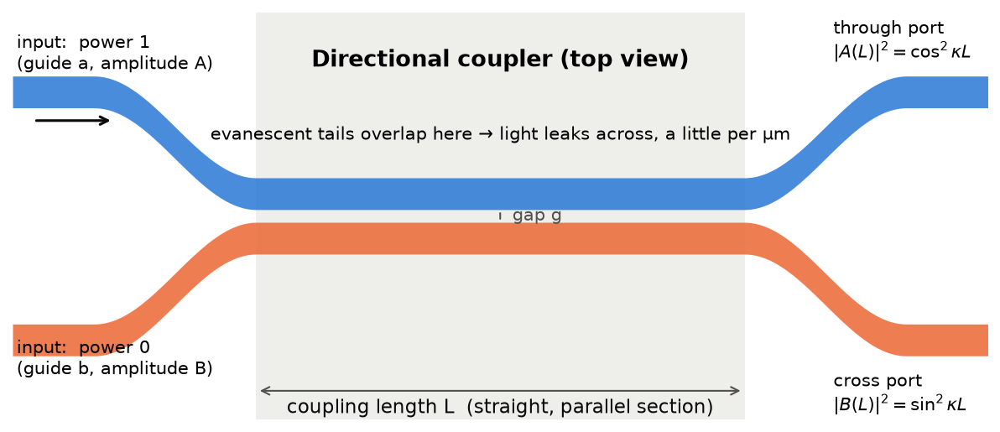

**How to read this figure.** Two waveguides (blue and orange) come together, run side by side for a length $L$ with a small gap $g$, then separate again. In the straight section the evanescent tails overlap, so light leaks across a little per micrometre. The labels at the right show the two outputs predicted below for the phase-matched case: $\cos^2\kappa L$ stays, $\sin^2\kappa L$ crosses. (In this sketch light enters guide $a$; in the paper's Eq. (5) it enters $b$. The maths is the same with the letters swapped.)

#### Route 1: remove the turning phase, then solve a constant-coefficient system

**Step 1 — Write the equations.**

$$A' = -i\kappa B e^{-i\Delta z}, \qquad B' = -i\kappa A e^{+i\Delta z}$$

(we take $\kappa$ real; the prime $'$ means $d/dz$).

**Step 2 — Remove the $z$-dependent coefficients.** The exponentials make the coefficients depend on $z$, which is annoying. Split the mismatch evenly between the two modes: define new variables

$$A = a\, e^{-i\Delta z/2}, \qquad B = b\, e^{+i\Delta z/2}.$$

(Why half and half? Because then each side carries half the turning, and the two leftover phases cancel exactly. Try it.)

**Step 3 — Differentiate and substitute.** Product rule on $A$:

$$A' = \left(a' - \tfrac{i\Delta}{2} a\right) e^{-i\Delta z/2}.$$

The right-hand side is $-i\kappa\, b\, e^{+i\Delta z/2} e^{-i\Delta z} = -i\kappa\, b\, e^{-i\Delta z/2}$. Cancel the common $e^{-i\Delta z/2}$:

$$a' = +\tfrac{i\Delta}{2}\, a - i\kappa\, b.$$

Same for $B$: $B' = (b' + \tfrac{i\Delta}{2} b) e^{+i\Delta z/2}$ and the right side is $-i\kappa\, a\, e^{-i\Delta z/2} e^{+i\Delta z} = -i\kappa\, a\, e^{+i\Delta z/2}$. So

$$b' = -i\kappa\, a - \tfrac{i\Delta}{2}\, b.$$

**Step 4 — Matrix form.**

$$\frac{d}{dz}\begin{bmatrix} a \\ b \end{bmatrix} = \underbrace{\begin{bmatrix} i\Delta/2 & -i\kappa \\ -i\kappa & -i\Delta/2 \end{bmatrix}}_{M} \begin{bmatrix} a \\ b \end{bmatrix}.$$

Now the matrix $M$ is **constant**. This is the whole point of step 2.

**Step 5 — Eigenvalues.** Try $a, b \propto e^{\lambda z}$. Then $\det(M - \lambda I) = 0$:

$$\left(\tfrac{i\Delta}{2} - \lambda\right)\left(-\tfrac{i\Delta}{2} - \lambda\right) - (-i\kappa)(-i\kappa) = 0.$$

Expand the first product: $(-\lambda + \tfrac{i\Delta}{2})(-\lambda - \tfrac{i\Delta}{2}) = \lambda^2 - (\tfrac{i\Delta}{2})^2 = \lambda^2 + \tfrac{\Delta^2}{4}$. The second product: $(-i\kappa)^2 = -\kappa^2$, so minus it gives $+\kappa^2$. Therefore

$$\lambda^2 + \frac{\Delta^2}{4} + \kappa^2 = 0 \quad\Longrightarrow\quad \lambda = \pm i\sqrt{\kappa^2 + \frac{\Delta^2}{4}} = \pm i s.$$

**The eigenvalues are purely imaginary.** So the solutions are $\cos(sz)$ and $\sin(sz)$ — oscillation, not growth. This is fact (i): power transfer is sinusoidal.

**Step 6 — Apply the starting values to $a$.** Because $a$ is a combination of $e^{\pm isz}$, it is a combination of $\cos sz$ and $\sin sz$. Since $a(0) = A(0) = 0$, only the sine survives: $a = c \sin(sz)$. Find $c$ from the slope at $z = 0$. From step 3, $a'(0) = \tfrac{i\Delta}{2} a(0) - i\kappa\, b(0) = -i\kappa B_0$. And $a'(0) = c\, s$. So

$$c = -\frac{i\kappa B_0}{s}, \qquad a(z) = -i\frac{\kappa}{s} B_0 \sin(sz).$$

**Step 7 — Apply the starting values to $b$.** $b(0) = B_0$ and, from step 3, $b'(0) = -i\kappa\, a(0) - \tfrac{i\Delta}{2} b(0) = -\tfrac{i\Delta}{2} B_0$. A function of the form $p\cos sz + q \sin sz$ with value $B_0$ and slope $-\tfrac{i\Delta}{2}B_0$ at zero has $p = B_0$, $q = -\tfrac{i\Delta}{2s}B_0$:

$$b(z) = B_0\left[\cos(sz) - i\frac{\Delta}{2s}\sin(sz)\right].$$

**Step 8 — Put the phases back.** Multiply by $e^{\mp i\Delta z/2}$ and you get Eq. (6). Done.

**Step 9 — Powers.** The phase factors have size 1, so

$$P_a(z) = |A|^2 = |B_0|^2\,\frac{\kappa^2}{s^2}\,\sin^2(sz) = |B_0|^2\, \frac{\kappa^2}{\kappa^2 + \Delta^2/4}\,\sin^2\!\left(\sqrt{\kappa^2 + \tfrac{\Delta^2}{4}}\; z\right),$$

$$P_b(z) = |B|^2 = |B_0|^2\left[\cos^2(sz) + \frac{\Delta^2}{4s^2}\sin^2(sz)\right] = |B_0|^2 - P_a(z).$$

The last equality uses $\cos^2 = 1 - \sin^2$ and $\frac{\Delta^2}{4s^2} = 1 - \frac{\kappa^2}{s^2}$. So $P_a + P_b = |B_0|^2$ at every $z$: energy conservation "by inspection". This is the check the schedule mentions.

**Step 10 — Read off the three facts.** Set $\Delta = 0$:

- $P_a = |B_0|^2 \sin^2(\kappa z)$, $P_b = |B_0|^2\cos^2(\kappa z)$. Sinusoidal.
- All the power has moved when $\kappa z = \pi/2$: the **coupling length** (cross-over length) is $L_c = \dfrac{\pi}{2\kappa}$.
- Half the power has moved when $\sin^2(\kappa z) = 1/2$, i.e. $\kappa z = \pi/4$: $L_{50} = \dfrac{\pi}{4\kappa} = \dfrac{L_c}{2}$.
- The crossed amplitude is $-i \sin(\kappa z)$ while the through amplitude is $\cos(\kappa z)$. The ratio is $-i\tan(\kappa z)$: always a phase of $-90°$. **The crossed light lags by 90°.** At $L_{50}$ the two outputs are $\tfrac{1}{\sqrt 2}$ and $\tfrac{-i}{\sqrt 2}$: equal size, 90° apart. That is the transfer matrix of an ideal 3 dB coupler,

$$\begin{bmatrix} A_{\text{out}} \\ B_{\text{out}}\end{bmatrix} = \begin{bmatrix} \cos\kappa L & -i\sin\kappa L \\ -i\sin\kappa L & \cos\kappa L\end{bmatrix}\begin{bmatrix} A_{\text{in}} \\ B_{\text{in}}\end{bmatrix}.$$

!!! tip "Why does the 90° matter so much?"
    The 90° phase is not a quirk of the maths. It is forced by energy conservation. A lossless 2×2 device must have a **unitary** transfer matrix (it keeps the total power). For a symmetric coupler the diagonal and off-diagonal entries must then be 90° apart. That is why an MZI built from two 3 dB couplers needs a phase shifter to choose which output port gets the light, and why a "balanced" coupler output has a built-in ±90° offset.

#### Route 2: supermodes (the paper's Section X, done for a coupler)

Instead of asking how light moves between guide $a$ and guide $b$, ask: **which field patterns travel through the coupled pair without changing shape?** These are the **supermodes** (eigenmodes of the two-guide system).

Write the full fields, carriers included: $u_a = A e^{-i\beta_a z}$, $u_b = B e^{-i\beta_b z}$. Differentiating and using the boxed equations:

$$\frac{d u_a}{dz} = -i\beta_a u_a - i\kappa u_b, \qquad \frac{d u_b}{dz} = -i\beta_b u_b - i\kappa u_a.$$

In matrix form, $\frac{d}{dz}\mathbf{u} = -i H \mathbf{u}$ with

$$H = \begin{bmatrix} \beta_a & \kappa \\ \kappa & \beta_b \end{bmatrix}.$$

$H$ is a real symmetric (Hermitian) matrix, so it has real eigenvalues and orthogonal eigenvectors. Its eigenvalues are

$$\beta_\pm = \bar\beta \pm \sqrt{\left(\tfrac{\Delta}{2}\right)^2 + \kappa^2} = \bar\beta \pm s, \qquad \bar\beta = \frac{\beta_a + \beta_b}{2}.$$

(Derivation: $\det(H - \beta I) = (\beta_a - \beta)(\beta_b - \beta) - \kappa^2 = 0$, a quadratic. Its roots are the mean plus or minus half the square root of $(\beta_a - \beta_b)^2 + 4\kappa^2$.)

For two **identical** guides ($\Delta = 0$) the supermodes are the **even** pattern $(1, 1)/\sqrt2$ with $\beta_e = \beta + \kappa$ and the **odd** pattern $(1, -1)/\sqrt2$ with $\beta_o = \beta - \kappa$.

Light launched in one guide is $(1, 0) = \tfrac{1}{2}[(1,1) + (1,-1)]$: half even plus half odd. The two supermodes travel at different speeds. After a distance $z$ their relative phase is $(\beta_e - \beta_o) z = 2\kappa z$. When that relative phase reaches $\pi$, the sum has become $(1,1) - (1,-1) \propto (0, 1)$: all the light is in the other guide. So

$$2\kappa L_c = \pi \;\Longrightarrow\; L_c = \frac{\pi}{2\kappa}, \qquad \kappa = \frac{\beta_e - \beta_o}{2} = \frac{\pi\,(n_e - n_o)}{\lambda}, \qquad L_c = \frac{\lambda}{2\,(n_e - n_o)}.$$

The same answer as Route 1. This form is what you will actually use with a mode solver: compute the two supermode indices, subtract, done. It is also exactly how Chrostowski §4.1.1 (yesterday's reading) computes the cross-over length.

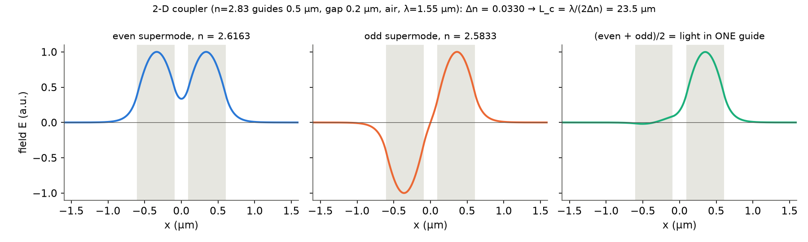

**How to read this figure.** I solved the 1-D slab cross-section of tonight's Meep geometry (two 0.5 µm guides of index 2.83, 0.2 µm gap, air around, $\lambda = 1.55$ µm). The grey bands are the guides. Left: the even supermode (same sign in both guides, slightly higher index $n_e = 2.6163$). Middle: the odd supermode (opposite signs, $n_o = 2.5833$). Right: half their sum is a field sitting almost entirely in one guide — this is "light launched in one guide". As the two supermodes slip in phase, that sum walks over to the other guide.

#### What the solution looks like

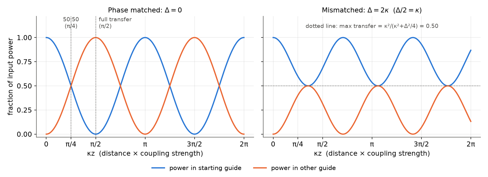

**How to read this figure.** The horizontal axis is $\kappa z$, distance measured in units of $1/\kappa$. Blue is the power still in the starting guide; orange is the power in the other guide. Left ($\Delta = 0$): complete, periodic exchange; 50:50 at $\kappa z = \pi/4$, full transfer at $\pi/2$, back again at $\pi$. Right ($\Delta = 2\kappa$): the exchange is faster ($s = \sqrt2\,\kappa$) but never exceeds 50 %. Mismatch makes the sloshing **shallower and quicker** at the same time.

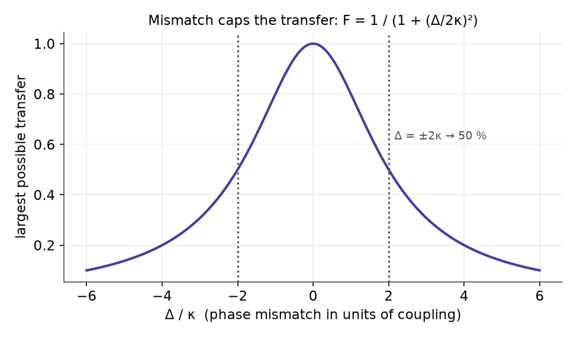

**How to read this figure.** This is the peak height of the orange curve as a function of $\Delta/\kappa$: $F = \kappa^2/(\kappa^2 + \Delta^2/4) = 1/(1 + (\Delta/2\kappa)^2)$. It is a Lorentzian. At $\Delta = \pm 2\kappa$ you can move at most half the power. When $|\Delta| \gg \kappa$, almost nothing crosses. That is why two guides of different width, side by side, barely talk to each other — and why an asymmetric coupler can be used as a mode or polarization filter.

#### Worked numbers: a silicon directional coupler

Take a typical design at $\lambda = 1550$ nm. Suppose a mode solver gives $n_e - n_o = 0.040$ for two 500 × 220 nm strips with a 200 nm gap (a realistic order of magnitude).

- $\kappa = \pi \times 0.040 / 1.55\ \mu\text{m} = 0.081\ \mu\text{m}^{-1}$.
- $L_c = \pi/(2\kappa) = 1.55/(2 \times 0.040) = 19.4$ µm.
- $L_{50} = L_c / 2 = 9.7$ µm.

Now make the guides slightly different: one guide 10 nm wider, so its $n_{\text{eff}}$ is higher by about 0.01 (roughly 0.001 per nm of width for a 500 nm wire). Then $\Delta = 2\pi \times 0.01/1.55 = 0.041$ µm⁻¹, $\Delta/2\kappa = 0.25$, and the maximum transfer is $1/(1 + 0.0625) = 0.94$. Small width differences cost only a few percent of the **maximum**, but they do shift the length at which the 50:50 point occurs, and gap errors change $\kappa$ itself strongly (κ falls roughly exponentially with gap). This is the seed of today's robustness worries.

### B. Contradirectional coupling

Now mode $a$ travels to the **left** ($-z$) and $b$ travels to the right:

$$a = A\, e^{i(\omega_a t + \beta_a z)}, \qquad b = B\, e^{i(\omega_b t - \beta_b z)}. \tag{8}$$

A periodic perturbation (a grating) can still couple them: light going forward is reflected backward. This is a **Bragg reflector**.

#### Energy conservation changes sign, Eqs. (9)–(10)

Mode $a$ carries power towards $-z$. So at a point $z$ the net power flowing to the right is $|B|^2 - |A|^2$. Without loss this must be the same everywhere:

$$\frac{d}{dz}\left(|A|^2 - |B|^2\right) = 0. \tag{9}$$

Repeat the earlier calculation with a minus sign: you get $2\,\mathrm{Re}[(\kappa_{ab} - \kappa_{ba}^*) A^* B e^{-i\Delta z}] = 0$, so

$$\kappa_{ab} = \kappa_{ba}^*, \tag{10}$$

$$\frac{dA}{dz} = \kappa_{ab}\, B\, e^{-i\Delta z}, \qquad \frac{dB}{dz} = \kappa_{ab}^*\, A\, e^{+i\Delta z}. \tag{11}$$

The sign change in conservation is everything. In the codirectional case the matrix gave $\lambda^2 = -(\kappa^2 + \Delta^2/4)$. Here it gives $\lambda^2 = +(\kappa^2 - \Delta^2/4)$. Let us see.

#### Derivation of the grating solution, Eqs. (12)–(13)

**Step 1.** Same substitution: $A = a e^{-i\Delta z/2}$, $B = b e^{+i\Delta z/2}$. You get

$$a' = \tfrac{i\Delta}{2}a + \kappa_{ab}\, b, \qquad b' = \kappa_{ab}^* a - \tfrac{i\Delta}{2} b.$$

**Step 2. Eigenvalues.** $\det = (\tfrac{i\Delta}{2} - \lambda)(-\tfrac{i\Delta}{2} - \lambda) - |\kappa_{ab}|^2 = \lambda^2 + \tfrac{\Delta^2}{4} - \kappa^2 = 0$, so

$$\lambda = \pm \tfrac12\sqrt{4\kappa^2 - \Delta^2} = \pm \frac{S}{2}, \qquad S \equiv \sqrt{4\kappa^2 - \Delta^2}, \quad \kappa \equiv |\kappa_{ab}|. \tag{13}$$

If $|\Delta| < 2\kappa$, $S$ is **real**: the solutions are $\cosh$ and $\sinh$ — the light **decays** into the grating. If $|\Delta| > 2\kappa$, $S$ is imaginary: the solutions oscillate, and most light passes through.

**Step 3. Boundary conditions.** The grating sits between $z = 0$ and $z = L$. Light $B(0)$ enters from the left. Nothing enters from the right, so the backward wave is zero at the far end: $A(L) = 0$. (This is a **two-point** boundary problem — one condition at each end — unlike the coupler, where both conditions were at $z = 0$.)

**Step 4. Solve.** $a(L) = 0$ means $a = c\, \sinh[\tfrac{S}{2}(z - L)]$. From the first equation, $\kappa_{ab} b = a' - \tfrac{i\Delta}{2} a = c\left[\tfrac{S}{2}\cosh(\cdot) - \tfrac{i\Delta}{2}\sinh(\cdot)\right]$. At $z = 0$, using $\cosh(-x) = \cosh x$ and $\sinh(-x) = -\sinh x$:

$$\kappa_{ab} B(0) = \frac{c}{2}\left[S\cosh\tfrac{SL}{2} + i\Delta \sinh\tfrac{SL}{2}\right] \;\Longrightarrow\; c = \frac{2\kappa_{ab}B(0)}{S\cosh\frac{SL}{2} + i\Delta\sinh\frac{SL}{2}}.$$

Multiplying top and bottom by $i$ and restoring the phases gives the paper's result:

$$A(z) = B(0)\,\frac{2i\kappa_{ab}\, e^{-i\Delta z/2}}{-\Delta\sinh\frac{SL}{2} + iS\cosh\frac{SL}{2}}\,\sinh\!\left[\tfrac{S}{2}(z - L)\right],$$

$$B(z) = B(0)\,\frac{e^{i\Delta z/2}}{-\Delta\sinh\frac{SL}{2} + iS\cosh\frac{SL}{2}}\left\{\Delta\sinh\!\left[\tfrac{S}{2}(z-L)\right] + iS\cosh\!\left[\tfrac{S}{2}(z-L)\right]\right\}. \tag{12}$$

**Step 5. Phase matched ($\Delta = 0$, $S = 2\kappa$).**

$$A(z) = B(0)\frac{\kappa_{ab}}{\kappa}\frac{\sinh[\kappa(z - L)]}{\cosh(\kappa L)}, \qquad B(z) = B(0)\frac{\cosh[\kappa(z - L)]}{\cosh(\kappa L)}. \tag{14}$$

**Step 6. Reflection and transmission.** The reflected power fraction is $R = |A(0)/B(0)|^2$:

$$R = \frac{4\kappa^2\sinh^2(SL/2)}{S^2\cosh^2(SL/2) + \Delta^2\sinh^2(SL/2)} \;\xrightarrow{\;\Delta = 0\;}\; \tanh^2(\kappa L).$$

Transmission $T = |B(L)/B(0)|^2 = 1/\cosh^2(\kappa L)$ at $\Delta = 0$, and $R + T = \tanh^2 + \mathrm{sech}^2 = 1$. ✓

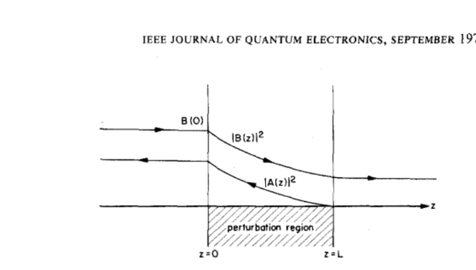

**How to read this figure.** A forward wave $B(0)$ enters the shaded "perturbation region" (the grating) at $z = 0$. Inside, its power $|B(z)|^2$ falls along $z$. The backward wave $|A(z)|^2$ is largest at the entrance and falls to zero at $z = L$ (nothing comes in from the right). The power that disappears from $B$ is not absorbed — it is turned around and leaves to the left as $A$. Some of $B$ survives to the far end and exits.

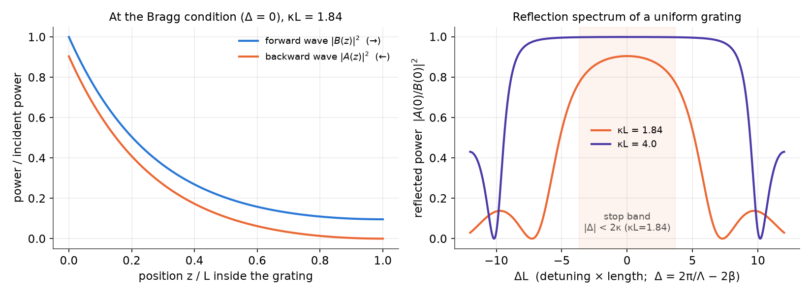

**How to read this figure.** Left: Eq. (14) for $\kappa L = 1.84$ (the value Yariv uses for Fig. 8). The forward power falls smoothly and about 10 % gets through; the reflected power at the entrance is $\tanh^2(1.84) = 0.90$. Right: reflectance versus detuning $\Delta L$ from the full Eq. (12). Inside the shaded **stop band** ($|\Delta| < 2\kappa$) reflection is high. Outside it there are side lobes and zeros. A longer or stronger grating ($\kappa L = 4$) gives a flatter, squarer top close to 100 %.

**Codirectional vs contradirectional, side by side.**

| | Codirectional (coupler) | Contradirectional (grating) |
|---|---|---|
| Directions | both $+z$ | one $+z$, one $-z$ |
| Conserved quantity | $\lvert A\rvert^2 + \lvert B\rvert^2$ | $\lvert A\rvert^2 - \lvert B\rvert^2$ |
| Coefficient rule | $\kappa_{ab} = -\kappa_{ba}^*$ | $\kappa_{ab} = \kappa_{ba}^*$ |
| Eigenvalues | $\pm i\sqrt{\kappa^2 + \Delta^2/4}$ (imaginary) | $\pm\sqrt{\kappa^2 - \Delta^2/4}$ (real in stop band) |
| Behaviour | $\cos$, $\sin$: sloshing back and forth | $\cosh$, $\sinh$: exponential decay |
| Boundary conditions | both at $z = 0$ | one at $z = 0$, one at $z = L$ |
| Key result | $P_{\text{cross}} = \sin^2\kappa L$ | $R = \tanh^2\kappa L$ |
| Typical phase-matching | equal $\beta$'s ($\Delta = \beta_b - \beta_a$) | grating period $\Lambda = \lambda/(2n_{\text{eff}})$ |

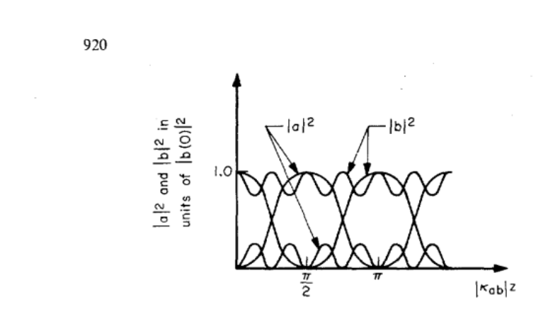

**How to read this figure.** This is the paper's version of our power-vs-length plot. The horizontal axis is $|\kappa_{ab}|z$. The two tall crossing curves are the phase-matched case: $|b|^2$ (incident mode) starts at 1 and falls to 0 at $\pi/2$ while $|a|^2$ rises to 1. The small humps near the bottom (and the dips near the top) are the mismatched case: only a small fraction swaps, but it swaps more often. Note: the text says the matched exchange has "period $\pi/2\kappa$"; strictly, $\pi/2\kappa$ is the distance to **full transfer**, and the power pattern repeats every $\pi/\kappa$.

## III. Electromagnetic derivations of the coupled-mode equations

Section II assumed the form of Eq. (2). Section III proves it from Maxwell's equations for a slab waveguide, and gives a formula for $\kappa$.

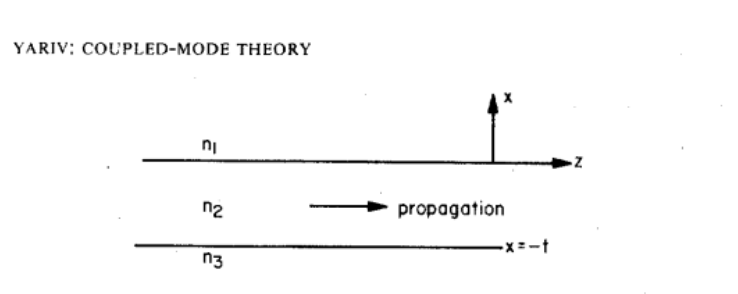

**How to read this figure.** Three flat layers: a cover with index $n_1$ on top ($x > 0$), a guiding film of thickness $t$ and highest index $n_2$ in the middle ($-t < x < 0$), and a substrate $n_3$ below. Light travels along $z$. Nothing changes along $y$ (the slab is infinitely wide). For 220 nm SOI with oxide on both sides, $n_1 = n_3 = 1.44$, $n_2 = 3.48$, $t = 0.22$ µm.

### A. TE modes, Eqs. (15)–(22)

A **TE mode** in this slab has its electric field along $y$ (parallel to the layers), with field parts $E_y, H_x, H_z$. In each layer $E_y$ obeys the wave equation

$$\nabla^2 E_y = \frac{n_i^2}{c^2}\frac{\partial^2 E_y}{\partial t^2}, \quad i = 1,2,3. \tag{15}$$

Look for a mode: $E_y = \mathcal{E}_y(x)\, e^{i(\omega t - \beta z)}$ (Eq. 16). Putting this into Eq. (15) gives, in each layer, $\mathcal{E}_y'' = (\beta^2 - n_i^2 k^2)\mathcal{E}_y$, with $k = \omega/c$. Inside the film $\beta < n_2 k$ so the solution oscillates (cos and sin). Outside, $\beta > n_{1,3}k$ so the solution decays exponentially. Hence the shape

$$\mathcal{E}_y(x) = \begin{cases} C e^{-qx}, & x \ge 0 \\ C[\cos hx - (q/h)\sin hx], & -t \le x \le 0 \\ C[\cos ht + (q/h)\sin ht]\, e^{p(x+t)}, & x \le -t \end{cases} \tag{17}$$

with the three transverse wavenumbers

$$h = \sqrt{n_2^2k^2 - \beta^2}, \quad q = \sqrt{\beta^2 - n_1^2k^2}, \quad p = \sqrt{\beta^2 - n_3^2k^2}. \tag{18}$$

$h$ says how fast the field wiggles across the film. $q$ and $p$ say how fast the tails die in the cover and substrate. The coefficients in Eq. (17) were chosen so that $\mathcal{E}_y$ and its slope already match at $x = 0$, and $\mathcal{E}_y$ matches at $x = -t$. The last condition — the slope matches at $x = -t$ — gives the **eigenvalue equation**

$$\tan(ht) = \frac{q + p}{h\,(1 - pq/h^2)}. \tag{19}$$

Only certain $\beta$ satisfy it. Those are the guided modes. (This is the same transcendental equation you solved in week 1, §3.2.2.)

**Normalisation.** Yariv picks the constant $C$ so that each mode carries 1 W per metre of width. The power flow along $z$ is $-\tfrac12\int E_y H_x^* dx$, and with $H_x = -(\beta/\omega\mu)E_y$ this becomes

$$\frac{\beta_m}{2\omega\mu}\int_{-\infty}^{\infty}[\mathcal{E}_y^{(m)}]^2 dx = 1. \tag{20}$$

(The paper's printed Eq. (20) has $H_z^*$ where $H_x^*$ is meant; the power flow along $z$ uses the transverse magnetic field.) Doing the integral with Eq. (17) gives

$$C_m = 2h_m\left[\frac{\omega\mu}{|\beta_m|\,(t + 1/q_m + 1/p_m)\,(h_m^2 + q_m^2)}\right]^{1/2}. \tag{21}$$

Note the combination $t + 1/q + 1/p$: it is the **effective thickness** of the mode — the film plus how far the tails reach on each side.

**Orthogonality.** Different modes do not overlap:

$$\int_{-\infty}^{\infty}\mathcal{E}_y^{(l)}\mathcal{E}_y^{(m)} dx = \frac{2\omega\mu}{\beta_m}\delta_{l,m}. \tag{22}$$

$\delta_{l,m}$ (Kronecker delta) is 1 if $l = m$ and 0 otherwise. This "projection" property is what lets us pull out one mode's equation from a sum.

### B. TM modes, Eqs. (23)–(27)

A **TM mode** has its magnetic field along $y$: field parts $H_y, E_x, E_z$. The derivation is the same, with $H_y$ in place of $E_y$:

$$H_y = \mathcal{H}_y(x)e^{i(\omega t - \beta z)}, \quad E_x = \frac{\beta}{\omega\epsilon}\mathcal{H}_y, \quad E_z = -\frac{i}{\omega\epsilon}\frac{\partial H_y}{\partial x}. \tag{23}$$

The shape $\mathcal{H}_y(x)$ (Eq. 24) is again cos/sin in the film and exponential outside. The difference is the boundary condition: $E_z$ must be continuous, and $E_z \propto \frac{1}{\epsilon}\partial_x H_y$. So the slope of $H_y$ jumps by the ratio of the permittivities. That is why the eigenvalue equation has "barred" decay constants:

$$\tan(ht) = \frac{h(\bar p + \bar q)}{h^2 - \bar p\bar q}, \qquad \bar p = \frac{n_2^2}{n_3^2}p, \quad \bar q = \frac{n_2^2}{n_1^2}q. \tag{25}$$

Normalising to 1 W per metre:

$$\int_{-\infty}^{\infty}\frac{[\mathcal{H}_y^{(m)}(x)]^2}{n^2(x)}dx = \frac{2\omega\epsilon_0}{\beta_m}, \tag{26}$$

which gives $C_m = 2\sqrt{\omega\epsilon_0/(\beta_m t_{\text{eff}})}$ with an effective thickness $t_{\text{eff}}$ (Eq. 27) that again counts the film plus the tails, weighted by the index ratios. (The paper's printed Eq. (26) writes $\mathcal{E}_y$ where it means $\mathcal{H}_y$.)

### C. The coupling equation, Eqs. (28)–(32)

This is the general proof. Follow it once carefully; it is the same steps every time.

**Step 1 — Wave equation with a source.** Unperturbed: $\nabla^2\mathbf{E} = \mu\epsilon\,\partial_t^2\mathbf{E}$ (Eq. 28). With an extra polarization $\mathbf{P}_{\text{pert}}$ (from the second guide, a grating, a voltage, …), Maxwell's equations give

$$\nabla^2 E_y = \mu\epsilon\frac{\partial^2 E_y}{\partial t^2} + \mu\frac{\partial^2}{\partial t^2}[P_{\text{pert}}]_y. \tag{29}$$

The new term is a **source**: an oscillating polarization radiates.

**Step 2 — Expand in modes.** Write the field as a sum over the unperturbed modes, now with $z$-dependent amplitudes:

$$E_y = \sum_l \frac{A_l(z)}{2}\mathcal{E}_y^{(l)}(x)e^{i(\omega t - \beta_l z)} + \text{c.c.} + (\text{radiation modes}). \tag{30}$$

The sum includes forward ($\beta_l > 0$) and backward ($\beta_l < 0$) modes. The radiation modes (light escaping the guide) are dropped; they matter for loss and grating couplers, not here.

**Step 3 — Slowly varying envelope.** Put one term into $\nabla^2$. The $z$-derivative hits both $A_l(z)$ and $e^{-i\beta_l z}$:

$$\frac{\partial^2}{\partial z^2}\left[A_l e^{-i\beta_l z}\right] = \left[A_l'' - 2i\beta_l A_l' - \beta_l^2 A_l\right]e^{-i\beta_l z}.$$

The $-\beta_l^2 A_l$ term, together with the $x$-derivative and the time-derivative, is exactly the unperturbed wave equation, which the mode already satisfies. So it cancels. What remains is $A_l'' - 2i\beta_l A_l'$. Now assume the amplitude changes **slowly** compared with the wavelength: $|A_l''| \ll |\beta_l A_l'|$. (In a coupler $A$ changes over ~20 µm while the phase turns every ~0.6 µm, so this is excellent.) Drop $A_l''$. We get

$$\sum_l\left[-i\beta_l\frac{dA_l}{dz}\mathcal{E}_y^{(l)}(x)e^{i(\omega t - \beta_l z)}\right] + \text{c.c.} = \mu\frac{\partial^2}{\partial t^2}[P_{\text{pert}}]_y. \tag{31}$$

(The factor $\tfrac12$ in Eq. (30) and the 2 in $-2i\beta A'$ cancel.)

**Step 4 — Project onto one mode.** Multiply both sides by $\mathcal{E}_y^{(m)}(x)$ and integrate over $x$. By orthogonality (Eq. 22) only the $l = m$ terms survive, each with weight $2\omega\mu/\beta_m$. So $-i\beta_m A_m' \cdot \frac{2\omega\mu}{\beta_m} = -2i\omega\mu A_m'$. The $\beta_m$ cancels (that is why Yariv chose that normalisation). Dividing by $2\omega\mu$ and keeping the forward ($+$) and backward ($-$) mode of order $m$:

$$\frac{dA_m^{(-)}}{dz}e^{i(\omega t + \beta_m z)} - \frac{dA_m^{(+)}}{dz}e^{i(\omega t - \beta_m z)} + \text{c.c.} = \frac{-i}{2\omega}\frac{\partial^2}{\partial t^2}\int_{-\infty}^{\infty}[P_{\text{pert}}]_y\mathcal{E}_y^{(m)}(x)\,dx. \tag{32}$$

**Eq. (32) is the master equation.** Every later section is: (1) write down $P_{\text{pert}}$ for the physical effect, (2) plug into Eq. (32), (3) keep only the terms whose $z$-phase nearly cancels (the "synchronous" terms), (4) read off $\kappa$ and $\Delta$.

#### Applying the master equation to a directional coupler

The paper skips the coupler (it says the original work [27] is already in this form), but it is the case you need, so here it is. Guide $b$ near guide $a$ means: in the region of guide $b$, the index is $n_b$ instead of the cladding $n_{\text{cl}}$. To mode $a$, that is a perturbation $\Delta n^2(x) = n_b^2 - n_{\text{cl}}^2$ inside guide $b$ and zero elsewhere. The polarization it produces from mode $b$'s field is

$$P_{\text{pert}} = \epsilon_0\,\Delta n^2(x)\,\frac{B(z)}{2}\mathcal{E}^{(b)}(x)e^{i(\omega t - \beta_b z)} + \text{c.c.}$$

Put this into Eq. (32) for the forward mode $a$. The time derivative gives $\partial_t^2 \to -\omega^2$. So the right side is $\frac{-i}{2\omega}(-\omega^2)\frac{\epsilon_0}{2}B\int\Delta n^2\mathcal{E}^{(b)}\mathcal{E}^{(a)}dx\; e^{i(\omega t-\beta_b z)}$. Matching to $-\frac{dA}{dz}e^{i(\omega t - \beta_a z)}$:

$$\frac{dA}{dz} = -i\kappa B e^{-i(\beta_b - \beta_a)z}, \qquad \kappa = \frac{\omega\epsilon_0}{4}\int_{\text{guide } b}\left(n_b^2 - n_{\text{cl}}^2\right)\mathcal{E}^{(a)}(x)\,\mathcal{E}^{(b)}(x)\,dx.$$

In words: **$\kappa$ is the overlap of mode $a$'s tail with mode $b$'s field, weighted by the index step of guide $b$.** Mode $a$'s tail inside guide $b$ decays as $e^{-q\,g}$ with the gap $g$, which is why $\kappa$ falls exponentially with the gap. (Strict versions of this formula add small "butt-coupling" and self-coupling corrections, because the two guides' modes are not exactly orthogonal. For well-separated guides they are small; for very small gaps use the supermode route instead.)

Check the exponential trend with numbers from a quick 1-D mode solve of tonight's 2-D geometry (index 2.83 guides, 0.5 µm wide, oxide around): $L_c$ = 8.3, 20.0, 48.2, 116.5 µm for gaps 0.1, 0.2, 0.3, 0.4 µm. Each extra 100 nm of gap multiplies $L_c$ by about 2.4.

## IV. Nonlinear interactions

This section uses the same machinery for **second-harmonic generation (SHG)**: light at frequency $\omega/2$ makes new light at $\omega$ (twice the frequency, half the wavelength). In a material with a **second-order nonlinearity**, the polarization contains a term proportional to the square of the field:

$$P_i^{(\omega)} = d_{ijk}^{(\omega)}(\mathbf r)\,E_j^{\omega/2}E_k^{\omega/2} \tag{34}$$

($d_{ijk}$ is the **nonlinear optical tensor**; repeated indices are summed). Silicon is centrosymmetric and has no $d$, so this matters for GaAs, LiNbO₃, AlGaAs or strained silicon — not plain SOI. But the phase-matching logic is universal.

### A. Case I: TE input → TE output, Eqs. (35)–(44)

Assume a field along $y$ makes a polarization along $y$: $P_y = d E_y E_y$ (Eq. 35). With one input mode $n$ at $\omega/2$, the polarization is a wave $\propto [A_n^{(\omega/2)}]^2 e^{i[\omega t - 2\beta_n^{\omega/2}z]}$ (Eq. 36). Put it into Eq. (32):

$$\frac{dA_m^{(\omega)}}{dz} = -\frac{i\omega d(z)}{4}[A_n^{(\omega/2)}]^2 e^{-i(2\beta_n^{\omega/2} - \beta_m^{\omega})z}S^{(n,n,m)}, \tag{37}$$

$$S^{(n,n,m)} = \int\mathcal{E}_y^{(n,\omega/2)}\mathcal{E}_y^{(n,\omega/2)}\mathcal{E}_y^{(m,\omega)}f(x)\,dx. \tag{38}$$

$S$ is a **three-field overlap**: how well the square of the input mode shape lines up with the output mode shape inside the nonlinear region $f(x)$. It is largest for fundamental modes at both frequencies. For well-confined modes ($\mathcal{E} \propto \sin(\pi x/t)$ in the film) it evaluates to Eq. (39), and the equation becomes Eq. (40) with mismatch

$$\Delta \equiv \beta^{\omega} - 2\beta^{\omega/2}. \tag{41}$$

This is a **one-way** coupled equation (the input is assumed undepleted — so weak conversion that $A^{(\omega/2)}$ stays constant). Integrate from 0 to $l$:

$$\int_0^l e^{-i\Delta z}dz = \frac{1 - e^{-i\Delta l}}{i\Delta} = l\,e^{-i\Delta l/2}\frac{\sin(\Delta l/2)}{\Delta l/2}.$$

So the output power goes as

$$|A^{(\omega)}(l)|^2 \propto |A^{\omega/2}|^4\, l^2\,\frac{\sin^2(\Delta l/2)}{(\Delta l/2)^2}. \tag{42}$$

Converted to powers (Eq. 43):

$$\frac{P^\omega}{P^{\omega/2}} = 0.72\left(\frac{\mu}{\epsilon_0}\right)^{3/2}\frac{\omega^2 d^2 l^2}{n^3}\left(\frac{P^{\omega/2}}{wt}\right)\frac{\sin^2(\Delta l/2)}{(\Delta l/2)^2}. \tag{43}$$

Read it: efficiency grows with input **intensity** $P/(wt)$ (thin guides help — that is the selling point of waveguides), with $d^2$, and with $l^2$ — but only if $\Delta = 0$:

$$\Delta = \beta^{\omega} - 2\beta^{\omega/2} = 0. \tag{44}$$

If $\Delta \ne 0$, the $\text{sinc}^2$ factor caps the useful length at the **coherence length** $\pi/\Delta$; beyond it the new light comes back out of phase and cancels.

### B. Case II: TM input → TE output, Eqs. (45)–(51)

With a suitably oriented crystal of the $\bar4 3m$ class (GaAs, CdTe, InAs), an $x$-polarized (TM) input can make a $y$-polarized (TE) second harmonic.

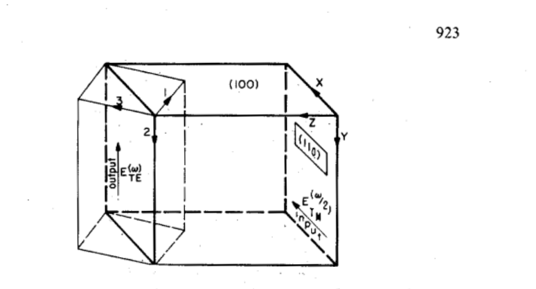

**How to read this figure.** The block is the waveguide crystal; $x, y, z$ are the waveguide axes and 1, 2, 3 the crystal axes, rotated so that the top surface is a (100) plane. The input TM field along $x$ has equal parts along crystal axes 1 and 3. The crystal's only nonlinear coefficient $d_{123}$ then produces a polarization along axis 2 = $y$: a TE output. The point is that crystal orientation picks which modes can couple.

The algebra is the same: $P_y = d_{123}E_x^2$ (Eq. 45), $E_x$ is written through the TM mode's $H_y$ (Eq. 46), the polarization (Eq. 47) goes into Eq. (32), and one gets Eq. (48) with a new overlap $S^{(m,m,n)}$ (Eq. 49–50) and $\Delta = \beta^{\omega}_{\text{TE}} - 2\beta^{\omega/2}_{\text{TM}}$. The final efficiency (Eq. 51) has the same form as Eq. (43); only the effective $d$ differs.

### C. Phase matching, Eqs. (52)–(57)

How can we make $\Delta = 0$ when materials are dispersive? Two ways:

1. **Modal (geometric) phase matching:** choose guide dimensions or mode orders so that $\beta^{\omega} = 2\beta^{\omega/2}$.
2. **Periodic perturbation (quasi-phase matching):** make $d$ (or the guide) vary with period

$$\Lambda = \frac{2\pi}{\Delta}q, \quad q = 1, 2, 3, \ldots \tag{52}$$

Take $d$ switching between $0$ and $d$ as a square wave. Its Fourier series is

$$d(z) = \frac{d}{2} + \sum_{q\ \text{odd}}\frac{2d}{q\pi}\sin\frac{2\pi q z}{\Lambda}. \tag{53}$$

Write each sine as $\frac{1}{2i}(e^{i\cdots} - e^{-i\cdots})$ and put into Eq. (37) (giving Eq. 54). One of the exponentials $e^{i 2\pi q z/\Lambda}$ can cancel the mismatch $e^{-i\Delta z}$ exactly when

$$-\frac{2\pi q}{\Lambda} + \beta^{\omega} - 2\beta^{\omega/2} = 0. \tag{55}$$

That term is now **synchronous** (no turning phase); all others average away. What remains is Eq. (56), with an effective coefficient

$$d_{\text{eff}} = \frac{d}{q\pi}.$$

So the efficiency (Eq. 57) is the phase-matched formula with $d \to d/(q\pi)$: for $q = 1$ you lose a factor $\pi^2 \approx 10$ in efficiency compared with perfect phase matching, but the $l^2$ growth is restored, so long devices win. This is the idea behind modern periodically poled lithium niobate. **General lesson: a periodic perturbation with wavevector $K = 2\pi/\Lambda$ can supply the missing momentum $\Delta$.** The same lesson gives Bragg gratings (Section VIII) and grating couplers.

## V. Electro-optic mode coupling

The **linear electro-optic (Pockels) effect**: a low-frequency (DC) field $E^{(0)}$ changes the material's index. Formally,

$$\Delta\left(\frac{1}{n^2}\right)_{ij} = r_{ijk}E_k, \tag{58}$$

where $r_{ijk}$ is the **electro-optic tensor**. Equivalently, the permittivity changes by $\Delta\epsilon_{ij} = \frac{\epsilon_i\epsilon_j}{\epsilon_0}r_{ijk}E_k^{(0)}$ (Eq. 59). From $\mathbf D = \epsilon_0\mathbf E + \mathbf P$, the part of the polarization proportional to $E^{(0)}$ is the perturbation:

$$[P_{\text{pert}}]_i = \frac{\epsilon_i\epsilon_j r_{ijk}}{\epsilon_0}E_k^{(0)}\left[\frac{E_j^{(\omega)}}{2}e^{i(\omega t - \beta z)} + \text{c.c.}\right]. \tag{61}$$

Yariv's new viewpoint: instead of "the voltage rotates the polarization" (the bulk-crystal picture), say "the voltage **couples the TE mode and the TM mode**". If $r$ has an off-diagonal element linking $y$ and $x$, a TM field ($E_x$) creates a $y$-polarization that drives the TE mode.

Lump the crystal details into one number: $\epsilon^2 r E^{(0)}$ (Eq. 63), so $P_y = \frac{\epsilon^2 rE^{(0)}}{\epsilon_0}E_x$ (Eq. 64). Write $E_x$ of the TM mode via its $H_y$ (Eq. 65), plug into Eq. (32) (giving Eq. 67). For a uniformly electro-optic film and same-order, well-confined TE and TM modes, the overlap integral is simply 2 (Eqs. 68–69), and

$$\frac{dA_m}{dz} = -i\kappa B_m e^{-i(\beta_m^{\text{TM}} - \beta_m^{\text{TE}})z}, \qquad \frac{dB_m}{dz} = -i\kappa A_m e^{+i(\beta_m^{\text{TM}} - \beta_m^{\text{TE}})z}, \tag{70}$$

$$\kappa = \frac{n_2^3 k r E^{(0)}}{2}. \tag{71}$$

**This is exactly our boxed codirectional pair**, with $\Delta = \beta^{\text{TM}} - \beta^{\text{TE}}$ (Eq. 72). Everything we derived applies. With $\Delta \approx 0$, full TE→TM conversion happens at $\kappa l = \pi/2$, i.e.

$$lE = \frac{\lambda_0}{2n_2^3 r}. \tag{73}$$

This field × length product equals the **half-wave voltage** condition of bulk modulators — the same physics in a new language.

**Worked example (from the paper).** GaAs, $\lambda_0 = 1$ µm, $n_2 \approx 3.5$, $n_2^3 r = 59\times10^{-12}$ m/V, $E^{(0)} = 10^6$ V/m (10 V across 10 µm). Then $k = 2\pi/\lambda_0 = 6.28\times10^6$ m⁻¹ and

$$\kappa = \frac{6.28\times10^6 \times 59\times10^{-12}\times10^6}{2} = 185\ \text{m}^{-1} = 1.85\ \text{cm}^{-1}, \qquad l = \frac{\pi}{2\kappa} = 0.85\ \text{cm}.$$

Two points the paper stresses: unlike the bulk case, coupling works even if the electro-optic material fills only a small part of the cross-section, and even between modes of different order — you only need a non-zero overlap. (Silicon has essentially no Pockels effect; silicon modulators use free-carrier plasma dispersion instead. But the coupled-mode description of a phase or polarization converter is identical.)

## VI. Phase matching in electro-optic coupling

The catch: TE and TM modes of the same order usually have different $\beta$. From our Step 9, the most power that can be exchanged is

$$F = \frac{\kappa^2}{\kappa^2 + \Delta^2/4}.$$

(The paper writes $\kappa^2/(\kappa^2 + \Delta^2)$ here, which is the same formula if its $\Delta$ is the half-mismatch; take the factor of 2 from Eq. (6).) With $\kappa = 1.85$ cm⁻¹ and $\beta \approx n_2 k = 2.2\times10^5$ cm⁻¹, the exchange drops to 50 % once $\Delta \sim \kappa$, i.e. a **relative** difference $\Delta/\beta \sim 10^{-5}$. Waveguide birefringence is far larger than that. So phase matching is essential.

Allow $\kappa$ to vary with $z$ (Eq. 74, with $\kappa(z) \propto r(z)E^{(0)}(z)$). Use **interdigital electrodes** so the field flips sign every half-period:

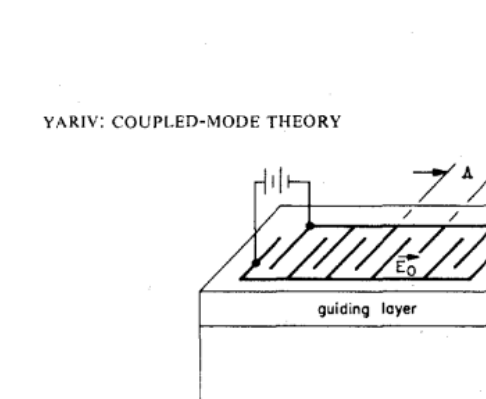

**How to read this figure.** A three-layer waveguide ($n_1$, $n_2$, $n_3$) with comb-shaped electrodes (fingers labelled A) on top. Neighbouring fingers are at opposite voltages, so the applied field $E_0$ points one way under one gap and the other way under the next. This builds a field that alternates with period $\Lambda$ along $z$ — a "grating" made of voltage instead of teeth.

The square-wave field has the Fourier series

$$E^{(0)}(z) = \sum_q\frac{4E_0}{q\pi}\sin\frac{2q\pi}{\Lambda}z, \tag{75}$$

so $\kappa(z)$ contains terms $e^{\pm i2\pi qz/\Lambda}$ (Eq. 76). Choose

$$\frac{2\pi}{\Lambda} = \Delta \tag{77}$$

and the $q = 1$ term cancels the mismatch. Keeping only that synchronous term:

$$\frac{dA_m}{dz} = \frac{\kappa_0}{\pi/2}B_m, \qquad \frac{dB_m}{dz} = -\frac{\kappa_0}{\pi/2}A_m. \tag{78}$$

These are phase-matched coupled equations with coupling reduced by a factor $2/\pi$ (the first Fourier coefficient of a square wave). Their solution is Eq. (7): complete sinusoidal exchange. Finally, Yariv notes that a $\bar43m$ crystal with its cube axes along $x, y, z$ and a **longitudinal** DC field $E_z^{(0)}$ is optimal, because then $P_x \propto r_{123}E_z^{(0)}E_y$ and $P_y \propto r_{123}E_z^{(0)}E_x$: TE and TM couple symmetrically.

## VII. Photoelastic coupling

A **sound wave** strains the material, and strain changes the index (the **photoelastic effect**):

$$\Delta\left(\frac{1}{n^2}\right)_{ij} = p_{ijkl}S_{kl}. \tag{79}$$

This has the same form as Eq. (58), with strain $S_{kl}$ in place of field and $p_{ijkl}$ (the **photoelastic tensor**) in place of $r$. The new feature: the strain is a **travelling wave**,

$$S_{kl}(\mathbf r, t) = \tfrac12 S_{kl}^{(\Omega)}e^{i(\Omega t - Kz)} + \text{c.c.}, \tag{80}$$

with sound frequency $\Omega$ and wavevector $K = \Omega/v_s$ ($v_s$ = sound speed). Multiplying the light wave $e^{i(\omega t - \beta z)}$ by this gives polarization waves at **sum and difference** frequencies and wavevectors, $e^{i[(\omega\pm\Omega)t - (\beta\pm K)z]}$ (Eq. 81). Each can drive a mode whose $(\omega, \beta)$ matches.

Several matching options:

- **Codirectional, up-shift:** $\beta_{\text{TE}} = \beta_{\text{TM}} + K$ and $\omega_{\text{TE}} = \omega + \Omega$ (Eq. 85). A sound phonon is absorbed.
- **Contradirectional:** if $K \approx 2\beta$, the difference term travels backward and couples to a backward mode (Eq. 86).
- **Sound against the light:** reverse $K$; then the codirectional TE output is **down**-shifted, $\omega - \Omega$ (Eq. 87), because each conversion **creates** a phonon. Contradirectional coupling is again possible (Eq. 88).

Footnote 3 gives the quantum picture: photon + phonon → new photon, so energies (frequencies) add.

For the codirectional case (85):

$$\frac{dA_m^{(\omega+\Omega)}}{dz} = i\kappa B_m^{(\omega)}e^{-i\Delta z}, \quad \frac{dB_m^{(\omega)}}{dz} = -i\kappa A_m^{(\omega+\Omega)}e^{i\Delta z}, \quad \Delta = K - (\beta_{\text{TE}} - \beta_{\text{TM}}), \tag{89}$$

$$\kappa = \frac{\pi p S^{(\Omega)}n_2^3}{2\lambda_0}. \tag{90}$$

(Compared with Eq. 71 there is an extra $\tfrac12$ because a time-harmonic strain is written with $\tfrac12(\ldots) + \text{c.c.}$.) The solution is Eq. (6) again. Phase matching ($\Delta = 0$) means $K = \beta_{\text{TE}} - \beta_{\text{TM}}$ (Eq. 91), which you tune with the **sound frequency** — a nice electronic knob. Then

$$|A|^2 = |B(0)|^2\sin^2\kappa z, \quad |B|^2 = |B(0)|^2\cos^2\kappa z, \tag{92}$$

with complete conversion at $l = \pi/(2\kappa)$ (Eq. 93).

**How much sound is needed?** From Eqs. (90) and (93), $S^2 = \lambda_0^2/(l^2p^2n^6)$. Acoustic intensity is $I = \rho v_s^3S^2/2$ ($\rho$ = density), so

$$I_{\text{switching}} = \frac{\lambda_0^2}{2l^2M}, \qquad M \equiv \frac{n^6p^2}{\rho v_s^3}, \tag{94}$$

where $M$ is the **acousto-optic figure of merit**. GaAs: $M \approx 10^{-13}$ s³/kg, $l = 5$ mm, $\lambda_0 = 1$ µm:

$$I = \frac{(10^{-6})^2}{2\times(5\times10^{-3})^2\times10^{-13}} = 2\times10^5\ \text{W/m}^2 = 20\ \text{W/cm}^2,$$

with a strain amplitude of only $2.3\times10^{-5}$.

## VIII. Coupling by a surface corrugation

This section is the **Bragg grating**, and it is directly relevant to silicon photonics (Bragg filters, DBR mirrors, grating couplers, and even the periodic structures inverse design often invents).

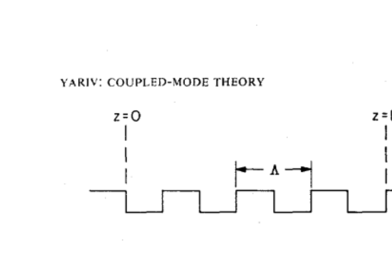

**How to read this figure.** A waveguide film ($n_2$) on a substrate ($n_3$) whose top surface has rectangular teeth of depth $a$ and period $\Lambda$, over a length $L$. Where there is a tooth, the index is $n_2$; between teeth it is the cover index $n_1$. This periodic change of $n^2$ is the perturbation.

### The perturbation and the master equation, Eqs. (95)–(101)

For an index change, $\mathbf P_{\text{pert}} = \Delta\epsilon\,\mathbf E = \epsilon_0\Delta n^2(\mathbf r)\mathbf E$ (Eq. 95). Because this is a scalar change, it couples TE to TE and TM to TM, not TE to TM. A forward TE mode $A_m^{(+)}$ gives (Eq. 96)

$$[P_{\text{pert}}]_y = \frac{\epsilon_0\Delta n^2(\mathbf r)}{2}A_m^{(+)}\mathcal{E}_y^{(m)}e^{i(\omega t - \beta_m z)} + \text{c.c.}$$

We expect the period to be chosen so that $2\pi/\Lambda \approx 2\beta_m$, which couples the forward mode to its own **backward** twin. Keep only $A_m^{(-)}$ on the left of Eq. (32):

$$\frac{dA_m^{(-)}}{dz} = \frac{i\omega\epsilon_0}{4}A_m^{(+)}e^{-2i\beta_m z}\int\Delta n^2(x,z)[\mathcal{E}_y^{(m)}]^2dx. \tag{97}$$

The $e^{-2i\beta_m z}$ is the problem: forward and backward waves have phases turning in opposite directions, so their difference turns at $2\beta_m$. The grating must supply it. The square-tooth profile has the Fourier series

$$\Delta n^2(x,z) = \Delta n^2(x)\left[\frac12 + \frac{2}{\pi}\left(\sin\eta z + \frac13\sin3\eta z + \cdots\right)\right], \quad \eta = \frac{2\pi}{\Lambda}, \tag{98–99}$$

with $\Delta n^2(x) = n_2^2 - n_1^2$ inside the tooth layer $-a \le x \le 0$, zero elsewhere. The $l$-th harmonic supplies wavevector $l\eta$. Coupling happens when $l\eta \approx 2\beta_m$. Keeping only that synchronous term:

$$\frac{dA_m^{(-)}}{dz} = \frac{\omega\epsilon_0}{4\pi l}A_m^{(+)}e^{i\Delta z}\int\Delta n^2(x)[\mathcal{E}_y^{(m)}]^2dx, \tag{100}$$

$$\Delta \equiv l\eta - 2\beta_m. \tag{101}$$

**The Bragg condition** ($\Delta = 0$, $l = 1$): $2\pi/\Lambda = 2\beta = 4\pi n_{\text{eff}}/\lambda$, i.e.

$$\Lambda = \frac{\lambda}{2n_{\text{eff}}}.$$

Silicon example: $n_{\text{eff}} = 2.44$ at 1550 nm gives $\Lambda = 1.55/4.88 = 0.318$ µm. Paper's example: $n = 3.6$, $\Lambda = 0.143$ µm gives $\lambda = 2\times3.6\times0.143 = 1.03$ µm ✓.

### Evaluating κ for the corrugation, Eqs. (102)–(106)

The integral is $(n_2^2 - n_1^2)\int_{-a}^0[\mathcal{E}_y^{(m)}]^2dx$ (Eq. 102): only the field inside the teeth counts. For a mode well above cutoff ($q_m \gg h_m$) and shallow teeth ($ha \ll 1$), the field near the top surface is roughly linear in $x$, and the integral is (Eq. 103)

$$\frac{C_m^2q_m^2a^3}{3}\left(1 + \frac{3}{q_ma} + \frac{3}{q_m^2a^2}\right).$$

With the well-confined limits $C_m^2 \to 4h_m^2\omega\mu/(\beta_mtq_m^2)$ (Eq. 104), $\beta_m \to n_2k$, $h_m \to \pi/t$ (footnote 4 gives $q/h \to (n_2^2 - n_1^2)^{1/2}(2t/\lambda_0)$), the result is

$$\frac{dA_m^{(-)}}{dz} = \kappa_lA_m^{(+)}e^{i\Delta z}, \qquad \frac{dA_m^{(+)}}{dz} = \kappa_lA_m^{(-)}e^{-i\Delta z}, \tag{105–106}$$

$$\kappa_l = \frac{\pi k}{3l}\frac{n_2^2 - n_1^2}{n_2}\left(\frac{a}{t}\right)^3\left[1 + \frac{3(\lambda_0/a)}{2\pi(n_2^2 - n_1^2)^{1/2}} + \frac{3(\lambda_0/a)^2}{4\pi^2(n_2^2 - n_1^2)}\right].$$

What to remember from this formula: $\kappa$ grows with the **index contrast** $n_2^2 - n_1^2$ and steeply with the **tooth depth relative to the film thickness**, and falls as $1/l$ for higher-order gratings. This is why silicon (huge contrast) gives very strong gratings even with small teeth. These are exactly the contradirectional equations (11), so the solution is Eq. (12)/(14) and Fig. 2.

### The optical stop band, Eqs. (107)–(111)

Strong reflection (exponential decay) happens only when $S$ is real:

$$|\Delta| = |\eta - 2\beta(\omega)| < 2\kappa. \tag{107}$$

This is a narrow band of frequencies around the Bragg frequency. Yariv points out the analogy with **electrons in a crystal**: Bragg scattering of electron waves at the Brillouin-zone edge opens an energy gap. Here it opens an **optical gap** (photonic band gap).

The forward wave inside the grating behaves like $e^{-i\beta' z}$ with a complex propagation constant (from Eqs. 8 and 12):

$$\beta' = \beta - \frac{\Delta}{2} \pm i\frac{S}{2} = \frac{\eta}{2} \pm i\frac{S}{2}. \tag{108}$$

Inside the gap the real part is locked at $\eta/2 = \pi/\Lambda$ (the zone edge) and the imaginary part is

$$\mathrm{Im}\,\beta' = \sqrt{\kappa^2 - (\beta - \eta/2)^2} \approx \sqrt{\kappa^2 - \frac{n_{\text{eff}}^2}{c^2}(\omega - \omega_0)^2}, \tag{109}$$

where $\omega_0$ is the mid-gap frequency ($\beta(\omega_0) = \eta/2$). The decay is strongest ($\mathrm{Im}\beta' = \kappa$) at the centre and vanishes at the edges, where $|\omega - \omega_0| = \kappa c/n_{\text{eff}}$. So the gap width is

$$(\Delta\omega)_{\text{gap}} = \omega_u - \omega_l = \frac{2\kappa c}{n_{\text{eff}}}. \tag{110}$$

(Strictly, if $n_{\text{eff}}$ itself depends on frequency, the $n_{\text{eff}}$ here should be the **group index** $n_g$, because the step used $d\beta/d\omega = n_g/c$. For silicon wires $n_g \approx 4.2$ vs $n_{\text{eff}} \approx 2.44$, so this matters.)

Outside the gap, e.g. $\omega > \omega_u$, $\beta'$ is real again:

$$\beta' = \frac{\eta}{2} \pm \sqrt{\frac{n_{\text{eff}}^2}{c^2}(\omega - \omega_u)^2 + \frac{2n_{\text{eff}}\kappa}{c}(\omega - \omega_u)}. \tag{111}$$

These results hold for **any** forward–backward coupling of the form (105), whatever the physical mechanism.

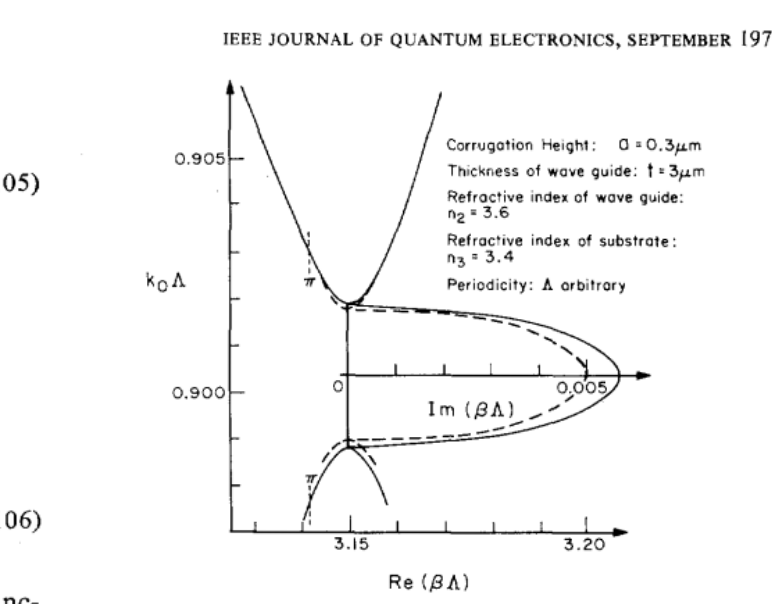

**How to read this figure.** Vertical axis: normalised frequency $k_0\Lambda$. Horizontal: normalised $\mathrm{Re}(\beta\Lambda)$, with a second axis to the right for $\mathrm{Im}(\beta\Lambda)$. Far from the gap, the two branches look like the ordinary lines $\beta = n\omega/c$, bending as they approach $\beta\Lambda = \pi$ (≈3.15). Between $k_0\Lambda \approx 0.899$ and $0.902$ no real $\beta$ exists: $\mathrm{Re}\,\beta\Lambda$ is stuck at $\pi$, and the bulge to the right shows $\mathrm{Im}\,\beta\Lambda$ rising to about 0.005 at mid-gap. Dashed = coupled-mode formulas (109)/(111); solid = an "exact" calculation. They agree well — the coupled-mode approximation is good for weak gratings. (Parameters: $t = 3$ µm, $\Lambda = 0.143$ µm, $a = 0.3$ µm, $n_2 = 3.6$, $n_3 = 3.4$, $n_1 = 1$; mid-gap $\lambda_0 = 1$ µm.)

**Gap in wavelength — silicon example.** Converting Eq. (110) with $n_g$: $\Delta\lambda \approx \lambda^2\kappa/(\pi n_g)$. A sidewall-corrugated SOI grating with $\kappa = 200$ cm⁻¹ = $2\times10^4$ m⁻¹ and $n_g = 4.2$ gives $\Delta\lambda = (1.55\times10^{-6})^2 \times 2\times10^4 / (\pi\times4.2) \approx 3.6$ nm. A 300 µm long grating has $\kappa L = 6$ and peak reflectance $\tanh^2 6 \approx 0.99998$.

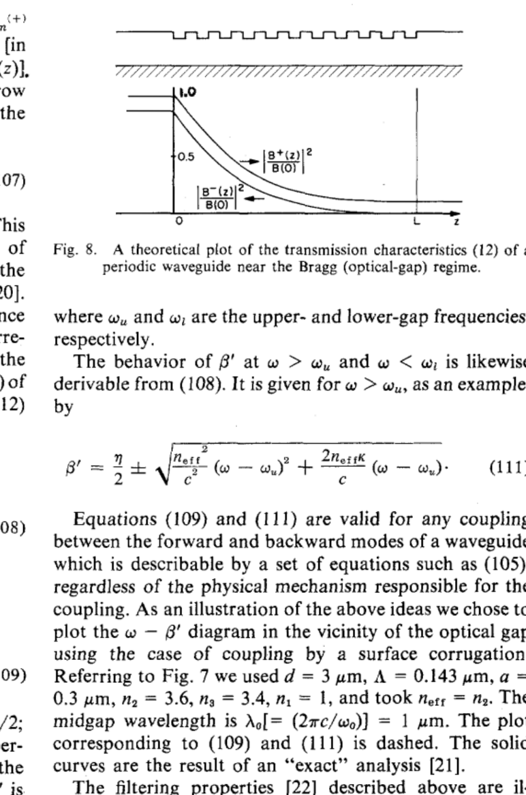

**How to read this figure.** Top: a sketch of the corrugated guide. Bottom: normalised forward power $|B^+(z)/B(0)|^2$ and backward power $|B^-(z)/B(0)|^2$ along the grating from $0$ to $L$, for $\kappa L = 1.84$ at the Bragg condition. Forward power decays from 1 to about 0.1; backward power starts near 0.9 at the entrance and falls to zero at $L$. (The paper's text describes Fig. 8 as transmission and reflection **versus** $\Delta L$ — i.e. a spectrum — but the printed figure shows the profile along $z$. Our generated plot above shows both views.) Because $\Delta L \approx [(\omega n_2/c) - \eta/2]L$, the same curve can be swept by changing frequency or by tuning $n_2$ (electrically, thermally, acoustically), which makes a tunable filter or modulator.

## IX. Mode coupling by waveguide anisotropy — magneto-optic coupling

Sections V and VII coupled TE and TM because an external agent created **off-diagonal** elements of the permittivity tensor ($\epsilon_{xy}$, $\epsilon_{zy}$). Off-diagonal elements can also be built into the material: a misoriented crystal, or a magnetic material. Either way we can still describe light as the old TE and TM modes plus coupling.

For a material magnetised along $z$, the permittivity is

$$\tilde\epsilon = \epsilon_0\begin{bmatrix}\epsilon_x & -i\delta & 0 \\ i\delta & \epsilon_y & 0 \\ 0 & 0 & \epsilon_z\end{bmatrix}. \tag{112}$$

Treat the off-diagonal $\pm i\delta$ as the perturbation (Eq. 113). A TM input ($E_x$) then makes $(P_{\text{pert}})_y = i\delta\,E_x/2\, e^{i(\omega t - \beta_{\text{TM}}z)} + \text{c.c.}$ (Eq. 114). Put into Eq. (32) (Eq. 115), define

$$\kappa = \frac{\beta_{\text{TM}}}{4\epsilon/\epsilon_0}\int\mathcal{H}_y^{(l)}\mathcal{E}_y^{(m)}\delta(x,z)\,dx, \tag{116}$$

and get

$$\frac{dA}{dz} = \kappa Be^{i\Delta z}, \quad \frac{dB}{dz} = -\kappa Ae^{-i\Delta z}, \quad \Delta = \beta_{\text{TE}} - \beta_{\text{TM}}. \tag{117}$$

Codirectional again; note the coefficients satisfy $\kappa_{ab} = -\kappa_{ba}^*$ with real $\kappa$. For a paramagnetic film, $\delta = \lambda_0nVH/\pi$ ($V$ = **Verdet constant**, $H$ = magnetic field; Eq. 118), the overlap is $2\delta$, and

$$\kappa = \frac{\pi\delta}{n\lambda_0} = VH. \tag{119}$$

Phase matched, with pure TM input:

$$A = B_0\sin\kappa z, \quad B = B_0\cos\kappa z. \tag{120}$$

Since usually $\Delta \ne 0$, one can flip $H$ periodically with period $2\pi/\Delta$ (like the electrodes of Section VI), at the cost of a factor $2/\pi$ in $\kappa$. Magneto-optic TE↔TM conversion is the heart of on-chip **isolators** — still an active research topic in silicon photonics.

## X. The eigenmodes of a perturbed waveguide

This section is the formal version of our Route 2. Instead of "uncoupled modes plus coupling", find the **new modes** of the perturbed guide: combinations of $A$ and $B$ that only pick up a phase $e^{i\gamma z}$.

Start from the codirectional equations in the form

$$\frac{dA}{dz} = \kappa Be^{-i\Delta z}, \quad \frac{dB}{dz} = -\kappa^*Ae^{i\Delta z}, \tag{121}$$

with fields $a \propto A(z)\mathcal{E}(x)e^{i(\omega_at - \beta_az)}$, $b \propto B(z)\mathcal{H}(x)e^{i(\omega_bt - \beta_bz)}$ (Eq. 122). Put the carriers back in by defining a column vector of full fields (Eq. 123). Then (Eqs. 124–125)

$$\frac{d\tilde E}{dz} = \tilde{\tilde C}\tilde E, \qquad \tilde{\tilde C} = \begin{bmatrix}-i\beta_b & -\kappa^* \\ \kappa & -i\beta_a\end{bmatrix}.$$

Look for $\tilde E(z) = \tilde E(0)e^{i\gamma z}$. This gives two homogeneous equations (Eq. 126); setting their determinant to zero:

$$\gamma_{1,2} = -\frac{\beta_a + \beta_b}{2} \pm \frac12\sqrt{(\beta_a - \beta_b)^2 + 4\kappa^2} = -\bar\beta \pm \frac{S}{2}, \tag{127}$$

$$\bar\beta = \frac{\beta_a + \beta_b}{2}, \quad S = \sqrt{\Delta^2 + 4\kappa^2}, \quad \Delta = \beta_a - \beta_b. \tag{128}$$

(The sign of $\gamma$ is negative only because the mode travels as $e^{-i\beta z}$; the new propagation constants are $\bar\beta \mp S/2$ — the same "mean ± half-splitting" as our $\beta_\pm = \bar\beta \pm s$, with $S = 2s$.) The eigenvectors (Eq. 129) are

$$\tilde E_{1,2} = \begin{bmatrix}\dfrac{2i\kappa^*}{\Delta \pm S} \\ 1\end{bmatrix}e^{-i[\bar\beta \mp S/2]z}.$$

Facts Yariv draws out:

- $\tilde E_1\cdot\tilde E_1^*$ is the power in the supermode, and $\tilde E_1\cdot\tilde E_2^* = 0$: the new modes are orthogonal.
- The ratio of power in the two components is $4\kappa^2/(\Delta \pm S)^2$ — the **admixture**.
- If $\kappa/\Delta \to 0$, the eigenvectors become $(0,1)$ and $(1,0)$: the old uncoupled modes come back. (Weak coupling between very different guides → they ignore each other.)
- If $\Delta = 0$, $S = 2\kappa$ and the admixture is **50/50 regardless of how small $\kappa$ is**. This is why even weakly coupled identical guides have supermodes that are equal mixtures (even and odd) — exactly our directional coupler picture.
- Odd but true: the two components may have **different frequencies** (with a travelling sound wave, Section VII). They still form one mode because they share the same phase factor $e^{-i(\bar\beta - S/2)z}$ (Eq. 130). Yariv suggests this could matter in lasers with time-modulated sections.

**Example: magneto-optic case.** With $\kappa = VH$ and $\Delta = 0$ (Eq. 131):

$$\tilde E_1 = \begin{bmatrix} i \\ 1\end{bmatrix}e^{-i(\beta - VH)z}, \qquad \tilde E_2 = \begin{bmatrix} -i \\ 1\end{bmatrix}e^{-i(\beta + VH)z}.$$

A TM and a TE component, equal in size and 90° apart: these are **circularly polarized** light, one rotating each way. They travel with slightly different speeds, so a linear polarization (their sum) rotates as it travels by the **Faraday rotation** angle

$$\theta(z) = VHz. \tag{132}$$

This is the same physics as the directional coupler: "light in guide $a$" ↔ "linear polarization", "even/odd supermodes" ↔ "two circular polarizations", "power sloshing between guides" ↔ "polarization rotating".

## XI. Summary

The paper's closing points, in plain words:

- One formalism — coupled modes — describes nonlinear conversion, electro-optic, acousto-optic and magneto-optic switching, and grating filters. In each case you find $\kappa$ (an overlap integral of the perturbation with the two mode shapes) and $\Delta$ (the leftover phase rate), and then use the general solutions (6) or (12).
- The paper treats slab guides (no variation in $y$). For channel waveguides (like 500 × 220 nm silicon wires), you replace the integral over $x$ by an integral over the whole cross-section $(x, y)$. For well-confined modes the correction is small.
- Directional couplers [27] and distributed-feedback (DFB) lasers [25] were already written in coupled-mode form by others, so the paper does not repeat them. Today we filled in the coupler case ourselves.

## Tonight's Meep sweep: predicting L50 before you simulate

The schedule geometry: two 0.5 µm guides, 0.2 µm gap, $\epsilon = 2.83^2$, 2-D, $\lambda = 1.55$ µm. Meep's default background is vacuum (index 1). A 1-D supermode solve of that cross-section gives:

| Cladding | $n_e$ | $n_o$ | $n_e - n_o$ | $\kappa$ (µm⁻¹) | $L_c = \lambda/(2\Delta n)$ | $L_{50} = L_c/2$ |
|---|---|---|---|---|---|---|
| air ($n = 1$, Meep default) | 2.6163 | 2.5833 | 0.0330 | 0.0668 | **23.5 µm** | **11.7 µm** |
| oxide ($n = 1.44$) | 2.6310 | 2.5921 | 0.0388 | 0.0787 | 20.0 µm | 10.0 µm |

What this means for the sweep:

- The cross power is $\sin^2(\pi L/(2L_c))$. The first 50:50 point is near $L \approx 11.7$ µm (air), the first full cross-over near 23.5 µm, and then it repeats.
- The schedule's 2 µm coarse steps give about 6 samples per half period here — fine to locate the region. Refine to 0.5 µm around 10–14 µm.
- The bends at the entrance and exit add a bit of extra coupling, so the Meep $L_{50}$ (counting only the straight section) will usually come out **shorter** than the CMT value. If you are off by more than 10 %, check this first, then check that your source sits inside one guide only (otherwise you launch a supermode and see no exchange at all).
- Check the phase too: the cross and through mode coefficients from `get_eigenmode_coefficients` should differ by about 90° at the 50:50 point.

The snippet below solves the coupled-mode equations numerically and checks them against the closed form. Run it with `.venv/bin/python`.

```python
import numpy as np

lam   = 1.55                    # wavelength (µm)
n_e, n_o = 2.6163, 2.5833       # even / odd supermode indices (2-D Meep coupler, air cladding)
kappa = np.pi * (n_e - n_o) / lam   # coupling coefficient (1/µm), from beta_e - beta_o = 2*kappa
delta = 0.0                     # phase mismatch Delta = beta_b - beta_a (1/µm); try 2*kappa

def rhs(z, u):
    A, B = u
    dA = -1j * kappa * B * np.exp(-1j * delta * z)
    dB = -1j * np.conj(kappa) * A * np.exp(+1j * delta * z)
    return np.array([dA, dB])

# RK4 integration of the coupled-mode equations, light launched in guide A
L, N = 60.0, 6000
z = np.linspace(0, L, N + 1); h = z[1] - z[0]
u = np.zeros((N + 1, 2), complex); u[0] = [1.0, 0.0]
for i in range(N):
    k1 = rhs(z[i], u[i]);            k2 = rhs(z[i] + h/2, u[i] + h/2*k1)
    k3 = rhs(z[i] + h/2, u[i] + h/2*k2); k4 = rhs(z[i] + h, u[i] + h*k3)
    u[i+1] = u[i] + h/6*(k1 + 2*k2 + 2*k3 + k4)

PA, PB = abs(u[:, 0])**2, abs(u[:, 1])**2
s = np.sqrt(kappa**2 + (delta/2)**2)
PB_exact = (kappa/s)**2 * np.sin(s*z)**2           # closed-form answer
print("kappa = %.4f /um" % kappa)
print("max |PB - exact|  =", np.max(abs(PB - PB_exact)))
print("max |PA+PB-1|     =", np.max(abs(PA + PB - 1)))
print("L_c  (full)  = %.2f um" % (np.pi/(2*kappa)))
print("L_50 (3 dB)  = %.2f um" % (np.pi/(4*kappa)))
i50 = np.argmin(abs(PB[:N//4] - 0.5)); print("numerical L_50 = %.2f um" % z[i50])
print("phase of B/A at L_50 (deg):", np.degrees(np.angle(u[i50,1]/u[i50,0])))
```

**What you should see:** $\kappa = 0.0669$ µm⁻¹; the numerical and exact powers agree to about $10^{-14}$; total power stays 1; $L_c = 23.48$ µm, $L_{50} = 11.74$ µm; and the phase of $B/A$ at $L_{50}$ is $-90°$. Then set `delta = 2*kappa` and watch the maximum cross power drop to 0.5.

## How this connects to your project

Your project is robust, fabrication-aware inverse design of silicon photonic devices, with Monte-Carlo yield and maybe an ML surrogate. Coupled-mode theory is the **analytic baseline** for all of that:

- **Sensitivity in closed form.** $P_{\text{cross}} = \sin^2(\kappa L)$ tells you that at the 50:50 point the slope is largest: $dP/d(\kappa L) = \sin(2\kappa L) = 1$. A 5 % error in $\kappa$ (from a gap error of a few nm, since $\kappa \propto e^{-qg}$) moves the split by about $0.05\times\pi/4 \approx 4$ percentage points. This is the simplest possible robustness analysis, and your Monte-Carlo yield runs should reproduce it for a plain coupler.
- **Width variations enter as $\Delta$, gap variations as $\kappa$.** Fabrication errors that are the same on both guides (global over- or under-etch) mostly change $\kappa$; errors that differ between guides create $\Delta$. CMT lets you separate the two.
- **A cheap surrogate.** A two-parameter CMT model ($\kappa(\lambda, g, w)$, $\Delta(\lambda, w_1, w_2)$) is a physics-based surrogate. It is a good first baseline to beat before training a neural network.
- **Reading inverse-designed devices.** Inverse design often produces structures that act like distributed couplers or gratings. Thinking "where is $\kappa$, where is $\Delta$?" helps you understand why an optimised shape works and how fragile it is.
- **Gratings and rings.** Section VIII is the theory of Bragg filters; the coupler result is the input to ring-resonator models (coupling coefficient $\kappa_{\text{ring}} = \sin\kappa L$). Both appear later in the plan.

!!! warning "Common confusions"
    - **$L_c$ vs $L_{50}$.** Full transfer is at $\kappa L = \pi/2$; 50:50 is at $\kappa L = \pi/4$. $L_{50} = L_c/2$, not $L_c$.
    - **"Period" of the exchange.** The *amplitude* $\sin\kappa z$ repeats every $2\pi/\kappa$; the *power* $\sin^2\kappa z$ repeats every $\pi/\kappa$; the first full transfer is at $\pi/(2\kappa)$. The paper's "period $\pi/2\kappa$" means the last one.
    - **$\Delta$ vs $\delta$ vs $\Delta\beta$.** Yariv's $\Delta$ is the full mismatch $\beta_b - \beta_a$ (plus any grating $K$). Some books (and your schedule) write $2\delta$ for it, so $\delta = \Delta/2$. Always check whether a formula uses $\Delta^2$ or $\Delta^2/4$.
    - **Mismatch does not slow transfer — it speeds it up.** With $\Delta \ne 0$ the exchange oscillates *faster* ($s > \kappa$) but *less completely*.
    - **Supermode index difference vs single-guide index difference.** $\kappa = \pi(n_e - n_o)/\lambda$ uses the even/odd supermodes of the *pair*. $\Delta$ uses the difference between the two *isolated* guides. Do not mix them.
    - **Contradirectional ≠ "codirectional with a minus sign" in the result.** The sign change in energy conservation turns sines into sinh's: the grating does not slosh power back and forth, it reflects it with exponential decay inside the stop band.
    - **The 90° is not a choice of convention.** You can move it around with different phase references, but the relative 90° between through and cross outputs of a symmetric lossless coupler is forced by power conservation.
    - **Source launching a supermode in Meep.** If the eigenmode source spans both guides, `eig_band=1` excites the even supermode, which does not exchange at all.

## Check yourself

**1. Starting from $dA/dz = \kappa_{ab}Be^{-i\Delta z}$, $dB/dz = \kappa_{ba}Ae^{i\Delta z}$, show that conservation of $|A|^2 + |B|^2$ requires $\kappa_{ab} = -\kappa_{ba}^*$.**

??? note "Answer"
    $\frac{d}{dz}|A|^2 = 2\mathrm{Re}[\kappa_{ab}A^*Be^{-i\Delta z}]$ and $\frac{d}{dz}|B|^2 = 2\mathrm{Re}[\kappa_{ba}AB^*e^{i\Delta z}] = 2\mathrm{Re}[\kappa_{ba}^*A^*Be^{-i\Delta z}]$. The sum is $2\mathrm{Re}[(\kappa_{ab} + \kappa_{ba}^*)A^*Be^{-i\Delta z}]$. For this to vanish for all $A$, $B$ (any phase of $A^*B$), we need $\kappa_{ab} + \kappa_{ba}^* = 0$.

**2. Why do we substitute $A = ae^{-i\Delta z/2}$, $B = be^{+i\Delta z/2}$? What would go wrong without it?**

??? note "Answer"
    It removes the $z$-dependent exponentials from the coefficients, leaving a constant 2×2 matrix. Constant-coefficient linear ODEs are solved by eigenvalues and exponentials. Without it you would have to solve equations with variable coefficients directly (possible — e.g. by differentiating once more to get a second-order ODE with constant coefficients — but messier).

**3. Find the eigenvalues of $M = \begin{bmatrix} i\Delta/2 & -i\kappa \\ -i\kappa & -i\Delta/2\end{bmatrix}$ and say what they imply physically.**

??? note "Answer"
    $\lambda^2 + \Delta^2/4 + \kappa^2 = 0$, so $\lambda = \pm i\sqrt{\kappa^2 + \Delta^2/4}$. Purely imaginary eigenvalues mean the solutions are sines and cosines: power oscillates between the guides; it never grows or decays.

**4. Light enters guide $a$ of a symmetric coupler with $\kappa = 0.08$ µm⁻¹. Give $L_c$ and $L_{50}$.**

??? note "Answer"
    $L_c = \pi/(2\times0.08) = 19.6$ µm, $L_{50} = \pi/(4\times0.08) = 9.8$ µm.

**5. A mode solver gives $n_e = 2.450$, $n_o = 2.410$ at 1550 nm. What is $\kappa$, and what is $L_c$?**

??? note "Answer"
    $\kappa = \pi(n_e - n_o)/\lambda = \pi\times0.040/1.55 = 0.081$ µm⁻¹. $L_c = \lambda/(2\times0.040) = 19.4$ µm.

**6. If $\Delta = 2\kappa$, what is the largest fraction of power that can ever cross, and at what $\kappa z$ does it first happen?**

??? note "Answer"
    $F = \kappa^2/(\kappa^2 + \Delta^2/4) = \kappa^2/(2\kappa^2) = 0.5$. It happens when $sz = \pi/2$ with $s = \sqrt2\kappa$, i.e. $\kappa z = \pi/(2\sqrt2) \approx 1.11$.

**7. What is the phase of the crossed field relative to the through field in a phase-matched coupler, and why does it matter for an MZI?**

??? note "Answer"
    The crossed amplitude is $-i\sin\kappa z$, the through amplitude $\cos\kappa z$: the crossed light lags by 90°. In an MZI made from two such couplers, the two 90° shifts combine with the arm phase difference to decide which output port gets the light; with equal arms all the light ends up in the *cross* port.

**8. In the contradirectional case, why is the boundary condition $A(L) = 0$ instead of $A(0) = 0$?**

??? note "Answer"
    Mode $a$ travels towards $-z$. Its "input" end is $z = L$, and nothing is sent in from the right, so it is zero there. It is generated inside the grating and leaves at $z = 0$ as the reflection.

**9. Show that at the Bragg condition the reflectance of a grating of length $L$ is $\tanh^2(\kappa L)$. What is it for $\kappa L = 1.84$?**

??? note "Answer"
    From Eq. (14), $A(0) = B(0)\frac{\kappa_{ab}}{\kappa}\frac{\sinh(-\kappa L)}{\cosh\kappa L}$, so $|A(0)/B(0)|^2 = \tanh^2\kappa L$. For $\kappa L = 1.84$: $\tanh 1.84 = 0.951$, so $R \approx 0.90$.

**10. What grating period gives first-order Bragg reflection at 1550 nm for $n_{\text{eff}} = 2.44$? What is the reflection bandwidth for $\kappa = 2\times10^4$ m⁻¹ and $n_g = 4.2$?**

??? note "Answer"
    $\Lambda = \lambda/(2n_{\text{eff}}) = 1.55/4.88 = 0.318$ µm. $\Delta\lambda \approx \lambda^2\kappa/(\pi n_g) = (1.55\times10^{-6})^2\times2\times10^4/(\pi\times4.2) \approx 3.6$ nm.

**11. In quasi-phase matching with a square-wave modulation of $d$ (0 to $d$), why does the efficiency drop by $\pi^2$ for $q = 1$?**

??? note "Answer"
    Only the first Fourier harmonic of the square wave is synchronous. Its complex amplitude is $d/\pi$ (from $\frac{2d}{\pi}\sin$, which is $\frac{d}{i\pi}(e^{i\cdot} - e^{-i\cdot})$). So $d_{\text{eff}} = d/\pi$, and efficiency scales as $d_{\text{eff}}^2$: a factor $1/\pi^2$.

**12. In Section X, what happens to the supermodes when $\kappa/\Delta \to 0$, and when $\Delta = 0$?**

??? note "Answer"
    $\kappa/\Delta \to 0$: the supermodes become the original uncoupled modes (each lives in one guide or one polarization). $\Delta = 0$: $S = 2\kappa$ and each supermode is a 50/50 mixture (even/odd, or circular polarizations), no matter how weak $\kappa$ is.

## Key takeaways

- Any weak perturbation that links two modes gives two first-order ODEs: $A' = -i\kappa Be^{-i\Delta z}$, $B' = -i\kappa^*Ae^{i\Delta z}$ (codirectional). $\kappa$ = overlap integral; $\Delta$ = leftover phase rate.
- Energy conservation fixes the coefficient relation: $\kappa_{ab} = -\kappa_{ba}^*$ (codirectional) or $\kappa_{ab} = \kappa_{ba}^*$ (contradirectional).
- Codirectional solution: $P_{\text{cross}} = \frac{\kappa^2}{\kappa^2 + \Delta^2/4}\sin^2\left(\sqrt{\kappa^2 + \Delta^2/4}\,z\right)$. Sinusoidal, complete only if $\Delta = 0$.
- $L_c = \pi/(2\kappa) = \lambda/(2(n_e - n_o))$; $L_{50} = L_c/2$. The crossed field lags by 90°.
- Supermode view: even and odd modes with $\beta_e - \beta_o = 2\kappa$ beat against each other; same result.
- Contradirectional (grating): real eigenvalues inside the stop band $|\Delta| < 2\kappa$, exponential decay, $R = \tanh^2\kappa L$ at Bragg, $\Lambda = \lambda/(2n_{\text{eff}})$, bandwidth $\Delta\omega = 2\kappa c/n_g$.
- A periodic perturbation supplies missing wavevector $2\pi/\Lambda$: this is how gratings, quasi-phase matching, interdigital electrodes and acoustic waves all achieve phase matching — at the cost of a Fourier factor ($1/\pi$, $2/\pi$).
- The master recipe (Eq. 32): write $P_{\text{pert}}$ → project onto the target mode → keep synchronous terms → read off $\kappa$, $\Delta$.

## Glossary

| Term | Plain meaning |
|---|---|
| Acousto-optic figure of merit $M$ | $n^6p^2/(\rho v_s^3)$; how efficiently a material turns sound into index change |
| Admixture | How much of each original mode a supermode contains |
| Bragg condition | Grating period equals half the guided wavelength: $\Lambda = \lambda/(2n_{\text{eff}})$ |
| Bragg grating | Periodic change of index along a guide that reflects a narrow band of wavelengths |
| Codirectional coupling | Power exchange between two modes travelling the same way |
| Coherence length | Distance $\pi/\Delta$ over which mismatched waves still add up |
| Complex amplitude | A complex number whose size is the wave's strength and angle its phase |
| Contradirectional coupling | Power exchange between a forward and a backward mode (reflection) |
| Coupled-mode theory (CMT) | Describing a perturbed guide as known modes whose amplitudes slowly exchange power |
| Coupling coefficient $\kappa$ | Rate of power exchange per unit length; an overlap integral |
| Coupling length $L_c$ | Length for complete transfer, $\pi/(2\kappa)$ |
| Directional coupler | Two parallel waveguides close together that exchange light |
| Effective index $n_{\text{eff}}$ | $\beta\lambda/2\pi$; the index the mode "feels" |
| Eigenvalue / eigenvector | Special number / direction where a matrix acts as pure scaling |
| Electro-optic (Pockels) effect | Index change proportional to an applied electric field |
| Electro-optic tensor $r_{ijk}$ | Coefficients of the Pockels effect |
| Evanescent tail | Exponentially decaying part of a mode outside the core |
| Even / odd supermode | Coupled-pair modes with the same / opposite sign in the two guides |
| Faraday rotation | Rotation of linear polarization in a magnetised material, angle $VHz$ |
| Group index $n_g$ | $c$ divided by the speed of a pulse; sets bandwidths and FSRs |
| Interdigital electrodes | Comb-shaped electrodes making a field that alternates along $z$ |
| $L_{50}$ | Length for a 50:50 split, $\pi/(4\kappa)$ |
| Magneto-optic coupling | TE–TM coupling from off-diagonal permittivity in a magnetised material |
| Master equation (Eq. 32) | Projection of the perturbed wave equation onto one mode |
| Mode | Field pattern that keeps its shape while travelling |
| Nonlinear tensor $d_{ijk}$ | Coefficients for polarization proportional to field squared |
| Normalisation (1 W) | Scaling mode shapes so $\lvert A\rvert^2$ is the power |
| Orthogonality | Different modes have zero overlap integral |
| Overlap integral | Integral of the product of fields (and perturbation) across the guide |
| Perturbation | A small change to a structure whose modes are known |
| Phase matching | Making the leftover phase rate $\Delta$ zero so contributions add up |
| Phase mismatch $\Delta$ | Leftover phase rate between coupled waves, e.g. $\beta_b - \beta_a$ |
| Photoelastic effect / tensor $p$ | Index change caused by strain |
| Polarization $\mathbf P$ | Dipole moment per volume induced in a material by light |
| Propagation constant $\beta$ | Phase advance per unit length of a mode, $2\pi n_{\text{eff}}/\lambda$ |
| Quasi-phase matching | Periodically modulating a property so one Fourier term is synchronous |
| Radiation modes | Fields that escape the guide; neglected here |
| Second-harmonic generation | Making light at twice the input frequency |
| Slab waveguide | Three flat layers, infinite in one direction |
| Slowly varying envelope | Assumption that amplitudes change slowly compared with the wavelength |
| Stop band (optical gap) | Frequency band $\lvert\Delta\rvert < 2\kappa$ where a grating reflects strongly |
| Supermode | Mode of the whole coupled system |
| Synchronous term | Term whose $z$-phase cancels, so it accumulates along $z$ |
| TE / TM mode | Electric / magnetic field parallel to the slab layers |
| Transfer matrix | Matrix linking output amplitudes to input amplitudes |
| Unitary matrix | Matrix that conserves total power (lossless device) |
| Verdet constant $V$ | Strength of Faraday rotation per unit field per unit length |
