# Week 2 · Day 5 — Friday 2 Oct 2026 · Soldano & Pennings 1995 (MMI)

*Simple-English study version of L. B. Soldano and E. C. M. Pennings, "Optical Multi-Mode Interference Devices Based on Self-Imaging: Principles and Applications", J. Lightwave Technol. 13(4), 615–627 (1995), DOI 10.1109/50.372474*

---

!!! abstract "Today's slot"
    **Friday 2 Oct 2026, Morning 06:15–07:45 (1.5 h):** "Soldano & Pennings 1995 — MMI couplers and self-imaging."
    **EXIT:** `paper-notes/1995-soldano-mmi.md` written, with the imaging-length formula.

    The schedule's HOW block asks for three things:

    1. The beat length $L_\pi = \pi/(\beta_0-\beta_1)$ and its closed form $L_\pi \approx 4 n_r W^2/(3\lambda)$.
    2. The self-imaging rule: images at $L = p\,(3L_\pi)$, with **even $p$ a direct image and odd $p$ a mirrored image**; $N$-fold images at $L = p\,(3L_\pi)/N$.
    3. Check the "restricted-interference 1×2 at $3L_\pi/8$" claim against the paper's own table. **Result: confirmed.** Table I gives the first $N$-fold image for *symmetric* interference (a kind of restricted interference) at $3L_\pi/(4N)$. With $N = 2$ that is $3L_\pi/8$. See [Section V-B](#b-symmetric-interference) and [Table I](#table-i-the-design-cheat-sheet).

    **This paper comes back on Monday 5 Oct 2026 (week 3).** Chrostowski has no MMI section, so the MMI theory and the self-imaging condition come from this paper. Monday's EXIT is: *the imaging length of a 1×2 MMI hand-computed before it is simulated*; then in the evening a Meep 2-D 1×2 MMI with the length found by a sweep, with **splitting 50:50 ± 2 % and simulated $L_{MMI}$ within 10 % of the hand calculation**. The full hand calculation you need is in [Worked design: a 1×2 MMI in 220 nm SOI](#worked-design-a-12-mmi-in-220-nm-soi-for-monday-5-oct). Read it again on Monday morning.

    **After reading you should be able to:** derive $L_\pi$ from the mode equation; explain why images appear at all; tell general, paired and symmetric interference apart; and compute, by hand, the length and port positions of a 1×2 MMI splitter in 220 nm SOI.

## Before you start: the big picture

A photonic chip often needs to split light: one input into two outputs (a 1×2 splitter), or mix two inputs into two outputs (a 2×2 coupler). Up to now you have seen two ways to do this. A **Y-branch** splits a waveguide like a fork in a road. A **directional coupler** puts two waveguides side by side so that light leaks slowly from one to the other.

This paper describes a third way, the **multimode interference (MMI) coupler**. It is simply a short, wide rectangle of waveguide. Narrow waveguides feed light in at one end and take light out at the other. Nothing else. No narrow gaps, no sharp tips.

Why does a plain rectangle split light? Because a wide waveguide carries many "patterns" (modes) at once, and these travel at slightly different speeds. As they move along, they fall in and out of step. At certain special distances they fall back into step in a very tidy way, and the input spot is rebuilt: sometimes once, sometimes as two copies, sometimes as four. This rebuilding is called **self-imaging**. Put the output waveguides exactly where the copies appear, and you have a splitter.

Analogy: think of a group of runners on a circular track, all starting together but running at different (carefully related) speeds. Most of the time they are spread around the track. But if their speeds are in simple ratios (1 : 3 : 8 : 15 ...), there are moments when they all line up again at the start line. In an MMI the "runners" are the modes, and "lining up" is the image forming.

The paper does three jobs:

1. It explains the physics with one simple tool: write the field as a sum of modes, and track each mode's phase.
2. It finds where images form, for three different ways of feeding the light in (called general, paired and symmetric interference).
3. It reviews real devices and argues that MMIs are low-loss, well balanced, broadband, polarization-tolerant and easy to make.

MMIs are now standard building blocks in every silicon photonics foundry design kit. A 1×2 MMI in 220 nm silicon is only about 10 µm long.

## Background you need

### Waves, phase and the propagation constant

Light at one frequency is a wave. Along a waveguide (direction $z$) the field of one mode goes like

$$E(z) \propto e^{-j\beta z}.$$

Here $j = \sqrt{-1}$, and $\beta$ (beta) is the **propagation constant**: how many radians of phase the wave gains per micrometre. It is linked to the mode's **effective index** $n_{eff}$ by

$$\beta = k_0\, n_{eff}, \qquad k_0 = \frac{2\pi}{\lambda_0}.$$

$k_0$ is the **free-space wavenumber** and $\lambda_0$ is the vacuum wavelength. At $\lambda_0 = 1.55$ µm, $k_0 = 4.054$ rad/µm. A mode with $n_{eff} = 2.83$ has $\beta = 11.47$ rad/µm, so it gains $2\pi$ of phase every $1.55/2.83 = 0.548$ µm.

Only *differences* in phase between modes will matter today. Two modes with $\beta_a$ and $\beta_b$ drift apart in phase by $(\beta_a - \beta_b) z$ after a distance $z$.

### Complex numbers as arrows

The factor $e^{j\theta}$ is an arrow of length 1 at angle $\theta$. Useful values: $e^{j0} = 1$, $e^{j\pi/2} = j$, $e^{j\pi} = -1$, $e^{j3\pi/2} = -j$, $e^{j2\pi} = 1$. Multiplying by $e^{j\theta}$ just turns an arrow by $\theta$. When two waves add, you add the arrows. If they point the same way, the sum is big (bright). If they point opposite ways, they cancel (dark). This is **interference**.

### Modes of a wide waveguide

A **mode** is a field shape across the guide that keeps its shape as it travels; only its phase moves forward. A narrow guide has only one mode. A wide guide has many: mode $\nu = 0$ has one hump, $\nu = 1$ has two humps of opposite sign, $\nu = 2$ has three, and so on. ($\nu$ is the Greek letter "nu" and is just the mode number.) A guide with many modes is **multimode**.

In a wide guide with hard walls, mode $\nu$ looks very much like a piece of a sine wave that fits $(\nu+1)$ half-waves across the width. That is exactly like the standing waves on a guitar string. The **lateral wavenumber** $k_{y\nu}$ tells how fast the field wiggles across the guide: $(\nu+1)$ half-waves in a width $W$ means $k_{y\nu} = (\nu+1)\pi/W$.

### Even and odd modes

Put $y = 0$ at the centre of the guide. Mode 0, 2, 4, ... are **even**: they look the same in a mirror, $\psi(-y) = \psi(y)$. Modes 1, 3, 5, ... are **odd**: the mirror image flips the sign, $\psi(-y) = -\psi(y)$. This simple fact drives the whole "mirrored image" story.

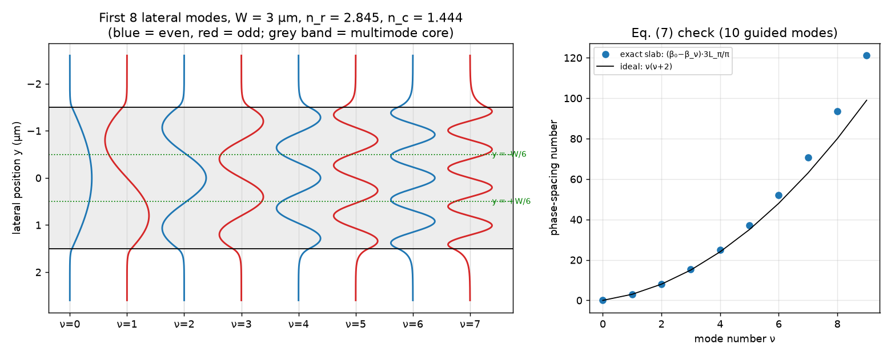

**How to read this figure.** Left: the first eight exact lateral modes of a 3-µm-wide section with core index 2.845 and cladding index 1.444 at 1.55 µm (computed for this page). The grey band is the multimode core; each curve is one mode drawn sideways. Blue modes are even, red modes are odd. Notice the small tails that leak past the walls, and notice that modes 2, 5 and 8 (only 2 and 5 shown) cross zero exactly on the green dotted lines at $y = \pm W/6$; you will need that fact for paired interference. Right: the "phase-spacing numbers" of the exact modes compared with the ideal $\nu(\nu+2)$ of Eq. (7) below; they agree well for low modes and drift for high ones.

### Mode expansion: any input is a mix of modes

The modes of a guide are like the notes of an instrument: any field you put in at the start can be written as a sum of modes, each with its own weight. The weight is found by an **overlap integral**: multiply the input by the mode shape and integrate. If the input and a mode "look alike", the weight is big; if the mode is odd and the input is even about the same point, the weight is exactly zero. This works because different modes are **orthogonal**: the overlap of two different modes is zero. It is the same idea as a Fourier series, where $\sin$ and $\cos$ terms are orthogonal.

### Binomial (Taylor) approximation

For a small number $x$, $\sqrt{1 - x} \approx 1 - x/2$. Example: $\sqrt{1 - 0.02} = 0.98995$, and $1 - 0.01 = 0.99$. We will use this to turn a square root into something simple.

### Effective index method (EIM)

A real MMI is a 3-D block of silicon 220 nm thick and a few µm wide. The **effective index method** squashes the vertical direction: first find the effective index of the 220 nm slab (for TE at 1550 nm this is about **2.845**), then treat the device as a flat 2-D problem where the "core" has index $n_r = 2.845$ and the etched regions have the cladding index $n_c$ (1.444 for oxide, 1.0 for air). Soldano and Pennings do exactly this (they also mention the **spectral index method**, a more careful variant).

### Beat length

When two modes travel together, their relative phase grows as $(\beta_0 - \beta_1) z$. The distance over which this grows by $\pi$ is the **beat length**,

$$L_\pi = \frac{\pi}{\beta_0 - \beta_1}.$$

You met this on Monday 28 Sep in the directional coupler: there the even and odd supermodes beat, and the light crosses over after one beat length. In an MMI, $L_\pi$ of the two lowest modes is the ruler that sets every length.

### Power, decibels, imbalance

Power is field squared. A field of amplitude $1/\sqrt{2}$ carries half the power. In dB, a ratio $P_1/P_2$ is $10\log_{10}(P_1/P_2)$. **Excess loss** is how much total power is lost (in dB). **Imbalance** is the ratio of largest to smallest output power, in dB (0.1 dB means $P_{max}/P_{min} = 1.023$). **Crosstalk** or **extinction ratio** is how much light leaks to a port that should be dark.

## I. Introduction

The authors set the scene for 1995 telecoms. Networks need chips that can route and combine light flexibly. Wavelength-division multiplexing (sending many colours down one fibre) needs components that work over a wide band of wavelengths and do not care about polarization. Cost needs small devices that tolerate fabrication errors.

MMI devices tick all these boxes, and by 1995 they were already used inside bigger circuits: phase-diversity networks, Mach–Zehnder switches and modulators, balanced coherent receivers and ring lasers. The paper's plan: the self-imaging principle (II), multimode waveguides and the mode analysis (III), general interference (IV), restricted interference (V), design issues (VI), applications (VII), and a comparison with other couplers (VIII).

## II. The Self-Imaging Principle

Self-imaging is old. Talbot saw it in 1836: light passing through a periodic grating makes sharp copies of the grating at regular distances behind it (the **Talbot effect**). Graded-index lenses also re-image periodically. Bryngdahl (1973) suggested that a plain uniform slab waveguide could do it too, and Ulrich (1975) worked it out.

The paper's definition, in plain words: *a multimode waveguide takes the field you put in and rebuilds it, as one copy or as several copies, at regular distances along the guide.*

Why should this happen? Each mode moves at its own speed, so the modes slip out of step. But in a wide step-index guide, the speeds are not random. The phase slips follow a very regular pattern (a quadratic in mode number, Eq. (7) below). Regular slips mean that, at special distances, all the slips become whole turns (or simple fractions of turns) at once, and the original mix is restored.

## III. Multimoded Waveguides

The core of every MMI device is a waveguide wide enough to carry many modes (typically 3 or more). Single-mode **access waveguides** feed light in at the start and collect it at the end. A device with $N$ inputs and $M$ outputs is an **$N \times M$ MMI coupler**.

To analyse it, the authors use the **guided-mode propagation analysis (MPA)**: break the input into modes, move each mode forward with its own phase, and add them up again. Other methods exist (ray optics, hybrid methods, the beam propagation method BPM), but MPA gives the clearest insight.

**From 3-D to 2-D.** Etched waveguides are normally single-mode in the vertical (transverse, $x$) direction and much wider than they are tall. So every mode has the same vertical shape, and the problem can be reduced to 2-D: the lateral direction $y$ and the propagation direction $z$. The reduction is done with the effective index method or the spectral index method. The 2-D structure is shown in Fig. 1.

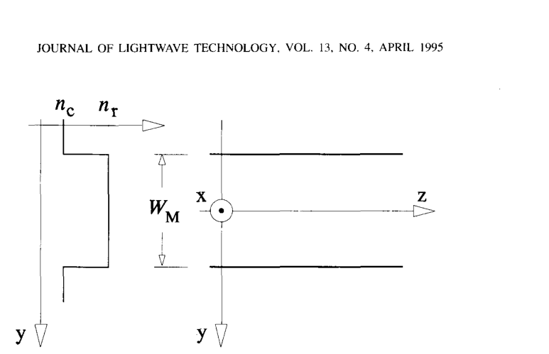

**How to read this figure.** Left: the (effective) refractive index across the guide. It is a step: $n_r$ ("ridge" index) inside a width $W_M$, and the lower $n_c$ ("cladding" index) outside. Right: the same guide seen from above, with $z$ the direction of travel, $y$ across the guide, and $x$ pointing out of the page (the squashed vertical direction). The takeaway: from here on, everything happens in the flat $y$–$z$ plane.

### A. Propagation Constants

The multimode section has width $W_M$, core index $n_r$, cladding index $n_c$, and supports $m$ modes numbered $\nu = 0, 1, \dots, m-1$ at wavelength $\lambda_0$.

**Equation (1): the dispersion relation.** Inside the core, the total wavenumber $k_0 n_r$ is shared between a sideways part $k_{y\nu}$ and a forward part $\beta_\nu$, like the two sides of a right-angled triangle:

$$k_{y\nu}^2 + \beta_\nu^2 = k_0^2 n_r^2. \tag{1}$$

In words: the wave inside the core has a fixed "total speed of phase" $k_0 n_r$. A mode that wiggles more sideways (bigger $k_{y\nu}$) has less left for going forward (smaller $\beta_\nu$). This is why higher modes are slower.

**Equation (2):** $k_0 = 2\pi/\lambda_0$, as above.

**Equation (3): the sideways wavenumber.** Mode $\nu$ fits $(\nu+1)$ half-waves across an effective width $W_{e\nu}$:

$$k_{y\nu} = \frac{(\nu+1)\pi}{W_{e\nu}}. \tag{3}$$

**Equation (4): the effective width.** The mode is not perfectly stopped at the wall. Its field leaks a short way into the cladding (the evanescent tail), and on reflection the ray appears to bounce from slightly outside the wall (the **Goos–Hänchen shift**). So the mode "feels" a slightly wider guide. For high-contrast guides this extra width is small and nearly the same for all modes, so we can use one value, that of the fundamental mode:

$$W_e = W_M + \left(\frac{\lambda_0}{\pi}\right)\left(\frac{n_c}{n_r}\right)^{2\sigma}\left(n_r^2 - n_c^2\right)^{-1/2}. \tag{4}$$

Here $\sigma = 0$ or $1$ picks the polarization. The rule behind it: if the electric field points **along** the side walls, use $\sigma = 0$; if the main electric field points **across** the side walls (perpendicular to them), the boundary condition is different, the tail is shorter, and you use $\sigma = 1$, which multiplies the correction by $(n_c/n_r)^2$. (The paper writes "$\sigma = 0$ for TE, $\sigma = 1$ for TM"; which of your polarizations counts as which depends on the geometry, so think about the field direction relative to the side walls. For the usual TE mode of an SOI strip, the main electric field is horizontal, i.e. across the MMI side walls, so $\sigma = 1$ is the physically right choice in the lateral problem.)

*Worked number.* $n_r = 2.845$, $n_c = 1.444$, $\lambda_0 = 1.55$ µm: $n_r^2 - n_c^2 = 8.094 - 2.085 = 6.009$, square root 2.451. $\lambda_0/\pi = 0.4934$ µm. So the extra width is $0.4934/2.451 = 0.201$ µm for $\sigma = 0$, and $0.201 \times (1.444/2.845)^2 = 0.201 \times 0.2576 = 0.052$ µm for $\sigma = 1$. For a 3-µm MMI, $W_e = 3.201$ µm or $3.052$ µm. Small, but it enters squared, so it matters (about 14 % in length for $\sigma = 0$).

**Equation (5): the quadratic rule.** Solve (1) for $\beta_\nu$ and use the binomial approximation, since $k_{y\nu}$ is much smaller than $k_0 n_r$ in a wide guide:

$$\beta_\nu = \sqrt{k_0^2 n_r^2 - k_{y\nu}^2} = k_0 n_r\sqrt{1 - \frac{k_{y\nu}^2}{k_0^2 n_r^2}} \approx k_0 n_r - \frac{k_{y\nu}^2}{2 k_0 n_r}.$$

Now put in $k_{y\nu} = (\nu+1)\pi/W_e$ and $k_0 = 2\pi/\lambda_0$:

$$\frac{k_{y\nu}^2}{2k_0 n_r} = \frac{(\nu+1)^2\pi^2}{W_e^2}\cdot\frac{\lambda_0}{4\pi n_r} = \frac{(\nu+1)^2\pi\lambda_0}{4 n_r W_e^2}.$$

So

$$\beta_\nu \simeq k_0 n_r - \frac{(\nu+1)^2\pi\lambda_0}{4n_r W_e^2}. \tag{5}$$

In words: every mode starts from the same "top speed" $k_0 n_r$ and is slowed by an amount that grows as the **square** of $(\nu + 1)$. This quadratic pattern is the secret of self-imaging.

**Equation (6): the beat length.** Take $\nu = 0$ and $\nu = 1$ in (5): $(\nu+1)^2$ is 1 and 4, so

$$\beta_0 - \beta_1 = \frac{(4 - 1)\pi\lambda_0}{4n_rW_e^2} = \frac{3\pi\lambda_0}{4n_rW_e^2}.$$

Hence

$$L_\pi \doteq \frac{\pi}{\beta_0 - \beta_1} \simeq \frac{4n_rW_e^2}{3\lambda_0}. \tag{6}$$

The "$\doteq$" means "is defined as". Note the scaling: $L_\pi$ grows with the **square** of the width, and in proportion to $n_r$. Double the width and the device becomes four times longer.

**Equation (7): every mode's phase lag in units of $L_\pi$.** In general,

$$\beta_0 - \beta_\nu = \frac{[(\nu+1)^2 - 1]\pi\lambda_0}{4n_rW_e^2} = \frac{\nu(\nu+2)\pi\lambda_0}{4n_rW_e^2},$$

because $(\nu+1)^2 - 1 = \nu^2 + 2\nu = \nu(\nu+2)$. From (6), $\pi\lambda_0/(4n_rW_e^2) = \pi/(3L_\pi)$. So

$$\beta_0 - \beta_\nu \simeq \frac{\nu(\nu+2)\pi}{3L_\pi}. \tag{7}$$

The numbers $\nu(\nu+2)$ are 0, 3, 8, 15, 24, 35, 48, 63, 80, ... for $\nu = 0, 1, 2, \dots$ These are the "speed ratios" of the runners in the analogy. Everything that follows is number theory on this list.

*Worked number.* $W_e = 3.201$ µm, $n_r = 2.845$: $L_\pi = 4 \times 2.845 \times 3.201^2/(3 \times 1.55) = 116.6/4.65 = 25.1$ µm. Mode 2 lags mode 0 by $8\pi/(3 \times 25.1) = 0.334$ rad per µm.

### B. Guided-Mode Propagation Analysis

**Equation (8): decompose the input.** At $z = 0$ an input field $\Psi(y, 0)$ (from an access waveguide) is written as a sum of modes,

$$\Psi(y,0) = \sum_\nu c_\nu\,\psi_\nu(y), \tag{8}$$

where $\psi_\nu(y)$ is the shape of mode $\nu$ and $c_\nu$ is its weight. Strictly, the sum includes radiation modes (light that is not trapped), but see below.

**Equation (9): the weights.** Using orthogonality,

$$c_\nu = \frac{\int \Psi(y,0)\,\psi_\nu(y)\,dy}{\sqrt{\int \psi_\nu^2(y)\,dy}}. \tag{9}$$

In words: project the input onto each mode. The denominator just normalises the mode. (Strictly, to reconstruct the field you also divide by the square root once more; the paper's form gives the weight relative to a normalised mode, which is what matters.)

**Equation (10): guided modes only.** If the input is smooth and not too narrow (its "spatial spectrum" — the range of sideways wavenumbers it contains — is narrow), it hardly excites radiation modes. Then

$$\Psi(y,0) = \sum_{\nu=0}^{m-1} c_\nu\,\psi_\nu(y). \tag{10}$$

This holds for all practical devices.

**Equation (11): move forward.** Each mode simply gains its own phase:

$$\Psi(y,z) = \sum_{\nu=0}^{m-1} c_\nu\,\psi_\nu(y)\,\exp[j(\omega t - \beta_\nu z)]. \tag{11}$$

**Equation (12): only relative phases matter.** Pull out the common factor $\exp[j(\omega t - \beta_0 z)]$ (it does not change the shape of the field) and drop it:

$$\Psi(y,z) = \sum_{\nu=0}^{m-1} c_\nu\,\psi_\nu(y)\,\exp[j(\beta_0 - \beta_\nu)z]. \tag{12}$$

**Equation (13): put in the quadratic rule.** Substituting (7):

$$\Psi(y,L) = \sum_{\nu=0}^{m-1} c_\nu\,\psi_\nu(y)\,\exp\left[j\frac{\nu(\nu+2)\pi}{3L_\pi}L\right]. \tag{13}$$

**Equation (14): the mode phase factor.**

$$\exp\left[j\frac{\nu(\nu+2)\pi}{3L_\pi}L\right]. \tag{14}$$

This one factor decides everything. The shape at distance $L$ depends only on the weights $c_\nu$ and on these phase factors. Two families of images follow:

- **General interference:** images that form whatever the weights $c_\nu$ are (any input position, any input shape).
- **Restricted interference:** images that form only when some modes are not excited at all (some $c_\nu = 0$), which you achieve by placing the input at special positions.

**Equations (15) and (16): two parity facts.**

$$\nu(\nu+2) \text{ is even for } \nu \text{ even, and odd for } \nu \text{ odd.} \tag{15}$$

(Check: $0, 8, 24, 48$ are even; $3, 15, 35, 63$ are odd. If $\nu$ is odd, both $\nu$ and $\nu + 2$ are odd and so is their product.)

$$\psi_\nu(-y) = \psi_\nu(y) \text{ for } \nu \text{ even}; \qquad \psi_\nu(-y) = -\psi_\nu(y) \text{ for } \nu \text{ odd.} \tag{16}$$

This is just the even/odd symmetry of the modes, a consequence of the guide being mirror-symmetric about $y = 0$.

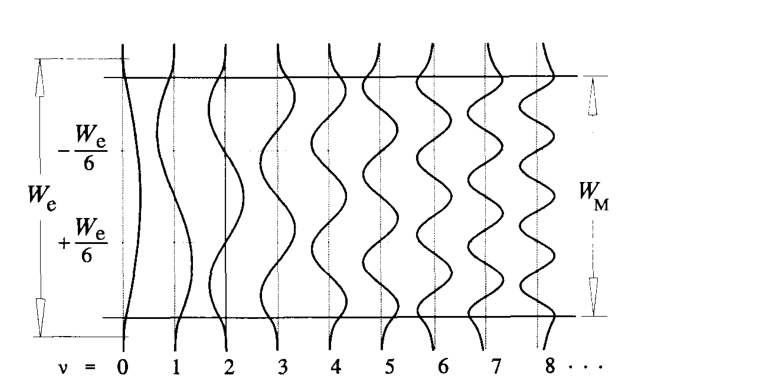

**How to read this figure.** Each vertical curve is one mode, $\nu = 0$ to $8$, drawn across the guide (the guide's width runs top to bottom). The mode number equals the number of zero crossings inside the guide. Look at the two levels marked $\pm W_e/6$: modes 2, 5 and 8 cross zero exactly there. This is what makes paired interference (Section V-A) possible. Compare with the generated figure above, which shows the same thing for a 3-µm SOI section.

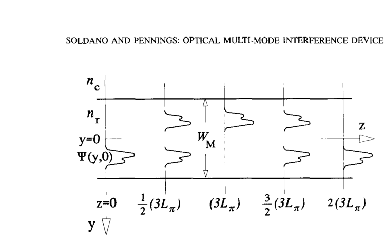

**How to read this figure.** Light enters at $z = 0$ off-centre (below the axis). Moving right: at $\frac{1}{2}(3L_\pi)$ there are two half-size copies, one at the input height and one mirrored; at $3L_\pi$ there is one full copy, mirrored to the other side; at $\frac{3}{2}(3L_\pi)$ two copies again; at $2(3L_\pi)$ one copy at the original position. This is the whole story of Section IV in one picture.

## IV. General Interference

Here we put **no restrictions** on the weights $c_\nu$, and ask when the phase factors (14) line up by themselves.

### A. Single Images

**Equation (17).** $\Psi(y, L)$ is a copy of the input if every phase factor equals 1, or equals $(-1)^\nu$:

$$\exp\left[j\frac{\nu(\nu+2)\pi}{3L_\pi}L\right] = 1 \quad\text{or}\quad (-1)^\nu. \tag{17}$$

- If every factor is 1, all modes are back in their original relative phase. The field is a **direct image**: an exact copy.
- If the factor is $+1$ for even modes and $-1$ for odd modes, then the field is $\sum c_\nu \psi_\nu(y)(-1)^\nu$. By (16), $(-1)^\nu\psi_\nu(y) = \psi_\nu(-y)$. So the sum is $\Psi(-y, 0)$: the input **flipped about the centre line**. This is a **mirrored image**.

**Equation (18).** Try $L = p(3L_\pi)$. The phase of mode $\nu$ is then $\nu(\nu+2)\,p\,\pi$.

- $p$ even: the phase is an even multiple of $\pi$, so every factor is 1. Direct image.
- $p$ odd: the phase is $\nu(\nu+2)\pi$ times an odd number. By (15), this is an even multiple of $\pi$ for even $\nu$ (factor $+1$) and an odd multiple of $\pi$ for odd $\nu$ (factor $-1$). Mirrored image.

$$L = p\,(3L_\pi), \quad p = 0, 1, 2, \dots \tag{18}$$

So: **mirrored single image at $3L_\pi$, direct single image at $6L_\pi$, mirrored again at $9L_\pi$, and so on.** A mirrored image puts the light on the opposite side: a **cross coupler**. A direct image keeps it on the same side: a **bar coupler**.

*Worked number.* With $L_\pi = 25.1$ µm: mirror image at 75 µm, direct image at 150 µm. In the generated self-imaging map below (bottom panel), you can see the mirrored copy near 72–75 µm and the direct copy near 145–150 µm.

### B. Multiple Images

**Equation (19).** Now look half-way between the single images:

$$L = \frac{p}{2}(3L_\pi), \quad p = 1, 3, 5, \dots \tag{19}$$

**Equation (20).** Substituting into (13), the phase of mode $\nu$ becomes $\nu(\nu+2)\,p\,\pi/2$:

$$\Psi\left(y, \tfrac{p}{2}3L_\pi\right) = \sum_{\nu=0}^{m-1} c_\nu\,\psi_\nu(y)\exp\left[j\nu(\nu+2)p\frac{\pi}{2}\right]. \tag{20}$$

**Equation (21): two images in quadrature.** Work out the factor for each kind of mode.

- $\nu$ even, write $\nu = 2k$: $\nu(\nu+2) = 2k(2k+2) = 4k(k+1)$, a multiple of 4 (in fact of 8). Times $p\pi/2$ gives a multiple of $2\pi$. Factor $= 1$.
- $\nu$ odd, write $\nu = 2k+1$: $\nu(\nu+2) = (2k+1)(2k+3) = 4(k^2+2k) + 3$. Times $p\pi/2$ gives $2\pi p(k^2+2k) + 3p\pi/2$. The first part is a whole number of turns. Factor $= e^{j3p\pi/2} = (e^{j3\pi/2})^p = (-j)^p$.

So

$$\Psi\left(y, \tfrac{p}{2}3L_\pi\right) = \sum_{\nu\ \text{even}} c_\nu\psi_\nu(y) + (-j)^p\sum_{\nu\ \text{odd}} c_\nu\psi_\nu(y).$$

Now split the input into its even and odd parts. The even modes add up to the even part of the input, $\tfrac{1}{2}[\Psi(y,0) + \Psi(-y,0)]$; the odd modes add up to the odd part, $\tfrac{1}{2}[\Psi(y,0) - \Psi(-y,0)]$. Substituting and collecting terms:

$$\Psi\left(y, \tfrac{p}{2}3L_\pi\right) = \frac{1 + (-j)^p}{2}\Psi(y,0) + \frac{1 - (-j)^p}{2}\Psi(-y,0). \tag{21}$$

For $p = 1$ the two coefficients are $(1 - j)/2$ and $(1 + j)/2$. Each has size $\sqrt{(1/2)^2 + (1/2)^2} = 1/\sqrt{2}$, so each copy carries **half the power**. Their angles are $-45°$ and $+45°$, so the two copies are **90° apart in phase (in quadrature)**. One copy sits where the input was; the other is its mirror. That is a **2×2 3-dB coupler** with the same 90° phase relation as a directional coupler, at length $\tfrac{3}{2}L_\pi$.

*Worked number.* With $L_\pi = 25.1$ µm the general-interference 3-dB length is $1.5 \times 25.1 = 37.6$ µm (you can see the two copies near 37 µm in the bottom panel of the self-imaging map).

The paper lists early 2×2 MMIs made this way in III-V semiconductors and in silica.

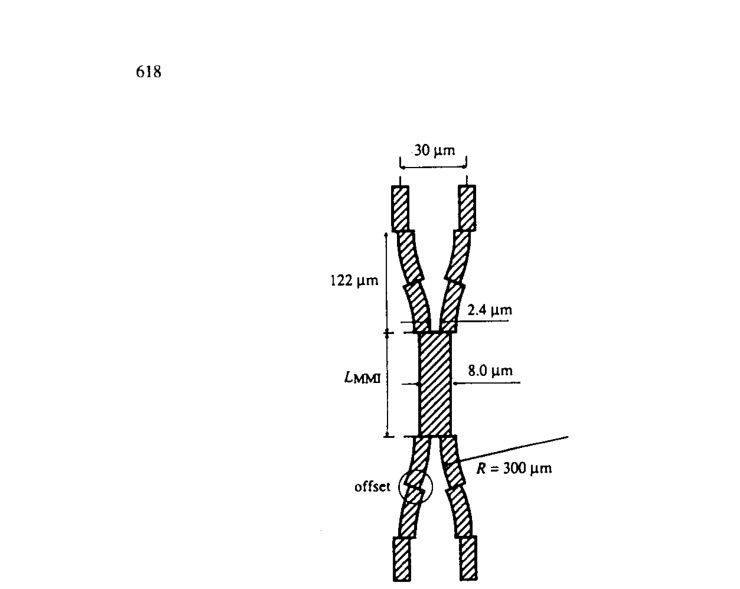

**How to read this figure.** Light travels top to bottom. Two access waveguides 30 µm apart bend in (radius 300 µm) to meet an 8.0-µm-wide multimode section of length $L_{MMI}$, then bend out again. The small sideways "offsets" at the joins between straight and curved sections reduce loss (they line up the shifted mode of the bend with the mode of the straight). The 8-µm section supports 4 modes. Measured: 0.4–0.7 dB excess loss, −28 dB extinction in the cross state ($3L_\pi = 500$ µm), and imbalance well below 0.1 dB in the 3-dB state ($\tfrac{3}{2}L_\pi = 250$ µm), for both polarizations at 1.52 µm.

**Imbalance** is defined here as the ratio (in dB) of the largest to the smallest output power. The paper uses this definition throughout.

**General $N$-fold images (Eqs. 22–27).** Images also form at other fractions of $3L_\pi$. The exact result comes from Bachmann, Besse and Melchior (1994) using Fourier analysis. The idea, step by step:

1. Shift the coordinate so that $y = 0$ is one wall of the guide. Extend the input field to an infinite, periodic pattern with period $2W_e$, made antisymmetric about the wall (the input, then its negative mirror image, then repeat):

$$\Psi_{in}(y) \doteq \sum_{v=-\infty}^{\infty}\left[\Psi(y - v\,2W_e,\,0) - \Psi(-y + v\,2W_e,\,0)\right]. \tag{22}$$

2. In this frame, the modes are close to pure sines that vanish at the walls:

$$\psi_\nu(y) \simeq \sin(k_{y\nu}y). \tag{23}$$

Then (10) is simply a Fourier sine series of the periodic pattern, and the quadratic phases (7) act exactly like the Talbot effect for a grating of period $2W_e$.

3. Result: at

$$L = \frac{p}{N}(3L_\pi), \tag{24}$$

with $p \ge 0$ and $N \ge 1$ integers that share no common divisor, the field is a sum of $N$ shifted copies of the extended input:

$$\Psi(y,L) = \frac{1}{C}\sum_{q=0}^{N-1}\Psi_{in}(y - y_q)\exp(j\varphi_q), \tag{25}$$

$$y_q = p(2q - N)\frac{W_e}{N}, \tag{26}$$

$$\varphi_q = p(N - q)\frac{q\pi}{N}, \tag{27}$$

with $|C| = \sqrt{N}$. Here $q = 0, \dots, N-1$ labels the copies; $y_q$ is where copy $q$ sits and $\varphi_q$ is its phase. Each copy has amplitude $1/\sqrt{N}$, so power $1/N$: the power is split equally $N$ ways.

*Check with $N = 2$, $p = 1$:* $y_0 = -2W_e/2 = -W_e$ and $y_1 = 0$; phases $\varphi_0 = 0$ and $\varphi_1 = 1 \cdot 1 \cdot \pi/2 = \pi/2$. Two copies, 90° apart. Since the extended pattern is antisymmetric about each wall, these two shifted copies turn into "the input" and "its mirror" inside the real guide, exactly as in (21). Good — the general formula reproduces the simple case.

The $N$ images inside the physical guide are generally *not* equally spaced (they depend on where the input sits). This lets you build $N \times N$ and $N \times M$ couplers. The shortest devices use $p = 1$.

**Equations (28) and (29): output phases of an $N \times N$ coupler ($p = 1$).** Number the inputs $r = 1, \dots, N$ from the bottom and the outputs $s = 1, \dots, N$ from the top. Apart from a common phase, the phase from input $r$ to output $s$ is

$$\varphi_{rs} = \frac{\pi}{4N}(s-1)(2N + r - s) + \pi \quad\text{for } r+s \text{ even}, \tag{28}$$

$$\varphi_{rs} = \frac{\pi}{4N}(r+s-1)(2N - r - s + 1) \quad\text{for } r+s \text{ odd}. \tag{29}$$

*Check with $N = 2$:* input $r = 1$ to output $s = 1$ ($r + s = 2$, even): $\varphi_{11} = \frac{\pi}{8}\cdot 0 + \pi = \pi$. Input 1 to output 2 ($r + s = 3$, odd): $\varphi_{12} = \frac{\pi}{8}\cdot 2 \cdot 2 = \pi/2$. The difference is $\pi/2$: again the 90° of a 3-dB coupler.

These phases are built into the self-imaging; you cannot design them away. For $N = 4$ they turn out to be exactly the **90° hybrid** relation (outputs in quadrature), a key part of phase-diversity and image-rejection receivers. So a 4×4 MMI is a ready-made 90° hybrid.

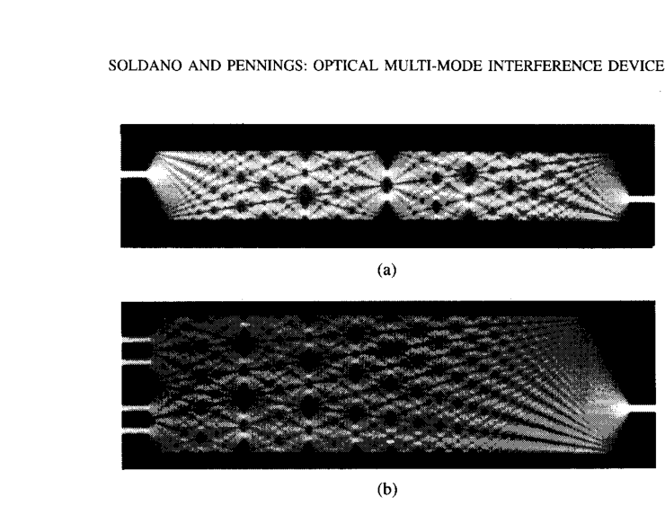

**How to read this figure.** These are top views of calculated light intensity (white = bright) inside two multimode sections, light going left to right. (a) One input at the top left; the light spreads, makes many partial images, and arrives as a single *mirrored* image at the bottom right output. (b) A 4-fold image: the bright spots line up at four heights where four access waveguides sit (here drawn on the left, with the single guide on the right, i.e. a 1-to-4 or 4-to-1 device). The takeaway: the "kaleidoscope" pattern inside is complicated, but at the right length the light gathers neatly into the access guides.

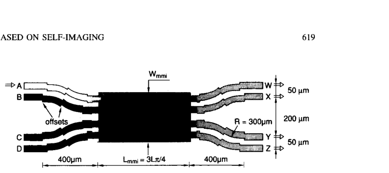

**How to read this figure.** Four inputs (A–D) on the left, four outputs (W–Z) on the right, joined to a wide MMI section of length $L_{mmi} = 3L_\pi/4$ (the $p = 1$, $N = 4$ general image: $3L_\pi/4$). Bends with radius 300 µm and small offsets fan the guides out to 50/200/50 µm spacing over 400 µm. Such deeply etched InP devices were under 1 mm long, with excess loss below 1 dB, imbalance 0.3–0.9 dB and phase errors of about 5°. Earlier 4×4 hybrids made from glass sheets were 10–25 mm long.

## V. Restricted Interference

So far, any input works. Now we choose the input so that **some modes are not excited at all**. Then the troublesome numbers in the list $\nu(\nu+2)$ disappear, and the remaining numbers share a common factor. A common factor means the phases realign sooner: shorter devices.

### A. Paired Interference

**Equation (30).** Look at $\nu(\nu+2)$ modulo 3 (the remainder after dividing by 3):

| $\nu$ | 0 | 1 | 2 | 3 | 4 | 5 | 6 | 7 | 8 |
|---|---|---|---|---|---|---|---|---|---|
| $\nu(\nu+2)$ | 0 | 3 | 8 | 15 | 24 | 35 | 48 | 63 | 80 |
| remainder mod 3 | 0 | 0 | 2 | 0 | 0 | 2 | 0 | 0 | 2 |

$$\text{mod}_3[\nu(\nu+2)] = 0 \quad\text{for } \nu \ne 2, 5, 8, \dots \tag{30}$$

**Equation (31).** So if we arrange

$$c_\nu = 0 \quad\text{for } \nu = 2, 5, 8, \dots \tag{31}$$

then every remaining $\nu(\nu+2)$ is $3\times$ (a whole number). The phase factor (14) becomes $\exp[j(\nu(\nu+2)/3)\,\pi L/L_\pi]$, which repeats three times faster.

**Equation (32).** Single images (direct and mirrored) now appear at

$$L = p\,L_\pi, \quad p = 0, 1, 2, \dots \tag{32}$$

and two-fold images at $(p/2)L_\pi$ with $p$ odd.

**Equation (33).** Numerically, $N$-fold images appear at

$$L = \frac{p}{N}L_\pi. \tag{33}$$

**How to kill modes 2, 5, 8.** Put a symmetric input (e.g. a Gaussian-like spot) centred at $y = \pm W_e/6$. Why does that work? Measure from the lower wall: the mode is $\sin[(\nu+1)\pi(y + W_e/2)/W_e]$. At $y = +W_e/6$, $y + W_e/2 = 2W_e/3$, so the mode is $\sin[2(\nu+1)\pi/3]$. This is zero when $(\nu+1)$ is a multiple of 3, i.e. $\nu = 2, 5, 8$. At that point the mode crosses zero and is *odd* about it. An even input times an odd mode integrates to zero, so $c_\nu = 0$. The same happens at $y = -W_e/6$. Only two such positions exist, so a paired device has at most **two inputs**.

Why "paired"? The surviving modes come in pairs 0–1, 3–4, 6–7, and within each pair the even mode leads the odd one by $\pi/2$ at $L_\pi/2$ (3-dB length) and by $\pi$ at $L_\pi$ (cross length). A **two-mode interference (TMI)** coupler, where only modes 0 and 1 exist, is the simplest special case. It is also exactly the physics of the directional coupler you studied on Monday 28 Sep.

Results quoted: silica 2×2 paired MMIs, 240 µm (cross) and 150 µm (3-dB) long, insertion loss under 0.4 dB, imbalance under 0.2 dB, extinction −18 dB, polarization penalty 0.2 dB, in sections with 7–9 modes. Careful placement can keep modes 2, 5, 8 below −40 dB in power, and still below −30 dB with 0.1 µm misalignment. Deeply etched InP versions: 107 µm (3-dB) and 216 µm (cross).

*Worked number.* $L_\pi = 25.1$ µm: a paired 2×2 3-dB coupler at $L_\pi/2 = 12.5$ µm, cross state at 25.1 µm, with inputs at $\pm W_e/6 = \pm 0.53$ µm. The middle panel of the self-imaging map shows this.

### B. Symmetric Interference

Instead of killing modes 2, 5, 8, kill **all the odd modes**.

**Equation (34).**

$$\text{mod}_4[\nu(\nu+2)] = 0 \quad\text{for } \nu \text{ even}. \tag{34}$$

(For $\nu = 2k$: $\nu(\nu+2) = 4k(k+1)$, clearly a multiple of 4. Check: 0, 8, 24, 48, 80.)

**Equation (35).** So if

$$c_\nu = 0 \quad\text{for } \nu = 1, 3, 5, \dots \tag{35}$$

the phase factor repeats four times faster.

**Equation (36).** Single images at

$$L = p\left(\frac{3L_\pi}{4}\right), \quad p = 0, 1, 2, \dots \tag{36}$$

(With only even modes, "direct" and "mirrored" look the same, because the field is symmetric.)

How to kill all odd modes: **feed the centre** with a symmetric input. An even input against an odd mode overlaps to zero. This is called **symmetric interference**.

**Equation (37).** $N$-fold images at

$$L = \frac{p}{N}\left(\frac{3L_\pi}{4}\right), \tag{37}$$

and here the $N$ copies are **equally spaced** across the guide, $W_e/N$ apart, placed symmetrically. For $N = 2$: two copies at $y = \pm W_e/4$, at $L = 3L_\pi/8$. **This is the 1×2 MMI splitter**, and both outputs are in phase (by symmetry).

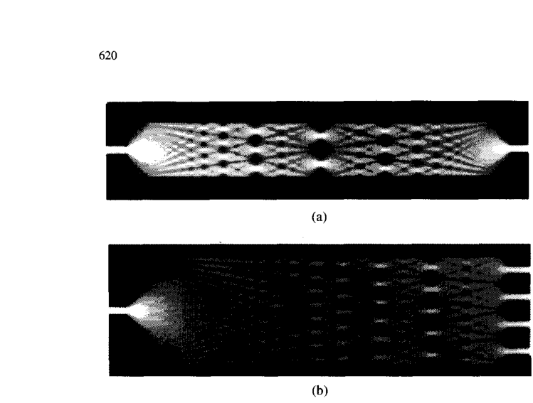

**How to read this figure.** Calculated intensity, light going left to right, with a single input at the centre. (a) A 20-µm-wide guide: the light spreads, forms 4-, 3- and 2-fold images on the way, and re-forms a single spot at the centre at $3L_\pi/4$ (a "1×1" image). Half-way, you can see the two-fold image (the 1×2 point). (b) A 40-µm-wide guide cut at the length of the 4-fold image: four bright spots line up with four output guides, a 1-to-4 splitter. Note the images at intermediate distances are equally spaced across the guide, as Eq. (37) says.

Two practical rules from this section:

- A rule of thumb: to split a Gaussian-like input well into $N$ outputs, the section should carry at least $m = N + 1$ modes.
- The 1×2 splitter is the simplest MMI of all: it needs only two even modes (0 and 2). Reported: 20–30 µm long in silica, 50–70 µm in InP, about 1 dB excess loss, imbalance below 0.15 dB.

1×N splitters with widths 12–48 µm and lengths 250–3800 µm were shown in GaAs and InP, splitting into 2 to 20 outputs with imbalance below 0.4 dB. With a 1 µm minimum gap and 2 µm access guides, InP 1-to-$N$ splitters could be about $N \times 20$ µm long.

*Worked number (the headline for Monday):* $L_\pi = 25.1$ µm gives $L_{1\times2} = 3 \times 25.1/8 = 9.4$ µm, outputs at $\pm 3.201/4 = \pm 0.80$ µm. Compare: a general-interference 1×2 or 2×2 at $3L_\pi/2 = 37.6$ µm is four times longer. This is why real SOI 1×2 MMIs are about 10 µm long.

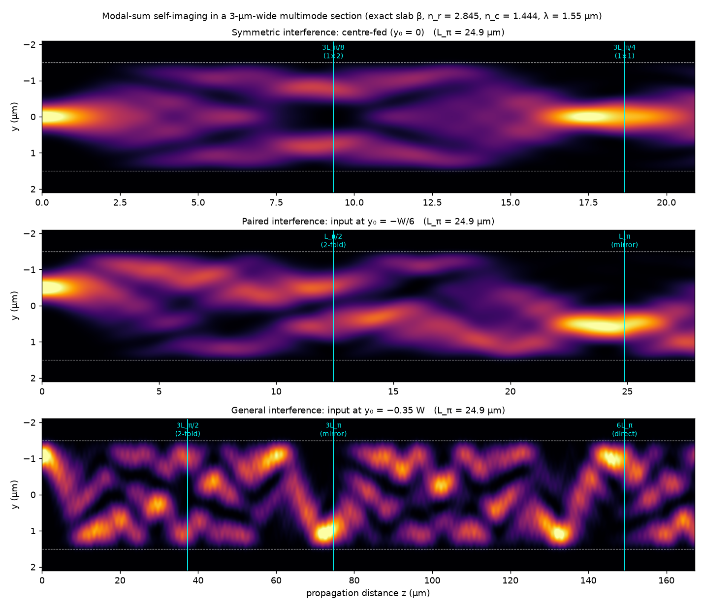

**How to read this figure.** These maps were computed for this page by the method of the paper itself: a Gaussian input is split into the exact slab modes of a 3-µm section ($n_r = 2.845$, $n_c = 1.444$, 1.55 µm), each mode is moved forward with its own exact $\beta_\nu$, and the intensity $|\Psi(y,z)|^2$ is plotted (bright = more light; $y$ increases downward, as in the paper's figures; dashed lines are the walls; cyan lines mark the predicted lengths). **Top:** centre-fed (symmetric interference). Two spots appear near $3L_\pi/8 \approx 9$ µm and the single spot comes back near $3L_\pi/4$. **Middle:** input at $-W/6$ (paired interference). Two weaker spots near $L_\pi/2$, and a mirrored copy at $+W/6$ near $L_\pi$. **Bottom:** input near the wall (general interference). Two-fold image near $3L_\pi/2$, mirrored image near $3L_\pi$, direct image near $6L_\pi$. Notice the real images form a little *before* the cyan lines; that is the phase error of the quadratic approximation, discussed in Section VI-B.

## VI. Discussion

This section explains how self-imaging shapes the design and behaviour of MMIs, compared with other devices.

### Table I: the design cheat-sheet

| Interference mechanism | General | Paired | Symmetric |
|---|---|---|---|
| Inputs × outputs | $N \times N$ | $2 \times N$ | $1 \times N$ |
| First single image | $3L_\pi$ | $L_\pi$ | $3L_\pi/4$ |
| First $N$-fold image | $3L_\pi/N$ | $L_\pi/N$ | $3L_\pi/(4N)$ |
| Excitation needed | none | $c_\nu = 0$ for $\nu = 2, 5, 8, \dots$ | $c_\nu = 0$ for $\nu = 1, 3, 5, \dots$ |
| Input position(s) | anywhere | $y = \pm W_e/6$ | $y = 0$ |

"Restricted interference" is the umbrella name for the paired and symmetric columns. This table plus Eq. (6) is the entire design method.

### A. Properties and Requirements

General interference does not care in principle where the input is or what it looks like. In practice, simulations and experiments show that the exact positions of the access guides still matter for the best performance, especially in strongly guiding structures.

Restricted mechanisms need well-placed, fairly symmetric inputs, otherwise the "forbidden" modes get excited and the image blurs.

A surprise: for 2×2 couplers, paired interference does **not** give shorter devices than general interference. To fit two inputs at $\pm W_e/6$ (only $W_e/3$ apart) with enough space, the section must be wider, and length grows as width squared (Eq. 6), cancelling the factor-3 gain. However, in weakly guiding guides, general-interference couplers can be lossier, because their access guides sit near the corners where the image is built mainly from the wider outer lobes of the high modes, which are poorly guided.

### B. Imaging Quality

**Imaging quality** is how faithfully the input is rebuilt.

The quadratic rule (5) is an approximation. Higher modes deviate from it (see the right panel of the mode figure: the high modes sit above the ideal curve). So at the predicted image length the modes are not perfectly back in step, and the image blurs. This is like **aberration** in a camera lens, where rays far from the axis focus at a slightly different place. A small correction to the length (usually a little shorter) balances the errors. You can see this in the generated maps above: images form a few percent before the cyan lines.

The formal tool is the **line-spread function (LSF)**: the image you get from an infinitely thin input line. A narrow LSF peak means sharp images, hence low insertion loss. Low ripple in the LSF means little stray light, hence low crosstalk. The LSF is controlled by the mode weights $c_\nu$:

- all modes equally excited, then cut off sharply: narrowest peak, but heavy ripple;
- weights that roll off smoothly for high modes: no ripple, slightly wider peak.

**Equation (38): resolution.** The image is a sum of mode shapes, so it cannot be narrower than the finest feature of the highest mode, i.e. one lobe of the highest mode:

$$\rho \simeq \frac{W_e}{m}. \tag{38}$$

A full LSF calculation gives between $0.89\,W_e/m$ (flat weights) and about $1.50\,W_e/m$ (Gaussian weights). The design rule: the section must resolve images at least as narrow as the access-waveguide mode. For a given width, more modes means finer resolution. The number of modes is set by the lateral index contrast (rib guides) or by the vertical contrast (deeply etched guides).

*Worked number.* Our 3-µm SOI section has $V = k_0 (W/2)\sqrt{n_r^2 - n_c^2} = 4.054 \times 1.5 \times 2.451 = 14.9$ and supports $m = 10$ modes (the generated mode figure confirms 10). So $\rho \approx 3.2/10 = 0.32$ µm, comfortably smaller than a 0.5–1 µm access-guide mode. Resolution is not a problem in high-contrast SOI.

### C. Loss, Balance, and Phases

MMIs can be very low loss because the input is imaged efficiently onto the output. The access guides are well separated, so they do not couple to each other before or after the MMI; coupling starts sharply at the MMI. In a directional coupler, by contrast, the guides keep coupling as they approach and leave, which is hard to control.

**Balance** often matters more than loss. In coherent receivers it sets how well the laser's intensity noise cancels; in Mach–Zehnder switches it sets the extinction ratio. Here MMIs differ in kind from directional couplers:

- In a **directional coupler**, the two outputs go as $\cos^2(\pi z/2L_\pi)$ and $\sin^2(\pi z/2L_\pi)$. At the 3-dB point these curves are at their steepest and move in opposite directions. A length error immediately unbalances the outputs.
- In an **MMI**, each output image is a local maximum at the right length. A length error reduces *all* outputs by about the same amount. The outputs stay balanced; you only lose a little total power.

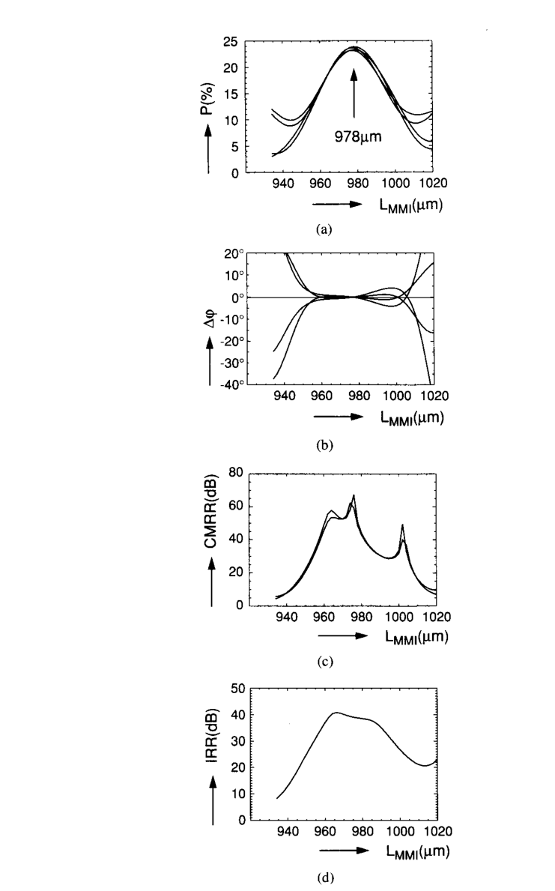

**How to read this figure.** Four plots against the MMI length (940–1020 µm) for the InP 4×4 hybrid. (a) Power in each of the four outputs: all four curves peak together at 978 µm near 25 % (one quarter each) and fall off together. (b) Phase error from perfect 90° spacing: flat near zero over roughly 955–1000 µm. (c) Common mode rejection ratio (how well balanced detection cancels common noise): above 30 dB over about 50 µm. (d) Image rejection ratio: above 30 dB over about 40 µm. Takeaway: balance and phase are robust; length errors cost a little power but not balance. The paper quotes balance better than 0.3 dB over $978 \pm 25$ µm and phase within ±5°.

This robustness is not special to the 4×4 hybrid; it holds for MMIs in general and was confirmed experimentally.

### D. Reflection Properties

Lasers and coherent receivers hate back-reflections. In an MMI, light can reflect from the end wall of the section between the output guides, especially in deeply etched guides where the semiconductor–air step is large. And because of self-imaging, a reflection can be focused very efficiently back into the input. Two mechanisms:

1. **Internal resonance.** Several self-images can occur at once. The general-interference 2×2 3-dB coupler of Fig. 4 has length $3L_\pi/2$, which is exactly *twice* the symmetric self-imaging length $3L_\pi/4$. So light that reflects from the end wall is imaged back, by symmetric interference, onto the front wall, and so on: the MMI acts like a little resonator. In lasers this can show up as an extra feature in the spectrum. Paired-interference couplers avoid this coincidence.
2. **Combiner reflection.** A 1×2 splitter used backwards as a 2×1 combiner needs both inputs equal in amplitude and phase. If the two inputs are 180° out of phase, almost no light reaches the output guide; instead the light piles up on the end wall between them and is imaged straight back into the inputs. So in a Mach–Zehnder modulator with a 2×1 MMI combiner, the "off" state reflects strongly. Using a 2×2 coupler as the combiner avoids this (the "off" light then leaves by the other port).

Remedies: use lower-contrast guides, or taper/angle the ends of the MMI section.

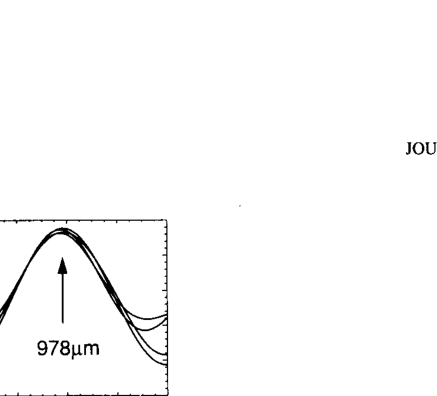

**How to read this figure.** *Note: the image file supplied with this packet is a mis-crop; it shows a fragment of Fig. 8(a) (the 978 µm power peak), not Fig. 9.* The original Fig. 9 shows two calculated field contour plots of the 2×2 3-dB MMI: (a) normal transmission, light entering one port and splitting to the two outputs; (b) the internal resonance, where light reflected from the far end wall is imaged back to both input ports (arrows pointing back left). To picture (b), look at the top panel of the generated self-imaging map: a single centred image forms at $3L_\pi/4$; a section of length $3L_\pi/2$ is exactly two of those, so the end walls image onto each other.

### E. Tolerances

Fabrication tolerance: how much the dimensions can be off. Operation tolerance: how much wavelength, polarization, temperature, input shape and index can change.

**Equation (39): length tolerance.** Treat each image as a Gaussian beam focused at the image plane. If the output guide is at the wrong $z$, the beam is slightly out of focus and couples less well. The length error that costs 0.5 dB is about the beam's **Rayleigh range** (the distance over which a focused beam stays focused):

$$\delta L \simeq \frac{\pi n_r w_0^2}{4\lambda_0}, \tag{39}$$

where $w_0$ is the full $1/e$ amplitude width of the input field. Notice $\delta L$ does **not** depend on the MMI width or length. It depends only on the access-guide spot. Wider access guides (or tapers) give bigger $w_0$ and hence relaxed tolerances, which is why tapered access waveguides are standard.

**Equation (40): converting to other parameters.** From (6), the image length $L \propto n_r W_e^2/\lambda_0$. Take small relative changes (logarithmic derivative):

$$\frac{\delta L}{L} = 2\frac{\delta W_e}{W_e} \simeq \frac{|\delta\lambda_0|}{\lambda_0} \simeq \frac{\delta n_r}{n_r}. \tag{40}$$

The factor 2 on width comes from the square. In words: any change in width, wavelength or index *moves* the image; the device is fine as long as the image moves by less than $\delta L$. So the tolerance on each parameter is $\delta L/L$ times a factor. Short devices therefore tolerate more.

**The paper's example** (Fig. 4 coupler): $W_e \approx 8$ µm, $L = 240$ µm, $n_r = 3.24$, $w_0 \approx 3$ µm, $\lambda_0 = 1.52$ µm.

- $\delta L = \pi \times 3.24 \times 9/(4 \times 1.52) = 91.6/6.08 \approx 15$ µm.
- $\delta W_e = \tfrac{1}{2}W_e\,\delta L/L = 0.5 \times 8 \times 15/240 = 0.25$ µm.
- $\delta\lambda = \lambda_0\,\delta L/L = 1.52 \times 15/240 = 0.095$ µm $= 95$ nm.
- $\delta n_r = n_r\,\delta L/L = 3.24 \times 15/240 = 0.20$.

Width is by far the most critical: 0.25 µm is a small lithography error, while 95 nm of wavelength is huge. A practical trick: make a few lengths in steps of $\delta L$ (220, 235, 250, 265, 280 µm) so at least one pair works well even if the width came out wrong.

**Polarization.** TE and TM have slightly different $n_r W_e^2$, so slightly different image lengths. Pick a length in between to work for both, at a small loss cost (penalties below 0.3 dB were measured).

### Table II (reported tolerances)

| Mechanism | $N\times M$ | Ref. | $n_r$ | $\lambda_0$ (µm) | $w_0$ (µm) | $W_M$ (µm) | $L$ (µm) | Loss penalty (dB) | Imbalance (dB) | $\delta W_M$ (µm) | $2\delta\lambda_0$ (nm) |
|---|---|---|---|---|---|---|---|---|---|---|---|
| General | 2×2 | [19] | 3.24 | 1.52 | 3.0 | 8.0 | 240 | (0.8) | (0.17) | (0.20) | (100) |
| General | 2×2 | [42] | 3.28 | 1.51 | 3.0 | 7.5 | 250 | 0.5 | 0.1 | 0.20 | |
| General | 4×4 | [27] | 3.24 | 1.52 | 3.0 | 21.6 | 945 | (2.0) | | (0.20) | |
| Paired | 2×2 | [41] | 3.29 | 1.53 | 3.0 | 18.0 | 530 | 0.5 | 0.20 | 0.30 | 100 |
| Paired | 2×2 | [43] | 3.30 | 1.51 | 2.2 | 16.0 | 425 | 0.5 | 0.20 | 0.25 | |
| Symmetric | 1×4 | [34] | 3.47 | 1.06 | 2.6 | 40.0 | 1300 | | | (0.25) | |
| Symmetric | 1×4 | [40] | 3.30 | 1.55 | 2.5 | 24.0 | 300 | 0.4 | 0.20 | 0.30 | (60) |

Numbers in brackets are simulations. Read across a row: for each device, the width tolerance is only 0.2–0.3 µm, while the wavelength range is 60–100 nm. (The last column header in the source is printed as "$2\lambda_0$"; it is the total wavelength window, $2\delta\lambda_0$.)

## Worked design: a 1×2 MMI in 220 nm SOI (for Monday 5 Oct)

This section is not in the paper; it applies the paper's recipe ("compute $L_\pi$ with (6), then read the length from Table I") to your Monday task. Do it on paper before opening Meep.

**Step 0 — choose the mechanism.** One input, two equal outputs: **symmetric interference**, centre-fed. From Table I: $L_{1\times2} = 3L_\pi/(4N)$ with $N = 2$, i.e. $L_{1\times2} = 3L_\pi/8$. Outputs at $y = \pm W_e/4$ (equal spacing $W_e/N$), in phase.

**Step 1 — reduce 3-D to 2-D (EIM).** 220 nm Si slab in oxide, TE, 1550 nm: $n_r = 2.845$ (Chrostowski §3.2.2; your Meep evening script uses $\varepsilon = 2.83^2$, i.e. $n_r = 2.83$ — within 0.5 %). Etched regions: oxide, $n_c = 1.444$ (if your Meep cell is air around the MMI, use $n_c = 1.0$; the table below gives both).

**Step 2 — effective width (Eq. 4).** $W_M = 3.0$ µm, $\lambda_0 = 1.55$ µm.

- $\sqrt{n_r^2 - n_c^2} = \sqrt{8.094 - 2.085} = 2.451$; $\lambda_0/\pi = 0.4934$ µm.
- E-field along the side walls ($\sigma = 0$): $W_e = 3.0 + 0.4934/2.451 = 3.201$ µm.
- E-field across the side walls ($\sigma = 1$): $W_e = 3.0 + 0.201 \times (1.444/2.845)^2 = 3.0 + 0.052 = 3.052$ µm.

In Meep 2-D: if your source is $E_z$ (field out of the plane), E is along the walls, $\sigma = 0$. If you use an in-plane field ($H_z$ source, $E_x, E_y$ in-plane), which is what mimics the real SOI TE mode, E is across the walls, $\sigma = 1$.

**Step 3 — beat length (Eq. 6).** For $\sigma = 0$:

$$L_\pi = \frac{4 n_r W_e^2}{3\lambda_0} = \frac{4 \times 2.845 \times 3.201^2}{3 \times 1.55} = \frac{11.38 \times 10.246}{4.65} = \frac{116.6}{4.65} = 25.1\ \mu\text{m}.$$

For $\sigma = 1$: $11.38 \times 3.052^2/4.65 = 11.38 \times 9.315/4.65 = 22.8$ µm.

**Step 4 — image length.**

$$L_{1\times2} = \frac{3L_\pi}{8} = \frac{3 \times 25.1}{8} = 9.4\ \mu\text{m}\ (\sigma = 0), \qquad \frac{3 \times 22.8}{8} = 8.5\ \mu\text{m}\ (\sigma = 1).$$

**Step 5 — port positions.** $y_{out} = \pm W_e/4 = \pm 0.80$ µm ($\sigma = 0$) or $\pm 0.76$ µm ($\sigma = 1$); input at $y = 0$. Centre-to-centre spacing about 1.6 µm. With 0.5-µm output guides that leaves a 1.1 µm gap; with 1.0-µm tapers, 0.6 µm.

**Step 6 — sanity check with exact modes.** Solving the two lowest modes of the 3-µm slab exactly (the snippet below) gives $n_{eff,0} = 2.8347$, $n_{eff,1} = 2.8035$ and $L_\pi = 24.88$ µm ($\sigma = 0$); for $\sigma = 1$, $L_\pi = 22.59$ µm. The closed form is within 1 %, *provided you use $W_e$, not $W_M$*.

| Case | $W_e$ (µm) | $L_\pi$ from Eq. (6) (µm) | $3L_\pi/8$ (µm) | exact-mode $L_\pi$ (µm) | exact $3L_\pi/8$ (µm) |
|---|---|---|---|---|---|
| Ignore penetration ($W_e = W_M$) | 3.000 | 22.0 | 8.26 | — | — |
| Oxide clad, $\sigma = 0$ | 3.201 | 25.1 | 9.41 | 24.9 | 9.33 |
| Oxide clad, $\sigma = 1$ | 3.052 | 22.8 | 8.55 | 22.6 | 8.47 |
| Air clad, $\sigma = 0$ | 3.185 | 24.8 | 9.31 | 24.6 | 9.23 |
| Air clad, $\sigma = 1$ | 3.023 | 22.4 | 8.39 | 22.1 | 8.30 |

**Step 7 — length tolerance (Eq. 39).** Taking the input spot's full $1/e$ amplitude width $w_0 \approx 0.9$ µm: $\delta L \approx \pi \times 2.845 \times 0.81/(4 \times 1.55) = 7.24/6.2 = 1.2$ µm. So a sweep step of 0.25–0.5 µm near 9 µm is needed to find the peak; the schedule's warning that "a 5 µm step will step right over a 9 µm feature" is right.

**Step 8 — width sensitivity (Eq. 40), for Tuesday 6 Oct.** A ±10 nm width error: $\delta L/L = 2 \times 0.010/3.2 = 0.63$ %, i.e. the image moves by about 0.06 µm, small compared with $\delta L \approx 1.2$ µm. Expect a 1×2 MMI to be quite tolerant to width error; the splitting ratio stays 50:50 by symmetry, and you mainly lose a little total power.

!!! note "Two corrections to the schedule's numbers"
    1. **Use the slab effective index, not bulk silicon.** The schedule's example uses $n_r = 3.47$ and gets $L_\pi = 4 \times 3.47 \times 9/(3 \times 1.55) = 26.9$ µm. But in the EIM, $n_r$ is the effective index of the 220 nm slab, about 2.845. With $n_r = 3.47$ an exact two-mode solve gives about 29.6 µm (oxide or air cladding), not 24.8 µm. The quoted "exact" 24.8 µm instead matches what you get with $n_r \approx 2.845$ (24.6–24.9 µm). So: hand-compute with $n_r = 2.845$ (or 2.83 to match your Meep $\varepsilon$), and include $W_e$.
    2. **Which mechanism is which.** The $3L_\pi/8$ device (centre-fed) is *symmetric* interference, one of the two restricted mechanisms; the coefficient is confirmed by Table I. An input at $\pm W/6$ is *paired* interference, which gives a two-fold image at $L_\pi/2 \approx 12.5$ µm (and also, being an image of general interference too, at $3L_\pi/2 \approx 37$ µm). A general-interference 1×2 needs an off-centre input and then gives two outputs at $\pm y_{in}$ at $3L_\pi/2$.

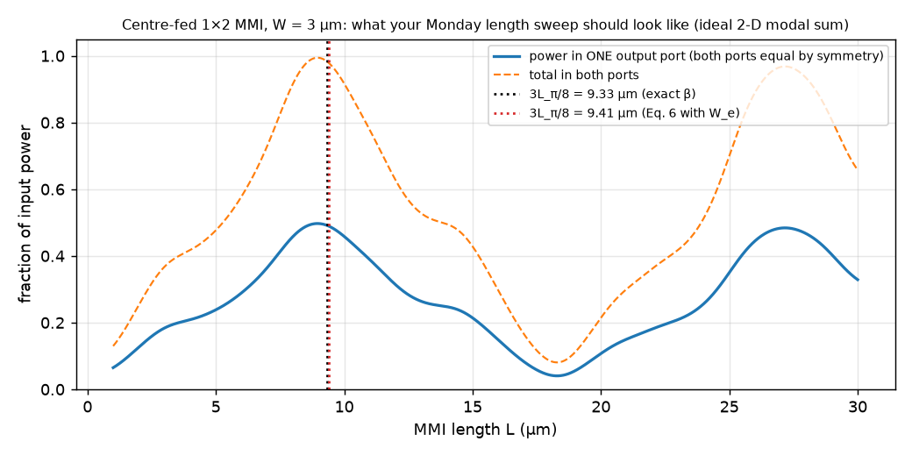

**How to read this figure.** This is the ideal 2-D version of your Monday sweep, computed by the modal sum for a centre-fed 3-µm section: the solid curve is the power coupled into one Gaussian output spot at $y = +W_e/4$ (the other port is identical by symmetry), the dashed curve is the total. The peak is at about 9.0 µm with 49.7 % per port, about 4 % shorter than $3L_\pi/8 = 9.33$ µm (the phase error of Section VI-B). The peak is broad, about ±1 µm, matching the $\delta L$ estimate. A real Meep run will show lower peak power (mode mismatch, reflections) but the same shape. Your EXIT ("simulated $L_{MMI}$ within 10 % of the hand calculation") should be comfortably met if you use $W_e$ and the right $\sigma$.

### Runnable check (numpy only)

```python
import numpy as np
lam, W, nr, nc = 1.55, 3.0, 2.845, 1.444      # um, um, slab n_eff (220 nm Si TE), oxide
k0 = 2*np.pi/lam

for sigma in (0, 1):                          # 0: E along side walls, 1: E across them
    We = W + (lam/np.pi)*(nc/nr)**(2*sigma)/np.sqrt(nr**2 - nc**2)   # Eq. (4)
    Lpi = 4*nr*We**2/(3*lam)                                          # Eq. (6)

    # exact symmetric-slab modes: w = r*u*tan(u) (even), w = -r*u*cot(u) (odd)
    a, r = W/2, (nc/nr)**(2*sigma)
    V = k0*a*np.sqrt(nr**2 - nc**2)
    def root(nu):                             # bisection in u in (nu*pi/2, (nu+1)*pi/2)
        f = (lambda u: r*u*np.tan(u)) if nu % 2 == 0 else (lambda u: -r*u/np.tan(u))
        g = lambda u: f(u) - np.sqrt(V**2 - u**2)
        lo, hi = nu*np.pi/2 + 1e-9, min((nu+1)*np.pi/2, V) - 1e-9
        for _ in range(100):
            mid = (lo + hi)/2
            lo, hi = (mid, hi) if g(lo)*g(mid) > 0 else (lo, mid)
        return np.sqrt((k0*nr)**2 - (lo/a)**2)          # beta
    b0, b1 = root(0), root(1)
    Lpi_ex = np.pi/(b0 - b1)
    print(f"sigma={sigma}: We={We:.3f} um  Lpi(Eq.6)={Lpi:.2f} um  Lpi(exact)={Lpi_ex:.2f} um")
    print(f"   1x2 symmetric MMI: L = 3Lpi/8 = {3*Lpi/8:.2f} (formula), {3*Lpi_ex/8:.2f} (exact) um;"
          f" outputs at +/-{We/4:.2f} um")
```

**What you should see:** for $\sigma = 0$, $W_e = 3.201$, $L_\pi$ = 25.08 (formula) and 24.88 (exact), $L = 9.41$ / 9.33 µm, outputs at ±0.80 µm. For $\sigma = 1$, $W_e = 3.052$, $L_\pi$ = 22.79 / 22.59, $L = 8.55$ / 8.47 µm. Change `nc` to 1.0 for an air-clad Meep cell, or `nr` to 2.83 to match your $\varepsilon$.

## VII. Applications

Besides being couplers on their own, MMIs were already being used inside bigger circuits. An early example: an electro-optic MMI switch in lithium niobate (LiNbO$_3$) which changed the index pattern inside the multimode section to steer the image, combining "coupler" and "phase shifter" in one device (0.5 dB loss, 13–20 dB extinction). Most later work used MMIs as building blocks in larger circuits, in many materials.

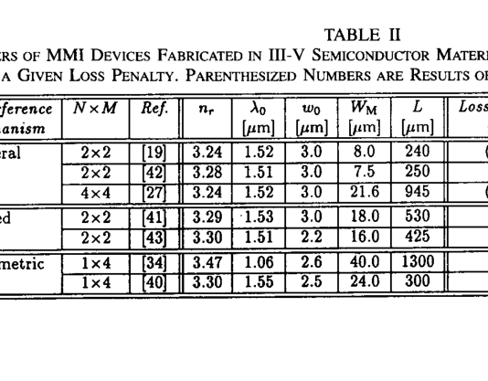

**How to read this figure.** *Note: the image file supplied with this packet is a mis-crop; it shows the top of Table II, not Fig. 10.* The original Fig. 10 is a 3-D sketch of an InP chip (an **OEIC**, opto-electronic integrated circuit): the signal and a local-oscillator laser enter, are mixed in an MMI 3-dB coupler, pass through tapers and vertical couplers, and land on two pairs of PIN photodiodes, one pair for each polarization. The table rows visible in the file are reproduced in full as Table II above.

### A. Coherent Receiver Front-End

A **coherent receiver** mixes the incoming signal with a local laser (the **local oscillator**, LO) to recover phase information. This chip used an MMI 3-dB coupler to combine signal and LO, followed by two pairs of polarization-sensitive photodiodes, giving a polarization-insensitive output (**polarization diversity**). The MMI helped in several ways:

- **Size.** The coupler was only 298 µm long and worked with deeply etched guides, allowing tight 250-µm bends; the whole chip was 1.3 mm.
- **Balance.** Outputs balanced within ±0.11 dB for both polarizations, giving a **common mode rejection ratio** (how well the balanced detectors cancel noise common to both arms, e.g. LO intensity noise) of 32 dB or better.
- **Polarization insensitivity.** Essential here, since polarization is separated only *after* the coupler. The same chip also works for phase-diversity detection (tested at 2.5 Gbit/s).
- **Wavelength insensitivity.** Expected operating range about 70 nm.

### B. Mach–Zehnder Structures

Mach–Zehnder interferometers (MZIs) split light, shift the phase in one arm, and recombine. Their extinction ratio is limited by the splitter and combiner imbalance. The paper's example: 0.2 dB imbalance limits extinction to about −33 dB. (Check: 0.2 dB is a power ratio $10^{0.02} = 1.047$. If the splitter and combiner errors add up, the two paths reaching the dark port carry powers in the ratio 1.047, so they cannot cancel completely; the leftover at the dark port is $[(1.047 - 1)/(1.047 + 1)]^2 = (0.047/2.047)^2 = 5.3\times10^{-4}$, i.e. $-32.8$ dB.) Phase errors in the couplers make it worse, or must be compensated with an extra bias voltage.

Because MMIs are well balanced, have stable phases near the optimum length, and are polarization-insensitive, they are ideal MZI couplers. Examples: a passive polarization splitter made of two 3-dB MMIs in an MZI (extinction better than −16 dB TE and −13 dB TM over 60 nm); electro-optic MZI switches in III-V materials with −10 to −19 dB extinction; MZIs with MMIs in hollow waveguides at 10.6 µm.

**Generalized MZIs.** A 1×N (or N×N) MMI splits the light into N arms, each arm has its own phase shifter, and an N×N MMI recombines. By setting the N phases you can route the light to any chosen output (not fully independently for several inputs). Demonstrated: 1×10 (10.6 mm) and 10×10 (13.1 mm) switches in GaAs/AlGaAs (±9 % uniformity, −10 dB crosstalk, about 6 dB excess loss) and a polarization-insensitive 1×4 switch in InP (−13 dB crosstalk).

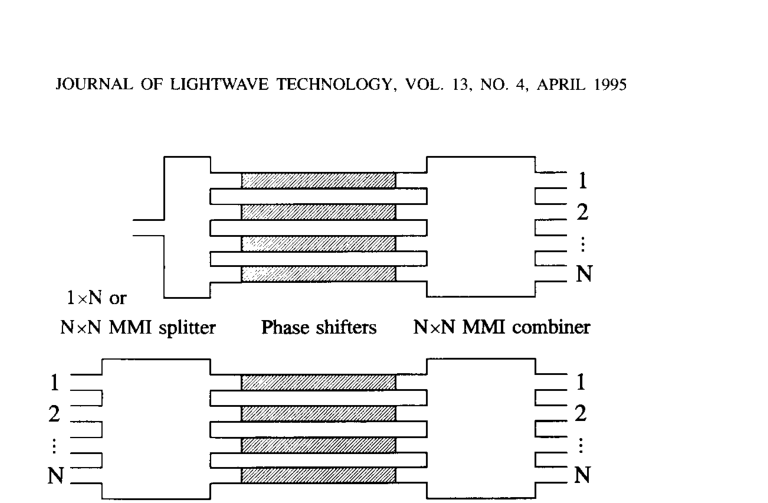

**How to read this figure.** Top: a 1×N version — one input, an MMI splitter, N parallel arms each with a shaded phase-shifter section, and an N×N MMI combiner with outputs 1 to N. Bottom: the N×N version with N inputs. Takeaway: MMIs make multi-way splitting and recombining possible in one step each, which would need a tree of many 2×2 couplers otherwise.

### C. Ring Lasers

A ring laser needs an **outcoupler**: a device that lets some light out of the ring. Because the outcoupler is part of the cavity, its behaviour directly affects the laser. Options:

- **Y-junction:** easy, but only couples out one of the two directions of travel.
- **Directional coupler:** hard to use with the high-contrast guides needed for small low-loss bends.
- **MMI:** symmetric outcoupling of both directions, relaxed tolerances, easy design, works with high-contrast guides.

Results: InP ring lasers with MMI 3-dB outcouplers ($L = 233$ µm, bends of 150 µm radius) at about 1.6 µm, efficiency 3.9 %, raised to 5.2 % by an extra MMI combining both directions into one output, side-mode suppression 35 dB. Occasional mode hops were traced to reflections, including the MMI reflections of Section VI-D. GaAs/AlGaAs ring lasers with low-contrast guides and MMI outcouplers reached 7 % efficiency at 0.87 µm. Comparing outcouplers, the key factor is how **stable the splitting ratio** is when current, temperature, wavelength and carrier density change. MMIs win because their splitting ratio is so stable.

## VIII. Conclusion

MMI devices can do many $N \times M$ coupling jobs with insertion loss below 0.5 dB, crosstalk down to −30 dB and balance within 0.2 dB, and they tolerate process and operating variations. That is why they spread quickly into receivers, MZIs and ring lasers.

### Table III (comparison with other couplers)

| Device | Ref. | In × out | Material | Excess loss (dB) | Imbalance (dB) | Bandwidth (nm) | Pol. penalty (dB) | Size |
|---|---|---|---|---|---|---|---|---|
| Y-junction | [63] | 1×2 | GaAs/GaAlAs | 2.0–6.0 | 0.1–0.5 | large | low | < 6° |
| X-junction | [64] | 2×2 | LiNbO$_3$ | < 1.0 | > 20 | large | low | > 6° |
| Parallel (directional) coupler | [65] | 2×2 | Silica | 0.1–0.2 | 0.6 | 200 | 0.3 | 4 mm |
| TMI coupler | [66] | 2×2 | InGaAsP/InP | 1.0–3.0 | 0.1 | 15 | | 400 µm |
| MMI coupler | [19] | 2×2 | InGaAsP/InP | 0.1–0.3 | < 0.05 | (100) | 0.2 | 240 µm |
| MMI coupler | [41] | 2×2 | InGaAsP/InP | 0.3–0.6 | < 0.1 | 80–100 | 0.3 | 530 µm |
| Tree coupler | [67] | 1×16 | InGaAsP/InP | 2.0–3.0 | 2.6–4.0 | | < 1.0 | ~1 mm |
| MMI splitter | [34] | 1×2 … 20 | GaAs/AlGaAs | ~0 | 0.35 | | | N × 120 µm |
| MMI splitter | [39] | 1×4 | InGaAsP/InP | 0.1 | 0.1 | (60) | | 300 µm |
| MMI splitter | [42] | 1×16 | InGaAsP/InP | 2.2 | 1.5 | | 0.4 | 140 µm |
| Star coupler | [68] | 19×19 | Silica | 1.5 | 2.0 | | | 7.5 mm |
| Star coupler | [69] | 8×8 | Silica | 1.4–1.7 | 1.3–1.5 | 200 | 0.3 | 1.5 mm |
| MMI coupler | [26] | 4×4 | InGaAsP/InP | 1.0 | 0.3–0.9 | | 0.2 | 945 µm |
| MMI coupler | [56] | 10×10 | GaAs/AlGaAs | ≤ 3.0 | 0.1–0.2 | | | 3270 µm |

(Bracketed numbers are simulations. For junctions, "size" is the branching angle.) Read it as a rough comparison only: the devices use different materials and wavelengths. The MMI rows stand out for low imbalance and compact size.

Other, non-numeric advantages the authors list:

1. **Easy design:** compute $L_\pi$ with Eq. (6), read the length from Table I. Done.
2. **No cascading needed:** one MMI gives a balanced 1-to-N split, instead of a tree of 1×2s (at some cost in bandwidth, since longer devices are more wavelength-sensitive by Eq. 40).
3. **Works with any guide type:** weakly guiding or deeply etched, almost independent of the vertical structure.

New ideas in 1995: a 1×1 symmetric MMI as a filter that removes the unwanted first-order (odd) mode of a guide; tapered MMIs as field transformers between guides of different widths; restricted mechanisms giving uneven splits such as 28/72 or 15/85; and MMIs with up-down tapered sections whose splitting ratio can be chosen freely within a few percent (useful as "tap" couplers).

The authors expect self-imaging to be used more and more in integrated optics. (They were right: MMIs are now in every silicon photonics PDK.)

### About the authors


**Lucas B. Soldano** (born Buenos Aires, 1960) studied electronics engineering in Buenos Aires and did his PhD at Delft University of Technology (1994) on passive devices based on multimode interference; he then moved to CSELT in Turin.

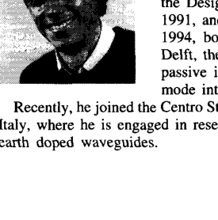

**Erik C. M. Pennings** (born Sassenheim, 1960) studied applied physics in Groningen, did his PhD at Delft (1990) on waveguide bends and MMI couplers, worked at Bellcore on InP circuits including the coherent receiver of Fig. 10, and then joined Philips Research.

(These are just portrait photographs from the journal page; nothing to read in them.)

## How this connects to your project

The MMI is your first "real" device for robust design. Its performance is set almost entirely by one number, $\beta_0 - \beta_1$, which depends on the width squared (Eq. 40: $\delta L/L = 2\,\delta W/W$). That gives you a clean, analytic baseline for the fabrication-variation work that starts on Tuesday 6 Oct: you can predict how a ±10 nm width or thickness change moves the image, then check it against Meep and a Monte-Carlo yield run. Section VI-C's message, that an MMI loses power but keeps its balance when the length is off, is exactly the kind of "flat optimum" an inverse-design robustness objective tries to create on purpose. The modal-sum method used to make this page's figures is also a fast, cheap surrogate: thousands of evaluations per second, useful to sanity-check a learned surrogate or to warm-start an inverse design from a textbook MMI.

!!! warning "Common confusions"
    - **$n_r$ is not the silicon index.** In the 2-D model, $n_r$ is the *effective index* of the vertical slab (≈ 2.845 for 220 nm SOI TE), not 3.47.
    - **$W_e$ is not $W_M$.** Forgetting the penetration correction makes $L_\pi$ about 10–14 % too short for a 3 µm SOI MMI, which alone could break the "within 10 %" EXIT.
    - **$L_\pi$ here is the two-lowest-mode beat length of the wide section**, not the coupling length of a directional coupler (although the definition is the same).
    - **"Restricted" is not one mechanism.** It covers paired (inputs at $\pm W_e/6$, lengths in units of $L_\pi$) and symmetric (centre input, lengths in units of $3L_\pi/4$).
    - **Mirrored vs direct:** at odd multiples of $3L_\pi$ the image is flipped about the centre line (cross state); at even multiples it is in place (bar state).
    - **The formula lengths are slightly too long.** Real images form a few percent earlier because of the quadratic approximation. Always finish with a sweep.
    - **A 1×2 MMI used backwards** (as a combiner) reflects strongly when the inputs are out of phase.

## Check yourself

**1. Derive $L_\pi \approx 4n_rW_e^2/(3\lambda_0)$ from $k_{y\nu}^2 + \beta_\nu^2 = k_0^2n_r^2$.**

??? note "Answer"
    $\beta_\nu \approx k_0n_r - k_{y\nu}^2/(2k_0n_r)$ with $k_{y\nu} = (\nu+1)\pi/W_e$ gives $\beta_\nu \approx k_0n_r - (\nu+1)^2\pi\lambda_0/(4n_rW_e^2)$. Then $\beta_0 - \beta_1 = 3\pi\lambda_0/(4n_rW_e^2)$, and $L_\pi = \pi/(\beta_0 - \beta_1) = 4n_rW_e^2/(3\lambda_0)$.

**2. Why is the image at $3L_\pi$ mirrored and the one at $6L_\pi$ direct?**

??? note "Answer"
    At $L = p\,3L_\pi$ mode $\nu$ gains phase $\nu(\nu+2)p\pi$. For $p = 2$ every phase is a multiple of $2\pi$: direct copy. For $p = 1$, $\nu(\nu+2)$ is odd for odd $\nu$, so odd modes flip sign; flipping the odd part of a field is the same as mirroring it about the centre.

**3. A general-interference coupler has $L_\pi = 100$ µm. Where are the 3-dB and cross lengths?**

??? note "Answer"
    3-dB (two-fold image): $\tfrac{1}{2}(3L_\pi) = 150$ µm. Cross (mirrored single image): $3L_\pi = 300$ µm. Bar: 600 µm.

**4. What are the amplitudes and relative phase of the two images at $\tfrac{3}{2}L_\pi$?**

??? note "Answer"
    From Eq. (21) with $p = 1$: coefficients $(1-j)/2$ and $(1+j)/2$, each of magnitude $1/\sqrt{2}$ (half power each), at −45° and +45°: they are 90° apart (quadrature).

**5. Why does feeding at $y = \pm W_e/6$ suppress modes 2, 5, 8?**

??? note "Answer"
    Those modes have $(\nu+1)$ a multiple of 3, so $\sin[(\nu+1)\pi(y + W_e/2)/W_e]$ is zero at $y = \pm W_e/6$ and is odd about that point. A symmetric input centred there has zero overlap with an odd function, so $c_\nu = 0$.

**6. Why does centre-feeding shorten the imaging length by a factor of 4?**

??? note "Answer"
    A symmetric input at the centre excites only even modes. For even $\nu$, $\nu(\nu+2)$ is a multiple of 4, so the phase factor $\exp[j\nu(\nu+2)\pi L/(3L_\pi)]$ repeats when $L$ increases by $3L_\pi/4$ instead of $3L_\pi$.

**7. Compute the length and output positions of a centre-fed 1×2 MMI, $W_M = 3$ µm, $n_r = 2.845$, $n_c = 1.444$, $\lambda_0 = 1.55$ µm, $\sigma = 0$.**

??? note "Answer"
    $W_e = 3 + 0.4934/2.451 = 3.201$ µm. $L_\pi = 4 \times 2.845 \times 3.201^2/(3 \times 1.55) = 25.1$ µm. $L = 3L_\pi/8 = 9.4$ µm. Outputs at $\pm W_e/4 = \pm 0.80$ µm. (Exact modes give 9.33 µm; a modal-sum sweep peaks near 9.0 µm.)

**8. If the MMI width doubles, what happens to its length? To its width tolerance in absolute terms?**

??? note "Answer"
    $L \propto W_e^2$, so the length quadruples. $\delta L$ (Eq. 39) does not change, so $\delta L/L$ drops by 4; and $\delta W_e = \tfrac{1}{2}W_e\,\delta L/L$ halves. Wider MMIs are longer and *less* tolerant to width errors.

**9. Why does an MMI stay balanced when its length is slightly wrong, while a directional coupler does not?**

??? note "Answer"
    In a directional coupler the outputs vary as $\cos^2$ and $\sin^2$ of length, steepest and opposite at the 3-dB point. In an MMI each output image is at a local maximum at the right length, so all outputs fall together and roughly equally for small errors.

**10. In the paper's example, $\delta L = 15$ µm and $L = 240$ µm. Which tolerance is tightest: width, wavelength, or index?**

??? note "Answer"
    $\delta L/L = 0.0625$. Width: $\delta W_e = 0.5 \times 8 \times 0.0625 = 0.25$ µm. Wavelength: $1.52 \times 0.0625 = 95$ nm. Index: $3.24 \times 0.0625 = 0.20$. The 0.25 µm width tolerance is the hardest to guarantee in fabrication.

**11. What is the "internal resonance" of a general-interference 2×2 3-dB MMI?**

??? note "Answer"
    Its length $3L_\pi/2$ is exactly twice the symmetric self-imaging length $3L_\pi/4$, so light reflected from the end wall is imaged back onto the front wall, and the section acts like a small resonator, sending reflections back into the inputs.

**12. Estimate the resolution of the 3-µm SOI MMI and say whether it matters.**

??? note "Answer"
    It supports $m = 10$ modes, so $\rho \approx W_e/m \approx 0.32$ µm (0.29–0.48 µm with the refined factors). The access-guide spot is 0.5–1 µm, so the MMI can resolve it easily; resolution is not the limiting factor in high-contrast SOI.

## Key takeaways

- An MMI is a wide waveguide section; the input is split into its modes, the modes drift in phase, and at special lengths they rebuild the input as one or several images (self-imaging).
- In a step-index guide $\beta_0 - \beta_\nu \approx \nu(\nu+2)\pi/(3L_\pi)$, with $L_\pi = \pi/(\beta_0 - \beta_1) \approx 4n_rW_e^2/(3\lambda_0)$. Length scales with width squared.
- General interference (any input): mirrored image at $3L_\pi$, direct at $6L_\pi$, $N$-fold at $3L_\pi/N$; the 2×2 3-dB coupler at $3L_\pi/2$ has outputs in quadrature.
- Paired interference (inputs at $\pm W_e/6$): everything 3 times shorter, $L_\pi/N$.
- Symmetric interference (centre input): 4 times shorter, $3L_\pi/(4N)$; the **1×2 splitter is at $3L_\pi/8$**, outputs at $\pm W_e/4$, in phase.
- For a 3-µm, 220 nm SOI MMI: $W_e \approx 3.05$–$3.20$ µm, $L_\pi \approx 22.8$–$25.1$ µm, $L_{1\times2} \approx 8.5$–$9.4$ µm depending on polarization; real images form a few percent earlier. Sweep in ≤ 0.5 µm steps.
- MMIs keep their balance when the length is off; they are tolerant to wavelength and polarization, and most sensitive to width ($\delta L/L = 2\delta W/W$).
- Watch for reflections: internal resonance in general 2×2 couplers and back-reflection from 2×1 combiners driven out of phase.

## Glossary

| Term | Plain meaning |
|---|---|
| MMI (multimode interference) coupler | A wide waveguide section with narrow access guides that splits or combines light by self-imaging |
| Self-imaging | A multimode guide rebuilding its input field as one or more copies at regular distances |
| Talbot effect | Self-imaging of a periodic grating in free space, the 1836 ancestor of MMI imaging |
| Mode | A field shape across a waveguide that keeps its shape while travelling |
| Mode number $\nu$ | Label of a mode; equals its number of zero crossings |
| Even / odd mode | Mode that is unchanged / sign-flipped by mirroring about the centre line |
| Multimode waveguide | A guide wide enough to carry several modes |
| Access waveguide | Narrow (usually single-mode) guide that feeds or collects light at the MMI ends |
| $N \times M$ coupler | Device with $N$ inputs and $M$ outputs |
| Propagation constant $\beta$ | Phase gained per unit length by a mode; $\beta = k_0 n_{eff}$ |
| Free-space wavenumber $k_0$ | $2\pi/\lambda_0$; phase per unit length in vacuum |
| Lateral wavenumber $k_{y\nu}$ | How fast mode $\nu$ wiggles across the guide |
| Effective index $n_{eff}$ | Index that describes how fast a mode's phase travels |
| Ridge index $n_r$ / cladding index $n_c$ | (Effective) index inside / outside the multimode section in the 2-D model |
| Effective index method (EIM) | Reducing a 3-D guide to 2-D by replacing the vertical structure with its slab effective index |
| Spectral index method (SIM) | A more accurate 3-D-to-2-D reduction for rib guides |
| Effective width $W_e$ | Physical width plus the small extra width the mode feels from its evanescent tails |
| Goos–Hänchen shift | Small sideways shift of a totally reflected beam, as if reflected slightly outside the wall |
| Evanescent tail | Part of a mode's field that decays exponentially outside the core |
| Beat length $L_\pi$ | Distance over which the two lowest modes slip by $\pi$ in phase |
| Dispersion relation | Equation linking $\beta$, $k_y$ and $k_0 n_r$ |
| Binomial approximation | $\sqrt{1-x} \approx 1 - x/2$ for small $x$ |
| Modal propagation analysis (MPA) | Decompose into modes, advance each with its own phase, add up |
| Overlap integral | Integral of input times mode, giving the mode's weight |
| Excitation coefficient $c_\nu$ | Weight of mode $\nu$ in the input field |
| Orthogonality | Different modes have zero overlap with each other |
| Radiation modes | Unguided fields that leak away; ignored for smooth inputs |
| Spatial spectrum | The range of sideways wavenumbers contained in a field |
| Mode phase factor | $\exp[j\nu(\nu+2)\pi L/(3L_\pi)]$, which decides the shape at length $L$ |
| Direct image | Copy of the input at the same position (bar state) |
| Mirrored image | Copy of the input flipped about the centre line (cross state) |
| Bar / cross coupler | Coupler sending light straight through / to the opposite side |
| General interference | Self-imaging that works for any input; lengths in units of $3L_\pi$ |
| Restricted interference | Self-imaging that needs some modes unexcited; covers paired and symmetric |
| Paired interference | Inputs at $\pm W_e/6$ so modes 2, 5, 8... are absent; lengths in units of $L_\pi$ |
| Symmetric interference | Centre input so odd modes are absent; lengths in units of $3L_\pi/4$ |
| Two-mode interference (TMI) | Coupler where only modes 0 and 1 interfere; simplest paired case |
| $N$-fold image | $N$ copies of the input, each with $1/N$ of the power |
| Quadrature | Two signals 90° apart in phase |
| 3-dB coupler | Coupler that splits power 50/50 |
| 90° hybrid | 4-port mixer giving outputs in phase quadrature, used in coherent receivers |
| Imbalance | Ratio of largest to smallest output power, in dB |
| Excess / insertion loss | Total power lost in the device, in dB |
| Extinction ratio / crosstalk | Power reaching a port that should be dark, relative to the bright port |
| Common mode rejection ratio (CMRR) | How well balanced detection cancels noise common to both arms |
| Image rejection ratio (IRR) | How well a receiver suppresses the unwanted mirror frequency band |
| Imaging quality | How faithfully the input is rebuilt at the image |
| Line-spread function (LSF) | The image of an infinitely thin input line; measures sharpness and ripple |
| Resolution $\rho$ | Narrowest image the section can form, about $W_e/m$ |
| Aberration | Blurring because not all components focus at exactly the same place |
| Rayleigh range | Distance over which a focused beam stays nearly focused; sets $\delta L$ |
| Gaussian beam waist $w_0$ | Width of the input spot (here the full $1/e$ amplitude width) |
| Length tolerance $\delta L$ | Length error giving a 0.5 dB loss penalty |
| Internal resonance | Reflection mechanism where the MMI's end walls image onto each other |
| Local oscillator (LO) | The receiver's own laser, mixed with the signal in coherent detection |
| Coherent receiver | Receiver that mixes signal with a local laser to recover phase |
| Polarization diversity | Handling both polarizations separately so the output does not depend on input polarization |
| OEIC | Opto-electronic integrated circuit: optics and electronics on one chip |
| Mach–Zehnder interferometer (MZI) | Splitter, two arms, combiner; output set by the arm phase difference |
| Generalized MZI | MZI with $N$ arms using 1×N / N×N MMIs, used as a multiway switch |
| Outcoupler | Device that lets part of the light out of a ring laser |
| Y-junction / X-junction | Fork-shaped splitter / crossing-shaped 2×2 coupler |
| Star coupler / tree coupler | Free-space-region N×N splitter / cascade of 1×2 splitters |
| Directional coupler | Two parallel guides exchanging power through their evanescent tails |
| PDK | Process design kit: the foundry's library of verified components |
