# Week 2 · Day 6 — Saturday 3 Oct 2026 · Bogaerts 2012 (silicon microrings)

*Simple-English study version of W. Bogaerts, P. De Heyn, T. Van Vaerenbergh, K. De Vos, S. K. Selvaraja, T. Claes, P. Dumon, P. Bienstman, D. Van Thourhout and R. Baets, "Silicon microring resonators", Laser & Photonics Reviews 6(1), 47–73 (2012)*

---

!!! abstract "Today's slot"
    **Saturday 3 Oct 2026, 08:00–12:00 (4 h).** *"Bogaerts 2012 ring-resonator review note, then a Meep 2-D ring: extract Q and FSR."*

    **EXIT:** a ring spectrum and its Q written into `sim-log.md`; `paper-notes/2012-bogaerts-rings.md` filed.

    The schedule splits the block like this:

    - **08:00–09:30, read.** Pull out exactly three things: (1) the all-pass transfer function; (2) the Q bookkeeping $1/Q_L = 1/Q_i + 1/Q_c$, with critical coupling at $Q_i = Q_c$; (3) $\text{FSR} = \lambda^2/(n_g L_{rt})$ with $L_{rt} = 2\pi R$.
    - **09:30–12:00, simulate.** A 2-D Meep ring (start from `examples/ring.py`), radius 5 µm, width 0.5 µm. Use Harminv to get the resonances; its printed columns are `frequency, imag. freq., Q, |amp|, amplitude, error`, so **Q is column 3**. Sweep the bus gap from 0.1 to 0.4 µm. The expected FSR for $R = 5$ µm and $n_g = 4.2$ is about **18.2 nm**. The expected Q for a 200 nm gap is $10^4$–$10^5$.
    - **Gotchas from the schedule:** Q is $f_{res}/\Delta f_{FWHM}$ measured in *frequency*. The gap is only a few pixels at resolution 20, so use resolution ≥ 30. A Q of $10^4$ needs about $10^4$ optical periods to ring down, so let Harminv do the work.

    **After reading this page you should be able to:** derive the all-pass and add-drop transfer functions from scratch; explain FSR, group index, FWHM, finesse, Q (loaded and intrinsic) and extinction ratio; tell under-, critical and over-coupling apart from a spectrum; and pull Q and FSR out of a simulated or measured spectrum.

    **This paper comes back later:**

    - **Mon 19 Oct 2026 (week 5).** Morning: Chrostowski §4.4, the all-pass ring. The book leaves the detail on critical coupling and on intrinsic versus loaded Q to this review. EXIT: write down the critical-coupling condition and explain it in one sentence. Evening: a Meep 2-D all-pass ring where you **sweep the gap to find critical coupling**. EXIT: extinction above 20 dB at one gap, and Q extracted and logged.
    - (Next day, Tue 20 Oct: the add-drop transfer functions are derived by hand and checked in Meep. Section 2.2 below prepares you for that.)

## Before you start: the big picture

A **ring resonator** is a waveguide bent round into a closed loop, placed right next to a straight waveguide. Light going along the straight waveguide leaks a little into the loop. Inside the loop it goes round and round. After every lap it meets the newly arriving light. If one lap is exactly a whole number of wavelengths, the old light and the new light are in step. They add up, and a lot of light builds up in the ring. At any other wavelength they are out of step, and almost nothing builds up.

Think of pushing a child on a swing. If you push once per swing, at the right moment, the swing goes higher and higher. If you push at random times, nothing much happens. The ring "swings" only at its own special wavelengths, called **resonances**.

Seen from the straight waveguide, these resonances show up as narrow dips in the transmitted light. A ring is therefore a very compact **wavelength filter**. The same narrow dips also make it a very sensitive **sensor**: anything that changes the ring a tiny bit moves the dips. Pushed electrically, the ring becomes a **modulator**.

Silicon is special because its light-guiding wires are tiny and can bend very tightly, down to a few µm radius. So silicon rings are tiny, and the dips are far apart (tens of nm). That is great for filters. The catch is that the same tiny wires are extremely sensitive to nanometre-sized fabrication errors. This review covers the theory, the silicon-specific problems, measurements from the Ghent/imec group, and the main applications.

## Background you need

### Waves, phase and interference

Light is an oscillating electric field. At a fixed point it oscillates like $\cos(\omega t)$. Along a waveguide it also oscillates in space. The field picks up **phase** (how far round the oscillation cycle it is, measured in radians) as it travels:

$$E(z) = E_0 e^{i\beta z}.$$

Here $\beta$ is the **propagation constant**: radians of phase per µm travelled. We use complex numbers $e^{i\theta} = \cos\theta + i\sin\theta$ because adding waves then becomes plain adding of complex numbers. The real power is $|E|^2$.

**Interference:** when two waves of the same wavelength meet, you add their complex fields. If their phases agree (difference $0, 2\pi, 4\pi, \dots$), the sizes add: **constructive** interference. If they differ by $\pi$, they cancel: **destructive** interference.

### Effective index and propagation constant

A guided mode travels as if in a uniform material of index $n_{\text{eff}}$, the **effective index**. Then

$$\beta = \frac{2\pi n_{\text{eff}}}{\lambda}.$$

For a 450 × 220 nm silicon wire at 1550 nm, $n_{\text{eff}} \approx 2.4$ (TE).

### Group index: the "speed of the envelope"

$n_{\text{eff}}$ itself changes with wavelength (**dispersion**). The **group index**

$$n_g = n_{\text{eff}} - \lambda \frac{dn_{\text{eff}}}{d\lambda}$$

tells you how fast a *pulse* (an envelope of many wavelengths) travels: $v_g = c/n_g$. In silicon wires $dn_{\text{eff}}/d\lambda$ is negative and large, so $n_g \approx 4.2$–$4.3$, almost twice $n_{\text{eff}}$. As you will see, everything about the *spacing* and *width* of ring resonances uses $n_g$, not $n_{\text{eff}}$. This is the single most common mistake in ring calculations.

### Directional coupler: the "door" into the ring

Two waveguides placed a few hundred nm apart swap light through their **evanescent tails** (the part of each mode that sticks out of the silicon). This is a **directional coupler**. You met coupled-mode theory on Tuesday (Yariv 1973). For the ring we only need its input–output summary. If $E_1, E_2$ go in and $E_3, E_4$ come out:

$$\begin{pmatrix}E_3\\E_4\end{pmatrix} = \begin{pmatrix} r & i\kappa\\ i\kappa & r\end{pmatrix}\begin{pmatrix}E_1\\E_2\end{pmatrix}.$$

- $r$ = **self-coupling** (field amplitude that stays in its own waveguide).
- $\kappa$ = **cross-coupling** (field amplitude that hops across). The paper writes $k$ in the text and $\kappa$ in the figure. Same thing.
- The $i$ means the crossed light gets a 90° phase shift. This is what makes a lossless coupler conserve energy.
- No loss in the coupler means $r^2 + \kappa^2 = 1$. So $r^2$ and $\kappa^2$ are the power fractions that stay and that cross.

A wider **gap** gives weaker coupling: smaller $\kappa$, $r$ closer to 1.

### Loss per round trip, and decibels

Waveguides lose a little light, through scattering from rough sidewalls and similar effects. Loss is quoted in **dB/cm**. The power after length $L$ is $P = P_0 e^{-\alpha L}$, where $\alpha$ is the **power attenuation coefficient**. Converting:

$$\alpha\,[1/\text{cm}] = \frac{\text{loss in dB/cm}}{10\log_{10}e} = \frac{\text{dB/cm}}{4.343}.$$

The **field** decays half as fast, so the field amplitude left after one lap is

$$a = e^{-\alpha L/2}, \qquad a^2 = e^{-\alpha L}.$$

*Worked example.* Take a ring with $R = 5$ µm, so $L = 2\pi R = 31.4$ µm $= 3.14\times10^{-3}$ cm. With 3 dB/cm loss, $\alpha = 0.69$/cm, so $\alpha L = 2.2\times10^{-3}$ and $a = 0.99892$. The ring loses only about 0.2 % of its power per lap. That is why light can circulate thousands of times.

### Resonance, linewidth and Q in one picture

Any resonator (a guitar string, a wine glass, an LC circuit) has two key numbers. One is *where* it rings (the resonant frequency). The other is *how long* it rings before the energy leaks away. A long ring-down gives a narrow peak in the spectrum. The **quality factor** Q measures this:

$$Q = \frac{f_{res}}{\Delta f_{FWHM}} = \frac{\lambda_{res}}{\Delta\lambda_{FWHM}} \approx 2\pi \times (\text{number of oscillations before the energy drops to } 1/e).$$

**FWHM** means *full width at half maximum*: the width of the dip (or peak), measured halfway between its top and bottom. The two forms of Q are equal because $\Delta f/f = \Delta\lambda/\lambda$ for small widths (use $f = c/\lambda$, so $|df| = c\,d\lambda/\lambda^2$).

### Lorentzian line shape

Near a resonance, the dip in a ring's transmission has a **Lorentzian** shape:

$$1 - T(\delta) \propto \frac{1}{1 + (2\delta/\text{FWHM})^2},$$

where $\delta$ is the detuning from the centre. Experimentalists (and you, with Meep output) fit this shape to extract the centre and the FWHM.

## 1. Introduction

**In plain words.** Silicon photonics is attractive for two reasons. Silicon and its oxide have very different refractive indices (3.47 versus 1.44), and chips can be made in existing CMOS (electronics) factories. A **ring resonator** is a waveguide looped back on itself. It resonates whenever the optical path length of the loop is a whole number of wavelengths. So it has many resonances, spaced by the **free spectral range (FSR)**. A large FSR (several nm) needs a *small* ring. A small ring needs a tight bend. Only high-contrast waveguides can bend tightly without losing light. Silicon "photonic wires" can bend with radii below 5 µm, giving rings with an FSR above 20 nm at 1550 nm. Low-contrast platforms such as glass need much bigger rings.

To be useful, the ring must talk to the outside world. Almost always this happens through a **bus waveguide** placed next to the ring, with codirectional evanescent coupling (a directional coupler). The bus transmission then shows dips at the ring resonances. That makes the ring a filter, useful for **wavelength division multiplexing (WDM)**, which sends many data channels on different wavelengths down one fibre. The position and shape of the dips are very sensitive to many effects. That is bad for a stable filter, but good for a sensor or a tunable device.

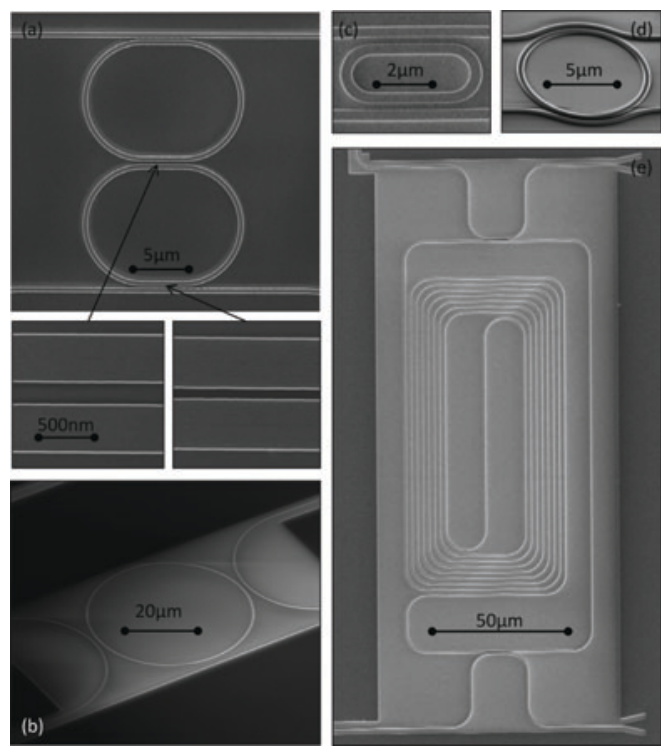

**How to read this figure.** These are scanning-electron-microscope (SEM) top views of real silicon rings. (a) Two coupled racetrack rings, with zoom-ins on the straight coupling sections, where the gap is a few hundred nm. (b) A circular ring with large coupling gaps (scale bar 20 µm). (c) A tiny racetrack with only 1 µm bend radius. (d) A ring whose bus waveguide wraps around it ("conformal" coupling) to get a longer coupling region. (e) A long folded spiral used as one large ring. The takeaway: "ring" means any closed loop, from µm-sized to hundreds of µm.

!!! note "About the figure files"
    The paper's opening SEM picture of "a series of coupled ring resonators" was not extracted as a separate image. The extracted file for Fig. 2 is a duplicate of Fig. 1. So on this page Fig. 2 is replaced by a redrawn schematic. A few other figures (8, 12, 14) are also missing from the extracted set. Each is described in words in its place, and Fig. 12 gets a sketch.

## 2. Properties of a ring resonator

A ring is a looped waveguide plus a way to get light in and out. It is **on resonance** when the round-trip phase is a whole multiple of $2\pi$. Then the light from successive laps adds constructively. This section gives every formula you need to describe a ring's behaviour.

### 2.1. All-pass ring resonators

**In plain words.** The simplest ring has a single bus waveguide. One output of a directional coupler is fed back into its own input. This is called the **all-pass filter (APF)** or **notch filter**. "All-pass" because, without loss, all the light eventually comes out of the single output. "Notch" because, with loss, the output has dips. A ring stretched with straight sections is called a **racetrack**. All the formulas work for any loop shape.

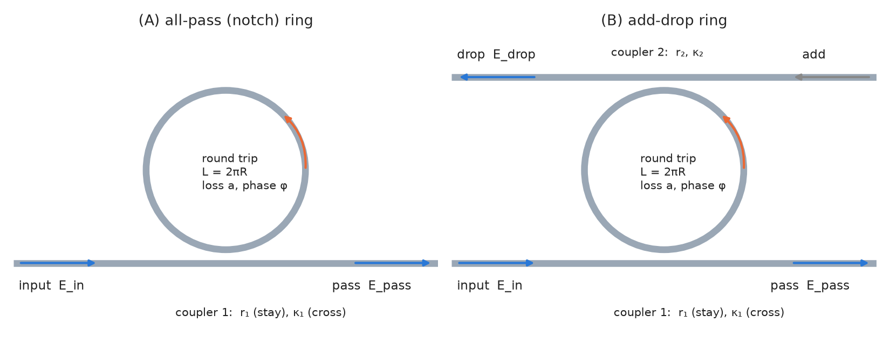

**How to read this figure.** This is a redrawn version of the paper's Fig. 2. (A) The all-pass ring: one bus, one coupler with self-coupling $r_1$ and cross-coupling $\kappa_1$. Light circulates in the ring (orange arrow) with round-trip amplitude $a$ and phase $\phi$. (B) The add-drop ring: a second bus on top with a second coupler ($r_2, \kappa_2$). Light that reaches the second coupler can leave by the **drop** port. Note that it comes out travelling *backwards* relative to the input, because the ring turns it round. A signal fed into the **add** port is merged into the pass output.

#### Deriving the all-pass transfer function, step by step

We assume **continuous-wave (CW)** operation: a single wavelength, switched on long ago, so every field is steady. We also assume nothing reflects back into the bus. Section 2.6 shows that this is not always true in silicon.

Name four fields at the coupler:

- $E_{in}$: arriving in the bus;
- $E_{pass}$: leaving in the bus;
- $E_1$: launched into the ring, just after the coupler;
- $E_2$: arriving back at the coupler after one lap.

**Step 1 — the coupler.** Using the coupler matrix:

$$E_{pass} = r E_{in} + i\kappa E_2, \qquad E_1 = i\kappa E_{in} + r E_2.$$

**Step 2 — one lap around the ring.** The light loses amplitude (factor $a$) and gains phase $\phi = \beta L$:

$$E_2 = a e^{i\phi} E_1.$$

**Step 3 — solve for the ring field.** Substitute step 2 into the second coupler equation:

$$E_1 = i\kappa E_{in} + r a e^{i\phi} E_1 \;\Rightarrow\; E_1 = \frac{i\kappa}{1 - r a e^{i\phi}} E_{in}.$$

This one line holds the whole physics. The denominator $1 - ra e^{i\phi}$ is smallest when $e^{i\phi} = 1$, i.e. $\phi = 2\pi m$. There the ring field is enhanced: on resonance $|E_1| = \kappa/(1-ra)$ times the input. For example, with $\kappa^2 = 0.01$ ($\kappa = 0.1$) and $ra = 0.99$, $|E_1| = 0.1/0.01 = 10$, so the power circulating in the ring is 100 times the input power. Power builds up inside the ring.

**Step 4 — the output.** Substitute into the first coupler equation:

$$E_{pass} = r E_{in} + i\kappa\, a e^{i\phi}\frac{i\kappa}{1 - ra e^{i\phi}}E_{in} = \left[r - \frac{\kappa^2 a e^{i\phi}}{1 - r a e^{i\phi}}\right]E_{in}.$$

Put everything over the common denominator and use $\kappa^2 = 1 - r^2$:

$$\frac{E_{pass}}{E_{in}} = \frac{r - r^2 a e^{i\phi} - (1-r^2) a e^{i\phi}}{1 - r a e^{i\phi}} = \frac{r - a e^{i\phi}}{1 - r a e^{i\phi}}.$$

The paper writes the same result in a slightly different form (its **Eq. 1**):

$$\frac{E_{\text{pass}}}{E_{\text{input}}} = e^{i(\pi + \phi)} \frac{a - re^{-i\phi}}{1 - rae^{i\phi}}.$$

Check that they agree: $e^{i(\pi+\phi)}(a - re^{-i\phi}) = -e^{i\phi}a + r = r - ae^{i\phi}$. ✓ The paper's form pulls out the factor $e^{i(\pi+\phi)}$ to make the phase discussion (Eq. 4) easier.

Symbols: $\phi = \beta L$ is the round-trip phase; $L$ is the round-trip length; $\beta$ is the propagation constant; $a$ is the single-pass amplitude transmission (it includes propagation loss *and* any loss in the coupler), with $a^2 = \exp(-\alpha L)$.

**Step 5 — power transmission (Eq. 2).** Multiply by the complex conjugate. The numerator is $|r - ae^{i\phi}|^2 = r^2 - 2ra\cos\phi + a^2$, and likewise for the denominator:

$$T_n = \frac{I_{\text{pass}}}{I_{\text{input}}} = \frac{a^2 - 2ra\cos\phi + r^2}{1 - 2ar\cos\phi + (ra)^2}.$$

The subscript $n$ stands for "notch". It keeps this apart from the pass port of the add-drop ring later.

**A useful rewrite.** Subtract numerator from denominator: $1 + r^2a^2 - a^2 - r^2 = (1-a^2)(1-r^2)$. So

$$T_n = 1 - \frac{(1-a^2)(1-r^2)}{1 - 2ra\cos\phi + (ra)^2}.$$

This shows at once that:

- with no loss ($a = 1$) we get $T_n = 1$ at every wavelength. All light comes out; only its phase changes (hence "all-pass");
- with no coupling ($r = 1$) also $T_n = 1$, because the ring is invisible;
- the dip is deepest where the denominator is smallest, at $\cos\phi = 1$.

The paper notes one approximation: $r^2 + k^2 = 1$ assumes a lossless coupler. Any coupler loss is folded into $a$. This can shift the absolute power levels slightly, but the resonance width stays correct.

#### Where are the resonances? (Eq. 3)

The resonance condition is $\phi = \beta L = 2\pi m$. With $\beta = 2\pi n_{\text{eff}}/\lambda$:

$$\lambda_{\text{res}} = \frac{n_{\text{eff}}L}{m}, \quad m = 1,2,3,\ldots$$

In words: a whole number $m$ of wavelengths (measured inside the waveguide) fits in the loop.

*Worked example.* $R = 5$ µm, $L = 31.42$ µm, $n_{\text{eff}} = 2.4$. Then $n_{\text{eff}}L = 75.4$ µm, and near 1.55 µm we need $m = 75.4/1.55 \approx 48.6$. The nearest whole numbers give resonances at $75.4/49 = 1.539$ µm and $75.4/48 = 1.571$ µm. But careful: these numbers use a *fixed* $n_{\text{eff}}$. Their spacing (32 nm) is wrong, because $n_{\text{eff}}$ changes with $\lambda$. The correct spacing uses $n_g$ (Eq. 9 below) and is about 18 nm.

#### Critical coupling: the key condition

Put $\phi = 2\pi m$ ($\cos\phi = 1$) into Eq. 2:

$$T_n^{\min} = \frac{(a - r)^2}{(1 - ra)^2}.$$

This is **zero exactly when $r = a$**. That is **critical coupling**. Equivalently, $1 - a^2 = 1 - r^2 = \kappa^2$: *the power coupled into the ring per lap equals the power lost in the ring per lap.*

Why do we get zero output? The output is the sum of two waves. One is the light that never entered the ring (amplitude $r$). The other is the light leaking back out of the ring (half a turn out of phase on resonance). At critical coupling they have exactly equal size and cancel perfectly. All the power is then burned up inside the ring.

- **Under-coupled:** $r > a$. Coupling is weaker than loss (gap too wide). The directly transmitted wave wins, so the dip is not fully deep.
- **Over-coupled:** $r < a$. Coupling is stronger than loss (gap too narrow). The light leaking out of the ring wins. Again the dip is not fully deep, but it is *wider*.

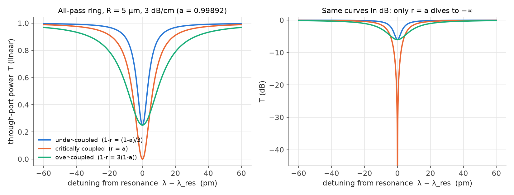

**How to read this figure (generated).** This is a realistic all-pass ring: $R = 5$ µm, $n_g = 4.2$, 3 dB/cm loss, so $a = 0.99892$. The x-axis is the distance from the resonance in **picometres**. Left panel, linear power: the critical ring (orange, $r = a$) goes all the way to zero. The under-coupled ring (blue, coupling loss 3× *smaller* than intrinsic loss) and the over-coupled ring (green, 3× *larger*) both bottom out at the **same** depth, 0.25. The under-coupled dip is narrow; the over-coupled dip is wide. Right panel, the same in dB: only critical coupling gives a very deep notch (in theory, $-\infty$ dB). **Key lesson:** the dip depth alone cannot tell you whether you are under- or over-coupled. You also need the width, or the phase (next figure), or a gap sweep. This is exactly what you do in the Meep sweep on 19 Oct.

#### Phase response (Eq. 4)

Because the ring stores light for a while, it also *delays* it. The phase of the output field is the argument (angle) of Eq. 1. Write $a - re^{-i\phi} = (a - r\cos\phi) + i r\sin\phi$ and $1 - rae^{i\phi} = (1 - ra\cos\phi) - i ra\sin\phi$. The angle of a quotient is the angle of the top minus the angle of the bottom. That gives the paper's **Eq. 4**:

$$\varphi = \pi + \phi + \arctan \frac{r\sin\phi}{a - r\cos\phi} + \arctan \frac{ra\sin\phi}{1 - ra\cos\phi}.$$

Here $\varphi$ is the **effective phase shift** that the ring adds to the passing light. $\pi + \phi$ is the trivial part from the prefactor. The two arctan terms are the resonant part.

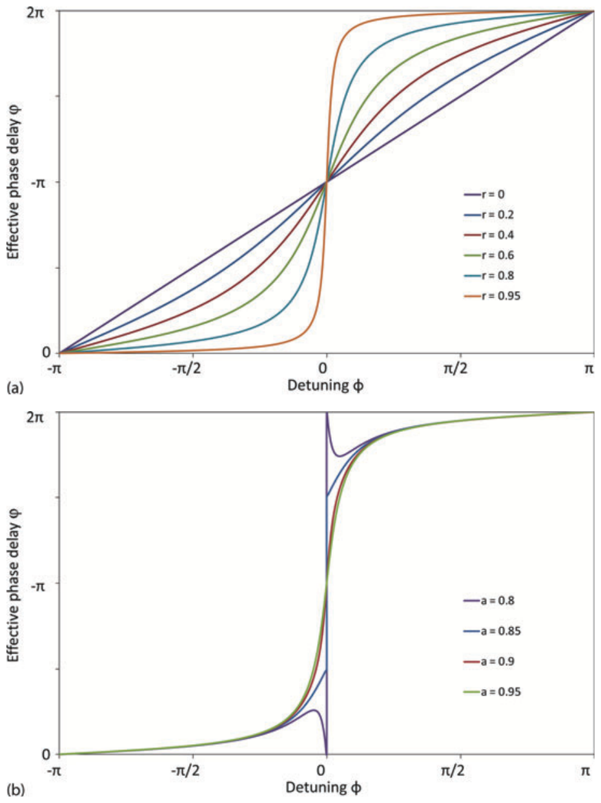

**How to read this figure.** The x-axis is the detuning $\phi$, the round-trip phase measured from the resonance at 0. The y-axis is the effective phase delay $\varphi$ from Eq. 4. **(a)** A lossless ring ($a = 1$) for several self-couplings $r$. With $r = 0$ (all light goes once round the ring and straight out) the phase rises as a straight line. As $r \to 1$ (weak coupling), almost all of the $2\pi$ phase change is squeezed into a tiny range around resonance. A very steep phase slope means a large group delay, which is useful for slowing light (Section 4.2). **(b)** $r = 0.85$ fixed, loss $a$ varied. At $a = 0.85 = r$ (critical) the phase **jumps abruptly by π** at resonance. For $a > r$ (over-coupled) the phase rises smoothly through a full $2\pi$. For $a < r$ (under-coupled) the phase wiggles back down near resonance, and the curve is drawn with a $2\pi$ jump. So over- and under-coupling bend the phase in *opposite* directions.

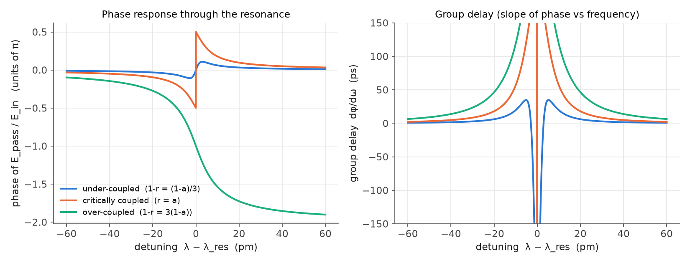

**How to read this figure (generated).** These are the same three rings as the transmission plot, now showing phase versus wavelength (the trivial straight-line part is removed). We plot against **wavelength**, while the paper plots against phase $\phi$, which grows with *frequency*. Increasing wavelength means decreasing frequency, so our curves run the opposite way to Fig. 3. Left: over-coupled (green) sweeps through a full $2\pi$; critical (orange) jumps by $\pi$; under-coupled (blue) only wiggles. Right: the **group delay** $d\varphi/d\omega$ (how long a pulse is held up). Over-coupled rings give a large *positive* delay ("slow light"). Under-coupled rings give a *negative* delay right at resonance ("fast light", which is just pulse reshaping and does not break relativity). At critical coupling the delay is singular, because the phase jumps. **Use:** measuring the phase (for example by putting the ring in one arm of an interferometer) is one way to tell under- from over-coupling.

### 2.2. Add-drop ring resonators

**In plain words.** Add a second bus waveguide on the other side of the ring. Light that builds up in the ring can now leave through this second bus, the **drop port**. On resonance, the wavelength is "dropped" out of the first bus into the second. Off resonance, it passes straight by. This is the basic channel filter for WDM.

#### Derivation, step by step

Let coupler 1 (input side) have $r_1, \kappa_1$ and coupler 2 (drop side) have $r_2, \kappa_2$. Assume the two couplers are half a lap apart. Each half-lap gives field factor $\sqrt{a}\,e^{i\phi/2}$. No light enters the add port.

1. Just after coupler 1, the ring field is $E_1 = i\kappa_1 E_{in} + r_1 E_2$, where $E_2$ is the field coming back to coupler 1.
2. Half a lap later it reaches coupler 2 as $\sqrt{a}e^{i\phi/2}E_1$.
3. At coupler 2, the drop output is $E_{drop} = i\kappa_2\sqrt{a}e^{i\phi/2}E_1$. The part that stays in the ring is multiplied by $r_2$.
4. Another half lap back to coupler 1: $E_2 = r_2 a e^{i\phi}E_1$.
5. Solve as before: $E_1 = \dfrac{i\kappa_1}{1 - r_1r_2ae^{i\phi}}E_{in}$.
6. Pass port: $E_{pass} = r_1E_{in} + i\kappa_1E_2 = \dfrac{r_1 - r_2ae^{i\phi}}{1 - r_1r_2ae^{i\phi}}E_{in}$, using $r_1^2 + \kappa_1^2 = 1$ exactly as in the all-pass case.
7. Drop port: $E_{drop} = \dfrac{-\kappa_1\kappa_2\sqrt{a}\,e^{i\phi/2}}{1 - r_1r_2ae^{i\phi}}E_{in}$.

Take $|\cdot|^2$ to get the paper's **Eqs. 5 and 6**:

$$T_p = \frac{I_{\text{pass}}}{I_{\text{input}}} = \frac{r_2^2 a^2 - 2 r_1 r_2 a \cos \phi + r_1^2}{1 - 2 r_1 r_2 a \cos \phi + (r_1 r_2 a)^2},$$

$$T_d = \frac{I_{\text{drop}}}{I_{\text{input}}} = \frac{(1 - r_1^2)(1 - r_2^2)a}{1 - 2 r_1 r_2 a \cos \phi + (r_1 r_2 a)^2}.$$

Two neat checks:

- Set $r_2 = 1$ (no second coupler). Then $T_p$ becomes the all-pass $T_n$ and $T_d = 0$. ✓
- Look at the pass port: it has exactly the all-pass form, with $a$ replaced by $r_2 a$. **To the first bus, the second coupler looks like extra loss.** Light that leaves through the drop port is "lost" from the ring's point of view.

**Critical coupling for the add-drop ring.** The pass port is zero on resonance when $r_1 = r_2 a$: the input coupling equals *all* other losses (ring loss plus the drop coupler). If the ring is lossless ($a \approx 1$), this means symmetric couplers, $\kappa_1 = \kappa_2$. Then all the light on resonance goes to the drop port. With loss and identical couplers, $r_1 = r_2 > r_2a$, so the ring is slightly under-coupled and the pass dip is not perfectly deep.

### 2.3. Spectral characteristics

**In plain words.** Every ring spectrum can be described by a handful of numbers: where the resonances are, how far apart they are (FSR), how wide they are (FWHM), how deep they are (extinction ratio), and two ratios built from these (finesse and Q). The paper first computes them from the formulas ($r$, $a$ → spectrum). In Section 3.3 it does the reverse (measured spectrum → $r$, $a$). The reverse direction is what you do today in Meep.

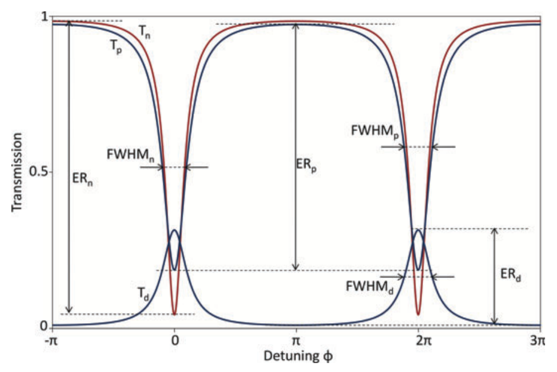

**How to read this figure.** The x-axis is the detuning $\phi$, covering two resonances (at 0 and $2\pi$). Red: the all-pass ring ($T_n$). Blue: the add-drop ring's pass port ($T_p$, dips) and drop port ($T_d$, peaks). The parameters are $a = 0.85$ and $r = r_1 = r_2 = 0.9$, a very lossy toy ring chosen to make the features visible. The labels show the **extinction ratios** $ER_n$, $ER_p$, $ER_d$ (vertical arrows) and the **FWHMs** (horizontal arrows). The add-drop dips are *wider and shallower* than the all-pass dip. The second coupler adds loss, which broadens the line and moves the ring further from critical coupling.

#### FWHM, derived (Eqs. 7, 8)

Start from the rewrite $T_n = 1 - \dfrac{(1-a^2)(1-r^2)}{D(\phi)}$, with

$$D(\phi) = 1 - 2ra\cos\phi + r^2a^2 = (1-ra)^2 + 2ra(1-\cos\phi) = (1-ra)^2 + 4ra\sin^2(\phi/2).$$

The dip depth $1 - T_n$ is proportional to $1/D$. It falls to half its peak value when $D$ doubles:

$$4ra\sin^2(\phi_{1/2}/2) = (1-ra)^2 \;\Rightarrow\; \sin\frac{\phi_{1/2}}{2} = \frac{1-ra}{2\sqrt{ra}} \;\Rightarrow\; \phi_{1/2} \approx \frac{1-ra}{\sqrt{ra}}.$$

(The last step uses $\sin x \approx x$, since the angle is tiny for a good ring.) The full width in *phase* is $\Delta\phi_{FWHM} = 2(1-ra)/\sqrt{ra}$.

**Convert phase to wavelength.** This is where $n_g$ appears. Since $\phi = 2\pi n_{\text{eff}}(\lambda)L/\lambda$,

$$\frac{d\phi}{d\lambda} = 2\pi L\,\frac{d}{d\lambda}\!\left(\frac{n_{\text{eff}}}{\lambda}\right) = 2\pi L\,\frac{\lambda\, dn_{\text{eff}}/d\lambda - n_{\text{eff}}}{\lambda^2} = -\frac{2\pi L\, n_g}{\lambda^2}.$$

So a small phase step $\Delta\phi$ corresponds to $|\Delta\lambda| = \Delta\phi\,\lambda^2/(2\pi n_g L)$. Therefore

$$\text{FWHM} = \frac{(1 - ra)\lambda_{\text{res}}^2}{\pi n_g L \sqrt{ra}} \quad\text{(all-pass, Eq. 7)},$$

$$\text{FWHM} = \frac{(1 - r_1 r_2 a)\lambda_{\text{res}}^2}{\pi n_g L \sqrt{r_1 r_2 a}} \quad\text{(add-drop, Eq. 8)}.$$

The add-drop version follows by the same steps, since its denominator has $r_1r_2a$ in place of $ra$.

#### FSR (Eq. 9) and group index (Eq. 10)

Neighbouring resonances are $\Delta\phi = 2\pi$ apart. Using the same conversion:

$$\text{FSR} = 2\pi\cdot\frac{\lambda^2}{2\pi n_g L} = \frac{\lambda^2}{n_g L}.$$

This is first order in dispersion: it assumes $n_g$ is constant over one FSR. In frequency the result is even simpler: $\text{FSR}_f = c/(n_g L)$, the inverse of the time for one round trip.

$$n_g = n_{\text{eff}} - \lambda_0 \frac{dn_{\text{eff}}}{d\lambda}.$$

Why $n_g$ and not $n_{\text{eff}}$? Moving from one resonance to the next means changing $\lambda$. That changes the phase both directly (through $1/\lambda$) and through $n_{\text{eff}}(\lambda)$. The group index adds both effects. The group velocity $v_g = c/n_g$ is the speed of a pulse envelope.

*Worked example (today's Meep target).* $R = 5$ µm, $L = 31.42$ µm, $n_g = 4.2$, $\lambda = 1.55$ µm:

$$\text{FSR} = \frac{1.55^2}{4.2\times31.42} = \frac{2.4025}{131.9} = 0.0182\ \mu\text{m} = 18.2\ \text{nm}.$$

If you wrongly used $n_{\text{eff}} = 2.4$ you would get 31.9 nm, almost twice too large. The strong confinement of silicon wires allows bends down to about 3 µm radius with little radiation, so FSRs of 20–30 nm are possible.

#### Extinction ratio (Eqs. 11–16)

The **extinction ratio (ER)** is the on/off contrast: the maximum transmission divided by the minimum.

For the all-pass ring, the maximum is half-way between resonances ($\cos\phi = -1$) and the minimum is on resonance ($\cos\phi = 1$):

$$T_t = \frac{(r + a)^2}{(1 + ra)^2}, \qquad R_{\min} = \frac{(r - a)^2}{(1 - ra)^2}, \qquad ER = \frac{T_t}{R_{\min}}.$$

For the add-drop ring, the same substitutions in Eqs. 5 and 6 give

$$T_t = \frac{(r_2 a + r_1)^2}{(1 + r_1 r_2 a)^2}, \qquad R_{\min} = \frac{r_2^2 a^2 - 2 r_1 r_2 a + r_1^2}{(1 - r_1 r_2 a)^2},$$

$$T_{\max} = \frac{(1 - r_1^2)(1 - r_2^2)a}{(1 - r_1 r_2 a)^2}, \qquad T_d = \frac{(1 - r_1^2)(1 - r_2^2)a}{(1 + r_1 r_2 a)^2}.$$

$T_t$ and $R_{\min}$ are the pass port's maximum and minimum. $T_{\max}$ and $T_d$ are the drop port's on-resonance peak and its off-resonance floor. (Note: $R_{\min}$'s numerator is $(r_1 - r_2a)^2$.) The drop-port ER is $T_{\max}/T_d$. The paper also uses $T_{\max}/R_{\min}$ as the contrast between drop and pass on resonance. In dB, $ER_{dB} = 10\log_{10}ER$.

*Worked example.* Take the critical-coupling ring from the generated figure, but under-coupled by a factor of 3. Then $\sqrt{R_{\min}} = (3-1)/(3+1) = 0.5$, so $R_{\min} = 0.25$, an ER of only 6 dB. To reach the 20 dB EXIT target on 19 Oct you need $R_{\min} < 0.01$, i.e. $\sqrt{R_{\min}} < 0.1$. That means $Q_c$ within about ±20 % of $Q_i$ (see the Q decomposition below). Critical coupling is a narrow target.

#### Finesse and Q (Eqs. 17, 18)

$$\text{Finesse} = \frac{\text{FSR}}{\text{FWHM}}, \qquad \text{Q-factor} = \frac{\lambda_{\text{res}}}{\text{FWHM}}.$$

- **Finesse** measures how sharp a resonance is compared with the *spacing* between resonances. To within a factor $2\pi$, it is the number of round trips light makes before its energy falls to $1/e$.
- **Q** measures how sharp a resonance is compared with its *centre frequency*. It is (up to $2\pi$) the number of optical *oscillations* before the stored energy falls to $1/e$.

Both are really about time: how long the ring holds light. The paper notes you would examine them with the transient (time-domain) response. That is exactly what Meep's Harminv does: it fits the decaying ring-down signal.

Any way out of the ring counts as loss for Q: propagation loss *and* coupling to the buses. So an add-drop ring (two exits) has lower Q than an all-pass ring with the same ring, when both are near critical coupling.

**Loaded versus unloaded Q.** The **unloaded** (intrinsic) Q, $Q_i$, is what the ring would have with no bus waveguides: it counts only the ring's own losses. Coupling to the buses adds extra loss channels, so the **loaded** Q, $Q_L$, is always smaller. The paper always means *loaded* Q unless it says otherwise. Every Q you measure from a spectrum, or get from Harminv on a coupled ring, is the loaded Q.

#### Deriving $1/Q_L = 1/Q_i + 1/Q_c$ (the schedule's item 2)

The paper does not write this decomposition explicitly, but it follows in three lines from its Eq. 20 (below). For a good ring, $r$ and $a$ are both close to 1, so

$$1 - ra = 1 - (1-(1-a))(1-(1-r)) \approx (1-a) + (1-r),$$

because the product $(1-a)(1-r)$ is tiny. With $\sqrt{ra}\approx 1$, Eq. 20 gives

$$\frac{1}{Q_L} = \frac{\lambda(1-ra)}{\pi n_g L} \approx \underbrace{\frac{\lambda(1-a)}{\pi n_g L}}_{1/Q_i} + \underbrace{\frac{\lambda(1-r)}{\pi n_g L}}_{1/Q_c}.$$

- $Q_i$ depends only on ring loss. Using $1 - a \approx \alpha L/2$: $\;Q_i \approx \dfrac{2\pi n_g}{\lambda\alpha}$. Notice that $L$ cancels.
- $Q_c$ (the **coupling Q**) depends only on the coupler, i.e. on the gap.
- Loss *rates* add, so inverse Q's add, just like resistors in parallel.
- **Critical coupling** $r = a$ is exactly $Q_i = Q_c$, and then $Q_L = Q_i/2$.

*Worked example.* 1 dB/cm ($\alpha = 2.3\times10^{-5}$/µm), $n_g = 4.2$, $\lambda = 1.55$ µm gives $Q_i = 2\pi\cdot4.2/(1.55\times2.3\times10^{-5}) \approx 7\times10^5$. (The schedule writes $\alpha \approx 2.3\times10^{-4}$ µm⁻¹ and $Q_i \approx 7\times10^4$. The correct conversion is 1 dB/cm = 0.23/cm = $2.3\times10^{-5}$/µm, which gives $\approx 7\times10^5$. Either way, the point stands: intrinsic Q in SOI is $10^4$–$10^6$, and a measured Q far below that is set by coupling.) At 3 dB/cm, $Q_i \approx 2.5\times10^5$, so a critically coupled ring has $Q_L \approx 1.2\times10^5$.

**Extinction in terms of Q.** In the same approximation,

$$\sqrt{R_{\min}} = \frac{|a-r|}{1-ra} \approx \frac{|1/Q_i - 1/Q_c|}{1/Q_i + 1/Q_c}.$$

So from one measured dip (its $Q_L$ and depth $R_{\min}$) you can get the intrinsic Q:

$$Q_i = \frac{2Q_L}{1 \pm \sqrt{R_{\min}}}\qquad(+\text{ if under-coupled},\ -\text{ if over-coupled}).$$

The ± sign is the same under/over ambiguity again. You need one extra piece of information (a gap sweep, or the phase) to pick the sign.

### 2.4. Losses and coupling

**In plain words.** Where does the round-trip loss come from? Three places:

- propagation loss along the waveguide;
- extra loss in the coupling sections (roughness, slight width changes caused by the fabrication process near the narrow gap);
- for racetracks, mismatch loss at each straight-to-bend transition, where the mode shape changes suddenly.

**Eq. 19** adds them up in dB (losses in dB add, because they multiply in linear units):

$$A[\text{dB}] = A'_{\text{propagation}}L + 2A_{\text{coupler}} + 4A_{\text{bend}}.$$

$A'_{\text{propagation}}$ is in dB per unit length. The "2" assumes two coupling sections (add-drop) and the "4" four straight-to-bend junctions of a racetrack. Then $a^2 = 10^{-A/10}$.

Put Eq. 7 into Eqs. 17–18 and the $\lambda^2$ and $n_gL$ terms rearrange into **Eqs. 20–23**:

$$\text{Q (all-pass)} = \frac{\pi n_g L \sqrt{ra}}{\lambda_{\text{res}}(1 - ra)}, \qquad \text{Finesse (all-pass)} = \frac{\pi \sqrt{ra}}{1 - ra},$$

$$\text{Q (add-drop)} = \frac{\pi n_g L \sqrt{r_1 r_2 a}}{\lambda_{\text{res}}(1 - r_1 r_2 a)}, \qquad \text{Finesse (add-drop)} = \frac{\pi \sqrt{r_1 r_2 a}}{1 - r_1 r_2 a}.$$

Finesse depends only on the round-trip "survival" $ra$. Q has an extra factor $n_gL/\lambda$, the number of wavelengths in the loop (times $n_g$).

To raise Q you must cut cavity loss: better SOI material and processing for propagation loss, and **adiabatic bends** (bends whose curvature changes gradually) instead of abrupt circular ones for bend loss. Making $L$ longer helps Q only until the propagation loss, which grows with $L$, takes over.

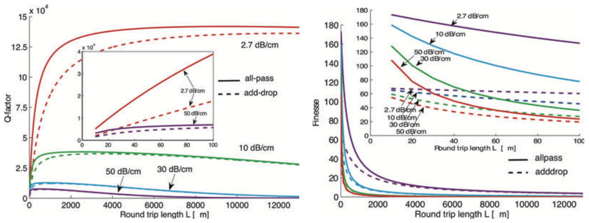

**How to read this figure.** The extracted image holds both Fig. 5 (left) and Fig. 6 (right). These are calculations, assuming critical coupling ($r = a$ for all-pass, $r_1 = r_2a$ with $r_2 = 0.99$ for add-drop), fixed bend loss 0.04 dB, and coupler loss 0.035 dB (all-pass) or 0.07 dB (add-drop). The colours are four propagation losses: 2.7, 10, 30, 50 dB/cm. Solid lines are all-pass, dashed lines add-drop. **Left (Q):** Q rises with length and then levels off (or falls slightly). For 2.7 dB/cm the best Q is about $1.42\times10^5$ (all-pass, at about 10 mm length) and $1.36\times10^5$ (add-drop, about 13 mm). Check with our formula: at critical coupling $Q_L = Q_i/2 = \pi n_g/(\lambda\alpha)$. With $\alpha = 2.7/4.343 = 0.62$/cm $= 6.2\times10^{-5}$/µm and $n_g = 4.3$, $Q_L = \pi\cdot4.3/(1.55\times6.2\times10^{-5}) \approx 1.4\times10^5$. ✓ The plateau is the propagation-loss limit. **Right (finesse):** finesse is highest for *short* rings (about 175 for all-pass), where the small fixed losses dominate, and drops as $L$ grows. Check: total fixed loss 0.075 dB gives $a^2 = 0.983$, so $F = \pi a/(1-a^2) \approx 180$. ✓ **Takeaway:** long rings give high Q but low finesse. Short rings give high finesse and large FSR, but Q is capped by the fixed bend and coupler losses.

### 2.5. Sensitivity

**In plain words.** A resonance moves whenever the optical round-trip length changes. Temperature, strain, a different cladding, molecules sticking to the surface: all of these change $n_{\text{eff}}$. The **sensitivity** is how far the resonance moves per unit of the cause.

From Eq. 3, a naive answer is (**Eq. 24**):

$$\Delta\lambda_{\text{res}} = \frac{\Delta n_{\text{eff}}\, L}{m}.$$

But silicon wires are strongly dispersive. When $\lambda_{res}$ moves, $n_{\text{eff}}$ changes *again*, simply because the wavelength changed. To first order (the unnumbered equation in the paper):

$$m\,\Delta\lambda_{\text{res}} = L\left[\frac{\partial n_{\text{eff}}}{\partial n_{\text{env}}}\Delta n_{\text{env}} + \frac{\partial n_{\text{eff}}}{\partial \lambda}\Delta\lambda_{\text{res}}\right].$$

**Derivation of Eq. 25.** Move the $\Delta\lambda$ terms to the left: $\Delta\lambda_{res}\,(m - L\,\partial n_{\text{eff}}/\partial\lambda) = L\,\Delta_{\text{env}}n_{\text{eff}}$. Substitute $m = n_{\text{eff}}L/\lambda_{res}$:

$$\Delta\lambda_{res}\,\frac{L}{\lambda_{res}}\left(n_{\text{eff}} - \lambda_{res}\frac{\partial n_{\text{eff}}}{\partial\lambda}\right) = L\,\Delta_{\text{env}}n_{\text{eff}} \;\Rightarrow\; \Delta\lambda_{\text{res}} = \frac{\Delta_{\text{env}} n_{\text{eff}}\, \lambda_{\text{res}}}{n_g}.$$

The bracket is exactly $n_g$ (Eq. 10). Here $\Delta_{\text{env}} n_{\text{eff}} = (\partial n_{\text{eff}}/\partial n_{\text{env}})\Delta n_{\text{env}}$ is the effective-index change caused by the environment alone.

Again $n_g$ appears, and it *reduces* the shift by about a factor 4.3/2.4 compared with the naive formula.

*Worked example.* Suppose the environment changes $n_{\text{eff}}$ by $10^{-4}$. Then $\Delta\lambda = 10^{-4}\times1550/4.3 = 0.036$ nm $= 36$ pm. A ring with a 30 pm FWHM would move by more than its own linewidth. That shows both how sensitive rings are and how fragile they are as filters.

**How much does $n_{\text{eff}}$ change? (Eq. 26).** Perturbation theory (the "variational theorem") says

$$\Delta_{\text{env}} n_{\text{eff}} = c \int \Delta\varepsilon\; \mathbf{E}_v \cdot \mathbf{E}_v^*\, dx\,dy,$$

where $\mathbf{E}_v$ is the normalised mode field, $\Delta\varepsilon$ the local change in permittivity, and $c$ a normalisation constant. In words: the index shift is the permittivity change *weighted by how much light is there*. A change where the field is strong matters a lot; a change where there is no field does nothing. To make a better sensor, design the waveguide so more of the mode sits where the change happens, for example at the surface.

!!! tip "This is the same maths as the adjoint method"
    Eq. 26 is a first-order perturbation formula: "change in output = field² × change in material, summed over space". Your inverse-design gradients use exactly this structure. It is also why the edges of a waveguide, where the field is strong and fabrication errors happen, dominate robustness.

### 2.6. Counterdirectional coupling

**In plain words.** A ring supports two modes at each resonance: light going clockwise and light going anticlockwise. In a perfect ring these two never mix. But any imperfection (sidewall roughness, or the coupler itself) can scatter a little light backwards. This is **counterdirectional** (contra-directional) coupling.

Once the two directions are coupled, the true modes of the ring are no longer the two travelling waves. They become two **standing waves**: one symmetric ($a_+$) and one antisymmetric ($a_-$) about the scatterer. These two standing waves sit differently on the perturbation, so they feel slightly different effective indices and resonate at slightly different frequencies. Result: **resonance splitting**. One dip becomes two. Forward-going light excites both standing waves, 90° out of phase. The paper analyses this with **temporal coupled-mode theory (TCMT)**, which treats each mode as a decaying oscillator with coupling terms.

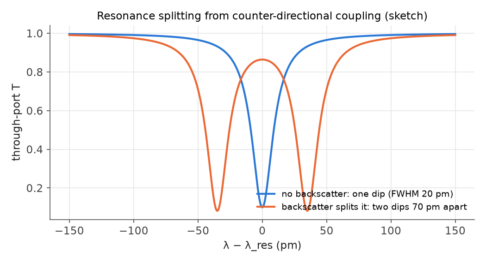

**How to read this figure (generated sketch).** Blue: a normal Lorentzian dip with FWHM 20 pm. Orange: the same ring with strong backscattering. The resonance has split into two dips about 70 pm apart, using the numbers measured in Section 3.3.1. Splitting is visible when it exceeds the linewidth. So high-Q (narrow) rings show it most.

The main points from the section:

- The bus waveguide can cause splitting, since the two standing waves "see" the coupler differently. In silicon, though, **sidewall roughness** is the much bigger cause. A longer, weaker coupler that spans many wavelengths reduces the coupler's contribution.
- Little et al.'s rule: splitting becomes visible when the backscatter coupling $R$ exceeds the external coupling, $R > k^2$. In words: the ring dumps light into the backward mode faster than it charges up through the bus. High-Q rings use small $k$, so even tiny reflections cause splitting.
- Backscatter also sends light **back into the input** (and out of the add port). The ring enhances this reflection on resonance, and it grows with $n_g$.
- Roughness is random (modelled as Gaussian-correlated with a fixed variance and correlation length). So the amount of splitting varies randomly from one resonance to the next, even in a single ring. Experiments show these statistics are universal across shapes and technologies. With e-beam lithography, roughness can be semi-periodic (a "quasi-grating"), which makes backscatter a predictable function of wavelength. In principle that could be designed on purpose (fast light, wavelength conversion).

## 3. Ring resonators in silicon

Now the general theory meets the reality of submicron silicon wires: their dimensions, losses, dispersion, couplers, measured rings, uniformity, tuning and nonlinearity.

### 3.1. Silicon waveguides

**In plain words.** A silicon wire has a silicon core ($n = 3.47$) on buried oxide ($n = 1.44$), with oxide or air on top. It is patterned by optical or e-beam lithography and dry (reactive-ion) etching, often in CMOS fabs. To be single-mode at 1550 nm the cross-section must be submicron. The most common size is 400–500 nm wide by 200–250 nm tall (other examples range from 600 × 100 nm to 300 × 300 nm). The huge index contrast gives very strong confinement, which allows very tight bends.

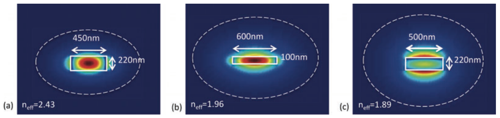

**How to read this figure.** These are colour maps of mode intensity (red = strong) in three cross-sections; the white box is the silicon core. (a) Standard 450 × 220 nm, TE mode, $n_{\text{eff}} = 2.43$: tightly confined. (b) 600 × 100 nm, TE, $n_{\text{eff}} = 1.96$: thin and wide, so less light touches the rough vertical sidewalls, but the mode spreads more. (c) 500 × 220 nm, **TM** mode, $n_{\text{eff}} = 1.89$: the field is strongest just *above and below* the core, not at the sidewalls. Lower $n_{\text{eff}}$ means weaker confinement, so larger bend loss.

**Why the field jumps at an interface.** At a boundary the normal component of $\mathbf{D} = \varepsilon\mathbf{E}$ is continuous. So when $\mathbf{E}$ points *across* a boundary, the field on the low-index side is larger by the ratio $\varepsilon_{Si}/\varepsilon_{SiO_2} \approx 5.8$. For quasi-TE (E mostly horizontal) this jump happens at the vertical **sidewalls**. For TM it happens at the top and bottom surfaces.

**Losses.** State-of-the-art wires reach 2–3 dB/cm with air cladding and below 2 dB/cm with oxide cladding. The contributions:

- **Sidewall roughness scattering** is the biggest. The etch leaves nm-scale roughness on the vertical walls (Fig. 8). Scattering grows strongly with index contrast. The polished top surface is much smoother (about 0.1 nm RMS).
- Remedies: change the cross-section (the 600 × 100 nm wire has roughly 7× less scattering, but weaker confinement, so higher bend loss and a smaller maximum FSR); use rib waveguides (partial etch); smooth the walls chemically or by thermal reflow.
- **Surface-state absorption** at dangling bonds on the sidewalls.
- At high power: **two-photon absorption** and **free-carrier absorption** (Section 3.7).
- **Substrate leakage** through the buried oxide, which falls exponentially with oxide thickness. With 2 µm of oxide it is negligible for TE and about 0.001 dB/cm for TM.
- **Rayleigh scattering** in the bulk is the fundamental floor, and very low in crystalline silicon.

*Fig. 8 (not available as an image here)* is a bird's-eye SEM of a 460 nm × 220 nm wire. The vertical stripes along the sidewalls are the roughness that dominates the loss.

**Bends.** TE wires bend down to about 3 µm radius with little radiation, compared with about 100 µm for conventional waveguides. Measured excess bend loss for a 500 nm wire is 0.01 dB per 90° at 4.5 µm radius and 0.071 dB per 90° at 1 µm radius. That number includes mode mismatch at the straight–bend junction, TE–TM conversion, and higher-order modes. Sharper bends push the mode outward, so they increase scattering and substrate leakage. Cross-section tuning or smooth (non-circular) bend shapes help.

**Fabrication density effects.** In lithography, **optical proximity effects** change a line's width depending on its neighbours. In etching, **loading** means the local etch rate depends on how much material is around. Both matter most in the coupler, where two lines come close together. A waveguide's width can change abruptly as it enters the gap.

**TE versus TM.** TE is the ground mode and usually preferred. TM has less overlap with the sidewalls, so it has less scattering and especially less **backscattering**. It has been used for high-Q disks and rings. For 500 × 220 nm, the expected TM scattering loss is more than 10× lower.

**Dispersion.** The high contrast makes wires very dispersive: $dn_{\text{eff}}/d\lambda < 0$ (normal dispersion), and $n_g \approx 4.3$, almost twice $n_{\text{eff}}$. This strongly affects FSR and linewidth.

**Dimensional sensitivity.** Small width or thickness changes shift $n_{\text{eff}}$ noticeably, and therefore the resonances. This theme returns in Section 3.5 and is the core of your project.

### 3.2. Directional couplers

**In plain words.** Light is usually coupled into a ring by a directional coupler. The two waveguides can sit side by side (most common), on top of each other, or be joined by a small MMI. Well-controlled coupling is essential for hitting critical coupling or a target bandwidth. This is especially true for multi-ring filters, where reproducible couplers are the main bottleneck. Theory for two straight guides is easy. A real coupler also includes the curved sections where the waveguides approach and leave each other, and those add coupling too.

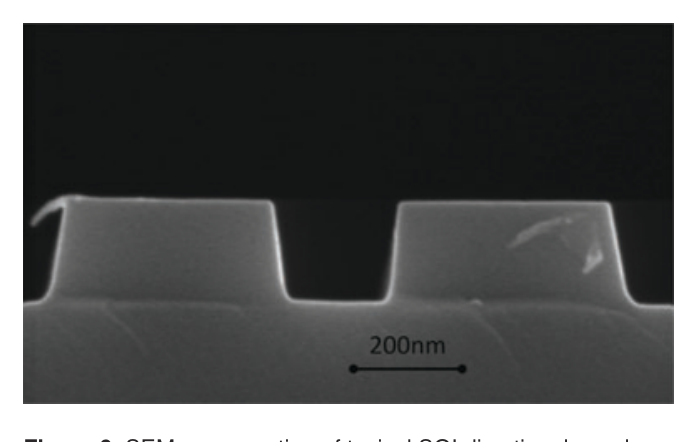

**How to read this figure.** A cross-section cut through two neighbouring silicon wires (scale bar 200 nm). The gap is roughly 150–200 nm. Notice the slightly sloped sidewalls and the rounded corners. Real couplers are not the perfect rectangles of a simulation, which is why measured coupling differs from designed coupling.

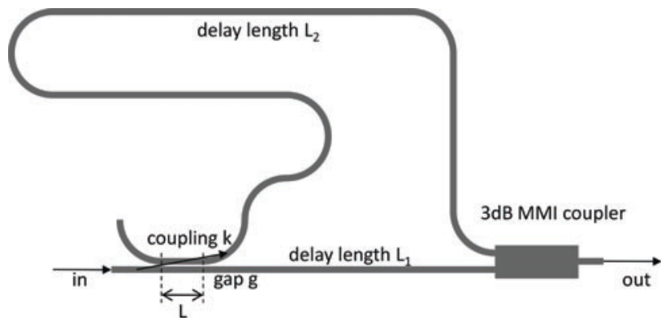

**How to read this figure.** A test circuit for measuring a coupler. Light enters at the left. The directional coupler under test (coupling length $L$, gap $g$, cross-coupling $k$) splits it into two arms of different lengths $L_1$ and $L_2$. A 3 dB MMI (a reliably 50/50 combiner) recombines them. As the wavelength is swept, the output goes through maxima and minima. Their depth tells you how unbalanced the splitter is, and hence $k$.

**The MZI equations.** The output field is the sum of the two arms. Each arm carries a factor $1/\sqrt{2}$ from the MMI, plus the coupler factor ($jk$ for the crossed arm, $\sqrt{1-k^2}$ for the straight one), plus the arm phase. (The paper writes $j$ for $\sqrt{-1}$ here, the engineering convention.)

$$E_{\text{out}} = \tfrac{1}{\sqrt{2}}\, jk\, e^{-j\phi_1}E_{in} + \tfrac{1}{\sqrt{2}}\sqrt{1-k^2}\,e^{-j\phi_2}E_{in},$$

$$I_{\text{out}} = \tfrac{1}{2}\left(1 + 2k\sqrt{1-k^2}\,\sin\Delta\phi\right)I_{in},$$

with $\phi_{1,2} = \beta L_{1,2}$ and $\Delta\phi = \phi_1 - \phi_2$. (Multiply out $|E_{out}|^2$: the squared terms give $\frac12(k^2 + 1 - k^2) = \frac12$, and the cross term gives $k\sqrt{1-k^2}\sin\Delta\phi$ because of the $j$.) As $\lambda$ changes, $\Delta\phi$ sweeps, so the output oscillates between $\frac12 \pm k\sqrt{1-k^2}$.

**From extinction ratio to $k$ (Eqs. 27–28).** Let $x = k\sqrt{1-k^2}$. Then

$$ER = 10^{ER_{dB}/10} = \frac{\tfrac12 + x}{\tfrac12 - x} \;\Rightarrow\; x = \frac{1}{2}\,\frac{ER-1}{ER+1}.$$

Square: $k^2(1-k^2) = x^2$. This is a quadratic in $k^2$: $(k^2)^2 - k^2 + x^2 = 0$. Hence

$$k^2 = K_{\pm} = \frac{1}{2} \pm \frac{1}{2}\sqrt{1 - \left(\frac{ER - 1}{ER + 1}\right)^2}.$$

There are two answers. A coupler crossing 20 % of the power and one crossing 80 % give the same contrast. You resolve this by sweeping the length. A perfect 50/50 coupler gives $ER \to \infty$ (perfect cancellation).

**Sweeping the coupler length.** For a symmetric coupler, coupled-mode theory gives power transfer $\sin^2$ of length. So fit

$$K(\lambda) = k(\lambda)^2 = \sin^2\big(\kappa(\lambda)L + \kappa_0(\lambda)\big).$$

$\kappa$ (1/µm) is the coupling per unit length in the straight part. $\kappa_0$ is the extra "free" coupling contributed by the curved approach sections. The **beat length** $L_\pi = \pi/(2\kappa)$ is the length for full transfer. Watch out: the sin² fit can be ambiguous, so fit carefully.

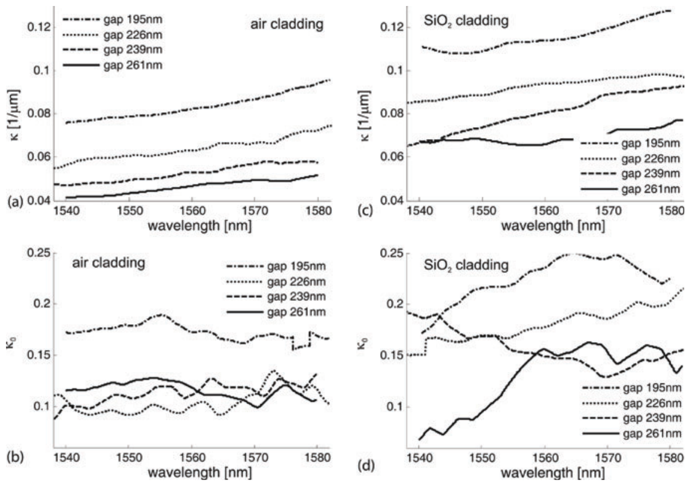

**How to read this figure.** Data for 427 nm wide wires with gaps 195, 226, 239 and 261 nm. Top left (a): $\kappa$ per µm with air cladding. Top right (c): $\kappa$ with oxide cladding. Bottom (b, d): the bend contribution $\kappa_0$. Three lessons. **Smaller gap means stronger coupling.** **Longer wavelength means stronger coupling**, because the mode is less confined and its tail reaches further. **Oxide cladding couples more strongly than air**, for the same reason. $\kappa_0$ is noisy because it is very sensitive to dimension errors and fitting. *Practical number:* at 1550 nm with oxide and a 226 nm gap, $\kappa \approx 0.09$/µm, so full transfer takes $L_\pi \approx \pi/(2\times0.09) \approx 17$ µm. A ring needing $k^2 = 0.05$ needs only about $\arcsin(0.22)/0.09 \approx 2.5$ µm of coupling (minus whatever $\kappa_0$ already provides).

### 3.3. Single silicon ring resonators

#### 3.3.1. Characterizing a resonance

**In plain words.** The group measured add-drop rings of radius 5 µm with gaps of 200 nm and 400 nm (TE, 450 × 220 nm wire, symmetric couplers). They swept a tunable laser with 1 pm steps, fitted a **Lorentzian** by least squares, and read off the FWHM, $R_{\min}$ and $T_{\max}$. The 5 µm radius fixes the FSR at about 17–18 nm. Check: $1.55^2/(4.3\times31.4) = 17.8$ nm. ✓

*Fig. 12 (not available as an image here)* shows the pass, drop and add spectra for both rings:

- **200 nm gap.** A broad resonance near 1599.55 nm with $\lambda_{3dB} \approx 200$ pm, so $Q \approx 1600/0.2 = 8\times10^3$. Assuming symmetric coupling and no backscatter, the fit gives $a = 0.97$ and $k^2 = 0.10$. The add port is 5 dB below the drop port, so a little backscatter is present. Any splitting is hidden inside the broad line ($R$ slightly less than $k^2$).
- **400 nm gap.** Weaker coupling gives $Q \approx 8\times10^4$ ($\lambda_{3dB} \approx 20$ pm). Now the resonance is clearly **split** by about 70 pm, more than the linewidth ($R > k^2$). The add port carries almost as much power as the drop port. Backscattering heavily changes the spectrum and even the direction of power flow in the ring. The generated sketch in Section 2.6 mimics this.

The paper's message: backscattering is a **major problem** for high-Q silicon rings.

!!! note "A consistency check you can try"
    Plug $a = 0.97$, $r_1 = r_2 = \sqrt{0.9}$, $n_g = 4.3$, $L = 31.4$ µm into Eq. 8. You get FWHM ≈ 0.8 nm, not 0.2 nm. The quoted 200 pm fits better with $k^2 \approx 0.01$, or with $a$ defined per half-lap. Treat the quoted $a$ and $k^2$ as rough. The paper itself says these parameters are hard to pin down from spectra, as the next subsections explain.

#### 3.3.2. FSR and group index

**In plain words.** To measure $n_g$, make racetrack rings that differ only in the length of one straight section. Here: bend radius 4.5 µm, fixed 2 µm couplers, 450 × 220 nm wire, add-drop. Measure each FSR and fit $\text{FSR} = \lambda^2/(n_gL)$. The fit gives $n_g = 4.30$.

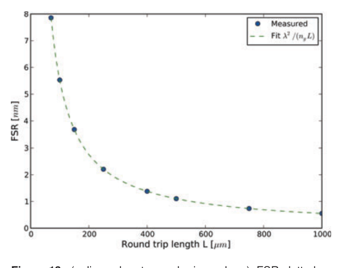

**How to read this figure.** The x-axis is round-trip length (70 µm to 1000 µm); the y-axis is FSR in nm. The dots are measurements; the dashed line is the fit $\lambda^2/(n_gL)$. The $1/L$ shape is clear: 70 µm gives about 7.9 nm, 1000 µm about 0.56 nm. Check: $1.55^2/(4.3\times70) = 7.98$ nm. ✓ **This is a standard way to measure $n_g$**, and the cleanest number to check your Meep ring against.

*Fig. 14 (not available as an image here)* plots the measured Q versus wavelength (about 1540–1560 nm) for ring lengths from 70 µm to 1000 µm, with a 150 nm gap. Longer rings show higher Q, as Eq. 22 predicts. At a fixed coupler, $1/Q_c \propto (1-r)/L$ falls as $L$ grows.

#### 3.3.3. Losses and coupling

**In plain words.** Now the reverse problem: get $a$ and $r$ from measured spectra. It is harder than it looks.

- With **asymmetric** add-drop rings there are three unknowns ($a, r_1, r_2$). The measurement error was too large to solve for all three, so the authors used **symmetric** add-drop rings.
- Even then it is hard to separate coupler loss from ring loss.
- In an **all-pass ring, $a$ and $r$ are completely interchangeable**. Eq. 2 is symmetric in $a$ and $r$, so swapping them gives the identical power spectrum. This is the under/over-coupling ambiguity you saw in the generated figure.

Ways around this:

1. **McKinnon et al.**: measure over a broad band and use how $a$ and $r$ *change with wavelength* differently. Coupling grows with $\lambda$ (Fig. 11); loss changes more slowly.
2. **Measure the phase**: put the ring in one arm of a nearly balanced MZI. Over- and under-coupled rings have opposite phase responses (Fig. 3).
3. **Compare an add-drop ring and an all-pass ring with the same gap.** This even separates coupler loss from ring loss. The drawback: the two devices sit in different places, and chip non-uniformity can spoil the comparison.
4. **Parameter sweeps**: make rings that differ in only one parameter (straight length, or gap) and fit the trend. This is what Figs. 15–16 show, and what your Meep gap sweep does.

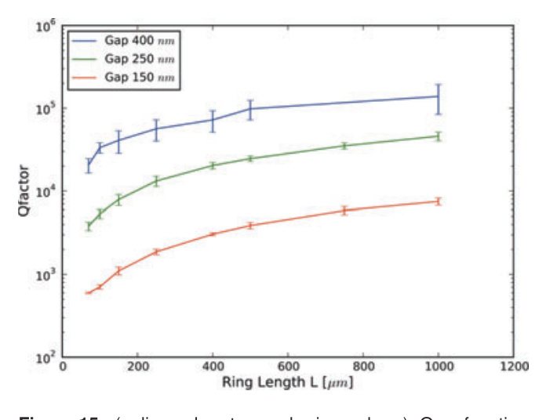

**How to read this figure.** Rectangular add-drop rings. The x-axis is length (70–1000 µm); the y-axis is Q on a log scale. There are three gaps: 150 nm (red, lowest), 250 nm (green), 400 nm (blue, highest). Error bars show the spread over different resonances of the same ring. **Wider gap means higher Q** (less coupling loss): about $10^3$ → $10^4$ → $10^5$. **Longer ring means higher Q**, flattening at large $L$, just like the model in Fig. 5. The 400 nm-gap ring approaches $1.4\times10^5$ at 1 mm, close to the propagation-loss limit of about $1.4\times10^5$ computed above.

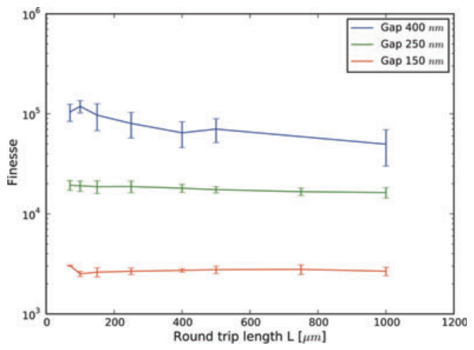

**How to read this figure.** The same rings, now showing finesse. For each gap the finesse is roughly **flat** with length. That fits Eq. 23: finesse depends on $r_1r_2a$, and for these rings the coupler term dominates over length-dependent loss. Wider gaps again give higher values. **Caution on the axis:** finesse = FSR/FWHM = Q·FSR/λ. For the 150 nm gap at 1000 µm: $Q \approx 7.5\times10^3$ and FSR ≈ 0.56 nm, so finesse ≈ $7.5\times10^3\times0.56/1550 \approx 2.7$. The plot shows about $2.7\times10^3$, a factor 1000 higher. This looks like a pm-versus-nm unit slip in the plotting. Trust the *trend* (flat in $L$, rising with gap), not the absolute numbers.

The authors conclude that the measurements behave like the simple model: Q rises with length and saturates, so the maximum Q is limited.

### 3.4. Multiple ring resonators

**In plain words.** Real devices often use several rings: flat-top band filters, multi-bit delay lines, slow-light structures, multiplexed sensors. Each ring's size and each coupling (ring–bus and ring–ring) are design knobs.

- **Vernier effect.** Two rings with slightly different FSRs only line up every so often, so the combined filter has a much larger effective FSR. Several silicon Vernier filters have been shown.
- **Finesse enhancement.** Tobing et al. coupled two rings, the second 1–2× the circumference of the first, and reached finesse up to 100 ($Q = 30\,000$).
- **Ring inside an MZI.** This gives a sharp resonance with a lower background and higher contrast, but needs careful MZI balancing. Darmawan et al. put one ring in an MZI arm. Depending on coupling, it gives a "double-Fano" or single resonance, and can produce a flat, box-like response. (A **Fano** resonance is an asymmetric line shape from interference between a sharp resonance and a smooth background.)

Three silicon-specific headaches for multi-ring circuits:

1. **Ring matching.** Neighbouring "identical" rings differ by about 0.5 nm (Section 3.5). That is comparable to a WDM channel spacing. Cascaded rings must therefore be tuned or trimmed, and in coupled-ring filters the mismatch smears out the passband ("inhomogeneous broadening").
2. **Process bias on gaps.** Nanometre errors in gaps change coupling noticeably. In projection lithography, couplers with different gaps need slightly different exposure dose ("dose-to-target"), which the design must take into account.
3. **Coupling-induced frequency shift (CIFS).** The coupler adds its own phase, which shifts the resonance. This is especially strong in silicon and still being modelled.

**SCISSOR** (side-coupled integrated spaced sequence of resonators): many rings along one bus at fixed spacing. This tailors dispersion and slows light (Section 4.2), and can also make complex filters.

### 3.5. Sensitivity and uniformity

**In plain words.** High contrast means high sensitivity to dimensions. Rings designed identically come out different after fabrication, because lithography and etching vary in width and height. The gap varies too. What matters is the **average** width and height around the whole ring (the average $n_{\text{eff}}$ over the loop), not the local values. The sensitivity is so high that differences of a single atomic layer can be seen in the spectrum.

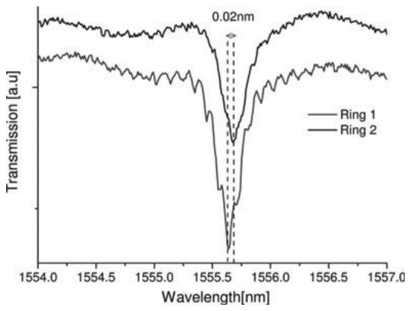

**How to read this figure.** Transmission (arbitrary units, curves offset vertically) of two all-pass rings that were drawn identically and placed close together on one chip, between 1554 and 1557 nm. Their dips are at about 1555.6 nm and differ by only **0.02 nm**. The paper says this corresponds to less than one monolayer of silicon. That is excellent matching, but even 20 pm is comparable to the linewidth of a high-Q ring.

Within a chip, uniformity better than 1 % has been shown with advanced patterning. Non-uniformity comes from mask errors, process variation within a chip, and variation across the 200 mm wafer.

Over short distances (tens of µm) the **local density** of structures matters more than global variation, through etch **loading**.

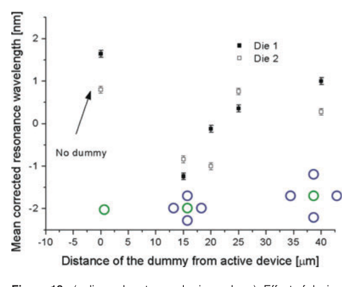

**How to read this figure.** The x-axis is the distance of nearby "dummy" structures (optically uncoupled rings, drawn as circles under the data) from the measured ring. The y-axis is the shift in resonance, relative to an average, for two dies. With no dummies the resonance is high (about +1.6 nm on die 1). With dummies 15 µm away it shifts **down** by roughly 2–3 nm (a blue shift). As the dummies move further away (40 µm) it recovers. The rings are not optically coupled at all, so this is a pure *fabrication* effect: neighbours change the local etch. **Fix:** as in CMOS, fill the chip with dummy structures so the density is even everywhere.

### 3.6. Tuning and trimming

**In plain words.** Fabrication variation cannot be avoided, so rings must be adjusted after fabrication. **Tuning** is active and reversible (for example a heater). **Trimming** is a permanent one-off change.

**Thermal tuning** is the most common, because silicon's refractive index changes strongly with temperature (the **thermo-optic effect**). The resonance follows Eq. 25.

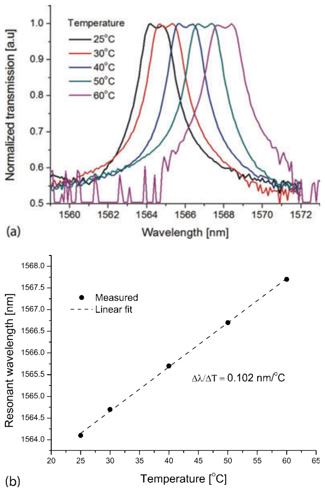

**How to read this figure.** (a) The drop-port spectrum of a second-order (two-ring) filter at 25, 30, 40, 50 and 60 °C. The passband shape stays the same and slides to longer wavelengths. (b) Resonance wavelength versus temperature: a straight line with slope **0.102 nm/°C**. *Check with Eq. 25:* $\Delta n_{\text{eff}}/\Delta T = (\Delta\lambda/\Delta T)\,n_g/\lambda = 0.102\times4.3/1565 \approx 2.8\times10^{-4}$ per K. This is the same order as silicon's material thermo-optic coefficient ($1.86\times10^{-4}$/K). **Implication for you:** a 1 °C change moves a ring by about 0.1 nm, several linewidths of a $Q = 10^5$ ring.

**Micro-heaters.** In practice each ring has its own heater, usually on top, sometimes beside it. Heaters use high-resistivity metals (Ti, Pt, Ni, Cr and alloys), often capped with gold or oxide to stop oxidation. The figure of merit is the **power needed to shift the ring by one full FSR** (mW/FSR, lower is better). Silicon dioxide conducts heat poorly (1.38 W/m·K). That limits thermal crosstalk between neighbours, but also wastes heat. Improvements:

- better spreading materials (BCB–diamond nanoparticle composites);
- spiral heaters with heat spreading (20 mW/FSR);
- thermal isolation that stops heat escaping, e.g. removing the substrate (2.4 mW/FSR, but slow: 170 µs).

**Trimming** permanently changes $n_{\text{eff}}$. Crystalline silicon is hard to change without adding loss, so trimming usually targets the **cladding**: photo-oxidation of a polymer cladding, or inducing stress in the buried oxide. A related idea is the **athermal ring**: use a cladding with a *negative* thermo-optic coefficient (most polymers) and choose the cross-section so the core and cladding effects cancel. This needs narrow, weakly confining waveguides, so sharp bends are no longer possible.

### 3.7. Nonlinear effects in rings

**In plain words.** "Nonlinear" means the material's response depends on the light's intensity. Silicon wires concentrate light into a tiny area, so modest powers give large intensities. A ring multiplies the intensity again on resonance. Silicon has strong **third-order** ($\chi^{(3)}$) effects:

- **Stimulated Raman scattering** (useful for amplifiers and lasers);
- **Kerr effect**: the index rises with intensity, causing self-phase modulation and cross-phase modulation;
- **Two-photon absorption (TPA)**: two photons together are absorbed. TPA creates free carriers, which then cause **free-carrier absorption (FCA)** and **free-carrier dispersion (FCD)**, an index change used for switching. The carriers also heat the waveguide, giving thermo-optic effects.

Silicon has **no** second-order ($\chi^{(2)}$) effect, because its crystal is centrosymmetric. Straining it can break the symmetry and create one.

**Thermal bistability.** In magnitude, thermal effects dominate, but they are slow. Absorbed light heats the ring, which red-shifts the resonance, which changes how much light is absorbed. This feedback skews the resonance into a shark-fin shape.

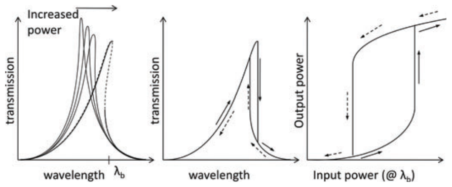

**How to read this figure.** Qualitative sketches of the drop port of an add-drop ring. (Left) As input power increases, the resonance leans to longer wavelengths. Eventually it folds over, giving three possible output values at one wavelength $\lambda_b$, of which two are stable. (Middle) So a wavelength sweep gives different curves going up (solid arrows) and going down (dashed arrows): **hysteresis**. (Right) At a fixed wavelength, the output versus input power jumps up and down at different thresholds: an optical memory or switch. The power needed depends on Q. **Practical warning:** if you measure a high-Q ring with too much power, the shape and position of the resonance are distorted.

Further points:

- Carrier effects from TPA are much faster than thermal ones. Two competing effects with different time scales can make the ring **self-pulse**.
- New frequencies: there is no second harmonic, but **third-harmonic generation** has been seen (green light from 1550 nm input). **Four-wave mixing (FWM)**: two pump photons become a signal and an idler photon with the same total energy. It is used for wavelength conversion, signal processing, and **entangled photon pairs**.
- For FWM to build up, the waves must stay in step, which needs constant $n_g$ (zero **group-velocity dispersion**, GVD). Geometry can be engineered so waveguide dispersion cancels material dispersion. In a ring, the interacting wavelengths must also all sit on resonances, so the FSR must be constant across the band. Then FWM can generate a **frequency comb**. At the time of writing, no sizeable comb had been shown in silicon rings.
- In a SCISSOR of all-pass rings, **solitons** (pulses that keep their shape) can travel from ring to ring.

## 4. Applications of ring resonators

**In plain words.** Rings are simple, so they are used for many things:

- **filters** for communication, especially when tunable;
- **delay lines**, because they store light;
- **sensors**: anything that changes the core or cladding (temperature, cladding index, strain, chemistry) shifts the resonance. Chemically treated surfaces add selectivity, for example to gases, and above all to specific biomolecules;
- **active rings** with a fast phase shifter (modulator), gain (laser) or absorber (resonant detector).

### 4.1. Spectral filters and switches

**In plain words.** WDM (de)multiplexers can be built from interleaved MZIs, arrayed waveguide gratings or echelle gratings. Rings could act as compact banks of channel filters, but a single ring has two problems:

- it is sensitive to fabrication and temperature, so hitting the exact channel needs tight process control or lots of tuning power;
- its Lorentzian shape is a poor passband: rounded top, slow roll-off. For fast signals, whose bandwidth is not negligible compared with the linewidth, this distorts the data.

**Higher-order filters** (several coupled rings) give a flatter passband and steeper sides with better out-of-band rejection. A bonus with two individually tunable rings: you can not only move the passband, but also switch it on and off.

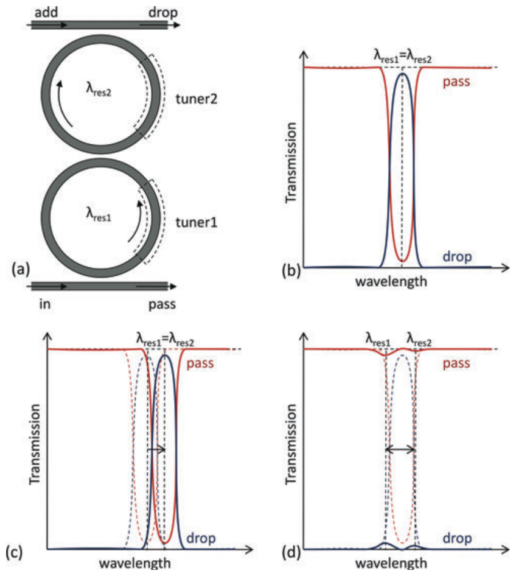

**How to read this figure.** (a) Two coupled rings between the in/pass bus (bottom) and the add/drop bus (top), each with its own tuner. (b) Both rings tuned to the same wavelength: a flat-topped drop peak (blue) and a matching notch in the pass port (red). The channel is dropped. (c) Tune **both rings the same way**: the whole filter slides to a new wavelength. (d) Tune them **in opposite directions**: the two rings no longer agree, so light cannot pass through both. The drop port goes nearly dark and the pass port is nearly flat. The filter is "off" without disturbing the neighbouring channels on the way. That is why it is called **hitless**.

### 4.2. Optical delay lines

**In plain words.** Near resonance a ring's phase changes steeply (Fig. 3), so it delays light: it stores the signal briefly and then releases it. One ring gives too little delay to be useful, so many rings are chained. The two classic layouts are:

- **SCISSOR**: all-pass rings side by side along one bus (Fig. 22a);
- **CROW** (coupled-resonator optical waveguide): rings coupled to each other in a chain (Fig. 22b).

The right figure of merit is not delay alone, but **delay × bandwidth**, roughly how many bits a buffer can hold. A narrow resonance gives a long delay but over a small bandwidth. For a single all-pass ring the paper quotes (**Eq. 29**)

$$T_{\text{APF}} = \tau\,\Delta\lambda \approx \frac{2}{\pi},$$

where $\tau$ is the (normalised) delay and $\Delta\lambda$ the normalised bandwidth. The extracted equation is garbled, but the message is clear: **the delay-bandwidth product of one ring is a fixed number of order 1**. Making the ring sharper gives more delay but proportionally less bandwidth, so one ring stores about one bit. With $N$ rings it scales as $N$: $T$ times $N$ for a SCISSOR, and $T_{\text{CROW}} = N/2\pi$ for a CROW.

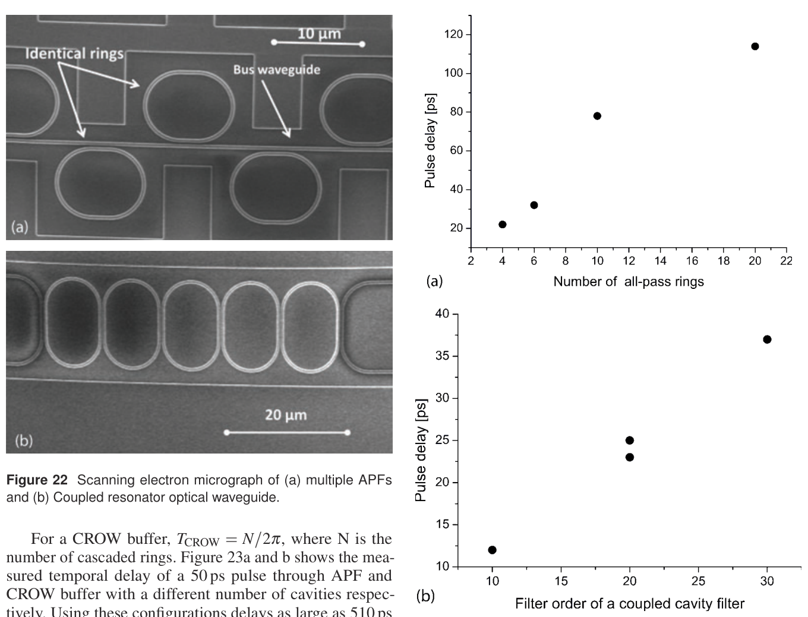

**How to read this figure.** The extracted image shows Fig. 22 (left) and Fig. 23 (right). Left: SEMs of (a) identical racetrack all-pass rings on both sides of one bus waveguide (scale 10 µm), and (b) a CROW, a row of racetrack rings each coupled to the next (scale 20 µm). Right: the measured delay of a 50 ps pulse. (a) All-pass rings: the delay grows with the number of rings, to about 115 ps for 20 rings. (b) CROW: the delay grows with filter order, to about 37 ps at order 30. The paper reports maximum delays of 510 ps (all-pass) and 220 ps (CROW).

**Comparison.** The all-pass chain works in **band-stop** (notch) mode. It gives more delay, but its insertion loss on resonance is high, which makes it impractical as a buffer. The CROW works in **band-pass** mode, with lower loss and moderate delay. Loss must be part of the comparison (**Eq. 30**):

$$FOM = \frac{\tau\,\Delta\lambda}{A},$$

with $A$ the loss.

**Non-uniformity** spreads the ring resonances and reduces the total delay, so each ring must be tuned. Tuning also makes the delay adjustable (to match different data rates), or lets you switch it off. An all-pass chain can be detuned to become transparent, leaving only the physical bus delay. A CROW detuned imprecisely may block light altogether. Rings give compact delay but limited bandwidth. For broadband delay, long **spiral** waveguides work but take up area and are not tunable. (For more, see the CROW review by Morichetti et al. in the same journal issue.)

### 4.3. Label-free biosensors

**In plain words.** Medicine, drug development, environmental and food testing need to detect specific biological molecules ("analytes"): drugs, DNA strands, antibodies. These can be a few nm in size, at concentrations as low as fg/ml (femtograms per millilitre), in a fluid full of other molecules at much higher concentration.

The usual method attaches a **label** (for example a fluorescent dye) to the analyte. That makes quantitative and kinetic (time-resolved) measurements hard, and needs a custom label for each target. **Label-free** sensors detect the binding directly. A transducer surface carries **receptor** molecules that bind only the target, and the transducer responds to the binding.

Silicon rings are excellent transducers:

- their spectrum depends strongly on their surroundings, with high Q, large extinction and low insertion loss;
- they are tiny, so many fit on one chip for parallel measurements;
- CMOS mass production makes chips cheap enough to throw away after one use, which avoids difficult cleaning.

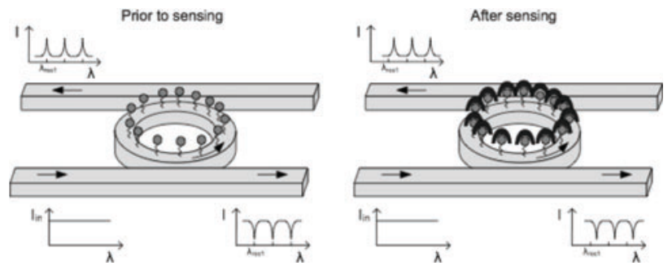

**How to read this figure.** Left, before sensing: receptor molecules (small grey balls on stalks) coat the ring. The drop spectrum (top) and through spectrum (bottom) show resonances at reference wavelengths. Right, after sensing: analyte molecules (dark caps) have bound to the receptors. The effective round-trip length grows, and every resonance shifts to longer wavelength in proportion to the number of binding events.

**The measurement.** First flow a buffer solution to record the reference resonances. Then flow the sample. Bound molecules (index about 1.45) replace water (index about 1.31) in the evanescent field, so $n_{\text{eff}}$ rises and the resonances red-shift (Eq. 25). The laser scans repeatedly, and a Lorentzian fit to each resonance tracks the shift over time. This gives both the concentration and the binding kinetics. All-pass rings are usually preferred because they reach higher Q.

**Modelling the binding layer.** Treat the molecules as a uniform layer of thickness $t_L$ and index $n_L$ wrapped around the waveguide (Fig. 25). Calibration with known concentrations is still needed.

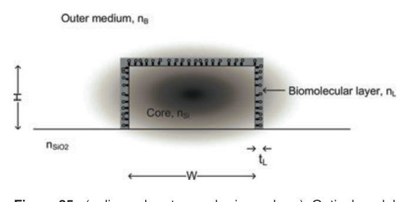

**How to read this figure.** A cross-section: a silicon core (width $W$, height $H$) on oxide, coated on top and sides by a thin biomolecular layer (thickness $t_L$, index $n_L$), in an outer medium (water, $n_B$). The shaded cloud is the mode. The layer sits where the mode's evanescent tail is.

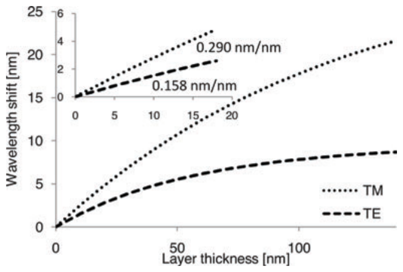

**How to read this figure.** The x-axis is layer thickness (nm); the y-axis is the resonance shift (nm), for a 480 × 220 nm wire, computed with a mode solver and Eq. 25. The response is linear up to about 40 nm (inset), much thicker than real molecular layers. The slopes are **0.158 nm/nm for TE** and **0.290 nm/nm for TM**. TM is more sensitive because it is less confined (more field in the cladding, Fig. 7c). The cost: more bend loss and more **water absorption**. Water absorbs strongly at 1550 nm (10.9/cm), which seriously limits Q (compare the 50 dB/cm curve in Fig. 5).

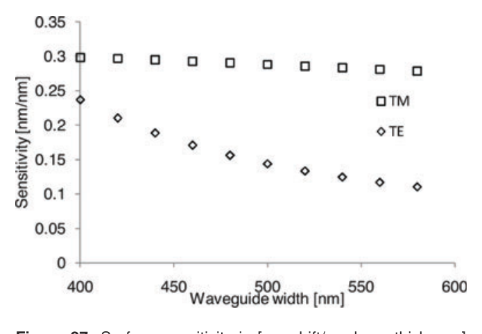

**How to read this figure.** The x-axis is waveguide width (400–580 nm, height 220 nm); the y-axis is sensitivity (nm shift per nm of layer). TE (diamonds) falls from about 0.24 at 400 nm to about 0.11 at 580 nm: narrower wires push more light out to the surface. TM (squares) stays near 0.28–0.30. Again, more light outside means more sensitivity, but also more loss.

**Resolution and detection limit.**

- The **sensor resolution** $\Delta\lambda_{\min}$ is the smallest shift you can reliably detect. It depends on the line shape, the noise, the fitting and the instrument resolution.
- The **detection limit** combines sensitivity and noise. Noise comes from index fluctuations, temperature drift, and laser intensity or wavelength noise. **Narrow, deep resonances** (high Q, high ER) are easier to locate precisely.
- State of the art: 0.3–3 pg/mm² of surface coverage, comparable to commercial surface-plasmon-resonance sensors, or 40–125 attograms of absolute mass. Concentration-based limits are harder to compare, because they also depend on mass transport, receptor density and binding affinity.
- Improvements: **reference rings** shielded from binding by a cladding cancel temperature drift; measuring the **initial slope** of the binding curve, instead of waiting for saturation, improves the detection limit, the dynamic range and the speed.
- **Multiplexing:** arrays of rings have detected several proteins or DNA strands at once.

Conclusion: silicon rings are strong label-free transducers. This is a promising near-term application, partly because it needs no on-chip lasers, modulators or detectors.

### 4.4. Active ring resonators

#### 4.4.1. Modulators

**In plain words.** A ring modulator parks the laser wavelength on the **slope** of a resonance. Then it electrically shifts the resonance, so the transmitted power at the laser wavelength goes up and down. Close to critical coupling, an all-pass ring has a deep, steep dip. A small shift then gives a large **modulation depth** $ER_{\text{mod}}$.

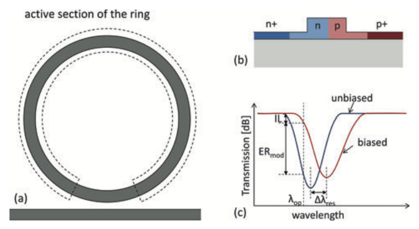

**How to read this figure.** (a) Top view: part of the ring (dashed outline) is the "active section". (b) Its cross-section: a rib waveguide with an n-doped and a p-doped side forming a diode, with heavily doped n+ and p+ regions for the metal contacts. (c) Transmission in dB versus wavelength. Unbiased (blue) and biased (red): the bias shifts the resonance by $\Delta\lambda_{res}$ (and here also broadens it). At the operating wavelength $\lambda_{op}$, the transmission changes by $ER_{\text{mod}}$, with some insertion loss IL even in the "on" state.

**Design trade-offs.**

- Steeper slope (higher Q, finesse) gives more efficient modulation.
- The response is most linear partway down the slope, at the cost of some depth and some insertion loss.
- High Q means light stays in the ring longer (photon lifetime $\approx Q/\omega$). This caps the modulation speed, so fast modulators use $Q \approx 5000$–$25\,000$. *Check:* $Q = 10^4$ at 1550 nm gives $\tau = Q/\omega = 10^4/(1.2\times10^{15}) \approx 8$ ps, which allows tens of GHz.

**How the index is changed.**

- **Heat**: too slow (µs).
- **Free carriers** (the **plasma dispersion effect**): electron and hole concentrations change both the index and the absorption.
- **Carrier injection** (forward-biased p-i-n diode): a strong effect, but limited by carrier recombination time (about ns).
- **Carrier depletion** (reverse-biased p-n junction): a weaker effect, but much faster. It is limited only by the junction capacitance and the carrier saturation velocity.

Carriers also add **absorption**, so they lower Q and push the ring away from critical coupling, which can reduce the modulation depth.

**Pros and cons.**

- Pros: compact, driven as a lumped element at 10–25 GHz, low power. Ring modulators hold the record for lowest energy per bit.
- Cons: the resonance must sit exactly at the laser wavelength despite fabrication and temperature variation. The bias voltage can tune only a little. Heaters only heat, so the chip must be held near the top of its temperature range with a constant heater power, which eats into the energy savings. The ring's phase response can add **chirp** (a time-varying frequency) when the signal bandwidth is a significant fraction of the linewidth.

#### 4.4.2. Hybrid silicon rings

**In plain words.** Silicon cannot emit light efficiently. So other materials, mainly **III–V semiconductors** (such as InP), are bonded on top. This is done either by direct bonding or with an adhesive (glue-like) layer. The III–V film sits close to the silicon waveguide, couples evanescently, and gives **gain** when pumped. A gain section inside the ring makes a **ring laser**. Issues: the silicon/III–V transitions add loss (which the gain must overcome) and reflections (which add counterdirectional coupling). In a large ring, several resonances fall within the gain bandwidth. With dispersion engineering to keep them evenly spaced, this gives a **mode-locked laser**. Optical pumping of a fully covered ring is another option.

The same bonding makes **resonant photodetectors**. A detector inside the ring responds only at resonances, but its absorption must be small, or it would spoil the resonance. Alternatively, the whole resonator can be made of III–V material and coupled vertically to a silicon bus. This avoids transition losses and maximises overlap with the gain. These are usually **disks** rather than rings, because disks are easier to contact electrically.

## 5. Summary

Silicon's high index contrast enables rings with tiny bend radii, tiny footprints and large FSRs. That has opened up new uses: filters, sensors, modulators, lasers. But the same high contrast makes silicon rings vulnerable to every imperfection: roughness causes backscatter and splitting, nanometre dimension errors cause wavelength shifts, and temperature causes drift. The authors expect a decade of progress in both physics and applications.

*(The paper ends with acknowledgements and author biographies, including two portrait photos, which are not reproduced here.)*

## Doing it yourself: extracting Q and FSR from a spectrum

This is the recipe for today's Meep block and for the 19 Oct gap sweep.

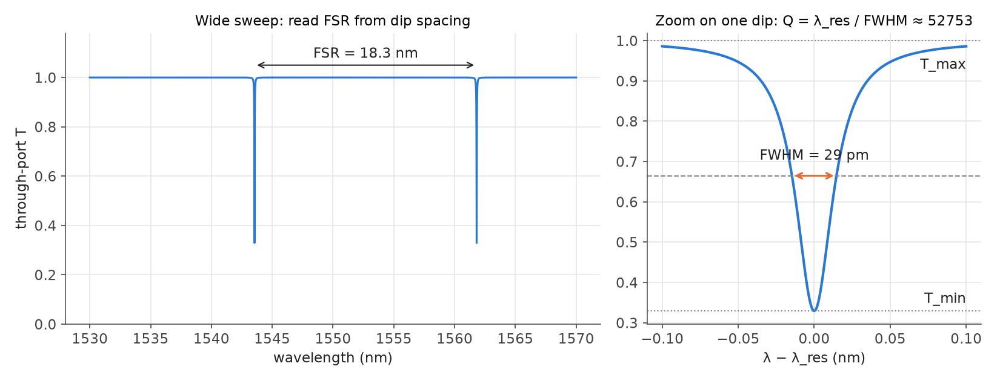

**How to read this figure (generated).** Left: a 40 nm sweep of an all-pass ring with $R = 5$ µm, $n_g = 4.2$, 3 dB/cm, $r = 0.996$ (over-coupled, since $r < a = 0.99892$). The dips are so narrow they look like lines; their spacing is the **FSR = 18.3 nm**, matching $\lambda^2/(n_gL) = 18.2$ nm. Right: a zoom of one dip. Draw $T_{\max}$ (off-resonance level) and $T_{\min}$. The half-depth line sits half-way between them. Its width is the **FWHM = 29 pm**, so $Q_L = \lambda/\text{FWHM} \approx 5.3\times10^4$. Eq. 7 predicts 29.3 pm. ✓

**Step by step.**

1. **Get a spectrum with enough resolution.** You need at least about 10 points across the FWHM. For $Q = 5\times10^4$ that means steps of about 3 pm, i.e. tens of thousands of points over one FSR. In Meep, a flux spectrum with that resolution needs a very long run. That is why the schedule says to use **Harminv** on the ring-down instead.
2. **FSR** = distance between neighbouring dips. Use several and average. In frequency (Meep units, $c = 1$, lengths in µm), $\text{FSR}_f = 1/(n_gL)$. For $L = 31.4$ µm and $n_g = 4.2$ that is $7.6\times10^{-3}$, against a centre frequency of $1/1.55 = 0.645$. **Invert to get $n_g$:** $n_g = \lambda^2/(\text{FSR}\cdot L)$.
3. **FWHM**: fit a Lorentzian (the safest), or find where $T$ crosses $(T_{\max}+T_{\min})/2$. Measure in frequency if your data is in frequency: $Q = f_{res}/\Delta f$.
4. **Harminv route:** Harminv fits the decaying field to $e^{-i\omega t}$ with complex $\omega$. It prints `frequency, imag. freq., Q, ...`. Column 3 is $Q = -\text{Re}\,\omega/(2\,\text{Im}\,\omega)$. This is the **loaded** Q when the bus is present.
5. **Extinction**: $ER_{dB} = -10\log_{10}(T_{\min}/T_{\max})$.
6. **Intrinsic Q**: $Q_i = 2Q_L/(1\pm\sqrt{T_{\min}/T_{\max}})$. Choose the sign using the gap trend. If widening the gap raises Q *and* deepens the dip, you started over-coupled and are moving towards critical. If widening the gap raises Q but makes the dip shallower, you are under-coupled.
7. **Finesse** = FSR/FWHM. Sanity check: it should equal $Q\cdot\text{FSR}/\lambda$.

**What to expect in 2-D Meep.** A 2-D simulation has no out-of-plane leakage and no roughness. Apart from bend radiation, the ring is almost lossless, so $a \approx 1$ and $Q_i$ is very large. Critical coupling ($Q_c = Q_i$) then happens at a *wide* gap, and narrow gaps are strongly over-coupled. The schedule warns that this 2-D critical gap is **not** the 3-D one. Log it as a 2-D result. Also, the effective index of a 2-D slab ring differs from a real 220 nm wire, so compute $n_g$ from *your* FSR rather than assuming 4.2.

```python
import numpy as np
# All-pass ring: R = 5 um, n_g = 4.2, n_eff = 2.4 at 1.55 um, loss 3 dB/cm
lam0, R, ng, n0 = 1.55, 5.0, 4.2, 2.4
L = 2*np.pi*R
alpha = 3/4.343*1e-4                 # dB/cm -> power loss per um
a = np.exp(-alpha*L/2)               # round-trip field amplitude
r = 0.996                            # self-coupling (gap sets this)
lam = np.linspace(1.53, 1.57, 400001)
neff = n0 - (ng-n0)*(lam-lam0)/lam0  # linear dispersion giving group index ng
phi = 2*np.pi*neff*L/lam
T = (a**2 - 2*r*a*np.cos(phi) + r**2)/(1 - 2*r*a*np.cos(phi) + (r*a)**2)

dips = np.where((T[1:-1] < T[:-2]) & (T[1:-1] < T[2:]) & (T[1:-1] < 0.9))[0] + 1
lr = lam[dips]
print("FSR measured  (nm):", np.diff(lr).mean()*1e3)
print("FSR formula   (nm):", lam0**2/(ng*L)*1e3)

i = dips[len(dips)//2]                # one dip; zoom in around it
w = slice(i-2000, i+2000)
Tmax, Tmin = T[w].max(), T[i]
half = (Tmax + Tmin)/2
inside = lam[w][T[w] < half]
fwhm = inside[-1] - inside[0]
QL = lam[i]/fwhm
print("FWHM (pm):", fwhm*1e6, " formula:", (1-r*a)*lam[i]**2/(np.pi*ng*L*np.sqrt(r*a))*1e6)
print("Q_L:", QL, " ER (dB):", -10*np.log10(Tmin/Tmax))
s = np.sqrt(Tmin/Tmax)
print("Q_i if under-coupled:", 2*QL/(1+s), " if over-coupled:", 2*QL/(1-s))
print("Q_i true (2*pi*ng/(lam*alpha)):", 2*np.pi*ng/(lam0*alpha))
```

**What you should see:** FSR 18.27 nm measured against 18.21 nm from the formula (the small difference is the first-order dispersion approximation). FWHM about 29.7 pm against 30.0 pm from Eq. 7 (the grid step is 0.1 pm). $Q_L \approx 5.3\times10^4$. ER about 4.8 dB. The two $Q_i$ estimates are $6.7\times10^4$ (under-coupled branch) and $2.47\times10^5$ (over-coupled branch). The true value is $2.46\times10^5$, so the **over-coupled** branch is right. That makes sense: $r = 0.996 < a = 0.99892$, so coupling exceeds loss. This is the ambiguity in action: the spectrum alone does not tell you which branch is correct. You must know (or sweep) which side of critical you are on.

## How this connects to your project

Your project is robust, fabrication-aware inverse design with Meep/Tidy3D, Monte-Carlo yield, and maybe an ML surrogate. Rings are the textbook example of a device whose performance hangs on nanometres:

- **Sensitivity → yield.** Eq. 25 and the Fig. 17–18 data say a few nm of width error, or a neighbour 15 µm away, moves the resonance by up to nm. In a Monte-Carlo yield study, you sample width, thickness and gap, compute $n_{\text{eff}}$ and $n_g$, and push them through Eqs. 2, 5, 6. These closed-form transfer functions are an ideal, cheap **compact model**. They can be a surrogate in their own right, or a physics baseline for an ML surrogate.
- **Gap → coupling → extinction.** Critical coupling is a narrow target. Robust design means choosing couplers whose $\kappa$ is insensitive to gap and width errors (longer, weaker couplers; Fig. 11 trends).
- **Eq. 26 is your gradient.** The perturbation integral (field² × Δε) is the same structure that adjoint gradients use, and the reason edge errors dominate.
- **Metrics to log.** FSR, $n_g$, $Q_L$, $Q_i$ and ER, extracted exactly as in the recipe above. These are the outputs your optimiser and yield analysis will track.

!!! warning "Common confusions"
    - **$n_g$ versus $n_{\text{eff}}$.** The resonance *positions* use $n_{\text{eff}}$ (Eq. 3). The resonance *spacing* (FSR), the *width* (FWHM) and the *shift* (Eq. 25) all use $n_g$. Using $n_{\text{eff}}$ for the FSR is wrong by almost 2×.
    - **A deep dip does not mean "high Q".** Depth tells you how close you are to critical coupling. Width tells you Q.
    - **Same depth, opposite sides.** Under- and over-coupled rings can have identical dip depths. Only width trends, phase, or a gap sweep tell them apart. In an all-pass ring, $a$ and $r$ are interchangeable in the power spectrum.
    - **Loaded versus intrinsic Q.** What you measure (or get from Harminv on a coupled ring) is the loaded Q. At critical coupling $Q_L = Q_i/2$.
    - **"Over-coupled" means *more* coupling** (narrower gap, smaller $r$), not "too much loss".
    - **$\kappa$ means two things.** In the ring formulas, $\kappa$ (or $k$) is a dimensionless amplitude coupling with $r^2+\kappa^2=1$. In Section 3.2, $\kappa$ is a coupling *per µm* (units 1/µm). Context tells you which.
    - **Q in frequency versus wavelength.** $Q = f/\Delta f = \lambda/\Delta\lambda$ are equal. Mixing a frequency width with a wavelength centre is not.
    - **Field versus power.** $a$, $r$, $\kappa$ are *field* amplitudes. Power fractions are their squares. $a^2 = e^{-\alpha L}$, so $a = e^{-\alpha L/2}$.
    - **The add-drop pass port is not the all-pass ring.** The second coupler acts as extra loss: replace $a$ by $r_2a$.

## Check yourself

**1. Starting from the coupler matrix and $E_2 = ae^{i\phi}E_1$, derive $E_{pass}/E_{in}$ for the all-pass ring.**

??? note "Answer"
    $E_1 = i\kappa E_{in} + rae^{i\phi}E_1$, so $E_1 = i\kappa E_{in}/(1 - rae^{i\phi})$. Then $E_{pass} = rE_{in} + i\kappa a e^{i\phi}E_1 = [r - \kappa^2ae^{i\phi}/(1-rae^{i\phi})]E_{in}$. Over a common denominator, with $\kappa^2 = 1-r^2$: $E_{pass}/E_{in} = (r - ae^{i\phi})/(1 - rae^{i\phi})$.

**2. What is the critical-coupling condition for an all-pass ring, in symbols and in one sentence?**

??? note "Answer"
    $r = a$ (equivalently $\kappa^2 = 1 - a^2$, or $Q_c = Q_i$). In words: the power coupled into the ring per round trip equals the power lost per round trip, so the light that bypasses the ring and the light leaking out of it cancel exactly, and the through port goes to zero on resonance.

**3. Compute the FSR of a ring with $R = 10$ µm, $n_g = 4.3$, at 1550 nm. What would you get with $n_{\text{eff}} = 2.4$, and why is that wrong?**

??? note "Answer"
    $L = 62.8$ µm. FSR $= 1.55^2/(4.3\times62.8) = 8.9$ nm. With 2.4 you would get 15.9 nm. That is wrong because stepping from one resonance to the next changes $\lambda$, which also changes $n_{\text{eff}}$ (dispersion). The group index includes that effect.

**4. A measured dip at 1550 nm has FWHM 50 pm and depth $T_{\min}/T_{\max} = 0.04$. What are $Q_L$ and the ER? What are the two possible $Q_i$?**

??? note "Answer"
    $Q_L = 1550/0.05 = 3.1\times10^4$. ER $= -10\log_{10}0.04 = 14$ dB. $\sqrt{0.04} = 0.2$, so $Q_i = 2Q_L/1.2 = 5.2\times10^4$ (under-coupled) or $2Q_L/0.8 = 7.75\times10^4$ (over-coupled).

**5. Show that $1/Q_L \approx 1/Q_i + 1/Q_c$ follows from Eq. 20, and give $Q_i$ in terms of $\alpha$.**

??? note "Answer"
    $1/Q = \lambda(1-ra)/(\pi n_gL\sqrt{ra})$. For $r,a\approx1$, $1-ra\approx(1-a)+(1-r)$ and $\sqrt{ra}\approx1$, so the inverse Q splits into a loss part and a coupling part. With $1-a\approx\alpha L/2$, $Q_i \approx 2\pi n_g/(\lambda\alpha)$, independent of $L$.

**6. Why does an add-drop ring have lower Q than an all-pass ring made of the same ring?**

??? note "Answer"
    The second coupler is an extra exit for the stored light. From the ring's point of view it is extra loss ($a \to r_2a$ in the pass-port formula), so the ring empties faster and the line is broader.

**7. In Fig. 5, why does Q saturate at long lengths, and at what value for 2.7 dB/cm?**

??? note "Answer"
    At long lengths the propagation loss dominates the fixed bend and coupler losses. Then $Q_i \approx 2\pi n_g/(\lambda\alpha)$ no longer depends on $L$, and at critical coupling $Q_L = Q_i/2 = \pi n_g/(\lambda\alpha) \approx 1.4\times10^5$ for 2.7 dB/cm ($\alpha \approx 6.2\times10^{-5}$/µm, $n_g = 4.3$).

**8. What causes resonance splitting in silicon rings, and when does it become visible?**

??? note "Answer"
    Backscattering, mostly from sidewall roughness (also the coupler), couples the clockwise and anticlockwise modes. The new modes are two standing waves at slightly different frequencies. The splitting is visible when the backscatter coupling exceeds the external coupling ($R > k^2$), i.e. when the splitting exceeds the linewidth, which is typical for high-Q (weakly coupled) rings.

**9. A refractive-index change in the cladding shifts $n_{\text{eff}}$ by $2\times10^{-4}$. How far does a 1550 nm resonance move ($n_g = 4.3$)?**

??? note "Answer"
    Eq. 25: $\Delta\lambda = 2\times10^{-4}\times1550/4.3 = 0.072$ nm $= 72$ pm.

**10. From an MZI coupler measurement you get ER = 10 dB. What are the two possible $k^2$?**

??? note "Answer"
    $ER = 10$, $(ER-1)/(ER+1) = 9/11 = 0.818$, squared 0.669, so $\sqrt{1-0.669} = 0.575$. $k^2 = 0.5 \pm 0.288$, i.e. 0.21 or 0.79. A length sweep picks the right one.

**11. Why does Fig. 18 show resonance shifts even though the "dummy" rings are not optically coupled to the measured ring?**

??? note "Answer"
    It is a fabrication effect. Nearby structures change the local pattern density, which changes the dry-etch rate (loading) and so the waveguide width. The width changes $n_{\text{eff}}$ and the resonance. Dummy fill to even out density is the cure.

**12. Why do fast ring modulators use only moderate Q (5000–25 000)?**

??? note "Answer"
    Photon lifetime is $\tau \approx Q/\omega$. A very high Q holds light too long (for $Q=10^5$, about 80 ps), limiting how fast the output can follow the electrical drive. Moderate Q balances modulation efficiency (steep slope) against speed.

## Key takeaways

- All-pass ring: $E_{pass}/E_{in} = (r - ae^{i\phi})/(1 - rae^{i\phi})$, and $T_n = (a^2 - 2ra\cos\phi + r^2)/(1 - 2ra\cos\phi + r^2a^2)$.
- Add-drop ring: same form for the pass port with $a \to r_2a$. The drop port is $T_d = (1-r_1^2)(1-r_2^2)a/(1 - 2r_1r_2a\cos\phi + (r_1r_2a)^2)$.
- Resonances: $\lambda_{res} = n_{\text{eff}}L/m$. Spacing: $\text{FSR} = \lambda^2/(n_gL)$, where $n_g = n_{\text{eff}} - \lambda\,dn_{\text{eff}}/d\lambda \approx 4.2$–$4.3$ in silicon wires.
- Width: $\text{FWHM} = (1-ra)\lambda^2/(\pi n_gL\sqrt{ra})$. $Q = \lambda/\text{FWHM}$, finesse = FSR/FWHM $= \pi\sqrt{ra}/(1-ra)$.
- $1/Q_L = 1/Q_i + 1/Q_c$; $Q_i \approx 2\pi n_g/(\lambda\alpha)$. Critical coupling: $r = a$, $Q_i = Q_c$, zero through-port transmission, $Q_L = Q_i/2$.
- Under-coupled (gap too wide) gives a narrow, shallow dip. Over-coupled (gap too narrow) gives a wide, shallow dip. Phase: a smooth $2\pi$ sweep (over), a $\pi$ jump (critical), a small wiggle (under).
- Silicon wins on size and FSR but loses on tolerance. Roughness causes loss and splitting; nm width errors and local density shift resonances by up to nm; temperature shifts them by about 0.1 nm/K.
- Applications: higher-order filters and hitless switches, delay lines (delay-bandwidth product ~1 per ring), label-free biosensors (pg/mm² detection), carrier-depletion modulators (Q 5k–25k), and hybrid III–V lasers and detectors.

## Glossary

| Term | Plain definition |
|---|---|
| Ring resonator | A waveguide closed into a loop; resonates when the loop holds a whole number of wavelengths. |
| Racetrack | A ring stretched with straight sections, usually to lengthen the coupler. |
| Bus waveguide | The straight waveguide that feeds light into and out of the ring. |
| All-pass filter (APF) / notch filter | A ring with one bus; the output shows dips at resonances. |
| Add-drop filter | A ring between two buses; resonant light goes to the drop port. |
| Pass / through port | The output of the input bus. |
| Drop port | The output of the second bus that receives resonant light. |
| Add port | The second bus input; its light is merged into the pass port on resonance. |
| Directional coupler | Two close waveguides that swap light through their evanescent tails. |
| Self-coupling $r$ | Field fraction that stays in its own waveguide at the coupler. |
| Cross-coupling $\kappa$ ($k$) | Field fraction that crosses over at the coupler; $r^2+\kappa^2=1$. |
| Coupling per length $\kappa$ [1/µm] | Rate of coupling along a straight coupler section. |
| $\kappa_0$ | Extra coupling from the curved approach sections of a coupler. |
| Beat length $L_\pi$ | Coupler length for full power transfer. |
| Gap | Spacing between bus and ring; wider gap means weaker coupling. |
| Round-trip amplitude $a$ | Field amplitude surviving one lap; $a^2 = e^{-\alpha L}$. |
| Attenuation coefficient $\alpha$ | Power loss rate per length; dB/cm divided by 4.343 gives 1/cm. |
| Round-trip phase $\phi$ | Phase gained per lap, $\beta L$. |
| Propagation constant $\beta$ | Phase per unit length, $2\pi n_{\text{eff}}/\lambda$. |
| Effective index $n_{\text{eff}}$ | The index the mode "feels"; sets phase velocity and resonance positions. |
| Group index $n_g$ | $n_{\text{eff}} - \lambda\,dn_{\text{eff}}/d\lambda$; sets pulse speed, FSR, FWHM and shifts. |
| Group velocity | Speed of a pulse envelope, $c/n_g$. |
| Dispersion | Dependence of index on wavelength. |
| Group-velocity dispersion (GVD) | Change of $n_g$ with wavelength; spreads pulses. |
| Resonance order $m$ | Number of wavelengths that fit in the loop. |
| Free spectral range (FSR) | Spacing between neighbouring resonances, $\lambda^2/(n_gL)$. |
| FWHM | Full width at half maximum of a resonance. |
| Lorentzian | The bell-like line shape of a single resonance. |
| Extinction ratio (ER) | Ratio of maximum to minimum transmission, often in dB. |
| Insertion loss (IL) | Power lost at a port compared with the input. |
| Finesse | FSR/FWHM; about $2\pi$ × the number of round trips before decay. |
| Q factor | $\lambda/\text{FWHM} = f/\Delta f$; about $2\pi$ × the oscillations before decay. |
| Loaded Q ($Q_L$) | Q including coupling to the buses; what you measure. |
| Intrinsic / unloaded Q ($Q_i$) | Q from the ring's own losses only. |
| Coupling Q ($Q_c$) | Q from coupling losses only; $1/Q_L = 1/Q_i + 1/Q_c$. |
| Critical coupling | Coupling equals loss ($r=a$); zero through-port transmission on resonance. |
| Under-coupling | Coupling weaker than loss ($r>a$); narrow, shallow dip. |
| Over-coupling | Coupling stronger than loss ($r<a$); wide, shallow dip. |
| Effective phase shift $\varphi$ | Phase the ring adds to the passing light (Eq. 4). |
| Group delay | $d\varphi/d\omega$; how long a pulse is held up. |
| Counterdirectional coupling | Mixing of clockwise and anticlockwise ring modes by scattering. |
| Backscattering | Light reflected backward by roughness or the coupler. |
| Resonance splitting | One resonance becoming two because of backscattering. |
| Temporal coupled-mode theory (TCMT) | Modelling resonators as decaying oscillators with couplings. |
| Standing wave | Superposition of forward and backward waves that does not travel. |
| Sidewall roughness | Nm-scale bumps on etched waveguide walls; main loss source. |
| Substrate leakage | Light tunnelling through the buried oxide into the silicon substrate. |
| Rayleigh scattering | Scattering from tiny bulk index variations; the fundamental loss floor. |
| Adiabatic bend | A bend whose curvature changes gradually, reducing mismatch loss. |
| Quasi-TE / quasi-TM | Modes with E mostly horizontal / mostly vertical. |
| Mach–Zehnder interferometer (MZI) | Two-arm interferometer; used here to measure couplers. |
| MMI | Multimode interference coupler; here a reliable 50/50 combiner. |
| Optical proximity effect | Linewidth change caused by nearby patterns during lithography. |
| Loading | Etch-rate change caused by local pattern density. |
| Dummy structures | Extra non-functional patterns that even out density. |
| Vernier effect | Two rings with different FSRs combine into a larger effective FSR. |
| Fano resonance | Asymmetric line shape from a resonance interfering with a background. |
| CIFS | Coupling-induced frequency shift: resonance moved by the coupler's phase. |
| SCISSOR | Many all-pass rings side by side on one bus. |
| CROW | Coupled-resonator optical waveguide; a chain of coupled rings. |
| Delay-bandwidth product | Delay × bandwidth; about the bits a buffer stores. |
| Thermo-optic effect | Change of refractive index with temperature. |
| Micro-heater | Small resistive heater for tuning one device. |
| mW/FSR | Heater power needed to shift a ring by one FSR. |
| Trimming | Permanent post-fabrication adjustment of a resonance. |
| Athermal ring | Ring designed so temperature effects cancel. |
| $\chi^{(3)}$ nonlinearity | Third-order nonlinear response (Kerr, Raman, TPA, FWM). |
| Kerr effect | Index change proportional to light intensity. |
| Two-photon absorption (TPA) | Simultaneous absorption of two photons; creates free carriers. |
| Free-carrier absorption / dispersion | Loss / index change caused by free electrons and holes. |
| Bistability | Two stable output states for the same input; gives hysteresis. |
| Four-wave mixing (FWM) | Two pump photons converted to signal and idler photons. |
| Frequency comb | Many evenly spaced wavelengths generated together. |
| Soliton | A pulse that keeps its shape while travelling. |
| Label-free biosensor | Detects molecules directly by their effect, without a tag. |
| Analyte / receptor | The molecule to detect / the molecule on the surface that binds it. |
| Detection limit | Smallest amount of analyte that can be reliably detected. |
| Plasma dispersion effect | Index and absorption change caused by carrier concentration. |
| Carrier injection / depletion | Pushing carriers into / pulling them out of the waveguide with a diode. |
| p-i-n / p-n diode | Doped junction structures used to move carriers. |
| Modulation depth $ER_{\text{mod}}$ | On/off contrast achieved by a modulator. |
| Chirp | Unwanted frequency variation of a modulated signal. |
| Photon lifetime | Time light stays in a resonator, about $Q/\omega$. |
| III–V semiconductor | Compounds such as InP or GaAs that can emit light. |
| Heterogeneous integration / bonding | Attaching another material onto silicon. |
| Mode-locked laser | Laser emitting short pulses from many locked resonances. |
| Harminv | Meep tool that fits decaying signals to get frequencies and Q. |
| SEM | Scanning electron microscope image. |
| WDM | Wavelength division multiplexing: many channels on different wavelengths. |
