# Week 3 · Day 6 — Saturday 10 Oct 2026 · Molesky 2018

*Simple-English study version of Molesky, Lin, Piggott, Jin, Vučković & Rodriguez, "Inverse design in nanophotonics", Nature Photonics 12, 659–670 (2018). The preprint version, which is the text this page follows, is titled "Outlook for inverse design in nanophotonics".*

!!! abstract "Today's slot"
    **Saturday 10 Oct 2026, Block 08:00–12:00 (4 h):** *"Molesky 2018 inverse-design review. Write half a page answering: what does inverse design claim to fix, and what does it cost?"*

    **EXIT:** `paper-notes/2018-molesky-invdesign.md` filed, with an explicit **cost** answer and not just a list of benefits.

    The schedule's plan for the block:

    - **08:00–09:30** Read the paper as a *map*, not as a paper. You are pulling out the **taxonomy**: the main families of methods, the main application areas, and the main open problems.
    - **09:30–10:30** Write the half page in two columns, "what it claims to fix" and "what it costs". The cost column must contain **at least one number** (iterations, number of design parameters, or simulation count). A note that only lists benefits counts as a failed note.
    - **10:30–12:00** Write the fundamental-bounds paragraph. Use this phrase, because you will reuse it later: *"better than human intuition, bounded by reciprocity and passivity."*
    - Use the note-protocol format: Question / Method / Result + one number / What I don't believe / What it changes for my device / Next paper. Write the note **with the PDF closed**.

    **When you come back to it:** **Friday 27 Nov 2026 (week 10), Morning 06:15–07:45**, you re-read Molesky 2018 *"with the code in hand: what does it say about fundamental bounds, and what is actually achievable?"* By then you will have run an adjoint solver, written a filter, and seen a projection-strength (β) schedule. The EXIT then is one paragraph on fundamental limits added to the same note. The section [Re-reading on 27 Nov](#re-reading-on-fri-27-nov-2026-bounds-and-what-is-actually-achievable) below prepares that paragraph.

    **After this page you should be able to:** say in plain words what "inverse design" means; explain design parameters, figure of merit, gradient, and why the adjoint method gets *all* gradients from two simulations; tell topology optimisation apart from level-set and shape optimisation; explain why the answer is only a *local* optimum; list the fabrication problems; and say what a "fundamental bound" is and why it limits every claim you will make.

---

## Before you start: the big picture

For about fifty years, photonic devices were designed the way a cook follows a recipe. You start from a known idea, such as "a ring traps light at certain colours" or "a grating reflects one wavelength". Then you adjust a few numbers, like the ring radius or the gap, until the device works. The paper calls these known ideas **templates**. Examples are rings, photonic crystals, multimode interferometers, and Bragg gratings. This approach works well, and almost every device you have studied so far was made this way.

**Inverse design** turns the process around. You do not start from a shape. You start from **what you want**: "send 1310 nm light to port 1 and 1550 nm light to port 2, inside a 3 µm × 3 µm box". Then you let a computer search through a huge number of possible shapes to find one that does it. The computer is guided by physics (Maxwell's equations) and by calculus (gradients). The results often look strange: blobs, holes, and twisted channels that no human would draw. But they can be smaller and better than template designs.

An analogy: designing by template is like choosing a house from a catalogue and changing the paint colour. Inverse design is like telling an architect "three bedrooms, lots of light, fits on this plot" and letting the architect draw anything at all. The architect may produce something better than anything in the catalogue. It may also produce something that cannot be built, costs a fortune to compute, or cannot be explained.

This paper is a **review**. It does not present one new device. It gives a short history of inverse design in nanophotonics, explains the main mathematical tool (the **adjoint method**), shows applications (nonlinear optics, exotic band structures, metasurfaces, on-chip devices), and is honest about the problems: fabrication, computing cost, and not knowing how good a design *could* be. Today's job is to come away with a balanced view: what inverse design promises and what it costs.

## Background you need

This is your first inverse-design reading, so we build the optimisation ideas from zero. Each idea gets a small example.

### Permittivity: the "material map"

Light in a material is described by its **refractive index** $n$ (speed $= c/n$). Maxwell's equations use the **relative permittivity** $\varepsilon$ ("epsilon") instead. For ordinary transparent materials,

$$\varepsilon = n^2 .$$

At $\lambda = 1550$ nm: silicon $n_{Si} \approx 3.48$, so $\varepsilon_{Si} \approx 12.1$; oxide $n_{SiO_2} \approx 1.44$, so $\varepsilon_{SiO_2} \approx 2.07$; air has $\varepsilon = 1$.

A device on a chip is just a **map of permittivity**: at each point $\mathbf{x}$ in space, $\varepsilon(\mathbf{x})$ is either about 12.1 (silicon) or about 2.07 (oxide). Designing a device means choosing this map. In inverse design we write the map as $\varepsilon(\mathbf{x})$ and treat it as the unknown.

### Maxwell's equations as a big linear system

When light of one frequency $\omega$ shines on a structure, the electric field $\mathbf{E}(\mathbf{x})$ obeys the frequency-domain wave equation

$$\nabla \times \nabla \times \mathbf{E}(\mathbf{x}) - k_0^2\, \varepsilon(\mathbf{x})\, \mathbf{E}(\mathbf{x}) = i\omega\mu_0\,\mathbf{J}(\mathbf{x}),$$

where $k_0 = 2\pi/\lambda$ is the free-space wavenumber ($\approx 4.05\ \mu\text{m}^{-1}$ at 1550 nm), $\mu_0$ is the vacuum permeability, and $\mathbf{J}$ is the **source** (the current that launches the light, for example a mode source in a waveguide). Do not worry about the curls. The key point is the *shape* of the equation. When a computer chops space into a grid of small cells, this becomes an ordinary matrix equation:

$$A(\varepsilon)\, \mathbf{e} = \mathbf{b} .$$

Here $\mathbf{e}$ is a long vector holding the field at every grid cell, $\mathbf{b}$ holds the source, and $A(\varepsilon)$ is a huge, sparse matrix that depends on the material map. **One "simulation" = solving this system once.** In 3D a simulation can take minutes to hours. That is the expensive step that everything in this paper tries to use sparingly.

### Design parameters

The **design parameters** (also called **degrees of freedom**, DOF) are the numbers the computer is allowed to change. We collect them in a vector $\mathbf{p} = (p_1, p_2, \dots, p_N)$. What they mean depends on the method:

- In **shape optimisation**, they might be 5 taper widths, or the positions of 20 spline control points. $N$ is small.
- In **topology optimisation**, there is one number per grid pixel saying "how much silicon is here". A 2 µm × 2 µm region on a 20 nm grid has $100 \times 100 = 10{,}000$ pixels. If it is also gridded through the 220 nm thickness (11 layers of 20 nm), that is $110{,}000$ parameters.

### Figure of merit

The **figure of merit** (FOM, also called objective or cost function), written $F(\mathbf{p})$, is one number that says how good the design is. You want to make it as large (or as small) as possible. Examples:

- the fraction of input power that ends up in the fundamental mode of the output waveguide (transmission, between 0 and 1);
- the transmission at 1310 nm into port 1 *plus* the transmission at 1550 nm into port 2;
- minus the reflection back into the input.

Choosing the FOM is a design decision. The computer will optimise exactly what you write down, not what you meant. If you forget to include bandwidth, you get a device that works at one wavelength only.

### Gradient and gradient ascent

The **gradient** $\nabla F$ is the list of partial derivatives:

$$\nabla F = \left(\frac{\partial F}{\partial p_1}, \frac{\partial F}{\partial p_2}, \dots, \frac{\partial F}{\partial p_N}\right).$$

Each entry says how fast $F$ improves if you nudge one parameter a little. Together they point in the direction of steepest uphill. **Gradient ascent** (or *gradient descent* if you are minimising, the name used most often) repeats one simple step:

$$\mathbf{p}_{\text{new}} = \mathbf{p}_{\text{old}} + \alpha\, \nabla F(\mathbf{p}_{\text{old}}),$$

where $\alpha$ is the **step size** (or learning rate). Analogy: you are on a foggy hillside and want the top. You cannot see the peak, but you can feel which way the ground slopes under your feet. You take a step uphill, feel again, and repeat.

*Worked example.* Maximise $F(p) = -(p-2)^2$ (the best value is $p = 2$). Its derivative is $F'(p) = -2(p-2)$. Start at $p = 0$ with $\alpha = 0.25$:

- step 1: $F'(0) = 4$, so $p = 0 + 0.25 \times 4 = 1$;
- step 2: $F'(1) = 2$, so $p = 1 + 0.25 \times 2 = 1.5$;
- step 3: $F'(1.5) = 1$, so $p = 1.75$; then 1.875, 1.9375, … closing in on 2.

Real optimisers (such as MMA, L-BFGS, or Adam, all of which you will meet in Meep's `nlopt` interface) are smarter about step sizes and constraints, but they all need the same input: **the gradient**.

### Why the gradient is the expensive part

The obvious way to get a gradient is **finite differences**: nudge parameter $k$ by a tiny amount $h$, run a new simulation, and see how $F$ changes:

$$\frac{\partial F}{\partial p_k} \approx \frac{F(\mathbf{p} + h\,\mathbf{u}_k) - F(\mathbf{p})}{h},$$

where $\mathbf{u}_k$ is the unit vector for parameter $k$. That costs **one extra simulation per parameter**: $N + 1$ simulations for one gradient. With $N = 110{,}000$ and an hour per 3D simulation, one gradient takes about 12 years. And an optimisation needs dozens to hundreds of gradients. This is impossible.

### The adjoint idea in one paragraph

The **adjoint method** gets the *whole* gradient, all $N$ entries, from just **two** simulations: the normal ("forward") one, plus one extra ("adjoint") one, no matter how big $N$ is. The trick (derived in full on Monday's page, [Lalau-Keraly 2013](../week-04/day-01-mon-12-oct-2026-lalau-keraly-2013.md)) is a physical symmetry called **reciprocity**: the effect of a source at point A on a detector at point B equals the effect of a source at B on a detector at A. So instead of asking "how does a small change at each of $N$ places affect my detector?" ($N$ simulations), you put a source *at the detector* and ask "what field does it make at each of the $N$ places?" (one simulation). The gradient at pixel $\mathbf{x}$ is then a simple product of the forward field and this adjoint field at $\mathbf{x}$.

| Method | Simulations per gradient | With $N = 110{,}000$ |
|---|---|---|
| Finite differences | $N + 1$ | 110,001 |
| Adjoint method | 2 | 2 |

The ratio is about 55,000. This single fact is why large-scale inverse design exists.

### Shape, level-set and topology optimisation

There are three ways to describe the shape, from fewest to most parameters:

1. **Shape (parametric) optimisation.** You keep a fixed template and tune a few numbers: widths, lengths, radii. Easy to fabricate and to understand, but the search is limited to what the template can do.
2. **Level-set optimisation.** You describe the shape by a smooth function $\Phi(\mathbf{x})$ (phi). Where $\Phi > 0$ you have silicon, where $\Phi < 0$ you have oxide, and the device edge is the curve $\Phi = 0$. You change $\Phi$, and the edge moves. The material is always clearly one or the other (binary), and holes can open and merge.
3. **Topology optimisation (density method).** Every pixel gets a number $\rho_i$ between 0 and 1 (Molesky calls it $\lambda_i$): 0 = oxide, 1 = silicon, values in between = a made-up "gray" mixture. Any shape with any number of holes is possible. This is the largest design space, and it is what Meep's `MaterialGrid` uses.

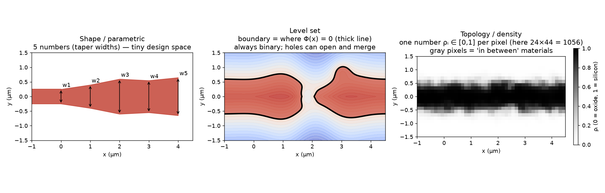

**How to read this figure.** Left: a taper described by five widths $w_1 \dots w_5$, which is the whole design space for parametric optimisation. Middle: a level-set function shown as colour; the thick black curve $\Phi = 0$ is the silicon edge, and the gap in the middle shows that the level set can split one piece of silicon into two. Right: a density map with one value per pixel; the gray pixels at the edges are not real materials and must be removed before fabrication.

The word **topology** means "how many pieces and holes". A shape optimiser cannot add a hole that was not there at the start. A topology optimiser can. That freedom is where the non-intuitive designs come from.

### Local optima and the role of the starting design

The FOM as a function of all the parameters is a landscape with many hills. Gradient ascent only climbs the hill you start on. When it stops at a top, you know that *no small change* helps. That top is a **local optimum**. You do not know whether a higher hill exists elsewhere (the **global optimum**). The problem is **non-convex**, meaning it has many separate hills, and in photonics it always is, because interference creates many competing arrangements.

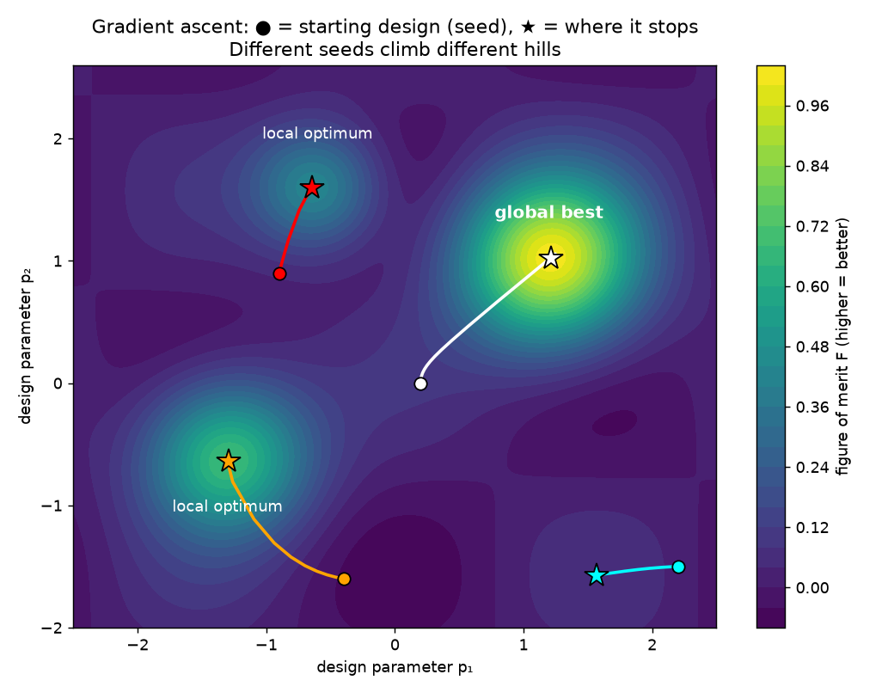

**How to read this figure.** The colour is the FOM over two made-up parameters (bright = good). Each coloured line is a gradient-ascent run: the dot is the starting design (the **seed**), the star is where it stops. Only the white run reaches the best hill. The cyan run stops on a low bump. The lesson: the final design depends on the seed, and "converged" does not mean "best possible".

Practical fixes: start from several seeds, start from a sensible design (for example a plain waveguide), or start from uniform gray ($\rho = 0.5$ everywhere).

### Gray material, filters and projection (fabrication constraints)

A density optimiser left alone produces two kinds of unbuildable result:

- **Gray pixels.** $\rho = 0.4$ means "40 % silicon", a material that does not exist. You must push every pixel to 0 or 1 (**binarisation**).
- **Tiny features.** Nothing stops the optimiser from making 20 nm holes and checkerboards of single pixels. A foundry using 193 nm deep-UV lithography cannot print features much below about 100–150 nm.

The standard cures, which the paper mentions in passing and which you will use in Meep:

1. **Filter.** Blur the density with a small round kernel of radius $R$, for example 100 nm. After blurring, nothing can be smaller than roughly $R$. This sets a **minimum feature size**.
2. **Project.** Push the blurred density through a smoothed step function with steepness $\beta$ and threshold $\eta$ (eta). Values above $\eta$ go to 1, values below go to 0. Start with small $\beta$ (soft, easy to optimise) and raise it step by step (the **β schedule**).
3. **Erode and dilate.** Real fabrication over-etches or under-etches edges by a few nanometres. Moving the threshold to $\eta = 0.6$ makes every feature thinner (**erosion**). Moving it to $\eta = 0.4$ makes every feature fatter (**dilation**). A **robust** optimisation makes the design work for the eroded, nominal and dilated versions at the same time.

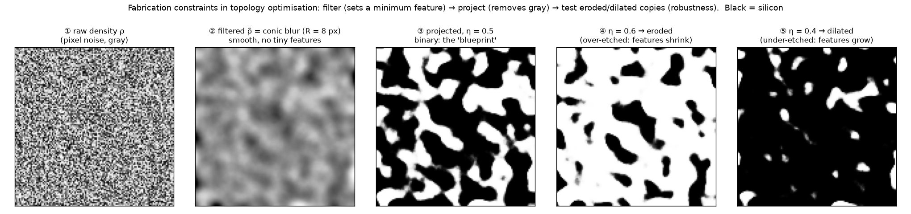

**How to read this figure.** From left to right: a random raw density (noise, all gray); the same after a round blur (smooth, no tiny features); after projection at $\eta = 0.5$ (black/white, the blueprint); and two "fabrication error" versions with $\eta = 0.6$ (features shrink) and $\eta = 0.4$ (features grow). The size of the change is exaggerated here so you can see it. In practice the shift corresponds to roughly ±5–10 nm of edge movement.

### Fundamental bounds

A **bound** is a proven upper limit on how well *any* device can do, whatever its shape. It comes from basic physical laws, not from a particular design. Two examples you already know:

- **Passivity / energy conservation.** A passive device (no gain, no power supply) cannot output more power than goes in. Transmission plus reflection plus loss = 1. So transmission is at most 1.
- **Reciprocity.** In ordinary linear materials (silicon, oxide), light going from port A to port B behaves the same as light going from B to A: $S_{BA} = S_{AB}$. One consequence: no shape of silicon and oxide, however clever, can make an **isolator** (a one-way valve for light). You would need a magnetic material or a time-varying system.

Inverse design can only search *inside* the region the bounds allow. It does not break physics. The deep open question, which the paper ends on, is how close to these bounds real devices get, and what the bound is for a given size, minimum feature and material set.

### Born approximation, Green's function, reciprocity

Box 1 of the paper uses three terms, so here they are:

- **Green's function** $G(\mathbf{x}, \mathbf{x}')$: the field at $\mathbf{x}$ produced by a tiny point source (a dipole) at $\mathbf{x}'$, with the structure in place. If you know $G$, the field from any source is a sum (integral) of point-source responses. In matrix language, $G = A^{-1}$.
- **Born approximation**: if you change the permittivity by a small $\delta\varepsilon$ at some point, the light already there makes the material there wiggle a little more. That extra wiggle acts like a new tiny source, an **induced current** $\delta \mathbf{j} \propto \delta\varepsilon\,\mathbf{E}$. To first order you can use the *old* field $\mathbf{E}$ for this. The small change in the field everywhere is then the field radiated by this new tiny source.
- **Reciprocity**: $G(\mathbf{x}, \mathbf{x}') = G(\mathbf{x}', \mathbf{x})^T$. Swapping source and detector gives the same answer. In matrix terms, $A$ is symmetric: $A^T = A$.

---

## Introduction (abstract and opening, unnumbered in the paper)

> **In one sentence:** The template approach has served photonics well, but for multi-wavelength, nonlinear and densely integrated devices no template is obviously right, and nobody knows how far existing designs are from the best possible.

**What the template approach has achieved.** The paper lists the standard library: multilayer thin films, Fabry–Perot cavities, microring resonators, silicon waveguides, photonic crystals, plasmonic nanostructures, and nanobeam cavities. With these, people have slowed light by more than 100 times (group velocity reduced by over two orders of magnitude), squeezed light into volumes thousands of times smaller than a wavelength cubed, and stored light in micron-sized cavities for tens of millions of oscillation cycles. (At 1550 nm one cycle is about 5.2 fs, so $10^7$ cycles ≈ 50 ns, which corresponds to a quality factor $Q \sim 2\pi \times 10^7 \approx 6 \times 10^7$.)

**Why templates start to fail.** The authors give an example: a tiny cavity for nonlinear optics (for example, turning two photons of one colour into one of double frequency). It must at the same time:

- trap light well at *two or more* frequencies (high Q at each),
- make the light patterns at those frequencies overlap strongly (the **nonlinear overlap**),
- and do it in as small a volume as possible.

No template does all three, and there is no reason to believe the best design is a ring or a photonic crystal. More generally, templates are "repetitive mixtures of highly symmetric shapes described by a small collection of parameters". Tuning a few parameters explores only a tiny corner of all possible structures. Apart from a few known fundamental limits, "typically little is known about how close any one particular device comes to performance limits".

**The paper's promise.** If you could even partly map what is possible in the full design space, you would save a lot of research effort, and you would get a new way to study fundamental limits. The review covers the history and tools (Section I), then applications in nonlinear, topological, near-field and integrated optics, and experimental challenges (Section II), then an outlook (Section III).

**For your half page:** this is the first item in the "claims to fix" column. Templates hit an **intuition ceiling**. A few parameters cannot reach the best performance, and you cannot tell how far from the best you are.

## I. Background

### 1998–2003: the first inverse designs

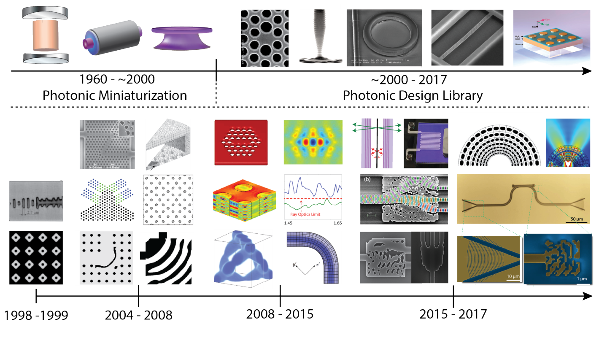

**How to read this figure.** The top strip is the "template era": classic cavities and fibres (1960–2000), then the standard library of photonic crystals, microrings and gratings (2000–2017). The bottom grid is a timeline of inverse-designed structures, grouped by years (1998–99, 2004–08, 2008–15, 2015–17). Look at how the shapes change from left to right: from symmetric lattices with a few tuned holes to the irregular, blobby on-chip splitters and demultiplexers at the bottom right. That change in look is the change from "tune a template" to "search the whole space".

**Old idea, new field.** Working backwards from a desired result to the system is an old idea in physics. Examples are Bernoulli's brachistochrone (which curve lets a ball roll down fastest?), Maupertuis's principle of least action, and Ambartsumian's question of whether you can recover a differential equation from its eigenvalues. The authors name two goals: (1) how much the desired result determines the system, and (2) finding practical algorithms that go from the desired result to a physical structure.

**The two founding papers (late 1990s):**

- **Spühler et al.** designed a coupler from a telecom fibre to a ridge waveguide in SiO₂/SiON. A **genetic algorithm** chose the width of the SiON core every 3 µm along a 138 µm length (so about 46 width values). The result coupled 2 dB better than direct butt-coupling. A 2 dB gain is a factor $10^{0.2} \approx 1.58$ in power.
- **Cox and Dobson** used a **gradient-based** search to widen the band gap of a 2D two-material periodic structure. The gap grew by 34 %.

These two papers set up the two families of methods:

- **Genetic (evolutionary) algorithms.** Make a population of designs, keep the best, mix and mutate them, repeat. They do not use derivatives. That makes them less likely to get stuck in bumpy regions of the landscape, but much more likely to need many more iterations, and they can miss good local optima.
- **Gradient-based algorithms.** Follow the slope. Fast and steady, but they only find the local optimum near the start.

As you saw in the background, gradient methods win once the number of parameters is large, *if* gradients are cheap. The adjoint method makes them cheap.

### 2004–2008: from tuning to large-scale methods

**Early extensions.** In the five years after the first papers, people extended the methods: plane-wave expansions for inverse design of 3D face-centred-cubic photonic crystals (Doosje et al.); in-plane electric fields (Cox & Dobson); fibre-to-taper coupling using coarse-then-fine parameterisations (Felici & Heinz); cavity design written as a Lagrangian maximisation (Geremia et al.); mode matching between photonic-crystal and fibre waveguides with a genetic algorithm (Jiang et al.); and radio-frequency patch antennas (Kiziltas et al.). Almost all of these were either **band-gap optimisation** or **mode coupling**, with high symmetry and few parameters. Meanwhile, a related field, **sensitivity analysis** (how much does a defect or roughness change performance?), was already using large-scale methods and showing big speed-ups. That is the same mathematics as the adjoint gradient.

**The 2004–2005 turning point.** Groups around Jensen and Sigmund; Burger, Osher and Yablonovitch; Håkansson, Sánchez-Dehesa and Sanchis; and Preble and Lipson changed the field in two ways:

1. **New applications:** photonic-crystal waveguide bends with under 1 % loss over a broad band; demultiplexers only a few wavelengths thick; wider band gaps.
2. **New tools:** adjoint-based **topology optimisation** and **level-set** methods, plus better genetic algorithms. These made inverse design general and efficient.

**Why level sets and topology optimisation matter.** They give a *systematic* way to describe all possible designs, instead of a hand-picked template.

#### The level-set method, Eq. (1)

The design region $D$ is described by a smooth function $\Phi(\mathbf{x})$ defined at every grid cell $\mathbf{x} \in D$. Two materials are assigned by thresholds:

$$\Omega_1 = \{\Phi(\mathbf{x}) < \text{low}\}, \qquad \Omega_2 = \{\text{high} < \Phi(\mathbf{x})\}. \tag{1}$$

In words: wherever $\Phi$ is below the "low" level, put material 1 (say oxide). Wherever it is above the "high" level, put material 2 (silicon). Usually low = high = 0, so the boundary is the curve $\Phi = 0$. The smooth, continuous function $\Phi$ is mapped to a two-material (binary) structure.

You then change $\Phi$ step by step, either through an equation of motion for the boundary (the **Hamilton–Jacobi** equation, which moves the edge with a chosen speed along its normal) or directly using gradients. The structure settles at a local maximum of the FOM. Benefits:

- the boundary can float anywhere, without you writing down a formula for the shape;
- holes (voids) can appear;
- the method naturally avoids single-pixel checkerboard patterns, because $\Phi$ is smooth.

#### Topology optimisation, Eq. (2)

Topology optimisation goes further. Every node of the computational grid (a line segment in 1D, a pixel in 2D, a voxel in 3D) is its own design parameter, "relaxed" to vary continuously. Following Jensen and Sigmund, the permittivity of node $i$ is

$$\epsilon_i = \epsilon_1 + \lambda_i\,(\epsilon_2 - \epsilon_1), \qquad \lambda_i \in [0, 1]. \tag{2}$$

Symbols: $\epsilon_1, \epsilon_2$ are the permittivities of the two materials; $\lambda_i$ is the **relaxation parameter** (the density) of node $i$. When $\lambda_i = 0$ the node is material 1, when $\lambda_i = 1$ it is material 2, and in between it is a linear blend.

*Why this form?* It is the simplest smooth way to connect two materials. Because $\epsilon_i$ depends smoothly (linearly) on $\lambda_i$, you can take derivatives with respect to $\lambda_i$ and use gradient methods. With a strict "0 or 1" choice there would be no derivative at all. The cost is that the optimiser must, in the end, be forced back to "only extreme values". That is the gray-material problem.

*Numbers.* Oxide ($\epsilon_1 = 2.07$) and silicon ($\epsilon_2 = 12.11$): $\lambda = 0.2 \Rightarrow \epsilon = 2.07 + 0.2 \times 10.04 = 4.08$; $\lambda = 0.5 \Rightarrow \epsilon = 7.09$; $\lambda = 0.8 \Rightarrow \epsilon = 10.10$. None of these intermediate materials exists.

!!! warning "Two different lambdas"
    The paper uses $\lambda_i$ in Eq. (2) for the material density, and $\bar\lambda$ in Box 1 for the adjoint field. They have nothing to do with each other, and neither is the wavelength. On this site we write the density as $\rho_i$, as Meep does.

**Why gradients are needed.** In both approaches, the number of possible designs is enormous, about as large as the number of grid nodes. Any hope of convergence needs gradient-based steps. There is no proof that you will find the global optimum, but in practice gradient methods find good designs (and in a few special cases provably globally optimal ones). The cost of computing the gradients is made manageable by the adjoint method in Box 1.

### Box 1: the adjoint method

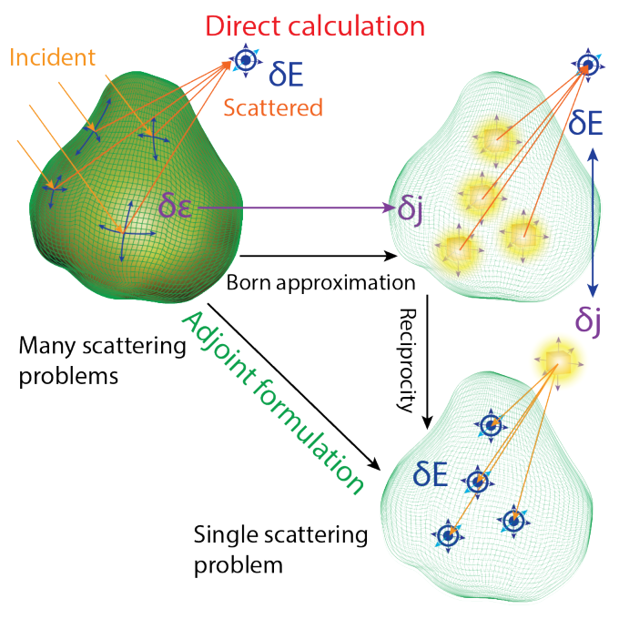

**How to read this figure.** Top left: an object (green) lit by incident light, scattering a field to a detector ($\delta E$, blue target symbol). "Direct calculation", following the arrow to the right: each small permittivity change $\delta\epsilon$ inside the object becomes a small induced source $\delta j$ (yellow glows, Born approximation), and you would have to compute the field from each one at the detector, which means many scattering problems. "Adjoint formulation", following the diagonal arrow: by reciprocity, swap source and detector. Put *one* source at the detector position and compute the field it makes at every point inside the object. That is a single scattering problem.

Now the equations, symbol by symbol.

**Setup.**

- $\mathcal{F}[\psi(\mathbf{x}), \epsilon(\mathbf{x})]$: the **objective functional** (the FOM). It depends on the field and possibly also directly on the structure. A *functional* is a function whose input is a whole function (a field over space) and whose output is a number.
- $\psi(\mathbf{x})$: the field (for us, $\mathbf{E}$).
- $\epsilon(\mathbf{x})$: the design (the permittivity map).
- $\overline{\mathcal{M}}[\psi, \epsilon] = 0$: the **constraints** linking field and design, which are Maxwell's equations. In our matrix language, $\overline{\mathcal{M}} = A(\epsilon)\,\psi - b$.

**Step 1: chain rule, Eq. (3).** The FOM changes when $\epsilon$ changes in two ways: directly, and through the change in the field:

$$\delta_{\epsilon(\mathbf{x})}\mathcal{F} = \frac{\delta \mathcal{F}}{\delta \epsilon(\mathbf{x})} + \frac{\delta \mathcal{F}}{\delta \psi(\mathbf{x})}\,\frac{\delta \psi(\mathbf{x})}{\delta \epsilon(\mathbf{x})}. \tag{3}$$

The first two pieces, $\delta\mathcal{F}/\delta\epsilon$ and $\delta\mathcal{F}/\delta\psi$, are easy: you wrote $\mathcal{F}$ yourself, so you can differentiate it by hand. The hard piece is $\delta\psi/\delta\epsilon$: "how does the field *everywhere* change when the material at $\mathbf{x}$ changes?"

**Step 2: differentiate the constraint, Eq. (4).** Maxwell's equations must hold before and after the change, so the total change of $\overline{\mathcal{M}}$ is zero:

$$\delta_{\epsilon(\mathbf{x})}\overline{\mathcal{M}} = \frac{\delta \overline{\mathcal{M}}}{\delta \epsilon(\mathbf{x})} + \frac{\delta \overline{\mathcal{M}}}{\delta \psi(\mathbf{x})}\,\frac{\delta \psi(\mathbf{x})}{\delta \epsilon(\mathbf{x})} = 0. \tag{4}$$

Solving for the hard piece:

$$\frac{\delta \psi}{\delta \epsilon} = -\left(\frac{\delta \overline{\mathcal{M}}}{\delta \psi}\right)^{-1} \frac{\delta \overline{\mathcal{M}}}{\delta \epsilon}.$$

In matrix language: $\delta\overline{\mathcal{M}}/\delta\psi = A$ (the system matrix), and $\delta\overline{\mathcal{M}}/\delta\epsilon_i = (\partial A/\partial \epsilon_i)\,\psi$. So $\partial\psi/\partial\epsilon_i = -A^{-1}(\partial A/\partial\epsilon_i)\psi$. This is "solve Maxwell again, with a new source $-(\partial A/\partial\epsilon_i)\psi$". Done directly, it needs **one solve per design parameter**. The other route, computing $A^{-1}$ in full, gives a dense matrix the size of the grid squared, which is even worse.

**Step 3: substitute, Eq. (5).** Put (4) into (3):

$$\delta_{\epsilon(\mathbf{x})}\mathcal{F} = \frac{\delta \mathcal{F}}{\delta \epsilon} - \underbrace{\frac{\delta \mathcal{F}}{\delta \psi}\left(\frac{\delta \overline{\mathcal{M}}}{\delta \psi}\right)^{-1}}_{\bar\lambda^{\,T}}\;\frac{\delta \overline{\mathcal{M}}}{\delta \epsilon}. \tag{5}$$

**The key move: change the order of multiplication.** Look at the product $\frac{\delta\mathcal{F}}{\delta\psi}\, A^{-1}\, \frac{\delta\overline{\mathcal{M}}}{\delta\epsilon}$. The direct route computes $A^{-1}\frac{\delta\overline{\mathcal{M}}}{\delta\epsilon}$ first, which is one solve for each of the $N$ parameters. But matrix multiplication is associative, so you can instead compute $\bar\lambda^T = \frac{\delta\mathcal{F}}{\delta\psi} A^{-1}$ first. That is **one** row vector, independent of which parameter you are asking about. Then each gradient entry is just a cheap dot product of $\bar\lambda$ with $\frac{\delta\overline{\mathcal{M}}}{\delta\epsilon_i}$.

**Step 4: the adjoint equation, Eq. (6).** Transposing $\bar\lambda^T A = \frac{\delta\mathcal{F}}{\delta\psi}$ gives a linear equation for $\bar\lambda$:

$$\left(\frac{\delta \overline{\mathcal{M}}}{\delta \psi(\mathbf{x})}\right)^{\dagger} \bar{\lambda}(\mathbf{x}) = \frac{\delta \mathcal{F}}{\delta \psi(\mathbf{x})}. \tag{6}$$

The $\dagger$ ("dagger") means the **adjoint operator**, the operator version of the (conjugate) transpose. That is where the method gets its name. Read Eq. (6) as: "solve the same kind of Maxwell problem, with the *transposed* operator, and with a source equal to $\partial\mathcal{F}/\partial\psi$." The source sits where the FOM is measured (for example at the output waveguide). Its solution $\bar\lambda$ is the **adjoint field**.

Two remarks from the paper:

- If Maxwell's equations are linear in the field (they are, for ordinary materials), then $\delta\overline{\mathcal{M}}/\delta\psi$ is just the usual Maxwell operator. The same solver, the same matrix factorisation and the same preconditioners can be reused for the adjoint solve. For reciprocal materials the operator is symmetric ($A^T = A$), so the adjoint problem is literally *another ordinary simulation* with a different source.
- "It is remarkable that adjoint methods yield full derivative information from the solution of a problem that is, in every respect, no harder to solve than the original problem." And the method is not limited to the simple reciprocal case. It also works, with more care, for non-reciprocal and even nonlinear materials.

**The scattering picture (the right half of Box 1).** Suppose you want to change the power a body scatters to a detector. The direct route: each change $\delta\epsilon$ at position $\mathbf{x}$ creates (Born approximation) an induced source $\delta j = \delta\epsilon \times$ (incident field at $\mathbf{x}$). You would compute the field each such source makes at the detector, which is as many simulations as there are positions, and take its inner product with the original scattered field. Reciprocity lets you swap roles: put one source *at the detector* (with an amplitude set by the original scattered field) and compute the field it makes *inside the body*. One simulation. The gradient at each $\mathbf{x}$ is then (original field at $\mathbf{x}$) × (adjoint field at $\mathbf{x}$).

**Cost, in numbers, for your half page.** One gradient = 1 forward + 1 adjoint simulation, about **2×** the cost of evaluating the FOM once. It is *not* $N\times$. The full derivation with a numerical check is on [Monday's page](../week-04/day-01-mon-12-oct-2026-lalau-keraly-2013.md).

### 2008–2015: more complex problems, and the price of generality

**More applications.** Solar energy harvesting, dispersion engineering, wavelength focusing, nonlinear switching. With bigger gains came new questions: how to add realistic constraints, and how to handle larger design regions.

**The price of generality (an important passage for your "costs" column).**

- **Feature size.** Without constraints, the smallest feature in a level-set or topology design is limited only by the simulation grid. So the optimiser happily uses features too small to make.
- **Gray structures.** In topology optimisation the permittivity is allowed to vary continuously to make gradients possible. Depending on how material constraints are imposed, this produces intermediate "gray" structures. Many iterations are spent on graded-index designs before the optimiser settles on binary ones. Finding the right trade-off, through **penalisation** (making gray values costly in the FOM) and **filters** on the parameters, was a main theme of these years.

**Key results of the period:**

- **Tsui & Hirayama (2008), 90° bend.** They replaced the linear interpolation of Eq. (2) by a smooth function that approaches a step. This is the ancestor of today's tanh projection. It gave similar convergence and similar structures to the established penalisation methods.
- **Wang et al., slow-light photonic-crystal waveguides.** Topology optimisation reached group indices near 300 (light slowed 300×), better than few-parameter shape optimisation. But simple shape variations reached gains of the *same order of magnitude*. This is an honest data point: sometimes the template, well tuned, is almost as good.
- **Robustness to fabrication.** Sigmund introduced **erosion and dilation** operators: optimise the design while also checking thinned and thickened versions of it. Oskooi et al. made robust waveguide tapers by checking performance against geometry changes in the worst direction (the direction of steepest decrease of the FOM). The aim in both cases: "some degree of optimality while remaining robust with respect to structural variations". This is exactly your project's topic.
- **Minimum feature in level sets: geometry projection.** Frei, Johnson et al. wrote the level-set function as a short sum of radial basis functions. The width of those basis functions automatically sets the smallest feature. They tripled the Purcell factor (the enhancement of light emission) of a single-defect photonic-crystal cavity.

The paper then describes three ideas for computational efficiency.

**Relaxation methods (Lu et al.).** Split the problem into two easier sub-problems and alternate between them:

1. Treat Maxwell's equations as "soft": look for a field that both scores well on the FOM *and* nearly satisfies Maxwell's equations (small **residual**, meaning a small amount by which the equation fails).
2. Fix that field and find the permittivity that makes the residual as small as possible.

Each step is simpler than the full problem. Geremia et al. and Englund et al. used similar ideas for cavities.

**Subspace methods (Men et al.).** If you know which few modes control the FOM, you can restrict the problem to those modes (a **subspace**). If each step changes the structure only a little, the modes of one structure approximate those of the next. The resulting equations can be solved with **semidefinite programming**, a kind of convex optimisation that finds global optima of its (approximated) problem. Men et al. used this for band gaps. A second trick handles **many frequencies** at once. Multiply the FOM by a window function that is peaked around the frequencies of interest (for example a Lorentzian), and use complex analysis (the residue theorem) to replace a whole frequency integral by a few evaluations at complex frequencies. This only works if the FOM is an analytic function of frequency. With it, Men et al. designed 3D cavities with Purcell factors above $10^5$.

**Transformation optics + inverse design.** **Transformation optics** designs a material by imagining a stretched or bent coordinate system. For example, to guide light round a 90° bend without scattering, any material that "looks like" a 90° rotation of space works. But the natural transformations demand impossible materials (extreme or anisotropic permittivities, meaning permittivities that differ by direction). Inverse design is a good partner: the transformation tells you exactly what boundary behaviour is needed, so you do not even have to solve Maxwell's equations at every step. You can simply optimise, say, how anisotropic the material is, using derivative information alone.

**A hint of a fundamental limit (bounds, part 1).** Men et al. found that, even *without* fabrication constraints, their optimiser could not find 3D photonic crystals with a fractional band gap larger than about **30 %** for index contrasts below 1:3.6 (about silicon:air). The **fractional band gap** is the gap width divided by its centre frequency, $\Delta\omega/\omega_{mid}$. That is only slightly better than hand-designed fcc crystals. With so many degrees of freedom and starting designs tried, this suggests there is "not much room for further bandgap engineering". Intuitively, materials must limit the band gap however they are arranged. But, the paper notes, a *proof* of such a bound was still open in 2018. Keep this example for your bounds paragraph: it shows inverse design acting as a *probe* of limits, not only as a device factory.

## II. Current and emerging applications

### Nonlinear optics

**Why cavities help nonlinear optics.** **Nonlinear** effects are effects where the material's response depends on the light's strength. Examples are second-harmonic generation ($\chi^{(2)}$, doubling the frequency) and four-wave mixing ($\chi^{(3)}$). They are weak, so you want strong fields for a long time. A resonator gives both: it stores light (long interaction time) and concentrates it (high intensity). History: large etalon cavities in the 1960s, then millimetre-to-micron whispering-gallery resonators, then wavelength-scale cavities.

**What controls the efficiency.** For a wavelength-scale device, a small set of numbers describes everything:

- the resonance frequencies and their **quality factors** $Q$ (how long each resonance stores light: $Q$ ≈ number of cycles × $2\pi$ before the energy drops to $1/e$);
- the **nonlinear overlap integral** $\beta$: how well the field patterns of the interacting modes overlap inside the nonlinear material. This generalises **phase matching** in long waveguides.

All must be tuned *at once*.

**Why templates struggle here.**

- A band gap usually covers only one of the frequencies involved.
- Index-guided resonators (rings) have high $Q$ and broad bandwidth but must trade confinement against radiation loss.
- Plasmonic resonators confine light very well but always have metal absorption.
- For weak nonlinearities, distinct modes of one structure are **orthogonal** (their overlap integral in the linear sense is zero), which tends to make the nonlinear overlap small too.
- $\chi^{(3)}$ devices also need corrections for self- and cross-phase modulation, which are hard to tune separately with a few parameters.

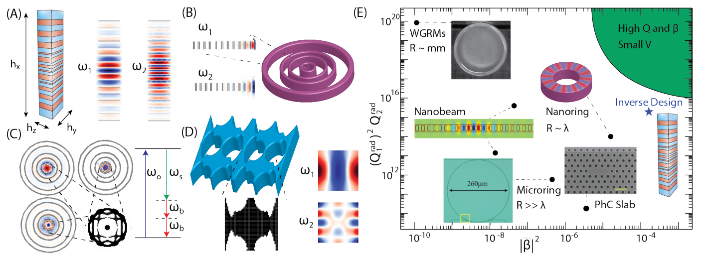

**How to read this figure.** Panels A–D show topology-optimised nonlinear resonators: a layered micropillar (A) with its two mode profiles at $\omega_1$ and $\omega_2$; a multi-ring structure (B); ring cross-sections for a $\chi^{(3)}$ process (C), where pump $\omega_o$ makes signal $\omega_s$ and idler photons; and a gallium phosphide metasurface (D). Panel E is the key chart. The horizontal axis is the nonlinear overlap $|\beta|^2$, the vertical axis is the product of radiative quality factors $(Q_1^{rad})^2 Q_2^{rad}$, both on log scales. Classic devices (whispering-gallery resonators, nanobeams, microrings, nanorings, photonic-crystal slabs) sit as black dots. The inverse design (blue star) sits far to the right, with much larger overlap at still-high $Q$, heading towards the green "high Q and β, small V" corner.

**Results.** For $\chi^{(2)}$ second-harmonic generation and $\chi^{(3)}$ difference-frequency generation, the inverse designs have nonlinear figures of merit **one to three orders of magnitude** (10× to 1000×) better than any earlier design up to the millimetre scale. The optimised structures share some features: less symmetry, large $Q$, and large overlap. The optimiser finds intuitive designs "overly simplistic". They do not use interference enough to shape the modes so they match. A practical point: large overlap is better than very high $Q$, because overlap is less sensitive to fabrication errors and allows more bandwidth (a high-$Q$ resonance is narrow, and a small fabrication shift moves it off target).

**Why it matters.** Wavelength-scale $\chi^{(2)}$/$\chi^{(3)}$ devices are needed for low-threshold lasers, frequency combs, imaging, supercontinuum sources, spectroscopy, single-photon sources and quantum information processing.

### Exceptional and topological photonics

**Background terms.**

- A **Hermitian** system is one without loss or gain. Its eigenvalues (the mode frequencies) are real, and two modes can sit at the same frequency (a **degeneracy**) while staying distinct.
- An **open** system, one that leaks light, is **non-Hermitian**: its mode frequencies are complex (the imaginary part is the decay rate).
- At an **exceptional point** (EP), two or more complex eigenvalues *and their eigenvectors* merge into one. The set of modes is then incomplete: you lose a mode, not just a frequency.

**Why EPs are strange.** Near an EP, the surviving mode becomes **self-orthogonal** (its overlap with itself, in the non-Hermitian sense, goes to zero). This is measured by the **Petermann factor**, which diverges. The Green's function gains a higher-order pole whose order equals the number of merged modes. These effects are linked to one-way (directional) transport, unusual lasing and enhanced sensing. EPs are also predicted to boost spontaneous emission and frequency conversion.

**How EPs were made.** Using gain and loss in coupled resonators, using interacting waveguides, and, more recently, using purely passive photonic-crystal lattices. The variety suggests that, with the right design tools, both the order and the location of EPs can be engineered.

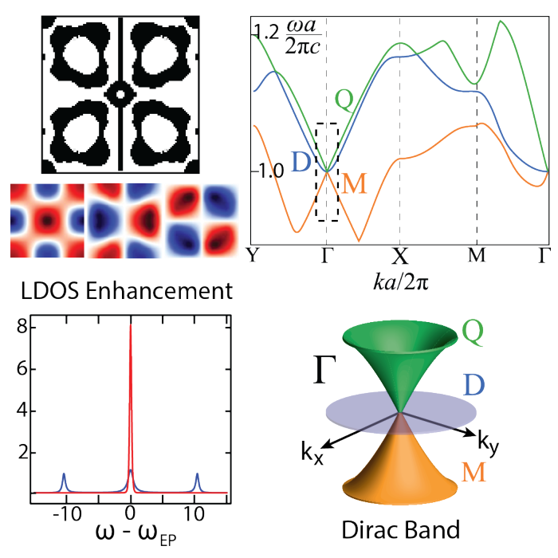

**How to read this figure.** A 2D square lattice found by topology optimisation, its band diagram, a plot of local-density-of-states (LDOS) enhancement against frequency offset, and a 3D sketch of a Dirac cone in momentum space ($k_x$, $k_y$). At the $\Gamma$ point (the centre of the Brillouin zone, $k = 0$), three modes, a monopole (M), a dipole (D) and a quadrupole (Q), merge into a **third-order** exceptional point. The takeaway: EPs are not tied to special, hand-picked geometries. An optimiser can make them where you want, and they boost the LDOS (how strongly an emitter at a point can radiate).

**Topology link.** The Dirac-cone band structure that comes with such an EP is a known stepping stone towards **topological photonics**: edge states immune to backscattering, photonic topological insulators, Weyl points. Extending inverse design to chiral modes and omnidirectional Dirac cones looks promising.

### Nanoscale optics and metasurfaces

**Near-field and nano-optics examples (Fig. 4 A–C):**

- **Bhargava & Yablonovitch:** a **near-field transducer** for heat-assisted magnetic recording (focusing light to a tiny hot spot on a hard disk), designed by a boundary-optimisation method. It has **50 % less self-heating** than the industry standard.
- **Lee et al.:** used the **boundary element method** (a solver that only discretises surfaces) to optimise optical torque on nanoparticles. The torque on a triangular particle's quadrupole mode increased **20×**.
- **Deng & Korvink:** 3D topology optimisation of a single-material cloak around a perfectly conducting sphere, giving about **10× less scattered power**.

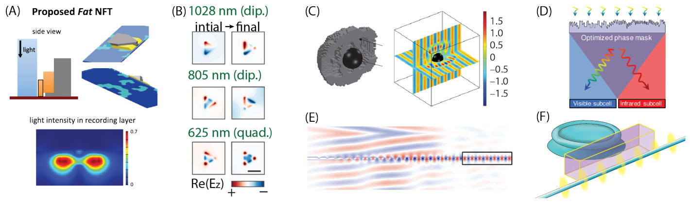

**How to read this figure.** Six applications of adjoint methods from 2015–2018. (A) The proposed near-field transducer and the light intensity in the recording layer. (B) Fields on a triangular nanoparticle before and after optimisation for dipole and quadrupole modes. (C) A cloaked object and its field. (D) An optimised phase mask that splits sunlight into visible and infrared parts. (E) Coupling free-space light into a waveguide mode. (F) Coupling between a ring resonator and a waveguide at several frequencies. The message is breadth: the same gradient machinery applies to very different physics.

**Bounds, part 2.** For some problems there are known fundamental limits from energy conservation or reciprocity. But in many cases, especially near-field and metasurface problems, "no such bounds exist or are only beginning to emerge". So it is unclear how good a design *could* be. Without a bound, a claim like "our device is 20× better" cannot tell you whether you are at 5 % or 95 % of what is possible.

**Metasurfaces (Fig. 5).** A **metasurface** is a thin, patterned layer that shapes the phase, amplitude or polarisation of light passing through it, like a flat lens or grating. Inverse design has produced:

- **Sell et al.:** a **metagrating** (a periodic metasurface that sends light into chosen diffraction angles) that separates 1000 nm and 1300 nm TE light into different angles with **75 % absolute efficiency**;
- **Callewaert et al.:** a 3D polarisation splitter;
- **Shen et al.:** a topology-optimised polariser.

These raise a broader question: how much phase and polarisation control can you get per unit thickness of structured material? That is another question about bounds.

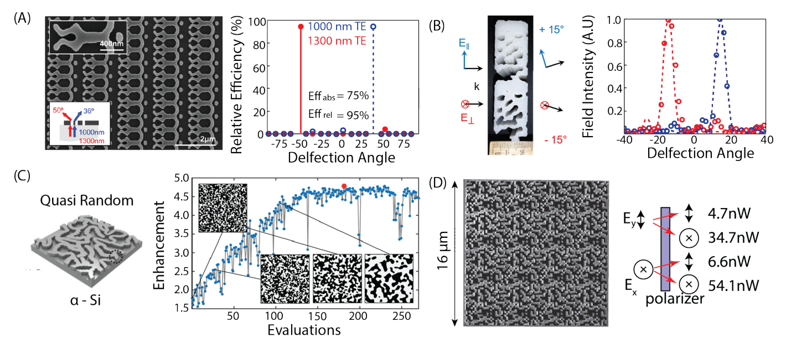

**How to read this figure.** (A) SEM image of a metagrating, and its relative efficiency versus deflection angle at two wavelengths: each wavelength peaks at a different angle. (B) SEM of a 3D polarisation splitter and its field intensity at different angles. (C) A quasi-random amorphous-silicon surface for light trapping, with a curve of enhancement versus number of evaluations: the optimisation improves step by step. (D) A large-area topology-optimised polariser and a sketch of power and polarisation of the transmitted light. All four were fabricated. Inverse design has left the computer.

**Solar energy.** Two things limit simple pn-junction solar cells: trapping enough light in the thin absorbing layer, and the width of the solar spectrum (one band gap cannot use all colours efficiently).

- **Shen et al. (2014)** used Fourier-based ("concurrent") inverse design of quasi-random surface textures that can be made by wrinkle lithography. Light trapping in amorphous silicon improved about **5×** over 400–1200 nm.
- **Xiao et al. (2016)** made a splitter that separates visible from infrared light with **69.5 %** efficiency, so two cells with different band gaps can sit side by side.

**On-chip mode couplers and wavelength demultiplexers (your area).** Dense chips need many wavelength channels on one waveguide (to save space) *and* access to each channel separately. That needs **wavelength-division multiplexing** (WDM) components. Adjoint-optimised demultiplexers (Frellsen et al., Piggott et al.) fit in a few square microns at telecom wavelengths with transmission loss below about 5 dB. ($-5$ dB means $10^{-0.5} \approx 32$ % of the power arrives.) Shen et al. and Mak et al. got similar results. A three-port power splitter designed with a fabrication-tolerant algorithm delivers **at least 23 %** to every port from 1400 to 1700 nm. A perfect three-way split would give 33.3 % per port, which is −4.8 dB. 23 % is −6.4 dB, so the worst port is about 1.6 dB below ideal, over a 300 nm band.

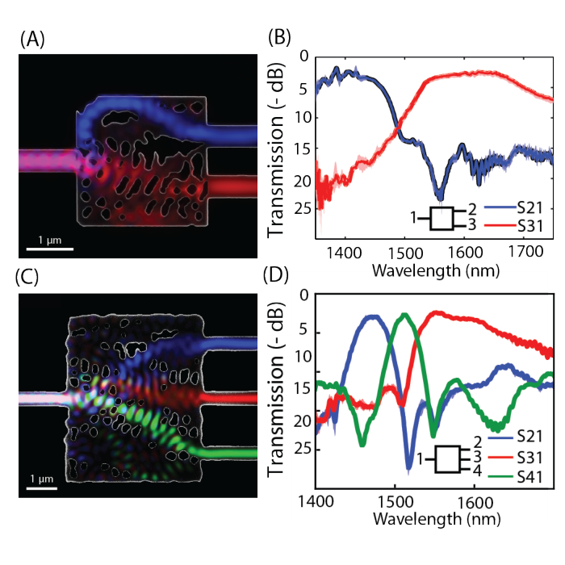

**How to read this figure.** (A) SEM image of a fabricated two-channel wavelength splitter (scale bar 1 µm) with the simulated field overlaid: blue light goes to the upper port, red to the lower. (B) Its measured transmission in −dB (0 at the top is perfect) against wavelength: port 2 (blue, S21) is best near 1400–1450 nm, port 3 (red, S31) near 1550–1650 nm, and they cross near 1490 nm. (C, D) The same for a three-channel splitter, where each port peaks at a different wavelength (about 1470, 1510, 1560 nm). Note the irregular holes, with features near the 100 nm scale. These were made by electron-beam lithography, which is the point of the next section.

**More speculative uses (Fig. 4 E–F).** Coupling light from free space into a waveguide (Niederberger et al.), and coupling a ring resonator to a waveguide at several frequencies with wavelength-scale elements. Both are everyday lab problems, yet there are surprisingly few high-efficiency techniques beyond slow (adiabatic) tapers.

### Experimental challenges

This section is the core of your "costs" column. Read it twice.

**The headline problem.** Since 2004, working inverse-designed devices have been shown in essentially every area: photonic-crystal bends and splitters, passive silicon-photonics components, metasurfaces. Yet in 2018 **none had broad industrial use**. The reason is simple: nearly all were made with **electron-beam lithography**, because inverse-design algorithms naturally produce tiny features. E-beam is slow and expensive. Industry needs **photolithography** (optical lithography, like deep-UV 193 nm at a foundry), which is fast but cannot print very small or very sharp features.

**Why minimum features are hard.** In 1D designs (for example layer thicknesses) a minimum-feature rule is easy to impose. In 2D and 3D it is much harder: "small" can mean a narrow line, a narrow gap, or a sharp corner, in any direction.

**Solution 1: big pixels.** Use design pixels larger than the minimum feature, and remove gray at the end. The design is then guaranteed fabricable. But this restricts the design space too much: it forbids smooth curves even where they would not need small features.

**Solution 2: build constraints into the optimisation.**

- For **topology** optimisation: **convolution filters** (blurs) that smear out small features, and **erosion/dilation** operations that mimic fabrication errors. These are the tools in the generated figure above.
- For **boundary (level-set/shape)** optimisation: limit the **minimum radius of curvature** (no sharp corners) and remove gaps or bridges narrower than a threshold width.

These improve fabrication tolerance. They have been tested with e-beam lithography, and simulations suggest they would work with photolithography if **optical proximity correction** (OPC: pre-distorting the mask so the printed shape comes out right) is used. **But** they are not robust to photolithography *process variations* such as **defocus** and **dose** errors. In 2018, handling these was an open problem.

**The computing-cost problem.** Real devices need full 3D, fully vectorial simulations. "Dozens to hundreds of simulations are required to design a single device." This becomes too expensive as the design region grows. It also makes it hard to inverse-design interfaces with large structures, such as a single-mode fibre (about 10 µm mode diameter). Faster solvers, for example iterative ones, would directly widen what can be designed.

*Numbers.* A 3D FDTD run of a 3 × 3 µm device at 20 nm resolution might take around 10 minutes on a workstation. With 200 iterations × 2 simulations × 3 robustness corners (eroded, nominal, dilated) = 1200 simulations ≈ 200 hours. Compare one template sweep of 20 runs.

## III. Summary outlook

> **In one sentence:** The future is bright, but three things are needed: robustness to real fabrication, better knowledge of fundamental bounds, and faster simulation (possibly with machine learning).

**What remains open.** Mature, well-defined problems in chip-scale integration and cavity design, and newer areas (energy capture, nonlinear devices) with only early work. Also: fluctuation physics and near-field heat transfer. Topology optimisation of heat-transfer systems exists only in 1D so far, but could clarify the practical limits of heat transfer. And extending inverse design to **active** devices (modulators, lasers), which often limit system performance.

**The three improvements the authors call for:**

1. **"First and foremost"**: robustness of designs to process variations in photolithography, to allow high-volume fabrication. At the same time, better nanoscale lithography may make more of the intricate multi-scale features and permittivity gradients that algorithms like to produce actually fabricable.
2. **Fundamental bounds.** Inverse design can in principle explore the *whole* space of fabricable devices. So the paper asks: "for a given design area, minimum feature size, and selection of materials, what is the ultimate achievable performance of an optical device for a particular function?" Knowing such bounds "would help guide future work in all of photonics."
3. **Better simulations and algorithms** to design larger devices, including **machine learning** for fast, iterative Maxwell solvers.

The closing line: in the quest for optimal photonic designs, widespread use of inverse design "seems not only sensible but unavoidable".

---

## Re-reading on Fri 27 Nov 2026: bounds and what is actually achievable

On 27 Nov you come back with Meep experience: an adjoint gradient, a conic filter, a β schedule. Re-read only the passages on bounds and achievability. Here is a map of them and what each says.

| Where in the paper | What it says about bounds | What it says about what is achievable |
|---|---|---|
| Introduction | Apart from known bounds (refs 13–15), little is known about how close any device is to the limits | Templates cover only a small, symmetric corner of design space |
| Men et al. band gaps (end of §I) | Optimiser cannot exceed ~30 % fractional gap for contrast < 1:3.6, which *suggests* a material bound, unproven | Only slightly above hand-designed fcc crystals: inverse design found the ceiling, not a breakthrough |
| Wang et al. slow light (§I) | — | Topology optimisation gave group index ~300, but simple shape tweaks reached the same order of magnitude |
| Metasurfaces / near field (§II) | Bounds from energy conservation and reciprocity exist for some problems; for near-field and metasurfaces they "do not exist or are only beginning to emerge" | Large factors (20× torque, 10× cloaking, 5× light trapping), but with no bound you cannot say how good they are |
| Experimental challenges (§II) | — | Achievable *in fabrication* is limited by lithography (e-beam vs photolithography) and process variations, not by the optimiser |
| Outlook (§III) | The key open question: best possible performance for given area, minimum feature, materials | Robustness to process variation named as the first priority |

**What "bounded by reciprocity and passivity" means concretely.**

- **Passivity** (no gain): power out ≤ power in. For a splitter, total transmission ≤ 1. Every dB of "insertion loss" is power lost to reflection, radiation or absorption, and no design can recover more than 100 %.
- **Reciprocity** (linear, non-magnetic materials, which is everything in a silicon/oxide device): the scattering matrix is symmetric, $S = S^T$. So no passive SOI structure is an isolator. A lossless, reciprocal 1×2 splitter used backwards as a 2×1 combiner cannot combine two inputs of arbitrary relative phase into one output without loss.
- **Materials and size**: with only $\varepsilon = 2.07$ and $12.1$ to play with, in a 2 × 2 µm footprint, there is a limit on how fast light can be redirected, how many wavelengths can be separated, and over what bandwidth. Since 2018 a "bounds" literature has started to compute such limits numerically for photonic design problems. Examples are the computational bounds of Angeris, Vučković & Boyd (2019), and reviews of physical limits in electromagnetism by the Rodriguez group and colleagues. Look these up and verify the identifiers before citing them.

**Draft of the 27 Nov paragraph (rewrite it in your own words).** *Inverse design does not beat physics. For a given material palette, footprint, minimum feature and bandwidth there is an upper limit on performance, set by passivity, reciprocity and the available index contrast. Molesky et al.'s real claim is that adjoint optimisation finds designs closer to that limit than parametric intuition does: better than human intuition, bounded by reciprocity and passivity. The band-gap result of Men et al. shows the other use: when an optimiser with $10^5$ degrees of freedom cannot beat ~30 %, that is evidence of a bound. For my project, the claim cannot be "a better device than the state of the art". It has to be "here is what robustness costs in performance, measured", because that cost is what the bounds literature predicts but rarely measures. The interesting number is not the efficiency, it is the efficiency you keep when the geometry moves.*

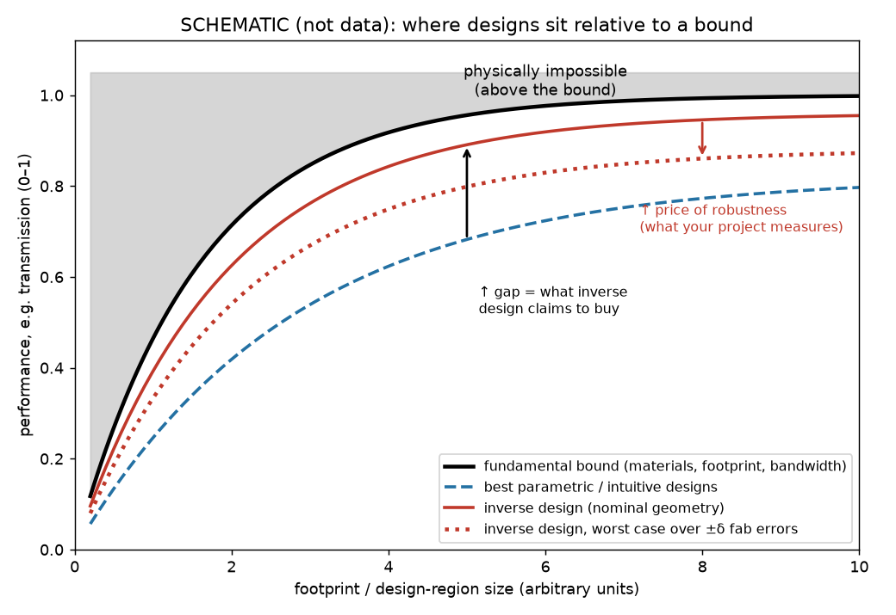

**How to read this figure.** This is a *schematic*, not data. The black curve is a fundamental bound: performance can never lie in the gray region above it. Bigger footprints allow more, so the curve rises. The blue dashed curve is the best template designs. The red solid curve is inverse design on the nominal geometry, closer to the bound. The black arrow is what inverse design claims to buy. The red dotted curve is the same inverse designs evaluated at their worst-case fabrication error. The red arrow, the "price of robustness", is the quantity your project wants to measure.

---

## A tiny runnable example

This snippet shows Eq. (2), the projection that removes gray, and the gradient-cost arithmetic from the "costs" column.

```python
import numpy as np
eps_ox, eps_si = 1.44**2, 3.48**2              # the two materials (eps = n^2)

def eps_of(rho):                               # Molesky Eq. (2): linear interpolation
    return eps_ox + rho * (eps_si - eps_ox)

def project(rho, beta, eta=0.5):               # smoothed step: pushes rho towards 0 or 1
    num = np.tanh(beta * eta) + np.tanh(beta * (rho - eta))
    return num / (np.tanh(beta * eta) + np.tanh(beta * (1 - eta)))

rho = np.array([0.0, 0.2, 0.45, 0.55, 0.8, 1.0])
print("eps (no projection):", np.round(eps_of(rho), 2))
for beta in [1, 8, 64]:
    r = project(rho, beta)
    gray = np.mean(4 * r * (1 - r))            # 0 = fully binary, 1 = all 50% gray
    print(f"beta={beta:3d}  rho_proj={np.round(r, 3)}  grayness={gray:.3f}")

# what a gradient costs: a 2 um x 2 um region on a 20 nm grid, 220 nm thick
nx = ny = 2000 // 20; nz = 220 // 20
N = nx * ny * nz
print(f"\n3D design parameters N = {N:,}")
print(f"finite differences: {N + 1:,} simulations per gradient")
print("adjoint method:      2 simulations per gradient")
```

**What you should see:** permittivities 2.07, 4.08, 6.59, 7.59, 10.1, 12.11 (the middle four are fake materials). The "grayness" falls from 0.53 at $\beta = 1$ to 0.30 at $\beta = 8$ and 0.002 at $\beta = 64$: raising $\beta$ makes the design binary. Last, $N = 110{,}000$ parameters, so 110,001 simulations per gradient by finite differences against 2 by the adjoint method.

## Scaffold for your half-page answer

Fill this in **with the PDF closed**. The prompts tell you what belongs in each cell. The wording must be yours.

**Question.** What does inverse design claim to fix, and what does it cost?

**Method.** Molesky et al. 2018: a review of about 20 years of adjoint/topology/level-set design in nanophotonics. It is not a single experiment.

| What it claims to fix | What it costs |
|---|---|
| The **intuition ceiling**: templates (rings, MMIs, photonic crystals) with a few parameters only explore a small, symmetric corner of design space | **Compute**: 1 forward + 1 adjoint simulation per iteration (≈ 2× one forward solve, *not* N×), times dozens to hundreds of iterations, all in 3D. Robust designs multiply this by the number of fabrication corners (e.g. ×3) |
| **Not knowing how far from optimal** you are: a full design space gives a way to compare designs and probe limits | **Dimension**: the design region is gridded. A 2 × 2 µm × 220 nm region at 20 nm is ~$10^5$ parameters, which only works because of the adjoint gradient |
| **Multi-objective trade-offs**: several Q factors, overlaps, wavelengths, bandwidth × efficiency × footprint at once | **Manufacturability is not automatic**: gray pixels, tiny features, sharp corners. Filters, projection, curvature and gap rules must be added, and they cost performance |
| **Non-intuitive topologies**: holes and shapes nobody would draw, e.g. 10–1000× better nonlinear FOMs, few-µm² WDM splitters | **Local optima**: the result depends on the seed. No guarantee of the global best |
| | **Fabrication gap**: in 2018 almost everything was made with e-beam. Photolithography process variations (defocus, dose) remain unsolved |
| | **Opacity**: the final device is often hard to explain physically |
| | **Bounds unknown**: for many problems you cannot say how close to the limit the result is |

**Result + one number.** Pick one: e.g. "51 iterations = 102 simulations vs 1500 for particle swarm" (Lalau-Keraly, Monday's reading), or "≥ 23 % per port from 1400–1700 nm for a three-way splitter", or "~$10^5$ parameters for 2 simulations per gradient".

**Fundamental-bounds paragraph.** Use the 27 Nov draft above as a model for your own words. It must contain: *better than human intuition, bounded by reciprocity and passivity.*

**What I don't believe (yet).** Suggestions to test: the "1–3 orders of magnitude" nonlinear gains are against designs not optimised for the same FOM; "robust" in 2018 meant e-beam robust, not foundry robust; no device in the review reports yield across a wafer.

**What it changes for my device.** Fabrication constraints and robustness have to be inside the optimisation from day one, not added afterwards. Report the performance *at the worst fabrication corner*, not only the nominal one.

**Next paper.** Lalau-Keraly et al. 2013 (Monday 12 Oct): derive the adjoint gradient yourself.

---

## How this connects to your project

Your project is robust, fabrication-aware inverse design of silicon photonic devices with Meep/Tidy3D, with Monte-Carlo yield and possibly an ML surrogate. This review is the map of that project. Its three named open problems are your three work packages. **Robustness to process variation** ("first and foremost") is your main topic: erosion/dilation with filters and projection, then Monte-Carlo yield. **Computational cost** ("dozens to hundreds of 3D simulations") is why you count simulations and why an ML surrogate could help. **Bounds** set the honest frame for your results: you report how much performance robustness costs, not "the best device ever".

!!! warning "Common confusions"
    - **"Inverse design finds the optimal device."** No. Gradient methods find a *local* optimum that depends on the seed. Global optimality is almost never guaranteed.
    - **"The adjoint method is an optimiser."** No. It is a way to compute the *gradient* cheaply. You still need an optimiser (MMA, L-BFGS, …) to use it.
    - **"The adjoint costs N simulations, just faster."** No. It costs **two** simulations per gradient, whatever $N$ is.
    - **"Topology optimisation" means topological photonics.** No. Topology optimisation means the optimiser may change the number of pieces and holes. Topological photonics is about band-structure invariants. The paper discusses both, in different sections.
    - **The $\lambda$s.** $\lambda_i$ in Eq. (2) is material density; $\bar\lambda$ in Box 1 is the adjoint field; $\lambda$ elsewhere is the wavelength.
    - **"An inverse-designed device beats physics."** It can only approach bounds set by passivity, reciprocity, materials and size.
    - **"Fabricated, therefore manufacturable."** In 2018 nearly all demonstrations used e-beam lithography, which is not the foundry process.

## Check yourself

**1.** In one sentence each, what are the design parameters, the FOM, and the gradient in a topology optimisation of a 1×2 splitter?

??? note "Answer"
    Design parameters: one density $\rho_i \in [0,1]$ per pixel of the design region (0 = oxide, 1 = silicon). FOM: the power in the fundamental mode of the two outputs (for example the sum or the minimum of the two transmissions). Gradient: the list of $\partial F/\partial \rho_i$ for every pixel, saying which pixels should gain or lose silicon to improve the FOM.

**2.** Why can't you compute the gradient by finite differences for a topology optimisation? Give numbers.

??? note "Answer"
    Finite differences need one extra simulation per parameter. A 2 × 2 µm region on a 20 nm grid has 10,000 pixels in 2D, or 110,000 voxels if gridded through 220 nm thickness. At minutes to an hour per 3D simulation, one gradient would take weeks to years, and you need dozens to hundreds of gradients.

**3.** In Box 1, which term of Eq. (3) is expensive, and how does Eq. (6) avoid computing it?

??? note "Answer"
    $\delta\psi/\delta\epsilon$, the change of the whole field per design parameter, which needs one solve per parameter. Eq. (5) groups $\frac{\delta\mathcal F}{\delta\psi}(\frac{\delta\overline{\mathcal M}}{\delta\psi})^{-1}$ into one vector $\bar\lambda$, found by *one* solve of the adjoint equation (6). Each gradient entry is then a dot product of $\bar\lambda$ with $\delta\overline{\mathcal M}/\delta\epsilon_i$.

**4.** What role does reciprocity play in the adjoint method?

??? note "Answer"
    It lets you swap source and detector. Instead of computing the field at the detector due to a small induced source at each of $N$ positions, you place one source at the detector and compute its field at all positions. For reciprocal media the operator is symmetric, so the adjoint problem is an ordinary simulation with the same solver.

**5.** What is the difference between level-set and topology (density) optimisation? Name one advantage of each.

??? note "Answer"
    Level set: the boundary is the zero contour of a smooth function $\Phi$, so the design is always binary, with clean edges. Topology/density: one continuous value per pixel, which gives the largest design space and simple gradients, but produces gray material that must be removed.

**6.** Why does a gradient optimiser give different designs from different starting points?

??? note "Answer"
    The FOM landscape is non-convex (many hills). Gradient ascent climbs only the hill it starts on and stops at its local top.

**7.** Why had no inverse-designed device reached broad industrial use by 2018, according to the paper?

??? note "Answer"
    Nearly all were made with electron-beam lithography because the algorithms produce small features. Industry needs photolithography, and the existing constraints (filters, erosion/dilation, curvature and gap limits) did not handle photolithography process variations like defocus and dose errors.

**8.** What do erosion and dilation do in a robust optimisation?

??? note "Answer"
    They create thinned (over-etched) and thickened (under-etched) versions of the design, for example by shifting the projection threshold $\eta$. The optimiser is asked to make all versions work, so the final device tolerates edge shifts of a few nanometres.

**9.** What did Men et al.'s band-gap result suggest, and why is it interesting even though it is "negative"?

??? note "Answer"
    Even with huge design freedom and no fabrication limits, no 3D structure exceeded about a 30 % fractional band gap for index contrast below 1:3.6, only slightly above hand-designed fcc crystals. It suggests a material-imposed bound, so the optimiser acts as a probe of fundamental limits. A proof was still open.

**10.** A three-way splitter delivers at least 23 % per port. How far is that from ideal, in dB?

??? note "Answer"
    Ideal is 1/3 = 33.3 %, i.e. $10\log_{10}(1/3) = -4.77$ dB. 23 % is $10\log_{10}(0.23) = -6.38$ dB. So the worst port is about 1.6 dB below the ideal split.

**11.** State one reciprocity-based limit and one passivity-based limit for a silicon/oxide device.

??? note "Answer"
    Reciprocity: $S = S^T$, so no silicon/oxide structure can be an optical isolator. Passivity: total output power ≤ input power, so transmission ≤ 1 and insertion loss ≥ 0 dB.

**12.** What three improvements does the outlook ask for?

??? note "Answer"
    (1) Robustness to photolithography process variations (named first and foremost); (2) theoretical bounds on achievable performance for a given area, minimum feature and materials; (3) faster simulations and algorithms, including machine learning, to design larger devices.

## Key takeaways

- Inverse design starts from the goal (a figure of merit) and searches a huge space of structures, instead of tuning a few numbers of a known template.
- It claims to fix the intuition ceiling, to handle many objectives at once, and to find non-intuitive topologies. Example results: 10–1000× better nonlinear FOMs and few-µm² WDM devices.
- The **adjoint method** gives the gradient with respect to *all* parameters from **two** simulations (forward + adjoint), using reciprocity. That is what makes $10^4$–$10^5$ parameters feasible.
- Level sets keep the design binary; topology (density) optimisation is the most flexible but creates gray material and tiny features.
- Costs: dozens to hundreds of 3D simulations; local optima depending on the seed; fabrication constraints that must be added by hand; designs hard to explain; and in 2018 almost no foundry-compatible results.
- The review's three open problems are photolithography robustness, fundamental bounds, and computational cost. These are the three axes of your project.
- Inverse design is better than human intuition, bounded by reciprocity and passivity.

## Glossary

| Term | Plain meaning |
|---|---|
| Inverse design | Specifying the desired behaviour and letting a computer find the structure |
| Template | A known device type (ring, MMI, photonic crystal) tuned by a few parameters |
| Permittivity $\varepsilon$ | Material constant in Maxwell's equations; $\varepsilon = n^2$ for transparent materials |
| Design parameters / DOF | The numbers the optimiser may change |
| Figure of merit (FOM) | One number measuring how good a design is |
| Functional | A function whose input is a whole field and whose output is a number |
| Gradient | List of derivatives of the FOM with respect to every design parameter |
| Gradient ascent / descent | Repeatedly stepping parameters in the direction of the gradient |
| Step size $\alpha$ | How far each gradient step moves |
| Finite differences | Estimating a derivative by nudging one parameter and re-simulating |
| Adjoint method | Computing all gradient entries from one forward and one adjoint simulation |
| Adjoint field $\bar\lambda$ | Solution of the transposed Maxwell problem with source $\partial F/\partial\psi$ |
| Adjoint operator $\dagger$ | The (conjugate) transpose of an operator |
| Green's function | Field produced at one point by a point source at another |
| Born approximation | Treating a small material change as a new small source driven by the old field |
| Reciprocity | Swapping source and detector gives the same response; $A^T = A$, $S = S^T$ |
| Passivity | No gain: output power ≤ input power |
| Fundamental bound | Proven limit on performance for any structure under given constraints |
| Shape (parametric) optimisation | Tuning a few geometric numbers of a fixed template |
| Level set $\Phi$ | Smooth function whose zero contour is the device boundary |
| Hamilton–Jacobi equation | Equation that moves a level-set boundary with a given normal speed |
| Topology optimisation | One continuous density per pixel; holes and pieces can appear freely |
| Relaxation parameter / density $\lambda_i$, $\rho_i$ | Value in [0, 1] blending two materials at a pixel |
| Gray material | Intermediate density, i.e. a non-existent blended material |
| Penalisation | Adding a cost for gray values so the design becomes binary |
| Filter | Blur of the density that sets a minimum feature size |
| Projection ($\beta$, $\eta$) | Smoothed step pushing densities to 0 or 1; $\beta$ = steepness, $\eta$ = threshold |
| Erosion / dilation | Thinned / thickened versions of a design, mimicking over- / under-etch |
| Minimum feature size | Smallest line or gap the process can make |
| Local / global optimum | Best point nearby / best point anywhere |
| Non-convex | Having many separate hills, so local ≠ global |
| Seed | The starting design of an optimisation |
| Genetic algorithm | Population-based search by selection, crossover and mutation, without gradients |
| Particle swarm optimisation | Population-based search where candidates move toward good ones |
| Sensitivity analysis | Computing how performance changes with small structural changes |
| Relaxation method | Alternately solving for fields (with Maxwell relaxed) and for permittivity |
| Residual | How much an equation fails to be satisfied |
| Subspace method | Restricting the problem to a few dominant modes |
| Semidefinite programming | A class of convex optimisation with global solutions |
| Transformation optics | Designing materials by imagining a deformed coordinate system |
| Anisotropic | Material property that differs by direction |
| Fractional band gap | Gap width divided by centre frequency |
| Quality factor $Q$ | How long a resonance stores light (≈ $2\pi$ × cycles to decay) |
| Nonlinear overlap $\beta$ | How well interacting mode patterns overlap in the nonlinear material |
| $\chi^{(2)}$, $\chi^{(3)}$ | Second- and third-order nonlinear material responses |
| Purcell factor | Enhancement of an emitter's emission rate by a cavity |
| Group index | How much slower a light pulse travels than in vacuum |
| Hermitian / non-Hermitian | Without / with loss or gain; real / complex eigenvalues |
| Exceptional point | Where eigenvalues and eigenvectors of a non-Hermitian system merge |
| Petermann factor | Measure of mode non-orthogonality; diverges at an EP |
| LDOS | Local density of states: how strongly an emitter at a point can radiate |
| Dirac cone | Cone-shaped band crossing; precursor to topological effects |
| Metasurface / metagrating | Thin patterned layer that shapes light passing through it / a periodic one that steers diffraction |
| Near-field transducer | Device that focuses light to a sub-wavelength hot spot |
| Boundary element method | Solver discretising only surfaces |
| WDM | Wavelength-division multiplexing: separate channels at different wavelengths |
| Insertion loss (dB) | $10\log_{10}$(output/input power); 0 dB = no loss |
| Electron-beam lithography | Slow, high-resolution patterning with an electron beam |
| Photolithography | Fast, foundry patterning with light through a mask |
| Optical proximity correction | Pre-distorting a mask so printed shapes come out right |
| Defocus / dose errors | Photolithography process variations that change printed feature sizes |
| Adiabatic taper | Slowly varying waveguide that changes mode size with little loss |
| FDTD | Finite-difference time-domain simulation of Maxwell's equations |
