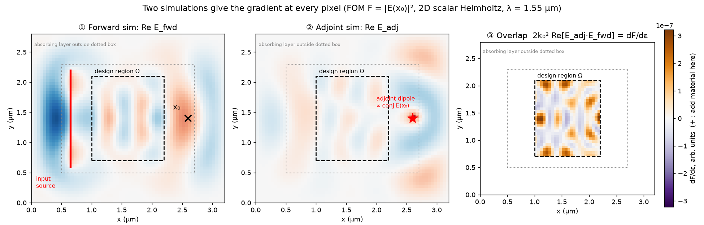
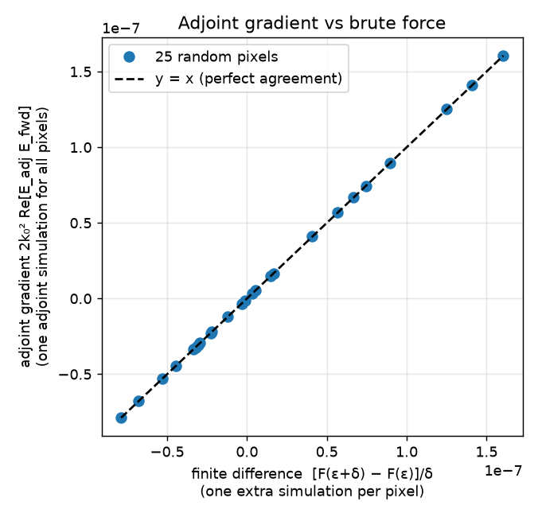
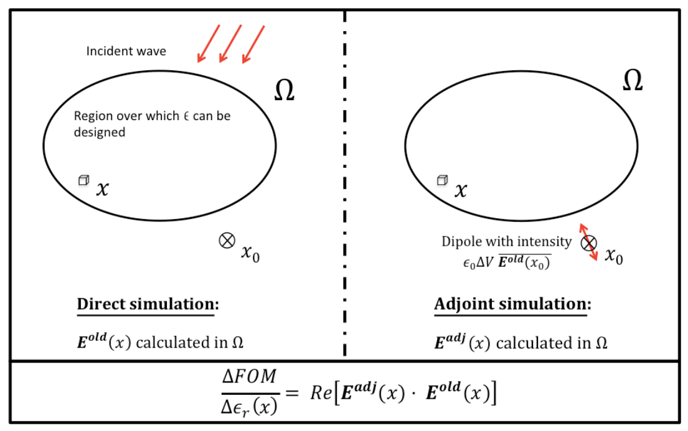
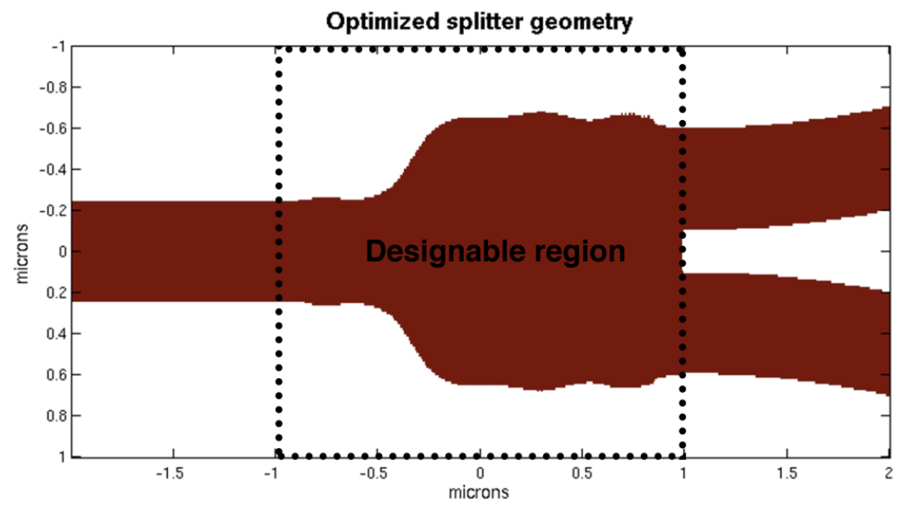
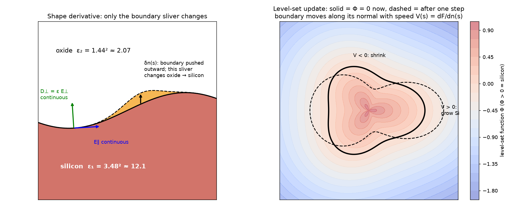
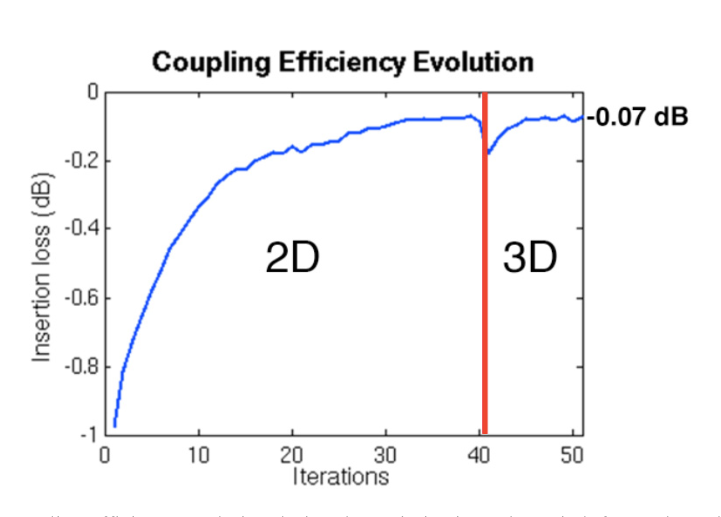
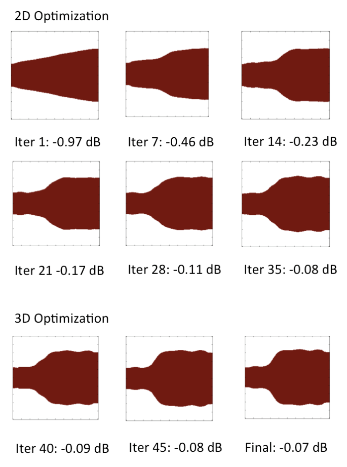
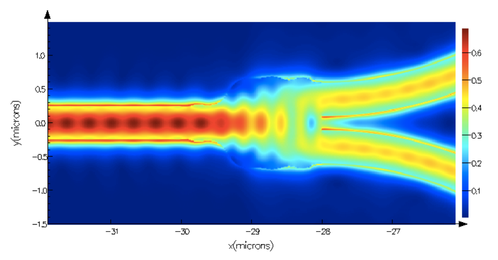
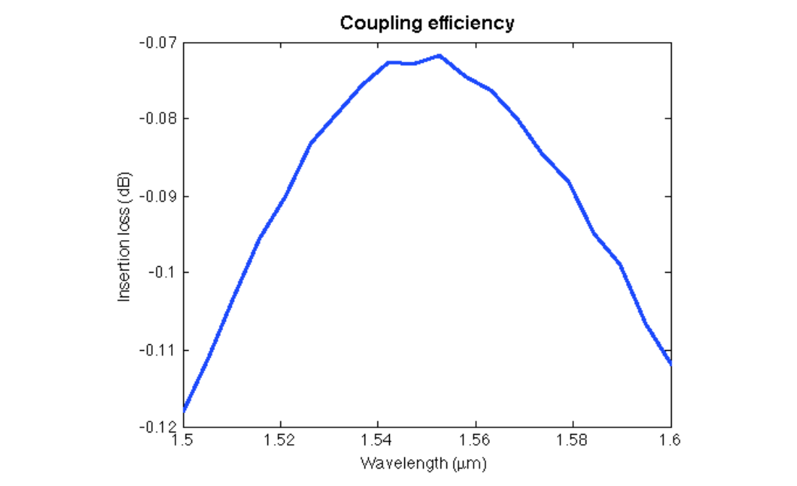

# Week 4 · Day 1 — Monday 12 Oct 2026 · Lalau-Keraly 2013

*Simple-English study version of Lalau-Keraly, Bhargava, Miller & Yablonovitch, "Adjoint shape optimization applied to electromagnetic design", Optics Express 21(18), 21693–21701 (2013)*

!!! abstract "Today's slot"
    **The one sentence that is the whole point (write it at the top of your page):** *the gradient at every pixel comes from one extra simulation, because reciprocity turns "one solve per degree of freedom" into "one extra solve, period".*

    **Morning 06:15–07:45 (1.5 h):** *"Lalau-Keraly 2013: derive the adjoint gradient for a single figure of merit. Do the derivation; do not read it passively."*
    **EXIT:** $dF/d\varepsilon$ written as an overlap of forward and adjoint fields, **by hand, with no reference open**.

    The schedule's HOW block gives the route for the derivation on paper:

    1. Set up a figure of merit $F(\mathbf{E})$ and a permittivity change $\delta\varepsilon$ at position $\mathbf{x}$. Done naively, $dF/d\varepsilon(\mathbf{x})$ costs one full simulation *per pixel*.
    2. Write the perturbed Maxwell operator.
    3. Introduce the **adjoint field**: the solution of the *same* operator with a source built from $\partial F/\partial \mathbf{E}$. For lossless reciprocal media no new solver is needed.
    4. Use the reciprocity identity to collapse the volume integral, leaving $dF/d\varepsilon(\mathbf{x}) \propto \mathrm{Re}[\mathbf{E}_{fwd}(\mathbf{x})\cdot\mathbf{E}_{adj}(\mathbf{x})]$.

    **Evening 20:00–21:30 (1.5 h):** install and verify `meep.adjoint` by running `python/examples/adjoint_optimization/01-Introduction.ipynb` from the Meep source tree. **EXIT:** the notebook runs end to end locally and prints a gradient. See [Evening: running `meep.adjoint`](#evening-running-meepadjoint) at the end of this page.

    **21:30–22:00:** Anki, 10 cards from the last two weeks. Good card candidates are marked *(Anki)* below.

    **After this page you should be able to:** derive the adjoint gradient three ways (matrix algebra, discrete Helmholtz with complex fields, and the paper's Green's-function argument); check it numerically against finite differences; explain why the adjoint source sits where the figure of merit is measured; write the shape-derivative formula for a moving boundary; and retell the paper's Y-splitter result with its numbers.

---

## Before you start: the big picture

Saturday's review ([Molesky 2018](../week-03/day-06-sat-10-oct-2026-molesky-2018.md)) said that large-scale inverse design is possible only because of the **adjoint method**. Today you see it worked out, in the paper that brought it to everyday silicon photonics.

The problem. You have a small silicon device, for example the junction where one waveguide splits into two (a **Y-splitter**). You want to know, for *every* point in the device, whether adding a little silicon there would make the device better or worse. That map is the **gradient**. With it you can improve the shape step by step. The obvious way to get it is to try adding silicon at each point, one at a time, and re-simulate. With 10,000 points that is 10,000 simulations, *per improvement step*.

The trick. Light obeys a symmetry called **reciprocity**: if a lamp at A makes a certain brightness at B, then the same lamp at B makes the same brightness at A. So instead of asking "how does a change at each of the 10,000 points affect the output?" (10,000 simulations), you put a lamp *at the output* and ask "how much of its light reaches each of the 10,000 points?" (**one** simulation). Multiply that map by the normal ("forward") field, point by point, and you have the whole gradient.

An everyday analogy: you want to know which seats in a concert hall would most change what a microphone on stage picks up if someone coughed there. Coughing in each seat in turn is slow. It is faster to play a sound *from the microphone* and record how loud it is at every seat at once. Echoes work the same in both directions.

The paper then uses this to optimise a real Y-splitter for 1550 nm light in 220 nm silicon. In 51 iterations (102 simulations) it reaches −0.07 dB insertion loss. The previous record was −0.13 dB and needed 1500 simulations with a random-search method.

## Background you need

### Complex amplitudes (phasors) and "Re"

At a single frequency, every field component wiggles as $\cos(\omega t + \phi)$. We store its size $|E|$ and phase $\phi$ in one complex number $E = |E|e^{i\phi}$. The real, physical field is $\mathrm{Re}[E e^{-i\omega t}]$. Three facts we will use:

- The intensity (brightness) is $|E|^2 = \overline{E}E$, where the bar means **complex conjugate** (flip the sign of the imaginary part).
- If $E$ changes by a small $\Delta E$: $|E + \Delta E|^2 = |E|^2 + \overline{E}\Delta E + E\overline{\Delta E} + |\Delta E|^2 = |E|^2 + 2\,\mathrm{Re}[\overline{E}\,\Delta E] + O(\Delta E^2)$. So, to first order, *(Anki)*

$$\Delta |E|^2 = 2\,\mathrm{Re}\big[\overline{E}\,\Delta E\big].$$

- For vectors, $\mathbf{a}\cdot\mathbf{b} = a_x b_x + a_y b_y + a_z b_z$ **without** any conjugation. Keep this in mind: the adjoint gradient uses this plain, **unconjugated** product.

*Numeric check.* $E = 1 + i$, $\Delta E = 0.01$. Exactly: $|1.01 + i|^2 = 1.0201 + 1 = 2.0201$, a change of 0.0201. Formula: $2\,\mathrm{Re}[(1 - i)(0.01)] = 0.02$. ✓ (The missing 0.0001 is the $|\Delta E|^2$ term.)

### Linear systems and why one solve is the unit of cost

On a grid, Maxwell's equations at one frequency become $A\,\mathbf{x} = \mathbf{b}$: $\mathbf{x}$ is the field at every grid cell, $\mathbf{b}$ is the source, and the matrix $A$ depends on the permittivity map $\varepsilon$. Each **solve** (one simulation) is expensive. Computing $A^{-1}$ fully is out of the question: for $10^6$ cells it would be a $10^6 \times 10^6$ dense matrix. So we count cost in **number of solves**.

The **transpose** $A^T$ swaps rows and columns: $(A^T)_{ij} = A_{ji}$. Key identity: $(A^{-1})^T = (A^T)^{-1}$. A matrix is **symmetric** if $A^T = A$.

### Polarisation, dipoles and the induced source

When light hits a material, it pushes the charges inside slightly apart. Each tiny volume becomes a small **electric dipole** (a + and − charge pair). The dipole moment per volume is the **polarisation**. If you increase the relative permittivity of a small volume $\Delta V$ by $\Delta\varepsilon_r$, the *extra* dipole moment created there is

$$\mathbf{p}^{ind} = \varepsilon_0\,\Delta\varepsilon_r\,\Delta V\,\mathbf{E}(\mathbf{x}),$$

where $\varepsilon_0 \approx 8.85 \times 10^{-12}$ F/m is the vacuum permittivity. This extra dipole radiates like a tiny antenna. **Adding material is the same as adding a small source**, driven by the field already there. This is the Born-approximation idea from Saturday.

### Green's function

The **Green's function** $\overline{\overline{\mathbf{G}}}(\mathbf{x}, \mathbf{x}')$ (the double bar marks a 3×3 matrix, called a *dyadic*) tells you the electric field at $\mathbf{x}$ produced by a point dipole at $\mathbf{x}'$, **with the whole structure in place** (not in empty space). Column $j$ of the 3×3 matrix is the field from a dipole pointing along direction $j$. The paper calls it $\mathbf{G}^{EP}$: **E**-field from a **P**olarisation dipole. On a grid, the Green's function *is* $A^{-1}$ (up to constants): column $j$ of $A^{-1}$ is the field from a unit source at cell $j$.

### Reciprocity

For materials whose permittivity is a symmetric tensor (in particular any ordinary, non-magnetic dielectric, lossy or not, such as silicon and oxide), the **Lorentz reciprocity theorem** says *(Anki)*

$$\overline{\overline{\mathbf{G}}}(\mathbf{x}_0, \mathbf{x}) = \overline{\overline{\mathbf{G}}}(\mathbf{x}, \mathbf{x}_0)^T .$$

In words: the $i$-component of the field at $\mathbf{x}_0$ from a $j$-dipole at $\mathbf{x}$ equals the $j$-component of the field at $\mathbf{x}$ from an $i$-dipole at $\mathbf{x}_0$. On a grid: **$A$ is symmetric**, $A^T = A$, and so $A^{-1}$ is symmetric too. Note: *symmetric*, not *Hermitian*. With absorbing boundaries or lossy materials, $A$ has complex entries and $A^T = A$ but $A^H \neq A$. That is why the adjoint uses the plain transpose and the plain dot product.

### Figure of merit, gradient, steepest descent

The **figure of merit** (FoM) $F$ is the number you want to maximise, for example the power in the output mode. **Steepest descent** (the paper's name; here really steepest *ascent*) moves the design a small step in the direction of the gradient, and repeats. The gradient is the expensive part, and that is today's topic.

### Mode overlap and power in a mode

A waveguide output can carry several modes plus radiation. To measure only the power in the fundamental mode, you project the actual field onto the mode's field pattern ($\mathbf{E}_m$, $\mathbf{H}_m$) with an **overlap integral** over the output cross-section $S$. This is like finding how much of a vector points along one basis direction. The **Poynting vector** $\mathbf{E}\times\overline{\mathbf{H}}$ gives power flow, and the overlap uses a mixed Poynting product between the actual fields and the mode fields. See Eq. (7) below.

### Level sets

The **level-set method** (Osher & Sethian, 1988) describes a shape by a smooth function $\Phi(\mathbf{x})$: silicon where $\Phi > 0$, oxide where $\Phi < 0$, boundary where $\Phi = 0$. To move the boundary outward along its normal with speed $V$, you update $\Phi$ with

$$\frac{\partial \Phi}{\partial t} = V(\mathbf{x})\,|\nabla \Phi| .$$

Holes and merges are handled automatically, and the material is always binary.

### FDTD and the 2D effective-index trick

**FDTD** (finite-difference time-domain) solves Maxwell's equations by stepping the fields forward in time on a grid. It is the engine inside Lumerical (used in the paper), Meep and Tidy3D. A single-frequency result is obtained by Fourier-transforming the time signal at the end.

The **effective index method** squeezes a 3D slab waveguide into 2D. The 220 nm silicon slab is replaced by a 2D material whose index equals the slab mode's effective index. For TE light at 1550 nm in 220 nm SOI that is about 2.8 (the paper uses $n = 2.8$, so $\varepsilon = 7.84$). 2D simulations are about 100× cheaper, but only approximate.

### Decibels for small losses

Insertion loss in dB is $10\log_{10}(P_{out}/P_{in})$. Useful conversions: −0.97 dB → 80.0 %; −0.13 dB → 97.0 %; −0.07 dB → 98.4 %. For small losses, $-x$ dB ≈ $x \times 23$ % of power lost (0.1 dB ≈ 2.3 %).

---

## The derivation, done three ways

The paper gives a short Green's-function argument (Section 2). Before reading it, do the derivation yourself in the simplest possible setting. Then redo it with complex fields. Then read the paper's version, which will feel obvious. **Cover the right-hand side of each step and try to write it yourself first.**

### Way 1: the adjoint method as pure linear algebra

**Setup.** A vector of unknowns $\mathbf{x} \in \mathbb{R}^n$ (the "field") is defined by a linear system that depends on $m$ design parameters $\mathbf{p} = (p_1, \dots, p_m)$:

$$A(\mathbf{p})\,\mathbf{x} = \mathbf{b}.$$

A scalar figure of merit $f(\mathbf{x})$ depends on the field. We want all $m$ derivatives $df/dp_k$.

**Step 1: chain rule.** $f$ depends on $p_k$ only through $\mathbf{x}$:

$$\frac{df}{dp_k} = \frac{\partial f}{\partial \mathbf{x}}\,\frac{\partial \mathbf{x}}{\partial p_k}, $$

where $\partial f/\partial\mathbf{x}$ is a row vector ($1 \times n$) and $\partial\mathbf{x}/\partial p_k$ is a column vector ($n \times 1$).

**Step 2: differentiate the constraint.** Differentiate $A\mathbf{x} = \mathbf{b}$ with respect to $p_k$ (the source $\mathbf{b}$ does not depend on the design):

$$\frac{\partial A}{\partial p_k}\mathbf{x} + A\,\frac{\partial \mathbf{x}}{\partial p_k} = 0 \quad\Longrightarrow\quad \frac{\partial \mathbf{x}}{\partial p_k} = -A^{-1}\,\frac{\partial A}{\partial p_k}\,\mathbf{x}.$$

Read this physically. The change in the field is the response ($A^{-1}$) to a new source $-(\partial A/\partial p_k)\mathbf{x}$, which is the old field multiplied by the material change. This is the "induced dipole".

**Step 3: substitute.**

$$\frac{df}{dp_k} = -\,\underbrace{\frac{\partial f}{\partial \mathbf{x}}\,A^{-1}}_{\boldsymbol{\lambda}^T}\;\frac{\partial A}{\partial p_k}\,\mathbf{x}.$$

**Step 4: the bracketing choice (the entire trick).** The product $\frac{\partial f}{\partial \mathbf{x}}\, A^{-1}\, \frac{\partial A}{\partial p_k}\mathbf{x}$ can be evaluated in two orders:

- **Right to left (direct, "forward sensitivity"):** first solve $A\,\mathbf{y}_k = \frac{\partial A}{\partial p_k}\mathbf{x}$ for each $k$. That is **$m$ solves**.
- **Left to right (adjoint):** first compute the row vector $\boldsymbol{\lambda}^T = \frac{\partial f}{\partial \mathbf{x}}A^{-1}$. It does not depend on $k$, so it is **one solve**. Then each derivative is a cheap product.

**Step 5: the adjoint equation.** Transpose $\boldsymbol{\lambda}^T A = \partial f/\partial\mathbf{x}$ to get an ordinary linear system for $\boldsymbol{\lambda}$: *(Anki)*

$$A^T\,\boldsymbol{\lambda} = \left(\frac{\partial f}{\partial \mathbf{x}}\right)^T, \qquad \frac{df}{dp_k} = -\,\boldsymbol{\lambda}^T\,\frac{\partial A}{\partial p_k}\,\mathbf{x}.$$

The source of the adjoint problem is $\partial f/\partial\mathbf{x}$. It is non-zero only where $f$ "looks" at the field, i.e. at the detector. That is why the adjoint source always sits where the figure of merit is measured.

**Step 6: specialise to a pixel permittivity.** If $p_k$ is the permittivity of cell $k$, and $A$ contains $-k_0^2\,\mathrm{diag}(\varepsilon)$ (see Way 2), then $\partial A/\partial\varepsilon_k = -k_0^2\,\mathbf{u}_k\mathbf{u}_k^T$, where $\mathbf{u}_k$ is the unit vector for cell $k$ (a matrix with a single non-zero entry). The product collapses to one number:

$$\frac{df}{d\varepsilon_k} = k_0^2\,\lambda_k\,x_k .$$

**The gradient at pixel $k$ = (adjoint field at $k$) × (forward field at $k$).** That is the "overlap" the EXIT asks for.

**Cost summary.** Forward solve: 1. Adjoint solve: 1. Products: $m$ cheap multiplications. Total: **2 solves, for any $m$**. Finite differences: $m + 1$ solves (or $2m$ for central differences).

#### Numerical check, Way 1

Run this. It builds a random 50×50 system with 200 design parameters and compares the adjoint gradient with central finite differences.

```python
import numpy as np
rng = np.random.default_rng(0)
n, m = 50, 200                      # n field unknowns, m design parameters
A0 = rng.normal(size=(n, n)) + n * np.eye(n)   # a well-behaved "system matrix"
B = 0.1 * rng.normal(size=(m, n, n))           # B[k] = dA/dp_k
b = rng.normal(size=n)                         # the source
c = rng.normal(size=n)                         # "detector": what we measure

def A(p):  return A0 + np.einsum("k,kij->ij", p, B)
def f(p):                                      # figure of merit f = (c.x)^2 / 2
    x = np.linalg.solve(A(p), b)
    return 0.5 * (c @ x) ** 2

p = 0.1 * rng.normal(size=m)

# --- adjoint gradient: 1 forward + 1 adjoint solve, for ALL m parameters
x   = np.linalg.solve(A(p), b)                 # forward:  A x = b
g   = (c @ x) * c                              # df/dx
lam = np.linalg.solve(A(p).T, g)               # adjoint:  A^T lam = df/dx
grad_adj = -np.einsum("i,kij,j->k", lam, B, x) # df/dp_k = -lam^T B_k x

# --- brute force: 2 extra solves PER parameter (central differences)
h, I = 1e-6, np.eye(m)
grad_fd = np.array([(f(p + h * I[k]) - f(p - h * I[k])) / (2 * h) for k in range(m)])

print("solves used: adjoint =", 2, "  finite difference =", 2 * m)
print("max relative error:", np.max(abs(grad_adj - grad_fd)) / np.max(abs(grad_fd)))
```

**What you should see:**

```
solves used: adjoint = 2   finite difference = 400
max relative error: 1.2e-08
```

The two gradients agree to about eight digits. Notice that here $A$ is *not* symmetric, so the adjoint solve genuinely uses $A^T$. Reciprocity, in Way 2, is what lets us drop the transpose and reuse the ordinary solver.

### Way 2: complex fields and reciprocity (a 1D "Maxwell" problem)

**Setup.** Take the scalar Helmholtz equation, which is Maxwell's equation for one field component in 1D or 2D:

$$-\nabla^2 E(\mathbf{x}) - k_0^2\,\varepsilon(\mathbf{x})\,E(\mathbf{x}) = b(\mathbf{x}).$$

On a grid, $A = -L - k_0^2\,\mathrm{diag}(\varepsilon)$, where $L$ is the finite-difference Laplacian (a symmetric matrix). To stop waves bouncing off the grid edges we add an absorbing layer: a small positive imaginary part of $\varepsilon$ near the edges. Then $A$ is **complex symmetric**: $A^T = A$, but $A^H \neq A$. This is reciprocity in matrix form.

**FoM.** $F = |E(\mathbf{x}_0)|^2 = \overline{E_{j_0}}E_{j_0}$, the brightness at one grid point $j_0$. This is the paper's Eq. (1).

**Step 1: perturb.** Change $\varepsilon$ at cell $k$ by $\delta\varepsilon$. Then $\delta A = -k_0^2\,\delta\varepsilon\,\mathbf{u}_k\mathbf{u}_k^T$ and, to first order,

$$A\,\delta\mathbf{E} = -\delta A\,\mathbf{E} = k_0^2\,\delta\varepsilon\,E_k\,\mathbf{u}_k .$$

The right-hand side is an **induced point source** at cell $k$ with strength $k_0^2\,\delta\varepsilon\,E_k$: the old field times the material change.

**Step 2: propagate to the detector.** $\delta\mathbf{E} = A^{-1}\mathbf{u}_k\,k_0^2\,\delta\varepsilon\,E_k$, so at the detector

$$\delta E_{j_0} = (A^{-1})_{j_0 k}\;k_0^2\,\delta\varepsilon\,E_k .$$

$(A^{-1})_{j_0 k}$ is the discrete Green's function from $k$ to $j_0$.

**Step 3: change in FoM.** With $\Delta|E|^2 = 2\,\mathrm{Re}[\overline{E}\,\Delta E]$:

$$\delta F = 2\,\mathrm{Re}\Big[\overline{E_{j_0}}\,(A^{-1})_{j_0 k}\,k_0^2\,\delta\varepsilon\,E_k\Big].$$

**Step 4: reciprocity.** $A$ symmetric ⇒ $A^{-1}$ symmetric ⇒ $(A^{-1})_{j_0 k} = (A^{-1})_{k j_0}$. Swap:

$$\frac{\delta F}{\delta\varepsilon} = 2k_0^2\,\mathrm{Re}\Big[\underbrace{(A^{-1})_{k j_0}\,\overline{E_{j_0}}}_{E^{adj}_k}\;E_k\Big].$$

**Step 5: recognise the adjoint field.** $E^{adj}_k = (A^{-1})_{k j_0}\overline{E_{j_0}}$ is the field at cell $k$ produced by a point source at the detector $j_0$ with complex amplitude $\overline{E_{j_0}}$. In matrix form, $A\,\mathbf{E}^{adj} = \overline{E_{j_0}}\,\mathbf{u}_{j_0}$. **This is the same matrix $A$ as the forward problem.** No new solver, just a new source. And $\overline{E_{j_0}}\mathbf{u}_{j_0}$ is exactly $(\partial F/\partial \mathbf{E})^T$ from Way 1 (with the Wirtinger derivative $\partial|E|^2/\partial E = \overline{E}$).

**Result.** *(Anki)*

$$\boxed{\;\frac{dF}{d\varepsilon(\mathbf{x})} = 2k_0^2\,\mathrm{Re}\big[E^{adj}(\mathbf{x})\,E^{fwd}(\mathbf{x})\big]\;}$$

The product is *unconjugated*. Positive gradient means "adding permittivity here increases $F$".

#### Numerical check, Way 2

```python
import numpy as np
# 1D Helmholtz:  -E'' - k0^2 eps(x) E = b(x), absorbing (lossy) layers at both ends
lam0, h, N = 1.55, 0.02, 400                  # wavelength (um), grid step (um), points
k0 = 2 * np.pi / lam0
xg = np.arange(N) * h
eps = np.full(N, 1.44**2, dtype=complex)      # oxide background
eps[150:250] = 3.48**2                        # a 2-um silicon block = design region
d = np.clip(np.maximum(40 - np.arange(N), np.arange(N) - (N - 41)), 0, None) / 40
eps += 2j * d**2                              # lossy absorber near the edges

L = (np.diag(np.ones(N - 1), 1) + np.diag(np.ones(N - 1), -1) - 2 * np.eye(N)) / h**2
def A(e): return -L - k0**2 * np.diag(e)      # complex SYMMETRIC (reciprocal), not Hermitian
b = np.zeros(N, complex); b[60] = 1 / h       # point source on the left
j0 = 330                                      # FOM point x0 on the right

E = np.linalg.solve(A(eps), b)                # (1) forward simulation
F = abs(E[j0])**2                             # FOM = |E(x0)|^2
s_adj = np.zeros(N, complex); s_adj[j0] = np.conj(E[j0])   # dipole at x0, amplitude conj(E(x0))
E_adj = np.linalg.solve(A(eps), s_adj)        # (2) adjoint simulation: SAME matrix (A^T = A)
grad = 2 * k0**2 * np.real(E_adj * E)         # dF/d eps at every point: forward x adjoint

for i in [160, 200, 240]:                     # brute-force check at 3 pixels
    e2 = eps.copy(); e2[i] += 1e-6
    fd = (abs(np.linalg.solve(A(e2), b)[j0])**2 - F) / 1e-6
    print(f"x = {xg[i]:.2f} um   adjoint {grad[i]: .5e}   finite diff {fd: .5e}")
```

**What you should see:**

```
x = 3.20 um   adjoint -2.83812e-04   finite diff -2.83812e-04
x = 4.00 um   adjoint  2.17789e-05   finite diff  2.17788e-05
x = 4.80 um   adjoint -2.28826e-04   finite diff -2.28826e-04
```

Try breaking it on purpose, which is the best way to learn: (a) use `np.conj(E_adj) * E` instead of `E_adj * E`; (b) drop the `np.conj` on the adjoint source; (c) solve the adjoint with `A(eps).conj().T`. Each version gives wrong numbers. This tells you exactly which conjugations matter.

The same experiment in 2D is shown below. It is the picture to keep in your head.



**How to read this figure.** A real 2D scalar Helmholtz calculation at $\lambda = 1.55$ µm (oxide background, a $\varepsilon = 8.07$ block as the design region, absorbing layer outside the dotted box). ① Forward simulation: a line source on the left (red bar) sends a wave through the design region (dashed box) to the FoM point $x_0$ (×). ② Adjoint simulation: the *only* source is a point dipole at $x_0$ (red star), with amplitude $\overline{E(x_0)}$ taken from ①. Its waves spread back through the design region. ③ The point-by-point product $2k_0^2\,\mathrm{Re}[E_{adj}E_{fwd}]$ inside the design region is the gradient. Brown pixels would gain from more permittivity, purple from less. Two solves, 672 gradient values.



**How to read this figure.** Each dot is one of 25 randomly chosen design pixels from the 2D example. Horizontal: the derivative from brute force (one extra full simulation per pixel). Vertical: the adjoint gradient (one simulation for all pixels together). The dots lie on the line $y = x$, with a largest relative error of about $2\times 10^{-6}$ (finite-difference rounding). This is the check to repeat whenever you write an adjoint: Meep's tutorials do the same comparison.

### Way 3: the paper's Green's-function argument (Section 2 of the paper)

Now read Section 2 of the paper. It is exactly Way 2, written with continuous fields and vector Green's functions. Map each step:

| Paper | Way 2 | Meaning |
|---|---|---|
| Eq. (1) $FoM = \lvert\mathbf{E}(x_0)\rvert^2$ | $F = \lvert E_{j_0}\rvert^2$ | brightness at the detector |
| Eq. (2) $\Delta FoM = \mathrm{Re}[\overline{\mathbf{E}^{old}(x_0)}\cdot\Delta\mathbf{E}(x_0)]$ | Step 3 | first-order change (the paper drops the factor 2) |
| Eq. (3) $\Delta\mathbf{E}(x_0) = \mathbf{G}^{EP}(x_0,x)\,\mathbf{p}^{ind}$ | Steps 1–2 | induced dipole radiates to detector |
| Eq. (4) | Step 3 with $\mathbf{E}^{new} \approx \mathbf{E}^{old}$ | first-order (Born) approximation |
| Eq. (5) reciprocity | Step 4 | swap source and detector |
| Eq. (6) $\mathbf{E}^{adj}$ | Step 5 | field from a dipole at $x_0$ |

## 1. Introduction and motivations

> **In one sentence:** Silicon photonics needs low-loss splitters, crossings and similar components; these have been optimised with random-search methods that need thousands of simulations, and a gradient method is needed for anything more complex.

**Why silicon photonics.** Sub-wavelength silicon waveguides can sit on the same chip as CMOS electronics. Many separate optical parts can be replaced by one chip, which lowers cost, energy and size.

**The problem.** Straight silicon waveguides have very low loss. But components such as **splitters**, **waveguide crossings** and **multimode interferometers** lose light. The light's evanescent field extends outside the silicon, and reflections at the silicon/oxide interfaces are imperfect. Light scatters away. In a big circuit with many components, these small losses add up.

**What people did before.** They used **heuristic** optimisation: genetic algorithms, **particle swarm optimisation** (PSO), and custom hybrids. These describe the device with a small set of parameters (for example a few spline points along the edge), test many random parameter sets, and keep what works. They do not use the physics (the derivatives) at all. Because each Maxwell solve is expensive, they only work for simple geometries.

**What this paper does.** It computes **shape derivatives** (how the FoM changes when the boundary moves at each point) with the adjoint method, by wrapping a steepest-descent loop around a **commercial Maxwell solver** (Lumerical FDTD). The authors argue this opens up structures too complex for random search.

## 2. Presentation of the adjoint method for electromagnetic problems

> **In one sentence:** For any number of design points, the derivative of the FoM with respect to permittivity everywhere comes from just two simulations: the direct one and one adjoint one with a source at the measurement point.

**Context.** The adjoint method was well established in mechanical engineering (Bendsøe & Kikuchi; Bendsøe & Sigmund; Borrvall & Petersson for fluids), was less used in photonics, and had recently appeared in quantum electronics. The authors do not give the general proof (they point to textbooks and to Owen Miller's PhD thesis). They give one simple example to build intuition. You have already done that example as Way 2.



**How to read this figure.** Left box: the **direct** simulation. An incident wave (red arrows) lights up the region $\Omega$, where $\varepsilon$ can be designed. You record $\mathbf{E}^{old}(x)$ at every point $x$ inside $\Omega$, and the field at the target point $x_0$ (⊗, outside $\Omega$). Right box: the **adjoint** simulation. No incident wave, only a dipole at $x_0$ (red double arrow) with strength $\varepsilon_0\Delta V\,\overline{\mathbf{E}^{old}(x_0)}$. You record $\mathbf{E}^{adj}(x)$ inside $\Omega$. Bottom: the gradient at every $x$ is $\mathrm{Re}[\mathbf{E}^{adj}(x)\cdot\mathbf{E}^{old}(x)]$. The sources (red) are the only thing that differs between the two runs. The geometry is identical.

**The example.** Maximise the field strength at one point $x_0$, by changing $\varepsilon$ anywhere in $\Omega$:

$$FoM = |\mathbf{E}(x_0)|^2. \tag{1}$$

**Eq. (2), first-order change.** For a small change $\Delta\varepsilon_r$ in a small volume $\Delta V$ at $x$:

$$\Delta FoM = \mathrm{Re}\left[\overline{\mathbf{E}^{old}(x_0)}\cdot\Delta\mathbf{E}(x_0)\right]. \tag{2}$$

$\mathbf{E}^{old}$ is the field before the change and $\Delta\mathbf{E}$ is the change. Strictly, $\Delta|\mathbf{E}|^2 = 2\,\mathrm{Re}[\overline{\mathbf{E}}\cdot\Delta\mathbf{E}]$ (see Background), so the paper has dropped a factor of 2. A constant factor does not change the *direction* of the gradient, which is all steepest descent needs, but it matters when you compare with finite differences. Keep the 2 in your own derivation.

**Eq. (3), the induced dipole radiates.** The extra material at $x$ becomes an extra dipole $\mathbf{p}^{ind} = \varepsilon_0\Delta\varepsilon_r\Delta V\,\mathbf{E}^{new}(x)$. Its field at $x_0$ is given by the Green's function:

$$\Delta\mathbf{E}(x_0) = \overline{\overline{\mathbf{G}^{EP}}}(x_0, x)\,\mathbf{p}^{ind} = \varepsilon_0\,\Delta\varepsilon_r\,\Delta V\;\overline{\overline{\mathbf{G}^{EP}}}(x_0, x)\,\mathbf{E}^{new}(x). \tag{3}$$

Why $\mathbf{E}^{new}$ and not $\mathbf{E}^{old}$? The dipole is driven by the field *after* the change, which includes the dipole's own effect. For small $\Delta\varepsilon_r$, the difference is second order, so we may use $\mathbf{E}^{new}(x) \approx \mathbf{E}^{old}(x)$. That is the first-order (Born) approximation.

**A subtle point the paper flags.** For a **binary** structure (silicon or oxide, nothing in between) $\Delta\varepsilon_r$ is *not* small: it is $12.1 - 2.07 = 10.0$. There the small parameter is the *volume* $\Delta V$ instead. But then $\mathbf{E}^{new}(x) \approx \mathbf{E}^{old}(x)$ is only true for the field components that are continuous across the boundary. See [the shape derivative](#the-shape-derivative-boundary-formula) below.

**Eq. (4), substitute into (2).**

$$\frac{\Delta FoM}{\Delta\varepsilon_r} = \varepsilon_0\,\Delta V\;\mathrm{Re}\left[\overline{\mathbf{E}^{old}(x_0)}\cdot\left(\overline{\overline{\mathbf{G}^{EP}}}(x_0, x)\,\mathbf{E}^{old}(x)\right)\right]. \tag{4}$$

As written, this needs $\mathbf{G}^{EP}(x_0, x)$ for every $x$ in $\Omega$: the field at $x_0$ due to a dipole at each $x$. That is one simulation per point $x$, the expensive way.

**Eq. (5), reciprocity.** Use $\overline{\overline{\mathbf{G}^{EP}}}(x_0, x) = \overline{\overline{\mathbf{G}^{EP}}}(x, x_0)^T$ and the identity $\mathbf{a}\cdot(M\mathbf{b}) = (M^T\mathbf{a})\cdot\mathbf{b}$:

$$\frac{\Delta FoM}{\Delta\varepsilon_r} = \mathrm{Re}\left[\left(\varepsilon_0\Delta V\,\overline{\overline{\mathbf{G}^{EP}}}(x, x_0)\,\overline{\mathbf{E}^{old}(x_0)}\right)\cdot\mathbf{E}^{old}(x)\right] = \mathrm{Re}\left[\mathbf{E}^{adj}(x)\cdot\mathbf{E}^{old}(x)\right]. \tag{5}$$

Write out the identity once to convince yourself: $\mathbf{a}\cdot(M\mathbf{b}) = \sum_i a_i\sum_j M_{ij}b_j = \sum_j\big(\sum_i M_{ij}a_i\big)b_j = (M^T\mathbf{a})\cdot\mathbf{b}$. ✓

**Eq. (6), the adjoint field.**

$$\mathbf{E}^{adj}(x) = \varepsilon_0\,\Delta V\;\overline{\overline{\mathbf{G}^{EP}}}(x, x_0)\;\overline{\mathbf{E}^{old}(x_0)}. \tag{6}$$

Read it as: the field at $x$ produced by **one dipole at $x_0$** with amplitude (and direction, and phase) $\varepsilon_0\Delta V\,\overline{\mathbf{E}^{old}(x_0)}$. One simulation gives it at *every* $x$ at once. The amplitude needs $\mathbf{E}^{old}(x_0)$, which the forward simulation already gave you.

**Why the conjugate in the adjoint source?** It came from $\Delta|E|^2 = 2\,\mathrm{Re}[\overline{E}\Delta E]$, i.e. from $\partial F/\partial\mathbf{E}$. Physically, it sets the adjoint dipole's phase so that the gradient rewards field changes that arrive at $x_0$ *in phase* with the existing field (which make $|E|$ bigger) and penalises those that arrive out of phase (which cancel it).

**The bottom line of Section 2.** One forward simulation (needed anyway to evaluate the FoM) plus one adjoint simulation gives the derivative over the whole design region, "for arbitrarily many degrees of freedom". Then you change the geometry in proportion to the gradient (gradient descent) and repeat. And because each step is just "run a normal simulation with a chosen source", the loop can be wrapped around any commercial solver.

### The full EM version, for your by-hand EXIT

Here is the derivation in the continuous vector form the schedule asks for. Write it out on paper with these five headings.

**(i) Forward problem.** $\nabla\times\nabla\times\mathbf{E} - k_0^2\varepsilon(\mathbf{x})\mathbf{E} = i\omega\mu_0\mathbf{J}$. Call the operator $\mathcal{L}_\varepsilon = \nabla\times\nabla\times - k_0^2\varepsilon$. Solution: $\mathbf{E}^{fwd}$.

**(ii) Perturbed operator.** $\varepsilon \to \varepsilon + \delta\varepsilon(\mathbf{x})$. To first order, $\mathcal{L}_\varepsilon\,\delta\mathbf{E} = k_0^2\,\delta\varepsilon\,\mathbf{E}^{fwd}$. The material change acts as an **induced current/dipole source** proportional to $\delta\varepsilon\,\mathbf{E}^{fwd}$.

**(iii) Green's function.** $\delta\mathbf{E}(\mathbf{x}') = k_0^2\int \overline{\overline{\mathbf{G}}}(\mathbf{x}', \mathbf{x})\,\delta\varepsilon(\mathbf{x})\,\mathbf{E}^{fwd}(\mathbf{x})\,d^3x$.

**(iv) Change in FoM.** For any $F(\mathbf{E})$: $\delta F = 2\,\mathrm{Re}\int \frac{\partial F}{\partial\mathbf{E}(\mathbf{x}')}\cdot\delta\mathbf{E}(\mathbf{x}')\,d^3x'$. Insert (iii). This is a double integral over $\mathbf{x}'$ (where $F$ looks) and $\mathbf{x}$ (where material changes).

**(v) Reciprocity and the adjoint field.** With $\mathbf{G}(\mathbf{x}', \mathbf{x}) = \mathbf{G}(\mathbf{x}, \mathbf{x}')^T$, swap the order of integration and group the $\mathbf{x}'$ integral into one field:

$$\mathbf{E}^{adj}(\mathbf{x}) = \int \overline{\overline{\mathbf{G}}}(\mathbf{x}, \mathbf{x}')\,\frac{\partial F}{\partial\mathbf{E}(\mathbf{x}')}\,d^3x' ,\qquad\text{i.e.}\qquad \mathcal{L}_\varepsilon\,\mathbf{E}^{adj} = \frac{\partial F}{\partial\mathbf{E}} \;(\text{as a source}).$$

Then

$$\boxed{\;\frac{\delta F}{\delta\varepsilon(\mathbf{x})} = 2k_0^2\,\mathrm{Re}\big[\mathbf{E}^{adj}(\mathbf{x})\cdot\mathbf{E}^{fwd}(\mathbf{x})\big]\;}$$

(constants depend on how you normalise sources; the paper absorbs them into $\varepsilon_0\Delta V$ and drops the 2). The same operator $\mathcal{L}_\varepsilon$ appears in both problems because of reciprocity. That is why "no new solver is needed".

## 3. Y-splitter optimisation example using the level-set method for shape representation

> **In one sentence:** A 1550 nm Y-splitter in 220 nm SOI, optimised by adjoint steepest descent on a level-set shape, reaches −0.07 dB insertion loss in 51 iterations (102 simulations), against −0.13 dB after 1500 simulations with particle swarm.

### The problem set-up

- Wavelength: $\lambda = 1550$ nm (vacuum).
- Materials: silicon waveguide, SiO₂ cladding; 220 nm thick silicon, the standard choice.
- Same constraints as the earlier PSO record (Zhang et al. 2013): same small overall size, same minimum feature size. The minimum feature size is imposed as a **minimum radius of curvature of 200 nm** (no sharper bends in the outline).
- Input waveguide, the two output branches and their end junction are kept the same as in that paper (they could also have been optimised).
- **Design region: the central 2 µm × 2 µm.**

The earlier record used **particle swarm optimisation**: compute the FoM for a large population of random designs, let the population "fly" towards the best ones found so far, and repeat until satisfied.



**How to read this figure.** Top view in microns. Light enters from the single waveguide on the left and leaves through the two bent branches on the right. Only the part between the dotted lines (about −1 to +1 µm, the designable region) was changed. The result is a smooth, slightly bulging taper: not a random-looking blob. With a level set and a curvature limit, the optimiser stayed close to a fabricable, intuitive-looking shape.

### Why level sets

The adjoint gives a derivative at *every* boundary point, so the shape description should be able to use them all. **Level sets** can: the boundary can move independently at every point. Spline outlines with a few control points (used in the earlier PSO work) cannot. The PSO approach can only afford a few variables because each costs many simulations. Level sets also keep the material **binary** (silicon or oxide) at every iteration, which is good for fabrication. This contrasts with density-based topology optimisation (Jensen & Sigmund), which lets $\varepsilon$ vary continuously and has to remove gray material later.

### The figure of merit: power in the output mode, Eq. (7)

$$FoM = \frac{1}{8}\,\frac{\left|\int \mathbf{E}\times\overline{\mathbf{H}_m}\cdot d\mathbf{S} + \int\overline{\mathbf{E}_m}\times\mathbf{H}\cdot d\mathbf{S}\right|^2}{\int\mathrm{Re}\left(\mathbf{E}_m\times\overline{\mathbf{H}_m}\right)\cdot d\mathbf{S}} \tag{7}$$

Symbols: $\mathbf{E}, \mathbf{H}$ are the simulated fields on the output cross-section $S$; $\mathbf{E}_m, \mathbf{H}_m$ are the fundamental-mode profiles of the output waveguide; $d\mathbf{S}$ points along the propagation direction. The numerator is a symmetric **mode-overlap integral**: it picks out how much of the actual field looks like the mode. The denominator normalises by the mode's own power.

**Check that it really is the power in the mode** (do this on paper; it is short). Suppose the output field is exactly $c$ times the mode: $\mathbf{E} = c\mathbf{E}_m$, $\mathbf{H} = c\mathbf{H}_m$. Let $P_m = \frac{1}{2}\int\mathrm{Re}(\mathbf{E}_m\times\overline{\mathbf{H}_m})\cdot d\mathbf{S}$ be the power the mode profile carries. For a lossless guided mode the integral $\int\mathbf{E}_m\times\overline{\mathbf{H}_m}\cdot d\mathbf{S}$ is real and equals $2P_m$. Then

- first integral: $c\int\mathbf{E}_m\times\overline{\mathbf{H}_m}\cdot d\mathbf{S} = 2cP_m$;
- second integral: $c\int\overline{\mathbf{E}_m}\times\mathbf{H}_m\cdot d\mathbf{S} = c\,\overline{(2P_m)} = 2cP_m$;
- numerator: $|4cP_m|^2 = 16|c|^2P_m^2$; divided by 8: $2|c|^2P_m^2$; divided by the denominator $2P_m$: $|c|^2P_m$.

That is exactly the power carried by the field $c\times$(mode). ✓ Parts of the field that are radiation or other modes are orthogonal to the fundamental mode and do not count. "Eq. (7) is the power transmission, corrected for the mode overlap." Divide by the input power to get transmission.

### The adjoint source for this FoM: Eqs. (8)–(9)

Repeating Section 2 for this FoM needs one extra ingredient. The FoM depends on $\mathbf{H}$ as well as $\mathbf{E}$, so a magnetic Green's function $\mathbf{G}^{EM}$ (electric field at $x$ due to a **magnetic** dipole at $x'$) appears too. The result:

$$\mathbf{E}^{adj}(x) = A\int\left(\overline{\overline{\mathbf{G}^{EP}}}(x, x')\,\overline{\mathbf{H}_m(x')}\times\mathbf{n} - \overline{\overline{\mathbf{G}^{EM}}}(x, x')\,\frac{\mathbf{n}\times\overline{\mathbf{E}_m(x')}}{\mu_0}\right)dS \tag{8}$$

$$A = \frac{1}{4}\,\varepsilon_0\,\Delta V\,\frac{\int\mathbf{E}^{old}\times\overline{\mathbf{H}_m}\cdot d\mathbf{S} + \int\overline{\mathbf{E}_m}\times\mathbf{H}^{old}\cdot d\mathbf{S}}{\int\mathrm{Re}(\mathbf{E}_m\times\overline{\mathbf{H}_m})\cdot d\mathbf{S}} \tag{9}$$

Here $\mathbf{n}$ is the unit normal of the output surface.

**What Eq. (8) means physically.** The integrand is a sheet of electric dipoles proportional to $\overline{\mathbf{H}_m}\times\mathbf{n}$ and magnetic dipoles proportional to $\mathbf{n}\times\overline{\mathbf{E}_m}$ spread over the output plane. By the **equivalence principle**, such a pair of current sheets launches a chosen mode in one direction only. With the conjugated mode fields, the mode it launches is the output mode **travelling backwards**, into the splitter. So the adjoint simulation is: **inject the desired output mode backwards from the output port**. This is the waveguide version of "put the dipole at $x_0$". The adjoint source always sits where the FoM looks.

**What Eq. (9) means.** $A$ is a single complex number: the forward simulation's mode overlap $a$ (the same integral as in Eq. 7), times constants. It sets the **phase** (and size) of the backward-injected mode, just as $\overline{\mathbf{E}^{old}(x_0)}$ did in Eq. (6). In the general derivation, $FoM \propto |a|^2$ gives $\delta FoM \propto 2\,\mathrm{Re}[\overline{a}\,\delta a]$, so the amplitude is $\propto\overline{a}$. The printed Eq. (9) shows $a$ without the bar while Eq. (8) conjugates the mode fields. Because $\mathrm{Re}[z] = \mathrm{Re}[\overline{z}]$, conjugations can be moved around consistently, so this is a convention question. Do not try to settle it by staring. Settle it with a finite-difference check, as above. Meep's `EigenmodeCoefficient` objective does this bookkeeping for you.

**Then:** run the adjoint simulation, and evaluate Eq. (5), $\mathrm{Re}[\mathbf{E}^{adj}\cdot\mathbf{E}^{old}]$, at every point of the design region. FDTD suits both runs because both are just waves propagating through dielectric.

### Turning the gradient into a shape change

With a level set, the derivative becomes a **velocity field** for the boundary:

- where the derivative is **positive** (more permittivity helps), push the boundary **outward**: silicon grows into oxide;
- where it is **negative**, push the boundary **inward**: silicon is removed.

This works because silicon has the higher index. Growing silicon means raising $\varepsilon$ locally.

**Step size.** Each iteration changes a **fixed area** (in 2D) or a **fixed volume** (in 3D) of material. This is a simple, robust way to choose how far to step without a line search.

### The shape derivative: boundary formula

Eq. (5) is for a small change of $\varepsilon$ in a small volume. For a binary level-set design, what actually happens is that a boundary moves by a small normal distance $\delta n(s)$ at each boundary point $s$. A thin sliver of oxide ($\varepsilon_2$) turns into silicon ($\varepsilon_1$). Here $\Delta\varepsilon = \varepsilon_1 - \varepsilon_2$ is **large**, about 10, so the "small change in ε" argument fails. The paper notes this: the small parameter becomes the sliver volume, and you must "distinguish which components of $\mathbf{E}$ and $\mathbf{D}$ are continuous across the boundary".



**How to read this figure.** Left: silicon (red, $\varepsilon_1 \approx 12.1$) below oxide ($\varepsilon_2 \approx 2.07$). Pushing the boundary outward by $\delta n(s)$ converts the orange sliver from oxide to silicon. At the boundary, the **tangential** electric field $\mathbf{E}_\parallel$ (blue) is continuous, and so is the **normal** displacement field $D_\perp = \varepsilon_0\varepsilon E_\perp$ (green). $E_\perp$ itself jumps by the factor $\varepsilon_1/\varepsilon_2 \approx 5.9$. Right: a level-set function (colour). The solid contour is today's boundary, the dashed one is after one update with a normal speed $V(s)$ that is positive on the sides (grow) and negative at top and bottom (shrink).

**Why the naive formula fails.** $\mathrm{Re}[\mathbf{E}^{adj}\cdot\mathbf{E}^{fwd}]\,\Delta\varepsilon$ uses "the" field in the sliver. But $E_\perp$ inside silicon and outside in oxide differ by a factor ~6, so which one? The answer from careful perturbation theory (Johnson et al. 2002; Miller's thesis) is: use the quantities that are continuous, $\mathbf{E}_\parallel$ with $\Delta\varepsilon$ and $D_\perp$ with $\Delta(\varepsilon^{-1})$. *(Anki)*

$$\frac{dF}{dn}(s) = \mathrm{Re}\left[(\varepsilon_1 - \varepsilon_2)\,\mathbf{E}^{adj}_\parallel\cdot\mathbf{E}^{fwd}_\parallel + \left(\frac{1}{\varepsilon_2} - \frac{1}{\varepsilon_1}\right)\frac{D^{adj}_\perp\,D^{fwd}_\perp}{\varepsilon_0^2}\right]$$

per unit boundary area, in the same normalisation as Eq. (5) (and with the same factor-2 caveat). The total change of FoM is $\delta F = \oint dF/dn(s)\,\delta n(s)\,dS$.

**Why the second term has that form.** In the sliver, $D_\perp$ is (to first order) unchanged, so the energy-like change is in $\mathbf{E}\cdot\mathbf{D}/\varepsilon$ type terms, which brings in $\Delta(1/\varepsilon) = 1/\varepsilon_1 - 1/\varepsilon_2$ with a minus sign, giving $(1/\varepsilon_2 - 1/\varepsilon_1)$.

**Sanity check (small contrast).** If $\varepsilon_1 \approx \varepsilon_2 \approx \varepsilon$, then $1/\varepsilon_2 - 1/\varepsilon_1 \approx (\varepsilon_1 - \varepsilon_2)/\varepsilon^2$ and $D_\perp/\varepsilon_0 = \varepsilon E_\perp$, so the second term becomes $(\varepsilon_1 - \varepsilon_2)E^{adj}_\perp E^{fwd}_\perp$. The two terms add up to $(\varepsilon_1 - \varepsilon_2)\,\mathbf{E}^{adj}\cdot\mathbf{E}^{fwd}$, i.e. Eq. (5). ✓

**Numbers for SOI.** $\varepsilon_1 - \varepsilon_2 = 12.11 - 2.07 = 10.04$ and $1/\varepsilon_2 - 1/\varepsilon_1 = 0.483 - 0.083 = 0.400$. In the paper's 2D runs (effective index 2.8), $\varepsilon_1 = 7.84$: $\Delta\varepsilon = 5.77$ and $\Delta(1/\varepsilon) = 0.356$.

**The level-set update.** Set the normal speed $V(s) = dF/dn(s)$ (extended smoothly off the boundary) and update $\partial\Phi/\partial t = V\,|\nabla\Phi|$ for a small "time" chosen so that a fixed area changes. This is literally "push out where positive, pull in where negative".

### Results

**2D first, then 3D.** The optimisation started with 2D FDTD (the structure extruded infinitely in the third direction), using the effective index method: silicon given the made-up index 2.8 to mimic the 3D slab mode's in-plane wavevector. 2D is much cheaper. When progress stalled in 2D (41 iterations), the design was moved to 3D FDTD. The first 3D iteration is worse than the last 2D one, because the effective index method is only approximate. Then 3D iterations improved it further.



**How to read this figure.** Horizontal: iteration number (0–50). Vertical: insertion loss in dB (0 dB = perfect). The curve climbs quickly from about −1 dB, flattens near −0.1 dB, shows a small jump at iteration 41 when the simulation switches from 2D to 3D, and ends near −0.07 dB. Most of the gain comes in the first ~15 iterations, which is typical of gradient methods.

**The headline numbers.** *(Anki)*

| | This paper (adjoint + level set) | Previous record (PSO, Zhang et al. 2013) |
|---|---|---|
| Iterations | 51 | — |
| Simulations | **102** (2 per iteration) | **1500** |
| Insertion loss | **−0.07 dB** (98.4 % transmitted) | −0.13 dB (97.0 %) |

So about 15× fewer simulations *and* a better device. The loss went from about 3 % to about 1.6 %, roughly half. The authors add an honest caveat: at such small losses the simulated number is very sensitive to simulation settings (mesh, boundaries, monitors), which may not have been identical to the earlier paper's.

Their conclusion: "adjoint steepest descent, with much lower computational cost, can yield as good or better results than particle swarm optimizations, which take no advantage of the underlying Maxwell equation physics."



**How to read this figure.** Nine snapshots of the design region (dark red = silicon). Top two rows, 2D optimisation: iteration 1 is a plain linear taper (−0.97 dB, i.e. 80 %); by iteration 7 (−0.46 dB) a neck and bulge appear; by iteration 35 (−0.08 dB) the outline has a smooth S-shaped rise with gentle ripples. Bottom row, 3D optimisation: iterations 40 (−0.09 dB) and 45 (−0.08 dB), and the final design (−0.07 dB), with only small changes to the ripples. Note that the topology never changes: no holes appear. This is a *shape* optimisation that stays one piece, helped by the starting design and the 200 nm curvature limit.

**Why 3D mattered.** The change from the 2D solution to the 3D solution gave a "non-negligible efficiency improvement". The authors argue this 3D refinement was only affordable because the adjoint method needs just 2 simulations per step. PSO with 3D simulations would cost far too much.



**How to read this figure.** $|E|^2$ at 1550 nm on a slice through the middle of the device, axes in microns. The bright input mode (left) widens through the design region with a smooth interference pattern, then divides cleanly into the two output branches (right). There is little visible light escaping sideways: that is what −0.07 dB looks like.



**How to read this figure.** Horizontal: wavelength 1.5–1.6 µm. Vertical: insertion loss in dB. The curve is a shallow arch with its best value (about −0.07 dB) near 1.55 µm, dropping only to about −0.12 dB at the band edges. Over 100 nm of bandwidth the loss stays below about 0.12 dB (≥ 97.3 %), even though the optimisation used a single wavelength. The authors read the broad response as a "good indicator of the robustness of the design".

!!! tip "Read Fig. 6 with your project hat on"
    Wavelength bandwidth is a *hint* of robustness, not a proof of fabrication robustness. A ±10 nm width error shifts the effective index, which is similar to a wavelength shift. A broadband device is therefore *likely* to be tolerant. But edge erosion changes the shape non-uniformly, and that is what your eroded/dilated and Monte-Carlo studies will test directly.

## 4. Conclusion

> **In one sentence:** Embedding commercial Maxwell solvers in an adjoint steepest-descent loop gives a cheap, general way to optimise photonic shapes, and it already beat the record for a manufacturable splitter.

- Electromagnetic optimisation will be needed more and more. Maxwell solves are expensive, so inefficient optimisers "will become unacceptable".
- The adjoint gradient method for shape optimisation can be implemented around **commercial** solvers. You only need to be able to place sources and record fields.
- **Limitation, honestly stated:** the method finds *local* optima. For larger design spaces, the authors suggest a clever choice of FoM and combining it with **global** methods such as **simulated annealing** (a random search that sometimes accepts worse designs, to escape local hills).
- The record: adjoint steepest descent beat the previous best manufacturable splitter in current silicon photonics technology, at much lower computational cost. Their code was made available online.

---

## Evening: running `meep.adjoint`

**Goal:** `python/examples/adjoint_optimization/01-Introduction.ipynb` runs end to end and prints a gradient.

**Install (conda is the supported route for Meep):**

```bash
conda create -n mp -c conda-forge pymeep pymeep-extras
conda activate mp
python -c "import meep as mp; import meep.adjoint as mpa; import nlopt, autograd; print(mp.__version__)"
```

If `import nlopt` fails, `conda install -c conda-forge nlopt` (or `pip install nlopt`). The schedule's gotcha: if `import meep.adjoint` fails, it is almost always a missing `nlopt` or an `autograd` version clash. **Fix `autograd` first.** Then get the notebook from the Meep source tree (`git clone https://github.com/NanoComp/meep`, folder `python/examples/adjoint_optimization/`).

**Map the notebook onto this morning's derivation.** As you run each cell, label it with the piece of the derivation it implements:

| In the notebook | In your derivation |
|---|---|
| `mp.MaterialGrid` + `mpa.DesignRegion` | the design parameters $\rho_i$ and the map $\varepsilon(\rho)$ |
| `mpa.EigenmodeCoefficient(...)` | the mode-overlap amplitude $a$ of Eq. (7) |
| objective `J(...)` written with `autograd.numpy` | $F(a)$, e.g. $\lvert a\rvert^2$; autograd supplies $\partial F/\partial a$, the adjoint source amplitude |
| `mpa.OptimizationProblem(...)` then `opt([x0])` | runs the **forward** and the **adjoint** simulation and returns $F$ and $dF/d\rho$ |
| the returned gradient array | $\mathrm{Re}[\mathbf{E}^{adj}\cdot\mathbf{E}^{fwd}]$ times $d\varepsilon/d\rho = \varepsilon_{Si} - \varepsilon_{ox}$ (chain rule) |
| any finite-difference comparison cell | the scatter plot above: adjoint vs brute force |

Two gotchas from the schedule: (1) the adjoint solver is *not* an optimiser. It gives you $dF/du$, and you pass that to `nlopt` or your own loop. (2) Write the objective in `autograd.numpy`, not plain `numpy`, or the gradient is silently zero. (Also: Tidy3D's old `plugins.adjoint` is deprecated; do not mix its instructions with Meep's.)

**Note on time domain.** Meep is FDTD, a time-domain solver. Its adjoint runs a time-domain simulation, Fourier-transforms the fields at the design frequencies, and forms the same frequency-domain overlap. The mathematics is exactly today's.

---

## How this connects to your project

Every optimisation in your project (Meep `MaterialGrid` or Tidy3D autograd) computes its gradient in exactly this way: one forward run, one adjoint run with the source at the output monitor, and an overlap $\mathrm{Re}[\mathbf{E}^{adj}\cdot\mathbf{E}^{fwd}]$ over the design region. Robust optimisation multiplies this: eroded, nominal and dilated designs each need their own forward/adjoint pair, so 3 corners = 6 simulations per iteration. That count is what your compute budget (FlexCredits, wall time) must cover, and what an ML surrogate might reduce. The paper's 2D→3D strategy (cheap 2D effective-index iterations, then a few 3D ones) is a direct cost-saving template for you. And its Fig. 6 bandwidth argument is the weak form of the robustness claim your Monte-Carlo yield study will make properly.

!!! warning "Common confusions"
    - **"Adjoint = Hermitian conjugate."** In the EM gradient, the adjoint field solves the *transposed* problem. For reciprocal media $A^T = A$, so it is the same operator. Using $A^H$ (conjugate transpose) gives a wrong gradient when there is loss or absorbing boundaries.
    - **Conjugated vs unconjugated product.** The gradient is $\mathrm{Re}[\mathbf{E}^{adj}\cdot\mathbf{E}^{fwd}]$ with **no** conjugate. The conjugate lives in the adjoint *source* amplitude ($\overline{E(x_0)}$ or $\overline{a}$).
    - **"The adjoint simulation is the forward simulation run backwards in time."** No. It is a normal simulation with a different source (at the FoM monitor). It only *looks* like time reversal for a mode-overlap FoM, because the source launches the output mode backwards.
    - **"Two simulations, so the whole optimisation costs two simulations."** Two *per iteration*. The paper needed 51 iterations = 102 simulations.
    - **Missing factor of 2.** The paper's Eq. (2) drops it. Harmless for the gradient direction, but it matters when you check against finite differences.
    - **Shape vs topology.** This paper does *shape* optimisation with a level set. The shape changes smoothly and, here, never splits or gains holes. Density topology optimisation (Meep `MaterialGrid`) is a different parameterisation with the same adjoint gradient underneath.
    - **Big $\Delta\varepsilon$ at boundaries.** For binary designs, use the boundary formula with continuous $\mathbf{E}_\parallel$ and $D_\perp$, not $\Delta\varepsilon\,\mathbf{E}\cdot\mathbf{E}$.
    - **Bandwidth ≠ fabrication robustness.** Fig. 6 is suggestive, not a yield study.

## Check yourself

**1.** Write the one sentence that is the whole point of today.

??? note "Answer"
    The gradient at every pixel comes from one extra (adjoint) simulation, because reciprocity turns "one solve per degree of freedom" into "one extra solve, period".

**2.** In the linear-algebra form, write the adjoint equation and the gradient formula.

??? note "Answer"
    $A^T\boldsymbol\lambda = (\partial f/\partial\mathbf x)^T$ and $df/dp_k = -\boldsymbol\lambda^T(\partial A/\partial p_k)\mathbf x$. For a pixel permittivity with $A \ni -k_0^2\mathrm{diag}(\varepsilon)$, this becomes $df/d\varepsilon_k = k_0^2\lambda_k x_k$ (times 2 Re[…] for complex fields).

**3.** Where is the adjoint source placed, and why?

??? note "Answer"
    Where the FoM measures the field (the point $x_0$, or the output mode monitor), because the adjoint source equals $\partial F/\partial\mathbf E$, which is non-zero only where $F$ depends on the field.

**4.** Why does the adjoint source for $F = |E(x_0)|^2$ have amplitude $\overline{E(x_0)}$?

??? note "Answer"
    Because $\delta|E|^2 = 2\,\mathrm{Re}[\overline{E}\,\delta E]$, so $\partial F/\partial E = \overline{E(x_0)}$. Physically, it rewards changes that arrive at $x_0$ in phase with the existing field.

**5.** What exactly does reciprocity let you do in going from Eq. (4) to Eq. (5)?

??? note "Answer"
    Replace $\mathbf G(x_0, x)$, the field at the detector from a source at each $x$ (one simulation per $x$), by $\mathbf G(x, x_0)^T$, the field at every $x$ from one source at the detector (one simulation).

**6.** Why is no new solver needed for the adjoint simulation?

??? note "Answer"
    For reciprocal (symmetric-permittivity) media the Maxwell operator is symmetric, $A^T = A$. The adjoint problem $A^T\lambda = s$ is the same equation as the forward problem, only with a different source.

**7.** Show that Eq. (7) equals the mode power when $\mathbf E = c\mathbf E_m$, $\mathbf H = c\mathbf H_m$.

??? note "Answer"
    Each integral in the numerator is $2cP_m$, so the numerator is $|4cP_m|^2/8 = 2|c|^2P_m^2$; dividing by $\int\mathrm{Re}(\mathbf E_m\times\overline{\mathbf H_m}) = 2P_m$ gives $|c|^2P_m$, the power in $c\times$ the mode.

**8.** What is the adjoint simulation physically for a mode-overlap FoM?

??? note "Answer"
    Injecting the desired output mode backwards from the output port into the device, with a complex amplitude set by the forward overlap.

**9.** Why can't you use $(\varepsilon_1 - \varepsilon_2)\,\mathbf E^{adj}\cdot\mathbf E^{fwd}$ at a moving silicon/oxide boundary? What do you use instead?

??? note "Answer"
    $\Delta\varepsilon \approx 10$ is not small and $E_\perp$ jumps across the boundary, so "the" field is ambiguous. Use the continuous quantities: $(\varepsilon_1-\varepsilon_2)\mathbf E_\parallel^{adj}\cdot\mathbf E_\parallel^{fwd} + (1/\varepsilon_2 - 1/\varepsilon_1)D_\perp^{adj}D_\perp^{fwd}/\varepsilon_0^2$.

**10.** Give the paper's headline cost and performance comparison, with the losses as percentages.

??? note "Answer"
    51 iterations = 102 simulations, −0.07 dB (≈ 98.4 %), versus PSO with 1500 simulations, −0.13 dB (≈ 97.0 %). About 15× fewer simulations and roughly half the loss.

**11.** Why did the authors optimise in 2D first, and why did the FoM drop at the 2D→3D switch?

??? note "Answer"
    2D (effective index 2.8) simulations are much cheaper. The effective index method is only approximate, so the 2D-optimal design is not exactly 3D-optimal; further 3D iterations recovered and improved it.

**12.** Your adjoint gradient disagrees with finite differences by a factor of exactly 2. Name the likely cause. What if the sign pattern looks random instead?

??? note "Answer"
    Factor 2: the $2\,\mathrm{Re}[\overline{E}\,\delta E]$ factor was dropped (as in the paper's Eq. 2). Random-looking signs: a conjugation error, such as conjugating the product instead of the adjoint source, or solving with $A^H$ instead of $A^T$ in a lossy/absorbing problem.

## Key takeaways

- **Two simulations per gradient, for any number of parameters**: one forward, one adjoint.
- Derivation chain: perturbation → induced dipole $\propto\delta\varepsilon\,\mathbf E$ → Green's function to the detector → **reciprocity** swaps source and detector → adjoint field from a source $\partial F/\partial\mathbf E$ at the detector.
- Linear algebra: $A^T\boldsymbol\lambda = (\partial f/\partial\mathbf x)^T$, $df/dp_k = -\boldsymbol\lambda^T(\partial A/\partial p_k)\mathbf x$. Reciprocity makes $A^T = A$.
- Result: $dF/d\varepsilon(\mathbf x) \propto \mathrm{Re}[\mathbf E^{adj}(\mathbf x)\cdot\mathbf E^{fwd}(\mathbf x)]$, unconjugated product, conjugate in the adjoint source.
- For a mode-overlap FoM, the adjoint source is the output mode injected backwards.
- At binary boundaries, use the shape derivative with continuous $\mathbf E_\parallel$ and $D_\perp$. In a level set it becomes the boundary's normal velocity.
- Y-splitter: 102 simulations, −0.07 dB, against 1500 simulations, −0.13 dB for PSO. 2D effective-index iterations first, then 3D.
- Always verify an adjoint gradient against finite differences on a few pixels.

## Glossary

| Term | Plain meaning |
|---|---|
| Adjoint method | Getting the gradient for all parameters from one forward and one adjoint solve |
| Adjoint field $\mathbf E^{adj}$ / $\boldsymbol\lambda$ | Field from a source $\partial F/\partial\mathbf E$ placed where the FoM is measured |
| Adjoint source | The source of the adjoint simulation, $\partial F/\partial\mathbf E$ |
| Forward (direct) simulation | The normal simulation with the real input source |
| Figure of merit (FoM) | The number being optimised |
| Gradient / sensitivity | Derivatives of the FoM with respect to every design variable |
| Finite differences | Derivative by nudging one parameter and re-simulating |
| Steepest descent / ascent | Moving the design along the gradient, step by step |
| Phasor / complex amplitude | Complex number storing a field's size and phase at one frequency |
| Complex conjugate $\overline{z}$ | Same number with the imaginary part's sign flipped |
| Wirtinger derivative | Derivative treating $z$ and $\overline z$ as independent; $\partial\lvert z\rvert^2/\partial z = \overline z$ |
| Transpose $A^T$ | Matrix with rows and columns swapped |
| Hermitian / conjugate transpose $A^H$ | Transpose plus complex conjugation |
| Symmetric matrix | $A^T = A$; the matrix form of reciprocity |
| Polarisation / induced dipole | Charge separation caused by the field; $\mathbf p = \varepsilon_0\Delta\varepsilon_r\Delta V\mathbf E$ for added material |
| Green's function $\mathbf G^{EP}$ | Electric field at one point from an electric dipole at another, with the structure present |
| Magnetic Green's function $\mathbf G^{EM}$ | Electric field at one point from a magnetic dipole at another |
| Reciprocity | Swapping source and detector gives the same response, $\mathbf G(x_0,x) = \mathbf G(x,x_0)^T$ |
| Born (first-order) approximation | Using the old field to drive the induced source |
| Helmholtz equation | Single-frequency wave equation, $-\nabla^2E - k_0^2\varepsilon E = b$ |
| Absorbing layer / PML | Lossy border that stops reflections from the grid edge |
| Mode overlap integral | Projection of a field onto a waveguide mode |
| Poynting vector | $\mathbf E\times\overline{\mathbf H}$; describes power flow |
| Equivalence principle | Surface electric and magnetic currents can launch any chosen field/mode |
| Level set $\Phi$ | Smooth function whose zero contour is the boundary |
| Shape derivative $dF/dn$ | FoM change per unit outward boundary movement |
| Tangential $\mathbf E_\parallel$ / normal $D_\perp$ | Field components that are continuous across a dielectric boundary |
| Minimum radius of curvature | Fabrication rule forbidding sharp corners (200 nm here) |
| Y-splitter | Junction splitting one waveguide into two equal outputs |
| Insertion loss | Output/input power in dB; 0 dB = lossless |
| Particle swarm optimisation (PSO) | Population search where candidates drift toward the best found so far |
| Genetic algorithm | Population search by selection, crossover and mutation |
| Simulated annealing | Random search that sometimes accepts worse designs to escape local optima |
| Local optimum | Design no small change can improve |
| FDTD | Finite-difference time-domain Maxwell solver (Lumerical, Meep, Tidy3D) |
| Effective index method | Replacing a 3D slab by a 2D material with the mode's effective index |
| `MaterialGrid` | Meep's grid of design weights in [0, 1] mapped to permittivity |
| `EigenmodeCoefficient` | Meep objective quantity: overlap of the field with a waveguide mode |
| `nlopt` | Optimisation library used with Meep (MMA, L-BFGS, …) |
| autograd | Library that differentiates the objective function automatically |
