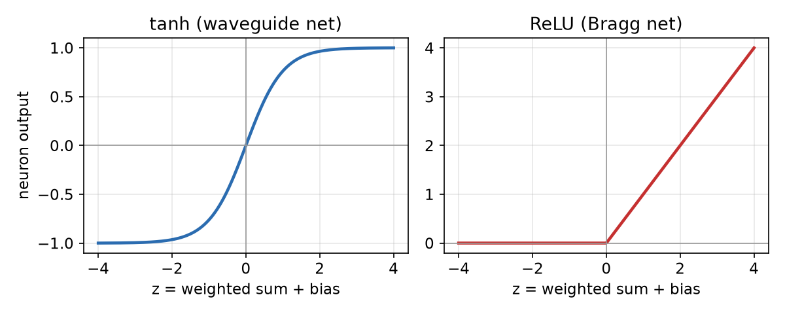
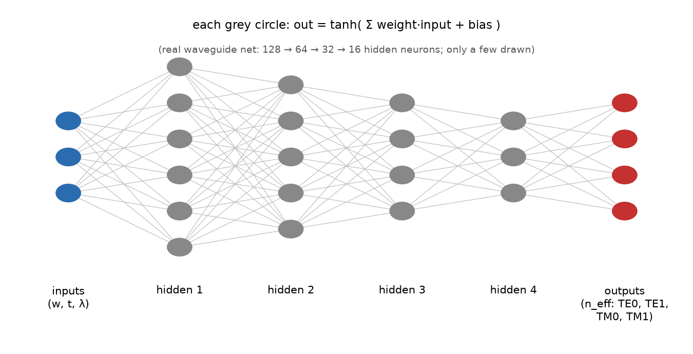
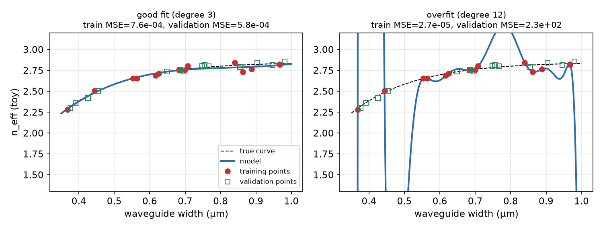
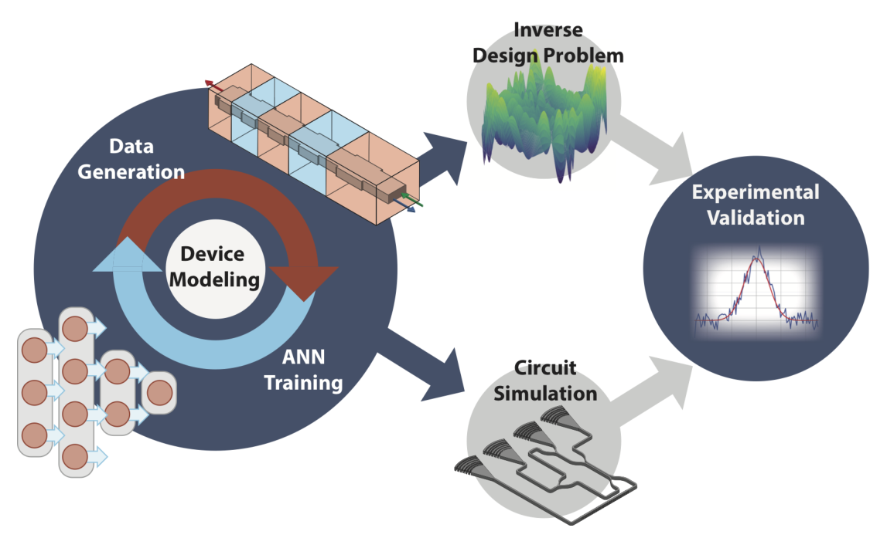
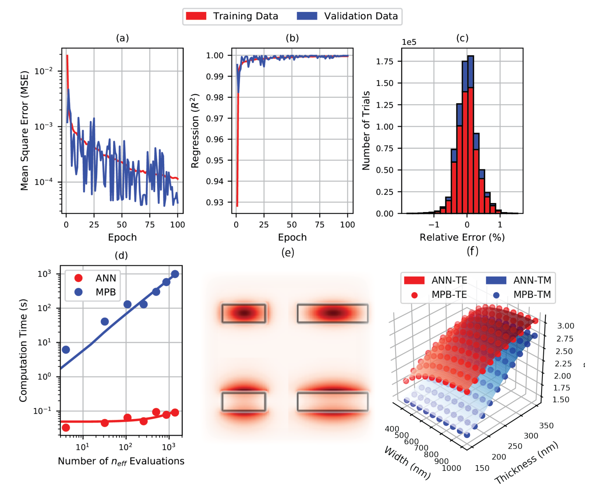
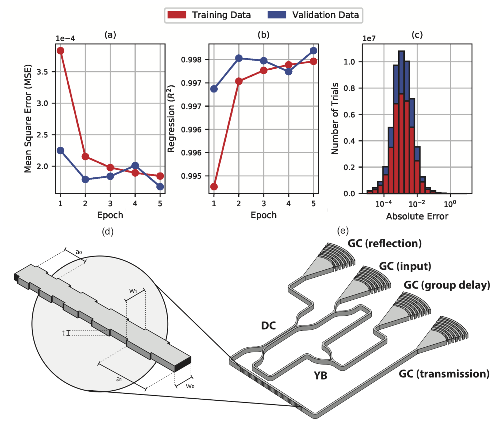
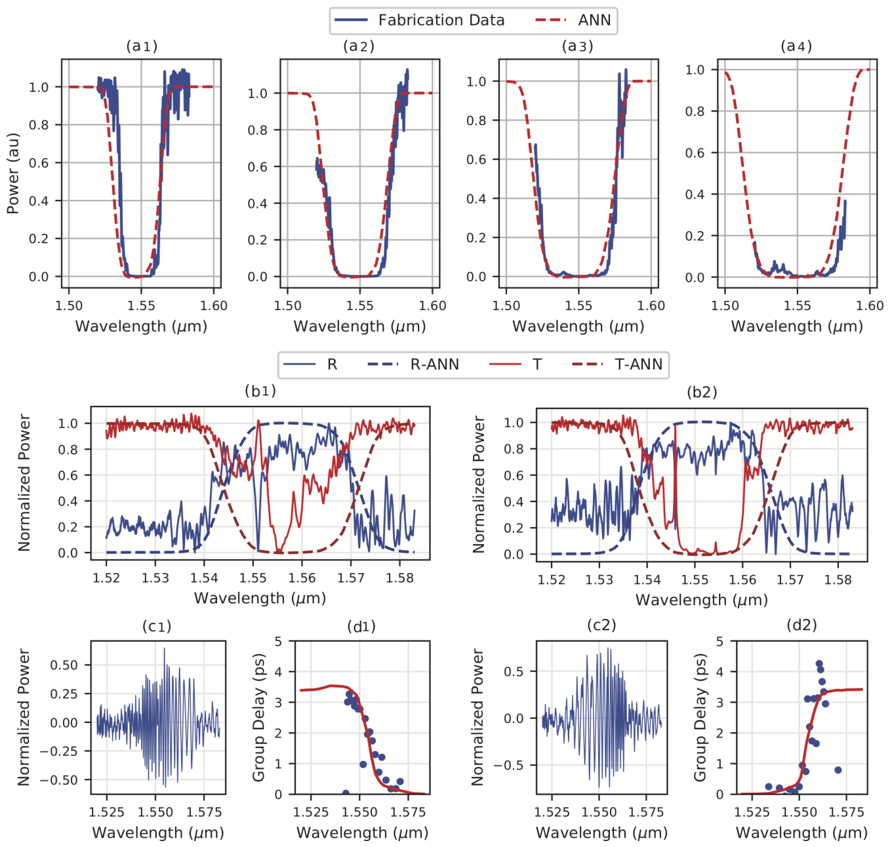
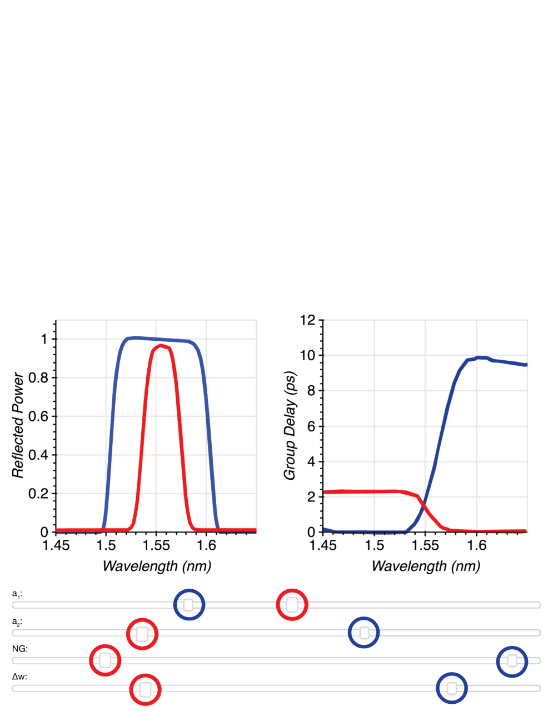
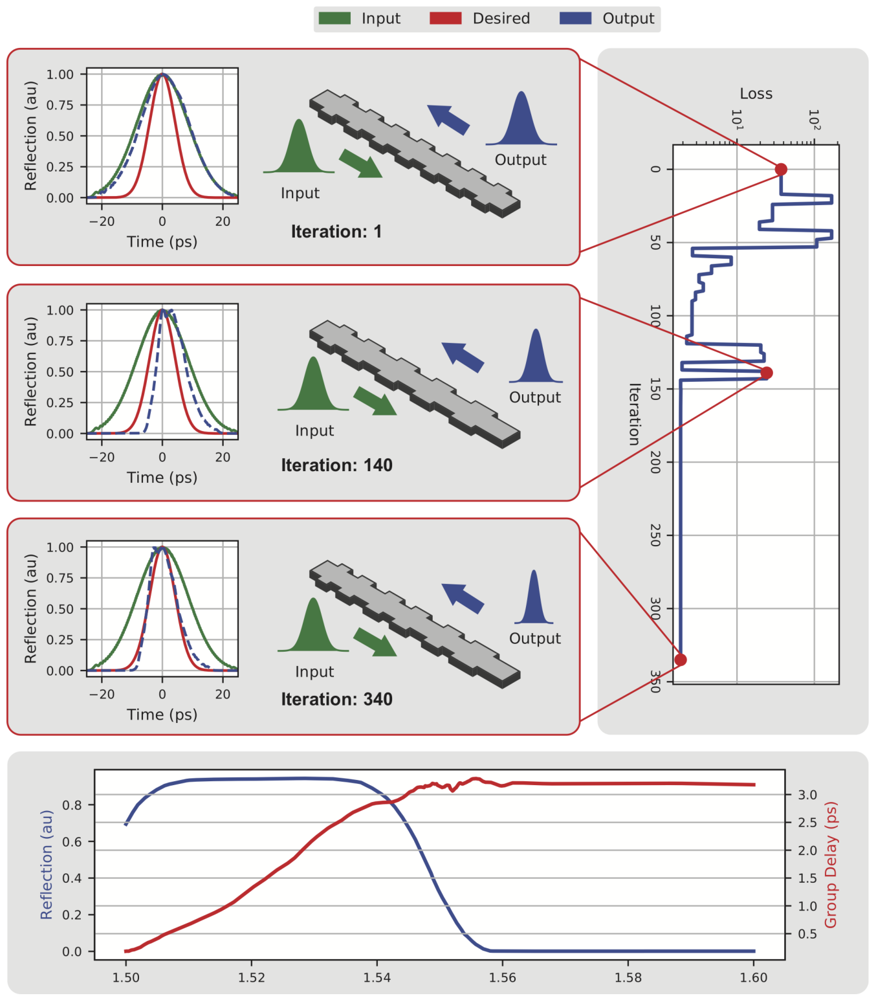

# Week 4 · Day 2 — Tuesday 13 Oct 2026 · Hammond & Camacho 2019 (ANN design)

*Simple-English study version of A. M. Hammond & R. M. Camacho, "Designing integrated photonic devices using artificial neural networks", Optics Express 27(21), 29620–29638 (2019). The source copy is titled "Designing Silicon Photonic Devices using Artificial Neural Networks".*

---

!!! abstract "Today's slot"
    **Morning, 06:15–07:45 (1.5 h):** "Hammond & Camacho 2019 + Hammond et al. 2022 — the Meep adjoint solver papers."

    **EXIT:** `paper-notes/2019-hammond-meep-adjoint.md`, plus one sentence defining a `MaterialGrid`.

    **Important correction from the schedule's own HOW block.** The schedule puts this paper with "the Meep adjoint solver papers", but it is **not** an adjoint paper. It is the **artificial-neural-network (ANN)** paper. The schedule says it is "useful in week 10, not the adjoint paper", and asks you to fix the reading-lineage entry in your notes. The real solver papers are Hammond et al. 2022 (the Meep solver, see the [companion page for today](day-02-tue-13-oct-2026-hammond-2022.md)) and Hammond et al. 2021 (foundry design-rule constraints).

    **Why read it anyway, today?** It is short, it is by the same first author (Alec Hammond), and it shows the *other* way to speed up photonic design: replace the slow simulator with a fast learned model (a **surrogate**). Your project has a "possible ML surrogate" branch, so this is your first look at it.

    **After this page you should be able to:** explain what a neuron, a layer, training, a loss, backpropagation and overfitting are; say what the two networks in this paper take in and put out; read the training plots (MSE, $R^2$, error histogram); explain why putting wavelength as an *input* matters; and say how the "inverse design" here differs from the adjoint inverse design in Meep.

    **Evening (same day):** run `02-Waveguide_Bend.ipynb` and change the figure of merit (FOM) to transmission into one port only. That task belongs to the 2022 page, not to this one.

## Before you start: the big picture

To design a photonic device you normally simulate it. A simulation solves Maxwell's equations on a computer. For a simple waveguide cross-section this takes seconds. For a long Bragg grating in 3D it can take hours. If you want to try thousands of designs, you wait for weeks.

This paper asks: what if we ran the slow simulator many times **once**, saved all the answers, and then taught a neural network to imitate the simulator? After that, every new question is answered by the network in milliseconds. The slow work is moved to the front, done once, and then reused.

Analogy: a new taxi driver uses a map and plans every trip carefully (slow, exact). An experienced driver has done so many trips that they just *know* how long a trip takes (fast, approximately right). The neural network is the experienced driver. It learned from thousands of past trips (the simulations). It is only reliable for trips similar to ones it has done before.

The authors show this works for two devices: (1) a plain strip waveguide, where the network predicts the **effective index**; and (2) a **chirped Bragg grating**, where the network predicts the reflection spectrum and the delay of the light. They then build real chips and show the network's predictions match the measurements.

## Background you need

### Effective index (one-line reminder)

A light **mode** in a waveguide moves as if it were in a uniform material of index $n_{eff}$, the **effective index**. For a 500 nm × 220 nm silicon strip in oxide at 1550 nm, $n_{eff} \approx 2.44$ for the fundamental TE mode. It depends on width $w$, thickness $t$ and wavelength $\lambda$. Getting $n_{eff}$ normally needs an **eigenmode solver** such as MPB (MIT Photonic Bands), which takes about a second per geometry.

### Bragg grating and chirp

A **Bragg grating** is a waveguide whose width wiggles periodically: wide, narrow, wide, narrow. Each wiggle reflects a tiny bit of light. At one wavelength all those tiny reflections add up in step, and the grating acts as a mirror. That wavelength is the **Bragg wavelength**:

$$\lambda_B = 2\, n_{eff}\, a$$

where $a$ is the **period** (length of one wide+narrow pair). Worked example: $n_{eff} = 2.44$ and $a = 318$ nm give $\lambda_B = 2 \times 2.44 \times 318 \approx 1552$ nm.

A **chirped** grating has a period that changes slowly along its length, from $a_0$ at the start to $a_1$ at the end. Then different wavelengths are reflected at different places. Short wavelengths bounce near the short-period end, long wavelengths near the long-period end. Two effects follow:

- The mirror works over a wider band (the "stopband" becomes wider).
- Different wavelengths travel different distances before they come back. So they come back at different times. This wavelength-dependent delay is the **group delay** $\tau_g(\lambda)$. A chirped grating can therefore stretch or squeeze a short light pulse. This is used to **compress pulses** or to cancel dispersion.

The **corrugation width** $\Delta w = w_1 - w_0$ is how deep the wiggle is (wide part minus narrow part). Deeper wiggles reflect more strongly per period.

### Transfer-matrix method (what the "slow" simulator for gratings is)

The **transfer-matrix method** (the paper calls it LDMTMM, "layered dielectric media transfer matrix method") cuts the grating into short uniform pieces. Each piece is treated as a plain waveguide with its own $n_{eff}$. For each piece you write a 2×2 matrix that says how forward and backward waves change across it. Multiply all matrices together and you get the whole grating's reflection and transmission. A grating with 1000 periods needs about 2000 matrices **per wavelength**, and each piece needs its own $n_{eff}$ from a mode solver. That is where the cost comes from.

### Neural networks from zero

#### A single neuron

A **neuron** is a tiny function. It takes several numbers in, $x_1, x_2, \dots$, and gives one number out:

$$z = w_1 x_1 + w_2 x_2 + \dots + w_n x_n + b, \qquad y = \sigma(z)$$

- $w_i$ are the **weights**: how much the neuron cares about each input.
- $b$ is the **bias**: a constant offset.
- $\sigma$ is the **activation function**: a fixed bendy curve. Without it, stacking neurons would only ever give a straight-line (linear) function. The bend is what lets a network model curved relationships.

Worked example: inputs $x = (0.5, 0.22)$ (width and thickness in µm), weights $(2, 5)$, bias $-2$. Then $z = 2(0.5) + 5(0.22) - 2 = 0.1$, and with $\sigma = \tanh$, $y = \tanh(0.1) \approx 0.0997$.



**How to read this figure.** Left: $\tanh$, a smooth S-curve between −1 and +1. The waveguide network uses it, which makes its output smooth and gives smooth derivatives. Right: **ReLU** ("rectified linear unit"), $\max(0, z)$, which is zero for negative input and a straight line otherwise. The Bragg network uses ReLU; it is cheap and trains well for deep networks.

#### Layers and a network

Put many neurons side by side: that is a **layer**. Each neuron in a layer gets *all* the outputs of the previous layer. This is called a **fully connected** (or "dense") layer. Stack layers: the first takes the **inputs**, the last gives the **outputs**, and the layers in between are **hidden layers**. A network with several hidden layers is "deep". All the weights and biases together are the network's **parameters**.



**How to read this figure.** Information flows left to right. Three inputs (width, thickness, wavelength) enter on the left. Each grey circle is a neuron with tanh. Four outputs on the right are effective indices of four modes. Every line is one weight. The real network has 128, 64, 32 and 16 neurons in its four hidden layers; only a few are drawn.

How many parameters is that? Layer by layer, (inputs × neurons + neurons for the biases):

- $3 \to 128$: $3 \times 128 + 128 = 512$
- $128 \to 64$: $128 \times 64 + 64 = 8256$
- $64 \to 32$: $2080$
- $32 \to 16$: $528$
- $16 \to 4$: $68$

Total ≈ **11 444 numbers**. One prediction is about 11 000 multiply-adds. A laptop does that in microseconds. That is why the network is so fast.

#### Training, loss and the gradient

At first the weights are random, so the network's outputs are nonsense. **Training** means adjusting the weights so outputs match known correct answers. You need a **dataset** of input/output pairs from the slow simulator.

We measure "how wrong" with a **loss function**. Here it is the **mean squared error (MSE)**:

$$\text{MSE} = \frac{1}{N}\sum_{i=1}^{N}\left(\hat y_i - y_i\right)^2$$

where $y_i$ is the true answer (from MPB), $\hat y_i$ is the network's guess, and $N$ is the number of samples. Squaring makes all errors positive and punishes big errors more.

Example: if the true $n_{eff}$ values are 2.44 and 1.80 and the network says 2.45 and 1.78, then MSE $= \tfrac12(0.01^2 + 0.02^2) = 2.5 \times 10^{-4}$.

To lower the loss we use **gradient descent**. The **gradient** is the list of slopes $\partial \text{MSE} / \partial w$ for every weight $w$: "if I nudge this weight up a little, does the loss go up or down, and how fast?" Then we step each weight a little bit downhill:

$$w \leftarrow w - \eta_{lr} \frac{\partial \,\text{MSE}}{\partial w}$$

$\eta_{lr}$ is the **learning rate**, the step size.

#### Backpropagation

A network has thousands of weights. Computing each slope separately would be slow. **Backpropagation** gets all of them in one backward sweep using the **chain rule** of calculus. If $L$ depends on $y$, $y$ depends on $z$, and $z$ depends on $w$:

$$\frac{\partial L}{\partial w} = \frac{\partial L}{\partial y}\cdot\frac{\partial y}{\partial z}\cdot\frac{\partial z}{\partial w}$$

Worked one-neuron example: $z = wx + b$, $y = \tanh(z)$, $L = (y - y_{true})^2$.

- $\partial L / \partial y = 2(y - y_{true})$
- $\partial y / \partial z = 1 - \tanh^2(z)$
- $\partial z / \partial w = x$

So $\partial L/\partial w = 2(y - y_{true})(1-y^2)\,x$. With $x = 1$, $w = 0.5$, $b = 0$, $y_{true} = 0.8$: $y = \tanh(0.5) = 0.462$, so $\partial L/\partial w = 2(-0.338)(0.787)(1) = -0.532$. Negative slope: increasing $w$ lowers the loss, so gradient descent will increase $w$. Correct, because we need a bigger output.

Backprop does this for the whole network, starting at the output and passing "blame" backwards layer by layer. **Keep this idea**: the adjoint method in the 2022 paper is the *same trick* (reverse-mode chain rule) applied to Maxwell's equations.

#### Batches and epochs

You do not compute the gradient on all the data at once. You take a small **batch** (here 16 samples), compute the gradient, take a step, take the next batch, and so on. One full pass through the whole training set is an **epoch**. The waveguide network trained for 100 epochs; the Bragg network for only 5.

#### Training set, validation set, and overfitting

A model can "memorise" its training data instead of learning the true pattern. Then it is perfect on data it has seen and bad on new data. This is **overfitting**. To detect it, you hide part of the data (the **validation set**) from training. You only use it to check the model. If the training error keeps falling but the validation error rises, you are overfitting.



**How to read this figure.** Toy data: a made-up "$n_{eff}$ vs width" curve (dashed) with a little noise. Red dots are used for fitting; green squares are held back. Left: a simple model follows the trend, and training and validation errors are both small and similar. Right: a very flexible model passes through every red dot (tiny training error) but swings wildly between them (huge validation error). The paper's argument "training and validation errors are similar, so no overfitting" is exactly the left-hand situation.

Ways to stop overfitting: use more data, use a simpler model, or **stop early** (stop training when validation stops improving). The paper uses early stopping. It also mentions **dropout**: during training, randomly switch off some neurons so the network cannot rely on any single one.

#### $R^2$, the coefficient of determination

$$R^2 = 1 - \frac{\sum_i (y_i - \hat y_i)^2}{\sum_i (y_i - \bar y)^2}$$

$\bar y$ is the average of the true values. The bottom is "how much the data varies"; the top is "how much error is left after the model". $R^2 = 1$ means perfect; $R^2 = 0$ means no better than always guessing the average. $R^2 = 0.9996$ means the model explains 99.96% of the variation.

#### Surrogate models and inverse networks

A **surrogate model** is a cheap stand-in for an expensive simulator: geometry in, performance out. This paper's networks are **forward surrogates**. "Forward" means design → response.

An **inverse network** would go the other way: desired response → design. Inverse networks are hard because many designs can give the same response (no one-to-one mapping), so the "inverse" is not a function. This paper does **not** train an inverse network. Instead it does inverse design by putting the fast forward surrogate inside an ordinary optimiser, which searches for the design whose predicted response matches the target. Keep this distinction clear; it comes up again in week 10.

#### Interpolation vs extrapolation

A trained network is trustworthy for inputs inside the range it was trained on (**interpolation**). Outside that range (**extrapolation**) it can give any nonsense. Always know the training domain.

## 1 Introduction

**What it says.** Silicon photonics is now made in commercial CMOS foundries. The bottleneck is no longer making chips; it is designing them. Accurate simulation is expensive and expert-heavy, so "the typical time to design integrated photonic devices now often exceeds the time to manufacture and test them".

The authors propose an ANN workflow that is at least **four orders of magnitude** (10 000×) faster than simulation. Its key design choice: a **small number of meaningful inputs and outputs**, things a designer actually thinks about (width, thickness, period, wavelength), rather than thousands of pixels.

**How it differs from earlier work.**

- Ferreira et al. and Tahersima et al. used every grid pixel of a 2D design as input. That is a "black box": powerful, but a designer cannot reason with 10 000 pixel values.
- Zhang et al. and Peurifoy et al. used a few intuitive inputs, but **one output neuron per wavelength point**. So the spectrum was always sampled at fixed wavelengths.
- This paper makes **wavelength an input**. Ask for any wavelength, get the answer at that wavelength.

They demonstrate a waveguide model, a chirped Bragg grating model, a forward design GUI, an inverse design of a pulse compressor, and fabricated devices that agree with predictions. They claim this is the first experimental validation of photonic devices designed with ANNs.

## 2 Results

### Overview

The workflow has a loop: generate data with a traditional solver → train the ANN → check it → (if not good enough, generate more or different data, retrain). Then use the ANN for circuit simulation and inverse design, and fabricate to validate. The waveguide network is the simple demo and also a building block: it later speeds up the generation of the grating data.



**How to read this figure.** It is a cycle. "Data generation" (classical simulation) feeds "ANN training". The trained model then feeds "circuit simulation" and the "inverse design problem". "Experimental validation" closes the loop by checking the model against real chips. The point: the expensive part (data generation) happens once, at the start, and everything downstream is cheap.

### Waveguide Neural Network

**What it does.** Inputs: width $w$, thickness $t$, wavelength $\lambda$. Outputs: $n_{eff}$ of the first two TE and first two TM modes (four numbers). So it learns the function

$$f_\theta : (w, t, \lambda) \mapsto \left(n_{eff}^{TE_0}, n_{eff}^{TE_1}, n_{eff}^{TM_0}, n_{eff}^{TM_1}\right)$$

where $\theta$ means all the network's weights and biases.

**Why smooth matters.** Because the network uses tanh, its output is a smooth function of its inputs, and you can differentiate it exactly (by backprop). That matters for two things:

1. **Group index.** The group index is
$$n_g = n_{eff} - \lambda \frac{\partial n_{eff}}{\partial \lambda}.$$
With wavelength as an input, $\partial n_{eff}/\partial\lambda$ comes straight out of the network. Example: if $n_{eff} = 2.44$ and $\partial n_{eff}/\partial \lambda = -1.1\ \mu\text{m}^{-1}$ at $\lambda = 1.55\ \mu$m, then $n_g = 2.44 + 1.55 \times 1.1 \approx 4.15$, a typical value for a 500 × 220 nm strip.
2. **Gradient-based optimisation** needs derivatives of the output with respect to the design.

**Checking accuracy.** They split the data: 70% training, 30% validation. After each epoch they recorded MSE and $R^2$ on both sets. They stopped at 100 epochs.

| Metric | Training | Validation |
|---|---|---|
| MSE | $1.323\times10^{-4}$ | $7.490\times10^{-5}$ |
| $R^2$ | 0.9996 | 0.9997 |

What does MSE ≈ $10^{-4}$ mean? The typical error is $\sqrt{10^{-4}} = 0.01$ in $n_{eff}$. Relative to $n_{eff}\approx 2.4$ that is about 0.4%. (Small enough for many tasks, but note: a 0.01 error in $n_{eff}$ shifts a Bragg wavelength by about $1550 \times 0.01/2.44 \approx 6$ nm. So "good" depends on the use.)

Note the validation error is slightly *lower* than the training error. That can happen by chance (the validation samples happen to be a little easier); the main point is that the two are close, so the model is not overfitting.



**How to read this figure.**
(a) MSE (log scale) vs epoch: red = training, blue = validation. Both fall from ~$10^{-2}$ to ~$10^{-4}$; the validation curve is noisier but follows the same trend, so no overfitting.
(b) $R^2$ vs epoch climbs to ~1 within a few epochs.
(c) Histogram of relative errors after training: almost all between −1% and +1%, centred on zero, same shape for both sets.
(d) Time vs number of $n_{eff}$ evaluations, log–log. Blue (MPB) grows in a straight line: each evaluation costs roughly a second. Red (ANN) stays near 0.05–0.1 s even for 1000 evaluations: one call can evaluate a whole batch. At 1000 evaluations the gap is ~$10^4$.
(e) Example mode profiles from MPB (the training data source).
(f) $n_{eff}$ surface vs width and thickness at 1550 nm: dots = MPB, surfaces = ANN. TE (red) lies above TM (blue), as expected for thin silicon.

**What the speed buys.** Methods that chop a device into many short waveguide sections (transfer matrices, eigenmode expansion) need an $n_{eff}$ for each section. With the ANN, each is nearly free. **Monte Carlo** analysis of fabrication variation, which runs the same calculation thousands of times with random width/thickness errors, also becomes cheap. That is directly relevant to your yield work.

### Bragg Grating Neural Network

**Why it is harder.** Gratings have many parameters and a very nonlinear response. There is no simple formula going from a target spectrum back to the design. People therefore use black-box search, where each try is a full simulation; a 3D FDTD try can take 8–12 hours. The ANN answers in milliseconds.

**The data.** They used the *waveguide* ANN to supply all the $n_{eff}$ values inside the transfer-matrix grating simulator. That made data generation about 100× faster than using MPB. One network feeds the next: a nice example of cascading surrogates.

**Inputs (5):** first period $a_0$, last period $a_1$, number of periods $NG$, corrugation width $\Delta w = w_1 - w_0$, and one wavelength $\lambda$.

**Outputs (2):** reflected power $R(\lambda)$ and group delay $\tau_g(\lambda)$.

**Pre-processing.** Raw grating spectra have side ripples ("ringing") that depend on the **apodization** (how the corrugation strength is tapered at the ends). They fitted each spectrum with a smooth "generalised skewed Gaussian" first and trained on that. Effect: easier training and a model that is not tied to one specific apodization. Cost: the model cannot predict those ripples.

**Training.** The dataset was huge (26 million samples), so the error settled within a few epochs; they stopped at 5.

| Metric | Training | Validation |
|---|---|---|
| MSE | $1.845\times10^{-4}$ | $1.677\times10^{-4}$ |
| $R^2$ | 0.9975 | 0.9977 |

They report **absolute** error, not relative error, because many true values are near zero (e.g. reflection outside the stopband), and dividing by almost-zero makes relative errors explode.

**Scaling claim.** The ANN's cost grows linearly as you add grating parameters; the transfer-matrix method grows at least quadratically, according to the authors.

**Experimental check.** Two kinds of test circuit:

1. Transmission-only: simple, little correction needed.
2. A full **interrogation circuit** that measures reflection, transmission and group delay of the same grating at once.



**How to read this figure.** (a)–(c): the same kind of training plots as Fig. 2, but over only 5 epochs, with absolute-error histograms. (d): the grating geometry; $a_0$ and $a_1$ are the first and last period, $w_0$ and $w_1$ the narrow and wide widths. (e): the test circuit. Light enters at a **grating coupler** (GC), passes **Y-branches** (YB, 50/50 splitters) and a **directional coupler** (DC) into the Bragg grating (BG). Transmitted light goes to one GC. Reflected light comes back, is split, and half goes through a **Mach–Zehnder interferometer** (MZI), whose fringes encode the phase and hence the group delay.

**How group delay is measured.** An MZI interferes light with a delayed copy of itself. Its output oscillates with wavelength. The spacing of those oscillations changes when the grating adds wavelength-dependent delay. From the local fringe spacing you can extract $\tau_g(\lambda)$. That is what panels (c) and (d) of Fig. 4 show.

**Results.**

- Transmission-only gratings: chirp bandwidths 5, 10, 15, 20 nm; 600 periods; $\Delta w = 50$ nm. ANN predictions match measurements very well.
- Interrogator gratings: chirp 3 nm; 750 periods; $\Delta w = 30$ nm. Half were mirrored (flipped) to give opposite-sign delay slopes. Data were **de-embedded**: the known responses of the GCs, YBs and DCs were divided out so that only the grating remains.

There were some extra narrow resonances in the data. The authors blame the e-beam writer: the tiny period changes along a chirped grating are smaller than the writer's grid, so the period is rounded at some positions, creating small defects that act like weak **Fabry–Pérot** cavities (two partial mirrors facing each other). These also caused a ~1 nm shift. Still, the ANN predicted R, T and delay together.



**How to read this figure.** Top row (a1–a4): transmission vs wavelength; solid blue = measured, red dashed = ANN. Larger chirp = wider dip (wider stopband), and the ANN gets the edges right. (In a4 the measured trace only covers part of the band.) Middle (b1–b2): reflection (blue) and transmission (red) for two mirrored gratings; measured traces are noisy and show some sharp defect resonances, but the band shape matches the dashed ANN curves. Bottom: (c1, c2) raw MZI fringes, and (d1, d2) the group delay extracted from them (dots) vs ANN (line). The two gratings have opposite slopes because one is mirrored.

### Forward design

The network is so fast that you can build an interactive tool: move a slider for $a_0$, $a_1$, $NG$ or $\Delta w$, and the reflection and delay curves redraw instantly. Because wavelength is an input, you can sample the spectrum at any resolution you like. The value is **intuition**: a newcomer can learn how a chirped grating behaves in minutes by playing.



**How to read this figure.** Top left: reflected power vs wavelength for two designs (red and blue). Top right: their group delay. Bottom: the four sliders; the red and blue handles set each design's parameters. Each slider move triggers one ANN call per wavelength point.

### Inverse design

Goal: design a grating that **compresses** a pulse. The input is a 20 ps chirped pulse with 4 nm bandwidth. "Chirped pulse" means its colours arrive at different times. A grating whose group delay has the opposite slope delays the early colours more and the late colours less, so they all bunch up and the pulse gets shorter. The target was 2× compression.

Method: a **truncated Newton** optimiser. Newton methods use curvature (second derivatives) to pick good steps; "truncated" means the inner linear solve is only done approximately to save time. Each iteration it:

1. picks grating parameters,
2. asks the ANN for $R(\lambda)$ and $\tau_g(\lambda)$,
3. applies that response to the input pulse (multiply its spectrum by the grating's complex reflection, transform back to time),
4. compares the output pulse width to the desired one: that is the **cost function** (the loss).

It needed about 340 grating evaluations. With ANN calls that is seconds; with 3D FDTD at 8–12 h each it would be months.

The authors note that because the ANN is differentiable, a gradient-based optimiser could get the **Jacobian** (all first derivatives) and **Hessian** (all second derivatives) directly from the network, with no extra sampling.



**How to read this figure.** Left column, three snapshots (iterations 1, 140, 340): green = input pulse, red = desired (narrower) pulse, blue dashed = output pulse with the current grating. By 340 the blue matches the red. Right: loss (log scale) vs iteration; the jumps are the optimiser trying bold steps, then it settles at a low value. Bottom: the final grating's reflection (blue) and group delay (red) vs wavelength. The delay ramps by ~3 ps across the band, which is what does the compressing.

## 3 Discussion

**Main claims.**

- One trained network ("a single global parameter fit") covers waveguides of any size in range and gratings with any bandwidth, chirp, length and corrugation, at any wavelength.
- **Wavelength as an input** is the key choice. It is harder to train but more convenient: optimisers can talk about bandwidth and shape instead of fixed sample points; training spectra need not share the same wavelength grid; you can sample finely only where needed (e.g. near a sharp ring resonance).
- Future: other activations, other architectures, ring resonators, and **cascading** several device ANNs (each giving S-parameters) to optimise whole circuits.

**Costs and caveats.**

- Training data is expensive: millions of simulations. Cloud computing makes this feasible. Once trained, the network is small, shareable, and can be extended with **transfer learning** (start from a trained network and fine-tune on new data).
- The network can only be as good as its data, architecture and training. These introduce **biases**.
- **Dropout inference** (Monte Carlo dropout): keep dropout switched on at prediction time, run the same input many times, and look at the spread of answers. The spread is an estimate of the model's uncertainty. Useful when you need to know whether to trust a prediction.
- Foundries could train networks on their own **measured** device data and ship the network in a **PDK** (process design kit) without revealing their secret process details.

## 4 Methods

### Training data generation and preprocessing

**Waveguide data.** MPB (a frequency-domain eigenmode solver):

- 31 widths, 350–1500 nm
- 31 thicknesses, 150–400 nm
- → 31 × 31 = 961 geometries
- 200 wavelengths, 1400–1700 nm
- → 961 × 200 = **192 200 samples**, split 70/30.
- 3 inputs, 4 outputs each. No post-processing.

Check the grid spacing: width step = (1500 − 350)/30 ≈ 38 nm; thickness step = 250/30 ≈ 8.3 nm; wavelength step = 300/199 ≈ 1.5 nm. The network must interpolate between these points. (Note: the text in Section 2 says the waveguide model was shown for widths 350–1000 nm and thicknesses 150–350 nm, a subset of this range.)

**Grating data.** Transfer-matrix simulations of 104 131 gratings, using the waveguide ANN for every $n_{eff}$:

- 10 corrugation widths, 10–100 nm
- 11 lengths, 100–2000 periods
- 32 chirp patterns

Spectra were fitted with generalised skewed Gaussians and resampled at 250 wavelengths from 1.45 to 1.65 µm. Fits that failed were thrown out. Result: **26 032 750 samples**. (26 032 750 / 250 = 104 131 gratings: so the count is the number of gratings × 250 wavelength points.)

### Neural network design and training

- Software: Keras on TensorFlow.
- Several hundred architectures tried, compared by MSE and $R^2$.
- **Waveguide net:** 4 hidden layers of 128, 64, 32, 16 neurons; **tanh**; 100 epochs; batch 16.
- **Bragg net:** 10 hidden layers of 128 each; **ReLU**; ~5 epochs; batch 16; data **normalised** (inputs and outputs rescaled to similar ranges, e.g. 0–1, so no single input dominates the weighted sums).

Parameter count of the Bragg net: $5\times128+128 = 768$, then nine $128\to128$ layers at $128\times128+128 = 16\,512$ each $= 148\,608$, then $128\times 2 + 2 = 258$. Total ≈ **149 600** parameters.

### Simulation benchmarks

Quad-core Intel i5-2400, 3.1 GHz, 12 GB RAM (an ordinary desktop). They ran many evaluations one after another with each method, fitted a straight line to time vs number of evaluations, and compared the slopes. The ratio of slopes is the speed-up.

### Device fabrication

Applied Nanotools (Canada), 100 kV **electron-beam lithography** (patterns drawn directly with an electron beam instead of a photomask). SOI with 220 nm silicon on 2 µm buried oxide. Etched by **ICP-RIE** (inductively coupled plasma reactive-ion etching, a directional dry etch). Covered with 2.2 µm of PECVD oxide (plasma-enhanced chemical vapour deposition).

### Device measurement

Automated setup at UBC. Agilent 81600B tunable laser swept 1500–1600 nm in 10 pm steps; Agilent 81635A power sensors. Polarisation-maintaining fibre to launch TE light into the grating couplers. Separate test structures (just the couplers) were measured so their response could be divided out (de-embedding).

### Data availability, acknowledgements

Data on request. Thanks to Lukas Chrostowski (author of your textbook) for the SiEPIC fabrication process.

## A runnable toy: train a tiny surrogate with backprop

This trains a one-hidden-layer tanh network on a toy "$n_{eff}$ vs width" curve, with plain numpy and hand-written backprop.

```python
import numpy as np
rng = np.random.default_rng(0)

# toy "simulator": n_eff of a strip vs width (um), saturating curve
sim = lambda w: 1.44 + 1.41 * (1 - np.exp(-(w - 0.2) / 0.18))
w = rng.uniform(0.35, 1.0, (200, 1)); y = sim(w)
wtr, ytr, wva, yva = w[:140], y[:140], w[140:], y[140:]   # 70/30 split
x = lambda w: (w - 0.675) / 0.325                           # normalise input to ~[-1,1]

H = 16                                                      # hidden neurons
W1, b1 = rng.normal(0, 1, (1, H)), np.zeros(H)
W2, b2 = rng.normal(0, 0.1, (H, 1)), np.array([2.5])
lr = 0.5
for epoch in range(20000):          # full-batch gradient descent
    # forward pass
    z = x(wtr) @ W1 + b1; h = np.tanh(z); yhat = h @ W2 + b2
    # loss gradient (MSE)
    g = 2 * (yhat - ytr) / len(ytr)
    # backprop: chain rule layer by layer
    gW2 = h.T @ g; gb2 = g.sum(0)
    gh = g @ W2.T; gz = gh * (1 - h**2)      # tanh'(z) = 1 - tanh^2
    gW1 = x(wtr).T @ gz; gb1 = gz.sum(0)
    for p, gp in ((W1, gW1), (b1, gb1), (W2, gW2), (b2, gb2)):
        p -= lr * gp
    if epoch % 5000 == 0 or epoch == 19999:
        pred = lambda w: np.tanh(x(w) @ W1 + b1) @ W2 + b2
        print(epoch, "train MSE %.2e" % np.mean((pred(wtr)-ytr)**2),
                     "val MSE %.2e" % np.mean((pred(wva)-yva)**2))
print("n_eff(0.50 um): sim %.4f  net %.4f" % (sim(0.5), pred(np.array([[0.5]]))[0, 0]))
```

**What you should see.** Both MSEs fall from ~$10^{-1}$ to below $10^{-5}$ and stay close to each other (no overfitting). The final line shows simulator and network agreeing to about three decimal places (2.5837 vs 2.5835). Takes a few seconds. Try `pred(np.array([[1.6]]))`: outside the training range, the network drifts away from the true curve. That is extrapolation failure.

## How this connects to your project

Your project is robust, fabrication-aware inverse design with Meep/Tidy3D, Monte-Carlo yield, and possibly an ML surrogate. This paper gives you three things:

1. **The surrogate recipe.** Data from a trusted solver → train/validation split → MSE and $R^2$ → error histogram → speed benchmark → experimental check. Use the same checklist if you build one.
2. **Monte-Carlo yield needs fast evaluation.** A yield estimate needs thousands of simulations of slightly perturbed devices. A surrogate trained on perturbed simulations can make that cheap. The paper explicitly names Monte Carlo of fabrication variation as a use.
3. **Contrast with the adjoint method.** Here, inverse design = optimiser + fast surrogate with a few parameters. In Meep's adjoint method (today's 2022 paper), inverse design = optimiser + exact gradients from two simulations, over thousands of pixels. Surrogates are fast but approximate and limited to their training range; adjoint is exact but needs full simulations. Many recent works combine them. Label this paper correctly in your reading lineage: it is the **ANN** paper.

!!! warning "Common confusions"
    - **This is not the adjoint paper.** The schedule's label groups it with the Meep solver papers; the HOW block corrects this. Cite Hammond et al. 2022 for the solver.
    - **"Inverse design" here is not an inverse network.** The network only goes design → response. Inverse design is done by an optimiser calling the network many times.
    - **Low training error does not mean a good model.** Only a held-out validation set tells you about new data. And even validation data come from the *same* range; outside it, all bets are off.
    - **Validation error slightly below training error is not a bug** by itself; it is common when the gap is small and training uses regularisation or the sets are random.
    - **$R^2 = 0.9996$ does not mean 0.04% error.** It means the leftover squared error is 0.04% of the data's variance. Absolute errors can still matter (e.g. 0.01 in $n_{eff}$ shifts a Bragg peak by several nm).
    - **The Bragg network does not predict side-lobe ripples.** Its training spectra were smoothed with Gaussian fits first.
    - **ANN "10⁴× faster" is per evaluation after training.** It ignores the cost of generating the training data and of training.

## Check yourself

1. What are the inputs and outputs of the waveguide network?

    ??? note "Answer"
        Inputs: width, thickness, wavelength. Outputs: effective index of the first two TE and first two TM modes (four numbers).

2. Why is it useful that wavelength is an input rather than having one output per wavelength?

    ??? note "Answer"
        You can ask for any wavelength (arbitrary sampling); training spectra need not share a grid; you can sample finely only where needed; derivatives with respect to wavelength (for group index and group delay) come straight from the network; optimisers can work with bandwidth and shape rather than fixed points.

3. Compute the output of a neuron with inputs (1, 2), weights (0.5, −0.25), bias 0.1 and tanh activation.

    ??? note "Answer"
        $z = 0.5 - 0.5 + 0.1 = 0.1$, $y = \tanh(0.1) \approx 0.0997$.

4. What is an epoch? What is a batch? Why did the Bragg network need only 5 epochs?

    ??? note "Answer"
        An epoch is one full pass over the training set; a batch is the small group of samples (here 16) used for one gradient step. The Bragg dataset had 26 million samples, so one epoch already contains about 1.6 million gradient steps; the loss settled within a few epochs.

5. How does backpropagation relate to the adjoint method?

    ??? note "Answer"
        Both are reverse-mode application of the chain rule: one forward pass, then one backward pass that gives the derivative of a single scalar loss with respect to all parameters at once, at a cost similar to the forward pass.

6. How did the authors check for overfitting, and what did they see?

    ??? note "Answer"
        They kept a 30% validation set never used for weight updates and tracked its MSE and $R^2$ every epoch. Training and validation metrics converged together and the error histograms had the same shape, so there was little or no overfitting. They also stopped training early.

7. Why did they report absolute rather than relative error for the Bragg network?

    ??? note "Answer"
        Many true values (e.g. reflection outside the stopband) are at or near zero, and dividing by a near-zero number makes relative error blow up meaninglessly.

8. How was the grating training set made faster to generate?

    ??? note "Answer"
        The transfer-matrix grating simulator needs an $n_{eff}$ for each section; they used the trained waveguide ANN instead of MPB for those, making data generation about 100× faster.

9. Explain how a chirped Bragg grating can compress a pulse.

    ??? note "Answer"
        Different wavelengths reflect from different positions, so they experience different delays (a group delay slope). If the incoming pulse's colours are spread in time one way, a grating with the opposite delay slope delays early colours more and late colours less, so they arrive together and the pulse gets shorter.

10. What extra features appeared in the measured spectra, and what did the authors blame?

    ??? note "Answer"
        Sharp resonant features and a ~1 nm shift. They attributed them to the e-beam raster grid: tiny period changes that do not align with the writer's grid create local defects acting like weak Fabry–Pérot cavities.

11. What is dropout inference used for?

    ??? note "Answer"
        Estimating prediction uncertainty: keep dropout on at prediction time, run many times, and use the spread of outputs as an uncertainty measure.

12. Name one way this paper's "inverse design" differs from Meep adjoint topology optimisation.

    ??? note "Answer"
        Here a few designer parameters (periods, length, corrugation) are optimised using a fast but approximate learned surrogate. In Meep adjoint TO, thousands of pixel densities are optimised using exact gradients from a forward and an adjoint full-wave simulation.

## Key takeaways

- A neural network is stacked layers of "weighted sum + bend" units; training adjusts the weights to lower a loss (MSE) using gradients from backpropagation (the chain rule run backwards).
- The paper trains **forward surrogates**: a waveguide model $(w, t, \lambda)\to n_{eff}$ and a Bragg model $(a_0, a_1, NG, \Delta w, \lambda)\to(R, \tau_g)$.
- Wavelength as an **input** is the paper's main design choice.
- Accuracy: $R^2 \approx 0.9996$ (waveguide) and $0.9975$ (Bragg), with similar training and validation errors, i.e. no overfitting; ~$10^4$× faster than MPB per evaluation.
- Fabricated gratings match ANN predictions for transmission, reflection and group delay, without retuning.
- Inverse design here = optimiser + surrogate (a pulse compressor in ~340 cheap evaluations), not an inverse network.
- This is the **ANN paper**, not the Meep adjoint paper; it matters for your ML-surrogate and Monte-Carlo-yield ideas (week 10).

## Glossary

| Term | Plain meaning |
|---|---|
| Activation function | Fixed bendy curve (tanh, ReLU) applied to a neuron's weighted sum |
| Adjoint method | Way to get all gradients of one output from one extra simulation (see 2022 page) |
| Apodization | Tapering the grating strength along its length to reduce side ripples |
| ANN | Artificial neural network |
| Backpropagation | Computing all gradients by applying the chain rule backwards through the network |
| Batch | Small group of samples used for one gradient step |
| Bias (neuron) | Constant added to a neuron's weighted sum |
| Bias (dataset) | Systematic error introduced by the data, model or training process |
| Bragg grating | Periodically wiggled waveguide that reflects a band of wavelengths |
| Bragg wavelength | $\lambda_B = 2 n_{eff} a$, centre of the reflection band |
| Chirp | Gradual change of grating period along the device |
| Corrugation width $\Delta w$ | Difference between wide and narrow waveguide widths in a grating |
| Cost / loss function | Number measuring how wrong the model or design is |
| De-embedding | Removing the known response of surrounding test components from a measurement |
| Directional coupler (DC) | Two close waveguides that exchange light |
| Dropout | Randomly switching off neurons during training to reduce overfitting |
| Dropout inference | Keeping dropout on at prediction time to estimate uncertainty |
| E-beam lithography | Drawing patterns directly with a focused electron beam |
| Effective index $n_{eff}$ | Index the mode "feels" as it travels |
| Eigenmode solver (MPB) | Program that finds waveguide modes and their $n_{eff}$ |
| Epoch | One full pass over the training data |
| Extrapolation | Predicting outside the training range (unreliable) |
| Fabry–Pérot resonance | Resonance from light bouncing between two partial mirrors |
| Forward surrogate | Cheap model mapping design → response |
| Fully connected layer | Layer where each neuron sees every output of the previous layer |
| Gradient descent | Repeatedly stepping parameters downhill along the gradient |
| Grating coupler (GC) | Structure that couples light between fibre and chip |
| Group delay $\tau_g$ | Time delay of a wavelength's energy through a device |
| Group index $n_g$ | $n_{eff} - \lambda\, dn_{eff}/d\lambda$; sets pulse speed |
| Hessian | Matrix of second derivatives |
| Hidden layer | Layer between inputs and outputs |
| ICP-RIE | Directional plasma dry etch |
| Interpolation | Predicting inside the training range |
| Inverse network | Model mapping desired response → design (not used here) |
| Jacobian | Matrix of first derivatives of outputs with respect to inputs |
| Learning rate | Step size in gradient descent |
| MSE | Mean squared error, average of squared prediction errors |
| MZI | Mach–Zehnder interferometer; splits and recombines light to reveal phase |
| Monte Carlo | Estimating statistics by many random trials |
| Neuron | Weighted sum of inputs plus bias, passed through an activation |
| Normalisation | Rescaling data to similar ranges before training |
| Overfitting | Memorising training data so new data are predicted badly |
| PDK | Process design kit: a foundry's library of models and rules |
| $R^2$ | Fraction of data variance explained by the model (1 = perfect) |
| ReLU | Activation $\max(0, z)$ |
| Surrogate model | Cheap stand-in for an expensive simulator |
| tanh | Smooth S-shaped activation between −1 and 1 |
| Transfer learning | Fine-tuning a trained network on new data |
| Transfer-matrix method (LDMTMM) | Simulating layered structures by multiplying 2×2 matrices |
| Truncated Newton | Optimiser using approximate curvature information |
| Validation set | Data held out from training, used to check generalisation |
| Weight | Multiplier a neuron applies to one input |
| Y-branch (YB) | 50/50 splitter shaped like a Y |
