# Week 4 · Day 2 — Tuesday 13 Oct 2026 · Hammond et al. 2022 (the Meep adjoint solver)

*Simple-English study version of A. M. Hammond, A. Oskooi, M. Chen, Z. Lin, S. G. Johnson & S. E. Ralph, "High-performance hybrid time/frequency-domain topology optimization for large-scale photonics inverse design", Optics Express 30(3), 4467–4491 (2022)*

---

!!! abstract "Today's slot"
    **Morning, 06:15–07:45 (1.5 h):** "Hammond & Camacho 2019 + Hammond et al. 2022 — the Meep adjoint solver papers."

    **EXIT:** `paper-notes/2019-hammond-meep-adjoint.md`, plus **one sentence defining a `MaterialGrid`**. The schedule's suggested wording: *a `mp.MaterialGrid` is a grid of scalar design weights in [0,1] that Meep converts into a permittivity by interpolating between two materials, with optional subpixel smoothing (`do_averaging=True`), which is required once the projection is sharp.*

    **Which paper to cite.** The schedule's HOW block says this 2022 paper is "the solver's own publication … cite this one, it is what the docs point to". The "Hammond & Camacho 2019" label in the plan is really the neural-network paper (see the [companion page](day-02-tue-13-oct-2026-hammond-2019.md)). The design-rule half of the story is Hammond et al. 2021, *Optics Express* 29(15).

    **Evening, 20:00–21:30:** run `02-Waveguide_Bend.ipynb`, then change the figure of merit (FOM) to transmission into **one** port only. **EXIT:** the gradient field plotted for the modified FOM. A code sketch is in the section "Evening task" near the end of this page.

    **After this page you should be able to:** explain density-based topology optimisation from zero (density, filter, projection, β, binarisation, ε interpolation); explain why one forward and one adjoint simulation give the gradient for every pixel and every frequency; explain the "hybrid" time/frequency trick and the running DFT; and map each Meep object (`MaterialGrid`, `DesignRegion`, `EigenmodeCoefficient`, `OptimizationProblem`) onto a symbol in the paper's maths.

## Before you start: the big picture

You want a small silicon device that does a job: send light round a corner, split it three ways, separate two polarisations. You draw a square "design region" and let the computer decide, pixel by pixel, where silicon goes and where glass goes. That is **topology optimisation (TO)**. "Topology" because the computer may add holes, islands and branches anywhere; it is not just stretching a shape you drew.

There may be 10 000 to 1 000 000 pixels. To improve the design you need to know, for each pixel, "if I add a bit more silicon here, does the device get better or worse?". That list of answers is the **gradient**. Getting it by trying each pixel one at a time would need a million simulations per step. The **adjoint method** gets the whole list from just **two** simulations: a normal one (the **forward run**) and a special "backwards" one (the **adjoint run**).

This paper describes the free software inside **Meep** that does this. Its main idea is a "hybrid": Meep simulates in **time** (it sends a short pulse and watches it travel), but the design goals are stated at particular **frequencies** (colours). Meep keeps a running Fourier transform while it simulates, so one pulse gives the answer at many colours at once. Then the gradient for all those colours comes from the same two simulations.

Analogy: tuning a room's acoustics. Clap once (a short pulse contains all pitches), record the echo, and you learn how the room treats every pitch at once. That is the forward run. Then play the recording "backwards" from where the listener sits, and see where the two sound fields overlap strongly. Those are the spots where moving a wall panel changes what the listener hears most. That is the adjoint run plus recombination.

The rest of the paper adds practical things: making the design manufacturable (filters, minimum feature sizes), handling metals, splitting a huge simulation over many computers, and two showcase devices.

## Background you need

### Maxwell's equations and permittivity, in one paragraph

Light is an electric field $\mathbf{E}$ and a magnetic field $\mathbf{H}$ that keep regenerating each other. Materials respond through the **relative permittivity** $\varepsilon_r = n^2$. Silicon: $n = 3.48$, $\varepsilon_r \approx 12.11$. Oxide: $n = 1.444$, $\varepsilon_r \approx 2.085$. In topology optimisation, **$\varepsilon_r$ at each point is the thing we design**. Everything else (sources, boundaries, wavelength) is fixed.

### Time domain vs frequency domain

- A **frequency-domain** solver assumes the light is a pure, endless sine wave at one angular frequency $\omega$. Maxwell's equations become one big linear system $A\mathbf{x} = \mathbf{b}$: $A$ is the "Maxwell operator", $\mathbf{x}$ the unknown fields at every grid point, $\mathbf{b}$ the source. One solve gives one frequency.
- A **time-domain** solver (**FDTD**, finite-difference time-domain) starts with zero fields, switches on a source, and steps forward in time by $\Delta t$ again and again. A short pulse contains many frequencies, so one run covers a whole band.

Meep is an FDTD code. It uses the **Yee grid**: the different field components ($E_x$, $E_y$, $H_z$, …) live at slightly shifted positions inside each grid cell. This makes the finite differences accurate but means "the permittivity at a pixel" is really needed at several shifted spots.

**Meep units.** Meep sets $c = 1$ and lengths in a unit you choose; we use 1 µm. Then frequency $f = 1/\lambda$: λ = 1.55 µm → $f \approx 0.645$. With resolution 50 pixels/µm, $\Delta x = 0.02$ µm and (Courant factor 0.5) $\Delta t = 0.01$. One optical period is 1.55 time units = 155 timesteps.

### Fourier transform and the DFT

The **Fourier transform** turns a signal in time into "how much of each frequency it contains". On a computer we have samples every $\Delta t$, so we use the discrete-time version (**DTFT**; Meep calls its monitors "DFT fields"):

$$\hat{x}(\omega) = \sum_n e^{i\omega n\Delta t}\, x(n\Delta t)\, \Delta t$$

Key point: this is a **running sum**. At each timestep you add one more term. You never need to store the whole time history; you only store one complex number per frequency per grid point.

### Gradients, the chain rule, and why "adjoint" is cheap

Suppose a scalar FOM $f$ depends on fields $\mathbf{x}$, and $\mathbf{x}$ is fixed by $A(\rho)\mathbf{x} = \mathbf{b}$, where $\rho$ is the list of design variables. We want $df/d\rho_i$ for every $i$.

Differentiate $A\mathbf{x} = \mathbf{b}$ with respect to $\rho_i$ ($\mathbf{b}$ does not depend on $\rho$):

$$\frac{\partial A}{\partial \rho_i}\mathbf{x} + A\frac{\partial \mathbf{x}}{\partial \rho_i} = 0 \quad\Rightarrow\quad \frac{\partial \mathbf{x}}{\partial \rho_i} = -A^{-1}\frac{\partial A}{\partial \rho_i}\mathbf{x}$$

Chain rule:

$$\frac{df}{d\rho_i} = \frac{\partial f}{\partial \mathbf{x}}\frac{\partial \mathbf{x}}{\partial \rho_i} = -\underbrace{\frac{\partial f}{\partial \mathbf{x}} A^{-1}}_{\boldsymbol{\lambda}^T}\frac{\partial A}{\partial \rho_i}\mathbf{x}$$

The naive way computes $A^{-1}(\partial A/\partial\rho_i)\mathbf{x}$ for each $i$: one solve per pixel. The clever way groups the brackets differently. Define $\boldsymbol\lambda$ by

$$A^T \boldsymbol{\lambda} = \left(\frac{\partial f}{\partial \mathbf{x}}\right)^T$$

This is **one** extra solve, the **adjoint problem**, and it does not involve $i$ at all. Then every derivative is a cheap product:

$$\frac{df}{d\rho_i} = -\boldsymbol{\lambda}^T \frac{\partial A}{\partial \rho_i}\mathbf{x}$$

So: one forward solve (gives $\mathbf{x}$) + one adjoint solve (gives $\boldsymbol\lambda$) → all gradients. The right-hand side of the adjoint problem, $\partial f/\partial\mathbf{x}$, acts like a **source** placed where the FOM is measured. It is called the **adjoint source**. This is the same "reverse-mode chain rule" as backpropagation in neural networks.

(For complex fields and a real FOM, the careful version has a factor 2 and a real part: $df/d\rho_i = -2\,\mathrm{Re}[\boldsymbol\lambda^T (\partial A/\partial\rho_i)\mathbf{x}]$. The paper writes the short form; Meep handles the bookkeeping.)

### Convolution filter

A **convolution** replaces each pixel by a weighted average of its neighbours. The weights are the **kernel** $w$. A blur is a convolution. In TO the usual kernel is the **conic filter**:

$$w(\mathbf{r}) = \max\left(0,\ 1 - \frac{|\mathbf{r}|}{R}\right), \quad \text{then normalised to sum to 1}$$

It is a cone of radius $R$: neighbours close by count most, those farther than $R$ count zero. Effect: no feature can be much smaller than about $R$, because a lone pixel gets averaged away.

### Sigmoid / tanh

$\tanh(z)$ is an S-curve from −1 to +1. $\tanh(\beta z)$ with large $\beta$ becomes almost a step. This is how we will "sharpen" a blurry design into black and white.

## Abstract and 1. Introduction

**What it says.** The authors present a TO package in Meep that:

- handles practical problems including **robustness** (works despite fabrication errors) and **manufacturing constraints**;
- scales to **large devices** and **massive parallel** computers;
- uses a **hybrid time/frequency-domain adjoint** method: FDTD for the solving, frequency-domain thinking for the objectives;
- adds new **filter-design sources** (a smart way to build the time-domain adjoint source) and new **material interpolation** for dispersive materials like metals;
- is free and open source with tutorials.

**Why hybrid?** A pure time-domain adjoint must remember the forward field at every timestep to run time backwards. That memory grows as (number of grid points) × (number of timesteps). Example: a 3 µm × 3 µm 2D design region at 50 px/µm has 22 500 pixels; with 3 field components, 20 000 timesteps and 8 bytes each, that is about **11 GB**, and in 3D it is hopeless. The hybrid method stores only DFT fields: 22 500 × 3 × 10 frequencies × 16 bytes (complex) ≈ **11 MB**. A thousand times less.

**Other features listed.** Arbitrary geometric parameterisations (Sec. 3); dispersive and anisotropic materials (Sec. 2.1); near-to-far-field transforms, mirror/rotational symmetry and cylindrical coordinates, all differentiable; FOMs defined freely in Python and differentiated by **automatic differentiation (AD)**; chains of filters and projections mapping one set of variables onto several design regions (e.g. different foundry layers); constraints on minimum area, enclosed area, linewidth, linespacing, curvature (connectivity "forthcoming").

**Three kinds of parallelism.** (i) **Spatial**: split the simulation box among many cores. (ii) **Frequency**: one simulation gives gradients at many frequencies. (iii) **Simulation**: run different objectives or design variants at the same time on different groups of cores.

**Two showcase devices.** A 3D silicon polarisation splitter (Sec. 4.1) and a large cylindrical metalens (Sec. 4.2).

## 2. Photonics density-based topology optimization

### Density-based TO from zero

Give each pixel $i$ a number $\rho_i$ between 0 and 1, the **density**:

- $\rho_i = 1$: "solid", the high-index material (silicon).
- $\rho_i = 0$: "void", the low-index material (oxide or air).
- in between: a made-up mixture. Physically meaningless, but mathematically very useful.

Why allow fake in-between values? Because then the FOM is a **smooth** function of the $\rho_i$, and you can use gradients. If pixels could only be 0 or 1, there would be no slope to follow. At the end, the design must be pushed to (almost) pure 0/1, called **binarisation**, because a factory can only make silicon or no silicon.

The alternative, **level-set TO**, keeps the design binary at all times by moving the boundary of a shape. It is naturally manufacturable but harder to differentiate, especially when the topology changes (a hole appears or two pieces merge).

**The loop** (Fig. 1b):

1. Start from design variables $\rho$ (often all 0.5).
2. **Filter**: blur $\rho \to \tilde\rho$.
3. **Project**: sharpen $\tilde\rho \to \bar\rho$.
4. **Interpolate**: $\bar\rho \to \varepsilon_r$.
5. **Forward run**: simulate, measure the FOM.
6. **Adjoint run**: simulate again with adjoint sources at the monitors.
7. **Recombine** forward and adjoint fields → gradient with respect to $\varepsilon$ → chain rule back through steps 4, 3, 2 → gradient with respect to $\rho$.
8. Optimiser updates $\rho$. Go to 2.
9. Every so often, increase $\beta$ (the projection sharpness) so the design becomes more binary.

The adjoint currents at each frequency "are essentially the derivative of the FOM with respect to the electromagnetic fields from the forward run at that frequency" — exactly the $\partial f/\partial\mathbf{x}$ above.

### Equation (1): the broadband minimax problem

$$\min_{\boldsymbol{\rho}} \left[\max_{n,m} f_n(\mathbf{x}_m)\right] \quad \text{s.t.}\quad A(\boldsymbol\rho,\omega_m)\mathbf{x}_m = \mathbf{b}_m,\quad g_k(\boldsymbol\rho)\le 0,\quad 0\le\boldsymbol\rho\le 1$$

Symbols:

- $\omega_m$, $m = 1\dots M$: the design frequencies (e.g. 10 points across 1.5–1.6 µm).
- $f_n$, $n = 1\dots N$: the figures of merit, written so that **smaller is better** (e.g. loss, crosstalk).
- $\mathbf{x}_m$: all fields at frequency $\omega_m$.
- $A(\boldsymbol\rho,\omega_m)\mathbf{x}_m = \mathbf{b}_m$: "the fields obey Maxwell's equations at that frequency with that source".
- $g_k(\boldsymbol\rho)\le 0$: geometry constraints (minimum feature size etc.).
- $0\le\boldsymbol\rho\le 1$: box constraint on each density.

In words: **make the worst case as good as possible**. Out of all FOMs at all frequencies, find the one that is currently worst, and push it down. This is called **minimax**. It gives a flat, balanced broadband response instead of a great response at one colour and a poor one at another.

The authors stress that $A$ is only conceptual. Meep never builds or solves $A\mathbf{x}=\mathbf{b}$. It gets $\mathbf{x}_m$ by Fourier-transforming the time-stepped fields. Because broadband pulses are used, **each gradient needs only two FDTD runs per FOM, regardless of how many design parameters or frequencies there are**.

### Equation (2): the epigraph trick

A "max" has corners (where the worst case switches from one $f$ to another), so it is not differentiable there. Fix: add one dummy variable $t$:

$$\min_{\rho,t}\ t \quad\text{s.t.}\quad f_n(\mathbf{x}_m) - t \le 0\ \ \forall n,m,\quad A\mathbf{x}_m=\mathbf{b}_m,\quad g_k(\rho)\le 0,\quad 0\le\rho\le1$$

Why it is the same problem: every $f_n$ must sit below $t$, so $t \ge \max f_n$. Minimising $t$ pushes it down until it touches the largest $f_n$. Now the objective ($t$) is perfectly smooth, and each $f_n$ appears in its own smooth constraint. The name comes from the "epigraph" (the region above a function's graph). Optimisers like **MMA** (method of moving asymptotes, Svanberg; available in `nlopt` as `LD_MMA`) handle many smooth inequality constraints well. In Meep's tutorials you see exactly this: the variable vector is `[t, ρ_1, …, ρ_N]` and each frequency's FOM is an inequality constraint.

Tiny example: $f_1 = 0.3$, $f_2 = 0.5$, $f_3 = 0.2$. Feasible $t$ must be $\ge 0.5$. Minimising $t$ gives $t = 0.5$, the max. Gradients only "press" on $f_2$ until it falls below the others, then on whichever is worst next.

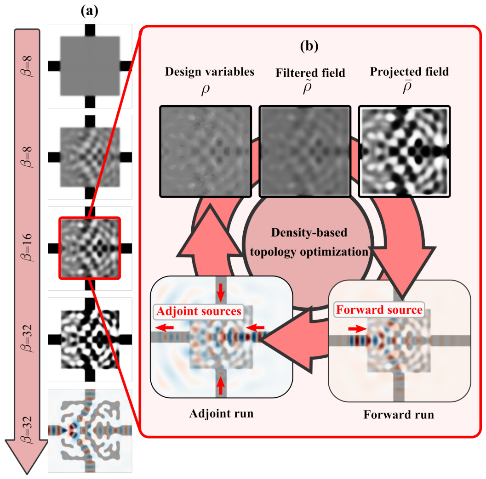

**How to read this figure.** (a), the left column, shows a 3-way power splitter's design region from top to bottom as optimisation goes on. It starts uniform grey (all 0.5) at β = 8, grows grey patterns, then becomes black-and-white as β rises to 16 and 32; the last frame shows the final structure with the field flowing through. (b) is the loop: raw variables $\rho$ (noisy grey) → filtered $\tilde\rho$ (smoother) → projected $\bar\rho$ (high contrast) → forward run (source on the left input, red arrow) → adjoint run (adjoint sources placed at the three output monitors and at the input, pointing back into the device) → gradient → update.

### Equation (3): the filter

$$\tilde{\boldsymbol\rho} = w(\mathbf{x}) * \boldsymbol\rho$$

$\tilde\rho$ is the **filtered** density, $w$ the kernel (e.g. conic, radius $R$), $*$ convolution. It does three jobs:

1. **Minimum feature size.** No black or white feature can be much smaller than ~$R$.
2. **Removes checkerboards** and single-pixel noise, which an optimiser loves to exploit but a factory cannot make.
3. **Regularises** the problem: the optimiser sees a smoother landscape.

Its derivative is easy: convolution is linear, so $\partial\tilde\rho/\partial\rho$ is convolution again (with the kernel flipped, which for a symmetric cone is the same kernel). In the backward (chain-rule) pass, you convolve the incoming gradient with $w$.

### Equation (4): the tanh projection

$$\bar\rho = \frac{\tanh(\beta\eta) + \tanh\big(\beta(\tilde\rho-\eta)\big)}{\tanh(\beta\eta) + \tanh\big(\beta(1-\eta)\big)}$$

- $\eta$ is the **threshold**: filtered values above $\eta$ are pushed toward 1, below toward 0. Usually $\eta = 0.5$.
- $\beta$ is the **sharpness**. $\beta \to 0$: $\bar\rho\approx\tilde\rho$ (almost no change). $\beta\to\infty$: a hard step at $\eta$.
- $\bar\rho$ is the **projected** density.

Why this exact form? The numerator is a shifted tanh centred at $\eta$. Check the ends:

- At $\tilde\rho = 0$: numerator $= \tanh(\beta\eta) + \tanh(-\beta\eta) = 0$. So $\bar\rho = 0$.
- At $\tilde\rho = 1$: numerator $= \tanh(\beta\eta) + \tanh(\beta(1-\eta))$, which equals the denominator. So $\bar\rho = 1$.

The denominator is just the normalisation that makes 0 → 0 and 1 → 1 exactly, for any $\beta$ and $\eta$.

Worked numbers ($\eta = 0.5$, $\tilde\rho = 0.45$):

- $\beta = 8$: $\tanh(4) = 0.9993$, $\tanh(-0.4) = -0.3799$. Numerator $0.6194$, denominator $1.9987$. $\bar\rho = 0.310$.
- $\beta = 64$: $\tanh(32)\approx1$, $\tanh(-3.2) = -0.9967$. Numerator $0.0033$, denominator $2$. $\bar\rho = 0.0017$, essentially oxide.

The slope at the threshold is $d\bar\rho/d\tilde\rho = \beta/[\tanh(\beta\eta)+\tanh(\beta(1-\eta))] \approx \beta/2$ for $\eta = 0.5$: 4 for β = 8, 32 for β = 64.

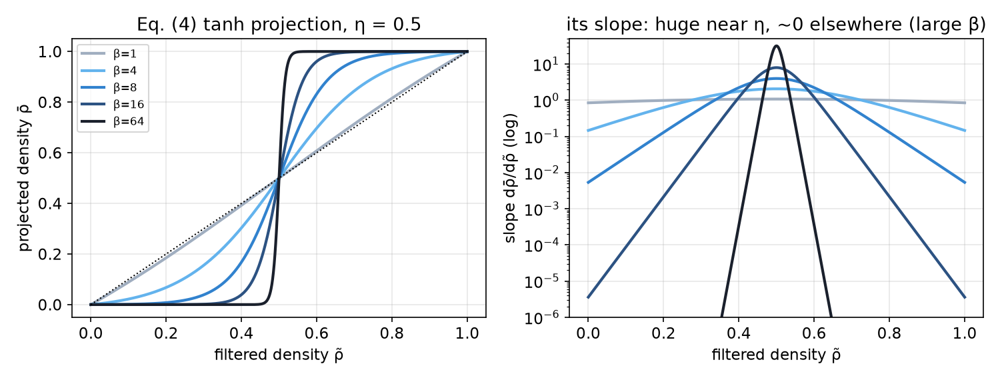

**How to read this figure.** Left: Eq. (4) for β = 1 to 64. β = 1 is almost the dotted diagonal (no change); β = 64 is almost a step at 0.5. Right: the slope $d\bar\rho/d\tilde\rho$ on a log axis. For large β it is huge near the threshold and practically zero everywhere else. That is why gradients become unreliable when β is very large (pixels far from 0.5 stop "feeling" anything), and why the schedule says to do finite-difference gradient checks at low β (1–8).

**Continuation in β.** You cannot start at β = 64: the gradients would vanish almost everywhere. So you start low (β ≈ 1–8), optimise for a while, then double β, optimise again, and so on. Each jump changes the design (the FOM dips — see Fig. 7c later) and the optimiser recovers.

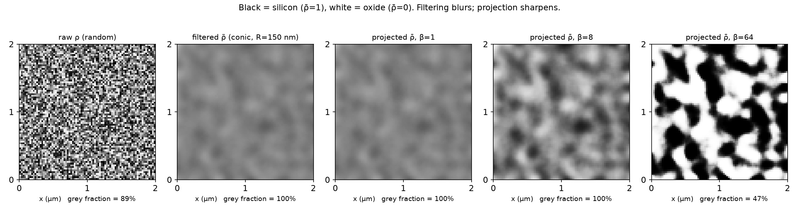

**How to read this figure.** A 2 µm × 2 µm region at 40 px/µm. Far left: random raw $\rho$, pure noise. Second: after a conic filter with $R$ = 150 nm, the noise is averaged into soft blobs, all near 0.5 (grey). Third: projection with β = 1 barely changes anything. Fourth: β = 8 increases contrast but most pixels are still grey. Right: β = 64 gives nearly black/white blobs whose size is set by the filter radius. "Grey fraction" under each panel is the share of pixels between 0.05 and 0.95: 100% before projection at β ≤ 8, 47% at β = 64 here (more iterations at high β, plus the optimiser pushing values away from 0.5, drive it toward 0 in a real run).

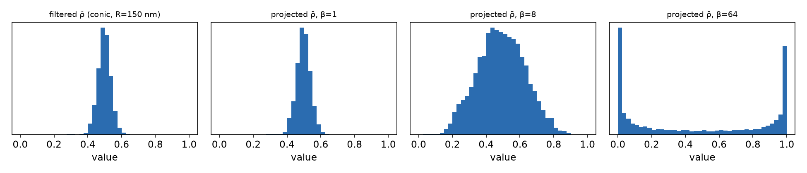

**How to read this figure.** The same four fields as histograms of pixel values. The filtered field is a narrow bump around 0.5. β = 1 leaves it; β = 8 spreads it out; β = 64 sends most pixels to the two ends, 0 and 1. A "binarised" design has a histogram with only two spikes.

**Why AD (JAX) here.** Every new filter or projection needs its own derivative. Deriving them by hand is slow and error-prone. Meep's package lets the user write the mapping $\rho\to\bar\rho$ in an AD library (the paper uses **JAX**; the Meep tutorial notebooks use **autograd**, imported as `autograd.numpy as npa`), and the derivative comes for free. The AD backward pass is a vector–Jacobian product and costs far less than one Maxwell solve, so you can chain several filters (needed e.g. for robust erosion/dilation designs). Built-ins include Heaviside and tanh projections, dilation/erosion kernels, and conic, cylindrical, Gaussian and linear filters.

### 2.1 Material interpolation

#### Equation (5): linear interpolation for simple dielectrics

$$\varepsilon_r(\bar\rho) = \varepsilon_{min} + \bar\rho\,(\varepsilon_{max}-\varepsilon_{min})$$

Example: oxide/silicon, $\varepsilon_{min} = 2.085$, $\varepsilon_{max} = 12.11$. At $\bar\rho = 0.31$: $\varepsilon_r = 2.085 + 0.31\times10.03 = 5.19$, i.e. $n\approx 2.28$. Derivative: $d\varepsilon_r/d\bar\rho = 10.03$, a constant. This is what Meep's `MaterialGrid` does with `medium1` (at weight 0) and `medium2` (at weight 1).

Note: Meep interpolates $\varepsilon$, not $n$. At $\bar\rho = 0.5$, $\varepsilon = 7.10$, $n = 2.66$, not the average index 2.46.

#### Equation (6): the trick for metals at a single frequency

Metals have complex $\varepsilon$ with a negative real part (e.g. gold at 1550 nm has $\varepsilon \approx -115 + 11i$). Linearly mixing $-115$ with $+2$ passes through $\varepsilon \approx 0$ at some intermediate $\bar\rho$. A material with $\varepsilon\approx0$ causes fake resonances and confuses the optimiser.

Fix (Christiansen et al.): interpolate the refractive index $\eta(\bar\rho)$ and extinction coefficient $\kappa(\bar\rho)$ linearly, then form

$$\varepsilon_r = (\eta^2 - \kappa^2) - i\,(2\eta\kappa)$$

This is just $\varepsilon = (\eta - i\kappa)^2$ written out. Squaring a complex number whose parts move smoothly avoids passing through zero. (Careful: this $\eta$ is the refractive index, not the projection threshold of Eq. 4.) It works at one frequency, but FDTD needs a material model valid across the whole band, so they need something else.

#### Equation (7): how FDTD represents dispersive materials

$$\varepsilon_r(\omega,\mathbf{r}) = \left(1 + i\frac{\sigma_D(\mathbf{r})}{\omega}\right)\left(\varepsilon_\infty + \sum_n \frac{\sigma_n(\mathbf{r})\,\omega_n^2}{\omega_n^2 - \omega^2 - i\omega\gamma_n}\right)$$

- $\varepsilon_\infty$: the "instant" permittivity at very high frequency.
- $\sigma_D$: electrical conductivity (absorption that grows at low frequency).
- each term in the sum is a **Lorentz oscillator** (electrons on springs): strength $\sigma_n$, resonance $\omega_n$, damping $\gamma_n$. A **Drude** term (free electrons, metals) is the special case $\omega_n \to 0$.

FDTD can time-step this efficiently, so this is the form Meep needs.

#### Equations (8)–(10): what gets interpolated

$$\tilde\varepsilon_\infty = \varepsilon_{\infty,0} + \bar\rho(\varepsilon_{\infty,1}-\varepsilon_{\infty,0})$$

$$\tilde\sigma_D = \hat\sigma_0 + \bar\rho(\hat\sigma_1 - \hat\sigma_0)$$

$$\tilde\varepsilon_{sus} = (1-\bar\rho)\sum_n^{(0)}\frac{\sigma_{n,0}\,\omega_{n,0}^2}{\omega_{n,0}^2-\omega^2-i\omega\gamma_{n,0}} + \bar\rho\sum_m^{(1)}\frac{\sigma_{m,1}\,\omega_{m,1}^2}{\omega_{m,1}^2-\omega^2-i\omega\gamma_{m,1}}$$

Subscript 0 = first material, 1 = second. In words: mix the instantaneous permittivity and the conductivity linearly, and keep **both** materials' oscillators but scale their strengths by $(1-\bar\rho)$ and $\bar\rho$. Only the strengths ($\sigma$) change with $\bar\rho$; the oscillator frequencies and dampings stay fixed. That keeps memory low and the FDTD update stable. (The paper twice says "instantaneous permeability"; it means permittivity.)

#### Equation (11): artificial damping

$$\tilde\sigma_a(\mathbf{r}) = \bar\rho\,(1-\bar\rho)\,\tilde\omega$$

$\tilde\omega$ is the mean resonance frequency of all the oscillators. This extra conductivity is **zero** for pure materials ($\bar\rho = 0$ or 1) and largest ($0.25\,\tilde\omega$) at $\bar\rho = 0.5$. It adds loss only to the fake mixtures, which kills any spurious resonance caused by an accidental $\varepsilon\approx0$. It also gently discourages grey pixels.

#### Equation (12): the final material

$$\tilde\varepsilon_r(\omega,\mathbf{r}) = \left(1 + i\,\frac{\tilde\sigma_D(\mathbf{r})+\tilde\sigma_a(\mathbf{r})}{\omega}\right)\left(\tilde\varepsilon_\infty + \tilde\varepsilon_{sus}\right)$$

Same shape as Eq. (7), so existing FDTD code runs it unchanged. Because the Yee grid stores components at shifted spots, the interpolation from design grid to Yee grid must be handled carefully, also during the recombination step (Appendix A).

For your silicon/oxide work (no dispersion in the design), Eq. (5) is all that is used.

## 3. Geometric parameterization and the FDTD Yee grid

**The material grid.** Many TO codes use the same mesh for design variables and for fields. Meep separates them. You define a **material grid**: a regular array of design weights in 1D, 2D or 3D, with its *own* resolution and orientation. Meep linearly interpolates it onto the Yee grid wherever needed. Benefits:

1. **Design and simulation resolutions are independent.** E.g. design at 20 px/µm, simulation at 50 px/µm. Meep handles placement and gradients.
2. **Dimensional constraints come for free.** A 2D material grid placed in a 3D block is **extruded** through the thickness. That is exactly a lithographic device: the same pattern etched through 220 nm of silicon. No extra constraint needed.
3. **Symmetries by layering.** Overlapping material grids are averaged. Overlay a grid with its mirror image → the result is mirror-symmetric. Rotated copies → rotational symmetry (even 3-fold, glide-plane, crystal symmetries that do not map the pixel array onto itself).

**Restriction.** Going forward, design weights are interpolated onto the Yee grid with some coefficients (a matrix $P$). Going backward (gradient), field-based sensitivities on the Yee grid must be brought back to design pixels using the **transpose** $P^T$. This is called **restriction**. It is the chain rule for the interpolation step. Meep's philosophy is "pervasive interpolation": the user sees continuous coordinates, and all grid bookkeeping happens inside.

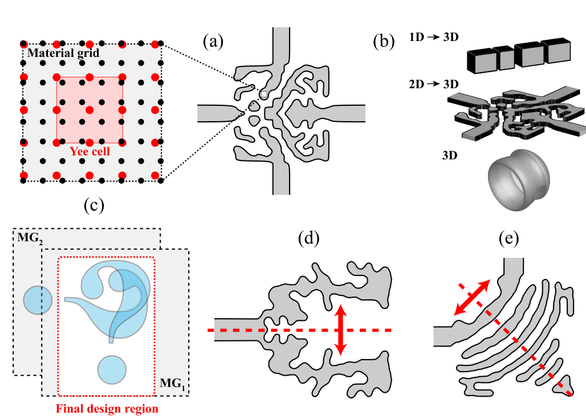

**How to read this figure.** (a) Black dots: material-grid points; red dots/square: the Yee grid and one Yee cell. They do not line up; Meep interpolates between them. Right of it is a device made with such a grid. (b) A 1D grid extruded into 3D bars (e.g. a grating), a 2D grid extruded into a slab device (lithography), and a full 3D grid. (c) Two material grids $MG_1$ and $MG_2$ overlapping; the final design region is their average. (d) Mirror symmetry by overlaying a reflected copy. (e) Rotational symmetry by overlaying rotated copies.

**Meep API mapping.** In code this is `mp.MaterialGrid(mp.Vector3(Nx, Ny), medium1, medium2, weights=..., do_averaging=..., beta=..., eta=...)`, placed inside a `mp.Block` of the size of the design region. The `weights` are what the paper's maths calls the (projected) density $\bar\rho$ fed into Eq. (5); `medium1` is $\varepsilon_{min}$ (weight 0) and `medium2` is $\varepsilon_{max}$ (weight 1). A 2D `MaterialGrid` in a 3D block with nonzero thickness is extruded, as in benefit 2. `do_averaging=True` turns on subpixel smoothing at the material boundaries, which matters once the design is nearly binary (otherwise tiny boundary moves jump in steps of one Yee pixel and the gradient becomes noisy). Newer Meep versions can do the tanh projection inside the grid using its `beta` and `eta` arguments.

### 3.1 Fabrication constraints

Free TO happily makes 20 nm slivers that no foundry can build. The package supports differentiable constraint functions $g_k(\rho)\le0$ for minimum length scale, minimum area, minimum enclosed area, curvature and connectivity, as detailed in Hammond et al. 2021. Changing the "rulebook" (e.g. 90 nm vs 150 nm minimum feature) is a matter of changing parameters.

Two kinds of enforcement:

- **Implicit**: filters (and cascades of filters) shape what is possible.
- **Explicit**: constraint functions, differentiated by the same AD machinery, so you can invent new ones quickly.

Good constraints also **regularise**: they keep the optimiser away from strange, non-physical local minima.

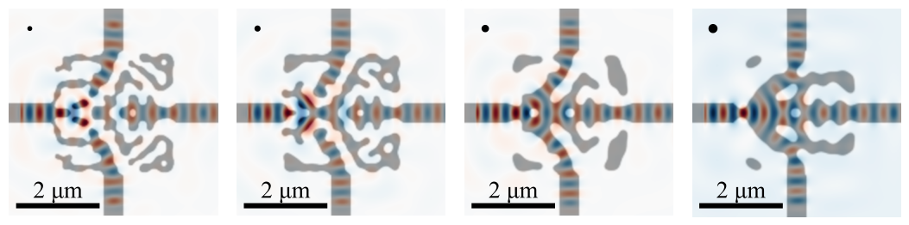

**How to read this figure.** Four 3-way splitters (3 µm × 3 µm design region, 2D, 10 wavelengths from 1.5 to 1.6 µm), each with a larger minimum feature size (the black dot in the top-left corner shows the size). Grey = silicon; red/blue = field at 1.55 µm. Small features (left) give intricate shapes; large ones (right) give chunky, smooth shapes. The paper says all four keep insertion loss ≤ 6% and splitting-ratio variation ≤ 2% across the band (the transmission plots, panel b, are not in this crop). Takeaway: tighter fab rules cost surprisingly little performance here.

## 4. Objective functions

**Differentiable measurements (DMs).** Meep knows how to make adjoint sources for four kinds of quantity, all computed from DFT fields:

1. eigenmode coefficients (→ S-parameters),
2. Poynting flux (power through a surface),
3. near-to-far-field transforms,
4. the DFT fields themselves at points.

You then write **any** function of these DMs in Python (with AD), and the package automatically scales and places the adjoint sources. In Meep: `mpa.EigenmodeCoefficient`, `mpa.FourierFields`, `mpa.Near2FarFields` (and flux-type measurements) are the DMs; the Python function is `objective_functions`.

### Equations (13)–(14): transmission as an S-parameter

$$f = |S_{21}|^2, \qquad S_{21} = \frac{\alpha^+_{1,2}}{\alpha^+_{1,1}}$$

$\alpha^\pm_{m,n}$ is the complex amplitude of mode $m$ travelling forward (+) or backward (−) at port $n$. So $S_{21}$ is "amount of mode 1 going out of port 2, per amount of mode 1 going into port 1", and $|S_{21}|^2$ is the fraction of power transmitted. Example: $|\alpha^+_{1,1}| = 1$, $|\alpha^+_{1,2}| = 0.95$ → $|S_{21}|^2 = 0.9025$, i.e. 90% transmission, an insertion loss of $-10\log_{10}0.9025 = 0.45$ dB.

### Equation (15): the mode-overlap integral

$$\alpha^\pm_{m,n} = C\int_A\left[\hat{\mathbf{E}}^*\times\hat{\mathbf{H}}^\pm_{m,n} + \hat{\mathbf{E}}^\pm_{m,n}\times\hat{\mathbf{H}}^*\right]\cdot\hat{\mathbf{n}}\,dA$$

- $\hat{\mathbf{E}}, \hat{\mathbf{H}}$: the DFT fields recorded on the monitor plane $A$ (the cross-section of the output waveguide).
- $\hat{\mathbf{E}}^\pm_{m,n}, \hat{\mathbf{H}}^\pm_{m,n}$: the ideal mode shape of mode $m$ at that port, from an eigenmode solver (MPB inside Meep).
- $\hat{\mathbf{n}}$: unit normal of the plane.

In words: "how much does the actual field look like this mode?". It is a projection, like taking the dot product of a vector with a unit basis vector. The cross-product form makes it a power-like quantity, and it automatically separates forward and backward waves.

### Equation (16): normalisation

$C$ is chosen so that $|\alpha^\pm_{m,n}|^2 = P^\pm_{m,n}$, the power in that mode. So squared magnitudes are powers.

**Adjoint source for a mode coefficient.** The derivative of $\alpha$ with respect to the fields is (from Eq. 15) the mode profile itself. So the adjoint source is **another eigenmode source of the same mode, launched in the opposite direction** from the monitor, with a complex amplitude taken from the forward run (times $\partial f/\partial\alpha$). Meep computes these weights per frequency and builds the time signal (Sec. 5.2).

**Flexibility.** You can add other DMs (e.g. a far-field) to the same objective; each becomes another adjoint source. Normalisations, filters and FOM arrangements are easy to try.

**Meep API mapping, so far:**

| Paper | Meep object |
|---|---|
| $\alpha^\pm_{m,n}$ at a port | `mpa.EigenmodeCoefficient(sim, mp.Volume(center=..., size=...), mode=m, forward=True/False)` |
| $f(\alpha_1,\alpha_2,\dots)$, e.g. Eq. (13)/(17) | your Python function `J(alpha1, alpha2, ...)` written with `autograd.numpy as npa` |
| design region holding $\rho$ | `mpa.DesignRegion(mp.MaterialGrid(...), volume=mp.Volume(...))` |
| the whole Eq. (1)/(2) machinery: forward run, adjoint run, recombination at frequencies $\omega_m$ | `mpa.OptimizationProblem(simulation=sim, objective_functions=[J], objective_arguments=[...], design_regions=[...], frequencies=[...])` |
| one gradient evaluation | `f0, dJ_du = opt([x])` |

Watch out: `forward=False` means "measure the **backward**-travelling coefficient" (a reflection), not "this is the adjoint run". Get it wrong and you silently optimise reflection.

### 4.1 Example 1: Silicon-photonics polarization splitter

**Device.** A 3D polarisation splitter for a commercial CMOS foundry with **two design layers**: the SOI silicon layer and a polysilicon layer above it. Quasi-TE light (Q-TE) should exit port 2, quasi-TM (Q-TM) should exit port 3.

**Equations (17)–(18): the two FOMs.**

$$f_{Q\text{-}TE} = g_1\!\left(\left|\frac{\alpha^+_{1,2}}{\alpha^+_{1,1}}\right|^2\right) + g_2\!\left(\left|\frac{\alpha^+_{1,3}}{\alpha^+_{1,1}}\right|^2\right) + g_3\!\left(\left|\frac{\alpha^-_{1,1}}{\alpha^+_{1,1}}\right|^2\right)$$

$$f_{Q\text{-}TM} = g_1\!\left(\left|\frac{\alpha^+_{2,2}}{\alpha^+_{2,1}}\right|^2\right) + g_2\!\left(\left|\frac{\alpha^+_{2,3}}{\alpha^+_{2,1}}\right|^2\right) + g_3\!\left(\left|\frac{\alpha^-_{2,1}}{\alpha^+_{2,1}}\right|^2\right)$$

Mode 1 = Q-TE, mode 2 = Q-TM. For Q-TE the three terms are: transmission into port 2 ($|S_{21}|^2$, want high), leakage into port 3 ($|S_{31}|^2$, crosstalk, want low), reflection back into port 1 ($|S_{11}|^2$, return loss, want low). Note: for Q-TM the paper again labels the first term "$S_{21}$", even though Q-TM is meant to exit port 3. The $g$ functions decide whether each term is maximised or minimised, so read the three terms simply as "transmission / crosstalk / return loss" for each polarisation.

The $g_i$ are **mapping functions** that turn each sub-objective into the same units, scale and direction (smaller is better), using smooth splines with user thresholds ("physical programming"). Without them, adding a percentage to a dB value would be meaningless.

Each FOM uses four overlap coefficients (input, ports 2 and 3, reflection), over 10 frequencies from 1.5 to 1.6 µm. That gives **20 FOMs** (2 × 10), each with broadband adjoint sources. Minimax via Eq. (2) maximises the worst case. Each FOM needs its own forward and adjoint run (different input polarisation), so two simulations always ran in parallel (simulation parallelism, Sec. 5.3).

**Cost.** Two nodes of Intel Xeon Gold 6226 (24 cores and 192 GB each). 250 iterations, 500 Maxwell solves in total, about **three days**, at 30 px/µm. (Sec. 5.3 describes the same run on two 40-core Xeon Gold 6248 nodes; the paper is inconsistent about the hardware.) Foundry design-rule constraints were switched on for the final phase.

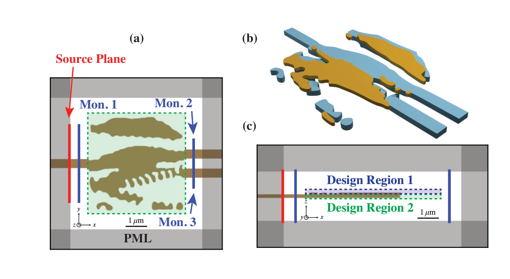

**How to read this figure.** (a) Top view (XY) of the SOI design region with the source plane (red, input waveguide) and monitors Mon. 1–3 at the ports. (b) 3D view of the final device: SOI layer and polysilicon layer as two separately optimised patterns. (c) Side view (XZ) showing Design Region 1 (polysilicon) stacked above Design Region 2 (SOI). Two separate `DesignRegion`s, each with its own `MaterialGrid`.

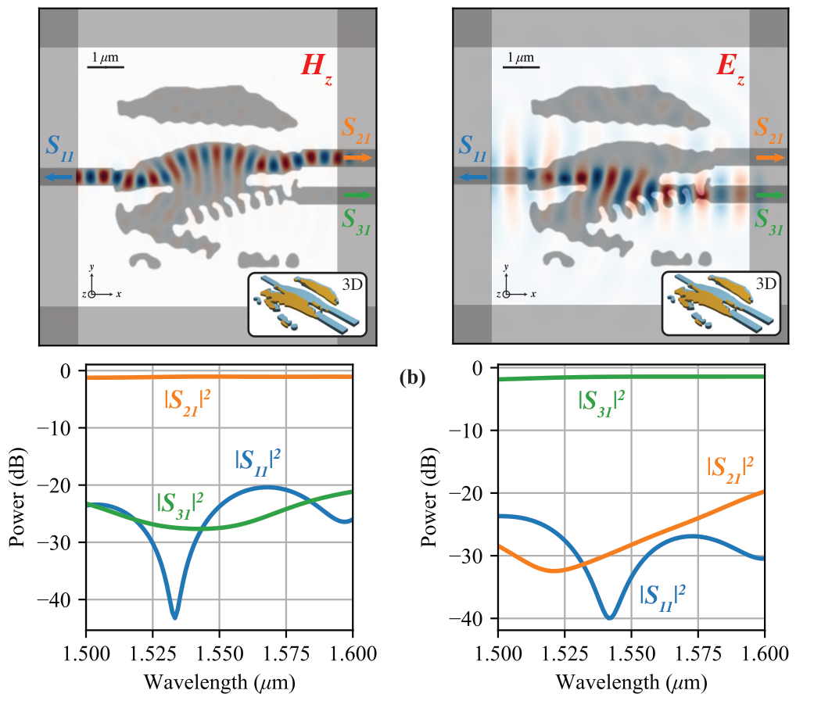

**How to read this figure.** (a) Field at 1.55 µm: $H_z$ for Q-TE goes to one port, $E_z$ for Q-TM goes to the other; the inset is the SOI pattern. (b) Spectra in dB across 1.50–1.60 µm for each polarisation: the transmission curve ($|S_{21}|^2$ or $|S_{31}|^2$, wanted) stays near 0 dB; reflection $|S_{11}|^2$ and the unwanted port stay low. Low insertion loss, low return loss, strong polarisation selectivity over 100 nm.

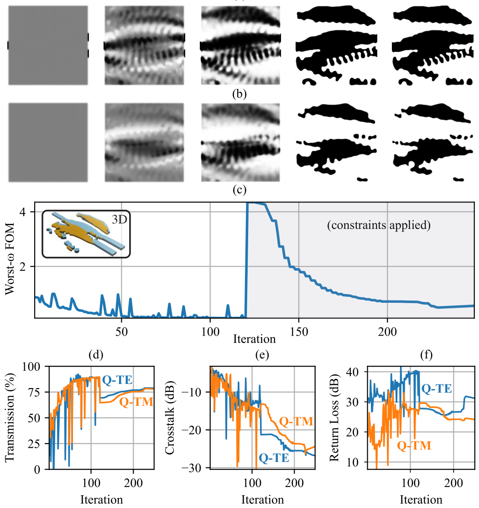

**How to read this figure.** Top two rows: SOI layer (a) and polysilicon layer (b) at iterations 1, 31, 101, 121 and 250. They start uniform grey, develop grey patterns, then become binary. (c) The worst-frequency FOM vs iteration (smaller is better here). It falls to near zero, then **jumps up** at iteration ~120 when the fabrication constraints are switched on (the design breaks the rules and is penalised), and then slowly recovers as the optimiser fixes the small features. (d)–(f) Transmission (%), crosstalk (dB) and return loss (dB) for Q-TE and Q-TM vs iteration. Transmission dropped from ~90% to ~75–78% after constraints, while crosstalk improved. Lesson: manufacturability costs performance, and applying constraints late causes a big shock.

### 4.2 Example II: High numerical-aperture cylindrical metalens

**Device.** A flat lens: diameter 30 µm, thickness 2 µm, focal length 30 µm, wavelengths 1.54–1.56 µm. The paper quotes NA = 0.5. (Simple geometry gives $NA = \sin(\arctan(15/30)) \approx 0.45$; take the paper's number as approximate.)

**Equation (19): the FOM.**

$$f_n = |\tilde{\mathbf{E}}(\omega_n, r_0, z_0)|^2$$

Maximise the field intensity at the focal point $(r_0, z_0)$ at each frequency $\omega_n$. Simple and effective.

**Two cost-saving tricks.**

1. **Cylindrical symmetry.** The lens is round, so Meep simulates in $(r, z)$ coordinates: a 2D simulation of a 3D object.
2. **Near-to-far transform.** Simulating all the empty space up to the focus 30 µm away is wasteful: more cells *and* more timesteps for light to travel. Instead, record DFT fields on a plane just above the lens (the "near field"). By Huygens' principle those fields act as sources; convolving them with the **Green's function** (the field from a point source) gives the field at any far point. Since the hybrid method already works with DFT fields, this fits naturally. Its adjoint is another (transposed) Green's-function convolution. Meep supports this in cylindrical, 2D and 3D Cartesian coordinates.

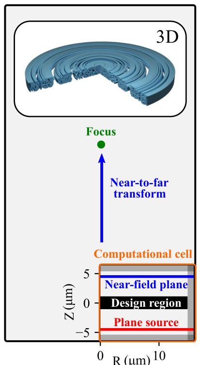

**How to read this figure.** (Only panel (a) is in this crop.) Bottom: the actual computational cell in $(R, Z)$, about 15 µm × 12 µm: red plane source at the bottom, black design region (15 µm × 2 µm) in the middle, blue near-field plane at the top, PML absorbers on three sides. The focus (green dot) is 30 µm away, far outside the cell, reached by the near-to-far transform (blue arrow). Top: the 3D lens obtained by rotating the 2D design. According to the caption, the full figure also shows: (b) the field focusing at 30 µm after 280 iterations; (c) FOM vs iteration, with big dips each time β is increased; (d) Strehl ratio and transmission efficiency vs wavelength.

**Strehl ratio** (from Fig. 7d): the peak intensity of your focus divided by that of a perfect, aberration-free lens of the same NA. 1 is perfect.

## 5. Computational parallelism

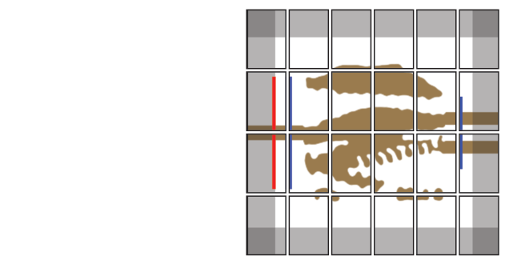

**How to read this figure.** (Only panel (a), spatial parallelism, is in this crop.) The simulation cell is cut into a grid of rectangular chunks, each handled by one processor core. Chunks have different sizes: grey PML regions and the brown design region cost different amounts of work, so the cut is uneven to balance the load. Red line = source; blue lines = monitors. Panels (b) (frequency parallelism) and (c) (simulation parallelism) are described in the text below.

### 5.1 Data-driven load balancing for massively parallel simulations

Large devices don't fit in one machine's memory, so Meep splits the cell into **chunks**, one per core. Each timestep, every core updates its chunk and swaps boundary fields with its neighbours (via **MPI**, the message-passing standard). Neighbouring chunks are put on the same node when possible (fast shared memory).

The difficulty is that different regions cost different amounts: PML, dispersive materials and DFT monitors are more expensive than plain dielectric. So equal-sized chunks would leave some cores idle while others are still working. The package estimates the cost of each sub-volume with a data-driven (machine-learned) cost model and cuts the cell into **unequal** chunks with roughly **equal work**.

DFT monitors over the design region can dominate the cost, because every pixel of the design region carries a running Fourier sum at every frequency. Two fixes:

1. **Single precision** for DFT and time-domain fields. The error is dominated by discretisation of material boundaries anyway, not by rounding. Halves memory traffic.
2. **Decimation**: update the DFT sums only every $n$-th timestep. Legal because the sources are band-limited (no frequencies above a known maximum), so by the **Nyquist** rule you only need to sample at twice the highest frequency present. Meep picks $n$ automatically. Example: the band is around $f\approx0.65$ in Meep units; the timestep resolves frequencies up to $1/(2\Delta t) = 50$; so sampling every ~20–30 steps is still well above Nyquist for the band.

Plus **cache-oblivious loop tiling** (process the grid in blocks that fit the CPU cache). Together: more than 5× speed-up in timestepping.

### 5.2 Frequency parallelism, broadband optimization, and convergence criteria

**The problem.** The frequency-domain adjoint method tells you the adjoint source you need at each design frequency: a complex spatial profile $\tilde{\mathbf{J}}(\mathbf{x},\omega_m)$, $m = 1\dots M$. But FDTD needs a **time** signal $\mathbf{J}(\mathbf{x},t)$ whose DTFT equals those values at the $\omega_m$. Infinitely many signals do. We want one that is

- **short in time** (so the adjoint run is short), and
- **band-limited** (so decimation works without aliasing).

The naive approach (inverse-Fourier-transform and store the whole time signal at every source point) costs (timesteps × source points) memory.

**The fix: fit with window functions.** Write the frequency response as a sum of smooth "bump" functions $\tilde W_m(\omega)$, one centred at each design frequency, with weights $b_m(\mathbf{x})$.

#### Equation (20): least-squares fit

$$\min_{b_m(\mathbf{x})}\left\|\tilde{\mathbf{J}}(\mathbf{x},\omega) - \sum_{m=0}^{M} b_m(\mathbf{x})\,\tilde W_m(\omega)\right\|_2$$

The fit only has to match at the $M$ design frequencies; in between, the fitted curve can do anything. With $M$ basis functions and $M$ points, it is a small $M\times M$ linear system per source point.

#### Equation (21): the time-domain adjoint source

$$\mathbf{J}(\mathbf{x},t) = \sum_{m=0}^{M} b_m(\mathbf{x})\,W_m(t)$$

$W_m(t)$ is the known, analytic inverse DTFT of $\tilde W_m(\omega)$. Storage: only the weights, $O(NM)$ numbers ($N$ source points, $M$ frequencies), independent of the number of timesteps.

#### Equations (22)–(24): the Nuttall window

They choose the **Nuttall window** because it is compact in both time and frequency and has simple closed forms in both. Eq. (22) is its DTFT: a sum of shifted "Dirichlet kernels" (the discrete sinc, $\frac{1-e^{i(N+1)\theta}}{1-e^{i\theta}}$) placed at $\omega_m$ and at $\omega_m\pm k\Delta\omega$, weighted by the coefficients

$$a_0 = 0.355768,\ a_1 = 0.487396,\ a_2 = 0.144232,\ a_3 = 0.012604 \quad \text{(Eq. 23)}$$

with $\Delta\omega = 2\pi/(N\Delta t)$. The time form (Eq. 24) is easy to read:

$$W_m[n] = e^{-i\omega_m n\Delta t}\sum_{k=0}^{3}a_k(-1)^k\cos\!\left(\frac{2\pi k n}{N}\right)\ \ \text{for } 0\le n\le N, \text{ else } 0$$

A carrier wave at $\omega_m$ times a smooth bell-shaped envelope ($a_0 - a_1\cos + a_2\cos - a_3\cos$) that starts and ends at nearly zero. (The paper writes $\cos(2\pi k n\Delta t/N)$ and "$0\le t\le N$"; with $N$ counted in timesteps, the argument is $2\pi k n/N$.) If the simulation uses real fields, the real part is used.

**Trade-off.** Narrow bumps in frequency mean long signals in time ($\text{bandwidth}\times\text{duration}\approx$ constant). Wide bumps overlap each other and make the fit ill-conditioned. So the bump width is set by the **smallest spacing** $\Delta\omega$ between design frequencies, and the adjoint source lasts $N = \lceil 2\pi/(\Delta\omega\,\Delta t)\rceil$ steps (the paper's formula drops the Δ by a typo).

Worked example: 10 frequencies evenly over 1.5–1.6 µm. In Meep units $f$ runs from 0.625 to 0.667, spacing $\Delta f = 0.00463$, so $\Delta\omega = 2\pi\Delta f = 0.0291$. Duration $N\Delta t = 2\pi/\Delta\omega = 1/\Delta f = 216$ time units. With $\Delta t = 0.01$ that is 21 600 timesteps, about 140 optical periods. Ask for 100 frequencies over the same band and the adjoint run gets 10× longer. The authors' argument: you only need dense frequencies if the spectrum has sharp features, which means long-lived resonances, which need long runs anyway.

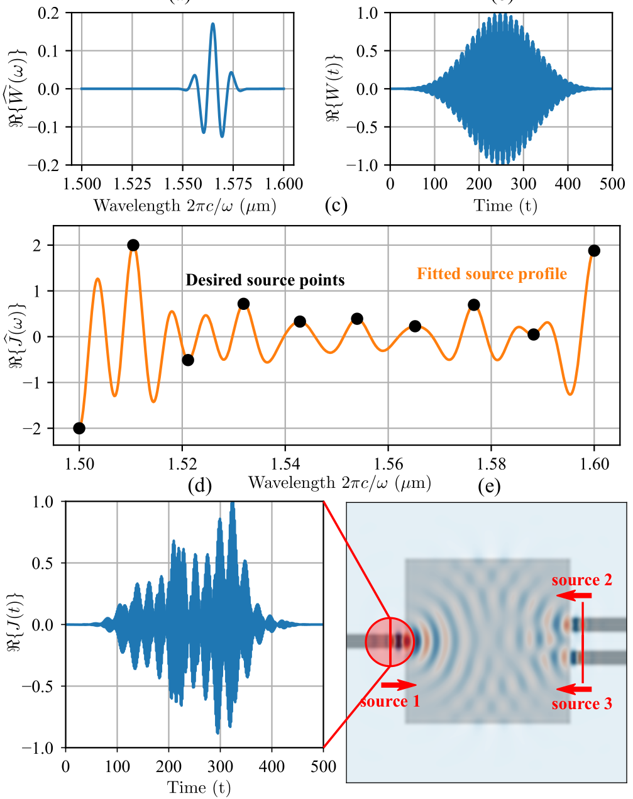

**How to read this figure.** (a) One Nuttall basis function in frequency: a narrow wiggle centred near 1.565 µm. (b) The same function in time: a carrier inside a smooth bell envelope, finite length. (c) Black dots: the adjoint-source values required at 10 design wavelengths (from the forward run); orange: the fitted curve, which passes exactly through the dots and wiggles freely between them. (d) The resulting time signal $J(t)$ at one source point: a burst with structure, finite in time. (e) The polarisation-splitter device with its three adjoint sources (input and two outputs, arrows pointing back into the device). The fit is repeated for every spatial point of every adjoint source.

### 5.3 Simulation parallelism

Different objectives (or different design variants) need different simulations. The package splits the cores into **groups**; each group runs one simulation (itself load-balanced over its cores). After each group has its gradient, an **all-to-all** MPI exchange gives every core every gradient. Each core then runs the same deterministic optimiser and arrives at the same next design, so no central coordinator is needed.

Polarisation splitter: two groups (Q-TE FOM and Q-TM FOM), each one 40-core node; each group returns gradients for 10 frequencies, so 20 gradients per iteration.

**Memory.** If every core runs the optimiser, every core stores all design variables. For true 3D designs (millions of variables) that wastes memory. Their fix: **hybrid MPI + threads**: one process per node (one copy of the optimiser), with one thread per core doing the timestepping and near-to-far work through shared memory.

**Robust optimisation.** Optimise the worst case over several versions of the design: nominal, **eroded** (features shrunk, like over-etching) and **dilated** (features grown, like under-etching). Each version is one group. It scales to any number of variants, even random ensembles. This is the direct link to your project.

## 6. Conclusion

The hybrid method gets the best of both worlds:

- broadband gradients **without** the huge memory of pure time-domain adjoints;
- the flexibility of frequency-domain objectives **without** the convergence troubles of iterative frequency-domain solvers on huge 3D problems.

Limits the authors admit:

- **Plasmonics** often wants non-uniform meshes and finite-element or boundary-element methods, more natural in the frequency domain.
- **Nonlinear optics**: the steady-state response of a nonlinear system cannot be obtained by Fourier transforming a pulse response (the superposition principle fails). Frequency-domain nonlinear methods fit better; transient or chaotic effects need pure time domain. But perturbative nonlinear effects (second-harmonic generation, Raman) can be handled as cascades of linear problems and could use the hybrid method.

## Appendix A. Time-harmonic adjoint formulation

### Equations (25)–(26): Maxwell in time

$$\frac{\partial\mathbf{B}}{\partial t} = -\nabla\times\mathbf{E} - \mathbf{K}, \qquad \frac{\partial\mathbf{D}}{\partial t} = +\nabla\times\mathbf{H} - \mathbf{J}$$

$\mathbf{D} = \varepsilon\mathbf{E}$ is the displacement field, $\mathbf{B} = \mu\mathbf{H}$ the magnetic induction, $\mathbf{J}$ electric current (sources), $\mathbf{K}$ a fictitious magnetic current (useful for sources). Materials are assumed linear and time-invariant, possibly dispersive or anisotropic.

### The FDTD timestep

FDTD turns these into one update rule:

$$\mathbf{x}^{n+1} = \hat T_0\,\mathbf{x}^n + \mathbf{s}^n$$

$\mathbf{x}^n$ is every field at step $n$, $\hat T_0$ the "timestep operator" (one leapfrog update), $\mathbf{s}^n$ the sources.

### Equation (27): the running DFT, again

$$\hat{\mathbf{x}}(\omega) = \sum_n e^{i\omega n\Delta t}\,\mathbf{x}(n\Delta t)\,\Delta t$$

Accumulated during timestepping at the chosen frequencies only, so the time history is never stored.

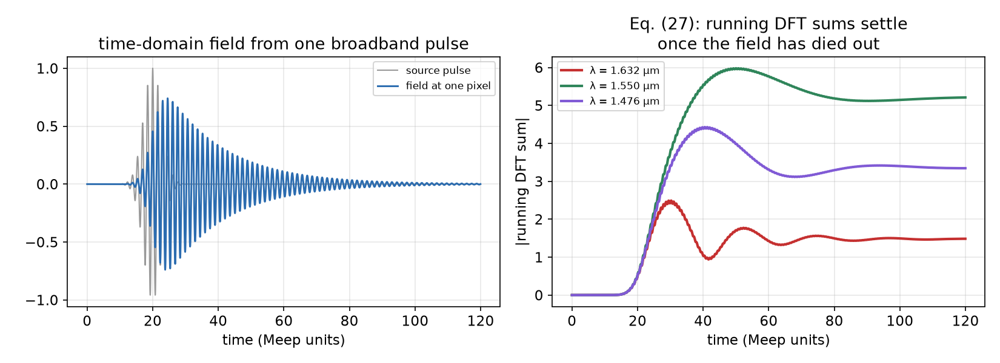

**How to read this figure.** Left: a toy broadband source pulse (grey) and the field it produces at one pixel (blue), which rings and slowly dies away, like light leaving a weak resonator. Right: the magnitude of the running sum of Eq. (27) for three wavelengths, accumulated at each timestep. Each starts at zero, grows while the field is strong, wobbles, and settles to a constant once the field has decayed. That constant is the frequency-domain field. One time run gives all three (or 100) frequencies.

**Two conditions for this to equal a true frequency-domain solution.**

1. **The DFT must converge.** Keep stepping until the fields have decayed to negligible levels (absorbed by materials or PML). Resonant devices and long adjoint sources (closely spaced frequencies) need long runs. In Meep this is the `decay_by` / `maximum_run_time` setting of `OptimizationProblem`.
2. **Correct the frequency for time discretisation.** See below.

### Equations (28)–(31): the corrected frequency $\hat\omega$

FDTD approximates the time derivative by a difference:

$$\left.\frac{\partial\mathbf{x}}{\partial t}\right|_{\Delta t/2}\approx\hat D\mathbf{x} = \frac{\mathbf{x}(\Delta t)-\mathbf{x}(0)}{\Delta t}$$

For a true sine wave $e^{-i\omega t}$, the derivative becomes $-i\omega$ in the frequency domain (Eq. 29). For the difference operator, apply it to $e^{-i\omega t}$:

$$\frac{e^{-i\omega\Delta t}-1}{\Delta t} \equiv -i\hat\omega \quad\text{(Eq. 30)}$$

Taylor-expand $e^{-i\omega\Delta t} = 1 - i\omega\Delta t - \tfrac12\omega^2\Delta t^2 + \dots$:

$$-i\hat\omega = -i\omega - \tfrac12\omega^2\Delta t + \dots = -i\omega + O(\Delta t) \quad\text{(Eq. 31)}$$

So the grid "sees" a slightly different frequency $\hat\omega$ from the one you asked for. As $\Delta t\to0$ they agree. To keep second-order accuracy, the frequency-domain operator $A$ must use $\hat\omega$, not $\omega$. Size of the effect at λ = 1.55 µm, $\Delta t = 0.01$: $\omega\Delta t = 2\pi(0.645)(0.01) = 0.041$, so the first-order mismatch is about $\omega\Delta t/2\approx2\%$. Small, but not negligible for accurate gradients. Meep applies this internally.

### Equation (32): the frequency-domain operator implied by FDTD

Written as a block system for the unknowns $(\hat{\mathbf{D}},\hat{\mathbf{E}},\hat{\mathbf{B}},\hat{\mathbf{H}})$, the four rows say:

- $-i\hat\omega\hat{\mathbf{D}} - \nabla\times\hat{\mathbf{H}} = -\hat{\mathbf{J}}$ (Ampère, from Eq. 26),
- $\hat{\mathbf{D}} - \varepsilon_0\varepsilon_r(\omega,\rho)\hat{\mathbf{E}} = 0$ (material law, the **only** row that depends on $\rho$),
- $-i\hat\omega\hat{\mathbf{B}} + \nabla\times\hat{\mathbf{E}} = -\hat{\mathbf{K}}$ (Faraday, from Eq. 25),
- $\hat{\mathbf{B}} - \mu_0\hat{\mathbf{H}} = 0$.

(Signs and the $i$ vs $j$ convention differ slightly in the paper's printed matrix; the structure is what matters.) This is the conceptual $A(\rho,\hat\omega)\tilde{\mathbf{x}} = \tilde{\mathbf{b}}$ of Eq. (1).

### Equation (33): adjoint gradient

$$\frac{\partial f_n}{\partial\rho} = -\tilde{\boldsymbol\lambda}^T\,\frac{\partial A(\rho,\hat\omega)}{\partial\rho}\,\tilde{\mathbf{x}}$$

Exactly the result derived in "Background you need". $\tilde{\mathbf{x}}$: DFT fields from the forward run. $\tilde{\boldsymbol\lambda}$: DFT fields from the adjoint run, whose sources come from $\partial f_n/\partial\mathbf{x}$ evaluated with the forward fields.

### Equation (34): the recombination step

Only the material row depends on $\rho$, and only through $\varepsilon_r$. So $\partial A/\partial\rho$ is zero except in that row, and the product collapses to the **electric** fields only:

$$\frac{\partial f_n}{\partial\rho} = -\hat{\mathbf{E}}_a^T(\rho,\omega)\ \frac{\partial\boldsymbol\varepsilon_r(\rho,\omega)}{\partial\rho}\ \hat{\mathbf{E}}_f(\rho,\omega)$$

This is the **recombination step**. At each point in the design region: take the forward electric field $\hat{\mathbf{E}}_f$, the adjoint electric field $\hat{\mathbf{E}}_a$, multiply them component by component, weight by $\partial\varepsilon_r/\partial\rho$ (for Eq. 5 that is just $\varepsilon_{max}-\varepsilon_{min}$; a tensor if anisotropic). That number is the sensitivity of the FOM to adding material at that point.

Physical picture: where the forward field and the adjoint field are both strong and in phase, adding silicon helps; where they are out of phase, removing it helps; where either is weak, the pixel barely matters. This is why the evening EXIT says "strong gradients where the mode is being steered, near-zero where the field is weak".

**Full chain of the gradient** (what Meep plus your AD code computes):

$$\frac{df}{d\rho} = \underbrace{\frac{\partial f}{\partial\varepsilon}}_{\text{Eq. (34), Yee grid}}\cdot\underbrace{P^T}_{\text{restriction}}\cdot\underbrace{\frac{d\varepsilon}{d\bar\rho}}_{\text{Eq. (5)}}\cdot\underbrace{\frac{d\bar\rho}{d\tilde\rho}}_{\text{Eq. (4)}}\cdot\underbrace{\frac{d\tilde\rho}{d\rho}}_{\text{Eq. (3)}}$$

Meep returns `dJ_du` = derivative with respect to the `MaterialGrid` weights (through Eq. 34, restriction and Eq. 5). In the tutorials, you then backpropagate through your own filter + projection with autograd, e.g. `tensor_jacobian_product(mapping, 0)(x, eta, beta, dJ_du)`. If the objective returns one value per frequency, `dJ_du` has one column per frequency.

**Accuracy caveat.** The method mixes "differentiate-then-discretise" (derive the adjoint from continuous equations, then discretise) with "discretise-then-differentiate" (differentiate the exact discrete code). It ignores the exact timestep operator $\hat T_0$. Gradients are "sufficiently accurate" if interpolation and restriction are done right, but not exact to machine precision. Future work: a fully discrete adjoint and subpixel smoothing. This is why the finite-difference check on Wednesday (agree within 5%) is so important.

**Funding, acknowledgements, data.** Standard; data and code are in the Meep GitHub repository.

## A runnable toy: adjoint gradient = finite differences

A 1D "Maxwell" problem $A(\rho)\mathbf{x} = \mathbf{b}$ (Helmholtz equation, crude absorbers at the ends), 40 design pixels between oxide and silicon, FOM $= |E|^2$ at a probe point. One forward solve plus one adjoint solve give all 40 derivatives; we check them against 80 finite-difference solves.

```python
import numpy as np
rng = np.random.default_rng(0)

# 1-D toy "Maxwell" problem in the frequency domain:  A(rho) x = b
n, dx, lam = 200, 0.02, 1.55                     # 200 cells of 20 nm, wavelength 1.55 um
k0 = 2 * np.pi / lam
eps_min, eps_max = 1.444**2, 3.48**2              # oxide and silicon
L = (np.diag(-2 * np.ones(n)) + np.diag(np.ones(n-1), 1) + np.diag(np.ones(n-1), -1)) / dx**2
loss = 1j * 0.5 * np.r_[np.linspace(1, 0, 30)**2, np.zeros(n-60), np.linspace(0, 1, 30)**2]
design = slice(80, 120)                           # 40 design pixels (0.8 um)
b = np.zeros(n, complex); b[40] = 1.0             # source
probe = 160                                       # FOM = |E|^2 at this point

def eps_of(rho):                                  # Eq. (5): linear interpolation
    e = np.full(n, eps_min, complex); e[design] = eps_min + rho * (eps_max - eps_min)
    return e + loss
def A(rho):  return L + k0**2 * np.diag(eps_of(rho))
def fom(rho):
    x = np.linalg.solve(A(rho), b); return abs(x[probe])**2, x

rho = rng.uniform(0, 1, 40)
f0, x = fom(rho)                                  # ---- forward run
g = np.zeros(n, complex); g[probe] = np.conj(x[probe])   # df/dx  (adjoint source)
lam_ = np.linalg.solve(A(rho).T, g)               # ---- adjoint run: A^T lambda = df/dx
dA_drho = k0**2 * (eps_max - eps_min)             # k0^2 * d eps / d rho
grad_adj = -2 * np.real(lam_[design] * dA_drho * x[design])  # Eq. (34): E_a * deps/drho * E_f

h = 1e-6; grad_fd = np.zeros(40)                  # finite differences: 80 extra solves
for i in range(40):
    rp, rm = rho.copy(), rho.copy(); rp[i] += h; rm[i] -= h
    grad_fd[i] = (fom(rp)[0] - fom(rm)[0]) / (2 * h)
print("adjoint :", grad_adj[:4])
print("finite-d:", grad_fd[:4])
print("max relative mismatch:", np.max(abs(grad_adj - grad_fd)) / np.max(abs(grad_fd)))
```

**What you should see.** The two rows of numbers agree, and the maximum relative mismatch is around $10^{-8}$. The adjoint used 2 solves; finite differences used 80. With a million pixels that is 2 vs 2 000 000. Note the gradient line is literally Eq. (34): adjoint field × $\partial\varepsilon/\partial\rho$ × forward field, pixel by pixel. (In this exact matrix problem the agreement is perfect; in Meep it is only approximate, for the reason in the Appendix caveat.)

## Evening task: a one-port FOM for `02-Waveguide_Bend.ipynb`

Goal (from the schedule): change the objective to transmission into **one** port only, then plot the gradient.

The pieces, mapped to the paper:

```python
import meep as mp
import meep.adjoint as mpa
import autograd.numpy as npa          # NOT plain numpy, or the gradient is silently zero
import numpy as np, matplotlib.pyplot as plt

# design: MaterialGrid = rho-bar -> eps via Eq. (5);  DesignRegion = where it sits
mg = mp.MaterialGrid(mp.Vector3(Nx, Ny), SiO2, Si, grid_type="U_MEAN")
design_region = mpa.DesignRegion(mg, volume=mp.Volume(center=mp.Vector3(), size=mp.Vector3(Sx_d, Sy_d)))

# differentiable measurement = alpha^+_{1,2} of Eq. (15), at the single output port
tran_mon = mpa.EigenmodeCoefficient(sim,
              mp.Volume(center=tran_pt, size=mp.Vector3(0, 2)),  # adapt to the bend's output
              mode=1, forward=True, eig_parity=mp.ODD_Z)         # forward=False would be reflection!

def J(tran):                       # Eq. (13): |S21|^2 = |alpha_out|^2 / input power
    return npa.power(npa.abs(tran), 2) / input_flux    # input_flux from a straight-waveguide run

opt = mpa.OptimizationProblem(simulation=sim, objective_functions=[J],
                              objective_arguments=[tran_mon], design_regions=[design_region],
                              frequencies=[1/1.55])
x0 = 0.5 * np.ones(Nx * Ny)
f0, dJ_du = opt([x0])              # one forward + one adjoint run
grad = dJ_du.reshape(Nx, Ny) if dJ_du.ndim == 1 else np.sum(dJ_du, axis=1).reshape(Nx, Ny)
plt.imshow(np.rot90(grad), cmap="RdBu"); plt.colorbar(); plt.title("dJ/d(weights)"); plt.show()
```

Notes. Variable names (`Nx`, `tran_pt`, `input_flux`, `SiO2`, `Si`) must be adapted to the notebook. The schedule writes the mode keyword as `mode_index`; recent Meep releases call it `mode`. Check with `help(mpa.EigenmodeCoefficient)`. If you normalise with a second `EigenmodeCoefficient` at the input instead of a fixed `input_flux`, you get Eq. (14) exactly. Expected picture: large positive/negative gradient where the bend's mode needs steering, near zero far from the field.

## How this connects to your project

This is the engine your project will run on.

- **Fabrication awareness** = filter radius (Eq. 3), projection β schedule (Eq. 4), explicit constraints (Sec. 3.1), and **eroded/dilated variants** run in parallel with minimax (Sec. 5.3). The 2021 Hammond paper and the Meep tutorial's `get_conic_radius_from_eta_e` complete this.
- **Broadband** = list of frequencies in `OptimizationProblem` + epigraph minimax (Eq. 2). It is almost free in Meep thanks to the hybrid DFT trick.
- **Monte-Carlo yield** comes *after* optimisation: you perturb the final binary design (width/thickness errors) and re-simulate many times. That is forward runs only, and it is where an ML surrogate (the 2019 paper's idea) could help.
- **Gradient trust**: the Appendix caveat is your reason to do finite-difference checks (Wed 14 Oct) and to use `do_averaging=True` when the design is nearly binary.
- **Tidy3D** uses the same ideas (its `ErosionDilationPenalty` cites Hammond 2022, ch. 4); learning the maths here transfers directly.

!!! warning "Common confusions"
    - **"Hybrid" does not mean two different solvers.** Both runs are FDTD in time. "Hybrid" means the gradient formula is the frequency-domain one, fed by DFT fields accumulated during the time runs.
    - **Two runs per FOM, not per frequency.** All frequencies come from the same forward and adjoint runs. Different *objectives* (e.g. Q-TE vs Q-TM input) need separate runs.
    - **The adjoint run is not "time reversed" Meep.** It is an ordinary forward-in-time simulation with different sources (placed at the monitors, pointing back into the device).
    - **`forward=False` ≠ adjoint.** It measures the backward-travelling mode (reflection).
    - **ρ, ρ̃, ρ̄ are different things.** ρ = raw variables the optimiser changes; ρ̃ = filtered; ρ̄ = projected, which goes into ε. A `MaterialGrid`'s weights are usually ρ̄ (unless you let the grid do projection itself).
    - **High β is not "better" during optimisation.** It makes gradients vanish almost everywhere. Ramp it up gradually; check gradients at low β.
    - **Linear interpolation is in ε, not n.** ρ̄ = 0.5 gives n ≈ 2.66, not 2.46.
    - **Plain numpy in the objective breaks the gradient silently.** Use `autograd.numpy`.
    - **The gradient is not exact.** Meep's hybrid adjoint is "sufficiently accurate", not discrete-exact; expect a few % disagreement with finite differences, more when the design is binary without subpixel smoothing.
    - **Minimax with "max" is not smooth**; that is why the epigraph variable $t$ is introduced.

## Check yourself

1. What are ρ, ρ̃ and ρ̄, and which equation produces each?

    ??? note "Answer"
        ρ: raw design variables in [0,1], changed by the optimiser. ρ̃: filtered field, Eq. (3), convolution with a kernel such as a cone. ρ̄: projected field, Eq. (4), tanh projection with sharpness β and threshold η. ρ̄ goes into ε by Eq. (5).

2. Show that Eq. (4) maps 0 → 0 and 1 → 1 for any β.

    ??? note "Answer"
        At ρ̃ = 0 the numerator is tanh(βη) + tanh(−βη) = 0. At ρ̃ = 1 the numerator is tanh(βη) + tanh(β(1−η)), identical to the denominator, so the ratio is 1.

3. Compute ρ̄ for ρ̃ = 0.55, η = 0.5, β = 8.

    ??? note "Answer"
        tanh(4) = 0.9993, tanh(0.4) = 0.3799. Numerator 1.3792, denominator 1.9987, ρ̄ ≈ 0.690 (the mirror image of the 0.310 example).

4. Why start optimisation at low β and increase it gradually?

    ??? note "Answer"
        At high β the projection's slope is nearly zero except right at the threshold, so most pixels get no gradient and the optimiser gets stuck. Low β gives smooth, informative gradients; raising β later binarises the design.

5. Why does the adjoint method need only two simulations regardless of the number of pixels?

    ??? note "Answer"
        Because df/dρ_i = −λᵀ(∂A/∂ρ_i)x. The forward solve gives x; the adjoint solve Aᵀλ = (∂f/∂x)ᵀ gives λ and does not depend on i. Each pixel's derivative is then a cheap local product of the two fields.

6. Why does the hybrid method get all frequencies from the same two runs?

    ??? note "Answer"
        Both runs use broadband pulses, and Meep accumulates running DFTs (Eq. 27) at every requested frequency during timestepping. The forward and adjoint DFT fields at each ω_m give that frequency's gradient through Eq. (34).

7. Why not use a pure time-domain adjoint?

    ??? note "Answer"
        It needs the forward fields at every timestep and every design point, memory ∝ points × timesteps (gigabytes even in 2D, impossible in big 3D). The hybrid method stores only one complex number per point per frequency.

8. What problem does the epigraph formulation solve?

    ??? note "Answer"
        The minimax objective max f_n is not differentiable where the worst case switches. Introducing t and constraints f_n ≤ t gives an equivalent problem with a smooth objective (t) and smooth constraints, which gradient optimisers like MMA can handle.

9. What is the adjoint source for an eigenmode-coefficient FOM?

    ??? note "Answer"
        An eigenmode source of the same mode placed at the monitor, launched in the opposite direction (back into the device), with complex amplitude set by ∂f/∂α from the forward run, at each frequency; in time it is built with the Nuttall-window fit (Eqs. 20–24).

10. Why are Nuttall windows used to build the adjoint source, and what sets its duration?

    ??? note "Answer"
        They are compact in both time and frequency, with simple analytic forms, so a few weights per source point (O(NM) storage) define a short, band-limited time signal matching the required values at each design frequency. The duration is ≈ 2π/(Δω Δt) timesteps, set by the smallest frequency spacing.

11. What does Eq. (34) say physically, and what should a gradient map look like?

    ??? note "Answer"
        The sensitivity at each point is the product of the forward and adjoint electric fields weighted by ∂ε/∂ρ. It is large where both fields are strong (where light is being steered toward the monitor), with sign set by their relative phase, and near zero where either field is weak.

12. What is the artificial damping term (Eq. 11) for?

    ??? note "Answer"
        σ_a = ρ̄(1−ρ̄)ω̃ adds loss only to intermediate (fake) mixtures, zero for pure materials, to suppress spurious resonances when interpolating between materials creates ε ≈ 0, e.g. between a metal and a dielectric.

13. Write a one-sentence definition of a `MaterialGrid`.

    ??? note "Answer"
        A `mp.MaterialGrid` is a regular grid of design weights in [0,1], with its own resolution, that Meep interpolates onto the Yee grid and converts into permittivity by interpolating between two materials (weight 0 → medium1, weight 1 → medium2), optionally with subpixel smoothing (`do_averaging=True`), which is needed once the design is nearly binary.

## Key takeaways

- Density-based TO: pixel densities ρ ∈ [0,1] → filter (min feature size) → tanh projection with rising β (binarisation) → linear ε interpolation → Maxwell.
- The adjoint method gives the gradient for every pixel from **one forward + one adjoint** run; the adjoint source is ∂f/∂(fields).
- Meep's **hybrid** method: FDTD runs with broadband pulses, running DFTs at chosen frequencies, frequency-domain adjoint formula. All frequencies for the cost of two runs, with tiny memory.
- **Recombination** (Eq. 34): gradient = adjoint E × ∂ε/∂ρ × forward E, then restriction to the design grid and AD through projection and filter.
- Broadband robustness uses **minimax + epigraph** (Eq. 2) with MMA.
- New in the paper: Nuttall-window fitting for time-domain adjoint sources; a stable interpolation for dispersive/metallic materials; three-level parallelism (space, frequency, simulation) with data-driven load balancing.
- API map: `MaterialGrid` (ρ̄ → ε), `DesignRegion` (where), `EigenmodeCoefficient` (α of Eq. 15), objective in `autograd.numpy` (f), `OptimizationProblem` (forward + adjoint + recombination at the listed frequencies), `opt([x])` → `(f0, dJ_du)`.
- Gradients are accurate but not exact; check with finite differences at low β.

## Glossary

| Term | Plain meaning |
|---|---|
| Adjoint method | Gets all gradients of one FOM from one extra (adjoint) simulation |
| Adjoint source | Source for the adjoint run; equals ∂FOM/∂fields, placed at the monitors |
| Anisotropic | Material whose response depends on field direction |
| Automatic differentiation (AD) | Software that computes exact derivatives of code (JAX, autograd) |
| β (beta) | Projection sharpness; larger = more binary |
| Binarisation | Driving all densities to 0 or 1 |
| Chunk | Sub-box of the simulation handled by one core |
| Conic filter | Cone-shaped blur kernel of radius R; sets minimum feature size |
| Continuation | Gradually increasing β during optimisation |
| Courant factor | Ratio fixing Δt relative to Δx for FDTD stability |
| Decimation | Updating DFT sums only every n-th timestep |
| Density ρ | Design variable per pixel: 0 = void, 1 = solid |
| DesignRegion | Meep object placing a MaterialGrid in a volume |
| DFT / DTFT | Discrete-time Fourier transform; turns time samples into frequency content |
| Differentiable measurement (DM) | Quantity Meep can build adjoint sources for (mode coefficient, flux, far field, DFT fields) |
| Dilation / erosion | Growing / shrinking features; models under- / over-etching |
| Dispersive | Material whose ε depends on frequency |
| Drude / Lorentz model | Oscillator models of material response used in FDTD |
| EigenmodeCoefficient | Meep DM giving the amplitude α of a chosen mode at a port |
| Epigraph formulation | Rewriting min-max with a dummy variable t to make it smooth |
| η (eta), projection | Threshold of the tanh projection (usually 0.5) |
| FDTD | Finite-difference time-domain simulation |
| Figure of merit (FOM) | The number the optimiser improves |
| Filter | Convolution that smooths the density |
| Forward run | Normal simulation with the real source |
| Green's function | Field produced by a point source; used to propagate fields far away |
| Level-set TO | TO that moves boundaries of a binary shape |
| Load balancing | Splitting work so all cores finish at the same time |
| MaterialGrid | Meep grid of weights mapped to ε between two media |
| Minimax | Minimising the worst case over several objectives/frequencies |
| MMA | Method of moving asymptotes, a gradient optimiser good with many constraints |
| Mode-overlap integral | Projection of the actual field onto a mode shape (Eq. 15) |
| MPI | Message-passing standard for multi-node parallel computing |
| Near-to-far transform | Computing far fields from near-field DFT data via Green's functions |
| Nuttall window | Smooth window function used as basis for adjoint time sources |
| Nyquist rate | Minimum sampling rate (twice the highest frequency) to avoid aliasing |
| OptimizationProblem | Meep object that runs forward + adjoint and returns FOM and gradient |
| Permittivity ε | Material constant, $n^2$ for lossless dielectrics |
| PML | Perfectly matched layer; absorbing boundary |
| Projection | Nonlinear map pushing filtered densities toward 0 or 1 |
| Quasi-TE / quasi-TM | Main polarisation states of a real 3D waveguide |
| Recombination | Combining forward and adjoint fields into the gradient (Eq. 34) |
| Restriction | Mapping Yee-grid sensitivities back to the design grid (transpose of interpolation) |
| Robust optimisation | Optimising the worst case over fabrication variants |
| S-parameter | Ratio of outgoing to incoming mode amplitude between ports |
| Strehl ratio | Lens focus peak relative to an ideal lens |
| Subpixel smoothing | Averaging ε at boundaries inside a pixel for accuracy and smooth gradients |
| Topology optimisation (TO) | Pixel-by-pixel design that may change shape connectivity |
| Yee grid | Staggered FDTD grid where field components sit at shifted positions |
