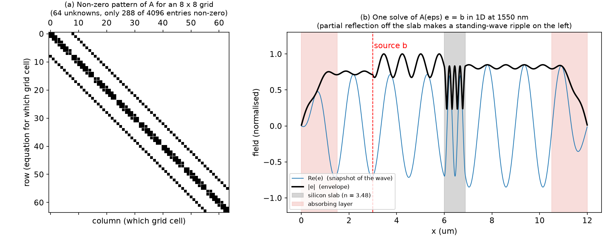
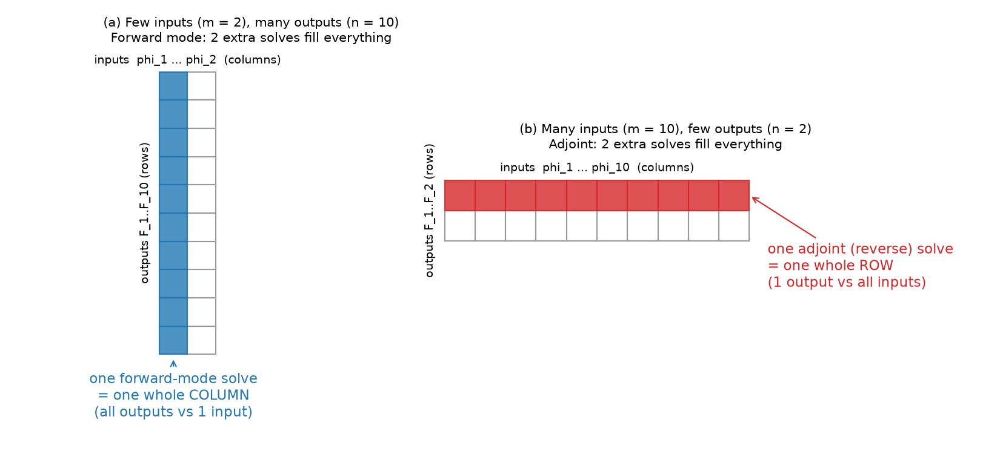
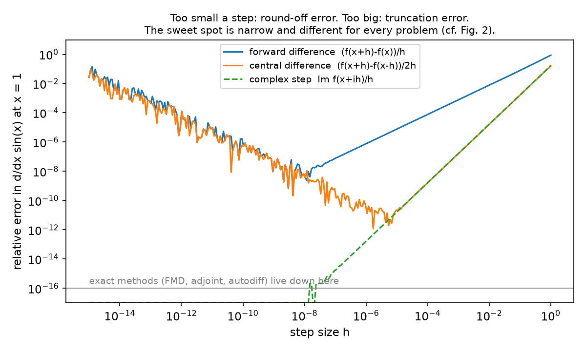
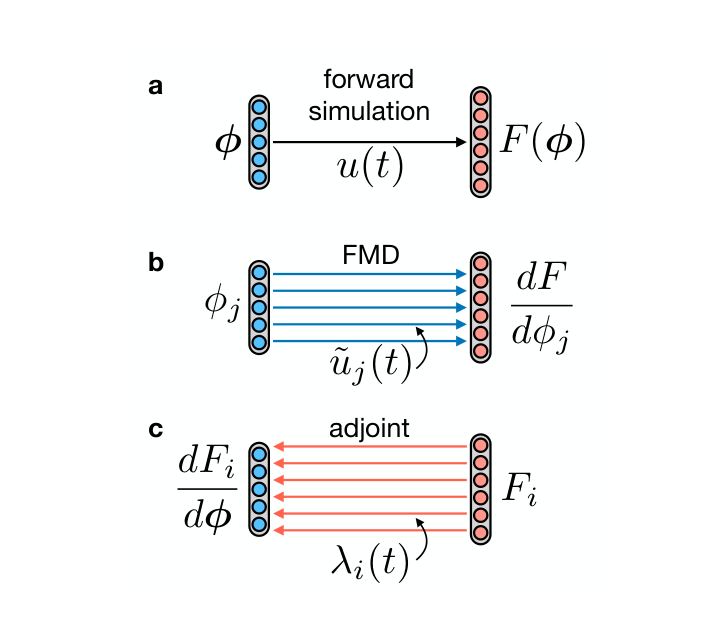
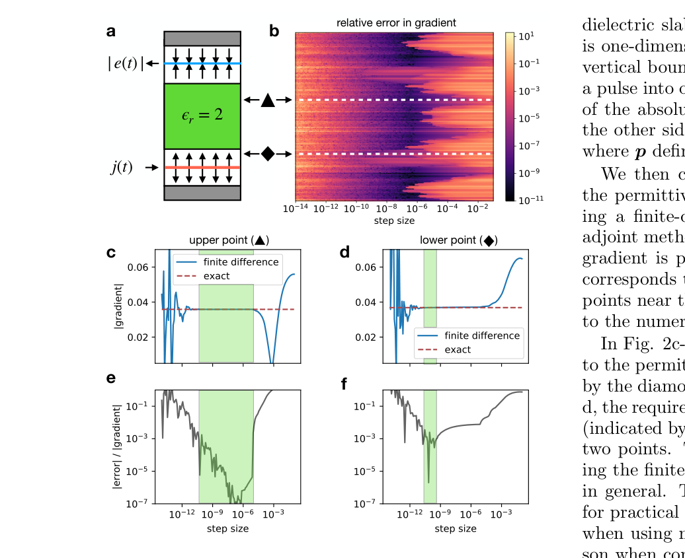
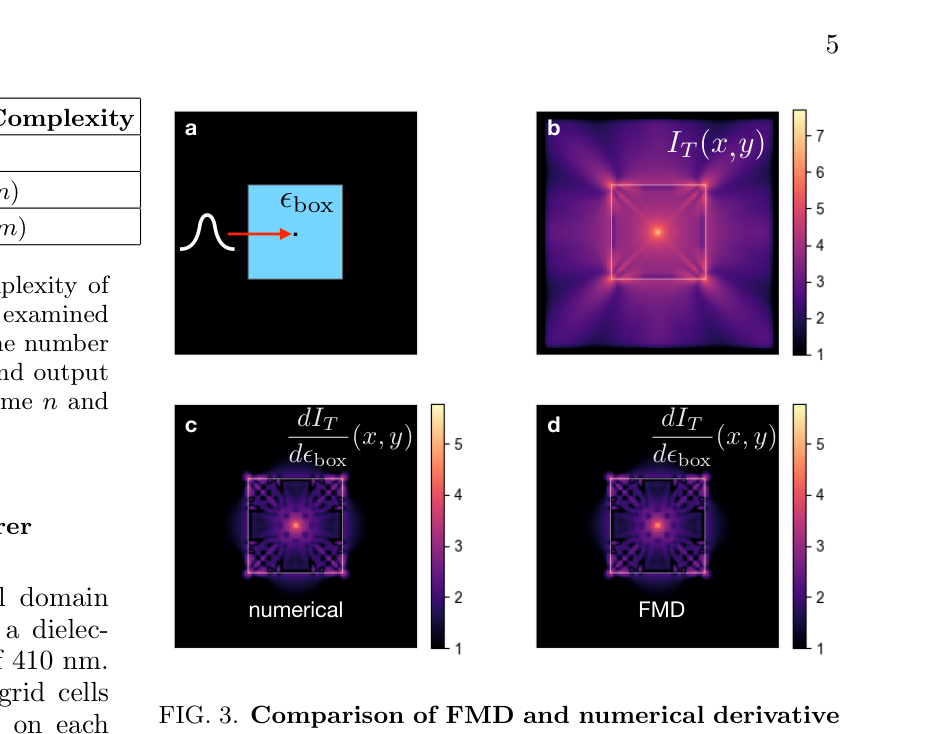
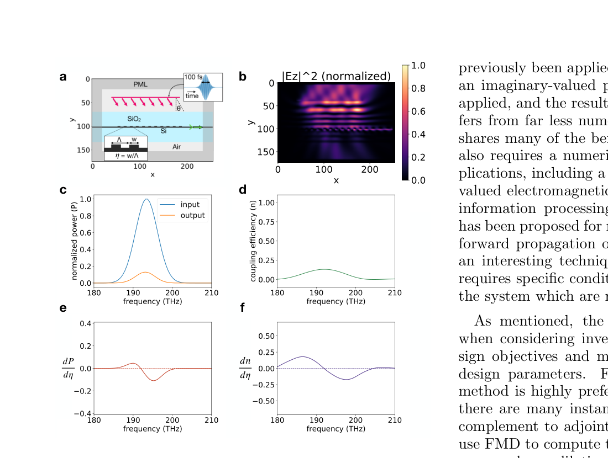

# Week 5 · Day 3 — Wednesday 21 Oct 2026 · Hughes et al. — Forward-mode differentiation (ceviche)

*Simple-English study version of Tyler W. Hughes, Ian A. D. Williamson, Momchil Minkov & Shanhui Fan, "Forward-mode Differentiation of Maxwell's Equations", ACS Photonics (2019; arXiv version dated 29 Aug 2019)*

---

!!! abstract "Today's slot"
    **Morning, 06:15–07:45:** "Hughes et al. 2018 — the adjoint method in FDFD, differentiated by autograd."
    **EXIT:** `paper-notes/2018-hughes-ceviche.md` filed.

    **Evening, 20:00–21:30:** "Install `ceviche`; run its bundled waveguide example." **EXIT:** the example runs, and one FDFD solve finishes in under 10 s.

    **Which paper is this, exactly?** The schedule cites Hughes, Minkov, Williamson & Fan, *ACS Photonics* **5**, 4781 (2018). The file in your paper folder (`2018-hughes-ceviche.md`) is a different paper by the same four authors: *"Forward-mode Differentiation of Maxwell's Equations"*. The 2018 paper is reference [8] *inside* this one. This page covers the file you have. That works out well. This paper is the one that announced the **ceviche** package (its ref. [22]). Its appendix derives the adjoint method in FDFD step by step. It also explains the forward-vs-reverse idea behind autograd. Those are exactly the things the schedule asks for.

    **After reading you should be able to:**

    - write FDFD as one sparse linear system $A(\epsilon)\,e = b$ and say what every symbol is;
    - explain forward-mode and reverse-mode automatic differentiation, using a 10-line example;
    - derive the adjoint gradient and the forward-mode gradient of an FDFD figure of merit. They are the same formula with the brackets in a different place;
    - say which one to use when, by counting inputs $m$ and outputs $n$;
    - write the sentence the schedule asks for: *"the adjoint identity is the same as in week 4; the difference is that the solver itself is written as a differentiable program, so the gradient falls out of the code path rather than out of a derivation."*

    **Lineage to note:** Schubert, Cheung, Williamson, Spyra & Alexander 2022 (*ACS Photonics* 9, 2327) builds on ceviche. It ships as `ceviche-challenges`, which is what you install tonight. You read it properly on **Tue 24 Nov 2026**.

## Before you start: the big picture

Inverse design runs in a loop. You simulate a device. You ask "if I nudge each design knob a little, how does the result change?" Then you nudge every knob in the helpful direction, and repeat. The question in the middle is a question about **derivatives**. A derivative says how much an output changes when you nudge an input. Getting derivatives cheaply and exactly is the engine of the whole field.

There are three ways to get them:

1. **Wiggle and re-measure (finite differences).** Nudge one knob, run the simulation again, see what changed. It is simple, but it is only approximate, and it costs one extra simulation per knob.
2. **The adjoint method.** Run one extra, cleverly chosen simulation. It tells you how *one* output depends on *every* knob at once. You met this in week 4.
3. **Forward-mode differentiation (FMD)**, the new idea in this paper. Run one extra simulation per knob, like wiggling. But the answer is *exact*, with no step size to guess.

An analogy. You run a bakery with 1000 recipe settings (oven temperature, sugar, and so on) and you care about one thing: taste.

- The adjoint method is like asking the customer one question, "what would make this better?", and getting advice on all 1000 settings at once.
- FMD is the opposite situation. You have one setting (oven temperature), and you want to know how *many* things change with it: crust colour, rise, moisture, taste, smell. One careful experiment on the oven tells you all of them at once.

The paper's main message: the adjoint and FMD are two halves of one idea. They come from **automatic differentiation**, the same machinery that trains neural networks. Which one is faster depends only on whether you have more knobs or more outputs. The authors also released **ceviche**, a small Python simulator built on this idea. You install it tonight.

## Background you need

### Maxwell's equations in one paragraph

Light is an electric field $\mathbf{E}$ and a magnetic field $\mathbf{H}$ that keep regenerating each other. **Maxwell's equations** are the rules for this. In words:

- a magnetic field that changes in time makes the electric field curl around it (Faraday's law);
- an electric field that changes in time, plus any electric current, makes the magnetic field curl around it (Ampère's law).

The material enters through the **permittivity** $\epsilon$, "how strongly the material responds to an electric field". The relative permittivity is $\epsilon_r = n^2$. For silicon at 1550 nm, $n_{Si} \approx 3.48$, so $\epsilon_r \approx 12.1$. For oxide, $n \approx 1.44$, so $\epsilon_r \approx 2.07$. The magnetic counterpart is the **permeability** $\mu$. For everything on a silicon chip, $\mu = \mu_0$, the vacuum value. The **curl**, written $\nabla\times$, measures how much a field circulates around a point.

**Inverse design changes $\epsilon$.** The design knobs, which the paper calls $\phi$, decide where the silicon goes. So in the end everything is "how does the output change when $\epsilon$ changes here?"

### Time domain vs frequency domain

There are two ways to simulate light.

- **Time domain (FDTD, finite-difference time-domain).** You send in a short pulse and step the fields forward in time: $t = 0, \Delta t, 2\Delta t, \ldots$. Meep and Tidy3D work this way. One run covers many wavelengths at once, because a short pulse contains many colours.
- **Frequency domain (FDFD, finite-difference frequency-domain).** You assume the light is a single pure colour at angular frequency $\omega$, already in steady state. Every field then just oscillates as $e^{i\omega t}$. You store one complex number per grid point, called a **phasor**. Its size is the amplitude and its angle is the phase. Time disappears from the problem. What remains is one big linear system. Ceviche's main solver works this way.

### FDFD from zero: the sparse linear system $A(\epsilon)e = b$

Start from the frequency-domain wave equation. The paper gives it as Eq. (S1):

$$\nabla \times \nabla \times \mathbf{e} - \left(\frac{\omega}{c_0}\right)^2 \epsilon\, \mathbf{e} = i\omega \mathbf{j}$$

Symbols:

- $\mathbf{e}$ is the electric-field phasor (a complex vector at each point);
- $\omega$ is the angular frequency, $\omega = 2\pi c_0/\lambda$;
- $c_0$ is the speed of light in vacuum;
- $\omega/c_0 = k_0 = 2\pi/\lambda$ is the **free-space wavenumber**. At 1550 nm, $k_0 \approx 4.05\ \mu\text{m}^{-1}$;
- $\epsilon$ is the relative permittivity at each point (the design lives here);
- $\mathbf{j}$ is the current that drives the light, i.e. your source. It is often a mode launched into a waveguide.

**Why this form?** Take the curl of Faraday's law and substitute Ampère's law. The magnetic field drops out, and you get an equation in $\mathbf{e}$ only. In empty space, $\nabla\times\nabla\times$ acts like $-\nabla^2$, the negative of the "curvature" operator. So the equation says: "how much the field bends in space must balance $k_0^2 \epsilon$ times the field, except where a source pushes it."

**Make it 2D and scalar.** A common case is a 2D slice with the electric field pointing out of the page, $\mathbf{e} = e_z(x,y)\hat{z}$. Then $\nabla\times\nabla\times$ becomes $-(\partial_x^2 + \partial_y^2)$, and the equation is

$$-\left(\frac{\partial^2 e_z}{\partial x^2} + \frac{\partial^2 e_z}{\partial y^2}\right) - k_0^2\, \epsilon(x,y)\, e_z = i\omega j_z .$$

**Discretise.** Cover the region with a grid of spacing $\Delta$, for example 20 nm. Store $e_z$ at each grid point $(i,j)$. Replace each second derivative with the standard finite difference:

$$\frac{\partial^2 e}{\partial x^2}\bigg|_{i,j} \approx \frac{e_{i+1,j} - 2e_{i,j} + e_{i-1,j}}{\Delta^2}.$$

Do the same in $y$ and put the pieces together. The equation at grid point $(i,j)$ becomes

$$\frac{4e_{i,j} - e_{i+1,j} - e_{i-1,j} - e_{i,j+1} - e_{i,j-1}}{\Delta^2} - k_0^2\, \epsilon_{i,j}\, e_{i,j} = i\omega j_{i,j}.$$

There is one such equation for every grid point. Each one involves only the point itself and its four neighbours. Now stack all the unknowns $e_{i,j}$ into one long vector $e$ of length $N$, the number of grid points. The whole set of equations becomes

$$\boxed{A(\epsilon)\, e = b} \qquad \text{(paper Eq. S2)}$$

with:

- $A(\epsilon) = -D_{xx} - D_{yy} - k_0^2\,\text{diag}(\epsilon)$, an $N\times N$ matrix. The $D$'s are the finite-difference matrices. $\text{diag}(\epsilon)$ is a matrix with the permittivity of each cell on its diagonal and zeros elsewhere;
- $b = i\omega j$, the source vector;
- $e$, the unknown field, which you get by solving: $e = A^{-1}b$ (paper Eq. S3).

**Why "sparse"?** Each row of $A$ has at most 5 non-zero entries: the point and its 4 neighbours. Everything else is zero. A matrix that is mostly zeros is **sparse**. Computers store only the non-zeros and use special solvers for them.

**Worked numbers.** Take a 2 µm × 2 µm design region at $\Delta = 20$ nm. That is $100 \times 100 = 10^4$ unknowns. Stored densely, $A$ would have $10^8$ complex entries, which is 1.6 GB. Stored sparsely, it has about $5\times 10^4$ entries, under 1 MB. That difference is why a ceviche solve on your laptop takes seconds and not hours.

**What about the edges?** A real simulation box must not reflect light back from its walls. FDFD surrounds the box with a **perfectly matched layer (PML)**. This is an artificial absorbing layer, built by making the coordinates slightly complex near the edges. It just changes a few entries of $A$. The paper cites Shin & Fan for this (ref. [13]).



**How to read this figure.** Left: every black dot is a non-zero entry of $A$ for a tiny 8 × 8 grid. There are only five diagonal bands. The far-off bands link each point to its neighbours above and below. Right: one FDFD solve in 1D at 1550 nm. A source (red dashed line) launches waves both ways. They hit a silicon slab (grey), and part of the wave reflects. The reflected and incoming waves interfere, which makes the ripple in $|e|$ on the left of the slab. The pink zones absorb outgoing waves, a crude stand-in for a PML. The takeaway: one solve of $A e = b$ gives the whole steady-state field.

### Derivatives, gradients, Jacobians

- A **derivative** $dF/d\phi$ says how fast output $F$ changes when input $\phi$ changes.
- If there are many inputs $\phi_1, \ldots, \phi_m$ and one output $F$, the list of all $\partial F/\partial\phi_j$ is the **gradient**. It is a vector of length $m$ that points "uphill".
- If there are $m$ inputs and $n$ outputs, all the derivatives together form the **Jacobian**, an $n\times m$ table: $J_{ij} = \partial F_i / \partial \phi_j$. Row $i$ is "how output $i$ depends on every input". Column $j$ is "how every output depends on input $j$".

The paper frames the whole problem as computing the Jacobian of a function $F: \mathbb{R}^m \to \mathbb{R}^n$, meaning $m$ numbers go in and $n$ numbers come out.

### The chain rule and the order of multiplication

A simulation is a chain of steps: $\phi \to \epsilon \to e \to F$. The **chain rule** says the derivative of a chain is the product of the derivatives of each link:

$$J = \frac{\partial F}{\partial e}\;\frac{\partial e}{\partial \epsilon}\;\frac{\partial \epsilon}{\partial \phi}.$$

Each factor is a matrix, and matrix products can be grouped in any order: $(AB)C = A(BC)$. Same answer, very different cost:

- **Right to left** (start from the input side): you push a "which input did I wiggle?" vector $v$ through the chain. You get $Jv$, a **Jacobian-vector product (JVP)**. With $v$ = "wiggle input $j$ only", $Jv$ is column $j$ of the Jacobian. This is **forward mode**.
- **Left to right** (start from the output side): you pull a "which output do I care about?" row vector $u^T$ back through the chain. You get $u^T J$, a **vector-Jacobian product (VJP)**. With $u$ = "output $i$ only", that is row $i$ of the Jacobian. This is **reverse mode**, also called **backpropagation** in neural networks. In physics it is the **adjoint method**.

So:

- **one forward pass gives one column** (all outputs vs one input). Cost: one pass per input, $m$ passes for the full Jacobian;
- **one reverse pass gives one row** (one output vs all inputs). Cost: one pass per output, $n$ passes for the full Jacobian.



**How to read this figure.** Each grid is a Jacobian: rows are outputs, columns are inputs. Left: 2 inputs, 10 outputs. Forward mode fills it in 2 passes, one blue column each. Reverse mode would need 10. Right: 10 inputs, 2 outputs. Reverse mode (the adjoint) fills it in 2 passes, one red row each. Forward mode would need 10. The takeaway: **pick the mode that matches the short side of the Jacobian.**

### Automatic differentiation (autodiff) with a tiny example

**Automatic differentiation** means a computer applies the chain rule mechanically to every elementary operation in a program (+, ×, sin, solve, ...). The result is exact derivatives, not approximations. It needs no step size, and nobody has to derive anything by hand.

*Forward mode* carries two numbers through every operation: the value and its derivative with respect to one chosen input. These pairs are called **dual numbers**. Each operation knows its own derivative rule (product rule, chain rule for sin, ...).

*Reverse mode* first runs the program forward and remembers every intermediate value. Then it sweeps backwards from the output, collecting "how much does the output care about this intermediate?" These quantities are written with a bar, $\bar{a}$, and are called **adjoints**. That is the same word as in "adjoint method", and it is no coincidence.

Here is $f(x_1, x_2) = x_1 x_2 + \sin x_1$ done both ways:

```python
import numpy as np

# ---- Forward mode: carry (value, derivative) together ("dual numbers") ----
class Dual:
    def __init__(self, v, d): self.v, self.d = v, d
    def __add__(a, b): return Dual(a.v + b.v, a.d + b.d)
    def __mul__(a, b): return Dual(a.v * b.v, a.d * b.v + a.v * b.d)  # product rule
def sin(a): return Dual(np.sin(a.v), np.cos(a.v) * a.d)              # chain rule

def f(x1, x2):                # f(x1, x2) = x1*x2 + sin(x1)
    return x1 * x2 + sin(x1)

x1, x2 = 2.0, 3.0
# seed = "which input do I wiggle?"  -> one pass gives ONE column of the Jacobian
print("forward  df/dx1 =", f(Dual(x1, 1.0), Dual(x2, 0.0)).d)
print("forward  df/dx2 =", f(Dual(x1, 0.0), Dual(x2, 1.0)).d)

# ---- Reverse mode: run forward, remember intermediates, then sweep backwards ----
a = x1 * x2                   # node a
b = np.sin(x1)                # node b
y = a + b                     # output
y_bar = 1.0                   # seed = "which output do I care about?"
a_bar = y_bar * 1.0           # dy/da
b_bar = y_bar * 1.0           # dy/db
x1_bar = a_bar * x2 + b_bar * np.cos(x1)   # x1 feeds both a and b: add the two paths
x2_bar = a_bar * x1
print("reverse  grad   =", x1_bar, x2_bar, "  (both inputs from ONE backward pass)")
print("by hand         =", x2 + np.cos(x1), x1)
```

**What you should see:** forward mode needs **two** passes, one per input, and prints $2.5839$ and $2.0$. Reverse mode gets **both** numbers from **one** backward pass. Both match the hand answer $\partial f/\partial x_1 = x_2 + \cos x_1 = 3 - 0.416 = 2.584$ and $\partial f/\partial x_2 = x_1 = 2$.

**Why this matters for photonics.** An FDFD solver is a program. Libraries like **HIPS autograd** (what ceviche uses) or JAX can push dual numbers forward through it, or sweep adjoints backward through it. The only special step is the sparse solve $e = A^{-1}b$. You do not want autodiff to step inside the solver's internals. So ceviche teaches autograd the rule for that one step by hand: the derivative of a linear solve is another linear solve (derived below). Everything else (building $A$ from $\epsilon$, computing the figure of merit from $e$) is ordinary numpy code that autograd handles automatically. That is the sentence for your notes: *the gradient falls out of the code path*.

### Lagrange multipliers in one paragraph

You want to change a quantity $F$ while respecting a rule $g = 0$ (here: "the fields obey Maxwell's equations"). The trick is to build $\mathcal{L} = F + \lambda^T g$. Because $g = 0$ always holds, $\mathcal{L} = F$, and so their derivatives are equal too. But you are free to *choose* $\lambda$, the **Lagrange multiplier**. You choose it to cancel the expensive terms in the derivative. That clever choice is the adjoint field. The appendix of this paper does exactly this for the time domain.

### Finite differences and the step-size problem

The simplest derivative is

$$\frac{dF}{d\phi} \approx \frac{F(\phi + \Delta) - F(\phi)}{\Delta}.$$

This has two error sources that pull in opposite directions:

- **Truncation error:** a big $\Delta$ sees the curve bend, so the answer is off by an amount proportional to $\Delta$.
- **Round-off error:** a tiny $\Delta$ subtracts two nearly equal numbers. A computer keeps about 16 significant digits, so most of them cancel and you are left with noise of size $\sim 10^{-16}/\Delta$.



**How to read this figure.** It shows the relative error of three numerical derivatives of $\sin x$ at $x=1$. Both axes are logarithmic. The forward difference (blue) has a V shape. Its best possible accuracy is about $10^{-8}$, at $\Delta \approx 10^{-8}$. The central difference (orange) is better, about $10^{-11}$ at $\Delta \approx 10^{-5}$, but it is still V-shaped. The "complex step" (green, discussed in §IV) avoids the cancellation, so it keeps improving as $\Delta$ shrinks. Exact methods sit at round-off level ($10^{-16}$) for free. The paper's Fig. 2 shows the same V for a real simulation, and the best $\Delta$ is different for every grid cell.

## I. Introduction

**What it says.** Many tasks in photonics need derivatives of a function that runs a Maxwell simulation. Two common shapes of task:

- **Inverse design:** many inputs (the design parameters, often one per pixel, so $m$ is $10^4$ or more) and one scalar output, the **figure of merit (FOM)**. So $n = 1$.
- **Sensitivity analysis:** one or a few inputs (say, the permittivity of a box, or a grating's fill factor) and many outputs (the field intensity at every point, or the transmission at every frequency). So $m$ is small and $n$ is large.

They compare three ways of getting the Jacobian:

- **Finite differences.** Approximate. Needs $m$ extra simulations (one per input), however many outputs there are. Good when $m \ll n$, but you must choose a step size.
- **Adjoint method.** Exact. Derived with Lagrange multipliers. Needs one extra "adjoint" simulation per *output*, however many inputs there are. Ideal for inverse design ($n = 1$, $m$ huge).
- **Forward-mode differentiation (FMD)**, new here. Exact, like the adjoint, but with the cost scaling of finite differences: one extra simulation per *input*. In the autodiff literature, the adjoint method is "reverse mode" and this is "forward mode".



**How to read this figure.** Each blue column of dots is the input vector $\phi$. Each pink column is the output vector $F$. (a) The normal simulation: $\phi$ goes in, the fields $u(t)$ evolve, and $F(\phi)$ comes out. (b) FMD: for one chosen input $\phi_j$, one extra simulation (blue arrows, derivative fields $\tilde{u}_j(t)$) carries derivative information *forward* and gives $dF/d\phi_j$ for *all* outputs. (c) Adjoint: for one chosen output $F_i$, one extra simulation (red arrows, adjoint fields $\lambda_i(t)$) carries information *backward* and gives $dF_i/d\phi$ for *all* inputs. Compare it with the Jacobian-grid picture above: (b) fills a column, (c) fills a row.

## II. Differentiation of Maxwell's equations

### Setting up the problem: Eqs. (1)–(3)

The inputs are $\boldsymbol{\phi} \in \mathbb{R}^m$, for example geometric parameters. The outputs are $\boldsymbol{F} \in \mathbb{R}^n$, for example efficiency and bandwidth. In the time domain, each output is a time integral of something computed from the fields:

$$F_i(\boldsymbol{\phi}) = \int_0^T dt\ f_i(\mathbf{u}(t), t) \qquad \text{(1)}$$

- $\mathbf{u}(t) = [\mathbf{h}(t), \mathbf{e}(t)]^T$ stacks the magnetic and electric field values at every grid point into one long vector;
- $f_i$ is the instantaneous contribution to output $i$. Example: if $F_i$ is the time-integrated intensity at one point, then $f_i = |\mathbf{u}(t)|^2$ at that point;
- $T$ is the total simulated time.

**Why an integral?** Many things you measure are energies or averages over a pulse. The integral form covers them all.

The fields obey Maxwell's equations, written as one block-matrix equation:

$$\begin{bmatrix} \mu & 0 \\ 0 & -\epsilon \end{bmatrix} \begin{bmatrix} \dot{\mathbf{h}} \\ \dot{\mathbf{e}} \end{bmatrix} = \begin{bmatrix} -\sigma_H & \nabla\times \\ \nabla\times & -\sigma_E \end{bmatrix} \begin{bmatrix} \mathbf{h} \\ \mathbf{e} \end{bmatrix} + \begin{bmatrix} \mathbf{m} \\ \mathbf{j} \end{bmatrix} \qquad \text{(2)}$$

- a dot means time derivative: $\dot{\mathbf{e}} = d\mathbf{e}/dt$;
- $\epsilon, \mu$ are the permittivity and permeability. They are diagonal matrices: one value per grid cell;
- $\sigma_E, \sigma_H$ are electric and magnetic conductivities, which describe loss. PMLs use them;
- $\mathbf{j}, \mathbf{m}$ are electric and magnetic current sources.

Read the top row as Faraday's law and the bottom row as Ampère's law. The signs are a convention for curl operators on a grid; don't worry about them.

The design only changes $\epsilon$ (and possibly $\mu$). So the authors compress Eq. (2) into an abstract **constraint**:

$$g(\dot{\mathbf{u}}, \mathbf{u}, \boldsymbol{\phi}, t) = A(\boldsymbol{\phi})\,\dot{\mathbf{u}}(t) + B\,\mathbf{u}(t) + \mathbf{c}(t) = \mathbf{0} \qquad \text{(3)}$$

- $A(\phi)$ holds the material matrices $\mu$ and $\epsilon$. **Only $A$ depends on the design.** (This $A$ is the time-domain one. Don't confuse it with the FDFD $A$ above.)
- $B$ holds the curls and conductivities. It is fixed.
- $\mathbf{c}(t)$ is the source.

FDTD solves Eq. (3) by stepping it forward in time.

**The goal:** the Jacobian $J_{ij} = \partial F_i / \partial \phi_j$, while respecting Eq. (3).

### A. Finite-difference approximation: Eq. (4) and Fig. 2

Nudge parameter $j$ by $\Delta_j$ and re-run:

$$\frac{d\boldsymbol{F}}{d\phi_j} \approx \frac{\boldsymbol{F}(\boldsymbol{\phi} + \Delta_j \hat{\boldsymbol{j}}) - \boldsymbol{F}(\boldsymbol{\phi})}{\Delta_j} \qquad \text{(4)}$$

Here $\hat{\boldsymbol{j}}$ is a vector of zeros with a 1 in slot $j$. One extra simulation gives all outputs' derivatives with respect to $\phi_j$, which is **one column** of the Jacobian. The full Jacobian needs $m$ extra simulations. The answer is approximate, and you must pick $\Delta_j$ for every parameter.

The authors test this on a simple problem. A 1D dielectric slab ($\epsilon_r = 2$) sits between absorbing PML boundaries. A pulse is injected on one side, and the output is

$$F(\phi) = \int dt\ |\boldsymbol{p}^T \boldsymbol{e}(t)|,$$

where $\boldsymbol{p}$ is a vector that picks out the probe location, so $\boldsymbol{p}^T\boldsymbol{e}$ is "the field at the probe". They compute $\partial F/\partial \epsilon$ for *every* cell, once by finite differences at many step sizes and once exactly (adjoint), and compare.



**How to read this figure.** (a) The setup: source $j(t)$ at the bottom, the slab (green, $\epsilon_r = 2$) in the middle, probe $|e(t)|$ at the top, PML (grey) at both ends. (b) A heat map of the relative error. The vertical axis is position, matching (a). The horizontal axis is the step size, from $10^{-14}$ to $10^{-1}$. Dark means accurate. The dark valley moves around: near the slab edges (the ▲ and ◆ lines) it is narrow and shifted. (c, d) The gradient at the two marked points versus step size. The green band is where the finite difference agrees with the exact value. The band is wide for the upper point (c) and narrow for the lower point (d). (e, f) The same thing as relative error. The takeaway: **no single step size works everywhere.** That also makes finite differences a shaky referee when you check an adjoint code.

### B. Forward-mode differentiation: Eqs. (5)–(9)

*(Numbering note: the paper jumps from Eq. (5) to Eq. (7). There is no Eq. (6). In the markdown conversion, a paragraph about Eq. (4) also ended up after Eq. (5). Nothing is missing.)*

**Step 1: differentiate the output.** Use the chain rule on Eq. (1). $f$ depends on $\phi_j$ only through the fields:

$$\frac{dF}{d\phi_j} = \int_0^T dt\ \frac{\partial f}{\partial \boldsymbol{u}}(t) \cdot \frac{d\boldsymbol{u}}{d\phi_j}(t) \qquad \text{(5)}$$

$\partial f/\partial \boldsymbol{u}$ is easy. For $f = |u_p|^2$ it is just $2u_p$ at the probe. The hard part is $d\boldsymbol{u}/d\phi_j$: "how does the entire field history change if I nudge parameter $j$?"

**Step 2: differentiate the physics.** Eq. (3) holds for every $\phi$. So its total derivative with respect to $\phi_j$ is zero:

$$\frac{d\boldsymbol{g}}{d\phi_j} = \frac{\partial \boldsymbol{g}}{\partial \dot{\boldsymbol{u}}}\frac{d\dot{\boldsymbol{u}}}{d\phi_j} + \frac{\partial \boldsymbol{g}}{\partial \boldsymbol{u}}\frac{d\boldsymbol{u}}{d\phi_j} + \frac{\partial \boldsymbol{g}}{\partial \phi_j} = \mathbf{0}. \qquad \text{(7)}$$

This is a new equation, and the unknown in it is $d\boldsymbol{u}/d\phi_j$.

**Step 3: plug in the pieces.** From Eq. (3): $\partial g/\partial \dot u = A$, $\partial g/\partial u = B$, and $\partial g / \partial \phi_j = (\partial A/\partial\phi_j)\dot{u}$ (only $A$ depends on $\phi$). So

$$A(\phi)\frac{d\dot{\boldsymbol{u}}}{d\phi_j} + B\frac{d\boldsymbol{u}}{d\phi_j} + \frac{\partial A}{\partial \phi_j}\, \dot{\boldsymbol{u}} = \mathbf{0}. \qquad \text{(8)}$$

Compare with the original $A\dot{u} + Bu + c = 0$. **It is the same equation.** The unknown is now the "derivative field" $d\boldsymbol{u}/d\phi_j$, and the source $\mathbf{c}$ is replaced by $(\partial A/\partial\phi_j)\dot{\boldsymbol{u}}$. Written out as Maxwell's equations, with derivative fields $\boldsymbol{h}_j, \boldsymbol{e}_j$:

$$\begin{bmatrix} \mu & 0 \\ 0 & -\epsilon \end{bmatrix} \begin{bmatrix} \dot{\boldsymbol{h}}_j \\ \dot{\boldsymbol{e}}_j \end{bmatrix} = \begin{bmatrix} -\sigma_H & \nabla\times \\ \nabla\times & -\sigma_E \end{bmatrix} \begin{bmatrix} \boldsymbol{h}_j \\ \boldsymbol{e}_j \end{bmatrix} + \begin{bmatrix} -\frac{\partial \mu}{\partial \phi_j} \dot{\boldsymbol{h}} \\ \frac{\partial \epsilon}{\partial \phi_j} \dot{\boldsymbol{e}} \end{bmatrix}. \qquad \text{(9)}$$

**Physical picture.** Suppose you add a little extra permittivity $\delta\epsilon$ somewhere. The original field $\mathbf{e}$ there now drives a little extra polarisation current, proportional to $\delta\epsilon\,\dot{\mathbf{e}}$. That current radiates. The radiated field *is* the change in the field. So the derivative field is the field radiated by "fake currents" that sit wherever the design changed, with strength set by the original field there.

**Step 4: the algorithm.**

1. Run the normal FDTD and store $\boldsymbol{u}(t)$.
2. For each parameter $j$: run one more FDTD using Eq. (9). Its source needs $\dot{\boldsymbol{e}}(t)$ from step 1. This gives $d\boldsymbol{u}/d\phi_j$.
3. Plug into Eq. (5). That gives column $j$ of the Jacobian, for **all** outputs at once.

The cost is $m$ extra simulations, the same as finite differences. But the answer is **exact**: no step size and no cancellation error.

### C. Adjoint method: Eqs. (10)–(14)

The adjoint uses the same chain rule, but evaluates the product from the output end. For output $i$, you solve for an adjoint field $\boldsymbol{\lambda}_i(t)$. The clean statement is the appendix's Eq. (S17):

$$\dot{\boldsymbol{\lambda}}^T \frac{\partial \boldsymbol{g}}{\partial \dot{\boldsymbol{u}}} - \boldsymbol{\lambda}^T\left(\frac{\partial \boldsymbol{g}}{\partial \boldsymbol{u}} - \frac{d}{dt}\frac{\partial \boldsymbol{g}}{\partial \dot{\boldsymbol{u}}}\right) - \frac{\partial f_i}{\partial \boldsymbol{u}} = \mathbf{0}^T, \qquad \boldsymbol{\lambda}_i(T) = \mathbf{0}.$$

*(The main-text Eq. (10) came out garbled in the markdown: its first term should be $\partial g^T/\partial\dot u\,\dot\lambda$. Use Eq. (S17) or (S19).)*

Two things to notice:

- The condition is set at the **end** time $T$, so the adjoint equation runs **backwards in time**, from $T$ to 0.
- Its source, $\partial f_i/\partial \boldsymbol{u}$, depends on the forward fields. You need the forward solution stored.

In Maxwell form, the adjoint obeys

$$A^T\dot{\boldsymbol{\lambda}}_i - B^T\boldsymbol{\lambda}_i - \frac{\partial f_i}{\partial \boldsymbol{u}}^T = \mathbf{0} \qquad \text{(11)}$$

which, written out in fields, is Eq. (12). It is Maxwell's equations again, with transposed materials and the source $[\partial f_i/\partial \boldsymbol{h},\ \partial f_i/\partial \boldsymbol{e}]^T$.

**The three substitutions** that turn the adjoint problem into an ordinary forward simulation:

1. Time reversal, $t \to T - t$. Now you can step forward from $0$ as usual.
2. Transpose the materials: $\epsilon \to \epsilon^T$, and the same for $\mu, \sigma$. For ordinary **reciprocal** materials (silicon, oxide; no magnets), these are symmetric, so nothing changes. **Lorentz reciprocity** is the rule that light going from A to B behaves like light going from B to A.
3. Replace the source by $\partial f_i/\partial \boldsymbol{u}$, played backwards in time. Physically: "put a source at the place you measure, shaped like the derivative of your figure of merit."

So the adjoint is a normal simulation of the same device, launched from the *output*.

**The gradient:**

$$\frac{dF_i}{d\boldsymbol{\phi}} = \int_0^T dt\ \boldsymbol{\lambda}_i(t)^T \frac{\partial \boldsymbol{g}}{\partial \boldsymbol{\phi}}(t) = \int_0^T dt\ \boldsymbol{\lambda}_i(t)^T \frac{\partial A}{\partial \boldsymbol{\phi}}\, \boldsymbol{u}(t). \qquad \text{(13–14)}$$

*(Strictly, it is $\dot{\boldsymbol{u}}$ here, as the appendix's Eq. (S30) shows.)* $\partial A/\partial\phi$ is a three-index object, a **rank-3 tensor**: "for each parameter, which cells change". One adjoint run gives **one row** of the Jacobian, for **all** $m$ parameters. The full Jacobian needs $n$ adjoint runs.

### Complexity: Table I

| Method | Time | Memory |
| :--- | :--- | :--- |
| Finite difference | $O(NTm)$ | $O(N)$ |
| FMD | $O(NTm)$ | $O(NT + Nn)$ |
| Adjoint | $O(NTn)$ | $O(NT + Nm)$ |

- $N$ = number of grid cells; $T$ = number of time steps; $m$ = number of inputs; $n$ = number of outputs.
- "Time $O(NTm)$" means: one simulation costs about $N\times T$ operations, and you need $m$ of them.
- The $NT$ memory for FMD and the adjoint is the cost of storing the forward field history $\boldsymbol{u}(t)$, which both need for their sources.

**Worked numbers.** Take a 2D FDTD of a 5 µm × 5 µm region at 20 nm resolution: $N = 250\times250 \approx 6\times10^4$ cells, times 3 field components. Run $T = 10^4$ time steps. Storing $\boldsymbol{u}(t)$ in 4-byte floats takes $6\times10^4 \times 3 \times 10^4 \times 4 \approx 7$ GB. That is why practical codes store fields only at a few frequencies, or only inside the design region, instead of the full history. Meep's adjoint does this using DFT monitors.

**Inconsistencies to know about.** Appendix §IV gives FMD time as $O(NT(n+m))$ and memory as $O(NT + mn)$. Later paragraphs switch notation to $P$ for the number of parameters and even say the adjoint is $O(NT)$. The simple rule from the table is what matters: **finite differences and FMD cost one simulation per input; the adjoint costs one per output.**

## III. Demonstrations

### A. Intensity distribution of a scatterer (Fig. 3)

**Setup.** A 2D domain. In the middle is a dielectric square, 410 nm on a side, with permittivity $\epsilon_{box} = 12$ (close to silicon's 12.1). A point emitter sits at its centre. The surroundings are vacuum, and there are 10 PML cells on each side. A pulse 289 fs long is injected.

**Output.** The time-integrated intensity at *every* grid cell, $I_T(x,y) = \int_0^T I(x,y,t)\,dt$. That is $n = N$ outputs, thousands of them, and only $m = 1$ input, $\epsilon_{box}$. This is the case where FMD shines.

**Comparison.**

- Numerical: a central difference with step $10^{-3}$ needs 2 extra simulations ($\epsilon_{box} \pm 10^{-3}$).
- FMD: 1 extra simulation, and the result is exact.
- The adjoint would need one run per pixel, i.e. thousands of runs. Hopeless here.



**How to read this figure.** (a) The setup: a pulse enters the blue box ($\epsilon_{box}$) at its centre. (b) The time-integrated intensity $I_T$ on a log scale. Light is brightest at the centre and leaks out along the diagonals and edges. (c) The derivative $dI_T/d\epsilon_{box}$ from finite differences. (d) The same derivative from FMD. (c) and (d) look the same, and that is the point: FMD reproduces the whole sensitivity map exactly, with one extra run and no step size. Notice that the sensitivity is concentrated inside the box and at its edges, where changing $\epsilon$ actually matters.

### B. Grating coupler efficiency spectrum (Fig. 4)

A **grating coupler** is a row of shallow teeth etched into a waveguide. Light arriving from a fibre above, at a slight angle, diffracts off the teeth and turns into the waveguide mode. The **fill factor** $\eta = w/\Lambda$ is tooth width divided by period. Here there is $m = 1$ input ($\eta$) and $n$ = many outputs (the coupled power at every frequency in the pulse).

**Setup numbers.**

- Pulse: centred at $\lambda_0 = 1550$ nm, 100 fs long, from a line source tilted $\theta = 20^\circ$ from vertical.
- Si grating inside SiO$_2$, with 1 µm of oxide on each side.
- Base thickness 150 nm plus tooth height 70 nm = **220 nm SOI** with a 70 nm shallow etch.
- Fill factor 0.5. The period is 660 nm, chosen with the grating (phase-matching) equation from Chrostowski & Hochberg (ref. [16]).

**Worked check of the 660 nm period.** The phase-matching condition is

$$\Lambda = \frac{\lambda_0}{n_{eff} - n_c \sin\theta}.$$

$n_{eff}$ is the average effective index of the grating region. $n_c$ is the index the light arrives through. With $n_c = 1$ (the angle measured in air, as in Chrostowski): $\sin 20^\circ = 0.342$, so $n_{eff} = \lambda_0/\Lambda + 0.342 = 1550/660 + 0.342 = 2.348 + 0.342 = 2.69$. That is a sensible value for a 220/150 nm grating at 50% fill. If the angle is measured inside oxide ($n_c = 1.44$), you get $n_{eff} \approx 2.84$. Either way, the period is consistent with the 220 nm platform.

**Results.** The total coupling efficiency, integrated over the pulse spectrum, is **11.3%**. That is low, because the grating was not optimised (a simple uniform 2D grating, with no bottom reflector and no apodisation). That's fine: the point here is the derivative, not the coupler.



**How to read this figure.** (a) The layout: PML (grey), oxide (light blue), Si grating (black line, with an inset showing period $\Lambda$, tooth width $w$, and $\eta = w/\Lambda$), the tilted line source (pink arrows), and the output monitor (green). (b) $|E_z|^2$ at 1550 nm from an FDFD solve. Light from above couples into the waveguide on the right. (c) Input power (blue) and power in the waveguide (orange) versus frequency. 193.4 THz = 1550 nm. (d) The ratio of the two: coupling efficiency versus frequency, peaking near 192 THz. (e) $dP/d\eta$: the derivative of the orange curve with respect to fill factor, by FMD. (f) $d(\text{efficiency})/d\eta$. In (e) and (f) the derivative is positive on the low-frequency side and negative on the high-frequency side. So a slightly larger fill factor **shifts the spectrum to lower frequency (longer wavelength)**. That makes sense: more silicon raises $n_{eff}$, and by the grating equation a larger $n_{eff}$ pushes the matched wavelength up. One extra simulation gave you this whole spectral sensitivity.

## Appendix I. Frequency-domain FMD and adjoint (the FDFD core)

This is the part closest to what ceviche does on your laptop. Derive it slowly.

**The model.** $A(\epsilon)\,e = b$ (Eq. S2), so $e = A^{-1}b$ (S3). The output is $F = f(e)$: some real number computed from the complex field, such as the power at a port.

**Step 1: how does $e$ change?** Differentiate $A e = b$ with respect to $\phi$. The source $b$ does not depend on $\phi$. By the product rule:

$$\frac{\partial A}{\partial \phi}\, e + A\,\frac{de}{d\phi} = 0 \quad\Longrightarrow\quad \frac{de}{d\phi} = -A^{-1}\,\frac{\partial A}{\partial\phi}\, e .$$

**Step 2: how does $F$ change?** $F$ is real but $e$ is complex. Treat $e$ and its complex conjugate $e^*$ as separate variables (this is called **Wirtinger calculus**):

$$\frac{dF}{d\phi} = \frac{\partial f}{\partial e}\cdot\frac{de}{d\phi} + \frac{\partial f}{\partial e^*}\cdot\frac{de^*}{d\phi} \qquad \text{(S4)}$$

The second term is the complex conjugate of the first, because $F$ is real. A number plus its conjugate is twice its real part:

$$\frac{dF}{d\phi} = 2\,\mathcal{R}\left\{\frac{\partial f}{\partial e}\cdot\frac{de}{d\phi}\right\} \qquad \text{(S5)}$$

Substitute Step 1:

$$\boxed{\frac{dF}{d\phi} = -2\,\mathcal{R}\left\{\frac{\partial f}{\partial e}\; A^{-1}\; \frac{\partial A}{\partial \phi}\, e\right\}} \qquad \text{(S6)}$$

Eq. (S6) is a product of three things: a row vector $\frac{\partial f}{\partial e}$ (length $N$), the inverse matrix $A^{-1}$, and a column vector $\frac{\partial A}{\partial\phi}e$ (length $N$, one per parameter). You never form $A^{-1}$ itself. Each use of $A^{-1}$ means "do one sparse solve". The two methods differ only in **where you put the brackets**.

**Reverse mode = adjoint: bracket the left pair first.**

$$e_{adj} = -A^{-T}\,\frac{\partial f}{\partial e}^T \qquad \text{(S7)}$$

This is **one solve with $A^T$**. Its source is $\partial f/\partial e$, so the adjoint source sits wherever you measure. Then for *every* parameter:

$$\frac{dF}{d\phi} = 2\,\mathcal{R}\left\{e_{adj}^T\,\frac{\partial A}{\partial \phi}\, e\right\} \qquad \text{(S8)}$$

This last step is only multiplication, no solves. Total: 1 forward solve plus 1 adjoint solve, whether you have 10 parameters or 10 million.

**Forward mode = FMD: bracket the right pair first.**

$$e_{FMD} = A^{-1}\,\frac{\partial A}{\partial \phi}\, e \qquad \text{(S9)}$$

This is **one solve per parameter** $\phi$. Its source is $\frac{\partial A}{\partial\phi}e$: "the old field, sitting where the design changed". Then for *every* output:

$$\frac{dF}{d\phi} = -2\,\mathcal{R}\left\{\frac{\partial f}{\partial e}\cdot e_{FMD}\right\} \qquad \text{(S10)}$$

**Make it concrete for permittivity.** If $\phi = \epsilon_k$, the permittivity of cell $k$, then $A = \ldots - k_0^2\,\text{diag}(\epsilon)$ gives $\partial A/\partial\epsilon_k = -k_0^2$ in the single slot $(k,k)$ and zero elsewhere. Eq. (S8) collapses to an element-by-element product:

$$\frac{dF}{d\epsilon_k} = -2k_0^2\, \mathcal{R}\{ e_{adj,k}\, e_k \}.$$

The **gradient map is "adjoint field times forward field", pixel by pixel.** This is the famous picture from week 4, and the frequency-domain version of the appendix's Eq. (S45).

**Worked FDFD example: all three methods agree.**

```python
import numpy as np
# 1D FDFD (paper eq. S1 in 1D):  -e'' - k0^2 eps e = b   ->   A(eps) e = b
lam, N, dx = 1.55, 300, 0.02                        # um; 6 um long domain
k0 = 2*np.pi/lam
x = np.arange(N)*dx
eps = np.ones(N, complex); eps[(x > 2.5) & (x < 3.5)] = 3.48**2
eps += 1j*0.5*((x < 1) | (x > 5))                  # lossy ends absorb outgoing waves
D2 = (np.eye(N, k=1) - 2*np.eye(N) + np.eye(N, k=-1))/dx**2
A = lambda eps: -D2 - k0**2*np.diag(eps)            # dA/d(eps_j) = -k0^2 at (j,j)
b = np.zeros(N, complex); b[60] = 1.0               # source at x = 1.2 um
p = 220                                             # probe at x = 4.4 um
F = lambda eps: abs(np.linalg.solve(A(eps), b)[p])**2   # FOM: |e|^2 at probe

e = np.linalg.solve(A(eps), b)                      # forward solve (1)
# ADJOINT: one extra solve gives dF/d(eps_j) for ALL j       (eqs. S7-S8)
e_adj = np.linalg.solve(A(eps).T, np.eye(N)[p])     # A^T u = (unit vector at probe)
grad_adj = -2*np.real(np.conj(e[p]) * e_adj * (-k0**2) * e)
# FORWARD MODE: one extra solve per parameter; take phi = eps of the whole slab
dA = -k0**2*np.diag(((x > 2.5) & (x < 3.5)).astype(float))   # dA/dphi
e_fmd = np.linalg.solve(A(eps), dA @ e)            # eq. S9
dF_fmd = -2*np.real(np.conj(e[p]) * e_fmd[p])      # eq. S10
# FINITE DIFFERENCE check (two more solves, step size chosen by hand)
h = 1e-6; slab = ((x > 2.5) & (x < 3.5))
dF_fd = (F(eps + h*slab) - F(eps - h*slab))/(2*h)
print("dF/dphi  adjoint (sum over slab) =", grad_adj[slab].sum())
print("dF/dphi  forward mode            =", dF_fmd)
print("dF/dphi  central difference      =", dF_fd)
```

**What you should see:** about $-1.0610\times10^{-6}$ three times. Adjoint and FMD agree to every printed digit. The finite difference agrees to about 8 digits. The adjoint line also gives you `grad_adj`, the sensitivity of *every* cell, from that same single extra solve. Here $F = |e_p|^2$, so $\partial f/\partial e = e_p^*$, which is why `np.conj(e[p])` appears. (The units are arbitrary, so the absolute size of the number means nothing.)

## Appendix II. Deriving the time-domain adjoint (Eqs. S11–S37)

This is the Lagrange-multiplier derivation behind §II.C. Follow it once, carefully.

**1. Lagrangian.** For a scalar output $F = \int_0^T f\,dt$ with the constraint $g = 0$ (S12), and starting from rest ($\boldsymbol{u}(0) = \dot{\boldsymbol{u}}(0) = 0$):

$$\mathcal{L} = \int_0^T dt\left[f(\boldsymbol{u}, t) + \boldsymbol{\lambda}(t)^T \boldsymbol{g}(\dot{\boldsymbol{u}}, \boldsymbol{u}, \phi, t)\right]. \qquad \text{(S13)}$$

Since $g = 0$ always, $\mathcal{L} = F$ and $d\mathcal{L}/d\phi = dF/d\phi$, *for any choice of* $\boldsymbol{\lambda}(t)$.

**2. Differentiate.**

$$\frac{d\mathcal{L}}{d\phi} = \int_0^T\! dt\left[\frac{\partial f}{\partial \boldsymbol{u}}\frac{d\boldsymbol{u}}{d\phi} + \boldsymbol{\lambda}^T\frac{\partial \boldsymbol{g}}{\partial \dot{\boldsymbol{u}}}\frac{d\dot{\boldsymbol{u}}}{d\phi} + \boldsymbol{\lambda}^T\frac{\partial \boldsymbol{g}}{\partial \boldsymbol{u}}\frac{d\boldsymbol{u}}{d\phi} + \boldsymbol{\lambda}^T\frac{\partial \boldsymbol{g}}{\partial \phi}\right] \qquad \text{(S14)}$$

The troublesome pieces are $d\boldsymbol{u}/d\phi$ and $d\dot{\boldsymbol{u}}/d\phi$. Computing them is exactly what FMD does: one simulation per parameter. The adjoint's goal is to make them disappear.

**3. Integrate by parts** to turn $d\dot{\boldsymbol{u}}/d\phi$ into $d\boldsymbol{u}/d\phi$. Recall $\int_0^T a\,\dot{b}\,dt = [ab]_0^T - \int_0^T \dot{a}\,b\,dt$. Take $a = \boldsymbol{\lambda}^T \partial g/\partial \dot{u}$ and $b = d\boldsymbol{u}/d\phi$:

$$\int_0^T\! \boldsymbol{\lambda}^T\frac{\partial \boldsymbol{g}}{\partial \dot{\boldsymbol{u}}}\frac{d\dot{\boldsymbol{u}}}{d\phi}dt = \left[\boldsymbol{\lambda}^T\frac{\partial \boldsymbol{g}}{\partial \dot{\boldsymbol{u}}}\frac{d\boldsymbol{u}}{d\phi}\right]_0^T - \int_0^T\!\left[\dot{\boldsymbol{\lambda}}^T\frac{\partial \boldsymbol{g}}{\partial \dot{\boldsymbol{u}}} + \boldsymbol{\lambda}^T\frac{d}{dt}\frac{\partial \boldsymbol{g}}{\partial \dot{\boldsymbol{u}}}\right]\frac{d\boldsymbol{u}}{d\phi}dt \qquad \text{(S15)}$$

**4. Collect** everything that multiplies $d\boldsymbol{u}/d\phi$ (S16):

$$\frac{d\mathcal{L}}{d\phi} = \int_0^T\! dt\left[\left(\frac{\partial f}{\partial \boldsymbol{u}} - \dot{\boldsymbol{\lambda}}^T\frac{\partial \boldsymbol{g}}{\partial \dot{\boldsymbol{u}}} + \boldsymbol{\lambda}^T\left[\frac{\partial \boldsymbol{g}}{\partial \boldsymbol{u}} - \frac{d}{dt}\frac{\partial \boldsymbol{g}}{\partial \dot{\boldsymbol{u}}}\right]\right)\frac{d\boldsymbol{u}}{d\phi} + \boldsymbol{\lambda}^T\frac{\partial \boldsymbol{g}}{\partial \phi}\right] + \left[\boldsymbol{\lambda}^T\frac{\partial \boldsymbol{g}}{\partial \dot{\boldsymbol{u}}}\frac{d\boldsymbol{u}}{d\phi}\right]_0^T$$

**5. Choose $\boldsymbol{\lambda}$ to kill the bad terms.**

- The boundary term vanishes at $t = 0$ because the field starts at zero whatever $\phi$ is, so $d\boldsymbol{u}/d\phi(0) = 0$. It vanishes at $t = T$ if we **choose** $\boldsymbol{\lambda}(T) = 0$.
- The integral's $d\boldsymbol{u}/d\phi$ term vanishes if the bracket is zero. That condition is the adjoint equation (S17), shown in §II.C above.

**6. What's left** is the gradient:

$$\frac{dF}{d\phi} = \int_0^T dt\ \boldsymbol{\lambda}^T(t)\,\frac{\partial \boldsymbol{g}}{\partial \phi}(t) \qquad \text{(S18)}$$

**7. Run it forwards in time.** Define $\tilde{\boldsymbol{\lambda}}(t) = \boldsymbol{\lambda}(T-t)$. Then $\tilde{\boldsymbol{\lambda}}(0) = 0$ and it is solved forward like a normal simulation (S19, S27). Only $\tilde\lambda$ is time-reversed. The source $\partial f/\partial u$ is read from the stored forward run at time $T - t$.

**8. For Maxwell** (S22–S26): $\partial g/\partial\dot u = A = \text{diag}(-\mu, \epsilon(\phi))$, $\partial g/\partial u = B$, and $\partial g/\partial\phi = [0,\ \epsilon'\dot{\boldsymbol{e}}]^T$ with $\epsilon' = \partial\epsilon/\partial\phi$. So the gradient is

$$\frac{dF}{d\phi} = \int_0^T dt\ \boldsymbol{e}_{adj}(t)\cdot\epsilon'\cdot\dot{\boldsymbol{e}}(t) \qquad \text{(S32)}$$

*(The appendix's own $\boldsymbol{u} = [\boldsymbol{g}, \boldsymbol{e}]$ in S23 is a typo for $[\boldsymbol{h}, \boldsymbol{e}]$.)*

**9. Move the time derivative** onto the adjoint by integrating by parts again (S34–S37). The boundary terms vanish because $\boldsymbol{e}(0) = 0$ and $\boldsymbol{e}_{adj}(T) = 0$:

$$\frac{dF}{d\phi} = -\int_0^T dt\ \dot{\boldsymbol{e}}_{adj}(t)\cdot\epsilon'\cdot\boldsymbol{e}(t). \qquad \text{(S37)}$$

$\dot{\boldsymbol{e}}_{adj}$ can be produced directly by running the adjoint with source $\frac{d}{dt}\frac{\partial f}{\partial u}$. That is handy, because time derivatives on a grid are fiddly.

## Appendix III. Computing the adjoint integral efficiently (Eqs. S38–S45)

Done naively, $\int \boldsymbol{\lambda}^T (\partial A/\partial\phi)\boldsymbol{u}\,dt$ multiplies an $N\times m\times N$ tensor at every time step. That costs $O(N^2Tm)$, which is terrible. The trick: **$A$ is diagonal** (one material value per cell), so $\partial A_{ij}/\partial\phi_k = \delta_{ij}\, da_i/d\phi_k$. Here $\delta_{ij}$ is 1 if $i = j$ and 0 otherwise, and $a_i$ is the $i$-th diagonal entry. The double sum over $i, j$ collapses to a single sum:

$$\left(\frac{dF}{d\phi}\right)_k = \int_0^T\! dt \sum_i \frac{da_i}{d\phi_k}\,\lambda_i u_i = \frac{d\mathbf{a}^T}{d\phi}\cdot\left[\int_0^T\! dt\ \boldsymbol{\lambda}(t)\odot\boldsymbol{u}(t)\right]. \qquad \text{(S45)}$$

$\odot$ means element-by-element multiplication. So:

1. Accumulate $\int \boldsymbol{\lambda}\odot\boldsymbol{u}\,dt$, one number per cell. Cost $O(NT)$, done during the run.
2. Multiply once by the (sparse) matrix $d\mathbf{a}/d\phi$: "which cells each parameter touches".

This is the time-domain twin of "gradient = adjoint field × forward field", pixel by pixel.

## Appendix IV. Scaling comparison

The appendix restates Table I with reasons:

- **Finite difference:** $m$ independent runs. Time $O(NTm)$. Memory stays at one simulation, $O(N)$ (plus storing the Jacobian, $O(mn)$).
- **FMD:** store the forward history ($O(NT)$), then one derivative run per parameter. A smarter implementation runs the $m$ derivative simulations *alongside* the forward run, step by step. Then it never stores the history, and memory is $O(NP)$ with $P = m$. That beats the adjoint when the number of parameters is much smaller than the number of time steps.
- **Adjoint:** must store the full forward history ($O(NT)$), because it runs backwards and needs the forward fields in reverse order. Time is one adjoint run per output.

## IV. Discussion

The authors' points, in plain words:

1. **FMD vs adjoint.** When there are more outputs than inputs, FMD is much faster than the adjoint. It also removes the need to choose a finite-difference step size.
2. **Novelty.** Forward-mode differentiation is standard in applied maths (autodiff), but as far as the authors know, it had never been applied directly to an electromagnetic simulation.
3. **Relatives.**
    - **Complex-step differentiation** had been used in FDTD (ref. [17]). You perturb a parameter by a tiny *imaginary* amount, $\phi + i h$. Then $\text{Im}\,F(\phi + ih)/h \approx dF/d\phi$, with no subtraction and so no cancellation (the green curve in the step-size figure). But it still has a step size, and it needs an FDTD that can carry complex numbers.
    - In quantum computing, a similar "forward propagation of error signals" exists (ref. [18]), but it only works for systems of a special mathematical form.
4. **When the adjoint still wins.** For inverse design (few objectives, many parameters), use the adjoint.
5. **Where FMD helps:**
    - **Sensitivity to dilation/erosion of a geometry** (refs. [19, 20]). This is one parameter (the edge shift $\delta w$) with many outputs. *This is your robustness problem.*
    - **Few-parameter optimisation**, e.g. photonic-crystal hole positions (ref. [21]).
    - **Checking adjoint code.** FMD is exact, so it is a far better referee than finite differences (recall Fig. 2).
6. **Software.** They released an open-source FDTD + FDFD package with all three gradient methods: **ceviche** (ref. [22]). It uses automatic differentiation for flexibility (refs. [23–25]).

## V. Conclusion

Forward-mode differentiation gives *exact* derivatives of anything computed by a Maxwell simulation. It costs one extra simulation per input. It replaces finite differences wherever you would have used them, and it beats the adjoint whenever outputs outnumber inputs.

## How this connects to your project

Your project is robust, fabrication-aware inverse design. That needs both kinds of derivative:

- **Optimising the design** (thousands of density pixels, one robust FOM): the **adjoint / reverse mode**. Meep's `mpa.OptimizationProblem` and Tidy3D's autograd plugin do this.
- **Sensitivity of a finished design to fabrication error** (one or a few knobs, such as edge bias $\delta w$, thickness $\delta t$, or sidewall angle, and many outputs, such as the transmission at every wavelength or every port): this is **forward mode**. One extra solve per knob gives you $\partial T(\lambda)/\partial\,\delta w$ across the whole spectrum. That is the same object as Fig. 4e, but with $\delta w$ in place of $\eta$. It also gives you a linearised **Monte-Carlo shortcut**: $\delta T \approx (\partial T/\partial w)\,\delta w$ for many random $\delta w$ draws, at almost no cost.
- **Tonight's ceviche install** is your fast 2D sandbox. Use it to prototype, before paying for 3D runs. In week 4 you derived the adjoint by hand. In ceviche you call `autograd.value_and_grad(loss_fn)` and the same adjoint runs automatically. Check one gradient against a forward-mode derivative (ceviche's `jacobian` helper has a forward/reverse mode switch; confirm the exact call in its README) and against a finite difference. Expect the pattern of Fig. 2.
- If you later build an **ML surrogate**, its training data and its sensitivities can come from the same differentiable solver.

!!! warning "Common confusions"
    - **"Forward simulation" ≠ "forward-mode differentiation".** Every method starts with a forward *simulation*. Forward *mode* means propagating a *derivative* forward, from one input to all outputs.
    - **The adjoint is not an approximation.** Both the adjoint and FMD are exact, up to round-off. Only finite differences (and complex step, slightly) depend on a step size.
    - **"Run backwards in time" does not mean a special solver.** With the time-reversal trick and reciprocity, the adjoint is an ordinary forward-in-time simulation with a new source.
    - **Forward mode is not "worse".** It is cheaper exactly when inputs < outputs. Count $m$ and $n$ before you choose.
    - **The FDTD $A$ (materials multiplying $\dot u$) is not the FDFD $A$** (the whole operator $-\nabla^2 - k_0^2\epsilon$). The same letter is used in different sections.
    - **The design variable in ceviche-challenges is a density in [0, 1], not $\epsilon$.** (This is the schedule's gotcha for 22 Oct.)
    - **The 2018 vs 2019 citation.** The schedule's ACS Photonics 5, 4781 (2018) is a sibling paper (nonlinear adjoint). The file you read is the forward-mode paper that introduced ceviche.

## Check yourself

1. Write the FDFD system for a 2D grid with $e_z$ polarisation. How many non-zeros per row does $A$ have, and why?

    ??? note "Answer"
        $A(\epsilon)e = b$ with $A = -D_{xx} - D_{yy} - k_0^2\,\text{diag}(\epsilon)$ and $b = i\omega j$. Each row is the five-point finite-difference stencil: the point itself and its 4 neighbours. That makes at most 5 non-zeros. The permittivity term only adds to the diagonal.

2. A 3 µm × 3 µm 2D region at 25 nm grid: how many unknowns? Roughly how many non-zeros in $A$?

    ??? note "Answer"
        $120\times120 = 14\,400$ unknowns, and about $5\times14\,400 = 72\,000$ non-zeros. A dense matrix would have $2\times10^8$ entries.

3. What is a JVP and what is a VJP? Which one is forward mode?

    ??? note "Answer"
        JVP = Jacobian-vector product $Jv$. It answers "how do all outputs change along input direction $v$?" and gives a column (or a combination of columns). That is forward mode. VJP = vector-Jacobian product $u^T J$. It answers "how does output combination $u$ depend on all inputs?" and gives a row. That is reverse mode, the adjoint.

4. You want $dT(\lambda)/d(\delta w)$ at 200 wavelengths for one edge-bias parameter. Adjoint or forward mode? How many extra solves?

    ??? note "Answer"
        Forward mode: $m = 1$, $n = 200$. One extra simulation in the time domain (one pulse covers all wavelengths). In FDFD it is one extra solve per wavelength, and you need one forward solve per wavelength anyway. The adjoint would need 200 adjoint runs.

5. Derive $de/d\phi$ from $A(\phi)e = b$.

    ??? note "Answer"
        Differentiate both sides: $(\partial A/\partial\phi)e + A\,de/d\phi = 0$, since $b$ does not depend on $\phi$. So $de/d\phi = -A^{-1}(\partial A/\partial\phi)e$.

6. In Eq. (S6), what is the only difference between the adjoint and FMD?

    ??? note "Answer"
        The order of the brackets. Adjoint: first compute $\frac{\partial f}{\partial e}A^{-1}$ (one solve with $A^T$, Eq. S7), then dot it with $\frac{\partial A}{\partial\phi}e$ for every parameter. FMD: first compute $A^{-1}\frac{\partial A}{\partial\phi}e$ (one solve per parameter, Eq. S9), then dot it with $\frac{\partial f}{\partial e}$ for every output.

7. Why is the factor in (S5) "2 Re{...}"?

    ??? note "Answer"
        $F$ is real but depends on both $e$ and $e^*$. The term from $e^*$ is the complex conjugate of the term from $e$. A number plus its conjugate is twice its real part.

8. In the time-domain FMD, Eq. (9), what is the source of the derivative fields, physically?

    ??? note "Answer"
        $(\partial\epsilon/\partial\phi_j)\dot{\boldsymbol{e}}$ (and the magnetic analogue): a fake polarisation current located wherever the design change touches, driven by the original field there. The field it radiates is the change in the field.

9. Why does the adjoint need $\boldsymbol{\lambda}(T) = 0$, and why does that force a backward-in-time solve?

    ??? note "Answer"
        Integrating by parts leaves a boundary term $[\boldsymbol{\lambda}^T(\partial g/\partial\dot u)(du/d\phi)]_0^T$. It vanishes at 0 because the fields start at zero. At $T$ we must force $\boldsymbol{\lambda}(T) = 0$. A condition at the final time means you integrate from $T$ back to 0 (or substitute $t\to T-t$ and run forwards).

10. From Fig. 2, why are finite differences a poor referee for checking an adjoint code?

    ??? note "Answer"
        The step size that gives low error differs from cell to cell, by orders of magnitude (wide green band at ▲, narrow at ◆). A mismatch might be the finite difference's fault, not the adjoint's. An exact method like FMD makes a clean comparison.

11. Fig. 4e: $dP/d\eta$ is positive at low frequency and negative at high frequency. What happens to the spectrum when $\eta$ grows, and why?

    ??? note "Answer"
        It shifts to lower frequency, i.e. longer wavelength. More silicon per period raises $n_{eff}$. By $\Lambda = \lambda/(n_{eff} - n_c\sin\theta)$ at fixed $\Lambda$, the phase-matched $\lambda$ increases.

12. Why does the adjoint gradient in the time domain cost only $O(NT)$ extra, not $O(NTm)$?

    ??? note "Answer"
        $A$ is diagonal, so $\partial A/\partial\phi$ only touches the diagonal (S40). You accumulate one number per cell, $\int\boldsymbol\lambda\odot\boldsymbol u\,dt$, and then apply the sparse map $d\mathbf{a}/d\phi$ once (S45).

## Key takeaways

- FDFD turns Maxwell's equations at one frequency into one sparse linear system $A(\epsilon)e = b$, with about 5 non-zeros per row.
- The derivative of a linear solve is another linear solve: $de/d\phi = -A^{-1}(\partial A/\partial\phi)e$.
- Adjoint (reverse mode) and FMD (forward mode) are the *same* formula, (S6), with brackets in different places. Reverse gives a Jacobian row per extra solve; forward gives a column.
- Use reverse mode when parameters ≫ outputs (inverse design). Use forward mode when outputs ≫ parameters (sensitivity spectra, field maps, fabrication-bias sensitivity).
- Both are exact. Finite differences depend on a step size whose best value changes from parameter to parameter (Fig. 2).
- The adjoint is an ordinary simulation of the same (reciprocal) device, run from the output with source $\partial f/\partial u$. In the time domain it is time-reversed.
- The gradient map is "adjoint field × forward field" in each pixel.
- ceviche writes the solver as a differentiable program (autograd + a custom rule for the sparse solve), so gradients come from the code, not from a hand derivation.

## Glossary

| Term | Plain definition |
|---|---|
| Adjoint method | Exact gradient of one output with respect to all inputs, from one extra simulation driven from the output side. |
| Adjoint field ($\lambda$, $e_{adj}$) | The field of that extra simulation; it plays the role of a Lagrange multiplier. |
| Automatic differentiation (autodiff) | The computer applies the chain rule to every elementary operation of a program, giving exact derivatives. |
| autograd (HIPS) | The Python autodiff library ceviche is built on. |
| Backpropagation | Reverse-mode autodiff, as used to train neural networks. |
| ceviche | Hughes et al.'s open-source FDFD/FDTD package with automatic differentiation. |
| Chain rule | The derivative of a chain of functions is the product of each link's derivative. |
| Complex-step differentiation | Derivative from $\text{Im}F(\phi + ih)/h$; it avoids subtraction error but still uses a step $h$. |
| Constraint ($g = 0$) | The physics the fields must obey, here Maxwell's equations. |
| Conductivity ($\sigma$) | A loss term; used to build absorbing layers. |
| Curl ($\nabla\times$) | How much a field circulates around a point. |
| Derivative field | $d\boldsymbol{u}/d\phi_j$, the change in the fields per unit change of parameter $j$; computed by FMD. |
| Dual number | A (value, derivative) pair carried through a calculation in forward mode. |
| Effective index ($n_{eff}$) | The single index that describes how fast a guided mode travels. |
| FDFD | Finite-difference frequency-domain: one sparse linear solve per frequency. |
| FDTD | Finite-difference time-domain: step the fields forward in time. |
| Figure of merit (FOM) | The number you are trying to improve. |
| Fill factor ($\eta$) | Tooth width divided by grating period. |
| Finite difference | Approximate derivative from re-running with a nudged input. |
| Forward-mode differentiation (FMD) | Exact derivative of all outputs with respect to one input, from one extra simulation. |
| Gradient | The vector of derivatives of one output with respect to all inputs. |
| Grating coupler | Etched teeth that couple light between a fibre above and a waveguide. |
| Jacobian | Table of all derivatives $\partial F_i/\partial\phi_j$ ($n$ rows × $m$ columns). |
| JVP | Jacobian-vector product $Jv$; forward mode. |
| Lagrange multiplier | Free variable chosen to cancel unwanted terms when differentiating under a constraint. |
| Lorentz reciprocity | Light from A to B behaves like light from B to A in ordinary materials; it makes the adjoint system the same as the original. |
| Permittivity ($\epsilon$) | How strongly a material responds to an electric field; $\epsilon_r = n^2$. |
| Permeability ($\mu$) | The magnetic counterpart of permittivity; $\mu_0$ for silicon photonics. |
| Phasor | A complex number giving the amplitude and phase of a single-frequency field. |
| PML | Perfectly matched layer: an absorbing border so waves leave the box without reflecting. |
| Rank-3 tensor | A three-index array, like a stack of matrices. |
| Reverse mode | Autodiff that sweeps from the output back to the inputs; gives a row of the Jacobian per sweep. |
| Round-off error | Error from the computer keeping only about 16 digits. |
| Sensitivity analysis | Studying how outputs change when inputs change. |
| Sparse matrix | A matrix that is almost all zeros, stored by its non-zeros only. |
| Truncation error | Error from using a finite step instead of an infinitesimal one. |
| VJP | Vector-Jacobian product $u^T J$; reverse mode. |
| Wirtinger calculus | Treating $e$ and $e^*$ as independent when differentiating real functions of complex variables. |
