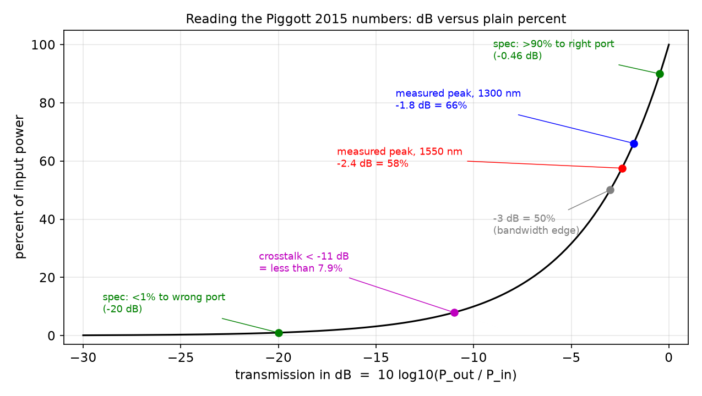
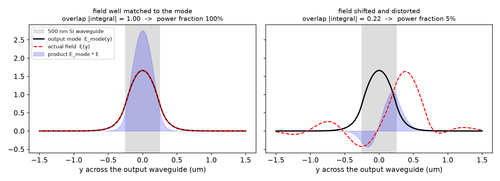
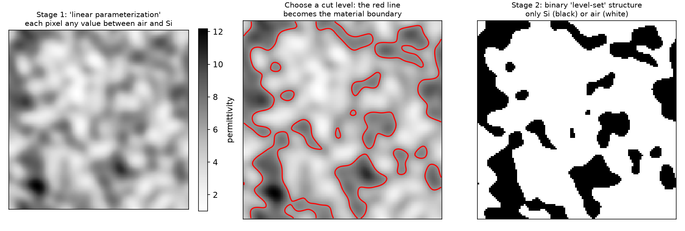
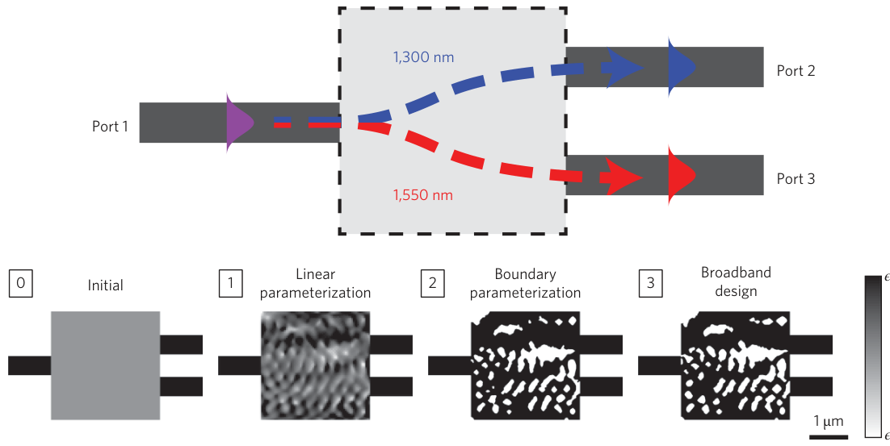
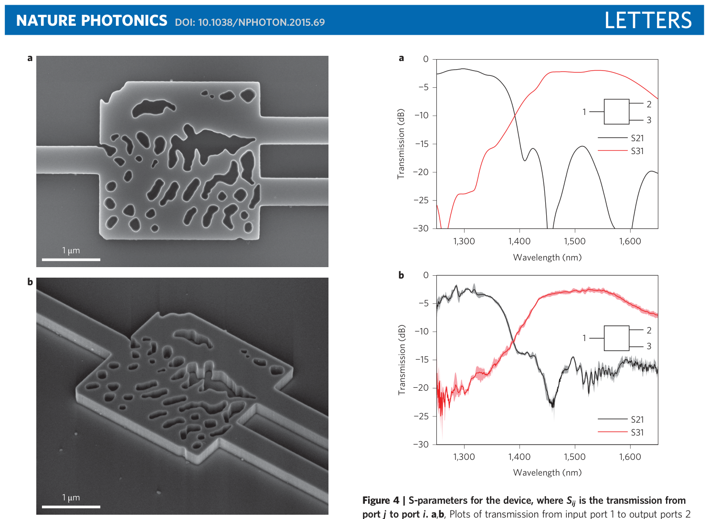

# Week 10 · Day 1 — Monday 23 Nov 2026 · Piggott 2015 — inverse-designed wavelength demultiplexer

*Simple-English study version of Alexander Y. Piggott, Jesse Lu, Konstantinos G. Lagoudakis, Jan Petykiewicz, Thomas M. Babinec & Jelena Vučković, "Inverse design and demonstration of a compact and broadband on-chip wavelength demultiplexer", Nature Photonics 9, 374–377 (2015)*

---

!!! abstract "Today's slot"
    **Morning, 06:15–07:45:** "Piggott 2015 — the inverse-designed WDM demultiplexer."
    **EXIT:** `paper-notes/2015-piggott-demux.md`, plus one sentence on why it is *not* your replication target.

    **Where you have met this paper before.** On **Saturday 17 Oct 2026** (week 4), in the block "Choose the Sprint 2 replication target", the schedule said: *"Piggott 2015 demux is reading, not the target: too many ports and wavelength specs to debug."* Today you read it properly and write that judgement down in your own words.

    **After reading you should be able to:**

    - say what the device does: it separates **1300 nm** and **1550 nm** light from one input waveguide into two output waveguides, in a **2.8 × 2.8 µm²** footprint;
    - quote the headline numbers, all in dB: measured peak insertion loss **−1.8 dB** (1300 nm band) and **−2.4 dB** (1550 nm band); crosstalk **below −11 dB**; 3 dB bandwidths **100 nm** and **170 nm**;
    - write down the inverse-design problem as "Maxwell's equations (Eq. 1) + output-mode constraints (Eq. 2)", and explain each symbol;
    - describe the three-stage optimisation: continuous → binary level set → broadband;
    - explain why this paper matters: it was one of the first *experimental demonstrations* of an inverse-designed silicon device. Its contribution is the demonstration, not a new algorithm;
    - write the sentence: *"This is not my replication target because it has two output ports **and** two wavelength specs, so four things can be simultaneously wrong — and the plan's rule is one scalar FOM with two or three ports."* The reason is **debuggability**, not the paper's quality.

    **The same evening (20:00–21:30)** you read the follow-up, Piggott et al. 2017, *Fabrication-constrained nanophotonic inverse design*. See the [companion page](day-01-mon-23-nov-2026-piggott-2017.md).

## Before you start: the big picture

One optical fibre or waveguide can carry several "colours" of light at once, and each colour carries its own data. This is **wavelength division multiplexing (WDM)**. Think of a motorway with several lanes, one lane per colour. At some point the lanes must be separated again, so each colour goes to its own detector. The device that does this is a **wavelength demultiplexer**: one colour mix in, separate colours out.

The usual demultiplexers on a chip are big: tens to hundreds of micrometres across. They work by spreading light out like a prism, or by sending it round rings that only let one colour through. This paper asked a different question: *"What if a computer is given a small square of silicon and allowed to carve any pattern it likes, so that 1300 nm light goes up and 1550 nm light goes down?"* The answer was a strange, holey, organic-looking pattern only 2.8 µm on a side. It was fabricated, it worked, and three copies all behaved the same.

Analogy: a human designer is like an architect who only uses standard bricks in standard shapes. Inverse design is like letting a sculptor carve the stone freely, guided at every step by a measurement of how well the sculpture performs. The result looks odd, but it can do things standard shapes cannot, in a much smaller space.

The paper is short: a "Letter", about 3 pages. Most of its weight is in the result. Its algorithm was described in earlier papers (Lu & Vučković 2013, ref. 5; Piggott 2014, ref. 14).

## Background you need

### Wavelength, frequency, and the two telecom bands

The **wavelength** $\lambda$ is the distance between wave crests. The **frequency** is $f = c/\lambda$, with $c = 3\times10^8$ m/s. The two wavelengths in this paper are the two classic telecom bands:

| Band | $\lambda$ | $f = c/\lambda$ | Typical use |
|---|---|---|---|
| O-band | 1300 nm | 230.6 THz | data-centre links |
| C-band | 1550 nm | 193.4 THz | long-haul fibre |

They are far apart: 250 nm, or 37 THz. That makes the job easier than separating channels only 0.8 nm apart, as dense WDM does.

**Converting a bandwidth in nm to THz:** $\Delta f \approx c\,\Delta\lambda/\lambda^2$. For the paper's 100 nm bandwidth at 1300 nm: $\Delta f \approx 3\times10^8 \times 100\times10^{-9} / (1.3\times10^{-6})^2 \approx 17.8$ THz.

### Silicon-on-insulator, waveguides, and the TE mode

The chip is **silicon-on-insulator (SOI)**: a 220 nm silicon layer on top of a buried oxide (SiO$_2$) layer. Here the oxide is 3 µm thick. "Fully etched" means the pattern is cut all the way through the 220 nm. In this paper nothing covers the top, so the top cladding is **air**. Indices used: $n_{Si} = 3.49$, $n_{SiO_2} = 1.45$, $n_{air} = 1$.

A **waveguide** is a narrow silicon strip that traps light by total internal reflection. Light inside it travels in fixed patterns called **modes**. The **fundamental TE mode** (transverse electric, with the electric field lying mostly in the chip plane) is the simplest pattern: one hump, centred on the strip. Both the input and the outputs in this paper use the fundamental TE mode.

### Ports and S-parameters

A **port** is a place where light enters or leaves a device, here the end of a waveguide. Port 1 is the input. Port 2 is the 1300 nm output. Port 3 is the 1550 nm output.

**S-parameters** (scattering parameters) describe how much light goes from one port to another. $S_{ij}$ means "from port $j$ to port $i$". So $S_{21}$ is the transmission from input 1 to output 2. $|S_{21}|^2$ is the power fraction. Curves of $S_{21}$ and $S_{31}$ against wavelength are the device's report card. (Careful: the 2017 paper's figure caption writes "$S_{ij}$ is the transmission from port $i$ to port $j$", the reverse. Always check the convention.)

### Decibels: insertion loss and crosstalk

Power ratios are usually given in **decibels (dB)**:

$$\text{dB} = 10\log_{10}\frac{P_{out}}{P_{in}}.$$

Negative dB means less power came out than went in. Handy anchors: −3 dB ≈ 50%, −10 dB = 10%, −20 dB = 1%.

- **Insertion loss** is how much power is lost on the *intended* path. A transmission of −1.8 dB means $10^{-0.18} = 66\%$ arrives.
- **Crosstalk** is how much leaks to the *wrong* port. Below −11 dB means less than $10^{-1.1} = 7.9\%$.
- **3 dB bandwidth** is the wavelength range over which the transmission stays within 3 dB (a factor of 2) of its peak.



**How to read this figure.** The black curve converts dB (horizontal) to percent of input power (vertical). The coloured dots are the paper's own numbers. The green dots are the design specification: >90% (−0.46 dB) to the right port and <1% (−20 dB) to the wrong port. The blue and red dots are the measured peak transmissions, 66% and 58%. The magenta dot is the crosstalk limit, 7.9%. The takeaway: the measured device is clearly below the specification. The paper puts this down to fabrication imperfections, a theme that leads straight to your project.

### Maxwell's equations in the frequency domain

At one frequency $\omega$, every field oscillates as $e^{-i\omega t}$ (or $e^{+i\omega t}$; the sign is a convention). Time derivatives then become multiplication by $\mp i\omega$, and Maxwell's equations become one equation for the electric field:

$$\nabla\times\mu_0^{-1}\nabla\times\mathbf{E} - \omega^2\epsilon\,\mathbf{E} = -i\omega\mathbf{J}.$$

The curl-curl term says how the field bends in space. The $\omega^2\epsilon$ term is the material's response. $\mathbf{J}$ is the source current. On a grid, this becomes a big sparse linear system $A(\epsilon)\mathbf{E} = \mathbf{b}$. This is **FDFD**, built from zero on the [Hughes page](../week-05/day-03-wed-21-oct-2026-hughes-2018.md). Solving it once gives the steady-state field everywhere.

### Mode overlap: how much light lands in an output mode

A field $\mathbf{E}$ arriving in an output waveguide is usually a mixture of patterns. To ask "how much of it is in the fundamental mode $\mathcal{E}$?", you compute an **overlap integral**:

$$\text{amplitude} = \int_S \mathcal{E}^*\cdot\mathbf{E}\, dS.$$

Multiply the field by the (complex-conjugated) mode shape, point by point, over the waveguide cross-section $S$, and add it all up. If both are normalised to unit power, then $|\text{amplitude}|^2$ is the fraction of power in that mode. It is exactly like projecting a vector onto a unit vector: the dot product tells you "how much of the vector points this way".



**How to read this figure.** Black: the fundamental mode of a 500 nm waveguide. Red dashed: the actual field arriving. Blue shading: their product, whose area is the overlap. Left: the field matches the mode, so the overlap is 1 and 100% of the power is in the mode. Right: the field is shifted and distorted. Positive and negative parts of the product partly cancel, the overlap is 0.22, and only about 5% of the power is in the mode. This number is what the optimiser pushes up at the right port and down at the wrong port.

A short script to make both ideas concrete: dB conversions of the paper's numbers, and an overlap integral that drops as the field slides off the mode.

```python
import numpy as np
dB = lambda frac: 10*np.log10(frac)          # power fraction -> dB
frac = lambda d: 10**(d/10)                  # dB -> power fraction

# The 2015 specification (what the optimiser was asked for)
print("spec >90%% to right port   = %.2f dB" % dB(0.90))
print("spec <1%%  to wrong port   = %.1f dB" % dB(0.01))
# The 2015 measurement (what the chip actually did)
for name, d in [("1300 nm peak", -1.8), ("1550 nm peak", -2.4), ("crosstalk bound", -11)]:
    print("%-16s %6.1f dB = %4.1f %% of input power" % (name, d, 100*frac(d)))

# Overlap integral, eq. (2), on a 1D grid: how much of a field is in the mode?
y = np.linspace(-1.5, 1.5, 3001); dy = y[1] - y[0]
mode = np.exp(-(y/0.25)**2); mode /= np.sqrt(np.sum(abs(mode)**2)*dy)   # normalised
for shift in [0.0, 0.1, 0.2, 0.4]:                                     # um
    E = np.exp(-((y - shift)/0.25)**2); E /= np.sqrt(np.sum(abs(E)**2)*dy)
    amp = abs(np.sum(np.conj(mode)*E)*dy)        # |integral of E_mode* . E dS|
    print("field shifted by %.1f um: amplitude %.3f, power %.1f %%  (%.2f dB)"
          % (shift, amp, 100*amp**2, dB(amp**2)))
```

**What you should see:** −0.46 dB and −20.0 dB for the specification; 66.1%, 57.5% and 7.9% for the measured numbers. For the overlap: 100%, 85.2%, 52.7% and 7.7% as the field slides off the mode by 0, 0.1, 0.2 and 0.4 µm. A 200 nm misalignment already costs almost 3 dB. That is why the optimiser must steer the light precisely onto each output.

### Optimisation words: objective, gradient, constraint, convex

- **Objective (figure of merit):** the number that measures how good a design is.
- **Constraint:** a condition the answer must satisfy, for example "≥ 90% to port 2".
- **Gradient descent / steepest descent:** repeatedly step "downhill" in the direction the gradient says the objective improves fastest.
- **Adjoint method:** a trick that gives the gradient with respect to *every* pixel from just one extra simulation (week 4; the Hughes page).
- **Convex problem:** a "bowl-shaped" problem with a single bottom, so any downhill method finds the global best. Inverse design is *not* convex overall, but you can split it into convex pieces (see the objective-first method below).
- **ADMM (Alternating Direction Method of Multipliers):** an algorithm that splits a hard problem into two easier sub-problems and solves them alternately, using Lagrange multipliers to make the two answers agree.

### Parameterisation: how the computer describes the shape

- **Linear (continuous) parameterisation:** each pixel's permittivity can take *any* value between air ($\epsilon_{air}$) and silicon ($\epsilon_{Si}$). This is easy to optimise, but it is not manufacturable, because you cannot etch "60% silicon".
- **Binary / level-set (boundary) parameterisation:** each point is either silicon or air. The boundary is described as the zero contour of a smooth function. Optimisation moves the boundaries. This is manufacturable. Full details are on the [Piggott 2017 page](day-01-mon-23-nov-2026-piggott-2017.md).



**How to read this figure.** Left: a continuous permittivity map, the stage-1 kind, with grey values between air and silicon. Middle: the same map with a cut level drawn in red. Everything above the cut becomes silicon. Right: the resulting binary structure, the stage-2 kind. This is a toy illustration of the switch the paper makes between stages 1 and 2 of Fig. 1b. After the switch, the optimiser only moves the red boundaries.

## The paper, part by part

The Letter has no numbered section headings. Below, the paper is followed in its own order, with a short heading for each part.

### Abstract: what was achieved

- An inverse-design method that "explores the full design space of fabricable devices".
- A silicon wavelength demultiplexer: 1300 nm and 1550 nm from one input into two outputs.
- Several devices fabricated and measured. Insertion loss ~2 dB, crosstalk < −11 dB, bandwidths > 100 nm.
- Footprint **2.8 × 2.8 µm²**, claimed as the smallest dielectric wavelength splitter at the time.

**Worked comparison.** An arrayed waveguide grating, one conventional demultiplexer, of 70 × 60 µm (ref. 19) covers 4200 µm². This device covers 7.84 µm². That is about **535 times smaller**. Measured in wavelengths inside silicon ($1.55/3.49 = 0.44$ µm), the device is only about 6 wavelengths across.

### Motivation: photonics is still designed by hand

Electronic chips are designed with **hardware description languages** (Verilog, VHDL). You describe what the circuit should do, and software builds billions of transistors. Photonic devices, by contrast, are designed by hand. A designer picks a known structure (a ring, a directional coupler, an MMI) from theory and intuition. Then they sweep 2–6 parameters with brute-force simulations. The authors argue that photonics would be "revolutionized" by the same kind of automation.

Their earlier algorithm (ref. 5) lets you **"design by specification"**. You state the desired behaviour, and the algorithm searches *all* fabricable structures, including any topology (any number of holes, in any arrangement), for one that meets it. The search uses local optimisation built on convex-optimisation techniques (ref. 15, Boyd & Vandenberghe).

Why a demultiplexer? WDM multiplies the capacity of a waveguide or fibre by the number of colours. Conventional on-chip demultiplexers are tens to hundreds of µm in size:

- **arrayed waveguide gratings (AWGs)**, which use many waveguides of different lengths, like a prism made of delay lines;
- **echelle gratings**, a curved, etched diffraction grating;
- **ring-resonator arrays**, where each ring drops one colour.

### The inverse-design formulation: Eqs. (1) and (2)

**The idea.** Describe the device by how it couples *input modes* to *output modes* at a few chosen frequencies. In the limit of a continuous spectrum, *any* linear optical device can be described this way. That is D. A. B. Miller's point that "all linear optical devices are mode converters" (ref. 24). So this formulation is fully general.

**Inputs.** There are input modes $i = 1, \ldots, M$, each at its own frequency $\omega_i$. Each is represented by an equivalent current source $\mathbf{J}_i$, a current distribution that launches exactly that mode. Here: $M = 2$ (the TE0 input mode at 1300 nm and at 1550 nm). In the broadband stage there are more.

**Physics, Eq. (1).** Each input's field $\mathbf{E}_i$ must obey Maxwell's equations in the frequency domain:

$$\nabla\times\mu_0^{-1}\nabla\times\mathbf{E}_i - \omega_i^2\,\epsilon\,\mathbf{E}_i = -i\omega_i\,\mathbf{J}_i \qquad (1)$$

- $\epsilon(\mathbf{r})$ is the permittivity everywhere. **This is the design: the unknown we are looking for.**
- $\mu_0$ is the vacuum permeability. Silicon is non-magnetic.
- **Why this form:** it is the curl of Faraday's law, combined with Ampère's law, at a single frequency. Multiply by $\mu_0$ and use $\epsilon = \epsilon_0\epsilon_r$, $\omega^2\mu_0\epsilon_0 = k_0^2$, and you get $\nabla\times\nabla\times\mathbf{E} - k_0^2\epsilon_r\mathbf{E} = -i\omega\mu_0\mathbf{J}$. That is the same equation as Hughes's (S1), up to the sign convention for time.

**Specification, Eq. (2).** For each input $i$, pick $N_i$ output modes $\mathcal{E}_{ij}$ on output surfaces $S_{ij}$ (cross-sections of the output waveguides, $j = 1, \ldots, N_i$). Demand that the coupled amplitude lies in a window:

$$\alpha_{ij} \le \left|\int_{S_{ij}}\mathcal{E}_{ij}^*\cdot\mathbf{E}_i\, dS\right| \le \beta_{ij} \qquad (2)$$

- The integral is the overlap from the background section: "how much of the field is in output mode $j$". The modes are normalised, so the squared amplitude is a power fraction.
- $\alpha_{ij}$ is a lower bound ("at least this much"). $\beta_{ij}$ is an upper bound ("no more than this").
- **Why a window instead of one target value?** A window is easier to satisfy. It says "good enough" rather than "exactly this". It also covers both "send light here" ($\alpha$ high) and "keep light away from there" ($\beta$ low) in one form.

**Worked translation of the spec.** "At 1300 nm, >90% of the power out of port 2 and <1% out of port 3" becomes, for amplitudes (square roots of powers):

- port 2: $\alpha = \sqrt{0.90} = 0.949$, $\beta = 1$;
- port 3: $\alpha = 0$, $\beta = \sqrt{0.01} = 0.1$.

At 1550 nm the roles swap.

**The inverse-design problem** is then: find $\epsilon$ *and* the fields $\mathbf{E}_i$ such that Eq. (1) holds (physics) *and* Eq. (2) holds (performance). There are also fabrication limits on $\epsilon$: only silicon or air, and only inside the design region.

### Two ways to solve it: "objective first" and "steepest descent"

**Objective first (ref. 5).** This flips the usual logic.

1. Force the fields $\mathbf{E}_i$ to satisfy the *performance* (Eq. 2) exactly.
2. Allow *physics* (Eq. 1) to be violated.
3. Minimise how badly physics is violated. The "physics residual" is $\|\nabla\times\mu_0^{-1}\nabla\times\mathbf{E} - \omega^2\epsilon\mathbf{E} + i\omega\mathbf{J}\|^2$.

If the residual reaches zero, you have a real device that meets the spec.

**Why does this help?** Look at Eq. (1). If you fix $\epsilon$, it is *linear* in $\mathbf{E}$. If you fix $\mathbf{E}$, it is *linear* in $\epsilon$ (the term $\omega^2\epsilon\mathbf{E}$). So "minimise the residual over $\mathbf{E}$ with $\epsilon$ fixed" is a convex least-squares problem. So is "minimise over $\epsilon$ with $\mathbf{E}$ fixed". ADMM alternates between these two convex sub-problems. That is the sense in which the algorithm is "based on convex optimisation", even though the whole problem is not convex. This method is good at finding a *starting* structure from nothing.

**Steepest descent.** This is the usual logic:

1. The fields always satisfy physics: solve Eq. (1) exactly, with an FDFD solve.
2. Define a performance metric that measures how much Eq. (2) is violated. For example, penalise how far each overlap is outside its $[\alpha, \beta]$ window.
3. Get the gradient of that metric with respect to every pixel's $\epsilon$ using the **adjoint method**: one extra electromagnetic solve.
4. Step downhill. Repeat.

This method is good for fine-tuning.

**Summary:** objective-first finds a rough answer from scratch; steepest descent polishes it. Both use an FDFD solver, accelerated on graphics cards (GPUs). See Methods.



**How to read this figure.** Top (Fig. 1a): the problem as posed. There is a 2.8 × 2.8 µm design region (grey dashed square), one input (Port 1), and two outputs. 1300 nm light (blue) must go to Port 2 and 1550 nm light (red) to Port 3. Bottom (Fig. 1b): the structure at four stages. The colour bar runs from white ($\epsilon_{air}$) to black ($\epsilon_{Si}$). **0** is the starting point: a uniform grey block, halfway between air and silicon. **1** is after the continuous ("linear") optimisation: a grey, wavy pattern of intermediate permittivities. **2** is after converting to a binary boundary description and optimising further: pure black and white, with holes. **3** is after broadband optimisation: similar, with refined holes. The takeaway: the shape emerges from a featureless start, and the black-and-white structure only appears once the parameterisation is switched.

### The device specification

- **Layout:** a planar three-port structure. There is one input waveguide, two output waveguides, and a square design region (Fig. 1a).
- **Material stack:** a single fully etched 220 nm Si layer on SiO$_2$, with **air** on top. This was chosen for ease of fabrication: one etch step, no top oxide.
- **Indices:** $n_{Si} = 3.49$, $n_{SiO_2} = 1.45$, $n_{air} = 1$.
- **Modes:** the fundamental TE mode in, and the fundamental TE mode in each output.
- **Targets:** at 1300 nm, >90% out of port 2 and <1% out of port 3. At 1550 nm, the converse.

### The three optimisation stages

1. **Stage 1: continuous (linear parameterisation).** $\epsilon$ varies smoothly between air and silicon in every pixel. Objective-first produces an initial guess, and steepest descent fine-tunes it. Only the two centre wavelengths are specified.
2. **Stage 2: binary (level-set boundary parameterisation).** The structure is converted to a pure silicon/air shape whose boundaries are a level set (ref. 25, Osher & Fedkiw). It is then optimised with steepest descent, which now moves the boundaries. Still only two wavelengths.
3. **Stage 3: broadband.** The performance is now specified at **ten** wavelengths: five equally spaced frequencies around each of the two centre frequencies. This is again optimised with steepest descent.

**Why broadband?** It has been observed that devices which work over a wide band also tend to tolerate fabrication errors. The intuition: a small change in size acts a bit like a small change in wavelength, so a design that is flat across wavelengths is also flat against small size errors. The paper says it was "hoped" this would give a more robust design. **This is only a heuristic. The paper does not test it.** Making robustness explicit, instead of hoping for it, is exactly what your project does.

**Cost:** about **36 hours** on one server with three Nvidia GTX Titan GPUs.


!!! note "Image extraction note"
    The image file for Fig. 2 in your paper folder is a duplicate of Fig. 1 (an extraction error). The real Fig. 2 is described below from the paper's caption. Open the free PDF (link in the schedule) to see it.

**How to read the real Fig. 2.** (a) A 3D rendering of the final SOI structure: the input waveguide on the left, two output waveguides on the right, and an irregular pattern of etched holes in between. Panel 3 of Fig. 1b above shows the same pattern from the top. (b) FDTD simulations of the electromagnetic energy density $U = \epsilon|\mathbf{E}|^2 + \mu|\mathbf{H}|^2$. At 1300 nm (left) the light bends to the upper output; at 1550 nm (right) it bends to the lower output. The takeaway, as the authors note: even though the geometry looks chaotic, the light follows a fairly confined, smooth path through it. The holes act together as a wavelength-dependent "steering" medium.

*Note on the energy density:* $U$ adds up the electric and magnetic energy stored per unit volume. It is a convenient way to show where the light is, because it never oscillates to zero the way $\text{Re}(E)$ does.

### Fabrication

**Recipe** (Methods):

- Unibond SmartCut SOI wafers from SOITEC: a nominal 220 nm device layer on 3.0 µm of buried oxide.
- **Electron-beam lithography (EBL)** with a JEOL JBX-6300FS, exposing a 330 nm layer of ZEP-520A **resist**. Resist is a light- or electron-sensitive coating that becomes the etch mask. EBL writes the pattern with a focused electron beam. It is very high resolution, but slow, and it is not how a commercial foundry works. Foundries use optical **photolithography**.
- No **proximity-effect correction**. Electrons scatter in the resist and expose areas next to where they were aimed. Without correction, small isolated features come out the wrong size.
- Plasma etch: a C$_2$F$_6$ "breakthrough" step, then a BCl$_3$/Cl$_2$/O$_2$ main etch through the silicon.
- Resist stripped (Microposit Remover 1165, then a Piranha clean: 4:1 sulphuric acid to hydrogen peroxide).
- Diced and polished, so the waveguide ends (facets) are exposed for edge coupling.

**What came out:** the design was reproduced accurately, **except two small (~100 nm) holes next to the input waveguide, which are missing**. Small features are the first to fail in fabrication. This is the problem the 2017 paper attacks with curvature and minimum-feature constraints.



**How to read this figure.** This image is a crop of the paper's page that also shows the Fig. 4 plots on the right. Focus on the left side. Panel a is a top-down **SEM** (scanning electron microscope) image. Panel b is an angled view showing the vertical sidewalls of the etched 220 nm silicon. The 1 µm scale bar shows how small the device is: the input waveguide is about half a micron wide. Compare the hole pattern to Fig. 2a. They match closely, apart from the two tiny missing holes near the input.

### Measurement method

- **Edge coupling with lensed fibres.** A fibre with a tiny lens at its tip is aligned to the polished waveguide end.
- On the input side, a **polarisation-maintaining (PM)** lensed fibre makes sure only the TE mode is launched. Its **polarisation extinction ratio** (the ratio of power in the wanted polarisation to the unwanted one) was measured as 19.0 dB at 1470 nm and 20.7 dB at 1570 nm. So about 1% of the power is in the wrong polarisation.
- On the output side, an ordinary (non-PM) lensed fibre.
- The fibres were aligned by maximising transmission of a 1470 nm laser, a wavelength in the cross-over region between the two bands. This gives consistent coupling whatever the device's own spectrum.
- Light source: a broadband **LED** (one source covering many wavelengths). Detector: an **optical spectrum analyser** (OSA), which measures power versus wavelength.
- **Normalisation:** each device's transmission is divided by that of a plain straight waveguide running alongside it. This cancels fibre-coupling and waveguide losses, so what remains is the device's own efficiency.

### Results: Fig. 4


**How to read this figure.** (In this crop, the left half repeats the SEM images; the plots are on the right.) Both plots show transmission in dB (vertical, 0 to −30) against wavelength from about 1250 to 1650 nm (horizontal). Black = $S_{21}$ (into port 2, the 1300 nm port). Red = $S_{31}$ (into port 3, the 1550 nm port). (a) Simulated with FDTD. (b) Measured on three identical devices. The solid line is the average; the shaded band is the min–max range. What to look at:

- Black is high on the left and red is high on the right. The two curves cross near 1400 nm. That crossing is the "decision point" between the two bands.
- Near 1300 nm, black is about −2 dB and red is below −15 dB. Near 1550 nm, the reverse.
- The measured shaded bands are thin, so the three devices are almost identical. The fabrication is **repeatable**.
- The measured curves are a little lower and less clean than the simulated ones. This is degradation from fabrication imperfections.

**The numbers (measured):**

| Quantity | 1300 nm band | 1550 nm band |
|---|---|---|
| Peak insertion loss | −1.8 dB (66%) | −2.4 dB (58%) |
| 3 dB bandwidth | 100 nm | 170 nm |
| Crosstalk | < −11 dB | < −11 dB |

**Worked check against the spec.** The target was ≥ 90% (−0.46 dB) to the right port and ≤ 1% (−20 dB) to the wrong port. Measured: 66% and 58% to the right port, and up to 7.9% to the wrong one. So the fabricated device misses the spec by about 1.3–2 dB in loss and 9 dB in crosstalk. The simulation (a) is closer to the spec. The authors blame the gap on fabrication imperfections. This exact gap, between "simulated" and "made", is the subject of your robustness study.

**Worked check of the bandwidth in frequency:** 170 nm at 1550 nm is $\Delta f \approx 3\times10^8\times170\times10^{-9}/(1.55\times10^{-6})^2 \approx 21$ THz. That is very wide for a 2.8 µm device, which needs only about 6 wavelengths of propagation to do its job.

### Summary and outlook

The authors conclude that they have experimentally shown a compact, practical wavelength demultiplexer that was designed by an algorithm. Its function had never been shown in such a small structure. They say the algorithm could be applied to metamaterials, plasmonics, nonlinear and active devices. They predict that inverse design "will revolutionize integrated photonics". The following decade broadly bore this out, but only after fabrication constraints were added (2017).

### Methods: simulation details

- The algorithm is described in refs. 5, 14 and 26 (Jesse Lu's PhD thesis).
- Optimisation used a **GPU-accelerated FDFD** solver (Maxwell FDFD; refs. 27–28 by Wonseok Shin). FDFD fits optimisation well: each iteration needs a steady-state field at a few fixed frequencies.
- Final verification used an in-house GPU-accelerated **FDTD** solver. This is an independent method, a good habit: check the design with a different solver from the one that optimised it.

## How this connects to your project

- **The template.** Continuous → binary → broadband is the same pipeline that density-based tools (Meep's `MaterialGrid`, Tidy3D's invdes) use today: a filter, then a projection with $\beta$ increasing, then multi-wavelength objectives. Recognise Fig. 1b as the ancestor of every "β-continuation" plot you will make.
- **The hope you will test.** "Broadband design → fabrication-tolerant" is stated here as a heuristic. Your Monte-Carlo yield study can measure whether it holds. Compare a single-wavelength design against a broadband one under $\pm\delta w$ edge bias.
- **The gap.** The simulation-to-measurement loss (about 1–2 dB) and the missing ~100 nm holes are the motivation for fabrication-aware design. They lead to Piggott 2017 (tonight), Schubert 2022 (tomorrow), and your own robust objective.
- **Why it is not your Sprint 2 target** (the 17 Oct decision): two output ports × two wavelength specifications = four transmission numbers that can each be wrong at once, plus a broadband stage. A replication needs one scalar FOM and two or three ports. Then a mismatch points to one cause. The judgement is about **debuggability**, not quality.

!!! warning "Common confusions"
    - **"Inverse design" here is not one algorithm.** It is a pipeline: objective-first (ADMM) for a start, steepest descent with the adjoint for fine-tuning, and a level-set representation for the final binary shape.
    - **Objective-first lets physics be wrong on purpose** during the search. Only the final structure must satisfy Maxwell's equations.
    - **Eq. (2) bounds the *amplitude*, not the power.** A 90% power target is an amplitude bound of 0.949.
    - **$S_{ij}$ conventions differ between papers.** Here $S_{ij}$ is from port $j$ to port $i$. Check every time.
    - **Insertion loss is quoted as a negative dB number here** (−1.8 dB). Many papers quote it as a positive "loss of 1.8 dB". Same thing.
    - **Fig. 3 and Fig. 4 files are the same page crop.** The SEM images and the S-parameter plots sit side by side in both.
    - **Air cladding.** This device has no oxide on top, unlike most foundry processes, and unlike the 2017 devices, which were capped with oxide. Results would shift if you simulated it with an oxide top.

## Check yourself

1. What does the device do, and how big is it?

    ??? note "Answer"
        It splits 1300 nm and 1550 nm light from one input waveguide into two output waveguides (port 2 for 1300 nm, port 3 for 1550 nm). The design region is 2.8 × 2.8 µm².

2. Convert −2.4 dB and −11 dB to percentages.

    ??? note "Answer"
        $10^{-0.24} = 0.575$, i.e. 57.5%. $10^{-1.1} = 0.079$, i.e. 7.9%.

3. Write Eq. (2) for the 1300 nm input at port 3 with the paper's spec. What are $\alpha$ and $\beta$?

    ??? note "Answer"
        $0 \le |\int_{S_3}\mathcal{E}_3^*\cdot\mathbf{E}_{1300}\,dS| \le \sqrt{0.01} = 0.1$. So $\alpha = 0$ and $\beta = 0.1$.

4. Why can the "objective first" method use convex optimisation even though inverse design is not convex?

    ??? note "Answer"
        The physics residual $\nabla\times\mu_0^{-1}\nabla\times\mathbf{E} - \omega^2\epsilon\mathbf{E} + i\omega\mathbf{J}$ is linear in $\mathbf{E}$ when $\epsilon$ is fixed, and linear in $\epsilon$ when $\mathbf{E}$ is fixed. So each half of an alternating scheme is a convex least-squares problem. ADMM alternates between them.

5. What is the difference between the objective-first and steepest-descent methods?

    ??? note "Answer"
        Objective-first: the fields satisfy the performance spec, and the physics violation is minimised. Steepest descent: the fields satisfy physics exactly (an FDFD solve), and the performance violation is minimised using adjoint gradients.

6. Name the three optimisation stages and what changes at each.

    ??? note "Answer"
        (1) Continuous/linear: $\epsilon$ is free between air and Si, with 2 wavelengths. (2) Binary level set: only Si or air, boundaries move, still 2 wavelengths. (3) Broadband: binary, with 10 wavelengths (5 around each centre).

7. Why optimise at 10 wavelengths instead of 2?

    ??? note "Answer"
        For wide bandwidth, and because broadband designs are believed (heuristically) to be more tolerant of fabrication errors. A small size error acts a bit like a small wavelength shift.

8. What went wrong in fabrication, and what does it suggest?

    ??? note "Answer"
        Two small (~100 nm) holes next to the input were missing. Tiny features are the hardest to fabricate. That motivates minimum-feature-size and curvature constraints, which come in Piggott 2017.

9. How was the measurement normalised, and why?

    ??? note "Answer"
        Device transmission was divided by that of a straight reference waveguide next to it. This removes fibre-to-chip coupling and waveguide propagation losses, leaving the device's own efficiency.

10. Write your one-sentence reason why this is not your replication target.

    ??? note "Answer"
        "It has two output ports and two wavelength specifications, so four things can be simultaneously wrong; my replication rule is one scalar FOM with two or three ports, so that a mismatch is debuggable." The reason is about debuggability, not about the paper's quality.

11. What is the paper's main contribution, according to the schedule's reading?

    ??? note "Answer"
        The experimental demonstration: one of the first fabricated and measured inverse-designed silicon devices, small and repeatable. The algorithm itself was published earlier.

## Key takeaways

- A 2.8 × 2.8 µm² inverse-designed silicon device separates 1300 nm and 1550 nm, roughly 500 times smaller in area than an AWG.
- The problem is posed as Maxwell's equations (Eq. 1) plus overlap-integral windows on output modes (Eq. 2).
- Objective-first (ADMM, convex sub-problems) gives a start; adjoint steepest descent refines it.
- Continuous → binary level set → broadband is the optimisation pipeline, and the ancestor of today's density + projection workflows.
- Measured: −1.8 / −2.4 dB peak insertion loss, < −11 dB crosstalk, 100 / 170 nm bandwidth, highly repeatable over 3 devices.
- The simulated-vs-measured gap and the missing 100 nm holes show that fabrication must be built into the design. That is the next paper, and your project.
- It is reading, not a replication target: too many ports and wavelength specs to debug.

## Glossary

| Term | Plain definition |
|---|---|
| 3 dB bandwidth | Wavelength range over which transmission stays within half (−3 dB) of its peak. |
| ADMM | Alternating Direction Method of Multipliers: solves a hard problem by alternating two easier sub-problems. |
| Adjoint method | Gets the gradient with respect to all design pixels from one extra simulation. |
| Air cladding | No material on top of the silicon; the top is air. |
| Arrayed waveguide grating (AWG) | A large conventional demultiplexer built from many waveguides of different lengths. |
| Binary structure | Each point is either fully silicon or fully air. |
| Buried oxide (BOX) | The SiO$_2$ layer under the silicon in an SOI wafer. |
| Convex problem | Bowl-shaped problem with one minimum, solvable reliably. |
| Crosstalk | Power leaking to the wrong output port. |
| dB (decibel) | $10\log_{10}$ of a power ratio. |
| Demultiplexer | Device that separates combined wavelengths into different outputs. |
| Design region | The area the algorithm may change. |
| Echelle grating | A conventional demultiplexer based on a curved, etched diffraction grating. |
| Edge coupling | Coupling a fibre to the polished end of an on-chip waveguide. |
| Electron-beam lithography (EBL) | Writing a pattern into resist with a focused electron beam; high resolution, slow. |
| Energy density ($U$) | Electromagnetic energy stored per unit volume; shows where the light is. |
| FDFD | Finite-difference frequency-domain simulation: one linear solve per frequency. |
| FDTD | Finite-difference time-domain simulation: steps fields in time. |
| Fully etched | Pattern cut through the whole silicon layer. |
| Fundamental TE mode | The simplest guided pattern, with the electric field in the chip plane. |
| GPU | Graphics card, used to speed up simulations. |
| Insertion loss | Power lost on the intended path. |
| Level set | Describing a shape's boundary as the zero contour of a smooth function. |
| Linear parameterisation | Each pixel's permittivity varies continuously between air and silicon. |
| Mode | A stable field pattern that a waveguide carries. |
| Objective-first method | Enforce the performance spec on the fields, then minimise the physics violation. |
| Optical spectrum analyser (OSA) | Instrument that measures power versus wavelength. |
| Overlap integral | $\int\mathcal{E}^*\cdot\mathbf{E}\,dS$: how much of a field lies in a given mode. |
| Permittivity ($\epsilon$) | Material property; $\epsilon_r = n^2$. The design variable here. |
| Polarisation extinction ratio | Ratio of wanted to unwanted polarisation power. |
| Polarisation-maintaining (PM) fibre | Fibre that preserves the input polarisation. |
| Port | Entry or exit waveguide of a device. |
| Proximity effect | Electrons scattering in the resist and exposing nearby areas. |
| Resist | Coating patterned by light or electrons that becomes the etch mask. |
| Ring resonator | A loop waveguide that passes or drops a narrow set of wavelengths. |
| S-parameter ($S_{ij}$) | Transmission amplitude from one port to another (convention varies). |
| SEM | Scanning electron microscope image. |
| SOI | Silicon-on-insulator: thin silicon on oxide on a silicon substrate. |
| Steepest descent | Repeated downhill steps along the negative gradient. |
| WDM | Wavelength division multiplexing: several wavelengths share one waveguide. |
