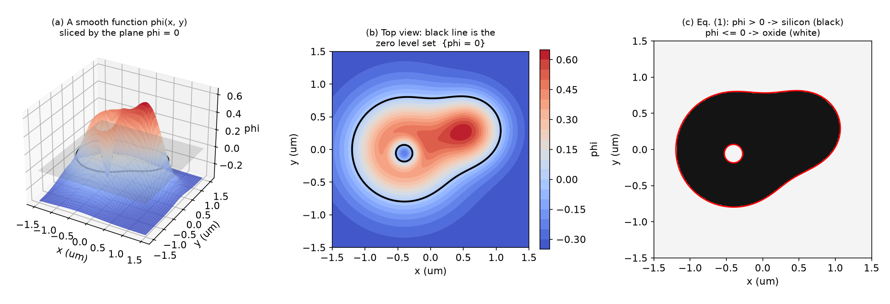
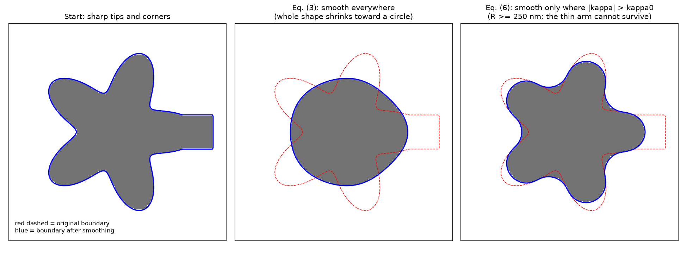
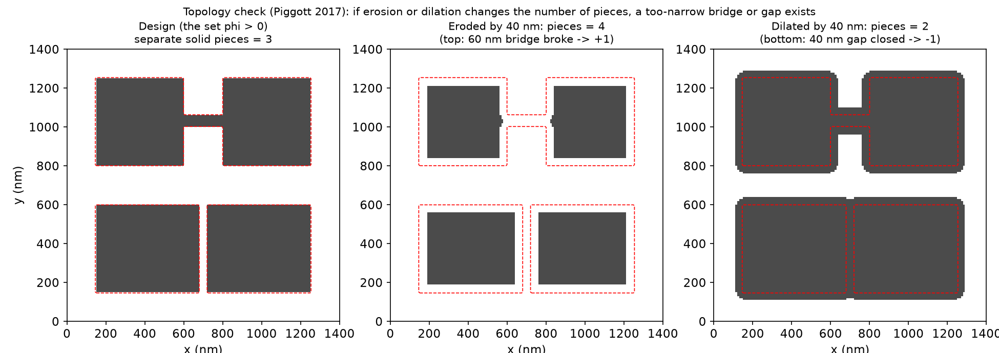
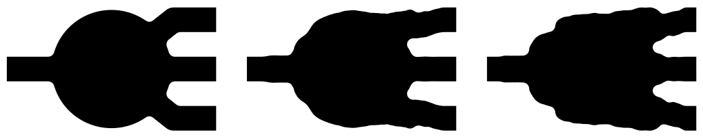
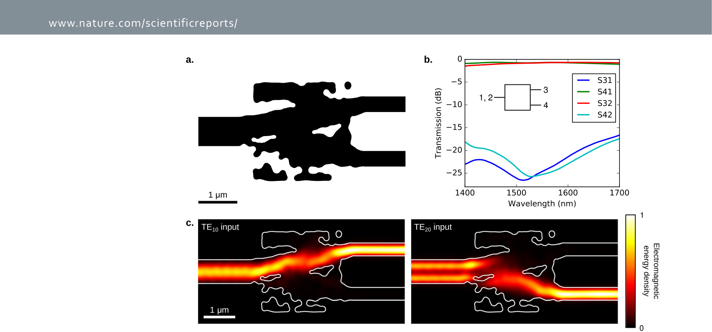
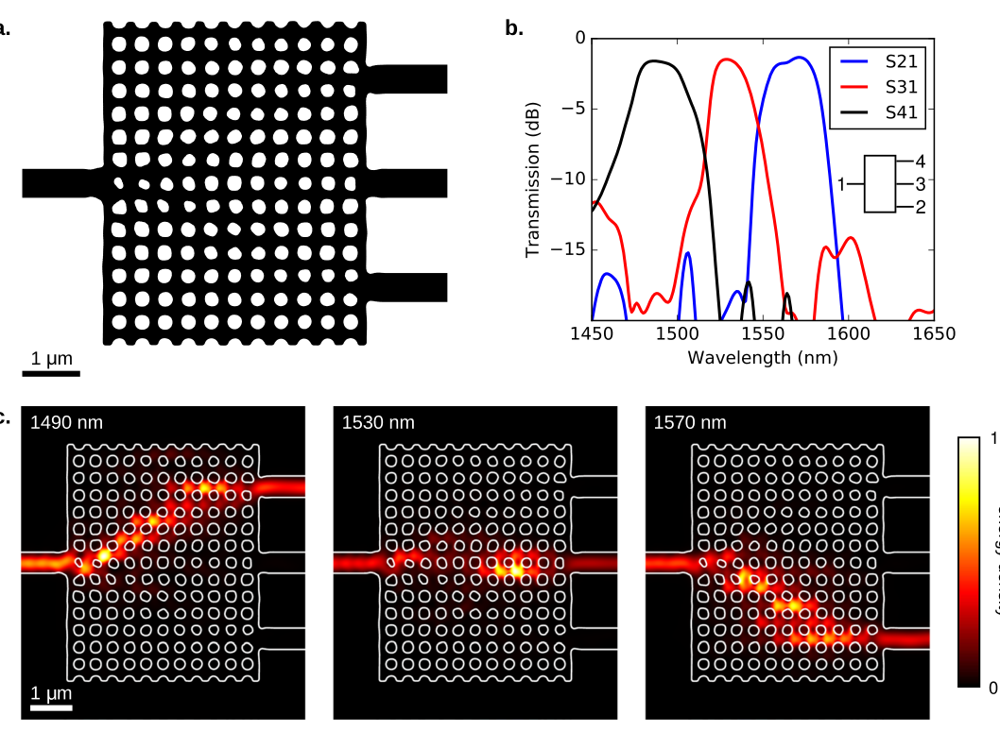
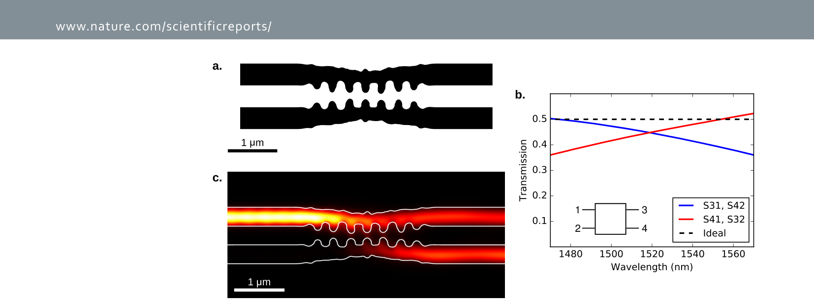
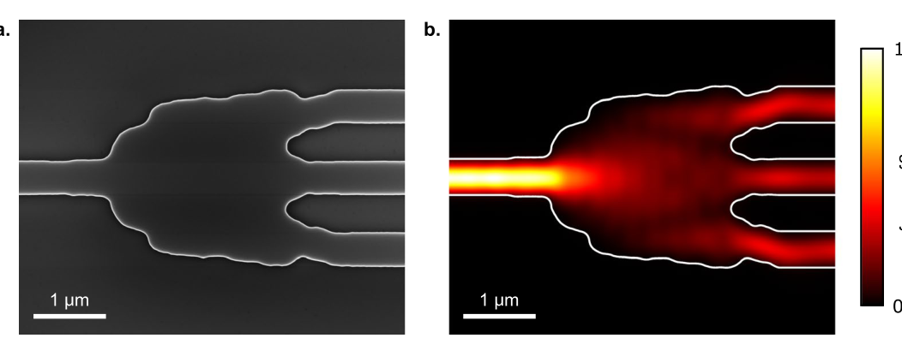
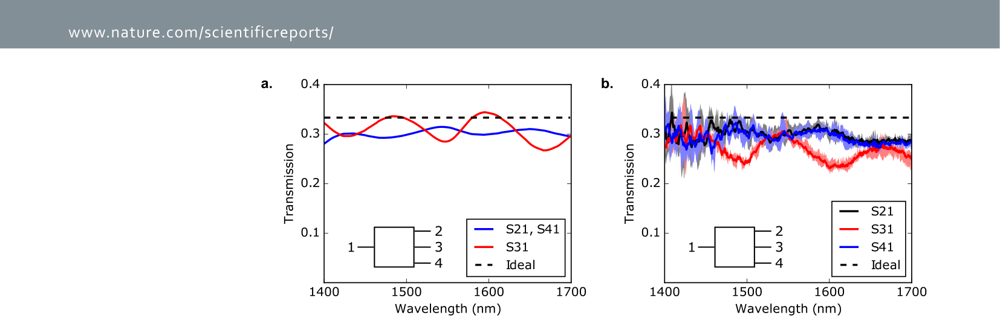

# Week 10 · Day 1 — Monday 23 Nov 2026 · Piggott 2017 — Fabrication-constrained inverse design

*Simple-English study version of Alexander Y. Piggott, Jan Petykiewicz, Logan Su & Jelena Vučković, "Fabrication-constrained nanophotonic inverse design", Scientific Reports 7, 1786 (2017), DOI 10.1038/s41598-017-01939-2*

---

!!! abstract "Today's slot"
    **Evening, 20:00–21:30:** "Piggott 2017 — fabrication-constrained inverse design."
    **EXIT:** note filed with the **exact constraint formulation copied out** (not paraphrased).

    The schedule's HOW block asks two things of you:

    - Note first *what the paper designs*: a **spatial-mode demultiplexer, a wavelength demultiplexer and a directional coupler**, plus an experimentally demonstrated **1 × 3 power splitter**. The directional coupler is why this paper keeps coming up as your likely replication source.
    - Copy the constraint formulation verbatim into your note. The two key passages are quoted in the section "Curvature limiting and gap/bridge removal" below. You will implement this kind of mechanism in weeks 21–22, and a paraphrase loses the detail.

    **This paper shows up on three days of the schedule:**

    - **Thu 19 Nov 2026 (week 9), morning:** "Erosion and dilation as the standard proxy for over- and under-etch. Read how Piggott 2017 and Schubert 2022 each define it." This page answers the Piggott half (see "Erosion and dilation: what Piggott 2017 actually does").
    - **Mon 23 Nov 2026 (week 10), evening:** today's full read. The morning was [Piggott 2015](day-01-mon-23-nov-2026-piggott-2015.md).
    - **Tue 9 Feb 2027, morning:** "Read Piggott 2017's constraint formulation again, this time with your own code in front of you." **EXIT:** the gap between his formulation and yours, stated explicitly. A head start is in "How this connects to your project".

    **After reading you should be able to:**

    - explain a **level set** from zero, and write Eq. (1) mapping $\phi$ to $\epsilon$;
    - derive the level-set motion equation (Eq. 2) and the curvature formula (Eq. 4);
    - explain why curvature limiting (Eqs. 3, 5, 6) gives an *approximate* minimum feature size, and why it still misses narrow gaps and bridges;
    - describe how morphological erosion and dilation *detect* those gaps and bridges;
    - list the multi-stage pipeline (continuous → threshold → level set with constraints) and each device's numbers.

## Before you start: the big picture

The [2015 demultiplexer](day-01-mon-23-nov-2026-piggott-2015.md) worked, but it had tiny holes, about 100 nm across. Two of them simply did not appear on the chip. It was also made with electron-beam lithography, a slow, very sharp research tool. Commercial foundries print chips with **photolithography**, which is like projecting a slide onto the wafer. It blurs anything that is too small or too sharply curved. A design full of tiny, spiky features cannot be made in a foundry.

This paper teaches the optimiser to respect fabrication rules *while it designs*, instead of fixing the design afterwards. The rule it enforces is simple and geometric: **no boundary may bend more sharply than a chosen radius**, for example 100 nm. Think of drawing with a thick round marker instead of a fine pen. Whatever you draw, every corner comes out rounded at least as much as the marker tip. Small dots and sharp spikes become impossible.

One case slips through: a long, thin, *straight* strip, or a long, thin straight slit. Its edges are straight, so they are not curved at all, yet it is far too thin to make. For that case the paper adds a second check. Fatten and shrink the shape slightly (dilation and erosion) and see whether pieces join or split. If they do, a too-narrow feature is there, and it is cut out.

With these rules in place, the paper designs four devices that respect normal foundry design rules, and makes and measures one of them, a 1 × 3 splitter. It works well, and four copies behave alike.

## Background you need

### The shape problem: pixels versus boundaries

A two-material device (silicon and oxide) can be described in two main ways:

- **Pixels / density:** each grid cell holds a number, 0 for oxide and 1 for silicon, or anything in between during optimisation. This is what Meep's `MaterialGrid` and Tidy3D's topology regions use.
- **Boundaries:** describe *where the edge between the materials is*, and move the edges. This is closer to how a mask is drawn. The trouble is changing **topology**, meaning the number of separate pieces and holes. If you store a boundary as a list of points, merging two holes or splitting one piece is messy bookkeeping.

The **level-set method** gets the best of both. It stores a smooth function on the grid, like pixels, but the shape is defined by its zero contour, like boundaries.

### Level sets from zero

Take a smooth function $\phi(x,y)$, a "height" at every point of the design region. Imagine it as a landscape of hills and valleys. Now flood the landscape with water up to height 0.

- Where the land is above the water ($\phi > 0$), put silicon.
- Where it is under water ($\phi \le 0$), put oxide.
- The shoreline is the set of points where $\phi = 0$, the **zero level set**. **The shoreline is the device boundary.**

Changing the shape means changing the landscape. If two hills grow and their shorelines touch, two islands merge into one. If a valley deepens until it pokes below sea level inside an island, a new lake (a hole) appears. Topology changes happen automatically. Nobody has to track them. That is the advantage the paper highlights.



**How to read this figure.** (a) A smooth function $\phi(x,y)$ drawn as a surface. Red is high, blue is low. The grey plane is $\phi = 0$, and the black curve is where they cross. (b) The same function seen from above, with colour showing height. The black line is the zero level set. It has an outer boundary and also a small closed loop around a dip on the left, which will become a hole. (c) Eq. (1) applied: $\phi > 0$ becomes silicon (black) and $\phi \le 0$ becomes oxide (white). The device is the island, and it has a hole. The takeaway: **one smooth function on a grid encodes a binary shape of any topology.**

A common choice is a **signed distance function**: $\phi$ = distance to the boundary, positive inside and negative outside. Then $|\nabla\phi| = 1$ everywhere, which keeps numerical schemes well behaved. Codes "re-initialise" $\phi$ to a signed distance function from time to time. Piggott does not discuss this; it is an implementation detail.

### Normals and the gradient of $\phi$

The gradient $\nabla\phi = (\phi_x, \phi_y)$ (subscripts mean partial derivatives) points uphill, i.e. toward larger $\phi$, which here means into the silicon. The shoreline runs at right angles to it. So

$$\mathbf{n} = \frac{\nabla\phi}{|\nabla\phi|}$$

is the **unit normal** to the boundary: a length-1 arrow perpendicular to the edge.

### Curvature, and the radius of curvature

**Curvature** $\kappa$ measures how sharply a curve bends. For a circle of radius $R$, $|\kappa| = 1/R$. A straight line has $\kappa = 0$. A tight corner has a large $|\kappa|$. The **radius of curvature** is $1/|\kappa|$: the radius of the circle that best hugs the curve at that point.

**Worked numbers.** A minimum radius of curvature of 100 nm means $|\kappa| \le 1/(0.1\ \mu\text{m}) = 10\ \mu\text{m}^{-1}$ everywhere on the boundary. A feature that ends in a rounded tip of width $w$ has tip radius at most about $w/2$. So a 100 nm radius limit rules out tips narrower than about 200 nm. A 40 nm limit (the paper's wavelength demultiplexer) only rules out tips narrower than about 80 nm.

### Why curvature is a proxy for minimum feature size

Lithography acts like a blur. A blur rounds every corner to some minimum radius and wipes out anything smaller than the blur. So "every boundary bends no more sharply than $R$" is a good stand-in for "the process can make it". It is not perfect: a long, thin straight strip has zero curvature but can still be too narrow. The paper deals with that separately.

### Morphological erosion and dilation

These are operations on a binary shape $S$ using a disc of radius $r$ (the **structuring element**):

- **Dilation** by $r$: every point within distance $r$ of the shape joins the shape. The shape gets fatter by $r$ all around. Narrow **gaps** (slits narrower than $2r$) close up.
- **Erosion** by $r$: keep only the points whose whole disc of radius $r$ fits inside the shape. The shape gets thinner by $r$ all around. Narrow **bridges** (strips narrower than $2r$) vanish.

In fabrication language: erosion is like **over-etching** (too much silicon removed, features thinner) and dilation is like **under-etching** (features fatter). That is why other papers use eroded and dilated designs to model fabrication error.

**Topology** here means counting pieces: how many separate solid islands, and how many separate empty regions. Narrow bridges and gaps are exactly the places where a small erosion or dilation *changes the count*.

### Gradient descent on shapes, in one paragraph

You have a figure of merit $f[\epsilon]$ to *minimise* (Piggott's convention). The **adjoint method** gives $\partial f/\partial\epsilon(\mathbf{r})$ at every point from one extra simulation (see the [Hughes page](../week-05/day-03-wed-21-oct-2026-hughes-2018.md)). To use it on a level set, ask what happens if the boundary moves outward by a small distance $\delta n$ at some point. A thin strip of oxide ($\epsilon_1$) becomes silicon ($\epsilon_2$) there, so $f$ changes by about $\frac{\partial f}{\partial\epsilon}(\epsilon_2 - \epsilon_1)\,\delta n$ per unit length of boundary. To decrease $f$, move the boundary outward where this quantity is negative and inward where it is positive. That rule defines a **velocity** $v(x,y)$ for every boundary point.

## Introduction

**What it says.** Inverse design used to mean starting from a known structure and hand-tuning a few parameters. Searching the full space of structures with optimisation now gives smaller, better devices (refs. 2–8). But many of these designs only work when made with high-resolution electron-beam lithography. They have features that industry-standard optical lithography cannot resolve (refs. 3, 7, 8). Ref. 7 is the 2015 demultiplexer.

**The contribution:** an inverse-design method that *builds fabrication constraints in*. It gets an **approximate minimum feature size by limiting the curvature of the material boundaries**. They show a spatial-mode demultiplexer, a wavelength demultiplexer and a directional coupler (all simulated), and a 1 × 3 splitter (made and measured). All are compact, have no small features, and should be printable with modern photolithography. All except the wavelength demultiplexer are well within the design rules of existing silicon-photonics processes.

## Design Method

### Why not the other approaches?

The authors briefly review earlier ways to make designs fabricable. Modelling lithography and etching exactly is hard, so most methods use rules of thumb (**heuristics**):

1. **Big rectangular pixels**, each no smaller than the minimum feature (ref. 10, Shen et al. 2015, a 2.4 × 2.4 µm polarisation splitter). The result is "Manhattan" geometry: only right angles on a coarse grid. It is restrictive, and probably not optimal for optics.
2. **Convolution filter, then threshold** (refs. 11–13). Blur the density map, then cut at 0.5. The authors note this "can introduce artifacts smaller than the desired feature size": the threshold cut can still produce tiny slivers. *This is essentially the conic filter + projection used in Meep and Tidy3D today, so note the criticism. Later work (robust erosion/dilation formulations, Hammond et al. 2021) addresses it.*
3. **This work: curvature constraints on the boundaries.** They say this avoids both problems. Curvature limits were used before (ref. 4, Lalau-Keraly 2013), but were not described in detail or proven experimentally.

### Level Set Formulation: Eq. (1)

The device is **planar** (one etched layer, the same pattern through its thickness) and contains **two materials**. Define a continuous function $\phi(x,y): \mathbb{R}^2\to\mathbb{R}$ over the design region. The material boundaries lie on $\phi = 0$:

$$\varepsilon(x,y) = \begin{cases}\varepsilon_1 & \phi(x,y)\le 0\\ \varepsilon_2 & \phi(x,y) > 0\end{cases} \qquad (1)$$

Here $\varepsilon_1$ is the oxide cladding ($1.44^2 = 2.07$) and $\varepsilon_2$ is silicon ($3.48^2 = 12.1$). With this convention, $\phi > 0$ is "silicon". The paper does not say which is which, but the gap/bridge step uses "the set $\phi > 0$" as the solid.

**Why implicit?** The shape is never stored as a list of edge points, so merging or splitting holes is automatic (see the landscape picture). And you can make $\phi$ depend on time, $\phi(x,y,t)$, and evolve it with partial differential equations, known as **level-set methods** (refs. 14, 15: Osher & Fedkiw; Burger & Osher).

### Gradient descent as boundary motion: Eq. (2)

Choose an objective $f[\varepsilon]$ that measures how well the structure meets the electromagnetic spec. It is the same idea as Eq. (2) of the 2015 paper; the details are in the supplementary information, which is not in your file. Evolve $\phi$ so that $f$ goes down. The level-set equation for moving the boundary along its normal is

$$\phi_t + v(x,y)\,|\nabla\phi| = 0. \qquad (2)$$

- $\phi_t = \partial\phi/\partial t$, how $\phi$ changes in (fictitious) time;
- $v(x,y)$, the local normal speed of the boundary;
- $|\nabla\phi| = \sqrt{\phi_x^2 + \phi_y^2}$. *(The paper prints $\nabla\phi = \phi_x + \phi_y$, which is a typo. The gradient is the vector $(\phi_x, \phi_y)$.)*

**Derivation (why it has this form).** Follow a point $\mathbf{x}(t)$ that rides on the boundary. It always satisfies $\phi(\mathbf{x}(t), t) = 0$. Differentiate with respect to $t$ using the chain rule:

$$\phi_t + \nabla\phi\cdot\dot{\mathbf{x}} = 0.$$

Only motion *perpendicular* to the boundary changes the shape. Sliding along the edge does nothing. So write $\dot{\mathbf{x}} = v\,\mathbf{n}$ with $\mathbf{n} = \nabla\phi/|\nabla\phi|$:

$$\phi_t + \nabla\phi\cdot v\frac{\nabla\phi}{|\nabla\phi|} = \phi_t + v\frac{|\nabla\phi|^2}{|\nabla\phi|} = \phi_t + v|\nabla\phi| = 0. \quad\checkmark$$

With $\mathbf{n}$ pointing into the silicon (uphill), a positive $v$ moves the edge *into* the silicon, so silicon shrinks there. A negative $v$ grows silicon.

**Gradient descent.** Choose $v$ from the gradient of $f$, computed with the **adjoint method**: one forward and one adjoint simulation per frequency. As $t\to\infty$, $\phi$ settles into a **locally optimal** structure, i.e. no small boundary move improves $f$. It is not necessarily the global best.

### Curvature flow: Eqs. (3) and (4)

**The problem.** Plain gradient descent tends to grow *extremely small features*. Tiny holes and spikes often help the objective a little, and nothing stops them.

**The fix.** Every so often, enforce curvature constraints. The basic smoothing equation is

$$\phi_t - \kappa\,|\nabla\phi| = 0 \qquad (3)$$

This is Eq. (2) with the velocity set to $v = -\kappa$: **each boundary point moves with a speed equal to its curvature.** Sharp tips (large $|\kappa|$) move fast, gentle curves slowly, and straight edges not at all. The bumps get ironed out. This is called **curvature flow** (or mean-curvature flow).

The local curvature is

$$\kappa = \nabla\cdot\left(\frac{\nabla\phi}{|\nabla\phi|}\right) = \frac{\phi_x^2\phi_{yy} - 2\phi_x\phi_y\phi_{xy} + \phi_{xx}\phi_y^2}{|\nabla\phi|^3}. \qquad (4)$$

**What the first form means.** $\nabla\phi/|\nabla\phi|$ is the unit normal field $\mathbf{n}$. Its divergence measures how fast the normals spread apart. On a tight curve, neighbouring normals fan out quickly, so the curvature is large. On a straight edge they are parallel, so it is zero.

**Derivation of the second form.** Write $g = |\nabla\phi| = (\phi_x^2 + \phi_y^2)^{1/2}$. Then $\partial g/\partial x = (\phi_x\phi_{xx} + \phi_y\phi_{xy})/g$. By the quotient rule:

$$\frac{\partial}{\partial x}\left(\frac{\phi_x}{g}\right) = \frac{\phi_{xx}}{g} - \frac{\phi_x(\phi_x\phi_{xx} + \phi_y\phi_{xy})}{g^3},$$

$$\frac{\partial}{\partial y}\left(\frac{\phi_y}{g}\right) = \frac{\phi_{yy}}{g} - \frac{\phi_y(\phi_x\phi_{xy} + \phi_y\phi_{yy})}{g^3}.$$

Add them, and put everything over $g^3$ using $g^2 = \phi_x^2 + \phi_y^2$:

$$\kappa = \frac{(\phi_{xx} + \phi_{yy})(\phi_x^2 + \phi_y^2) - \phi_x^2\phi_{xx} - 2\phi_x\phi_y\phi_{xy} - \phi_y^2\phi_{yy}}{g^3} = \frac{\phi_{xx}\phi_y^2 - 2\phi_x\phi_y\phi_{xy} + \phi_{yy}\phi_x^2}{g^3}. \quad\checkmark$$

**Check on a circle.** Take $\phi = R - r$ with $r = \sqrt{x^2 + y^2}$: a disc of silicon of radius $R$. Then $\nabla\phi = -\hat{\mathbf{r}}$ (unit length, pointing inward), and $\nabla\cdot(-\hat{\mathbf{r}}) = -1/r$. On the boundary, $\kappa = -1/R$. So **$|\kappa| = 1/R$, as promised.** The sign depends on the convention: with "$\phi > 0$ inside", convex silicon has negative $\kappa$. That is why the weighting below uses $|\kappa|$. Putting this into Eq. (3): $\phi_t = \kappa|\nabla\phi| = -1/R < 0$, so $\phi$ falls at the boundary and the disc shrinks. Curvature flow shrinks convex blobs.

**The catch.** Run Eq. (3) long enough and *everything* gets smoothed. The boundaries end up as straight lines with zero curvature; in practice blobs shrink toward circles and disappear. That destroys the optimised design.

### Curvature *limiting*: Eqs. (5) and (6)

Fabrication only cares about boundaries that bend *more sharply* than some allowed maximum $\kappa_0$. So smooth only those points. Introduce a switch:

$$b(\kappa) = \begin{cases}1 & |\kappa| > \kappa_0\\ 0 & \text{otherwise}\end{cases} \qquad (5)$$

and evolve with

$$\phi_t - b(\kappa)\,\kappa\,|\nabla\phi| = 0. \qquad (6)$$

Where the boundary is too sharp, it moves by curvature flow and gets rounded. Everywhere else, it is frozen. **Run Eq. (6) to steady state, and the maximum curvature is $\le\kappa_0$.** Equivalently, the radius of curvature is $\ge 1/\kappa_0$ everywhere.



**How to read this figure.** This is a toy simulation of Eqs. (3) and (6) on a star-shaped silicon island with a thin rectangular arm. The red dashed line is the starting boundary; the blue line is the boundary after smoothing. Left: the start, with sharp tips and corners. Middle: Eq. (3), smoothing everywhere. The whole shape shrinks toward a circle, and the design is lost. Right: Eq. (6), smoothing only where $|\kappa| > \kappa_0$ (here $1/\kappa_0 = 250$ nm). The tips and the concave notches are rounded until their radius is about 250 nm, but the overall star survives. The 250 nm-wide arm has corners sharper than the limit and is too thin to hold a 250 nm radius, so it is eaten back. The takeaway: **curvature limiting removes only what is too sharp, and leaves the rest of the optimiser's work alone.**

A short numerical check of Eq. (4) and the role of $\kappa_0$:

```python
import numpy as np
# Check eq. (4): the curvature of the zero contour of phi equals 1/R for a circle.
dx = 0.005                                   # um (5 nm grid)
x = np.arange(-1, 1, dx); X, Y = np.meshgrid(x, x)
R = 0.10                                     # 100 nm radius: Piggott's 1x3 splitter limit
phi = R - np.sqrt(X**2 + Y**2)               # positive inside the disc (silicon)

py, px = np.gradient(phi, dx)                # first derivatives (rows=y, cols=x)
pyy, pyx = np.gradient(py, dx)
pxy, pxx = np.gradient(px, dx)
kappa = (px**2*pyy - 2*px*py*pxy + pxx*py**2) / (px**2 + py**2)**1.5   # eq. (4)

on_edge = abs(phi) < dx/2                    # pixels sitting on the boundary
print("mean |kappa| on the edge = %.2f per um" % abs(kappa[on_edge]).mean())
print("1/R                      = %.2f per um" % (1/R))
kappa0 = 1/0.100                             # the limit: radius of curvature >= 100 nm
for r in [0.05, 0.10, 0.30]:
    print("a %3.0f nm-radius corner has |kappa| = %5.1f /um -> %s"
          % (1000*r, 1/r, "smoothed by eq. (6)" if 1/r > kappa0 + 1e-9 else "left alone"))
```

**What you should see:** a mean $|\kappa|$ of about 9.99 µm⁻¹ against $1/R = 10.00$ µm⁻¹, confirming Eq. (4). Then: a 50 nm-radius corner (20 µm⁻¹) is smoothed, while 100 nm and 300 nm corners are left alone. Note the grid. Piggott's FDFD used 40 nm cells, so a 100 nm radius spans only 2.5 cells. In practice the level-set function is usually kept on a finer grid than the simulation, or curvature is computed carefully.

### Curvature limiting and gap/bridge removal (copy this into your note)

Curvature limiting alone **does not stop narrow gaps or bridges**. A long, straight, 50 nm slit has straight walls, so zero curvature, and Eq. (6) never touches it. The paper's fix, in its own words (copy these sentences into your note verbatim, as the schedule asks):

> "Our algorithm achieves an approximate minimum feature size by imposing curvature constraints on dielectric boundaries in the structure."

> "Although curvature limiting will eliminate the formation of most small features, it does not prevent the formation of narrow gaps or bridges. We detect these features by applying morphological dilation and erosion operations to the set $\phi > 0$, and checking for changes in topology. Once detected, these narrow gaps and bridges can be eliminated by 'cutting' them in half, and then applying curvature filtering to round out the sharp edges."

In plain words:

1. Take the solid set $\{\phi > 0\}$.
2. **Erode** it. If the number of solid pieces goes up, a bridge was too thin and broke.
3. **Dilate** it. If the number of solid pieces (or holes) goes down, a gap was too narrow and closed.
4. At each place where this happened, **cut** the offending feature in half. A bridge is severed; a gap is filled. That leaves new sharp edges.
5. Run curvature limiting (Eq. 6) to round those new edges.

The paper does not give the exact erosion/dilation radius. The natural reading is a radius of about half the minimum gap/bridge width: 45 nm for the 90 nm limits used below. Treat that as an interpretation, not a quote.



**How to read this figure.** A toy design on a 10 nm grid. The red dashed outline is the original shape in every panel. Left: three solid pieces. On top, two blocks are joined by a 60 nm bridge. On the bottom, two blocks are separated by a 40 nm gap. Middle: eroded by 40 nm. The bridge disappears and the count rises from 3 to 4, which flags a narrow bridge. Right: dilated by 40 nm. The bottom gap closes and the count drops from 3 to 2, which flags a narrow gap. Wide features change size but not topology. The takeaway: **counting pieces before and after a small erosion/dilation is a cheap, reliable detector of features narrower than about twice the radius.**

### Erosion and dilation: what Piggott 2017 actually does (for Thu 19 Nov)

The 19 Nov schedule asks you to compare Piggott 2017's definition of erosion/dilation with Schubert 2022's, and warns that "they are not the same". It also flags the claim "[verify the exact Piggott 2017 mechanism against the paper's constraint section]". The text above settles it:

- **In Piggott 2017, erosion and dilation are a *detector* inside the design loop.** They are applied to the binary set $\phi > 0$ only to find features that violate the minimum gap/bridge width, which are then cut out. Device *performance* is never evaluated on the eroded or dilated shapes. The constraint is a **feasibility** constraint: the nominal device must be makeable.
- **In the robust formulation** (Schubert 2022; Chen 2020; Hammond 2021), erosion and dilation model **over- and under-etch**, and the *objective* averages the performance of the eroded, nominal and dilated designs. That is a **robustness objective**: the device must be makeable *and* tolerant to process bias.
- Piggott does *measure* the effect of over/under-etching. The spectral shifts in Fig. 6 "are likely due to slight over-etching or under-etching errors", backed by simulations in the supplementary information. But this is checked after the design, not optimised for.

So the schedule's assertion holds, based on this paper's own text: **one is a feasibility constraint, the other a robustness objective.**

### The complete algorithm

1. Initialise $\phi$ and the step $\delta t$.
2. Repeat until $\delta t < \delta t_{min}$:
    1. Copy: $\phi' \leftarrow \phi$.
    2. **Gradient descent:** evolve $\phi'$ with Eq. (2) for time $\delta t$.
    3. **Gap and bridge removal:** detect narrow gaps and bridges, and modify $\phi'$ to remove them.
    4. **Curvature limit:** evolve $\phi'$ with Eq. (6) until convergence.
    5. If $f[\varepsilon[\phi']] < f[\varepsilon[\phi]]$ (the paper prints "$f\varepsilon[\phi']$", a typo), accept: $\phi \leftarrow \phi'$, and **increase** $\delta t$. Otherwise reject, and **decrease** $\delta t$.

**Why this structure.**

- Every accepted design has passed the fabrication filters (steps c and d), so **every accepted design obeys the constraints**. You never end up with a high-performing but unmakeable shape that has to be "fixed" afterwards.
- The accept/reject rule with a growing or shrinking step is a simple **adaptive step-size** (backtracking) scheme. The filters can undo part of a gradient step, so improvement is not guaranteed. The rule checks for it, and takes smaller steps when steps stop helping.
- It stops when even tiny steps no longer help. That is a local optimum *under the constraints*.

The exact objective $f[\varepsilon]$ and further implementation details are in the paper's supplementary information.

### The multi-stage optimisation (continuous → discrete)

The level-set method needs a binary starting shape. The paper uses two kinds of start:

- **A hand-picked binary shape.** A star for the 1 × 3 splitter. A slab with a regular hole array for the wavelength demultiplexer.
- **A continuous stage first** (as in the 2015 paper and ref. 5). Start from uniform permittivity, let $\epsilon$ vary continuously and optimise it, then **threshold** it to get a binary shape, and only then switch to the constrained level-set optimisation. Used for the spatial-mode demultiplexer and the directional coupler.

So the full pipeline is: **continuous density (free) → threshold → level set with curvature and gap/bridge constraints (fabricable).** The fabrication constraints only apply in the last, binary stage.

## Designed Devices

**Common settings for all four devices:**

- 3D, waveguide-coupled devices: a single fully etched 220 nm Si layer with SiO$_2$ cladding (unlike the air-clad 2015 device);
- $n_{Si} = 3.48$, $n_{SiO_2} = 1.44$;
- simulated with a GPU-accelerated **FDFD** solver (refs. 16, 17) on a **40 nm** grid. A single FDFD solve is much cheaper than an FDTD run when you only need a handful of frequencies;
- each iteration needs **two simulations per design frequency**: one forward and one adjoint.

### 1 × 3 splitter

**Spec:**

- 500 nm wide input and output waveguides;
- minimum radius of curvature **100 nm**, well within typical silicon-photonics design rules;
- bilateral (mirror) symmetry enforced;
- the input's fundamental TE mode split equally into the three outputs' fundamental TE modes, with **at least 95%** total efficiency;
- broadband: optimised at **6** equally spaced wavelengths from **1400 to 1700 nm**.

**Optimisation:** started from a star shape and converged in **18 iterations**. The cost was 18 iterations × 6 wavelengths × 2 simulations = **216 simulations**, about **2 hours** on one server (Intel Core i7-5820K, 64 GB RAM, three Nvidia Titan Z GPUs).



**How to read this figure.** Three snapshots of the silicon (black): iteration 0 (left), 10 (middle) and 18 (right). Light enters from the left waveguide and leaves through three waveguides on the right. The start is a round, star-like body. During optimisation the body becomes a wide, slightly wavy box, and the gaps between the outputs get rounded notches. Every edge stays smooth, because no corner is tighter than 100 nm. Compare this with the 2015 device's tiny holes. The final shape looks like an **MMI** (multimode interference coupler) with optimised edges. The optimiser found the MMI principle (ref. 18) without any human input, which suggests MMIs may simply be optimal for this job.

*An MMI is a wide waveguide section in which many modes interfere. At certain lengths their pattern re-forms as N copies of the input ("self-imaging"), which makes it a natural 1 × N splitter.*

### Spatial-mode demultiplexer

**Spec:**

- input: a **750 nm** waveguide carrying either its TE$_{10}$ or TE$_{20}$ mode. In the paper's naming, TE$_{10}$ is the fundamental mode (one lobe across the width) and TE$_{20}$ is the next mode up (two lobes);
- outputs: two **400 nm** waveguides, each in its fundamental TE mode. TE$_{10}$ goes to one output, TE$_{20}$ to the other;
- **>90%** to the right port and **<1%** to the other;
- 6 wavelengths, 1400–1700 nm;
- start: uniform permittivity → continuous optimisation → threshold;
- minimum radius of curvature **70 nm**; minimum gap/bridge width **90 nm**.

**Result:** average insertion loss **0.826 dB** (about 83% transmitted) and contrast better than **16 dB** over 1400–1700 nm.



**How to read this figure.** (a) The final design. A wide input enters from the left, and two narrower outputs leave on the right. There are a few smooth, blobby holes and islands, none of them tiny. (b) Transmission in dB versus wavelength, 1400–1700 nm. Wanted paths (S41 green, S32 red) sit near 0 dB, i.e. about −1 dB. Unwanted paths (S31 blue, S42 cyan) sit around −17 to −26 dB. The legend's "1, 2" means the two input modes are counted as ports 1 and 2. (c) Energy density for each input mode. TE$_{10}$ (one lobe) is steered to the upper output; TE$_{20}$ (two lobes, visible in the input) to the lower output. The white lines are the device outline.

### Wavelength demultiplexer

**Spec:**

- **3 channels** with **40 nm** spacing (about 1490, 1530 and 1570 nm in the figure);
- 500 nm input and output waveguides;
- **>80%** to the right port and **<1%** to the others;
- start: a rectangular silicon slab with a regular array of holes, **400 nm pitch, 250 nm diameter**;
- minimum radius of curvature **40 nm**; minimum gap/bridge width **90 nm**.

**Result:** about **1.5 dB** insertion loss at each channel centre, contrast better than **16 dB**, and more than **10 nm** of usable bandwidth per channel. This is the one device the paper says is *not* within typical foundry design rules, because a 40 nm radius is too tight.

**Worked note.** A 250 nm hole has radius 125 nm, so the starting holes already satisfy a 40 nm curvature limit easily. The limit only bites when the optimiser tries to pinch or deform them.



**How to read this figure.** (a) The design: a slab with a lattice of slightly deformed round holes, one input on the left, three outputs on the right. The lattice is still visible, with the optimiser's small distortions on top of it. It behaves like an engineered photonic crystal. (b) Transmission in dB versus wavelength. S41 (black) peaks near 1490 nm, S31 (red) near 1530 nm, and S21 (blue) near 1570 nm. Each peak is about −1.5 dB and the others are below about −16 dB there. (c) Energy density at the three channel wavelengths. The light zig-zags through the lattice to a different output for each colour.

### Directional coupler

**Spec:**

- a compact **50–50** coupler with **400 nm** input and output waveguides;
- half of the input power into each output, with **>90%** total efficiency;
- start: uniform permittivity → continuous → threshold;
- 6 wavelengths between 1470 and 1630 nm, for moderate bandwidth. *(The plotted range in Fig. 4b is 1470–1570 nm. Note the mismatch.)*
- minimum radius of curvature **70 nm**; minimum bridge width **90 nm**.

**Result:** at the best operating point, **1520 nm**, **90%** of the input power reaches the desired outputs, about 45% each. The structure looks like a **grating-assisted directional coupler**.

*A directional coupler is two waveguides close enough that light tunnels between them. A grating-assisted one adds periodic corrugations, which help light hop between the guides even when they are not perfectly matched.*



**How to read this figure.** (a) Two parallel waveguides whose facing edges carry smooth, rounded teeth: the corrugation. (b) Transmission (linear, not dB) versus wavelength. Cross paths (S31, S42, blue) fall from 0.5 at 1470 nm to about 0.36 at 1570 nm. Bar paths (S41, S32, red) rise from about 0.36 to 0.52. They cross at about 0.45 near **1520 nm**, which is the 90% total, near the dashed "ideal" 0.5 line. (c) Energy density at 1550 nm (as the caption states). Light entering the top guide splits between the two outputs. **Why this matters to you:** this is a small, two-input device with a single, clean figure of merit (the split ratio). That makes it a debuggable replication target, unlike the 2015 demultiplexer.

## Experimental Realization of 1 × 3 Splitter

**Why a 1 × 3 splitter?** Power splitters are basic building blocks. Good 1 × 2 splitters exist, both conventional and optimised. But cascading 1 × 2 splitters can only make 2, 4, 8, ... outputs. To split equally into 3 you need a dedicated device. Compact, efficient ones were missing. This splitter is smaller and more broadband than earlier 1 × 3 devices (refs. 23, 24).

### Fabrication

The recipe matches the 2015 paper, plus an oxide cap and a cleaner facet process:

- SOITEC Unibond SmartCut SOI: 220 nm Si on 3.0 µm buried oxide;
- JEOL JBX-6300FS electron-beam lithography in 330 nm of ZEP-520A resist;
- plasma etch: C$_2$F$_6$ breakthrough, then a BCl$_3$/Cl$_2$/O$_2$ main etch;
- resist stripped with solvents, then a piranha clean (H$_2$SO$_4$/H$_2$O$_2$);
- capped with **1.6 µm of LPCVD oxide** (low-pressure chemical vapour deposition, a way of growing a uniform glass layer from gases).

**Facets for edge coupling** were made with a multi-step etch:

1. A chrome mask, patterned by liftoff, protects the devices.
2. An inductively coupled plasma etch (C$_4$F$_8$/Ar/O$_2$ chemistry) goes through the oxide cladding, the device layer and the buried oxide.
3. A Bosch-process deep reactive-ion etch (DRIE) cuts about 100 µm into the silicon substrate, to make room for the fibres.
4. The chrome is stripped, and the chips are diced.

The splitter was made with EBL, not photolithography. The paper's claim is that its features *would* survive photolithography, because they obey the design rules. It is not a demonstration in a foundry.



**How to read this figure.** (a) SEM image of the fabricated splitter, before oxide capping. One input on the left widens into a smooth, slightly wavy body, which splits into three outputs. The total footprint is **3.8 × 2.5 µm**. Every edge is rounded, with no tiny features. (b) Simulated energy density at 1550 nm. Light spreads across the wide body (the multimode region) and refocuses into the three outputs, which is MMI-like behaviour. The outer outputs look slightly weaker in this snapshot, which matches the measured uniformity of about 0.6 dB.

### Characterisation

- **Edge coupling** with lensed fibres; a polarisation-maintaining fibre at the input so only the TE mode is excited.
- Fibres aligned by maximising the transmitted power of a **1570 nm laser**.
- Spectrum measured with a **supercontinuum source** (a very broadband laser-like source) and a spectrum analyser.
- Transmission normalised to a straight waveguide running parallel to the device, as in 2015.
- A supplementary video shows the simulated electric energy density $U_E = \frac12\varepsilon E^2$ as the wavelength changes.



**How to read this figure.** Both plots show transmission (linear, 0 to 0.4) versus wavelength (1400–1700 nm). The dashed line at 1/3 is the ideal equal split. (a) Simulated with FDTD. S21 and S41 (the two outer ports, blue, identical by symmetry) sit near 0.30. S31 (the centre port, red) wiggles between about 0.27 and 0.34. (b) Measured, the average of 4 devices. Lines are averages; shading is the min–max range. The measured curves are a little lower than simulated (more loss), and the centre port S31 dips near 1500 nm and 1620 nm, showing a spectral shift relative to simulation. The shaded bands are narrow, so the four devices are consistent. *(This caption defines $S_{ij}$ as "from port $i$ to port $j$", the reverse of the 2015 paper.)*

### Results and their meaning

- Simulation and measurement "match reasonably well". The measured devices show slightly higher loss and a **spectral shift**.
- All 4 measured devices are highly consistent, which the authors read as **robustness to fabrication error**.
- The authors attribute the spectral shifts to **slight over- or under-etching**, supported by simulations in the supplementary information. This is exactly the error your erosion/dilation model represents.

**Figures of merit:**

- **Insertion loss:** total power out relative to power in, in dB.
- **Power uniformity:** the ratio of the largest to the smallest output power, in dB. 0 dB would be perfect equality.

Averaged over 1400–1700 nm:

- insertion loss **0.642 ± 0.057 dB**;
- uniformity **0.641 ± 0.054 dB**.

The ± is the spread between devices.

**Worked numbers.**

- Insertion loss 0.642 dB means $10^{-0.0642} = 0.863$, so **86.3%** of the input power reaches the outputs in total, about 28.8% per port on average. The ideal is 33.3%.
- Uniformity 0.641 dB means $P_{max}/P_{min} = 10^{0.0641} = 1.159$. The strongest port gets about 16% more power than the weakest.
- The design target was ≥ 95% (0.22 dB loss). Measured: 86%, about 0.4 dB worse, across a very wide 300 nm band.

## Conclusion

The authors built fabrication constraints into a level-set inverse-design algorithm: curvature limiting, plus erosion/dilation-based gap and bridge removal. They designed a spatial-mode demultiplexer, a 3-channel wavelength demultiplexer and a 50–50 directional coupler, and fabricated and measured a broadband 1 × 3 splitter. The key point: **the devices have no small features that photolithography could not resolve.** That is what makes inverse-designed devices candidates for real foundry processes.

## How this connects to your project

- **Your formulation vs theirs (the 9 Feb 2027 task).** Piggott's is a **shape / level-set** method with a **geometric** curvature limit and topological gap/bridge surgery. Most steps are non-differentiable: the switch $b(\kappa)$, the cutting, the accept/reject rule. Yours is **density-based** (Meep `MaterialGrid` / Tidy3D), using a **conic filter + tanh projection** for length scale, and **differentiable penalties** (for example `ErosionDilationPenalty`, or Meep's `constraint_solid`/`constraint_void`). When you write the gap explicitly, cover four things:
    1. The parameterisation: level set vs density.
    2. How the constraint enters: projection by PDE evolution vs a penalty term in the objective.
    3. Differentiability: theirs is not; yours is.
    4. What "minimum length" means: a curvature radius plus a gap/bridge width, vs a filter radius.
- **The transferable idea:** the **erosion/dilation invariance test**. "Does the topology (or the performance) change when I shrink or grow the design by $\delta$?" It makes a good automated design-rule check (DRC) proxy: you build one on Thu 11 Feb 2027 (minimum feature, minimum gap, maximum curvature). It also points straight to your robustness objective: evaluate performance, not just topology, on the eroded/dilated designs.
- **The critique to remember:** filter + threshold "can introduce artifacts smaller than the desired feature size". Your density pipeline must show that it does not. Run the DRC proxy on your final binarised designs and report the minimum feature, the minimum gap and the maximum curvature.
- **Replication candidate:** the 50–50 directional coupler (400 nm guides, R ≥ 70 nm, bridges ≥ 90 nm, 90% at 1520 nm) has one scalar FOM and a dimensioned spec. For `plan-sprint2.md`, note the honest gaps: a 2D vs 3D comparison, and the objective defined only in the supplementary information.
- **Robustness evidence:** Fig. 6 shows spectral shifts from over/under-etch. Your Monte-Carlo yield study would turn "likely due to over/under-etching" into a measured sensitivity.

!!! warning "Common confusions"
    - **Curvature limiting ≠ minimum feature size.** It bounds how sharply edges bend. A long straight thin strip or slit passes the curvature test. That is why the separate gap/bridge step exists.
    - **In this paper, erosion/dilation is a detector, not a robustness objective.** Performance is never averaged over eroded/dilated designs here. That came later (Schubert 2022, Chen 2020, Hammond 2021).
    - **The sign of $\kappa$ depends on convention.** With $\phi > 0$ inside, a convex blob has $\kappa < 0$. The switch $b(\kappa)$ uses $|\kappa|$, so it does not matter for the constraint.
    - **Eq. (3) alone would erase the design.** Unlimited curvature flow keeps shrinking shapes. Only the thresholded version, Eq. (6), is safe.
    - **"Level set" is the representation; "level-set method" means evolving $\phi$ with a PDE.** Eq. (1) is the first; Eqs. (2), (3) and (6) are the second.
    - **The devices were made with e-beam lithography**, not in a photolithography foundry. "Within design rules" is a statement about the geometry, not a foundry run.
    - **The minimum gap (90 nm) can be smaller than twice the minimum radius (140 nm).** The curvature limit governs tips and corners. A straight-walled gap has no curvature, so its width is set by the separate gap/bridge rule.
    - **Watch the typos.** $\nabla\phi = \phi_x + \phi_y$ should be the vector $(\phi_x, \phi_y)$, and "$f\varepsilon[\phi']$" means $f[\varepsilon[\phi']]$.

## Check yourself

1. Write Eq. (1) and explain how a level set represents a hole.

    ??? note "Answer"
        $\varepsilon = \varepsilon_1$ where $\phi\le0$ and $\varepsilon_2$ where $\phi>0$. A hole is a region inside the silicon where $\phi$ dips below zero, giving a closed zero contour around it. It appears or disappears automatically as $\phi$ changes, with no bookkeeping.

2. Derive Eq. (2) from "a boundary point stays on $\phi = 0$".

    ??? note "Answer"
        $\frac{d}{dt}\phi(\mathbf{x}(t),t) = \phi_t + \nabla\phi\cdot\dot{\mathbf{x}} = 0$. Only normal motion matters, so $\dot{\mathbf{x}} = v\,\nabla\phi/|\nabla\phi|$. Then $\phi_t + v|\nabla\phi| = 0$.

3. Show that Eq. (4) gives $|\kappa| = 1/R$ for a disc.

    ??? note "Answer"
        $\phi = R - r$ gives $\nabla\phi = -\hat{\mathbf{r}}$, and $\nabla\cdot(-\hat{\mathbf{r}}) = -1/r$ in 2D. At $r = R$, $\kappa = -1/R$, so $|\kappa| = 1/R$.

4. A process needs a radius of curvature ≥ 100 nm. What is $\kappa_0$? Is a 60 nm-radius corner allowed?

    ??? note "Answer"
        $\kappa_0 = 1/(0.1\ \mu\text{m}) = 10\ \mu\text{m}^{-1}$. A 60 nm corner has $|\kappa| = 16.7\ \mu\text{m}^{-1} > \kappa_0$, so Eq. (6) smooths it. Not allowed.

5. What goes wrong if you use Eq. (3) instead of Eq. (6)?

    ??? note "Answer"
        Every boundary point moves with its curvature, so the whole shape keeps smoothing and shrinking until all boundaries are straight (blobs become circles and vanish). The optimised design is destroyed. Eq. (6) only moves points where $|\kappa| > \kappa_0$.

6. Why can't curvature limiting remove a long, 50 nm wide straight bridge?

    ??? note "Answer"
        Its walls are straight, so $\kappa = 0 < \kappa_0$ along almost all of its length, and $b(\kappa) = 0$. Curvature limiting never touches it. It needs the separate erosion/dilation detection.

7. How exactly are narrow gaps and bridges detected and removed?

    ??? note "Answer"
        Apply morphological erosion and dilation to the set $\phi>0$ and check whether the topology changes (the number of pieces or holes). Bridges break under erosion; gaps close under dilation. Each detected feature is "cut in half", and then curvature filtering rounds the new sharp edges.

8. How does Piggott 2017's use of erosion/dilation differ from the robust (Schubert/Chen) formulation?

    ??? note "Answer"
        Piggott uses them as a feasibility *detector* on the geometry, to remove sub-minimum features. Performance is not evaluated on the eroded or dilated shapes. The robust formulation evaluates performance on eroded, nominal and dilated designs and optimises a weighted average: a robustness *objective*.

9. Why does the algorithm accept or reject each step and change $\delta t$?

    ??? note "Answer"
        The fabrication filters can undo part of the gradient step, so the objective may not improve. The algorithm only accepts improving steps, grows $\delta t$ after successes, shrinks it after failures, and stops when $\delta t < \delta t_{min}$.

10. How many simulations did the 1 × 3 splitter take, and why?

    ??? note "Answer"
        18 iterations × 6 wavelengths × 2 simulations (forward + adjoint) = 216 FDFD solves, about 2 hours on 3 GPUs.

11. Convert the splitter's 0.642 dB insertion loss and 0.641 dB uniformity into plain numbers.

    ??? note "Answer"
        $10^{-0.0642} = 86.3\%$ total transmission (about 28.8% per port). $10^{0.0641} = 1.159$: the strongest output carries about 16% more power than the weakest.

12. Which device breaks typical foundry rules, and why? Which is the best replication candidate for you?

    ??? note "Answer"
        The wavelength demultiplexer, with a 40 nm minimum radius of curvature, which is too tight for typical photolithography rules. The best candidate is the 50–50 directional coupler: two ports in, a single split-ratio FOM, and dimensioned constraints (R ≥ 70 nm, bridge ≥ 90 nm).

## Key takeaways

- A level set represents a binary device as the zero contour of a smooth function $\phi$. Topology changes come for free.
- Gradient descent is boundary motion: $\phi_t + v|\nabla\phi| = 0$, with $v$ set by the adjoint gradient.
- Curvature $\kappa = \nabla\cdot(\nabla\phi/|\nabla\phi|)$, and $|\kappa| = 1/R$ for a circle.
- Curvature-*limited* flow, $\phi_t - b(\kappa)\kappa|\nabla\phi| = 0$, rounds only edges sharper than $1/\kappa_0$. This gives an approximate minimum feature size.
- Narrow straight gaps and bridges escape curvature limits. They are found by checking whether erosion or dilation changes the topology, then cut out and re-smoothed.
- Every accepted iteration is fabricable. The pipeline is continuous → threshold → constrained level set.
- Four devices were designed. A 3.8 × 2.5 µm 1 × 3 splitter was measured: 0.64 dB loss, 0.64 dB uniformity over 1400–1700 nm, consistent across 4 devices. The spectral shifts are attributed to over/under-etch.
- In this paper, erosion/dilation is a feasibility detector, not a robustness objective. That distinction defines your project's novelty.

## Glossary

| Term | Plain definition |
|---|---|
| Adaptive step size | Grow the step after a successful iteration, shrink it after a failed one. |
| Adjoint method | Gives the gradient of the objective with respect to the whole design from one extra simulation. |
| Bridge | A thin strip of material joining two larger pieces. |
| Bosch process / DRIE | Deep reactive-ion etching that cuts deep, vertical trenches into silicon. |
| Conic filter + projection | Density-method length-scale control: blur the density, then push it toward 0/1 with a tanh. |
| Curvature ($\kappa$) | How sharply a boundary bends; $1/R$ for a circle of radius $R$. |
| Curvature flow | Moving each boundary point with speed equal to its curvature (Eq. 3); smooths shapes. |
| Curvature limiting | Curvature flow applied only where $|\kappa| > \kappa_0$ (Eq. 6). |
| Design rules | A foundry's geometric limits: minimum width, gap, radius, and so on. |
| Dilation | Grow a shape by a disc of radius $r$; closes gaps narrower than about $2r$. |
| Directional coupler | Two close waveguides that exchange light by evanescent coupling. |
| DRC (design rule check) | Automated check that a layout obeys the design rules. |
| Electron-beam lithography (EBL) | High-resolution pattern writing with an electron beam; research-grade, slow. |
| Erosion | Shrink a shape by a disc of radius $r$; breaks bridges narrower than about $2r$. |
| FDFD | Finite-difference frequency-domain solver: one linear solve per frequency. |
| Gap | A thin slit of empty space between two pieces of material. |
| Grating-assisted coupler | A directional coupler with periodic corrugations that aid the exchange of light. |
| Heuristic | A practical rule of thumb, not a guaranteed method. |
| Insertion loss | Total power lost through the device, in dB. |
| Level set | The set of points where a function takes one value; here $\phi = 0$ is the boundary. |
| Level-set method | Evolving $\phi$ with partial differential equations to move boundaries. |
| LPCVD oxide | Glass layer deposited from gases at low pressure; used as top cladding. |
| Manhattan geometry | Shapes made only of axis-aligned rectangles. |
| MMI (multimode interference) | Wide waveguide section where interfering modes make copies of the input; used as a splitter. |
| Morphology | Image operations (erosion, dilation) that change shapes using a structuring element. |
| Over-/under-etch | Fabrication removes too much / too little material, so features come out thinner / fatter. |
| Photolithography | Optical pattern printing used in foundries; blurs small features. |
| Power uniformity | Ratio of maximum to minimum output power, in dB. |
| Radius of curvature | $1/|\kappa|$; the radius of the circle that best fits the curve locally. |
| Signed distance function | $\phi$ equal to the distance to the boundary, with a sign for inside/outside. |
| Spatial-mode demultiplexer | Routes different waveguide modes to different outputs. |
| Supercontinuum source | A very broadband, laser-like light source. |
| TE$_{10}$, TE$_{20}$ | The paper's names for the fundamental and the next-higher TE mode across the width. |
| Threshold | Turning a continuous density into binary by cutting at a level (for example 0.5). |
| Topology | The number of separate pieces and holes in a shape. |
| Unit normal ($\mathbf{n}$) | Length-1 arrow perpendicular to the boundary; $\nabla\phi/|\nabla\phi|$. |
| Velocity field ($v$) | How fast each boundary point moves along its normal. |
