# Week 10 · Day 2 — Tuesday 24 Nov 2026 · Schubert 2022 (strict foundry constraints)

*Simple-English study version of Schubert, Cheung, Williamson, Spyra & Alexander, "Inverse design of photonic devices with strict foundry fabrication constraints", ACS Photonics 9(7), 2327–2336 (2022)*

---

!!! abstract "Today's slot"
    **Morning, 06:15–07:45 (1.5 h).** The schedule's task line:

    > *Schubert et al. 2022 (ACS Photonics) — inverse design under strict foundry fabrication constraints.*
    > **EXIT:** *Note filed; the difference from Piggott 2017 stated in two sentences.*

    The HOW block adds: read it with the `ceviche-challenges` repository open (the paper's four test devices ship there as `ceviche_challenges.waveguide_bend`, `.mode_converter`, `.beam_splitter`, `.wdm`); extract **the constraint set the paper enforces** (minimum feature size, minimum gap, and how they are imposed) and **the achieved performance for one device, with units**.

    **After reading this page you should be able to:**

    - say exactly what "strict foundry constraints" means here (minimum width and minimum spacing, checked by morphology with a "brush");
    - explain erosion, dilation and opening, and use Eq. (1) to test whether a pixel design is legal;
    - explain how the conditional generator builds a legal design touch by touch, and why it can never get stuck in an illegal state;
    - explain the straight-through estimator (STE) and why it lets a non-differentiable generator sit inside a gradient optimiser;
    - read the loss function Eq. (12) and the Table I specifications in dB;
    - read Fig. 10 (success fraction across 20 random starts) and copy its *reporting* style;
    - write the two "difference from Piggott 2017" sentences **correctly** (see the warning box below — the schedule's own draft sentence is wrong about this paper).

    **This paper comes back twice more in the schedule:**

    - **Thu 19 Nov 2026 (morning)** — *"Read how Piggott 2017 and Schubert 2022 each define [erosion and dilation]."* The section [How this paper defines erosion and dilation](#how-this-paper-defines-erosion-and-dilation-for-thu-19-nov) is written for that day.
    - **Tue 9 Mar 2027 (morning)** — *"Read Schubert 2022 once more, specifically on how they report robustness. Steal the reporting format, not the method."* The section [Dissecting the reporting format](#dissecting-the-reporting-format-for-tue-9-mar-2027) is written for that day.

!!! warning "Read this before you write today's EXIT sentence"
    The schedule's HOW block drafts the Piggott comparison as: *"Schubert enforces the constraints **and** evaluates the design under perturbation — i.e. it optimises for the eroded/dilated variants too."* It then says **[verify]**. Having gone through the whole paper: **this paper does not do that.** Its objective (Eq. 12) is evaluated on **one** design only — the nominal, feasible one. Erosion and dilation appear in the paper only as *tools to define and check feasibility* (Eq. 1) and *to build designs* (Eqs. 2–9). There is no eroded/dilated performance, no ±δw, no Monte-Carlo, no yield anywhere in it. The schedule's own gotcha says it best: *"strict foundry constraints" is about geometric feasibility; it is not the same claim as robustness to process variation.* That is good news for you: the robustness part is still open. A corrected EXIT draft is in [How this connects to your project](#how-this-connects-to-your-project).

!!! note "A naming confusion in the schedule (Williamson vs Schubert)"
    Several later HOW blocks (for example 9 Mar 2027) call this paper "Williamson et al. 2022" and link **arXiv:2201.12965** as a paper "on hard length-scale guarantees" whose first author is Williamson. The copy of the paper in your library lists the authors as **Martin F. Schubert, Alfred K. C. Cheung, Ian A. D. Williamson, Aleksandra Spyra, David H. Alexander**, with a footnote saying *"Authors appear in order of contribution."* So Williamson is the **third** author. The arXiv number points (as far as this packet can tell) to the preprint of this same paper, not to a different one. Before you put it in your bibliography, open the arXiv page once and check the author order there; then cite it as **Schubert et al. 2022** everywhere, and fix the notes that say "Williamson et al." so you do not end up citing the same work twice under two names.

---

## Before you start: the big picture

A computer can design a photonic device for you. You give it a box of silicon pixels, a goal ("send light from this port to that port"), and a simulator. It changes pixels again and again until the device works. This is **inverse design**.

The catch: computers love tiny details. Left alone, an optimiser will happily draw silicon whiskers 20 nm wide, or gaps 15 nm across. A real chip factory (a **foundry**) cannot print those. Every foundry publishes rules, and two of the most important are: *every piece of silicon must be at least $w$ wide* (**minimum width**) and *every gap must be at least $w$ wide* (**minimum spacing**). If your layout breaks a rule, the foundry's checking software rejects it.

The usual trick in the field is to let the optimiser work with "blurry" grey pixels first, and then slowly force everything to black-and-white and to large features. That works, but it is fiddly. Performance often drops when the rules are switched on, and nobody can promise that the final design is legal.

This paper takes a different route. Think of a painter who is only allowed to use one fat round brush. Whatever the painter does, every stroke is at least as wide as the brush. And if the painter also paints the *background* with the same fat brush, every gap is at least as wide as the brush too. The authors build a little algorithm (the **generator**) that paints designs this way. So **every design it ever produces is legal** — on step 1, step 2, and every step after. The optimiser then only has to steer the painter towards good designs.

There is one problem: the painter's decisions are yes/no choices, so you cannot take a derivative through them. The authors borrow a trick from machine learning (the **straight-through estimator**): in the forward direction use the real painter; in the backward direction pretend the painter was a smooth function and use *its* slope. That is enough to make the optimisation work.

Analogy for the whole paper: instead of drawing freely and then cutting away illegal parts (and hoping the drawing still works), you only ever draw with a legal brush, and you learn where to put the brush.

## Background you need

### Pixels, "solid" and "void", and ±1

The design region is a grid of square pixels. In this paper the pixel pitch is $d = 10$ nm (they use $d$ for pixel size — careful, Vercruysse uses $d$ for feature size). Each pixel is either **solid** (silicon) or **void** (oxide). The paper stores solid as $+1$ and void as $-1$. A design is then a binary array $x$ with entries $\pm 1$. A 1.6 µm × 1.6 µm region at 10 nm pitch has $160 \times 160 = 25{,}600$ pixels.

**Binary** means every pixel is fully one material — no "40 % silicon" pixels. Many inverse-design methods allow grey values during optimisation; this one never does.

### Foundries, lithography and design rules

A **foundry** is a factory that makes chips for many customers. Patterns are printed with **lithography** (light shines through a mask onto a light-sensitive resist) and then **etched** into the silicon. Lithography cannot print features below a certain size reliably. Too-small features may print partly, or vanish, or bridge across a gap.

So the foundry gives you **design rules**. The two that matter here:

- **Minimum width** $w$: any solid feature must be at least $w$ across at its narrowest point.
- **Minimum spacing** $w$: any gap between solid features must be at least $w$ across.

(Foundries also have minimum *area* rules — no tiny islands even if they are wide enough — which this paper does not handle; it says so in the conclusion.)

A **design rule check (DRC)** is software that scans your layout and lists every violation. Common tools: **KLayout** (free) and **Siemens Calibre** (industry standard). Passing DRC is usually required before a foundry will accept your design.

### Morphology: erosion, dilation, opening, closing

**Mathematical morphology** is a set of image operations that grow or shrink shapes using a small shape called a **structuring element**. This paper calls it a **brush** $b$. Think of the brush as a rubber stamp.

- **Dilation** $\mathcal{D}(x,b)$: put the stamp centred on every solid pixel and paint. Shapes get fatter by the brush radius. Small gaps close up.
- **Erosion** $\mathcal{E}(x,b)$: keep a pixel solid only if the *whole* stamp, centred there, fits inside the solid. Shapes get thinner by the brush radius. Thin parts disappear completely.
- **Opening** $\mathcal{O}(x,b) = \mathcal{D}(\mathcal{E}(x,b),b)$: erode, then dilate back. Anything the stamp could fit inside comes back exactly. Anything too thin for the stamp is gone for good. So **opening deletes small solid features** and leaves everything else.
- **Closing** is the same idea applied to the void: $\neg\mathcal{O}(\neg x,b)$ flips the design, opens it, and flips back. It **fills small holes and narrow gaps** and leaves everything else.

Here $\neg$ ("not") swaps solid and void: $+1 \to -1$, $-1 \to +1$.

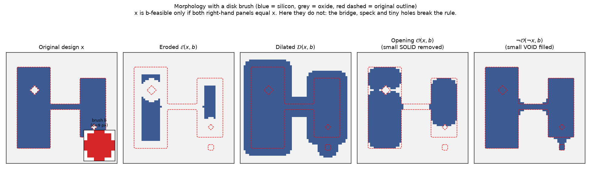

**How to read this figure.** Blue is silicon, light grey is oxide, and the red dashed line is always the outline of the original design. The brush (red inset) is a pixel disk 9 pixels across. Erosion strips a brush-radius layer off every edge, and the 3-pixel bridge and the tiny speck vanish completely. Dilation adds a layer and swallows the tiny holes. The opening (fourth panel) brings the big blocks back but **not** the bridge or the speck. The closing (fifth panel) fills the holes. The original design passes the paper's legality test only if panels four and five both look exactly like panel one — here they do not.

A worked example in 1D. Take a row of pixels `0001111100011000` (1 = solid) and a 3-pixel brush `111`. Erosion keeps a pixel only if it and both neighbours are solid: `0000111000000000`. The 2-pixel feature `11` at the right is gone. Dilation of that brings back `0001111100000000`. So the opening removed the 2-pixel feature, which is "too small for this brush", and kept the 5-pixel one unchanged.

Also notice a subtle point the figure shows: a disk brush cannot reproduce a perfectly sharp 90° corner. The corners of the blocks come back rounded after the opening. So with a circular brush, a design with sharp corners is technically *not* feasible, even if it is wide everywhere. This is why feasible designs in this paper look "blobby".

### Topology optimisation, density methods and the "three-field" scheme

**Topology optimisation** means letting the optimiser decide not only the shape of edges but also *how many* holes and pieces there are (the **topology**). The most common version in photonics is the **density method**:

1. Keep a **latent** (hidden) array $\rho \in [0,1]$ per pixel.
2. Blur it with a **filter** (often a "conic" filter, a cone-shaped weight of radius $r$). Blurring removes very small details. This gives $\tilde\rho$.
3. Push the blurred values towards 0 or 1 with a steep S-shaped **projection** $\bar\rho = \text{proj}_\beta(\tilde\rho)$, often using $\tanh$. A bigger **sharpness** $\beta$ makes it more black-and-white.

Three arrays — latent, filtered, projected — give the name **three-field scheme**. The catch: at small $\beta$ the design is grey (not physical, but easy to optimise); at large $\beta$ it is binary but the gradient becomes almost zero everywhere (the projection becomes a step). So people **schedule** $\beta$: start small, raise it in stages. Performance often drops at each stage. And the filter only *encourages* a minimum length scale — it does not *guarantee* it. Extra penalty terms (e.g. Hammond et al. 2021) are added to get closer to a guarantee.

This paper's whole selling point is that it avoids all of this: no grey designs, no $\beta$ schedule, guaranteed legality at every step.

### Gradients, the adjoint method and backpropagation

To improve a design with gradient descent you need $\partial \mathcal{L}/\partial(\text{every pixel})$ — tens of thousands of numbers. The **adjoint method** gets all of them for the cost of two simulations: one normal ("forward") simulation and one "adjoint" simulation with the source placed at the output. You covered this earlier in the course; here you only need the result: *the simulator can tell you how the loss changes if you change any pixel's permittivity.*

**Backpropagation** is the chain rule applied step by step backwards through a chain of operations (a **computational graph**). If $\mathcal{L}$ depends on $x$, and $x$ depends on $\theta$, and $\theta$ on the latent design $u$, then

$$\frac{\partial \mathcal{L}}{\partial u} = \frac{\partial \mathcal{L}}{\partial x}\,\frac{\partial x}{\partial \theta}\,\frac{\partial \theta}{\partial u}.$$

Every link must have a derivative. If any link is a hard yes/no decision, its derivative is zero (or undefined) and the chain breaks. Libraries like **JAX** and **TensorFlow** do backpropagation automatically (**automatic differentiation**). The paper's simulator, **Ceviche**, is written so that JAX-style autodiff works through it.

### Binary neural networks and the straight-through estimator

Machine-learning people build **binary** or **quantised** neural networks, whose weights are only $\pm 1$ (to save memory and power). They train them by keeping hidden real-valued "latent" weights $t$ and using $\text{sign}(t)$ in the forward pass. But $\frac{d}{dt}\text{sign}(t) = 0$ almost everywhere, so no gradient flows. The fix (Bengio et al. 2013) is the **straight-through estimator (STE)**: in the backward pass, *pretend* the step was some smooth function (the identity, or $\tanh$) and use that function's slope.

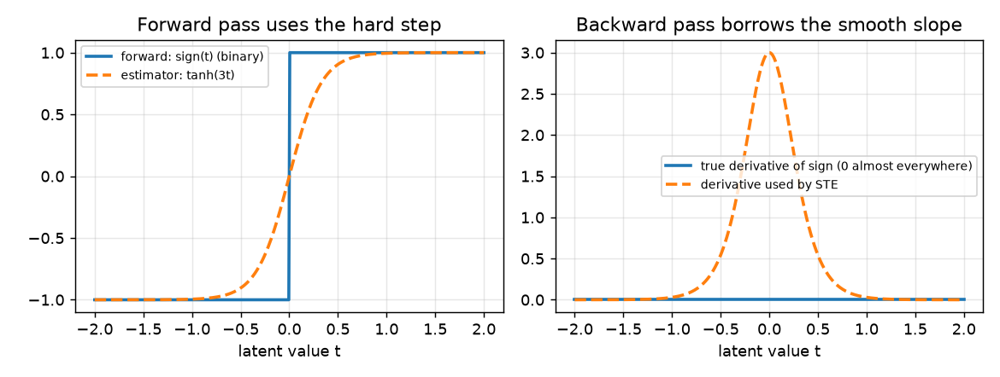

**How to read this figure.** Left: the real forward operation is the hard step $\text{sign}(t)$ (solid). The dashed curve $\tanh(3t)$ is a smooth stand-in with the same overall shape. Right: the true derivative of the step is zero everywhere except at $t=0$, so it carries no information. The STE uses the dashed bell-shaped slope instead. The gradient is "wrong" in a strict sense, but it points in a useful direction, and in practice training works.

This paper's insight is: *a binary photonic design is exactly a binary neural network weight array whose "minimum length scale" is one pixel.* A length-scale constraint just makes the binarisation fancier (the generator instead of `sign`). So the same STE trick should work.

### Scattering parameters and decibels

A device with several **ports** (waveguide entrances/exits) is described by its **scattering matrix** $S$. The element $S_{ij}$ is the complex amplitude coming out of port $i$ when unit amplitude goes into port $j$. The power fraction is $|S_{ij}|^2$. So $|S_{21}|^2$ = transmission from port 1 to port 2, and $|S_{11}|^2$ = reflection back into port 1.

Powers are usually given in **decibels**: $\text{dB} = 10\log_{10}(|S|^2)$. Useful conversions you will need for Table I:

| dB | power fraction | meaning |
|---|---|---|
| −0.5 dB | 0.891 | 89 % through (11 % lost) |
| −3 dB | 0.501 | half |
| −3.5 dB | 0.447 | a bit under half (fine for a 50:50 splitter with some loss) |
| −20 dB | 0.010 | 1 % (a typical "small reflection" target) |

**Insertion loss** is how much power you lose going through ($-10\log_{10}|S_{21}|^2$). **Return loss** is about how little comes back ($|S_{11}|^2$ small). **Crosstalk** is power leaking to a port where it should not go.

### FDFD and Ceviche

**FDFD** (finite-difference frequency-domain) solves Maxwell's equations at one frequency on a grid. It turns the problem into one big sparse linear system $A(\varepsilon)\,E = b$. **Ceviche** is an open-source 2D FDFD solver from Stanford (Hughes, Williamson, Minkov, Fan) built for autodiff. 2D means the device is treated as infinitely tall — a common, cheaper approximation of a real 220 nm slab, but not the real 3D thing.

### O-band

Telecom bands are named ranges of wavelength. The **O-band** ("original") is about 1260–1360 nm. This paper works at 1270 nm and 1290 nm (two 10 nm bands), not at 1550 nm. Silicon's index there is about 3.5, which matches their $\varepsilon_r = 12.25$ ($\sqrt{12.25} = 3.5$); oxide $\varepsilon_r = 2.25$ gives $n = 1.5$.

### Softplus, norms and Adam

- **Softplus**: $\text{softplus}(z) = \ln(1+e^z)$. A smooth version of the "hinge" $\max(0,z)$. For large positive $z$ it is about $z$; for large negative $z$ it is about $e^{z}$, i.e. nearly zero; at $z=0$ it is $\ln 2 \approx 0.69$.
- **2-norm**: $\|v\|_2 = \sqrt{\sum_k v_k^2}$. Its square is just the sum of squares.
- **Adam** (Kingma & Ba): the standard optimiser for training neural networks. It keeps a running average of the gradient (decay rate $\beta_1$) and of the squared gradient (decay rate $\beta_2$), and takes steps of roughly fixed size (the **learning rate**) in the averaged direction. It copes well with **noisy** gradients — exactly what you get with an STE.

### Combinatorial vs gradient optimisation

Choosing which pixels are solid is a **combinatorial** problem: there are $2^{25600}$ possible designs for the bend. You cannot search that directly. Gradient methods move in a continuous space. The paper's trick is to keep a continuous latent design (where gradients live) and map it to a binary legal design (where physics lives).

### Robust optimisation with eroded / nominal / dilated designs (not in this paper — but you need it)

Your project's robustness idea comes from a different line of work (Sigmund 2009; Wang, Jensen & Sigmund 2011; Hammond et al. 2021; Chen et al. 2020). Real etching is never exact: a whole wafer may come out with every edge pushed in by ~10 nm (**over-etch**, thinner silicon, wider gaps) or out by ~10 nm (**under-etch**). The **robust objective** simulates three versions of the design every iteration:

- the **eroded** design (silicon shrunk by $\delta w$ — over-etch),
- the **nominal** design (as drawn),
- the **dilated** design (silicon grown by $\delta w$ — under-etch),

and optimises a combination, either a weighted average such as Chen 2020's

$$F_{\text{robust}} = 0.5\,F(\text{nominal}) + 0.25\,F(\text{eroded}) + 0.25\,F(\text{dilated}),$$

or the **worst case** $\min\{F_e, F_n, F_d\}$. In density methods (Meep, Tidy3D) the three versions are made by thresholding the *same* blurred density at three levels, e.g. $\eta = 0.75$ (eroded), $0.5$ (nominal), $0.25$ (dilated).

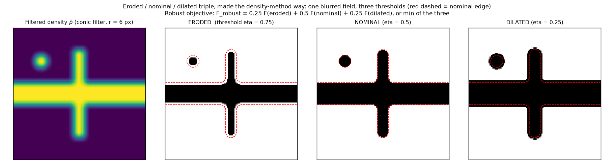

**How to read this figure.** The first panel is a blurred ("filtered") density of a cross-shaped waveguide plus a small disk. The next three panels threshold it at 0.75, 0.5 and 0.25. A higher threshold keeps only the most "certain" silicon, so the eroded version is thinner everywhere — including at the ends of the arm and around the little disk — and the dilated version is fatter. The red dashed line is the nominal edge in each panel, so you can see the shift. The robust objective asks the device to work for all three.

!!! warning "Keep two ideas apart"
    **Feasibility** (this paper): the drawn design obeys the width/spacing rules. **Robustness** (your project): the design still works when the fab shifts every edge by $\pm\delta w$. A design can be perfectly feasible and terribly non-robust. Schubert 2022 delivers the first and says nothing about the second.

---

## Abstract

The authors present a new inverse-design method that **guarantees** the final design meets strict length-scale rules — including the minimum width and minimum spacing rules of commercial foundries. They borrow two ideas from machine learning to turn a hard constrained problem into an **unconstrained stochastic gradient** problem:

1. a **conditional generator** that only ever outputs feasible (rule-obeying) designs, and
2. a **straight-through estimator** that lets gradients flow back through that generator to a hidden "latent" design.

They show it works on four standard silicon-photonics parts: a waveguide bend, a beam splitter, a mode converter, and a wavelength demultiplexer.

"Stochastic" here means the gradient is noisy (because of the STE and because the design jumps discretely), not that there is randomness in the physics.

## I. Introduction

**What it says.** Integrated photonics is used in communications, quantum computing and machine-learning hardware. Everyone wants better parts: lower loss, wider bandwidth, smaller. Human intuition struggles to meet all targets at once; inverse design explores huge design spaces automatically. Adjoint methods make gradient-based design cheap: each step costs about two full simulations, however many pixels there are. Combined with autodiff frameworks (JAX, TensorFlow), you can build "end-to-end" optimisers.

**The open problem.** Getting a design that both performs well and passes the foundry's design rules is still hard. Lithography sets a minimum printable size. A sub-resolution feature might print inconsistently, vanish, or hurt yield across the wafer. So foundries specify minimum width and spacing rules, checked by DRC.

**Previous approaches, sorted into two families:**

- **Restricted parameterisations.** Build the design out of shapes that are legal by construction (e.g. place circles of a legal size — Wang et al. 2020), or move the vertices of polygons with analytic constraints (Michaels & Yablonovitch 2018). Drawback: the optimiser cannot change the topology freely. A polygon cannot suddenly grow a new hole.
- **Topology optimisation with density / three-field parameterisations.** Each pixel can change; any topology is reachable (Hammond 2021, Jensen & Sigmund 2011, Zhou et al. 2015, …). Optimisers such as **L-BFGS** (a quasi-Newton method that builds a cheap estimate of curvature) or **MMA** (method of moving asymptotes, Svanberg 1987, good for constraints) are used. Drawback: a trade-off between **feasibility** (binary pixels, legal sizes) and **performance**.

**Why the trade-off exists.** A continuous optimiser walks through **infeasible** (grey, too-small-features) regions of design space before it reaches feasible ones. It may find a great infeasible design and then lose much of its performance when forced to become feasible. The common recipe — continuous first, then ramp up binarisation and switch on constraints — needs careful tuning. Ramp too fast and the optimiser stalls. The schedule and penalties are "an art" and depend on the device.

**The proposal.** An **always-feasible** framework with strict DRC guarantees, made of a conditional generator plus an STE. Together they act like one differentiable block in a computational graph, just like the filter-and-projection block in density methods. Tested on bend, splitter, mode converter and demultiplexer.

## II. Methodology

### A. Brush-based minimum length scale constraints

**What it says in plain words.** First the authors need a precise, checkable definition of "this pixel design obeys a minimum width and spacing". They use brushes.

Any binary array can be painted with a one-pixel brush (just set each pixel). With a bigger brush, some arrays become impossible. Example: with a $3\times3$ solid brush you can never make a single isolated solid pixel, because the brush always paints its neighbours too. The pixel on which the brush is centred when it is used is called a **touch**, written $t$.

**Feasibility.** A design $x$ is **$b$-feasible** if every solid feature and every void feature could have been painted with brush $b$. The test is

$$\mathcal{O}(x,b) = \neg\mathcal{O}(\neg x,b) = x. \tag{1}$$

Read this as two checks:

- $\mathcal{O}(x,b) = x$: opening the solid changes nothing, so there is **no solid feature too small for the brush**.
- $\neg\mathcal{O}(\neg x,b) = x$: flipping, opening and flipping back changes nothing, so there is **no void feature (gap, hole) too small for the brush**.

**Why opening is the right test — step by step.**

1. If $x$ was painted by solid touches $t^s$ with brush $b$, then $x = \mathcal{D}(t^s,b)$ (painting is dilation).
2. Eroding $x$ asks "where can I centre the brush and stay inside the solid?". For a painted design that set includes all the original touches: $\mathcal{E}(x,b) \supseteq t^s$.
3. Dilating that set paints at least everything the original touches painted, and never anything outside $x$ (because every centre that survived erosion has its whole brush inside $x$). So $\mathcal{D}(\mathcal{E}(x,b),b) = x$.
4. Conversely, if some solid pixel is in a feature too small for the brush, no brush position covering it fits inside the solid, so erosion removes it and dilation cannot bring it back. Then $\mathcal{O}(x,b) \ne x$.

So "$\mathcal{O}(x,b)=x$" is exactly "every solid pixel can be covered by a brush that fits inside the solid". Same argument for void.

**Length scale.** In topology optimisation, "length scale" usually means the diameter of the smallest circle that fits in every feature. So: if $x$ is feasible for an (approximately) circular brush $b_L$ of diameter $L$ pixels, the design has a minimum length scale of at least $L\cdot d$ ($d$ = pixel pitch). The design's minimum length scale is the largest $L$ for which Eq. (1) holds.

*Worked example:* pixel pitch $d = 10$ nm, circular brush diameter $L=10$ pixels → minimum length scale 100 nm. This is the "100 nm circular brush" used throughout the results.

When the binary design is turned into polygon outlines by **dual contouring** (here: simply tracing the pixel edges, "Manhattan" outlines), the minimum width and spacing are equal to the minimum width of the brush itself. (Other contouring methods, like **marching squares**, give smoother outlines; the paper mentions both.)

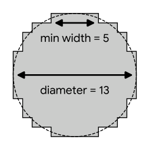

**How to read this figure.** This is a pixelated disk 13 pixels across (the dashed circle is the ideal disk). The arrow at the top marks the flat edge, only 5 pixels long: the brush is "13 wide" overall but its narrowest straight run is 5 pixels. In the paper, panel (b) shows the notched square brush of width 13 with minimum width 11; that panel was not captured in this image, so see the generated brush figure below instead.

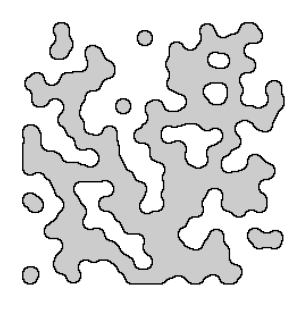

**How to read this figure.** Grey is solid, white is void. Every grey island, every white hole and every white channel is at least one brush wide, and every corner is rounded with the brush radius. This is what "feasible for a circular brush" looks like. The paper's panel (b), not captured here, shows the same idea for the notched square brush: the shapes there are rectilinear (right angles), with the corner pixel chopped off.

**From foundry rules to a brush: the notched square.** A foundry rule is "minimum width and spacing $w$". Many brushes guarantee it; the **smallest** is the **notched square**: an $L\times L$ square with its four corner pixels removed. The paper's rule:

$$L = \frac{w}{d} + 2.$$

Designs feasible with this brush satisfy width and spacing $w$. *Why the "+2"?* The notched square's straight edges are only $L-2$ pixels long (the corners are cut off). The paper treats that $L-2$ as the brush's "minimum width" (Fig. 1 labels "min width = 11" for a width-13 notched square) and requires $L-2 \ge w/d$. They call this construction **conservative** — it uses a brush bigger than the rule strictly needs — and list a "non-conservative" generator as future work.

*Worked example:* foundry rule $w = 80$ nm, pixels $d = 10$ nm → $L = 80/10 + 2 = 10$ pixels, i.e. a "100 nm notched square brush". That is exactly why Section III.C says the 100 nm notched-square designs "strictly satisfy an 80 nm minimum width and spacing constraint". For the four brush sizes of Section III.D (60, 80, 100, 130 nm), the guaranteed width/spacing is 40, 60, 80, 110 nm.

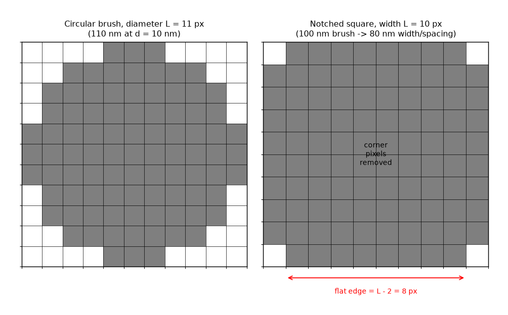

**How to read this figure.** Each square is one 10 nm pixel. Left: a pixelated disk — round overall, but its flat top run is only 3 pixels. Right: a 10-pixel notched square — a full square with only the four corner pixels removed; its flat edges are $L-2 = 8$ pixels = 80 nm. Painting only with the right-hand stamp yields rectilinear designs whose every feature and gap passes an 80 nm width/spacing DRC.

**Validation.** The authors did not rely on the argument alone: they checked such designs with **KLayout** and **Siemens Calibre** DRC and found them compliant.

**Try it: Eq. (1) as a Python DRC check.** Pure numpy (no scipy needed). Every design your own pipeline produces can be run through `is_feasible` as a cheap sanity check.

```python
import numpy as np

def shifts(x, b, fill):
    """Copies of x shifted by every offset inside brush b."""
    r = b.shape[0] // 2
    p = np.pad(x, r, constant_values=fill)
    return [p[i:i + x.shape[0], j:j + x.shape[1]] for i, j in zip(*np.nonzero(b))]

def dilate(x, b):  return np.any(shifts(x, b, False), axis=0)  # solid grows
def erode(x, b):   return np.all(shifts(x, b, True), axis=0)   # solid shrinks
def opening(x, b): return dilate(erode(x, b), b)

def is_feasible(x, b):
    """Eq. (1): O(x,b) == x  and  not O(not x,b) == x."""
    return (np.array_equal(opening(x, b), x)
            and np.array_equal(~opening(~x, b), x))

r = 2                                   # disk brush, diameter 5 px = 50 nm at 10 nm pixels
yy, xx = np.mgrid[-r:r + 1, -r:r + 1]
b = xx**2 + yy**2 <= r * (r + 0.5)

rect = np.zeros((40, 40), bool); rect[5:35, 5:14] = True
print("sharp rectangle feasible?", is_feasible(rect, b))       # False: corners

t = np.zeros((40, 40), bool)            # brush touches (centres)
t[8:32, 8:11] = True; t[8:32, 26:29] = True
x = dilate(t, b)                        # Eq. (2): design = dilated touches
print("two painted bars feasible?", is_feasible(x, b))         # True
x[19:21, 13:25] = True                  # add a 2-px-wide bridge
print("with thin bridge feasible?", is_feasible(x, b))         # False
print("after opening feasible?", is_feasible(opening(x, b), b))  # True
```

**What you should see:** `False, True, False, True`. A sharp rectangle fails (the disk cannot make square corners), bars *painted* with the brush pass (Eq. 2 guarantees it), a 2-pixel bridge fails, and opening deletes the bridge so the design passes again. (Here booleans `True/False` stand for the paper's $+1/-1$.)

### B. Generator for feasible designs

**The problem.** We now know how to *check* feasibility. But we need to *search* over feasible designs. Strictly that is a combinatorial problem. The authors solve it approximately: they turn it into an unconstrained stochastic gradient problem, using (i) a **conditional generator** that always outputs feasible designs and (ii) an STE for gradients.

**Painting view of a design.** Any $b$-feasible design can be written as the dilation of its solid touches, and equally as the complement of the dilation of its void touches:

$$x = \mathcal{D}(t^s_b, b) = \neg\mathcal{D}(t^v_b, b). \tag{2}$$

Here $t^s_b$ is a binary array marking where solid brush stamps were placed, and $t^v_b$ marks void stamps. Solid stamps paint solid; void stamps paint void; together they must cover every pixel exactly once in colour (overlaps of the same colour are fine; a pixel can never be painted both colours).

**The generator builds the design step by step.** Start with no touches. At each step add one (or several) touches. To decide which touches are allowed, it keeps track of a set of **states** for pixels and touches. The paper writes them for the solid case; the void case is the mirror image (swap $s \leftrightarrow v$).

**Existing solid pixels** — already painted solid by some solid touch:

$$p^s_{\text{existing}} = \mathcal{D}(t^s_b, b). \tag{3}$$

**Impossible solid touches** — a solid stamp centred here would paint over a pixel that is already void. These are all centres within one brush of an existing void pixel, i.e. the dilation of the existing void pixels:

$$t^s_{\text{impossible}} = \mathcal{D}(p^v_{\text{existing}}, b). \tag{4}$$

(For a symmetric brush, "the brush centred at $c$ covers pixel $q$" is the same as "the brush centred at $q$ covers $c$". That is why dilating the void pixels gives exactly the forbidden centres.)

**Valid solid touches** — not impossible, and not already used:

$$t^s_{\text{valid}} = \neg t^s_{\text{impossible}} \wedge \neg t^s_b. \tag{5}$$

$\wedge$ is element-wise AND, $\vee$ is element-wise OR.

**Possible solid pixels** — pixels that are solid now or *could* still become solid in a feasible completion, i.e. painted by an existing or a valid touch:

$$p^s_{\text{possible}} = \mathcal{D}(t^s_b \vee t^s_{\text{valid}}, b). \tag{6}$$

**Required solid pixels** — not solid yet, but they can no longer become void (not possible for void). So they *must* end up solid:

$$p^s_{\text{required}} = \neg p^s_{\text{existing}} \wedge \neg p^v_{\text{possible}}. \tag{7}$$

**Resolving solid touches** — valid touches whose stamp would cover a required-solid pixel (so they "resolve" an obligation):

$$t^s_{\text{resolving}} = \mathcal{D}(p^s_{\text{required}}, b) \wedge t^s_{\text{valid}}. \tag{8}$$

**Free solid touches** — valid touches that only paint pixels which are *already decided* for solid, or at least can no longer be void. Placing them costs nothing and removes no options:

$$t^s_{\text{free}} = \neg\mathcal{D}(p^v_{\text{possible}} \vee p^v_{\text{existing}}, b) \wedge t^s_{\text{valid}}. \tag{9}$$

Read Eq. (9) as: "take every centre whose stamp would touch any pixel that is or could be void; free touches are the valid ones *not* in that set".

Notice everything is built from three ingredients: dilation, NOT, AND/OR. That makes it cheap and easy to implement on arrays.

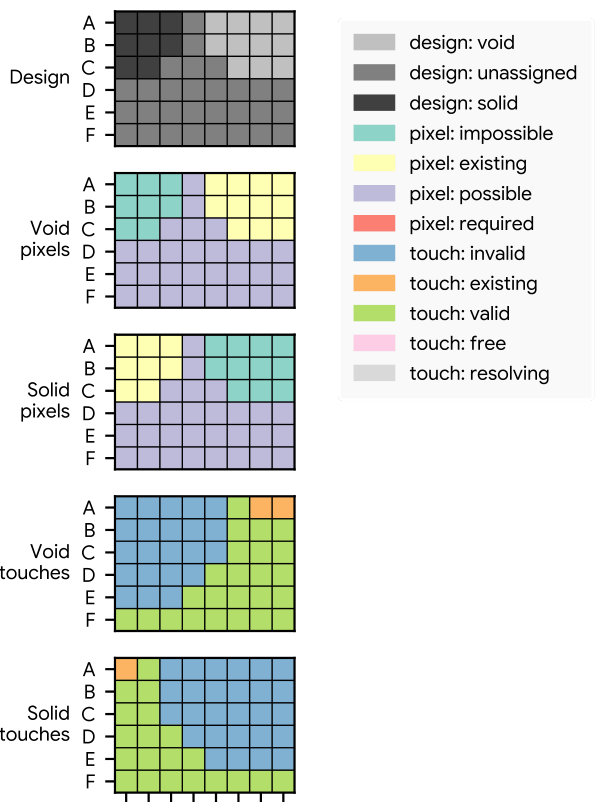

**How to read this figure.** It is a 6×8 design (rows A–F, columns 0–7) at one moment of generation. Top: the design so far — dark = solid, light = void, mid-grey = not yet decided. The next two grids show pixel states for void and for solid (yellow = existing, purple = possible, teal = impossible). The bottom two show touch states (orange = already placed, green = valid, blue = invalid). Look at how one solid stamp in the top-left corner and one void stamp in the top-right make a whole band of touches invalid for the opposite colour: you cannot put a solid stamp where it would overlap the void.

**Algorithm 1 — the generator.**

```text
procedure GENERATOR(b)
    start with empty solid touches t_s and void touches t_v
    while some pixel is not yet existing-solid or existing-void:
        update all pixel and touch states (Eqs. 3-9, both colours)
        if any free touches exist:      place ALL free touches
        elif any resolving touches:     place ONE resolving touch
        else:                           place ONE valid touch
```

The order matters. Free touches never hurt, so take them all. Resolving touches fix obligations before they become contradictions. Only when nothing is pending do you make a genuinely new choice.

**Cost.** Each step sets at least one new pixel, so for $N$ pixels there are at most $N$ steps. A naive step does full-array dilations ($O(N)$ work), giving $O(N^2)$ overall. But a touch only changes states within a few brush widths of itself, so you can update only a window around it — constant cost per step — giving $O(N)$ total.

*Worked numbers:* the demultiplexer region is 6.4 µm × 6.4 µm = 640 × 640 = 409,600 pixels. $N^2 \approx 1.7\times10^{11}$ (hopeless to do every optimisation step); $N \approx 4\times10^5$ (fine).

**From random to conditional.** If touches are chosen at random, you get a random feasible design (that is how Fig. 2 was made). To make the generator *useful*, choose touches **greedily** using a **pixel reward array** $\theta$ (same shape as the design, real values). The reward of a solid touch is the sum of $\theta$ over the pixels its stamp would set solid; the reward of a void touch is *minus* the sum over the pixels it would set void. Positive $\theta$ means "I'd like this pixel solid", negative means "I'd like it void". At each "choose one" step, pick the highest-reward touch. Now the generator is **conditional**: its output depends on $\theta$, and $\theta$ comes from the optimiser. (Fig. S7 below shows a reward calculation.)

**Why it never produces an illegal design.** The intuition from the paper: whenever a choice would start to constrain the other colour, the algorithm keeps placing only free and resolving touches of one colour until every remaining pixel is again "possible for both solid and void". In that state, no touch can create a contradiction. The starting state (empty) is such a state. So the process never reaches an invalid state, and the end result satisfies Eq. (2) with brush $b$ for both colours — hence Eq. (1).

**Why nothing is lost.** Every feasible design can be produced: if you feed in $\theta = x$ for any feasible $x$, the greedy choices simply reproduce $x$. So the generator can reach the **entire** feasible set; it does not restrict the design space beyond the rules themselves.

### C. Straight-through estimator

Algorithm 1 is full of discrete choices, so it has no useful derivative. As explained in the background, binary/quantised networks face the same issue with $\text{sign}$, and they use an STE: replace the derivative of the hard function $f$ by the derivative of a smooth stand-in,

$$\frac{\partial f}{\partial x} \approx \frac{\partial}{\partial x} f_{\text{estimator}}. \tag{10}$$

For plain binarisation the usual estimator is just the identity (gradient passes "straight through" unchanged — hence the name). The authors' observation: *binary optimisation is topology optimisation with a one-pixel length scale*, so a length-scale-aware binariser (the generator) should accept an STE too. The question is which estimator; that is Section D.

### D. Computational graph

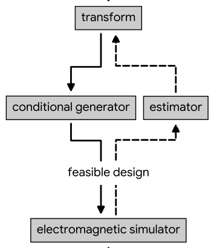

**How to read this figure.** Solid arrows go downward: the forward computation. Dashed arrows go upward: gradients. Follow the solid path: transform → conditional generator → feasible design → electromagnetic simulator (and, beyond the crop, scattering matrix → objective → scalar loss). On the way back, the gradient reaches the feasible design normally (via the adjoint/autodiff simulator), but then it **bypasses** the generator and goes through the "estimator" box instead, back up to the transform. That detour is the STE.

**The full chain in words.**

1. A **latent design** $u$ (real-valued array) is the thing Adam actually updates.
2. A **transform** turns it into the reward array $\theta$.
3. The **conditional generator** turns $\theta$ into a feasible binary design $x$.
4. The **simulator** (Ceviche FDFD) computes the scattering matrix $S$.
5. The **objective** turns $S$ into one number, the loss $\mathcal{L}$.

Optionally the transform output is **symmetrised** (e.g. averaged with its mirror image) so the generator favours symmetric designs.

**The transform** (and the estimator) is

$$D(t, b, \beta) = \tanh\big(\beta\,(t \circledast b)\big), \tag{11}$$

where $t \circledast b$ is the **convolution** of the latent array with the brush (each pixel gets the sum of latent values under a brush centred there) and $\beta$ is a sharpness hyperparameter in the range 2–8. (The paper reuses $t$ and $\beta$ here as generic symbols; this $t$ is the latent design, not "touch", and this $\beta$ is not Adam's $\beta_1,\beta_2$.) Why this form:

- **Convolution with the brush** smooths $\theta$ and gives it the brush's length scale, so the rewards already "look like" the brush.
- **tanh** squashes values into $(-1,1)$ — the same range as the $\pm1$ design.
- So $\theta$ is smooth, bounded and length-scaled.

**The estimator** used in the backward pass has **the same form** as Eq. (11). Its output is in $(-1,1)$, smooth, with the brush's length scale — just like the generator's output. In other words, the estimator is a smooth *imitation* of the generator. This matches findings in binary networks that estimators resembling the forward function work better than the bare identity.

So, concretely, in the backward pass $\partial x/\partial\theta$ is replaced by $\partial D(\theta,b,\beta)/\partial\theta$. By the chain rule, with $D=\tanh(\beta\,c)$ and $c = \theta\circledast b$:

$$\frac{\partial D}{\partial c} = \beta\,\big(1-\tanh^2(\beta c)\big),\qquad \frac{\partial c_i}{\partial \theta_j} = b(i-j),$$

so the gradient arriving at the design is multiplied by a bell-shaped factor and smeared out by the brush (a convolution with the flipped brush, which for a symmetric brush is the same brush).

**Optimiser settings.** The latent design is randomly initialised *with a bias* so that the very first generated design is **fully solid**. Adam with learning rate 0.01, $\beta_1 = 0.667$, $\beta_2 = 0.9$. (Note: these are lower than Adam's usual defaults 0.9 / 0.999, i.e. shorter memory — sensible when the loss is noisy and jumpy.)

**What you get for free.** No hyperparameter schedule, no change of parameterisation mid-run, and a feasible design at **every** step. You can stop any time.

### E. Objective function

**What it says.** Engineers specify parts with limits: insertion loss at most X, return loss at least Y, crosstalk below Z. So the authors set a **cutoff** $|S_{\text{cutoff}}|$ for every scattering element and build a loss that is large when a cutoff is violated and small otherwise:

$$\mathcal{L}(S) = \left( \left\| \text{softplus}\!\left( g\,\frac{|S|^2 - |S_{\text{cutoff}}|^2}{\min(w_{\text{valid}})} \right) \right\|_2 \right)^2. \tag{12}$$

**Each symbol.**

- $S$: all relevant scattering elements (at all wavelengths considered), stacked into one vector.
- $|S|^2$: their power values.
- $|S_{\text{cutoff}}|^2$: the cutoff power for each element (from Table I).
- $g$: a vector of signs. $g=+1$ where the cutoff is a **maximum** (e.g. reflection must be *below* −20 dB) and $g=-1$ where it is a **minimum** (transmission must be *above* −0.5 dB).
- $w_{\text{valid}}$: for each element, the width of the allowed window between the cutoff and the physical limit. Example from the paper: a transmission cutoff of 0.5 can go up to 1.0, so $w_{\text{valid}} = 0.5$. (The paper's wording mixes "amplitude" and "power" in this example; read all of Eq. 12 in power units, which is what the numerator uses.)
- $\min(w_{\text{valid}})$: the **smallest** window over all elements — one common scale. It is the only non-element-wise operation.
- softplus, then 2-norm, then square: sum of squared softplus values.

**Why this form — step by step.**

1. $|S|^2 - |S_{\text{cutoff}}|^2$ measures how far each element is from its cutoff.
2. Multiplying by $g$ flips the sign for "minimum" specs, so that **positive always means "violating"**, negative means "inside spec".
3. Dividing by $\min(w_{\text{valid}})$ makes the numbers dimensionless and comparable: an error that is big *relative to the tightest window* counts as big.
4. Softplus turns "violation amount" into a smooth penalty: about linear when violating, close to zero (but never exactly zero) when well inside spec. So the optimiser keeps getting a small push to improve further, and the function is differentiable everywhere (unlike $\max(0,z)$).
5. Squaring and summing makes big violations dominate and gives a smooth scalar.

**Worked example (waveguide bend spec).** $|S_{11}|^2 \le -20$ dB → cutoff 0.010, maximum, $g=+1$, window $0.010 - 0 = 0.010$. $|S_{21}|^2 \ge -0.5$ dB → cutoff 0.891, minimum, $g=-1$, window $1 - 0.891 = 0.109$. So $\min(w_{\text{valid}}) = 0.010$. A device with 5 % reflection and 70 % transmission gives $z_{11} = (0.05-0.01)/0.01 = 4$ and $z_{21} = -(0.70-0.891)/0.01 = 19.1$: large violations, large loss.

```python
import numpy as np

def softplus(z): return np.log1p(np.exp(z))

# Waveguide bend spec (Table I): |S11|^2 <= -20 dB, |S21|^2 >= -0.5 dB
cut = np.array([10**(-20/10), 10**(-0.5/10)])   # cutoffs in POWER: 0.010, 0.891
g   = np.array([+1, -1])                        # +1: cutoff is a max, -1: a min
bound = np.array([0.0, 1.0])                    # physical limits (power)
w_valid = np.abs(cut - bound)                   # 0.010 and 0.109

def loss(S2):                                   # S2 = |S11|^2, |S21|^2
    z = g * (S2 - cut) / w_valid.min()          # one common scale: the smallest window
    return np.sum(softplus(z)**2)               # squared 2-norm

for name, S2 in [("bad", [0.05, 0.70]), ("near spec", [0.012, 0.88]),
                 ("meets spec", [0.005, 0.93]), ("far beyond", [0.0001, 0.99])]:
    print(f"{name:11s} loss = {loss(np.array(S2)):8.3f}")
```

**What you should see:** `bad` ≈ 382, `near spec` ≈ 2.6, `meets spec` ≈ 0.23, `far beyond` ≈ 0.10. The loss falls steeply as you approach the spec and keeps creeping down beyond it. Note that "meets spec" does **not** mean loss = 0; whether the spec is met is checked separately against Table I. (In the paper, $S$ contains 3 wavelengths per band × 2 bands × all relevant ports, so the real sum has many more terms.)

## III. Results

### A. Nanophotonic optimisation problems

**Set-up.** Four O-band components, each optimised over two 10 nm bands centred at **1270 nm** and **1290 nm**. 2D FDFD in Ceviche. Solid = silicon ($\varepsilon_r = 12.25$, $n=3.5$), void = silicon oxide ($\varepsilon_r = 2.25$, $n=1.5$). All access waveguides 400 nm wide, fundamental mode unless stated. These four problems are released as the open-source **ceviche-challenges** benchmark.

| Device | Design region | Ports | Goal | Symmetry imposed |
|---|---|---|---|---|
| Waveguide bend | 1.6 × 1.6 µm² (160 × 160 px) | 1 left, 2 bottom | port 1 → port 2, low reflection | diagonal mirror (so port 2 → 1 behaves the same) |
| Mode converter | 1.6 × 1.6 µm² | 1 left, 2 right | fundamental mode in → **second-order** mode out, low reflection | none stated |
| Beam splitter | 3.2 × 2.0 µm² | 1, 4 left; 2, 3 right | port 1 → half to 2, half to 3; little to 1 or 4 | mirror about both axes |
| Wavelength demultiplexer | 6.4 × 6.4 µm² (640 × 640 px) | 1 left; 2, 3 right | 1270 nm band → port 2, 1290 nm band → port 3 | none |

**Wavelengths in the loss.** Three per band: centre and both edges, i.e. 1265, 1270, 1275 and 1285, 1290, 1295 nm. A spec is "met" only if it holds at **all six** wavelengths.

**Resolution.** Design pixels = simulation pixels = 10 nm. So a circular brush of diameter 10 = 100 nm length scale.

**Table I — specifications (power, dB).**

| | Bend | Mode converter | Beam splitter | Demultiplexer |
|---|---|---|---|---|
| $S_{11}$ at 1270 / 1290 nm | ≤ −20 / ≤ −20 | ≤ −20 / ≤ −20 | ≤ −20 / ≤ −20 | ≤ −20 / ≤ −20 |
| $S_{21}$ at 1270 / 1290 nm | ≥ −0.5 / ≥ −0.5 | ≥ −0.5 / ≥ −0.5 | ≥ −3.5 / ≥ −3.5 | ≥ −3 / < −20 |
| $S_{31}$ at 1270 / 1290 nm | – | – | ≥ −3.5 / ≥ −3.5 | ≤ −20 / ≥ −3 |
| $S_{41}$ at 1270 / 1290 nm | – | – | ≤ −20 / ≤ −20 | – |

**How to read it in plain numbers.** For the bend: at least 89 % of the light must go round the corner and at most 1 % may bounce back, at every one of the six wavelengths. For the splitter: each output at least 44.7 % (so up to ~10 % total loss allowed), reflection and the fourth port each ≤ 1 %. For the demultiplexer: the right band to the right port at ≥ 50 %, the wrong band ≤ 1 % (−20 dB crosstalk). For the mode converter, $S_{21}$ means power in the *second-order* mode at port 2.

### B. Designs using 100 nm circular brush

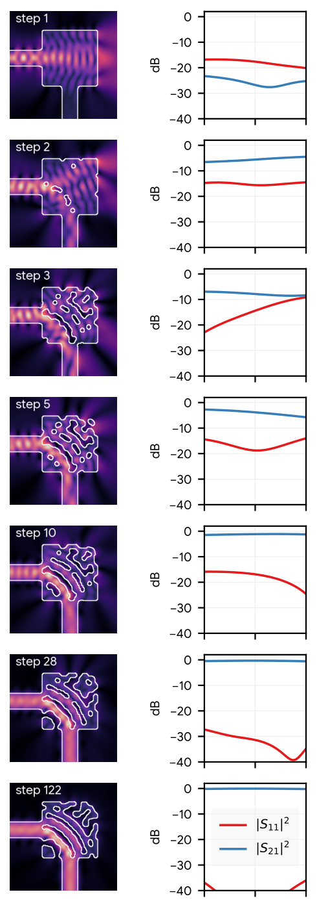

**How to read this figure.** Each row is one optimisation step (1, 2, 3, 5, 10, 28, 122). Left: the field magnitude at 1280 nm (bright = strong light) with the design outline in white. Right: the spectrum, in dB, of reflection $|S_{11}|^2$ (red) and transmission $|S_{21}|^2$ (blue) across the band. At step 1 the region is solid silicon: light bounces around, transmission is about −25 dB (almost nothing gets through). By step 10 transmission is near 0 dB; by step 28 reflection is below −20 dB everywhere — the spec is met. By step 122 reflection is near −40 dB. **Every** row is a binary, 100 nm-feasible design.

**What the text adds.**

- Start: all silicon, no enclosed oxide. Poor: low transmission, strong reflection.
- Early steps: big topology changes — oxide holes appear, isolated silicon islands form.
- **Spec reached at step 28.** It keeps improving; lowest loss in the first 160 steps at **step 122**.
- Topology changes even late: between steps 28 and 122 two void features merge and a third disappears. Density methods usually "freeze" topology late (once $\beta$ is large), so this is a real difference.

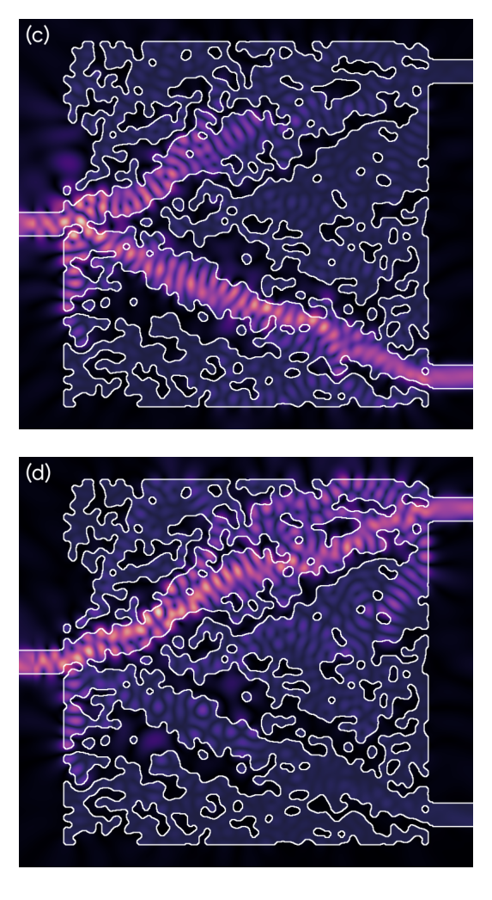

**How to read this figure.** The large square is the 6.4 µm demultiplexer, input on the left, two outputs on the right. Panel (c): light at 1270 nm forms a bright beam that bends down to the lower-right output (port 2). Panel (d): at 1290 nm the beam goes to the upper-right output (port 3). The white outlines are the silicon boundaries — note the many small rounded holes and islands, all at least 100 nm. Panels (a) mode converter and (b) beam splitter are in the paper but were not captured in this image; the 80 nm-rule versions of all four are in Fig. S5 below.

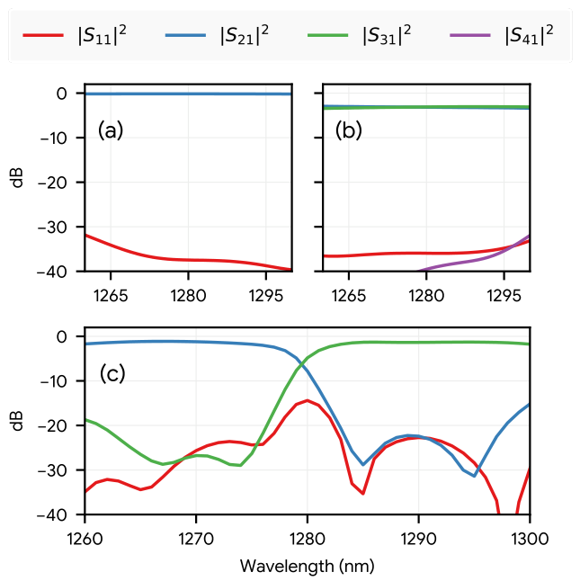

**How to read this figure.** Vertical axis: power in dB (0 dB = all the light). (a) Mode converter: conversion (blue, $|S_{21}|^2$) sits at about 0 dB, reflection (red) between −32 and −40 dB. (b) Beam splitter: two outputs (blue and green) both near −3 dB (a 50:50 split), reflection and port 4 below −30 dB. (c) Demultiplexer: blue (port 2) high at short wavelengths and green (port 3) high at long ones, crossing near 1280 nm. Inside the two design bands (1265–1275 and 1285–1295 nm) the wrong port is ~−20 dB or lower. All three meet Table I.

**Achieved performance for one device, with units (for your EXIT note).** Waveguide bend, 100 nm circular brush, lowest-loss design in 160 steps (step 122, Fig. 5): $|S_{21}|^2 \approx 0$ dB (essentially lossless, better than the −0.5 dB spec, i.e. > 89 %) and $|S_{11}|^2$ around −35 to −40 dB (spec: ≤ −20 dB) across 1260–1300 nm, in a 1.6 × 1.6 µm² footprint, in **2D FDFD**. Read exact values off the plot yourself if you need more digits; the paper gives them only graphically.

**Fig. 8 — normalised loss vs step (100 nm circular brush).** *The extracted image file for Fig. 8 is a duplicate of Fig. 7, so it is not shown here.* From the caption and text: it plots loss (log scale, normalised) against optimisation step (0–150) for all four devices, with markers on steps where Table I is met. The curves go down overall, but they are **noisy** and sometimes jump back up. That is expected: the design changes in discrete jumps (a hole appears, two holes merge), and the physics responds discontinuously.

**Difficulty.** Bend and mode converter: fewer than 40 steps to meet spec. Beam splitter and demultiplexer: about 100 steps to first meet spec — still within the usual range for inverse design. Difficulty grows with tighter specs, bigger brushes, smaller design regions, and awkward port placement. Smaller length scales or bigger regions make the solution space larger and usually speed things up.

### C. Designs using 100 nm notched square brush

Now the brush is a notched square of width 100 nm (10 pixels). With 10 nm pixels these designs **strictly satisfy an 80 nm minimum width and spacing** rule ($L = w/d+2 \Rightarrow w = (10-2)\times 10 = 80$ nm).

**Fig. 9 — normalised loss vs step (100 nm notched square).** *As with Fig. 8, the extracted image is a duplicate of Fig. 7 and is not shown.* From the text: all four devices reach the Table I target, but compared with the circular brush the trajectories are **noisier**, have **fewer** steps that meet spec, and reach spec **later**.

**Why.** The notched square has a larger area than a circle of the same width, so it rules out more designs; the optimiser has less room. The authors also suspect the Adam settings are problem-dependent and suggest a **decaying learning rate** (shown to help quantised networks) as future work.

### D. Reliability and effect of length scale

**The experiment.** For each of 4 devices × 2 brush shapes × 4 brush sizes (60, 80, 100, 130 nm) = **32 configurations**, run **20 independent optimisations** with different random initialisations, **500 steps** each. That is $20 \times 500 = 10{,}000$ feasible designs per configuration, 320,000 designs in total (each needing simulations at six wavelengths).

**The metric.** For run $r$ and step $i$, call the run *successful at step $i$* if Table I was met at **any** step $j \le i$. Then the **successful fraction** at step $i$ is the share of the 20 runs that are successful at step $i$. This is a "best-so-far" curve: it can only go up. Mathematically it is the empirical **cumulative distribution function (CDF)** of the "first step at which the spec was met".

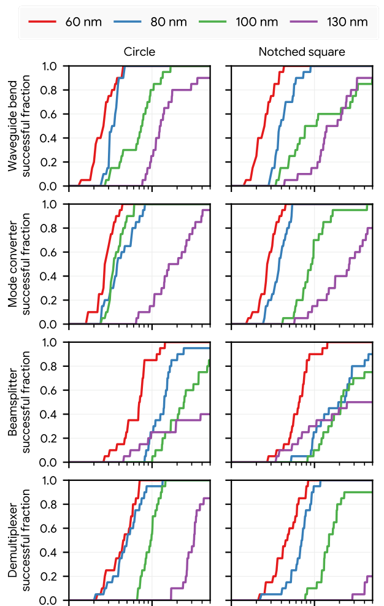

**How to read this figure.** Rows: bend, mode converter, beam splitter, demultiplexer. Columns: circular brush (left), notched square (right). Horizontal axis: optimisation step on a **log** scale (about 10 to 500). Vertical axis: fraction of the 20 runs that have met spec so far. Colours: brush size 60 (red), 80 (blue), 100 (green), 130 nm (purple). A curve that rises early and steeply to 1.0 means "almost every run succeeds, quickly". A curve that stays below 1.0 at the right edge means some runs never met spec in 500 steps.

**What the text concludes, brush size by brush size.**

- **60 nm:** all devices, both brushes, consistently reach spec, mostly within a few tens of steps. The spread between the 20 runs is at most tens of steps, so in practice one run might be enough. The circular brush reaches spec slightly earlier than the notched square (the notched square is the harder problem) — this holds at all sizes.
- **80 nm:** still consistent, generally more steps. For some problems (demultiplexer, circular) the curves are almost the same as 60 nm, suggesting that below some size, a smaller brush no longer helps. A few outlier runs fail.
- **100 nm:** same pattern, more steps, more outliers that fail within 500 steps.
- **130 nm:** bend and mode converter still consistently succeed. Beam splitter and demultiplexer: about **half or fewer** of the runs succeed. Advice: launch several runs, or use a larger design region.

**General trend and a puzzle.** Larger brushes are harder — as expected, since the feasible set for a big brush is a strict subset of that for a small brush. But some 130 nm beam-splitter runs reached spec *before* the best 80 nm and 100 nm runs. The authors flag this as needing more study. (One plausible reading: with a bigger brush the design space is smaller and some random starts land near a good region quickly; it is a hint that "reliability" has a seed-dependent component.)

## IV. Conclusion

**What they claim.**

1. A method that guarantees length-scale constraints **throughout** the optimisation, not only at the end.
2. It turns constrained topology optimisation into an **unconstrained stochastic gradient** problem, using a conditional generator plus an STE (borrowed from quantised neural networks).

**Comparison with established (density/three-field) methods.** The computational graph looks similar — latent design → transform → physical design. The difference is the generator. Density methods must travel from good *infeasible* designs to good *feasible* designs, and in a high-dimensional landscape there is no guarantee that a good infeasible design is close to a good feasible one — especially in photonics, where performance comes from the interference of light scattered at many interfaces. Typical density workflows: unconstrained stage, then several stages of tightening constraints, with performance often dropping at each stage and not always recovering. Binarisation is ramped by raising $\beta$, which also kills the gradient (the projection approaches a step), so late-stage topology changes become impossible. Their scheme is always binary and can change topology all the way through.

**Practical bonus.** You can stop as soon as a design is good enough, because every design is already feasible. In a three-field scheme a good intermediate design is not a reason to stop, because it is not yet feasible, and its performance may not survive the later stages.

**Limitations and future work they state.**

- Everything is **2D**. Real foundry parts need **3D** simulation.
- Apply to other physics domains.
- Generators for more rules, such as **minimum area** (solid and void) — common foundry rules not covered here.
- **Non-conservative** generators that do not need a brush bigger than the minimum width (the "+2").
- Better transform/estimator functions, possibly **learned** estimators.

**What they do not claim (important for you).** No fabrication, no measurement, no process-variation study, no eroded/dilated performance, no yield. "Reliability" in this paper means *the optimiser reliably finds a design that meets spec from random starts*, not *the device reliably works after fabrication*.

## Supporting information

### S1. Illustration of feasible design generation

Figs. S1 and S2 step through generating a 6 × 8 design in 12 steps with a width-5 notched square brush, guided by the reward array in Fig. S3.

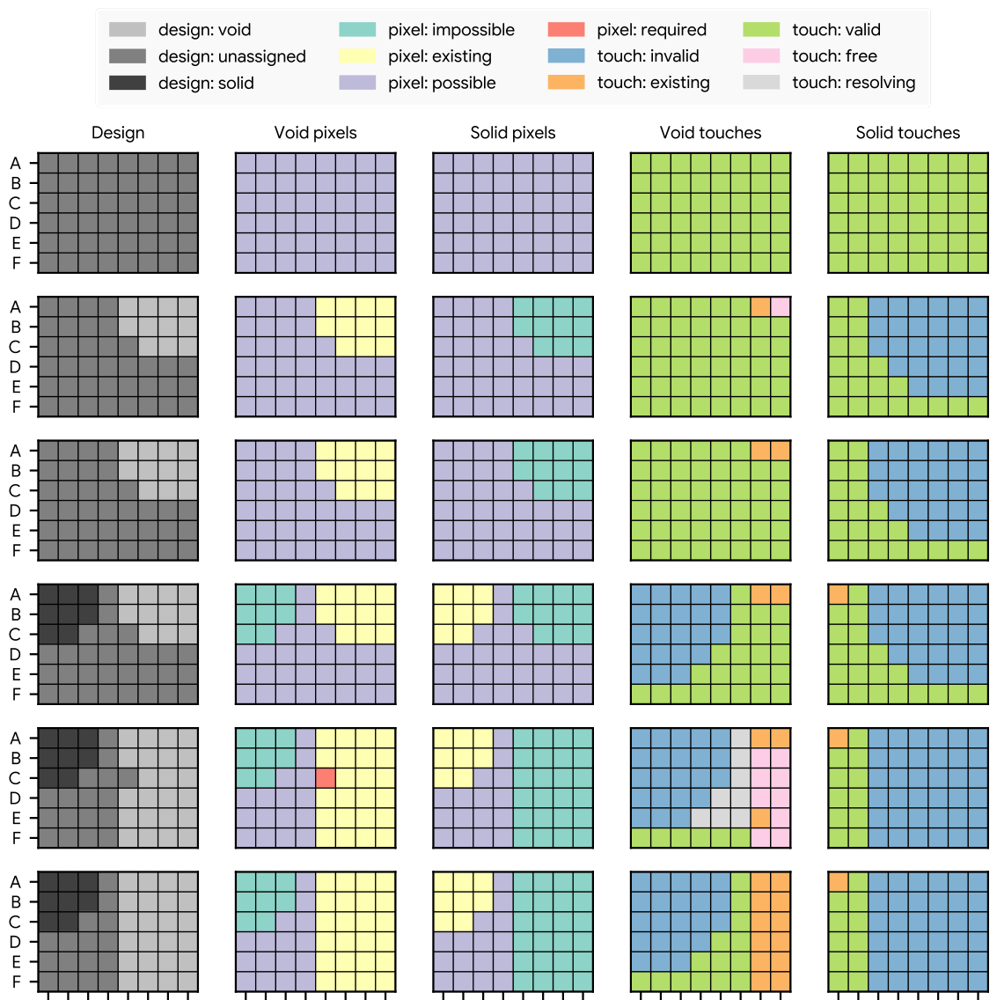

**How to read this figure.** Rows are steps 1–6; columns are the design, void pixels, solid pixels, void touches and solid touches (same colour legend as Fig. 3; pink = free touch, light grey = resolving touch, red = required pixel). Walk through it:

- **Step 1:** nothing placed. Every touch is valid (green), every pixel possible (purple).
- **Step 2:** a void touch at A6. Its stamp makes those pixels existing-void (yellow in "void pixels") and impossible for solid (teal in "solid pixels"). A7 becomes a *free* void touch (pink): it would only paint already-void pixels.
- **Step 3:** the free touch A7 is taken. Nothing visible changes in the design.
- **Step 4:** a solid touch at A0 (top-left, where $\theta$ is largest).
- **Step 5:** a void touch at E6. Now pixel C4 becomes **required** for void (red): it can no longer be solid. Resolving void touches appear (light grey, columns 3–5) and free void touches (pink, columns 6–7).
- **Step 6:** all free touches are taken. That happens to resolve C4. No resolving touches remain.

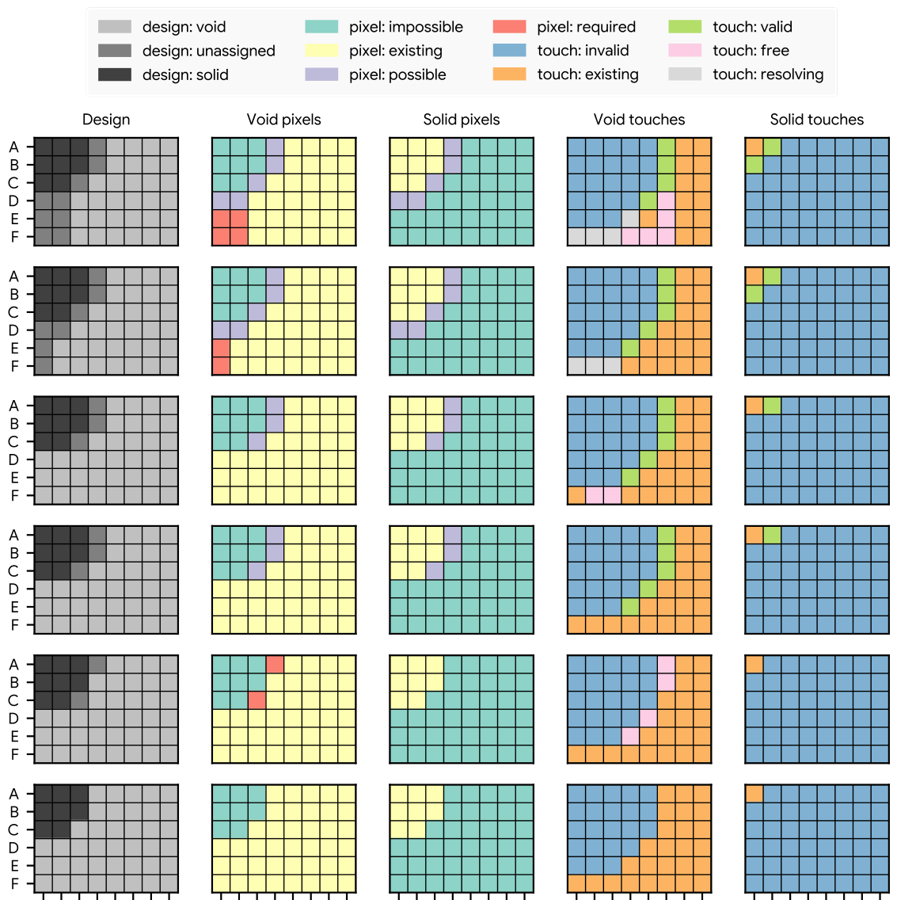

**How to read this figure.** Same layout, steps 7–12.

- **Step 7:** void touch at D4. Pixels E0, E1, F0, F1 become required-void. Both free and resolving void touches exist.
- **Step 8:** take all free touches. E1 and F1 are resolved; E0 and F0 are still required.
- **Step 9:** one *resolving* void touch at F0; the required pixels are resolved. F1 and F2 become free void touches.
- **Step 10:** take the free touches F1, F2.
- **Step 11:** void touch at C5. A3 and C2 become required-void. Since every remaining pixel must now be void, only free void touches remain.
- **Step 12:** take them; the design is complete — a solid blob in the top-left, void elsewhere, legal for the width-5 brush.

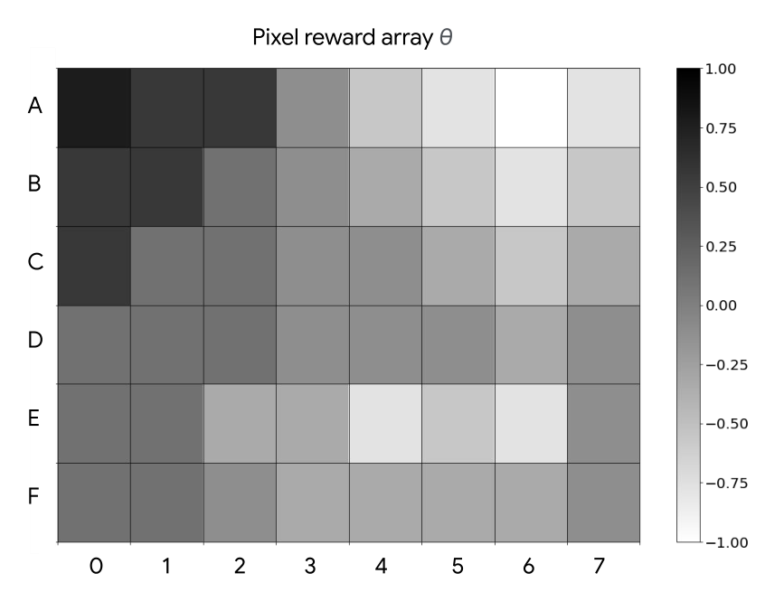

**How to read this figure.** A 6 × 8 grey map of $\theta$; black = +1 (wants solid), white = −1 (wants void). Large positive values sit in the top-left (A0–C2), so the generator puts its solid there; the rest is mostly negative, so it becomes void. Compare with the final design in Fig. S2 step 12.

(The file `figX11` in the assets folder is a cropped duplicate of Fig. S1 and is not shown again.)

### S2. Designs using 100 nm notched square brush

**Fig. S4 — spectra for the 100 nm notched-square designs.** *No separate image for Fig. S4 was extracted, so it is described from the caption.* Four panels (bend, mode converter, splitter, demultiplexer) of $|S_{ij}|^2$ in dB vs wavelength (about 1265–1295 nm). The bend has transmission near 0 dB with low reflection; the mode converter's reflection is around −30 dB; the splitter splits; the demultiplexer routes the two bands to their ports. All meet Table I.

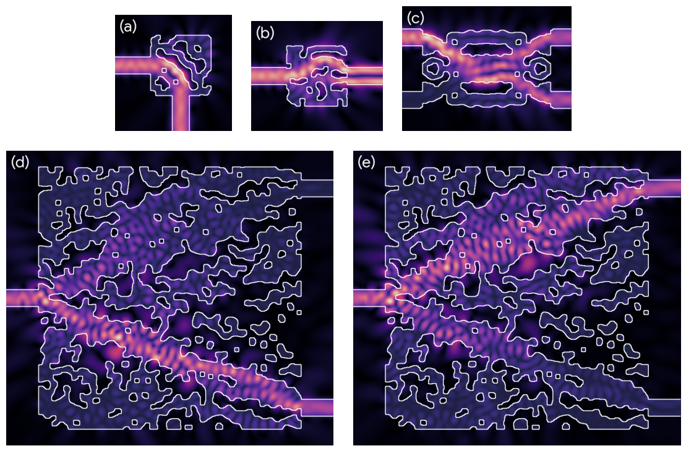

**How to read this figure.** (a) bend, (b) mode converter, (c) beam splitter at 1280 nm; (d) and (e) the demultiplexer at 1270 and 1290 nm. White lines are silicon outlines. Compare with Fig. 6: the shapes here have straighter edges and squarer holes, because the brush is a (notched) square. These are the designs that pass an 80 nm width/spacing DRC. In (c) you can see the splitter's imposed mirror symmetry.

### S3. Illustration of erosion and dilation

**Fig. S6** in the paper shows a rectangle and a circular brush: slide the brush around the inside of the boundary to get the eroded outline, around the outside to get the dilated outline (dashed red). *That image was not extracted;* the generated figure in [Background → Morphology](#morphology-erosion-dilation-opening-closing) shows the same operations on a pixel design.

### S4. How rewards for touches are calculated

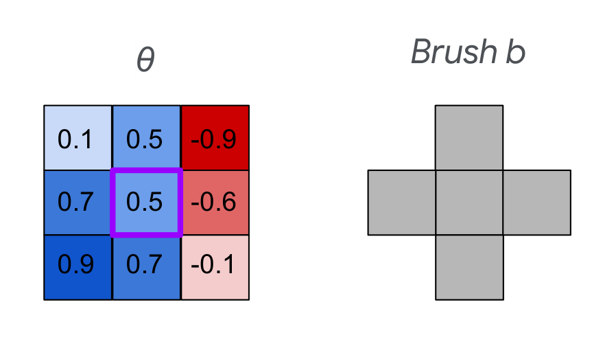

**How to read this figure.** Left: a 3 × 3 patch of $\theta$ (blue positive, red negative); the centre pixel (purple border) is where we consider placing a touch. Right: a plus-shaped 5-pixel brush. A **solid** touch at the centre covers the centre, up, down, left and right pixels: reward $= 0.5 + 0.5 + 0.7 + 0.7 + (-0.6) = 1.8$. A **void** touch there has reward $-1.8$. So the generator will much prefer a solid touch here — as you would expect, since the patch is mostly positive.

---

## How this paper defines erosion and dilation (for Thu 19 Nov)

On Thursday 19 Nov the schedule asks you to compare how Piggott 2017 and Schubert 2022 define erosion and dilation, and to "be explicit that they are not the same thing". Here is exactly what *this* paper does.

- **Domain:** binary pixel arrays with values $\pm1$ — never grey values.
- **Definition:** standard binary morphology with a brush $b$ (Soille 2004). Dilation = union of brushes placed at every solid pixel; erosion = the set of centres where the brush fits inside the solid. Opening = dilation of erosion.
- **Brush shapes:** an approximate pixel disk (circular brush) or a notched square. The brush size **is** the length scale (60–130 nm).
- **Purpose:** (i) a **test** of feasibility, Eq. (1); (ii) a **construction** of designs, Eq. (2) — "design = dilated touches"; (iii) state bookkeeping inside the generator, Eqs. (3)–(9).
- **Not used for:** modelling over-/under-etch, or building eroded/dilated *variants* to simulate. The size of the brush is a *rule* (minimum feature), not a *process bias* ($\delta w$).

Compare with the robust-objective convention you will implement (Chen 2020, Meep, Tidy3D): erosion/dilation by a small bias $\delta w$ (e.g. 10 nm) to model the fab, applied to the *current* design, with the three variants all simulated. In density codes this is done by **thresholding one blurred field at three levels** (0.75 / 0.5 / 0.25), which agrees with true binary morphology only once the design is nearly binary (the schedule's gotcha). So there are three different things all called "erosion": (a) Schubert's brush-morphology feasibility test with a brush the size of the *minimum feature*; (b) binary morphology by a *bias* $\delta w$ (polygon offset or `grey_erosion` with a disk of radius $\delta w$); (c) threshold-shift on a filtered density. Write down which one each code uses.

## Dissecting the reporting format (for Tue 9 Mar 2027)

On 9 Mar 2027 the task is: *steal the reporting format, not the method.* Here is the format, piece by piece, and how to adapt each piece.

**1. A specification table up front (Table I).** Every requirement is a number in dB, per port, per band, with a direction (≤ or ≥). Success is binary and checkable: "meets spec at all six wavelengths". Steal: put a spec table in your methods. For you, add a column or row for the *geometry case* — e.g. "must hold at eroded, nominal and dilated" or "yield ≥ 90 % under σ = 5 nm".

**2. One worked example shown in depth (Fig. 5).** A single device's evolution, with design + field + spectrum at selected steps, including the step where spec is first met and the best step. Steal: one "hero" device with nominal vs robust design side by side, field plots and spectra.

**3. Spectra for the best design of each device (Fig. 7, Fig. S4).** dB vs wavelength, all relevant ports, same axes across devices. Steal: same, but overlay eroded / nominal / dilated spectra (three line styles) so the robustness shows directly.

**4. Loss trajectories with spec markers (Figs. 8, 9).** Log-scale normalised loss vs step, markers where spec is met, for all devices on one plot. Honest about noise and regressions. Steal: plot both the nominal FOM and the worst-case FOM over iterations.

**5. Reliability across random seeds (Fig. 10) — the centrepiece.** Fixed protocol: 20 seeds × 500 steps per configuration; a configuration grid (device × brush shape × size); a "best-so-far success" CDF vs step on a log axis. This reports *distribution*, not a single lucky run. Steal the protocol: fixed seed count (state it), fixed budget, grid of conditions, CDF of "first step meeting spec". For you, natural grids are {nominal objective, robust objective} × {devices} × {$\delta w$ = 5, 10, 15 nm}, and a second CDF whose x-axis is $\delta w$ or yield instead of step.

**6. Language: what is claimed vs hedged.** Claims are tied to plots ("consistently", "within a few tens of steps"). Failures are reported, not hidden ("outlier runs", "approximately half or fewer"). Surprises are flagged ("warrants further investigation"). Limitations are listed (2D only; no min-area rule; conservative brush).

**7. What they do *not* report — your gaps to fill.** No wall-clock time or simulation count per design; no final-performance distribution across seeds (only "met spec or not"); no 3D; no fabrication or measurement; no sensitivity to $\delta w$; no DRC run output shown (only stated). Your reporting contract should add: seeds listed, simulations per iteration (3 for robust vs 1 for nominal), compute cost, DRC status per design, and performance under variation.

A reporting table in the spirit of the schedule's six columns:

| Design | Geometry case | Efficiency (dB) | Excess loss (dB) | DRC status | Seeds (success / total) |
|---|---|---|---|---|---|
| bend, nominal objective | eroded −10 nm | … | … | pass (80 nm) | 17/20 |
| bend, nominal objective | nominal | … | … | pass | 20/20 |
| bend, robust objective | eroded −10 nm | … | … | pass | … |

## How this connects to your project

This is the closest methodological ancestor of your project: same benchmark devices (`ceviche-challenges`), same idea of guaranteed foundry rules, same autodiff-adjoint pipeline. What it gives you and what it leaves open:

- **Gives you:** a precise definition of feasibility (Eq. 1) that you can use as an **automatic DRC check** in Python on every design you produce, whatever method made it. It also gives a clean benchmark set and a model reporting format (Fig. 10).
- **Leaves open:** robustness to process variation. Every design here is optimised at one nominal geometry. Your contribution — optimising eroded/nominal/dilated together and quantifying yield by Monte-Carlo — is not in this paper. It could even be bolted onto this method: run the generator, then erode/dilate the feasible design by $\delta w$ and average the three losses.
- **Method choice:** the schedule's verdict is to use filter + projection for constraints in Meep/Tidy3D and erosion/dilation in the objective. Schubert's generator is the strongest alternative for hard guarantees; park it unless DRC failures become a problem.
- **ML surrogate:** the STE idea — forward with the real non-differentiable thing, backward with a smooth imitation — is the same trick you would use if a learned surrogate model replaced part of the pipeline.

**Corrected EXIT draft (two sentences, Piggott 2017 vs Schubert 2022):** *Piggott et al. 2017 impose minimum-gap and curvature limits on a level-set design by correcting the geometry during the optimisation, so the design becomes fabrication-compliant gradually [verify against Piggott's constraint section]. Schubert et al. 2022 instead make every iterate DRC-compliant by construction — a brush-based conditional generator with a straight-through gradient — but, like Piggott, they target geometric feasibility of the nominal design, not robustness to process variation, which neither objective includes [verify the Piggott half].*

!!! warning "Common confusions"
    - **"Strict foundry constraints" ≠ "robust to fabrication".** This paper guarantees the *drawn* design obeys width/spacing rules. It never simulates an over- or under-etched version.
    - **The brush size is not $\delta w$.** A 100 nm brush is a *minimum feature* rule. A process bias is ~5–10 nm. Different scale, different job.
    - **Notched square of width $L$ gives width/spacing $w = (L-2)d$, not $Ld$.** A "100 nm notched square" means an 80 nm rule.
    - **Circular brush ≠ "no sharp corners allowed by the foundry".** It is the authors' choice for a classical length scale; foundries mostly use width/spacing rules, for which the notched square is the right brush.
    - **$d$ means pixel pitch here** (10 nm), whereas in Vercruysse 2019 $d$ means minimum feature size.
    - **"Reliability" in Fig. 10 means optimiser reliability over random starts**, not device yield.
    - **The STE gradient is not the true gradient.** It is a useful direction. That is why trajectories are noisy and why Adam (built for noisy gradients) is used.
    - **Loss = 0 does not mean spec met, and spec met does not mean loss = 0.** Softplus never reaches zero; the spec is checked separately.
    - **The method is not "density-based with a different filter".** The physical design is always binary; there is no $\beta$ schedule. The $\beta$ in Eq. (11) is a fixed sharpness of the *transform/estimator*, kept at 2–8.
    - **Author order:** Schubert is first author; Williamson is third. Same paper, not two.

## Check yourself

**Q1.** In words, what two conditions does Eq. (1) check?

??? note "Answer"
    $\mathcal{O}(x,b)=x$: no solid feature is too small to hold the brush (opening would delete it). $\neg\mathcal{O}(\neg x,b)=x$: no void feature (gap or hole) is too small for the brush. Both together: every solid and every void region could have been painted with $b$.

**Q2.** A foundry requires 100 nm minimum width and spacing. With 10 nm pixels, which notched square brush do you use, and what brush "size" would the paper quote?

??? note "Answer"
    $L = w/d + 2 = 100/10 + 2 = 12$ pixels, i.e. a 120 nm notched square brush.

**Q3.** Why does a circular brush make sharp 90° corners infeasible?

??? note "Answer"
    Near a sharp convex corner, no disk that fits inside the solid can reach the corner pixel, so erosion removes it and dilation brings back only a rounded corner. Opening changes the design, so Eq. (1) fails.

**Q4.** What are "free", "resolving" and "valid" touches, and in what order does Algorithm 1 use them?

??? note "Answer"
    Valid: a touch that would not overwrite the opposite colour and is not already placed. Resolving: a valid touch that covers a *required* pixel (one that can no longer be the other colour). Free: a valid touch whose stamp only covers pixels that are already, or must become, this colour — it removes no options. Order: take all free touches; else one resolving touch; else one valid touch (the highest-reward one).

**Q5.** Why is the generator's cost $O(N)$ and not $O(N^2)$ in a good implementation?

??? note "Answer"
    Each step changes states only within a few brush widths of the new touch, so updates can be done in a fixed-size window instead of recomputing full-array dilations. At most $N$ steps × constant work = $O(N)$.

**Q6.** What does the straight-through estimator replace, and with what, in this paper?

??? note "Answer"
    It replaces the (non-existent) derivative of the generator, $\partial x/\partial\theta$, with the derivative of the smooth estimator $\tanh(\beta(\theta\circledast b))$ — the same form as the transform — in the backward pass only. The forward pass still uses the real generator, so the design is always feasible.

**Q7.** Compute $z$ inside the softplus of Eq. (12) for a bend with $|S_{21}|^2 = 0.95$, using $\min(w_{\text{valid}}) = 0.010$. Is the term violating?

??? note "Answer"
    Cutoff 0.891, $g=-1$: $z = -(0.95 - 0.891)/0.010 = -5.9$. Negative, so inside spec; softplus$(-5.9) \approx 0.0027$, a tiny contribution.

**Q8.** In Fig. 10, what exactly is on the y-axis, and why can the curves only go up?

??? note "Answer"
    The fraction of the 20 independent random-start runs that have met the Table I spec at *any* step up to the current one. It is a best-so-far (cumulative) quantity, so once a run has succeeded it counts as successful forever.

**Q9.** Which configurations were least reliable, and what does the paper advise?

??? note "Answer"
    Beam splitter and demultiplexer with 130 nm brushes: about half or fewer of runs met spec within 500 steps. Advice: launch several runs and/or use a larger design region.

**Q10.** The schedule drafts "Schubert … optimises for the eroded/dilated variants too". Is that right? What does the paper actually do with erosion/dilation?

??? note "Answer"
    No. The objective is computed on the single nominal feasible design. Erosion and dilation (by a brush the size of the minimum feature) are used to define and test feasibility (Eq. 1) and to build designs (Eqs. 2–9), not to simulate process variation.

**Q11.** Why is being "always feasible" useful in practice, beyond the guarantee?

??? note "Answer"
    You can stop the moment a design meets spec; no later stage can destroy the performance. Topology can still change late in the run. No hyperparameter schedule (no $\beta$ ramp) is needed.

**Q12.** Name three limitations the authors themselves list.

??? note "Answer"
    2D simulations only (need 3D for foundry parts); no minimum-area rules; the notched-square construction is conservative (brush bigger than the width rule). Also: the transform/estimator choice needs more study.

## Key takeaways

- Foundry width/spacing rules can be stated exactly as **brush feasibility**: $\mathcal{O}(x,b) = \neg\mathcal{O}(\neg x,b) = x$.
- For width/spacing $w$ at pixel pitch $d$, use a **notched square of width $L = w/d + 2$** (conservative); 100 nm brush ↔ 80 nm rule at 10 nm pixels.
- A **conditional generator** paints designs with solid and void brush touches, guided by a reward array $\theta$, tracking existing/impossible/valid/possible/required/resolving/free states. It **always** ends feasible and can reach **every** feasible design.
- A **straight-through estimator** (same tanh-of-convolution form as the transform) carries gradients past the generator; Adam handles the noise.
- The loss (Eq. 12) is a softplus hinge on spec violations, scaled by the tightest window.
- Four O-band devices meet specs with 60–130 nm brushes; larger brushes are harder; 130 nm splitter/demux succeed in about half the runs.
- **Fig. 10's reporting style** — fixed seeds, fixed budget, configuration grid, cumulative success fraction — is the thing to copy.
- The paper is about **feasibility, not robustness**. No eroded/dilated performance, no variation, 2D only. That gap is your project.

## Glossary

| Term | Plain definition |
|---|---|
| Adam | Gradient optimiser that averages gradients and squared gradients; good with noisy gradients. |
| Adjoint method | Way to get the gradient w.r.t. all design pixels from about two simulations. |
| Autodiff (automatic differentiation) | Software that applies the chain rule automatically through code (JAX, TensorFlow). |
| Backpropagation | Applying the chain rule backwards through a computational graph. |
| Binary design | Every pixel is fully solid or fully void (±1). |
| Brush $b$ | The stamp/structuring element used for painting and for morphology. |
| $b$-feasible | Every solid and void feature could be painted with brush $b$; Eq. (1) holds. |
| Calibre | Siemens' industry-standard DRC/verification software. |
| Ceviche | Open-source differentiable 2D FDFD solver. |
| ceviche-challenges | Open-source benchmark of the four devices in this paper. |
| Closing | Dilation then erosion; equivalently $\neg\mathcal{O}(\neg x,b)$. Fills small holes/gaps. |
| Combinatorial optimisation | Searching over discrete choices (here $2^N$ designs). |
| Computational graph | The chain of operations from inputs to loss, used for backprop. |
| Conditional generator | Algorithm that outputs a feasible design, steered by a reward array $\theta$. |
| Convolution $\circledast$ | Sliding-weighted-sum of an array with a kernel (here the brush). |
| Crosstalk | Power reaching a port where it should not. |
| dB (decibel) | $10\log_{10}$ of a power ratio; −3 dB ≈ half, −20 dB = 1 %. |
| Density method | Topology optimisation with grey per-pixel values, filter and projection. |
| Design rule check (DRC) | Software check of a layout against foundry rules. |
| Dilation $\mathcal{D}$ | Grow solid by stamping the brush on every solid pixel. |
| Dual contouring | Turning pixels into polygon outlines (for binary: trace pixel edges). |
| Eroded / nominal / dilated | Three versions of a design with edges shifted in / as drawn / out by $\delta w$. |
| Erosion $\mathcal{E}$ | Keep a pixel solid only if the brush centred there fits in solid. |
| Estimator | Smooth stand-in function whose gradient is used in the STE. |
| FDFD | Finite-difference frequency-domain Maxwell solver. |
| Feasible | Obeys the design rules. |
| Foundry | Factory that fabricates chips for customers. |
| Free touch | Valid touch that only paints pixels already (or necessarily) of its colour. |
| Insertion loss | Power lost passing through a device. |
| KLayout | Free layout viewer/editor with DRC. |
| L-BFGS | Quasi-Newton optimiser using an approximate curvature. |
| Latent design | Hidden real-valued array that the optimiser updates. |
| Length scale | Size of the smallest feature (diameter of circular brush that fits). |
| Lithography | Printing a pattern by exposing resist through a mask. |
| Marching squares | Algorithm for smooth contours from a pixel field. |
| Minimum width / spacing | Smallest allowed solid feature / gap. |
| MMA | Method of moving asymptotes; constrained optimiser. |
| Morphology | Image operations that grow/shrink shapes with a brush. |
| Notched square | Square brush with the four corner pixels removed. |
| O-band | Telecom band ≈ 1260–1360 nm. |
| Opening $\mathcal{O}$ | Erosion then dilation; deletes solid features too small for the brush. |
| Over-/under-etch | Fabrication bias making silicon thinner / thicker than drawn. |
| Projection | Steep S-shaped function pushing grey values towards 0/1. |
| Quantised / binary neural network | Network whose weights are low-precision / ±1. |
| Required pixel | Undecided pixel that can no longer become the other colour. |
| Resolving touch | Valid touch that covers a required pixel. |
| Return loss | How little power reflects back (small $\lvert S_{11}\rvert^2$). |
| Reward array $\theta$ | Per-pixel preference (+ solid, − void) that steers the generator. |
| Robust objective | Optimising a combination of eroded/nominal/dilated performance. |
| S-parameters ($S_{ij}$) | Amplitude from port $j$ to port $i$; $\lvert S_{ij}\rvert^2$ is power. |
| Softplus | $\ln(1+e^z)$, a smooth hinge. |
| Straight-through estimator (STE) | Use a smooth function's gradient in place of a hard function's in the backward pass. |
| Three-field scheme | Latent → filtered → projected density parameterisation. |
| Topology | How many pieces and holes a shape has. |
| Topology optimisation | Optimisation that may change topology, not just edge positions. |
| Touch $t$ | A pixel on which a brush stamp is centred. |
| Valid touch | Touch that would not overwrite the opposite colour and is not yet used. |
| $w_{\text{valid}}$ | Width of the allowed window between spec cutoff and physical limit. |
