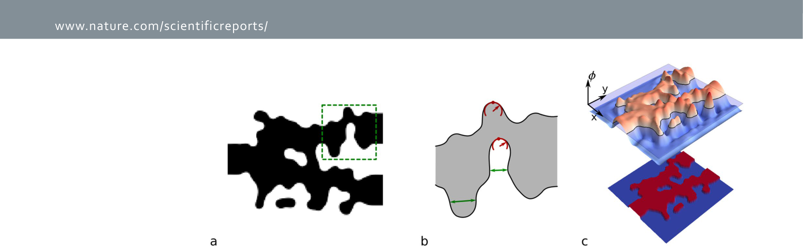
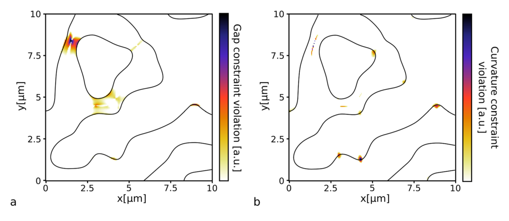
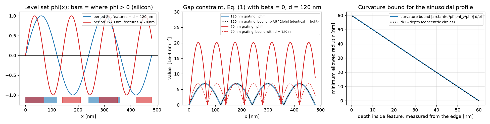
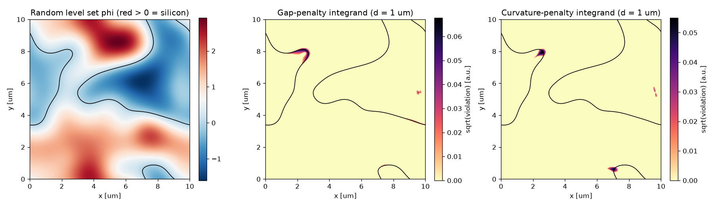
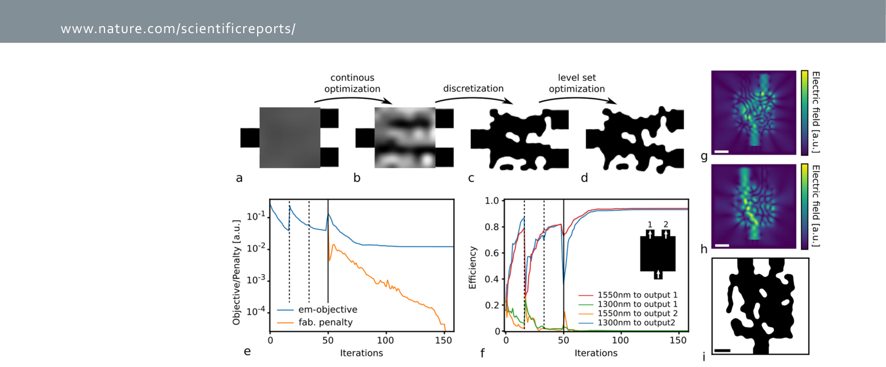
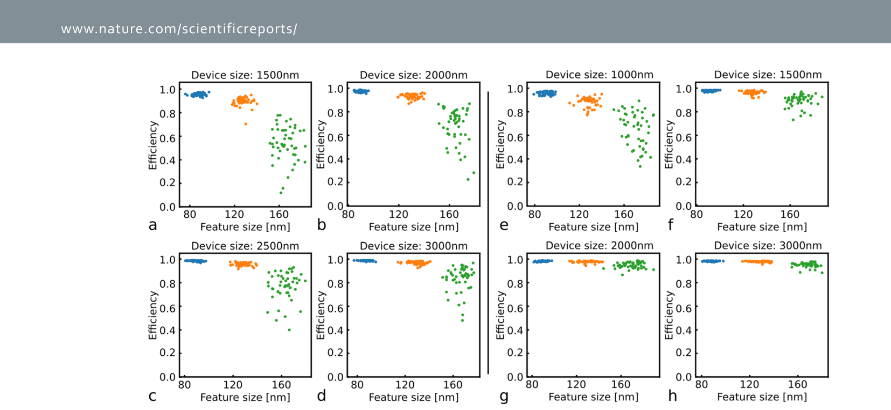
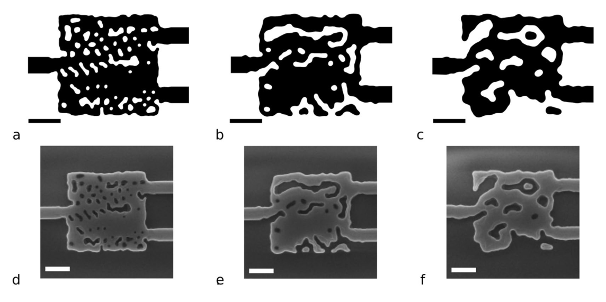

# Week 10 · Day 2 — Tuesday 24 Nov 2026 · Vercruysse 2019 (analytical level-set constraints)

*Simple-English study version of Vercruysse, Sapra, Su, Trivedi & Vučković, "Analytical level set fabrication constraints for inverse design", Scientific Reports 9, 8999 (2019)*

---

!!! abstract "Today's slot"
    **Evening, 20:00–21:30 (1.5 h).** The schedule's task line:

    > *Vercruysse 2019 — analytical level-set and curvature constraints.*
    > **EXIT:** *Note filed; a verdict on which constraint type is easiest to implement in a density formulation.*

    The HOW block adds: the idea is to represent the device as a **level set** of a continuous function and add an **analytical penalty** for curvature and minimum-gap violations, instead of post-processing the binary design. The advantage is that the penalty is differentiable and folds into the same gradient. Write the verdict as a `decisions.md` line.

    **Two bibliographic fixes the HOW block asks for:** the venue is **Scientific Reports** (not Optics Express), DOI **10.1038/s41598-019-45026-0**. And the schedule lists the fourth author as "Trajković"; the paper itself lists **Rahul Trivedi**. Use the paper's author list.

    **After reading this page you should be able to:**

    - explain what a level-set function is and how it describes a device shape;
    - compute the gradient-direction derivatives $\phi_v$, $\phi_{vv}$ and the curvature from $\phi$;
    - derive why the gap constraint, Eq. (1), is exactly tight for a grating with feature size $d$;
    - explain where the $\arctan$ in the curvature constraint, Eq. (2), comes from and why it equals $d/2$ on the boundary;
    - turn both constraints into the penalty Eq. (3) and explain the ramp function, $\beta$, $\zeta$ and the "+15 %";
    - describe the three-stage design flow and read the results (Figs. 3–5, Table 1);
    - give a verdict on which constraint type is easiest in a density (Meep/Tidy3D) formulation.

---

## Before you start: the big picture

Inverse design draws free-form shapes. Free-form shapes tend to have tiny features: narrow slits, needle tips, sharp corners. Fabrication cannot make these. So you need a rule that says "no gap narrower than $d$, no corner sharper than radius $d/2$".

There are two broad ways to enforce such a rule:

1. **Correct the shape** every so often: let the optimiser do its thing, then fix the bad bits (clip, smooth, project). This works but interrupts the optimiser, and fast optimisers like quasi-Newton methods hate interruptions — they rely on a smooth, unchanging problem to build up their memory of the landscape.
2. **Add a penalty**: a number that is zero when the shape is fine and grows when it breaks the rule. Add it to the objective and let the optimiser trade performance against fabricability in one smooth problem.

This paper does option 2 for shapes described by a **level set**. The key result is two *analytical* formulas (no image processing, no searching for the nearest neighbour edge) that read off "gap too small" and "corner too sharp" directly from the level-set function and its derivatives at each point.

Analogy: think of a landscape (hills and valleys), and flood it with water up to sea level. The dry land is silicon, the water is etched-away oxide. A narrow island happens where a hill is steep-sided and narrow; a sharp cape happens where the coastline bends tightly. You can tell both from the *shape of the hills near the coast* — how quickly they curve — without ever measuring distances across the water. That is what the constraints do.

## Background you need

### Level-set functions, from zero

A **level-set function** $\phi(x,y)$ is a smooth function over the design region. The device is defined by its sign:

- $\phi > 0$: silicon (material),
- $\phi < 0$: etched (cladding),
- $\phi = 0$: the boundary — the **zero contour** or **zero level set**.

Example: $\phi(x,y) = R - \sqrt{x^2+y^2}$ describes a silicon disk of radius $R$: positive inside, zero on the circle, negative outside. This particular $\phi$ is a **signed distance function** (its value is the distance to the edge, with a sign), but a level set does not have to be one — any smooth function with the right zero contour works.

Why use one? A pixel ("Manhattan") representation can only move edges in whole pixels. With a level set, small changes to $\phi$ move the boundary *continuously*, sub-pixel. Topology can still change: if a hill sinks below zero, an island disappears; if a valley rises, a hole closes.

In this paper $\phi$ is not stored on the fine simulation grid. It is stored on a **coarse grid** of values $p$ (the **parametrization vector**) and smoothly interpolated, so $\phi = \phi(x,y;p)$.

### Gradient, gradient direction and "gauge" derivatives

The **gradient** $\nabla\phi = (\phi_x, \phi_y)$ points uphill, perpendicular to the contour lines, with length equal to the slope. At the boundary it points from oxide into silicon, perpendicular to the edge.

The paper uses derivatives **along the gradient direction** (Lindeberg's "gauge coordinates"). Let $\hat v = \nabla\phi/|\nabla\phi|$ be the unit uphill direction. Then:

- **First derivative along $\hat v$:**

$$\phi_v = \hat v\cdot\nabla\phi = |\nabla\phi| = \sqrt{\phi_x^2+\phi_y^2}.$$

It is always $\ge 0$: how steep the hill is.

- **Second derivative along $\hat v$:** $\phi_{vv} = \hat v^{\mathsf T} H\,\hat v$, where $H$ is the **Hessian** (matrix of second derivatives). Written out:

$$\phi_{vv} = \frac{\phi_x^2\,\phi_{xx} + 2\phi_x\phi_y\,\phi_{xy} + \phi_y^2\,\phi_{yy}}{\phi_x^2+\phi_y^2}.$$

It says how quickly the slope is changing as you walk straight uphill — how fast the hill "bends back" towards flat. Across a narrow ridge, $\phi$ rises and falls within a short distance, so $|\phi_{vv}|$ is big.

*Derivation of $\phi_{vv}$:* the second derivative of $\phi$ along a fixed unit direction $u$ is $\frac{d^2}{ds^2}\phi(\mathbf r + s u) = u^{\mathsf T} H u = u_x^2\phi_{xx} + 2u_xu_y\phi_{xy} + u_y^2\phi_{yy}$. Substitute $u = (\phi_x,\phi_y)/|\nabla\phi|$ and you get the formula above.

### Curvature and radius of curvature

The **curvature** of a curve says how sharply it bends: $\kappa = 1/r$, where $r$ is the **radius of curvature** — the radius of the circle that best hugs the curve at that point. A straight line has $\kappa = 0$ ($r=\infty$). A tight corner has large $\kappa$ (small $r$).

For the contour lines of $\phi$, the curvature is the **divergence of the unit normal**:

$$\kappa = \nabla\cdot\left(\frac{\nabla\phi}{|\nabla\phi|}\right) = \frac{\phi_{xx}\phi_y^2 - 2\phi_x\phi_y\phi_{xy} + \phi_{yy}\phi_x^2}{(\phi_x^2+\phi_y^2)^{3/2}}.$$

*Check on a circle:* take $\phi = x^2+y^2$ (contours are circles of radius $\rho$). Then $\nabla\phi/|\nabla\phi| = (x,y)/\rho$. Its divergence is $\partial_x(x/\rho) + \partial_y(y/\rho) = (1/\rho - x^2/\rho^3) + (1/\rho - y^2/\rho^3) = 2/\rho - 1/\rho = 1/\rho$. So $\kappa = 1/\rho$ and $r=\rho$ — correct. (The sign of $\kappa$ depends on which side is "inside"; the paper uses absolute values.)

*Derivation of the expanded formula:* write $n = \nabla\phi/g$ with $g = |\nabla\phi|$. Then $\nabla\cdot n = (\phi_{xx}+\phi_{yy})/g - (\nabla\phi\cdot\nabla g)/g^2$, and $\nabla g = H\nabla\phi/g$, so $\nabla\phi\cdot\nabla g = \nabla\phi^{\mathsf T}H\nabla\phi/g$. Putting it over $g^3$ gives $[(\phi_{xx}+\phi_{yy})(\phi_x^2+\phi_y^2) - (\phi_x^2\phi_{xx}+2\phi_x\phi_y\phi_{xy}+\phi_y^2\phi_{yy})]/g^3$, which simplifies to the formula above. Notice a nice identity: Laplacian $= \phi_{vv} + \kappa\,\phi_v$. The Laplacian splits into "bending across the contour" and "bending of the contour".

### Minimum feature size: gap and curvature

The paper says a shape is fabricable at feature size $d$ if:

1. **no gap is smaller than $d$** — both silicon widths and etched gaps (the green arrows in Fig. 1b), and
2. **the radius of curvature of the boundary is at least $d/2$** everywhere (the red circles in Fig. 1b). A circle of diameter $d$ is the tightest bend you can draw with a "pen" of width $d$.

### Penalty functions and the ramp

A **constraint** $c(p) \le 0$ can be replaced by a **penalty** added to the objective: $f(p) + \tau\,P(p)$, where $P \ge 0$ and $P = 0$ exactly when the constraint holds. The weight $\tau$ sets how much you care. Raising $\tau$ over time pushes harder towards feasibility.

The **ramp function** $R(x) = \max(x,0)$ is the simplest such penalty: zero when $x \le 0$ (fine), equal to the violation when $x > 0$. It has a kink at 0 but its gradient exists almost everywhere, which is enough for practical optimisers.

### Quasi-Newton optimisation and L-BFGS-B

**Gradient descent** uses only the slope. **Newton's method** also uses the curvature (Hessian) and takes much better steps, but the Hessian is too expensive for thousands of parameters. **Quasi-Newton** methods build a cheap *estimate* of the curvature from the history of gradients. **L-BFGS** stores only the last few gradient pairs; **L-BFGS-B** also allows simple bounds on parameters. These converge in far fewer iterations than plain gradient descent — but only if the objective is a fixed, smooth function. If you edit the design behind the optimiser's back (projection steps), its stored history becomes wrong. That is the paper's motivation for a penalty instead of corrections.

### Sigmoid and interpolation

- A **sigmoid** is an S-shaped function, e.g. $1/(1+e^{-k u})$. Applied to a grey permittivity map it pushes values towards the two material values; slope $k$ controls how hard.
- **Cubic interpolation** builds a smooth function through values on a coarse grid. Interpolating from a coarse grid to the fine simulation grid automatically forbids features much smaller than the coarse pitch — a cheap length-scale control.

### The devices and the physics constraint

- **WDM (wavelength demultiplexer)**: one input, two outputs; light at 1300 nm goes to one output and 1550 nm to the other.
- **TE0-to-TE1 mode converter**: turns the fundamental mode into the first higher-order mode.
- **Efficiency**: fraction of input power that ends up in the right mode at the right output.
- **FDFD** solves Maxwell's equations at one frequency; the paper's Eq. (4) writes them as $\nabla\times\frac1\mu\nabla\times E_i - \omega_i^2\varepsilon(p)E_i = -j\omega_i J_i$.
- **SEM** (scanning electron microscope) images show the fabricated device from above.
- Refractive indices used: silicon 3.48, oxide 1.44; 220 nm SOI in 3D.

---

## Abstract

Inverse design produces arbitrary geometries with high efficiency and new functions, but ensuring they can be fabricated is a major challenge. The authors build a **fabrication-constraint penalty function for level-set geometries** that limits both **gap size** and **boundary curvature**. They put it into a fully automated design flow with a **quasi-Newton** optimiser. They test it on WDMs and mode converters with various footprints and minimum feature sizes, and finally fabricate and measure three WDMs with **80, 120 and 160 nm** feature sizes.

## Introduction

**What it says.** Photonic design is moving from tuning a few parameters of known shapes to optimising completely arbitrary geometries, giving tiny, efficient, novel devices. But a robust design method must also guarantee fabricability. Lithography resolution and etch aspect ratio set a minimum feature size.

**Previous approaches, as they sort them:**

- **Restricted shapes** that cannot violate the rule — hole arrays, pixel grids. Limits the design space.
- **Projection** of intermediate results onto fabricable designs (Lalau-Keraly 2013, Frei 2007, Piggott 2017). Works for arbitrary shapes, but the projection steps *impede higher-order (quasi-Newton) optimisers*.
- **Eroded/dilated evaluation**: simulate eroded and dilated versions during optimisation. Extensions give **fabrication robustness** (Sigmund 2009, Wang 2011) or a length-scale constraint (Zhou 2015, Jensen 2018). — Note: this is the robust-objective family your project builds on. Vercruysse mentions it but does not use it.

**This work.** An analytical constraint for level-set geometries, added to the objective as a **penalty**, so performance and fabricability are optimised *together* with quasi-Newton methods. This contrasts with the group's earlier work (Piggott 2017), where constraints were enforced through **systematic corrections to the geometry**. Tested on WDMs and mode converters with varied footprints and feature sizes; three WDMs fabricated and measured.

## Level Set Fabrication Constraint

**Representation.** Pixel (Manhattan) representations limit the design space; it is better if the boundary can move continuously. You can parametrize the boundary directly as a polygon (Michaels & Yablonovitch), or indirectly with a level-set function — this paper's choice. Material where $\phi>0$, etch where $\phi<0$, boundary at the zero crossing.



**How to read this figure.** (a) A binary device shape (black = silicon). (b) A zoom on the green box: the green arrows are **gaps** (narrowest widths of silicon or of etched space) and the red arcs mark **radius of curvature** at sharp tips — the two quantities the constraints control. (c) The level-set function $\phi$ drawn as a 3D landscape over the design region; the translucent plane is $\phi = 0$. Where the landscape pokes above the plane is silicon (red in the flat map below), where it is below is etched (blue). The black lines on the landscape are the zero contour, i.e. the device edges.

**Fabricability rule.** Target minimum feature size $d$: (1) no gaps smaller than $d$; (2) radius of curvature larger than $d/2$. Without enforcing these, final designs typically contain features below 80 nm.

### The gap constraint, Eq. (1)

$$|\phi_{vv}(x,y;p)| < \left(\frac{\pi}{d}\right)^2 |\phi(x,y;p)| + \beta\,\frac{\pi}{d}\,\phi_v(x,y;p). \tag{1}$$

**Symbols.** $p$: parametrization vector (coarse-grid values). $\phi$: level-set function. $\phi_v$, $\phi_{vv}$: first and second derivatives in the gradient direction (formulas in the background). $d$: target minimum feature size. $\beta > 0$: a relaxation constant, typically $1/3$. (Do not confuse with the $\beta$ of projection filters in density methods.)

**In words:** at every point, the "bend-back" of $\phi$ must be no larger than $(\pi/d)^2$ times its height, plus a small allowance near the boundary.

**Derivation — why $(\pi/d)^2$? Step by step, ignoring the $\beta$ term first.**

1. Consider a 1D grating: silicon strips and gaps alternate. The simplest smooth level set for it is a sine: $\phi(x) = A\sin(kx)$.
2. $\phi > 0$ for $0 < kx < \pi$, i.e. over a length $\pi/k$. Then $\phi<0$ for the next $\pi/k$. So every silicon strip and every gap has width $w = \pi/k$.
3. Differentiate twice: $\phi'' = -k^2 A\sin(kx) = -k^2\phi$. So $|\phi''| = k^2|\phi|$ at **every** point.
4. In 1D, the gradient direction is just $\pm x$, so $\phi_{vv} = \phi''$.
5. The constraint (without $\beta$) says $|\phi''| \le (\pi/d)^2|\phi|$, i.e. $k^2 \le (\pi/d)^2$, i.e. $k \le \pi/d$, i.e. $w = \pi/k \ge d$.

So the constraint holds for gratings with features $\ge d$, fails for gratings with features $< d$, and is **exactly tight** (equality everywhere) for features $= d$ (period $2d$). That is what the paper means by "tight for a sinusoidal function with a periodicity $2d$".

The intuition generalises: a narrow feature means $\phi$ must climb from zero and come back to zero within a short distance. To do that, it must bend sharply relative to its height. Comparing $|\phi_{vv}|$ to $|\phi|$ is a *local* test that does not need to find the opposite edge.

*Worked numbers:* $d = 120$ nm → $(\pi/d)^2 = (0.02618\ \text{nm}^{-1})^2 = 6.85\times10^{-4}$ nm$^{-2}$. A 70 nm grating has $k = \pi/70$, $k^2 = 2.01\times10^{-3}$ nm$^{-2}$ — about 2.9 times too big, so it violates everywhere except where $\phi=0$.

**Why the $\beta$ term.** At the boundary $\phi = 0$, so without $\beta$ the right-hand side is zero and the constraint demands $\phi_{vv} = 0$ *exactly* at every edge point. A sine has that, but a general smooth level set does not (any asymmetry between the two sides of an edge gives $\phi_{vv}\ne0$ there). Requiring exact zeros is numerically impossible. Adding $\beta(\pi/d)\phi_v$ — which is positive at the boundary, since the slope there is non-zero — gives a little room exactly where it is needed. Away from the boundary, $|\phi|$ grows and the first term dominates. Typically $\beta = 1/3$.



**How to read this figure.** A random smooth level set over 10 × 10 µm, with $d = 1$ µm so the effect is visible. Black lines: the zero contour (edges). Colour: how strongly each point violates the constraint (white/pale = fine). (a) The gap violations sit where two edges come close — e.g. the narrow neck near (1.5, 8.3) µm and the pinch near (3, 4.5) µm. (b) The curvature violations sit at sharp tips and tight bends of the edge, e.g. near (4.3, 1.3) and (5.1, 7.6) µm. Most of the region is clean, so the penalty only acts where needed.

### The curvature constraint, Eq. (2)

$$r(x,y;p) = \left\langle \nabla\cdot\left(\frac{\nabla\phi}{|\nabla\phi|}\right)\right\rangle^{-1} > \left|\arctan\!\left(\frac{\phi_v}{\phi}\right)\cdot\frac{d}{\pi}\right|. \tag{2}$$

**Symbols.** $\nabla\cdot(\nabla\phi/|\nabla\phi|)$ is the curvature $\kappa$ of the contour line through the point; $r = 1/\kappa$ its radius of curvature (the angle brackets, as printed, presumably mean a local average/smoothed value — the paper does not define them further). Right side: a minimum radius that depends on where you are.

**Reading the right-hand side — the two limits the paper gives.**

- **On the boundary**, $\phi = 0$ while $\phi_v > 0$, so $\phi_v/\phi \to \pm\infty$ and $|\arctan| \to \pi/2$. The bound is $\frac{\pi}{2}\cdot\frac{d}{\pi} = \frac{d}{2}$. So **at the edge, the radius of curvature must exceed $d/2$** — exactly the fabrication rule.
- **At an extremum** of $\phi$ (top of a hill, bottom of a valley), $\phi_v = 0$, so $\arctan(0) = 0$: the constraint switches off. Good — contour lines near a hilltop are tiny circles (radius → 0), and that is harmless because they are far from any edge.
- **In between** the bound slides smoothly from $d/2$ to 0.

**Why evaluate it everywhere, not just at the edge?** Curvature only matters at the boundary, but a penalty that only looks at grid points near the boundary switches on and off as the edge moves past grid points — highly non-differentiable, which ruins quasi-Newton optimisation. Spreading it smoothly over the region keeps it differentiable.

**Where the $\arctan$ comes from — a derivation for the sine profile.** (This is our reconstruction of the logic, not text from the paper.) Think of a round silicon feature of the minimum allowed size, radius $d/2$. Its inner contour lines, at depth $s$ inside the edge, are concentric circles of radius $d/2 - s$. So a sensible "allowed radius" should fall from $d/2$ at the edge to 0 at the centre, roughly as $d/2 - s$. Now take the tight 1D profile from the gap constraint, $\phi = A\sin(\pi s/d)$ with $s$ = distance from the edge. Then $\phi_v = A(\pi/d)\cos(\pi s/d)$ and

$$\frac{d}{\pi}\cdot\frac{\phi_v}{\phi} = \cot\!\left(\frac{\pi s}{d}\right) \quad\Rightarrow\quad \arctan\!\left(\frac{d}{\pi}\frac{\phi_v}{\phi}\right) = \frac{\pi}{2} - \frac{\pi s}{d}.$$

Multiply by $d/\pi$: the bound becomes $\frac{d}{2} - s$ — **exactly the concentric-circle radius**. So the $\arctan$ is a way of estimating "how far inside the feature am I" from the local ratio of slope to height, and shrinking the allowed radius accordingly.

!!! note "A note on units"
    As printed, the argument $\phi_v/\phi$ has units of 1/length, so strictly the $\arctan$ argument is not dimensionless. The two limits ($d/2$ at the edge, 0 at extrema) do not depend on this, but the behaviour in between does. The natural dimensionless version is $(d/\pi)\,\phi_v/\phi$, used in the derivation above and in the generated figures. If you ever implement this, pick a scaling and write it down; with grid units and $d$ of a few pixels the difference is modest.



**How to read this figure.** Left: two level sets, a sine with 120 nm features (blue) and one with 70 nm features (red); the bars underneath mark where $\phi>0$ (silicon). Middle: the gap test with $d = 120$ nm and $\beta = 0$. For the 120 nm grating, $|\phi''|$ (thick blue) lies exactly on the bound (black dots) — tight. For the 70 nm grating, $|\phi''|$ (solid red) is about three times its bound (dashed red) — violation everywhere except the zero crossings. Right: the curvature bound for the sine profile, using the dimensionless argument, versus depth inside the feature; it is exactly the straight line $d/2 - s$, the radius of concentric circles inside a minimum-size round feature.

### The combined penalty, Eq. (3)

$$f_{fab}(p) = \iint_A dx\,dy\; R\!\left(\frac{|\phi_{vv}|}{\frac{\pi}{d}|\phi| + \beta\,\phi_v} - \frac{\pi}{d}\right) + \zeta\iint_A dx\,dy\; R\!\left(\left|\frac{1}{r}\arctan\!\left(\frac{\phi_v}{\phi}\right)\right| - \frac{\pi}{d}\right). \tag{3}$$

**Derivation — turning Eq. (1) into the first integrand.**

1. Start: $|\phi_{vv}| < (\pi/d)^2|\phi| + \beta(\pi/d)\phi_v$.
2. Factor the right side: $(\pi/d)\left[(\pi/d)|\phi| + \beta\phi_v\right]$.
3. The bracket is positive (sum of non-negative terms, and $\phi_v>0$ near edges), so divide both sides by it: $\dfrac{|\phi_{vv}|}{(\pi/d)|\phi| + \beta\phi_v} < \dfrac{\pi}{d}$.
4. Move $\pi/d$ across: "violation" $= \dfrac{|\phi_{vv}|}{(\pi/d)|\phi|+\beta\phi_v} - \dfrac{\pi}{d}$, positive exactly when Eq. (1) fails.
5. Take the ramp $R(\cdot)$ so only violations count, and integrate over the design area $A$.

Dividing (rather than subtracting the two sides) makes the integrand a *ratio* with units of 1/length, the same as $\pi/d$, and independent of the overall scale of $\phi$ — doubling $\phi$ does not change the shape, so it should not change the penalty.

**Derivation — turning Eq. (2) into the second integrand.**

1. Start: $r > |\arctan(\phi_v/\phi)|\cdot d/\pi$.
2. Divide both sides by $r$ and multiply by $\pi/d$: $\dfrac{\pi}{d} > \left|\dfrac{1}{r}\arctan(\phi_v/\phi)\right|$.
3. Violation $= \left|\frac{1}{r}\arctan(\phi_v/\phi)\right| - \frac{\pi}{d}$; ramp; integrate.

Using $1/r = \kappa$ rather than $r$ avoids dividing by zero on straight edges ($\kappa=0$, $r=\infty$).

**Weights and the "+15 %".**

- $\zeta$ balances curvature against gap; they use $\zeta = 2$.
- If both constraints hold everywhere, $f_{fab} = 0$.
- In practice, devices that satisfy the constraints come out with features a bit *smaller* than $d$ (the constraints are local estimates, not exact distance measurements). So during optimisation they set $d$ **15 % higher** than the target. *Example:* target 120 nm → use $d = 138$ nm in Eqs. (1)–(3).

**Try it: the gap penalty on 1D gratings.**

```python
import numpy as np

d, beta = 120.0, 1/3                       # target feature size [nm]
x = np.linspace(1, 479, 4000)              # avoid exact zeros of phi
for feat in [150.0, 120.0, 90.0, 70.0]:    # actual feature size of the grating
    phi   = np.sin(np.pi * x / feat)
    phi_v = np.abs(np.pi / feat * np.cos(np.pi * x / feat))      # |dphi/dx|
    phi_vv = np.abs((np.pi / feat)**2 * phi)                       # |d2phi/dx2|
    # integrand of the gap term in Eq. (3)
    gap = np.maximum(phi_vv / (np.pi / d * np.abs(phi) + beta * phi_v) - np.pi / d, 0)
    print(f"features {feat:5.0f} nm -> gap penalty = {np.trapezoid(gap, x):.4f}")
```

**What you should see:** penalty 0 for 150 nm and 120 nm features, about 3.3 for 90 nm and 10.8 for 70 nm. Bigger violations, bigger penalty; legal shapes cost nothing. (Requires numpy ≥ 2 for `np.trapezoid`; on older numpy use `np.trapz`.)



**How to read this figure.** This is our own re-creation of the paper's Fig. 2 using the formulas above (finite differences on a 50 nm grid, $\beta = 1/3$, $d = 1$ µm). Left: a random smooth $\phi$ (red = silicon), black = zero contour. Middle and right: the gap and curvature integrands of Eq. (3) (square-rooted to make small values visible). As in the paper, almost everywhere is zero; the gap penalty lights up at the narrow neck near (2.4, 7.9) µm, the curvature penalty at the sharp tips near (2.5, 7.9) and (7, 0.6) µm. These hot spots are where the optimiser's gradient will push the shape.

## Inverse Design

**The optimisation problem.**

$$\begin{array}{ll}\underset{p,\,E_1,\dots,E_n}{\text{minimize}} & f_{EM}(p, E_1,\dots,E_n) + \tau\, f_{fab}(p)\\[4pt] \text{subject to} & \nabla\times\frac{1}{\mu}\nabla\times E_i - \omega_i^2\,\varepsilon(p)\,E_i = -j\omega_i J_i,\quad i=1,\dots,n.\end{array}\tag{4}$$

**Symbols.** $f_{EM}$: optical figure of merit (smaller = better), depending on the fields $E_i$ and the parameters $p$. $\tau$: penalty weight. The constraint is Maxwell's equations in frequency domain for each of $n$ excitations ("modes" $i$ — e.g. 1300 nm in, 1550 nm in), with angular frequency $\omega_i$, current source $J_i$, permeability $\mu$, and permittivity $\varepsilon(p)$ set by the design. In practice the fields are not free variables: for given $p$ you solve Maxwell for $E_i$, and the adjoint method gives $\partial f_{EM}/\partial p$. The gradient of $f_{fab}$ is analytic (it is just derivatives of $\phi$, which depends smoothly on $p$).

**Three stages** (Fig. 3a–d):

1. **Continuous stage.** Permittivity can be anything between cladding and waveguide. $\phi$ is not a level set here, so the penalty is **left out**. But small features must still be discouraged, otherwise the next stage starts badly. Two tricks: (i) parametrize on a **coarse grid** with pitch **1.75 × the minimum feature size**, cubic-interpolated onto the fine simulation grid; (ii) apply a **sigmoid** to the interpolated result to push it towards two values, with slope $k$ increased in steps.
   *Worked numbers:* $d = 120$ nm → coarse pitch 210 nm; a 2.5 µm design region has about 12 × 12 coarse parameters.
2. **Discretization.** Fit a level-set function to the continuous result, *taking $f_{fab}$ into account* so the starting shape is already (nearly) fabricable.
3. **Discrete (level-set) stage.** Solve Eq. (4) with the penalty. $\tau$ is **increased ten times** during this stage; each sub-problem is solved with **L-BFGS-B**. Again a coarse grid with interpolation is used for $\phi$ to smooth the landscape, because the penalty makes the problem hard to solve directly on the fine grid.

Compare with Schubert 2022 (this morning): here the design is grey during stage 1 and the constraint is a soft penalty with an increasing weight — exactly the "staged" workflow Schubert argues against. Its upside is that each stage is smooth, so a fast quasi-Newton optimiser works.

## Results and Discussion

### WDM with fabrication constraints

Set-up: 1300/1550 nm WDM, 2D, design area 2.5 × 2.5 µm², $n_{core} = 3.48$, $n_{clad} = 1.44$, target $d = 120$ nm.



**How to read this figure.** Top row: (a) random grey start; (b) after the continuous stage — still grey but structured; (c) after discretization — black/white; (d) after level-set optimisation — similar topology, smoother, legal. (e) Objective (blue, log scale, lower is better) and fabrication penalty (orange) vs iteration. The dashed lines at iterations 16 and 32 are the sigmoid-slope increases; each causes a jump up in the objective. The solid line at 49 is the discretization, another jump. Then in the level-set stage the objective settles at about $1.5\times10^{-3}$ while the penalty falls by orders of magnitude and hits **zero** near iteration 153. (f) Efficiency vs iteration for the four paths (1300 and 1550 nm to outputs 1 and 2): the "right" paths climb to ~0.93, the "wrong" paths fall to ~0. (g, h) Field intensity at 1300 and 1550 nm, each going to its own output. (i) Final shape.

**Numbers to keep.** Continuous stage: 48 iterations, sigmoid slope changed twice. Discrete stage: iterations 49–153. Final: **93 %** (1300 nm) and **92 %** (1550 nm) efficiency; penalty exactly 0; measured **minimum gap 121.2 nm** and **minimum radius of curvature 63.1 nm** (diameter 126.2 nm) — both above the 120 nm target.

### Minimum feature size vs device footprint

**Experiment.** WDMs with footprints 1.5 × 1.5 to 3 × 3 µm² and target $d$ = 80, 120, 160 nm; **50 random initial conditions** per configuration. Device efficiency = the **lower** of the two wavelengths' efficiencies (worst case). The x-axis is the *achieved* minimum feature size: the minimum over all gaps and curvature diameters measured in the final geometry. Same sweep for TE0→TE1 mode converters.



**How to read this figure.** Each dot is one optimised device. Left block (a–d): WDMs at 1.5, 2.0, 2.5, 3.0 µm; right block (e–h): mode converters at 1.0, 1.5, 2.0, 3.0 µm. Colours: target 80 nm (blue), 120 nm (orange), 160 nm (green). Horizontal position: achieved feature size — each cloud sits around its target, a few dots slightly below. Vertical: efficiency. Three trends jump out: bigger features → lower best efficiency; bigger features → much wider spread; bigger footprint → both better and tighter.

**Numbers.**

- 1.5 µm WDM: 80 nm devices reach up to **96.6 %**, all between 91.8 and 96.6 %; 160 nm devices only up to **77.1 %**, spread **11.2–77.1 %**.
- 160 nm WDM: 1.5 µm footprint best 77.1 %; 3 µm footprint best **96.7 %**.
- Mode converter, 160 nm: 1 µm footprint **33.6–89.3 %**; 3 µm footprint **88.4–97.8 %**. The footprint effect on spread is stronger than for the WDM — the authors guess its landscape has more good local minima.
- A few designs slightly violate the target; fixes suggested: raise $d$ a bit more, increase the coarse-grid pitch, or first optimise the penalty alone to get a fabricable starting point.
- Iteration counts and computation time are in the Supplementary Information.

### 3D WDM designs

Three 3D WDMs, 3 × 3 µm², 220 nm SOI with top oxide cladding, 1300/1550 nm, with $d$ = 80, 120, 160 nm; fabricated and measured.



**How to read this figure.** Top: the designs (black = silicon, white = etched; scale bar 1 µm). From left to right the feature size grows and the pattern gets coarser — many small round holes at 80 nm, a few large ones at 160 nm. Bottom: the fabricated devices. The holes come out rounder and somewhat smaller/blurred, especially the smallest ones at 80 nm — fabrication imperfections that explain part of the measured drop.

**Table 1 — 3D WDM results.**

| Feature size $d$ | 1300 nm eff. FDFD / exp. | 1550 nm eff. FDFD / exp. | Curvature diameter | Gap size |
|---|---|---|---|---|
| 80 nm | 95.0 % / 79.0 % | 94.1 % / 59.0 % | 82.0 nm | 81.7 nm |
| 120 nm | 71.9 % / 48.6 % | 72.4 % / 39.7 % | 124.2 nm | 121.8 nm |
| 160 nm | 52.7 % / 27.4 % | 60.0 % / 39.8 % | 163.8 nm | 161.1 nm |

(The experimental values account for a measured blue shift of the spectrum; details in the Supplementary Information.)

**How to read it.** All three meet their constraints (achieved curvature diameter and gap ≥ target). Smaller features → higher efficiency, in both simulation and experiment. Measured efficiency is well below simulated — 16 to 35 percentage points — attributed to fabrication imperfections. *Worked conversion:* 79.0 % is −1.0 dB; 59.0 % is −2.3 dB; the simulated 95.0 % is −0.22 dB. So fabrication cost roughly 0.8–2 dB for the 80 nm device. This gap between design and measurement is precisely what a robust, variation-aware design (your project) aims to shrink.

## Conclusion

They developed analytical constraints limiting gap size and curvature for level-set geometries, used as a penalty in an automated inverse-design flow. Sweeps of 2D WDMs and mode converters show the achieved feature sizes cluster just above the target, and that efficiency spread grows as the constraint gets stricter. Future work: better initial conditions and early termination to cut the cost of sweeping many random starts. The method was validated in 2D and 3D simulation and in experiment.

---

## Verdict for today's EXIT: which constraint is easiest in a density formulation?

Your simulation stack (Meep `MaterialGrid`, `tidy3d.plugins.invdes`) uses a **density** $\rho\in[0,1]$, filtered and projected — not a level set. Candidates:

| Constraint type | Works on a density? | Effort | Guarantee |
|---|---|---|---|
| Conic filter + tanh projection | native; already in Meep/Tidy3D | lowest | soft (encourages length scale) |
| Filter + geometric/erosion-dilation penalty (Zhou 2015, Hammond 2021) | native; in Tidy3D invdes | low–medium | close to strict at high $\beta$ |
| Vercruysse level-set penalty | needs a level set $\phi$; you could treat $\tilde\rho - 0.5$ as $\phi$, but derivatives of a projected density are near-zero/huge, so the ratios are unstable | high | strong, local estimate (+15 % margin needed) |
| Schubert brush generator | replaces the whole parameterisation | highest | strict by construction |

**Verdict paragraph.** For a density formulation, the easiest constraint is the **conic filter plus tanh projection**: differentiable, cheap, already implemented, and its radius maps to a minimum length scale. Adding the erosion/dilation-based length-scale penalty is the standard next step. Vercruysse's penalty is elegant and analytically differentiable but belongs to level-set parameterisations; porting it means differentiating a projected density twice, which is numerically fragile. Keep it as related work. And erosion/dilation for **robustness** goes into the *objective*, not the constraint.

`decisions.md` line: **"constraints: conic filter + tanh projection (+ length-scale penalty if DRC fails); robustness: three-point erosion/dilation average in the objective; level-set (Vercruysse) and generator (Schubert) parked as related work."**

## How this connects to your project

- It is a clean example of **fabrication-aware inverse design by penalty**, the same family as your density penalties, and it reports honestly: 50 random starts per configuration, a worst-case-over-wavelengths efficiency, achieved (not just target) feature sizes, and simulation vs experiment side by side. The schedule later points to it as a model for reporting a design study — Fig. 4 and Table 1 are the templates.
- Table 1 is a strong motivation for your work: **design rules alone do not make a device robust**. All three devices pass their geometric constraints, yet lose 16–35 points of efficiency after fabrication.
- The "+15 %" trick is a reminder that local estimates of feature size undershoot; whatever length-scale method you use, **measure** the achieved feature size afterwards (e.g. with the morphology check from this morning's Schubert page).
- If you ever need shapes with sub-pixel, smooth edges (e.g. for a 3D Tidy3D export), the level-set representation and its curvature formula are the tools.

!!! warning "Common confusions"
    - **$d$ here is the minimum feature size**, not the pixel size (Schubert uses $d$ for pixel pitch).
    - **$\beta$ here is a relaxation constant (1/3)**, not a projection sharpness.
    - **The gap constraint does not measure distances.** It compares local bending to local height; it is exact only for sine-shaped profiles. That is why $d$ is set 15 % above target.
    - **Curvature is constrained everywhere, but only matters at the edge.** The $\arctan$ factor relaxes it smoothly away from the boundary to keep the penalty differentiable.
    - **The penalty is soft.** Feasibility is reached when $f_{fab} = 0$ at the end, not at every step; $\tau$ is ramped up ten times.
    - **This is not a robustness method.** Like Schubert 2022, it targets geometric feasibility; erosion/dilation is only mentioned in the introduction.
    - **Stage 1 is not a level set** and has no fabrication penalty — just a coarse grid and a sigmoid.
    - **Venue and authors:** Scientific Reports (not Optics Express); fourth author Trivedi.

## Check yourself

**Q1.** Write $\phi_v$ and $\phi_{vv}$ in terms of $\phi_x, \phi_y, \phi_{xx}, \phi_{xy}, \phi_{yy}$.

??? note "Answer"
    $\phi_v = \sqrt{\phi_x^2+\phi_y^2}$; $\phi_{vv} = (\phi_x^2\phi_{xx} + 2\phi_x\phi_y\phi_{xy} + \phi_y^2\phi_{yy})/(\phi_x^2+\phi_y^2)$ — the second derivative along the unit gradient direction.

**Q2.** Show that the gap constraint (with $\beta=0$) is tight for $\phi = \sin(\pi x/d)$.

??? note "Answer"
    $\phi'' = -(\pi/d)^2\phi$, so $|\phi''| = (\pi/d)^2|\phi|$ everywhere — equality. The silicon strips and gaps are each $d$ wide.

**Q3.** With $d = 100$ nm, does a sine grating with 80 nm features satisfy Eq. (1) (ignore $\beta$)? By what factor?

??? note "Answer"
    No. $|\phi''|/|\phi| = (\pi/80)^2$ vs the allowed $(\pi/100)^2$: ratio $(100/80)^2 = 1.56$, so it violates by a factor 1.56.

**Q4.** Why is the term $\beta(\pi/d)\phi_v$ added?

??? note "Answer"
    At the boundary $\phi = 0$, so without it the constraint would demand $\phi_{vv} = 0$ exactly at every edge point, which a general level set cannot satisfy numerically. The term (positive since the slope is non-zero at edges) relaxes the constraint near the zero contour.

**Q5.** What does the curvature bound in Eq. (2) reduce to on the boundary, and at an extremum of $\phi$?

??? note "Answer"
    On the boundary $\phi=0$, $|\arctan(\phi_v/\phi)| = \pi/2$, so $r > d/2$. At an extremum $\phi_v = 0$, so the bound is 0 — no constraint.

**Q6.** Verify that the curvature of the contours of $\phi = x^2 + y^2$ is $1/\rho$.

??? note "Answer"
    $\nabla\phi/|\nabla\phi| = (x,y)/\rho$; divergence $= 2/\rho - (x^2+y^2)/\rho^3 = 1/\rho$.

**Q7.** Derive the first integrand of Eq. (3) from Eq. (1).

??? note "Answer"
    Factor the right side as $(\pi/d)[(\pi/d)|\phi| + \beta\phi_v]$, divide by the positive bracket to get $|\phi_{vv}|/[(\pi/d)|\phi|+\beta\phi_v] < \pi/d$, subtract $\pi/d$, apply the ramp $R$ and integrate over the area.

**Q8.** Why not penalise curvature only at grid points next to the boundary?

??? note "Answer"
    The set of "boundary points" changes discontinuously as the edge moves, making the penalty highly non-differentiable and breaking the quasi-Newton optimiser.

**Q9.** Target feature size 160 nm. What $d$ goes into the equations, and what coarse-grid pitch is used in the continuous stage?

??? note "Answer"
    $d = 1.15 \times 160 = 184$ nm in the penalty. Coarse pitch $= 1.75 \times 160 = 280$ nm (the paper ties the pitch to the required minimum feature size).

**Q10.** What two trends does Fig. 4 show as the feature size increases from 80 to 160 nm?

??? note "Answer"
    The best efficiency drops, and the spread of efficiencies across the 50 random starts grows strongly (e.g. 1.5 µm WDM: 91.8–96.6 % at 80 nm vs 11.2–77.1 % at 160 nm). Larger footprints soften both.

**Q11.** Why does the paper prefer a penalty to projection/correction steps?

??? note "Answer"
    Projection steps change the design outside the optimiser's control, which impedes higher-order methods such as L-BFGS-B. A penalty keeps a single smooth objective, so quasi-Newton methods converge quickly.

**Q12.** The 80 nm 3D WDM simulates at 95.0 % and measures 79.0 % at 1300 nm. What is that loss in dB, and what does it suggest for your project?

??? note "Answer"
    $10\log_{10}(0.95) = -0.22$ dB vs $10\log_{10}(0.79) = -1.02$ dB: about 0.8 dB lost to fabrication. Meeting design rules does not make a device robust to fabrication variation; a variation-aware objective is needed.

## Key takeaways

- A level set describes a device by the sign of a smooth function $\phi$; the edge is $\phi = 0$ and can move continuously.
- **Gap constraint:** $|\phi_{vv}| < (\pi/d)^2|\phi| + \beta(\pi/d)\phi_v$ — exact for a sine grating with features $d$; $\beta \approx 1/3$ relaxes it at edges.
- **Curvature constraint:** $r > |\arctan(\phi_v/\phi)|\,d/\pi$ — equals $r > d/2$ on the edge, relaxes to zero at extrema, kept smooth for differentiability.
- Both become one ramp-function penalty $f_{fab}$ (Eq. 3) with $\zeta = 2$ and $d$ set 15 % above target, added to the objective with weight $\tau$ raised ten times, optimised with L-BFGS-B.
- Three-stage flow: continuous (coarse grid, sigmoid) → fit level set → level-set optimisation with penalty.
- Results: a 120 nm WDM at 93/92 % with zero penalty; efficiency drops and spread grows with feature size; 3D devices at 80/120/160 nm fabricated, measured efficiency well below simulated.
- For a density formulation, filter + projection is the easiest constraint; Vercruysse's penalty is a level-set tool.

## Glossary

| Term | Plain definition |
|---|---|
| Level-set function $\phi$ | Smooth function whose sign marks material ($>0$) and etch ($<0$). |
| Zero contour | The curve $\phi = 0$; the device boundary. |
| Signed distance function | Level set whose value is the (signed) distance to the boundary. |
| Parametrization vector $p$ | The coarse-grid numbers that define $\phi$. |
| Gradient $\nabla\phi$ | Vector of first derivatives; points uphill, perpendicular to contours. |
| Gauge / gradient-direction derivatives | Derivatives taken along the unit gradient direction. |
| $\phi_v$ | Slope along the gradient direction, $= \lvert\nabla\phi\rvert$. |
| $\phi_{vv}$ | Second derivative along the gradient direction. |
| Hessian | Matrix of second derivatives of $\phi$. |
| Curvature $\kappa$ | How sharply a curve bends; $\kappa = \nabla\cdot(\nabla\phi/\lvert\nabla\phi\rvert)$ for contours. |
| Radius of curvature $r$ | $1/\kappa$; radius of the best-fitting circle. |
| Divergence | Sum of partial derivatives of a vector field's components. |
| Minimum feature size $d$ | Smallest allowed gap or width (and twice the smallest radius). |
| Gap | Narrowest width of a silicon region or an etched region. |
| Penalty function | Non-negative term added to the objective, zero when constraints hold. |
| Ramp function $R$ | $\max(x,0)$. |
| $\beta$ (here) | Relaxation constant (1/3) in the gap constraint. |
| $\zeta$ | Weight of curvature vs gap penalty (2). |
| $\tau$ | Weight of the fabrication penalty vs optical objective. |
| Figure of merit $f_{EM}$ | Number measuring optical performance (here minimised). |
| Quasi-Newton | Optimiser that estimates curvature from gradient history. |
| L-BFGS-B | Limited-memory quasi-Newton optimiser with bounds. |
| Projection step | Correction that pushes a design onto the fabricable set. |
| Sigmoid | S-shaped function pushing values towards two levels. |
| Cubic interpolation | Smooth curve/surface fit through coarse-grid values. |
| Manhattan representation | Pixel-based shape with edges on the grid. |
| WDM | Wavelength demultiplexer: routes different wavelengths to different outputs. |
| TE0 / TE1 | Fundamental / first higher-order transverse-electric mode. |
| Efficiency | Fraction of input power delivered to the right output mode. |
| FDFD | Finite-difference frequency-domain Maxwell solver. |
| SOI | Silicon-on-insulator wafer (here 220 nm silicon). |
| SEM | Scanning electron microscope image. |
| Blue shift | Spectrum moved to shorter wavelengths (often from fabrication bias). |
| Density formulation | Pixel values in [0,1], filtered and projected (Meep, Tidy3D). |
| Conic filter | Cone-shaped blur that sets a length scale in density methods. |
| Erosion / dilation | Shrinking / growing a shape; used for robustness or length-scale constraints. |
