# Week 10 · Day 3 — Wednesday 25 Nov 2026 · Lu & Vučković 2013 (objective-first)

*Simple-English study version of Jesse Lu and Jelena Vučković, "Nanophotonic Computational Design", Optics Express 21(11), 13351 (2013); arXiv:1303.5823*

---

!!! abstract "Today's slot"
    **06:15–07:45 Morning:** "Lu & Vučković 2013 (objective-first) and Su et al. 2020 (SPINS-B)." This page covers the first of the two papers. The SPINS paper has its own page: [Su et al. 2020 — SPINS](day-03-wed-25-nov-2026-su-2020.md).

    **EXIT for the morning (from the schedule):** "Note on objective-first versus direct gradient descent, and when each is preferable."

    **What the schedule's HOW block says about this paper:** the objective-first idea is that "rather than maximising a figure of merit over the design (with the physics as a hard constraint), alternate between two relaxed sub-problems — hold the fields and solve for the best ε; hold ε and solve for fields — until both are satisfied. It converges to designs that are often physically unexpected, at the cost of a more delicate iteration."

    **After reading this page you should be able to:**

    - write down Lu & Vučković's problem (eq. 1) and say in words what each line means;
    - explain why the problem is **bi-convex** (convex in the field when the structure is held fixed, and convex in the structure when the field is held fixed), and why that matters;
    - explain why letting physics be "temporarily wrong" can help the optimiser escape bad local optima, and why it is not a guarantee;
    - read every result figure in the paper (mode converters, splitters, hubs, fibre couplers, broadband / temperature / etch robustness);
    - write the EXIT note (a draft is given at the end of this page).

    **Other dates:** the schedule does not come back to this paper on any other date. It is item 13 of the core reading list.

---

## Before you start: the big picture

Most photonic devices are designed by hand. A person picks a shape they understand (a straight waveguide, a ring, a taper), then tunes two or three numbers (a width, a gap, a length) until the device works. This is safe, but it uses only a tiny corner of all the shapes that could exist.

**Inverse design** turns this round. You say what you *want* the device to do ("send 90% of the light into this output"). The computer then searches over *every pixel* of a small design area to find a shape that does it.

There are two broad ways to do this search:

1. **The classic way (gradient descent with the adjoint method).** Start from some shape. Simulate it exactly. Measure how good it is. Change the shape a little in the direction that improves it most. Repeat. At every step the light obeys Maxwell's equations perfectly; only the *performance* is wrong.
2. **The objective-first way (this paper).** Turn the problem upside down. At every step, *the performance is exactly what you asked for*; what is "wrong" is the physics. The light field you are working with does not quite obey Maxwell's equations for the current shape. The algorithm then slowly fixes the physics, by changing both the field and the shape, until the error is (hopefully) zero.

**Everyday analogy.** Imagine planning a road trip that must end at a particular beach.

- The classic planner only ever draws *legal* routes along real roads. It starts somewhere and keeps improving: "this turn gets me a bit closer to the beach". It can get stuck in a dead-end valley where every legal turn leads further away.
- The objective-first planner draws a line straight to the beach first, even across fields and lakes. Then it slowly bends the line onto real roads. Because it always "ends at the beach", it is never tempted to settle for a nearby car park. But it might fail to find real roads that fit, and then the final legal route does not quite reach the beach.

That is the whole paper in one picture. The rest is the maths of it, and a long list of devices the method designed.

## Background you need

### Permittivity, refractive index and the materials

The **permittivity** $\varepsilon$ says how strongly a material responds to an electric field. For the materials here, $\varepsilon = n^2$, where $n$ is the refractive index.

The paper uses silicon with $\varepsilon_{\text{Si}} = 12.25$ (so $n = 3.5$) and silica (glass) with $\varepsilon_{\text{SiO}_2} = 2.25$ (so $n = 1.5$). These are rounded versions of the real values at 1550 nm ($n_{\text{Si}} \approx 3.48$, $n_{\text{SiO}_2} \approx 1.44$).

The device is a **planar** structure: a flat silicon slab 250 nm thick, with a pattern etched all the way through, surrounded by silica. "Planar" means the pattern looks the same at every height inside the slab. So the structure is described by a 2D top-view image, even though the light lives in 3D.

### Electric field, frequency, and the wave equation

Light is an oscillating electric field $E$ (plus a magnetic field). If it oscillates at a single angular frequency $\omega = 2\pi c/\lambda$, Maxwell's equations reduce to one **wave equation** for $E$:

$$\nabla \times \mu_0^{-1} \nabla \times E - \omega^2 \varepsilon E = -i \omega J$$

In words:

- $\nabla \times \nabla \times E$ ("curl curl E") measures how the field bends and twists in space;
- $\omega^2 \varepsilon E$ is how strongly the material "pushes back" at that frequency;
- $J$ is the **current source**: the thing that injects light (for example, a source that launches the fundamental mode into the input waveguide);
- $\mu_0$ is the permeability of vacuum (all materials here are non-magnetic).

The paper writes the left side minus the right side, $(\nabla \times \mu_0^{-1}\nabla \times - \omega^2\varepsilon)E + i\omega J$, which must equal zero for real light.

### Turning the wave equation into a matrix equation (FDFD)

A computer chops space into a grid of small cells (the **mesh**). The field becomes a long list of numbers, one (or three) per cell. The curl-curl operator becomes a big, sparse **matrix**. This method is called **finite-difference frequency-domain (FDFD)**.

After discretising, the wave equation becomes a plain linear system:

$$A(z)\, x = b$$

where (using the paper's own renaming):

| Paper symbol | Physical meaning |
|---|---|
| $x$ | the electric field $E$ on every grid cell (a vector of millions of complex numbers in 3D) |
| $z$ | the permittivity $\varepsilon$ on every design pixel (the **structure**) |
| $A(z)$ | the matrix for $\nabla \times \mu_0^{-1}\nabla\times - \omega^2 \varepsilon$; it depends on the structure |
| $b$ | $-i\omega J$, the source |

If you pick a structure $z$ and solve $A(z) x = b$, you get the true field. That is what an ordinary simulation does.

### The physics residual

The **residual** of an equation is "left side minus right side":

$$r = A(z)\,x - b$$

If $x$ is the true field for structure $z$, then $r = 0$. If $x$ is some made-up field, $r \neq 0$, and the size of $r$ tells you how badly that made-up field breaks Maxwell's equations. The paper calls this the **physics residual**. The key move of the whole paper is to *allow $r \neq 0$ during the search*.

### A crucial little fact: $A(z)x$ is linear in $x$ AND linear in $z$

Look at the matrix. It has two parts:

$$A(z) = D - \omega^2\, \mathrm{diag}(z)$$

Here $D$ is the discretised curl-curl (it does not depend on the structure), and $\mathrm{diag}(z)$ is a diagonal matrix with the permittivity of each cell on the diagonal. Now multiply by $x$:

$$A(z)\,x = D x - \omega^2\, \mathrm{diag}(z)\, x$$

A diagonal matrix times a vector is just element-by-element multiplication: $\mathrm{diag}(z)\,x = z \odot x = \mathrm{diag}(x)\,z$. So we can write the same thing two ways:

$$A(z)\,x - b = \underbrace{\big(D - \omega^2 \mathrm{diag}(z)\big)}_{\text{fixed if } z \text{ fixed}} x - b \;=\; \underbrace{\big(-\omega^2 \mathrm{diag}(x)\big)}_{\text{fixed if } x \text{ fixed}} z + (D x - b)$$

- Hold $z$ fixed: the residual is "a fixed matrix times $x$, minus a fixed vector". That is **linear (affine) in $x$**.
- Hold $x$ fixed: the residual is "a fixed matrix times $z$, plus a fixed vector". That is **affine in $z$**.

But it is *not* linear in both together, because of the product $z \odot x$. A function like this is called **bilinear**. (This decomposition is the heart of the authors' earlier 2012 objective-first paper, their ref. [1]; the 2013 paper uses it without re-deriving it.)

### Convex functions and why we love them

A function is **convex** if it is shaped like a bowl: the straight line between any two points on its graph lies on or above the graph. A convex function has no "false bottoms": any local minimum is the global minimum. Convex problems can be solved reliably and fast.

Fact: **the squared length of an affine function is convex.** If $r(x) = Mx - c$, then $\|r(x)\|^2 = \|Mx - c\|^2$ is a bowl in $x$ (it is ordinary least squares). Minimising it means solving a linear system.

### Bi-convexity

Put the last two facts together. The objective of the paper is $\|A(z)x - b\|^2$.

- With $z$ fixed, it is $\|Mx - c\|^2$: convex in $x$.
- With $x$ fixed, it is $\|M'z - c'\|^2$: convex in $z$.
- In $(x, z)$ jointly it is **not** convex.

A function that is convex in each block of variables when the other block is held still is called **bi-convex**. The natural way to attack a bi-convex problem is **alternating minimisation**: fix $z$, solve the (easy, convex) problem for $x$; fix $x$, solve the (easy, convex) problem for $z$; repeat. Each half-step can only lower the objective, so the objective goes down monotonically.

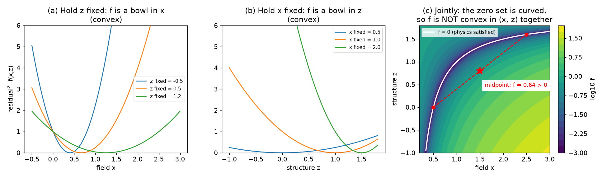

**How to read this figure.** This is a toy with one "field" number $x$ and one "structure" number $z$, and residual $(2 - z)x - 1$ (the same shape as $A(z)x - b$). Panel (a): for any fixed $z$ the squared residual is a bowl (parabola) in $x$. Panel (b): for any fixed $x$ it is a bowl in $z$. Panel (c): over both variables together, the set where physics is exactly satisfied (white curve) is *curved*. Two perfect points (red dots) joined by a straight line pass through a midpoint (star) where the residual is not zero. That is exactly what "not jointly convex" means: easy in each direction, tricky overall.

### Constraints and "hard" versus "soft"

A **hard constraint** must hold exactly ("subject to ..."). A **soft constraint** or **penalty** is something you only try to make small by putting it in the objective.

- Classic inverse design: physics ($A(z)x = b$) is **hard**; performance is the **objective** (soft, to be maximised).
- Objective-first: performance is **hard**; physics is the **objective** (soft, to be driven to zero).

### Mode overlap $c^\dagger x$

A **mode** is a stable field pattern that a waveguide carries (fundamental mode: one lobe; second-order mode: two lobes of opposite sign, and so on). To ask "how much of my output light is in mode $m$?", you compute an **overlap integral**: multiply your field by the complex conjugate of the mode's field and add up over the waveguide cross-section. In vector form this is $c^\dagger x$, where $c$ holds the mode pattern and $\dagger$ means "conjugate transpose". If $c$ is normalised suitably, $|c^\dagger x|^2$ is the fraction of power in that mode.

Worked example: if $c^\dagger x = 0.95\,e^{i\,0.3}$, then the amplitude is 0.95 and the power fraction is $0.95^2 \approx 0.90$, i.e. 90%.

### Augmented Lagrangian and ADMM, in brief

The paper says it solves its problem with **ADMM** (the **alternating direction method of multipliers**, Boyd et al. 2011, their ref. [2]). Here is the idea from zero.

**Lagrange multipliers.** To minimise $f(v)$ subject to $g(v) = 0$, add a "price" $u$ for violating the constraint: $L(v, u) = f(v) + u^\top g(v)$. The multiplier $u$ is called the **dual variable**.

**Augmented Lagrangian.** Add a quadratic penalty too, with weight $\rho > 0$:

$$L_\rho(v, u) = f(v) + u^\top g(v) + \frac{\rho}{2}\|g(v)\|^2$$

The penalty pulls towards feasibility; the multiplier remembers how much the constraint has been violated in the past and pushes harder where needed.

**ADMM.** If the variables split into two blocks, say $x$ and $z$, ADMM does not minimise over both at once. It does:

1. minimise $L_\rho$ over $x$ with $z, u$ fixed;
2. minimise $L_\rho$ over $z$ with $x, u$ fixed;
3. update the dual: $u \leftarrow u + \rho\, g(x, z)$.

and repeats. When each block problem is convex, each step is easy. That is exactly the bi-convex structure above. (ADMM's convergence proofs are for convex problems; for a bi-convex problem like this one it is a well-behaved *heuristic*, not a guaranteed global solver.)

### Level sets and steepest descent

A continuous permittivity (any value between 2.25 and 12.25 in each pixel) cannot be fabricated: real chips have silicon or no silicon. A **level-set** description fixes this. You keep a smooth function $\phi(\text{position})$; wherever $\phi > 0$ put silicon, wherever $\phi < 0$ put silica. The boundary of the device is the curve $\phi = 0$. Changing $\phi$ moves the boundary but the device is always strictly two-material. **Steepest descent** just means: take small steps downhill along the negative gradient.

## Abstract and §1 Introduction

> **In one sentence:** Hand-tuning a few parameters wastes the design space; this paper uses the *full* space of pixel shapes, needs no expert input, and designs devices just from a performance specification.

The authors make four claims:

1. **Use the full parameter space.** Most devices are tuned by a handful of numbers (widths, gaps, ring radii). A bigger parameter space contains all the old designs *and* more, so by definition the best device in it can only be as good or better. The problem has been that humans have no intuition for what such designs look like and cannot search millions of options by hand.
2. **Design-by-specification.** The user does not give a starting shape or tune anything. They only write down *what the device must do*: which input mode goes to which output mode, with what efficiency. The paper argues this might be enough to design "*all* linear nanophotonic devices". ("Linear" means the output is proportional to the input; no nonlinear optics.)
3. **Results.** Devices that are fully 3D, multi-mode, very small (a few square vacuum wavelengths), efficient, and manufacturable, some with new functions.
4. **Robustness.** Designs can be made robust to wavelength shifts, temperature shifts, and fabrication error.

Read claim 2 with a critical eye: the paper shows many devices, but "may indeed be capable of designing any linear nanophotonic device" is an aspiration, not a proof.

## §2 Problem formulation

> **In one sentence:** Minimise how badly the field breaks Maxwell's equations, while *forcing* the field to meet the performance specification and keeping the permittivity between silica and silicon.

Here is the central equation of the paper.

$$\min_{x_1,\dots,x_M,\,z} \;\; \sum_{i=1}^{M} \| A_i(z)\,x_i - b_i \|^2 \qquad \text{(1a)}$$

$$\text{subject to}\quad \alpha_{ij} \le |c_{ij}^\dagger x_i| \le \beta_{ij}, \quad i = 1..M,\; j = 1..N_i \qquad \text{(1b)}$$

$$z_{\min} \le z \le z_{\max} \qquad \text{(1c)}$$

Let us go through it line by line.

### What is a "mode" $i$ here?

The index $i = 1, \dots, M$ counts **excitations**: different input situations the device must handle. For a simple mode converter there is one ($M = 1$: "fundamental mode in at 1550 nm"). For a wavelength splitter there are two ("fundamental mode in at 1550 nm" and "fundamental mode in at 1310 nm"). Each excitation $i$ has its own field $x_i$, its own frequency $\omega_i$, its own source $b_i$, and so its own matrix $A_i(z)$. But all excitations share **one structure** $z$. That shared $z$ is what couples them together.

### Line (1a): the physics residual, now the thing to minimise

$A_i(z)x_i - b_i$ is the discrete version of $(\nabla \times \mu_0^{-1}\nabla \times - \omega_i^2\varepsilon)E_i + i\omega_i J_i$. The paper's substitutions are:

- $E_i \to x_i$ (field),
- $\varepsilon \to z$ (structure),
- $\nabla \times \mu_0^{-1}\nabla \times - \omega_i^2 \varepsilon \to A_i(z)$ (wave operator),
- $-i\omega_i J_i \to b_i$ (source).

In ordinary design, $A_i(z)x_i = b_i$ is a hard rule. Here it is *not* a constraint at all. It is only the quantity being minimised. So, during the optimisation, the fields $x_i$ are allowed to be **unphysical**. The authors call this the **objective-first** formulation (from their 2012 paper): the design objective is "prioritised above satisfying physics".

Why the *squared* norm? Because, as shown in the background, the squared norm of something affine is convex. That makes each sub-step a least-squares problem.

### Line (1b): the performance specification, now a hard constraint

$c_{ij}^\dagger x_i$ is the overlap between field $x_i$ and a chosen output pattern $c_{ij}$ (for example, "the second-order mode in the output waveguide"). The second index $j$ lets you list several output patterns for the same excitation. The constraint says: the amplitude of that overlap must lie between a lower bound $\alpha_{ij}$ and an upper bound $\beta_{ij}$.

The paper's example for a mode converter:

- $0.9 \le |c_{11}^\dagger x_1| \le 1.0$: most output in pattern 1 (the desired mode);
- $0.0 \le |c_{12}^\dagger x_1| \le 0.01$: almost nothing in pattern 2 (the unwanted mode, called a **rejection mode**).

The input itself is fixed by the source $b_i$ in the residual.

Because (1b) is a hard constraint, the field always meets the specification *exactly*, even if that means the field is unphysical. Hence the name "objective-first".

!!! note "Amplitude or power?"
    The text speaks of "≥ 90% of the input power", but the example constraint is on the *amplitude* $|c^\dagger x| \ge 0.9$. If $c$ is normalised so that $|c^\dagger x|^2$ is the power fraction, then amplitude 0.9 means power $0.81$. The paper is loose here. Just remember: amplitude bound $a$ corresponds to power bound $a^2$.

!!! note "Is (1b) convex?"
    The upper bound $|c^\dagger x| \le \beta$ is convex (a disc in the complex plane). The lower bound $|c^\dagger x| \ge \alpha$ is *not* (it is the outside of a disc, a ring with a hole). A common trick is to fix the phase of the overlap, which turns it into a linear (convex) constraint such as $\mathrm{Re}(c^\dagger x) \ge \alpha$. The 2013 paper does not say how it handles this; treat the field sub-problem as "convex, up to this detail".

### Line (1c): the structure constraint, a relaxation of "binary"

A real device is made of exactly two materials: $z \in \{z_{\min}, z_{\max}\}$ in each pixel (silica or silicon). That set is two isolated points per pixel, which is not convex and is very hard to optimise over. The paper **relaxes** it to the interval $z_{\min} \le z \le z_{\max}$: any value in between is allowed for now. The interval *is* convex. The price is a "grey" structure that must later be converted to black-and-white (see §3).

### Putting it together: why this is bi-convex

- Fix $z$. Each $x_i$ appears in $\|A_i(z)x_i - b_i\|^2$ (convex least squares) and in (1b). The $M$ field problems are *independent* of one another, so they can be solved in parallel.
- Fix all $x_i$. The objective is $\sum_i \|{-\omega_i^2}\,\mathrm{diag}(x_i)\, z + (D x_i - b_i)\|^2$, a convex least-squares problem in $z$, with the simple box constraint (1c).

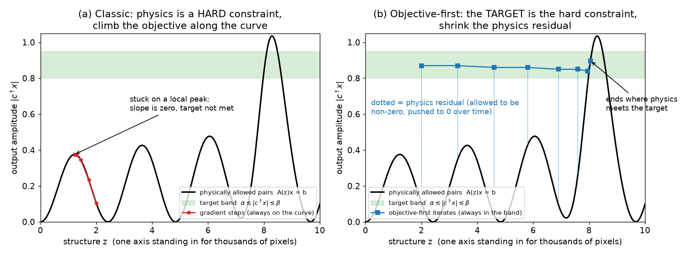

**How to read this figure.** The horizontal axis stands for "the structure" (really thousands of pixels). The black curve is every structure's *true* output: the only points where physics holds. The green band is the specification. (a) Classic gradient method: every iterate sits *on* the black curve. It climbs the nearest hill and stops at the top of a small peak, which is a local optimum that misses the target. (b) Objective-first: every iterate sits *inside* the green band. The dotted vertical line from each iterate down to the curve is the physics residual. The algorithm can slide sideways across "impossible" territory, where no real structure gives that output, and it only stops when the residual vanishes, which can only happen where the curve enters the band. This is the intuition for why objective-first can escape local optima. The real landscape has thousands of dimensions, and the cartoon is only a cartoon.

### Why this can escape local optima (and why it is not magic)

Three reasons it helps:

1. **It can walk through non-physical states.** A gradient method must move along the "manifold" of physically valid (field, structure) pairs. That surface is very wrinkled for wave problems, because interference makes performance oscillate as the structure changes. Objective-first is not tied to that surface. It can cut across.
2. **Each sub-step is solved exactly (globally).** In a convex sub-problem there are no false bottoms. The field step finds the *best* field for this structure under the spec. The structure step finds the *best* structure for this field. Nothing gets stuck *inside* a step.
3. **It never settles for "good enough".** A gradient method happily stops at a design with 40% efficiency if every small change makes it worse. Objective-first never lowers its demand: the field always hits the target. The only quantity it gives up on is the physics error, and that error is visible and measurable.

And the honest limits:

- **Bi-convex is not convex.** Alternating minimisation can stall at a point where neither step can improve on its own, but the residual is still not zero. Then the final, *physically verified* device does not meet the spec. You see exactly this in the results: the spec asked for ≥ 90% and the verified TE converter gives 86.4%.
- **Binarisation costs performance.** The relaxed structure is grey. Turning it into two materials changes the physics.
- **It needs a special solver.** You must be able to evaluate $A(z)x - b$ for an *arbitrary* $x$, and solve the field sub-problem with constraint (1b) added. A normal electromagnetic simulator (Meep, Tidy3D, Lumerical) only does "given $z$, find the physical $x$". It cannot run in this relaxed mode.

### Small worked example of a residual

Take one grid cell in 1D with spacing $\Delta = 20$ nm at $\lambda = 1550$ nm, so $k_0 = 2\pi/1.55 \approx 4.05\ \mu\text{m}^{-1}$ and $\omega^2 = k_0^2 \approx 16.4\ \mu\text{m}^{-2}$ (units with $c = 1$). Suppose the made-up field values at three neighbouring cells are $x_{k-1} = 0.98$, $x_k = 1.00$, $x_{k+1} = 0.98$, the cell is silicon ($z_k = 12.11$), and there is no source there ($b_k = 0$).

- 1D curl-curl: $(Dx)_k = -(x_{k+1} - 2x_k + x_{k-1})/\Delta^2 = -(0.98 - 2 + 0.98)/0.0004 = 0.04/0.0004 = 100$.
- Material term: $\omega^2 z_k x_k = 16.4 \times 12.11 \times 1.00 \approx 198.6$.
- Residual: $r_k = 100 - 198.6 = -98.6$.

That is far from zero, so this little field shape is not physical in silicon: it bends too slowly for that much silicon. Two possible fixes are exactly the two ADMM half-steps. **Field step:** make the field curve more. **Structure step:** lower $z_k$ to $100/16.4 \approx 6.1$ (between silica's 2.07 and silicon's 12.11). The structure step would set $z_k \approx 6.1$, which is an allowed "grey" value under (1c).

## §3 Method of solution

> **In one sentence:** Solve eq. (1) with ADMM: alternate a big 3D field solve (on cloud GPUs) and a small structure solve; at the end convert the grey structure into a level-set boundary and polish it by steepest descent.

The paper is very short here. It gives four facts:

1. **ADMM.** Eq. (1) is solved by iterating over the fields $x_i$, the structure $z$, and a **dual variable** $u_i$ (one per excitation). The paper does not spell out exactly how it splits the problem. The natural reading, consistent with the bi-convex structure, is: field update → structure update → dual update, repeated. The dual variable accumulates the physics residual, so the algorithm pushes harder on parts of the residual that refuse to go away.

2. **The field step is the expensive one.** In 3D, $x_i$ has millions of unknowns, and $A_i(z)$ is **ill-conditioned**. That means small errors in the right-hand side can cause large errors in the answer, so iterative solvers need many iterations. The authors used a home-built FDFD solver with a hardware-accelerated (GPU) iterative method, running on Amazon's Elastic Compute Cloud. Because the $M$ field problems are independent once $z$ is fixed, more excitations just means more machines in parallel, with "no significant penalty in runtime".

3. **The structure step is cheap.** The device is planar, so $z$ is a 2D image of only thousands of pixels. Also, as the background showed, the residual is *diagonal* in $z$ (each pixel's permittivity multiplies only that pixel's field). So the structure step is a small least-squares problem with a box constraint.

4. **Binarisation.** To get a device made of only two materials, the continuous $z$ is converted to a **boundary (level-set) parametrisation** (Osher & Fedkiw, ref. [4]), and the boundary is then tuned by **steepest descent**. In this last phase the structure is always strictly two-material.

### A runnable toy: objective-first in 1D

This snippet does the whole alternating loop on a tiny 1D "device": 120 cells of 20 nm, a point source on the left, and a specification "the field at cell 110 must equal 3.0". Only cells 30–89 may change, between $1.44^2$ and $3.48^2$. For simplicity it turns the spec (1b) into an equality on one probe cell and uses plain alternating minimisation (no dual variable).

```python
import numpy as np
# Toy 1D "objective-first" design: a(z) x = b with a = D - w^2 diag(z)
N, dx, lam = 120, 0.02, 1.55               # 120 cells of 20 nm, wavelength in um
w = 2*np.pi/lam                            # free-space wavenumber (c = 1)
D = (np.diag(-2*np.ones(N)) + np.diag(np.ones(N-1), 1) + np.diag(np.ones(N-1), -1)) / dx**2
D = -D                                     # 1D version of curl-curl: -d2/dx2
b = np.zeros(N); b[10] = 1/dx              # point source near the left end
out, target = 110, 3.0                     # objective: field at cell 110 must equal 3.0
design = slice(30, 90)                     # only these cells may change
zmin, zmax = 1.44**2, 3.48**2              # SiO2 ... Si permittivity
z = np.full(N, zmin)                       # start: all oxide
A = lambda z: D - w**2*np.diag(z)
for it in range(201):
    # x-step: min ||A x - b||^2 with x[out] fixed = target (a linear least squares)
    M = A(z); free = np.arange(N) != out
    x = np.zeros(N); x[out] = target
    x[free] = np.linalg.lstsq(M[:, free], b - M[:, out]*target, rcond=None)[0]
    # z-step: residual is LINEAR in z, and separable cell by cell -> exact + clip
    r0 = D @ x - b                         # residual = r0 - w^2 x*z
    zd = r0[design] / (w**2 * x[design] + 1e-12)
    z[design] = np.clip(zd, zmin, zmax)
    if it in (0, 1, 2, 5, 10, 20, 50, 200):
        res = np.linalg.norm(A(z) @ x - b)
        print(f"iter {it:3d}  physics residual = {res:.3e}")
# Check: solve the REAL physics with the final structure
x_true = np.linalg.solve(A(z), b)
print("objective asked for 3.0; true field at output =", round(x_true[out], 3))
print("fraction of design cells at a bound:", np.mean((z[design]<=zmin+1e-9)|(z[design]>=zmax-1e-9)).round(2))
```

**What you should see.** The physics residual falls steadily: about $10^2$ at iteration 0, about $0.8$ at iteration 5, about $3\times10^{-5}$ at iteration 20, and down to round-off ($\sim 10^{-10}$) by iteration 50. It never goes up, because each half-step is an exact minimisation. The final check, a *normal* simulation of the final structure, returns exactly 3.0 at the output. The spec was met and physics now holds. The last line shows the catch: only about 3% of the design cells ended at silica or silicon. The rest are grey. That is why the paper needs a separate binarisation (level-set) stage. The 1D toy is far easier than 3D, so do not expect such clean convergence in real problems.

## §4 Results (overview)

> **In one sentence:** A gallery of 3D devices (converters, splitters, hubs, fibre couplers, a broadband splitter) designed purely from specifications, in a 250 nm silicon slab clad in silica.

Common setup for every result:

- **Platform:** a 250 nm silicon slab, fully etched, fully surrounded by silica. ($\varepsilon_{\text{Si}} = 12.25$, $\varepsilon_{\text{SiO}_2} = 2.25$.) Note this is 250 nm, not the 220 nm standard you will use.
- **Size:** footprints of "a few square vacuum wavelengths". At 1550 nm one square vacuum wavelength is $1.55^2 \approx 2.4\ \mu\text{m}^2$. A $1.6 \times 2.4\ \mu\text{m}$ device is $3.84\ \mu\text{m}^2 \approx 1.6\lambda^2$. A $2.8 \times 2.8\ \mu\text{m}$ device is $7.84\ \mu\text{m}^2 \approx 3.3\lambda^2$. A conventional MMI or directional coupler is often tens to hundreds of $\mu\text{m}^2$.
- **Figure pairs.** Most devices have two figures. A **performance specification** figure shows the input mode(s) on the left, the desired output mode(s) on the right, and the final 3D structure in the middle. A **final result** figure shows the top-view permittivity (black = silicon, white = silica, colour bar from 2.25 to 12.25) and the field amplitude when the *real* physics is simulated.
- **Reported numbers are verified numbers.** They come from simulating the final binary device normally. That is why they are often *below* the ≥ 90% that the spec demanded: the objective-first optimisation did not drive the physics residual fully to zero, and/or binarisation cost some performance.

!!! warning "About the figure images on this page"
    The figure images were extracted automatically from the PDF, and several extractions went wrong. For about half of the figures, the file saved under number N is a copy of a neighbouring figure. Every image file is still shown below in its place. Where the image is not the figure named in the caption, this is said clearly, and the missing figure is described from the paper's caption. If you want to see the real figure, open arXiv:1303.5823.

## §4.1 Mode converters

A **mode converter** takes light in one waveguide mode and turns it into another mode (here: fundamental → second-order). It has a single input and a single output. It matters because **mode-division multiplexing**, sending different data streams in different modes of the same waveguide, needs efficient converters.

The two devices show that the method is genuinely 3D. Each is $1.6 \times 2.4\ \mu\text{m}$ at 1550 nm.

### §4.1.1 TE mode converter

**TE** (transverse electric) means the main electric field component, $E_y$, lies *in the plane* of the slab. Spec: ≥ 90% of input power into the second-order TE mode; ≤ 1% left in the fundamental mode.

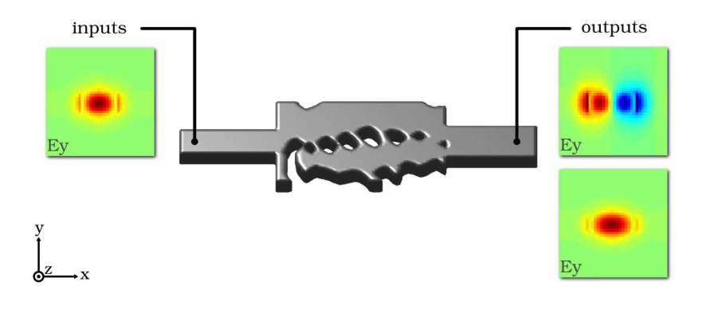

**How to read this figure.** Left box: the input, the fundamental TE mode ($E_y$, one red lobe). Middle: the final 3D structure, a silicon slab with irregular holes (rendered in grey). Right, top: the desired output, the second-order mode (two lobes, red and blue, meaning opposite signs). Right, bottom: the **rejection** mode, the fundamental mode at the output, which should carry ≤ 1%. The axes show $x$ along the propagation direction, $y$ across, and $z$ out of the page. This is the template for every "specification" figure in the paper.

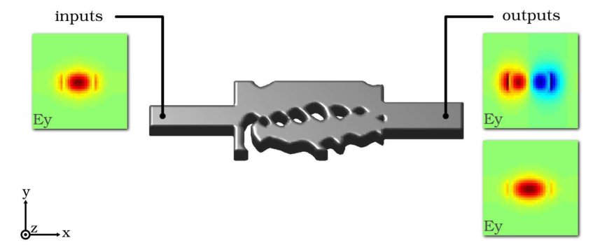

**How to read this figure.** *Heads-up: the extracted image here is a second copy of Fig. 1.* The real Fig. 2 shows two panels. On the left is the top-view permittivity of the device, a 1.6 × 2.4 µm pattern. On the right is a colour map of the $E_y$ field at 1550 nm, showing the single-lobe input turning into a two-lobe output. **Result:** 86.4% into the second-order mode and 0.7% into the fundamental mode. The rejection spec (≤ 1%) is met. The conversion spec (≥ 90%) is not quite met. The authors suggest that **evanescent modes** "interfering" with the output overlap calculation may be the cause. Evanescent modes are non-propagating fields that decay near the device; if the output monitor is close to the device they still contaminate the overlap.

### §4.1.2 TM mode converter

**TM** (transverse magnetic) here means the main electric field component, $E_z$, points *out of the plane*, through the thickness of the slab. A TM mode cannot be modelled by a 2D simulation of the top view, so a TM design is a real test of the method's 3D capability. The *only* change to the user's input is the polarisation of the input and output modes. This is what "design-by-specification" buys you.

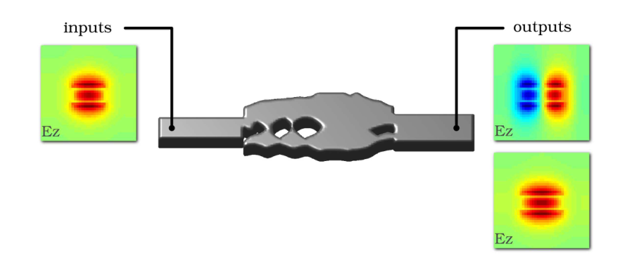

**How to read this figure.** Same layout as Fig. 1, but the mode plots now show $E_z$. The input is the fundamental TM mode. The desired output is the second-order TM mode (blue and red halves). The rejection mode is the fundamental TM mode at the output. The horizontal stripes inside each mode plot come from the field's variation through the slab thickness, which is how you can tell these are out-of-plane fields. The 3D structure in the middle is different from the TE design: fewer, larger holes.

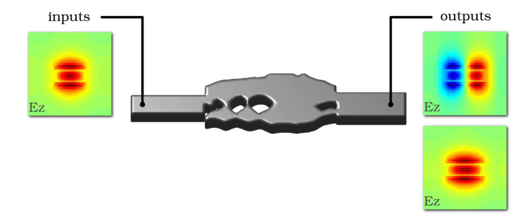

**How to read this figure.** *Heads-up: the extracted image here is a second copy of Fig. 3.* The real Fig. 4 shows the permittivity at the central plane (colour bar 2.25–12.25, 1 µm scale bar) and the $E_z$ amplitude at 1550 nm. **Result:** 76.9% conversion and 1.0% rejection, on a 1.6 × 2.4 µm footprint. The authors explain the lower efficiency by the weaker confinement of TM modes in such a thin slab. A 250 nm slab is thin compared with the wavelength in silicon ($1550/3.5 \approx 443$ nm). The out-of-plane field therefore pushes much of its energy into the silica, where the pattern has less control over it.

## §4.2 Mode splitters

A **splitter** (demultiplexer) sends different kinds of input light to different outputs. These are the core parts for carrying several signals in one waveguide. Three versions are shown: split by **spatial mode**, by **polarisation**, and by **wavelength**. The spec for each: > 90% of the input power into the correct output, < 1% into the wrong one.

### §4.2.1 Spatial mode splitter

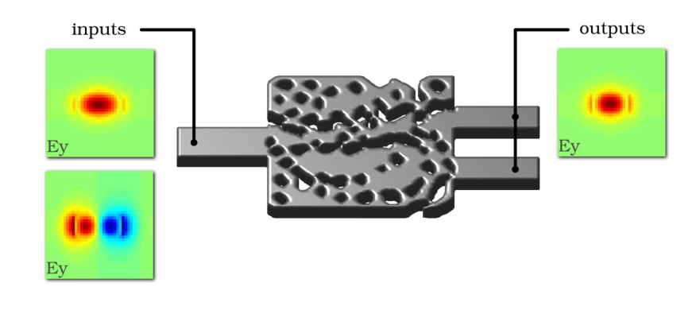

**How to read this figure.** Two possible inputs on the left, both in the same input waveguide. Top: the fundamental TE mode. Bottom: the second-order TE mode (two opposite lobes). One output pattern is shown on the right: the fundamental mode of whichever output waveguide is the target. The middle is the final 3D structure, a 2.8 × 2.8 µm slab full of holes, with one input waveguide and two output waveguides. Each input mode must end up as the *fundamental* mode of its own arm. So the device both separates and converts.

The authors say this is the first 3D design of such a device; earlier designs were only 2D (Jiao, Fan & Miller 2005, ref. [5]).

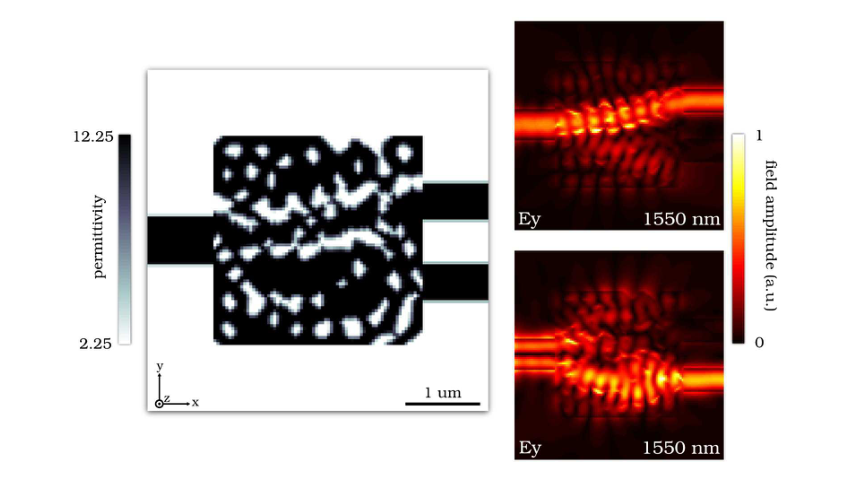

**How to read this figure.** Left: the top-view permittivity (black = silicon). The pattern is a "Swiss cheese" of irregular holes, with one waveguide in on the left and two out on the right. Right: the field for each of the two inputs (both at 1550 nm). In the top map the light snakes into the upper arm; in the bottom map it goes to the lower arm. The image does not label which input mode is which; the caption only gives the two arms' numbers. **Result:** 88.7% (upper) and 77.4% (lower) efficiency, with rejection 0.27% and 0.20%. Footprint 2.8 × 2.8 µm.

### §4.2.2 TE/TM (polarisation) splitter

This device separates the fundamental TE mode ($E_y$-dominant) and the fundamental TM mode ($E_z$-dominant) into separate arms. The authors say it is the first device of its kind in which one footprint controls both polarisations.


**How to read this figure.** *Heads-up: the extracted image here is a copy of Fig. 6 (the spatial-mode splitter result).* The real Fig. 7 is a specification figure. It shows the same device geometry with two possible inputs, the fundamental TE ($E_y$) and the fundamental TM ($E_z$) mode, and the matching output modes in their target arms. Spec: > 90% into the right arm, < 1% into the other.

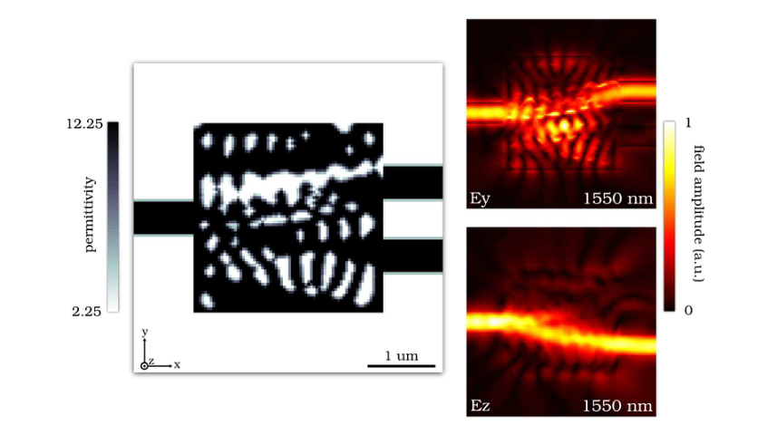

**How to read this figure.** Left: the permittivity. The holes here are elongated vertical slots arranged in rows, a hint that the structure acts differently on in-plane and out-of-plane fields. Right, top: the $E_y$ (TE) input at 1550 nm, which ends up in the upper arm. Right, bottom: the $E_z$ (TM) input, which passes smoothly to the lower arm. The TM field is spread out because TM is weakly confined in this thin slab. **Result:** 87.6% and 88.8% efficiency, rejection 1.06% and 0.58%, on 2.8 × 2.8 µm.

### §4.2.3 Wavelength splitter

The same idea, but split by colour. 1550 nm goes to the top arm, 1310 nm to the bottom arm, on 2.8 × 2.8 µm. These are the two main telecom bands (the C-band and the O-band).


**How to read this figure.** *Heads-up: the extracted image here is a copy of Fig. 8 (the TE/TM splitter result).* The real Fig. 9 is a specification figure. The fundamental TE input arrives at either 1550 nm or 1310 nm. The 1550 nm light must reach the fundamental mode of the top output and the 1310 nm light the bottom output, each with > 90% and < 1% crosstalk. (One caption line in the source says "1330 nm"; the rest of the paper says 1310 nm, so read it as 1310 nm.)

This is the first example where $M = 2$ in eq. (1). There are two excitations at two frequencies, $\omega_1 = 2\pi c/1550\text{ nm}$ and $\omega_2 = 2\pi c/1310\text{ nm}$, with two fields $x_1, x_2$ but one shared structure $z$. The two field sub-problems run in parallel.

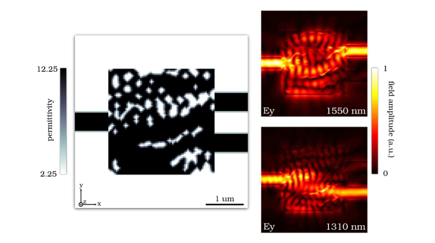

**How to read this figure.** Left: the permittivity. It is mostly solid silicon with scattered small holes and a curved line of holes near the bottom that seems to steer light. Right, top: at 1550 nm the field spreads through the device and exits the upper arm. Right, bottom: at 1310 nm it exits the lower arm. **Result:** 83.2% (upper) and 78.7% (lower), rejection 0.49% and 1.66%. This narrowband design comes back in §4.5, where its spectrum turns out to be very peaked.

## §4.3 Hubs

A **hub** is a multi-input, multi-output device that re-arranges which input goes to which output. It is a general "cross-connect": signals can cross each other inside one silicon layer without any extra layers or waveguide crossings. These devices show that overlapping signals can be routed in a single layer.

### §4.3.1 3×3 hub


**How to read this figure.** *Heads-up: the extracted image here is a copy of Fig. 10 (the wavelength splitter result).* The real Fig. 11 shows three input waveguides on the left and three output waveguides on the right. All inputs and outputs are the fundamental TE mode. The spec is > 90% into the chosen output arm. **No rejection modes** are used (to save computation). The spec says nothing about where the leftover light goes.


**How to read this figure.** Left: the permittivity. Three waveguides enter on the left and three leave on the right, separated by white silica gaps. The design region is mostly silicon with streaks of holes. Right: three field plots at 1550 nm, one per input arm (top to bottom). Each input beam is steered diagonally to a different output, and one beam climbs from the bottom input to the top output. So the paths cross each other inside a single layer. **Result:** 88.6%, 90.6%, 87.3% for inputs 1, 2, 3.

### §4.3.2 4×4 hub

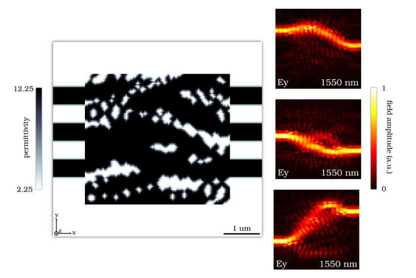

**How to read this figure.** *Heads-up: the extracted image here is a copy of Fig. 12 (the 3×3 hub result).* The real Fig. 13 shows four inputs and four outputs, all fundamental TE, > 90% target, no rejection modes. It sends inputs 1, 2, 3, 4 to outputs 3, 2, 4, 1 respectively.

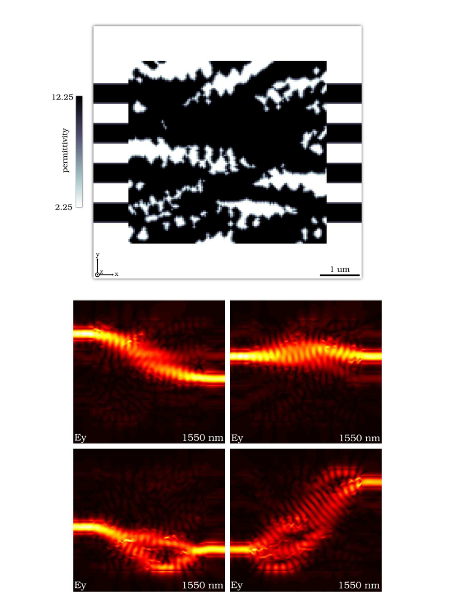

**How to read this figure.** Top: the permittivity of the 4×4 hub, with four waveguides on each side. Bottom: four field plots at 1550 nm, one per input. Each beam bends across the device to a different output, and the beams' paths overlap in the middle. **Result:** 85.9%, 88.1%, 85.4%, 84.3%. With $M = 4$ excitations, the four field solves are independent and run in parallel, which is where the cloud solver pays off.

### §4.3.3 2×2×2 hub

Now combine routing *and* wavelength. There are two inputs, two outputs and two wavelengths (hence "2×2×2"). At 1550 nm the waveguides are **uncoupled** (input 1 → output 1, input 2 → output 2: "bar" state). At 1310 nm they are **cross-coupled** (input 1 → output 2, input 2 → output 1: "cross" state). That makes $M = 4$ excitations (2 inputs × 2 wavelengths).

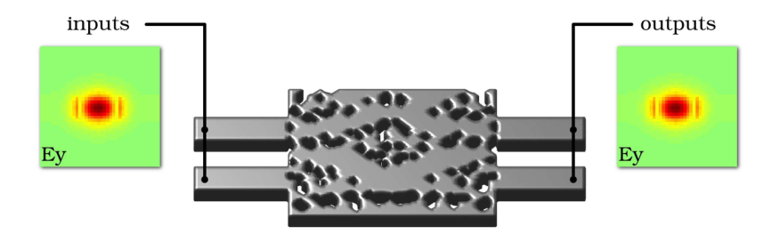

**How to read this figure.** Two parallel input waveguides on the left and two outputs on the right, with the final 3D structure in between. All modes are the fundamental TE mode ($E_y$, one lobe). The figure does not show the routing table; the caption gives it. Note the spec here is relaxed to > 80% (not 90%), and no rejection modes are used.

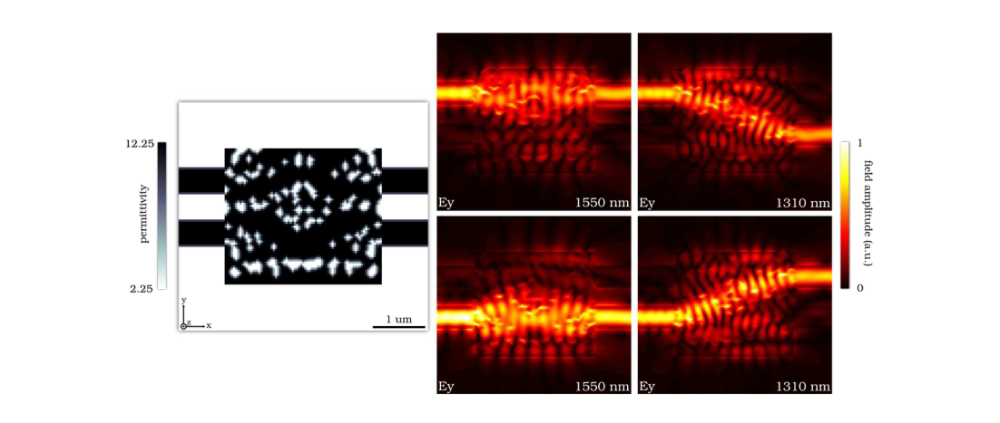

**How to read this figure.** Left: the permittivity, mostly silicon with a symmetric-looking scatter of small holes. Right: a 2×2 grid of field maps. The rows are the top and bottom inputs; the columns are 1550 nm and 1310 nm. At 1550 nm (left column) each input goes straight through to its own output. At 1310 nm (right column) each input crosses to the other output. **Result:** 77.6% and 73.7% at 1550 nm; 75.7% and 75.2% at 1310 nm. All are just below the relaxed 80% spec.

## §4.4 Fibre couplers

A **fibre coupler** brings light from an optical fibre into an on-chip waveguide. Here the fibre points straight down onto the chip (**normal incidence**), as with a grating coupler (Van Laere et al. 2007, ref. [6]). The light must turn 90° into the plane and also be squeezed from a fibre-sized spot into a narrow waveguide.

Two choices make these designs easier:

- **A smaller, lower-contrast fibre.** The "fibre" is a 2 µm diameter core with $n_{\text{core}} = 1.6$ in cladding $n = 1.5$. That is much smaller than a real single-mode fibre (core ≈ 8–9 µm), so the simulation and the device stay small.
- **Half-depth etch.** These devices are etched only halfway through the slab. Full etching gives a structure that is mirror-symmetric top-to-bottom, so light would be sent up and down equally. Half etching breaks that symmetry ("increase the asymmetry"), which lets the device favour one direction.

### §4.4.1 Compact fibre coupler

"Compact" means that two jobs, turning light into the plane and focusing it into a narrow waveguide, happen in the *same* footprint. Normally a grating coupler is followed by a long taper.

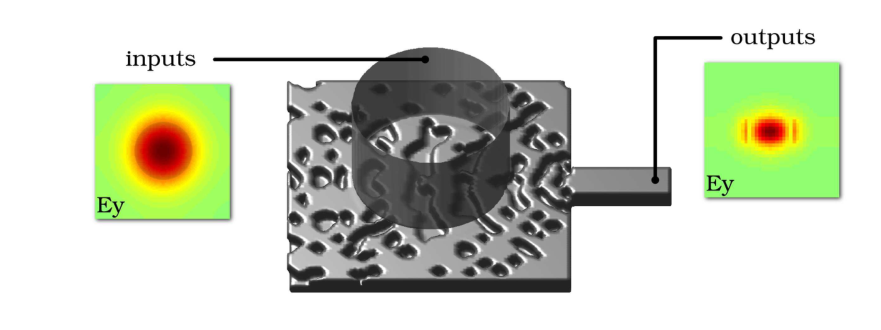

**How to read this figure.** The input on the left is the fibre's fundamental mode ($E_y$-polarised, a round spot). The translucent cylinder above the device is the fibre, pointing down. The output on the right is the fundamental TE mode of the in-plane waveguide. Spec: > 90%.

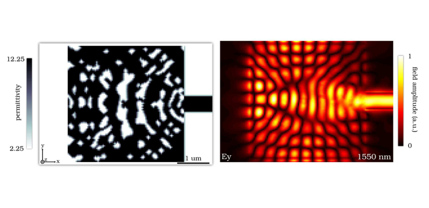

**How to read this figure.** Left: the permittivity. Note the curved, concentric arcs of holes near the output waveguide. They look like a **focusing grating**, which the method found by itself. Right: the $E_y$ amplitude at 1550 nm. A checkerboard of standing waves under the fibre spot gathers into a bright beam leaving through the waveguide on the right. **Result:** 51.5% coupling, far below the 90% spec. The authors note that this is still probably the highest reported efficiency for a *compact* coupler of this kind (at the time).

### §4.4.2 Mode-splitting fibre coupler

Now a fibre coupler *and* a mode splitter in one device. Different fibre modes go to different on-chip waveguides.


**How to read this figure.** *Heads-up: the extracted image here is a copy of Fig. 18 (the compact fibre coupler result).* The real Fig. 19 shows two possible inputs: the fundamental fibre mode, or the "third-order, circularly polarised" fibre mode. Each must go into the fundamental TE mode of a different in-plane output waveguide.

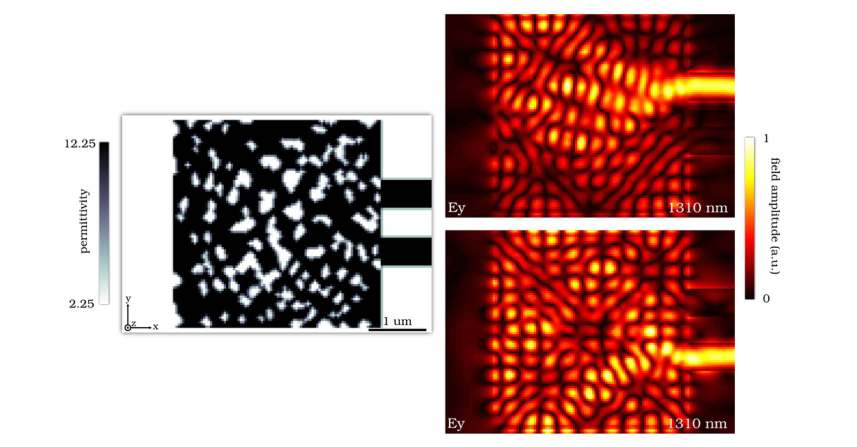

**How to read this figure.** Left: the permittivity, an irregular pattern with two output waveguides on the right. Right: two $E_y$ field maps (both labelled 1310 nm in the image). Top: the fundamental fibre mode input, which exits through the upper waveguide. Bottom: the third-order input, which exits through the lower one. **Result:** 32.6% and 22.7%. That is low, but the point is that no device with this combined function had been shown before.

### §4.4.3 Wavelength-splitting fibre coupler

A fibre coupler plus a wavelength splitter: 1550 nm to the upper waveguide, 1310 nm to the lower waveguide.


**How to read this figure.** *Heads-up: the extracted image here is a copy of Fig. 20 (the mode-splitting coupler result).* The real Fig. 21 shows the $E_y$-polarised fundamental fibre mode as the input at either 1310 or 1550 nm. The outputs are the fundamental TE modes of the two in-plane waveguides, upper for 1550 nm and lower for 1310 nm, with a > 90% spec.

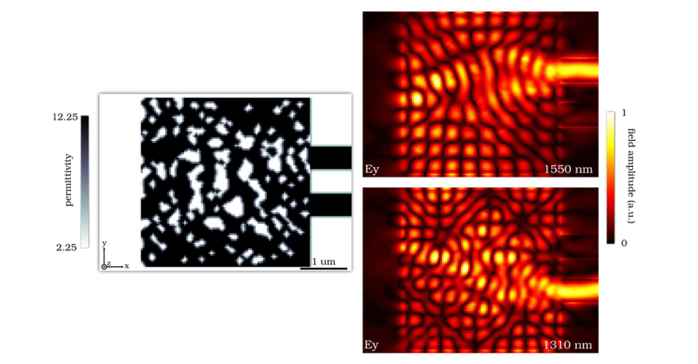

**How to read this figure.** Left: the permittivity. Right: $E_y$ at 1550 nm (top), which leaves through the upper waveguide, and at 1310 nm (bottom), which leaves through the lower waveguide. **Result:** 31.6% at 1550 nm and 28.6% at 1310 nm. That is low, but it was a new combination of functions.

**Pattern across §4.4.** The more jobs packed into one tiny footprint, the lower the verified efficiency. This is the general rule that SPINS (the other paper today, §5.2) states openly: more function per area needs more area or more freedom.

## §4.5 Broadband wavelength splitter

So far every device was designed at one or two exact wavelengths. Real devices must work over a **band** of wavelengths.

**Step 1: check the old design.** The wavelength splitter of Fig. 10 is simulated over a range of wavelengths.


**How to read this figure.** *Heads-up: the extracted image here is a copy of Fig. 22 (the wavelength-splitting fibre coupler result).* The real Fig. 23 is a line plot of "percent transmitted" (0 to 1) against wavelength (about 1250–1650 nm) for the two outputs of the Fig. 10 splitter. High transmission occurs only very close to the two design wavelengths (marked with arrows), and it falls off quickly on either side. **Lesson:** optimising at a single wavelength gives a device that works *only* at that wavelength.

**Step 2: ask for a band.** The spec is changed to include **several target wavelengths** around each centre, each with the same requirement. In eq. (1) this simply means more excitations $i$: five wavelengths around 1310 nm plus five around 1550 nm gives $M = 10$ field problems. They are all independent once $z$ is fixed, so they run in parallel. This is the same idea as SPINS's "broadband objective" (its Appendix B.3.3), where you sum the objective over nearby wavelengths.

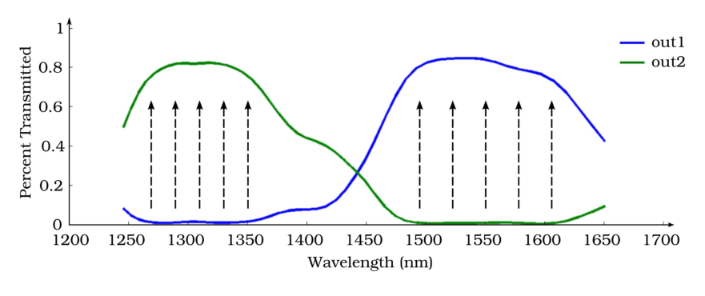

**How to read this figure.** The horizontal axis is wavelength (1200–1700 nm). The vertical axis is the fraction transmitted (0–1). Blue (out1) is the 1550 nm arm; green (out2) is the 1310 nm arm. The vertical dashed arrows mark the target wavelengths used in the spec: five near 1270–1350 nm and five near 1500–1610 nm. Green is about 0.8 across roughly 1270–1360 nm, and blue is about 0.8–0.85 across roughly 1500–1600 nm. The other arm is near zero in each band. **Takeaway:** asking for performance at several nearby wavelengths gives a wide, flat passband instead of a sharp peak.

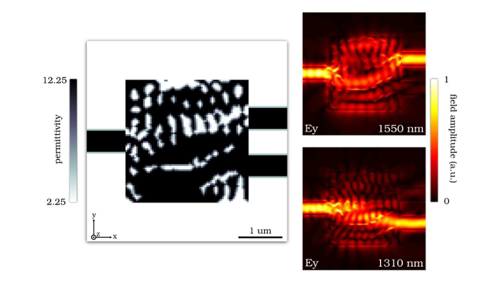

**How to read this figure.** Left: the permittivity. It is still mostly silicon with holes, but the pattern differs from the narrowband design in Fig. 10. Right: $E_y$ at 1550 nm (top), which goes to the upper arm, and at 1310 nm (bottom), which goes to the lower arm. The caption makes a striking point: at the centre wavelengths, this broadband device is *more* efficient than the narrowband one. Asking for more did not cost performance at the centre. A possible reason is that the broadband spec steers the optimiser away from fragile, resonance-based solutions.

### §4.5.1 Temperature robustness

Silicon's refractive index rises with temperature. The **thermo-optic coefficient** is $\Delta n_{\text{Si}}/\Delta T = 1.85\times10^{-4}\ \text{K}^{-1}$. Silica's is set to zero for this study (it is about 10× smaller in reality). A warmer device acts like a device with slightly more silicon. Its spectrum shifts to longer wavelengths (a **red-shift**).

**Worked example.** Over $\Delta T = 905$ K:

$$\Delta n = 1.85\times10^{-4}\times 905 \approx 0.167$$

so $n_{\text{Si}}$ goes from 3.50 to about 3.67, a rise of about 4.8%. A rough rule says the spectral features shift by about the same fraction: $\Delta\lambda \approx \lambda\,\Delta n / n \approx 1550 \times 0.048 \approx 74$ nm. (This rough rule ignores dispersion and the fact that only part of the light is in silicon.) The broadband device has passbands about 100 nm wide. So even a large shift still leaves the original centre wavelengths inside the passband.


**How to read this figure.** *Heads-up: the extracted image here is a copy of Fig. 25 (the broadband splitter result).* The real Fig. 26 is a line plot of percent transmitted against wavelength for five temperature shifts from $\Delta T = 0$ to 905 K. The curves slide towards longer wavelengths as the device heats up. **Stable operating points** exist, meaning wavelengths where efficiency stays at or above 80% for *every* temperature shift, near roughly 1336 nm and 1554 nm. So the device keeps working over a 905 K range.

Why does this matter? A chip next to a CPU might see temperature swings of tens of kelvin, far less than 905 K. So, in principle, such a device could be **passively** temperature-stable: no heaters and no feedback control. (The 905 K figure is a simulation stress test. Real chips would melt or be damaged long before that.)

### §4.5.2 Fabrication robustness

Real lithography never reproduces the drawing exactly. A very common error is uniform **over-etch** (every hole is a bit larger, so every silicon feature is thinner) or **under-etch** (the opposite). The paper simulates a uniform edge shift of the device region (the input and output waveguides are left unchanged) of ±4 nm and ±8 nm.

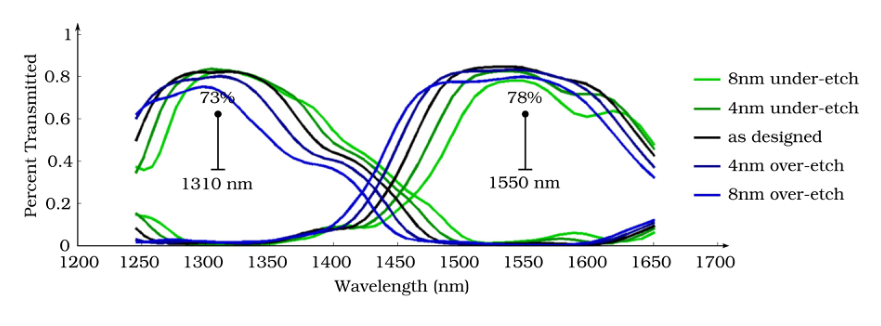

**How to read this figure.** The horizontal axis is wavelength. The vertical axis is the fraction transmitted. There are five curves per arm: 8 nm under-etch (light green), 4 nm under-etch (dark green), as designed (black), 4 nm over-etch (dark blue), 8 nm over-etch (light blue). Over-etch (less silicon) shifts the spectrum to *shorter* wavelengths, and under-etch shifts it to *longer* wavelengths, the same physics as temperature. The markers show the worst-case efficiency at the design wavelengths across all five cases: **73% at 1310 nm** and **78% at 1550 nm**. So ±8 nm of etch error still leaves > 70% efficiency.

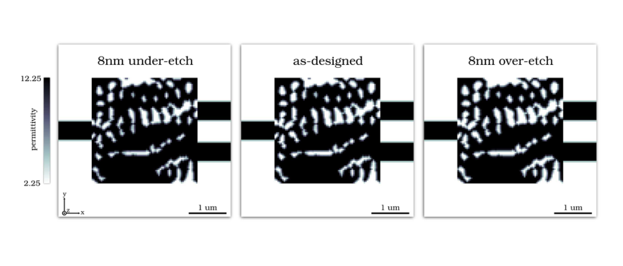

**How to read this figure.** Three permittivity maps side by side: 8 nm under-etch, as designed, 8 nm over-etch. You can barely see a difference. Holes are slightly smaller on the left and slightly larger on the right. The design's **pixel size is 40 nm**, so an 8 nm shift is a fifth of a pixel. This shows how small the fabrication changes are next to the device's own features, yet a non-robust device could still fail from them.

**The authors' interpretation.** Designing for **broadband** operation appears to be a good *heuristic* for robustness to temperature and fabrication error. Temperature and etch errors both mainly *shift the spectrum*, and a broad, flat passband tolerates shifts. They add that the formulation could also handle temperature or fabrication variations *explicitly*: just add excitations $i$ with perturbed structures. They did not show that here. That explicit approach is the one your project takes.

## §5 Conclusion

> **In one sentence:** A specification-driven, fully 3D method that designed many small, efficient, novel devices, and a broadband design that tolerated 905 K of temperature shift and ±8 nm of etch error.

The paper's closing claims:

- The method designs **linear, fully 3D, multi-mode** devices that are compact, efficient and manufacturable (binary, via the level-set step).
- Many of the devices (3D spatial-mode splitter, TE/TM splitter, hubs, combined fibre couplers) had not been shown before, and "cannot be designed by hand".
- The user only writes the performance spec ("design-by-specification").
- A broadband design gave stable operating wavelengths over a 905 K temperature shift and ±8 nm etch error. The authors suggest wavelength tolerance as a **heuristic** for temperature and fabrication tolerance.

**Reading critically.** Every result is simulated; there is no fabricated device in this paper. Many verified efficiencies sit 5–15 points below the spec, and the fibre couplers are far below it. The method's main selling point is reaching *unusual* functionality from a pure spec, not peak efficiency. Later work from the same group (Piggott et al. 2015 onwards, and SPINS) moved to **adjoint gradient descent with continuous relaxation**, keeping physics exact and solving with ordinary simulators. See today's SPINS page.

## How this connects to your project

Your project is robust, fabrication-aware inverse design of silicon photonic devices with Meep/Tidy3D, Monte-Carlo yield estimation, and possibly an ML surrogate. This paper feeds it in three ways:

1. **Algorithm choice (today's EXIT).** It is the clearest example of the *alternative* to the adjoint gradient descent you will use. Knowing why you are *not* using it is part of your methods section. Meep's adjoint module and Tidy3D's `invdes` only solve "given ε, find the physical field". They cannot evaluate an arbitrary non-physical field's residual or add (1b) to the field solve. Objective-first would need your own FDFD solver.
2. **Robustness via broadband (§4.5).** This is an early, explicit statement that broadband optimisation is a cheap proxy for temperature and etch robustness. It also says perturbed structures could be added *explicitly* as extra excitations. That is exactly the "average over eroded / nominal / dilated variants" objective your project uses. Cite it as an ancestor of the robustness idea, together with SPINS's eq. (2) and Appendix C.
3. **Etch numbers.** ±8 nm uniform edge shift with 40 nm pixels is a useful reference point for the size of the erosion/dilation you will simulate in your Monte-Carlo yield study.

## Draft EXIT note: objective-first vs direct gradient descent

Use this as a starting point and rewrite it in your own words.

> **Objective-first (Lu & Vučković 2012/2013).** Treats the performance spec as a hard constraint and the Maxwell residual $\|A(z)x - b\|^2$ as the objective. The problem is bi-convex (convex in field for fixed structure, convex in structure for fixed field), so it is solved by alternating convex sub-problems (ADMM). Because iterates may be non-physical, it can cross between basins that trap a gradient method, and it never lowers its performance demand. Costs: needs a custom solver that can evaluate residuals of arbitrary fields and add constraints to the field solve; the converged point may leave a non-zero residual, so the verified device misses the spec; the result is grey and must be binarised separately; tuning (ADMM penalty, bounds) is delicate.
>
> **Direct gradient descent with the adjoint.** Keeps physics exact at every step (one forward plus one adjoint simulation per gradient), and optimises a figure of merit with L-BFGS / MMA / Adam. Has an unambiguous state (each iterate *is* a real device with a real performance), runs on standard solvers (Meep, Tidy3D, ceviche), and is easy to extend: robust objectives (erosion/dilation averages), filters, projections and fabrication constraints all chain into the gradient.
>
> **When to use which.** Objective-first: many degrees of freedom, a single sharply defined target, a willingness to own the solver, and a wish to leave human intuition behind. Gradient descent: whenever you need a standard solver, a reliable convergence story, and an objective you will keep extending, which is my case, because the robust (multi-variant) objective is the core of the project.

!!! warning "Common confusions"
    - **"Objective-first ignores physics."** No. Physics is the thing being minimised, and the final device is checked with a normal, fully physical simulation. It is only allowed to be wrong *during* the search.
    - **"Bi-convex means convex, so it finds the global optimum."** No. Each half-step is convex, but the joint problem is not. Alternating methods can stall with a non-zero residual.
    - **"The spec is a target the optimiser aims for."** In this paper the spec is a *hard constraint* on the field. The *field* always meets it. Whether the *device* meets it is only known after the final physical simulation.
    - **"ADMM is a gradient method."** ADMM alternates exact block minimisations plus a dual update. It does not take small gradient steps on the design (except in the final level-set polish, which is steepest descent).
    - **"z is the design parameter, like p in SPINS."** Here $z$ *is* the permittivity of each pixel, relaxed to a continuous value. There is no separate parametrisation layer until the level-set binarisation step.
    - **"Robust to 905 K" means it works on a 905 K chip.** It is a simulated stress test of a refractive-index shift, showing that a stable operating wavelength exists over that range.
    - **"The figures on this page are all correct."** Several image files are copies of neighbouring figures (extraction error). Each case is flagged above.

## Check yourself

1. In eq. (1), which line is the "objective" and which lines are the hard constraints? How is this the reverse of ordinary inverse design?

    ??? note "Answer"
        (1a), the summed squared physics residual $\sum_i\|A_i(z)x_i - b_i\|^2$, is the objective. (1b), the overlap bounds (the performance spec), and (1c), the permittivity box, are hard constraints. In ordinary inverse design, physics $A(z)x = b$ is a hard constraint and performance is the objective.

2. Show that $A(z)x$ is linear in $z$ when $x$ is held fixed.

    ??? note "Answer"
        $A(z)x = Dx - \omega^2\mathrm{diag}(z)x = Dx - \omega^2 (z \odot x) = Dx - \omega^2\mathrm{diag}(x)z$. With $x$ fixed, $Dx$ is a constant vector and $-\omega^2\mathrm{diag}(x)$ is a constant matrix, so the expression is affine in $z$.

3. Why does bi-convexity make the alternating method attractive, and why is it not a guarantee of a global optimum?

    ??? note "Answer"
        Each sub-problem (field with structure fixed, structure with field fixed) is convex, so it can be solved exactly and reliably, and the objective never increases. But the joint function is not convex (its zero set is curved, so midpoints of good points can be bad). The alternation can therefore stop at a point where neither block can improve on its own but the residual is still non-zero.

4. Give two reasons objective-first can escape local optima that trap gradient descent.

    ??? note "Answer"
        (i) Iterates need not be physical, so the search can cross regions where no real device exists and move between basins. (ii) The performance demand is never relaxed, so the method does not settle on a mediocre physical design whose local gradient is zero. Also, each sub-step is solved globally, so nothing gets stuck *within* a step.

5. The TE converter spec asked for ≥ 90%, yet the result is 86.4%. How can that be, if (1b) is a hard constraint?

    ??? note "Answer"
        (1b) constrains the *optimisation field* $x$, which may be non-physical. The reported 86.4% comes from a normal simulation of the final binary structure. If the residual did not reach zero, or binarisation changed the device, the real field differs from $x$ and misses the spec. The authors also blame evanescent modes in the overlap calculation.

6. Why is the field step expensive and the structure step cheap?

    ??? note "Answer"
        The field lives on the full 3D grid (millions of unknowns) and requires solving an ill-conditioned linear system, done on GPUs in the cloud. The structure is a planar 2D image (thousands of pixels), and the residual is diagonal in $z$ (each pixel's $z$ multiplies only its own field value), so the structure step is a small, almost separable least-squares problem.

7. What does relaxing $z \in \{z_{\min}, z_{\max}\}$ to $z_{\min} \le z \le z_{\max}$ buy, and what does it cost? How does the paper pay the cost?

    ??? note "Answer"
        It turns a non-convex, combinatorial set into a convex interval, so the structure step is convex. The cost is a "grey" structure that cannot be fabricated. The paper converts $z$ to a level-set (boundary) representation, which is always two-material, and polishes it with steepest descent.

8. In the wavelength splitter, what is $M$, and what is shared between the excitations?

    ??? note "Answer"
        $M = 2$: one excitation at 1550 nm and one at 1310 nm, each with its own field $x_i$, frequency $\omega_i$, source $b_i$ and operator $A_i(z)$. They share the single structure $z$. For the broadband version, $M$ grows to about 10, one per target wavelength.

9. Estimate the spectral shift from a 905 K temperature rise using $dn/dT = 1.85\times10^{-4}\,\text{K}^{-1}$ and $n = 3.5$ at 1550 nm.

    ??? note "Answer"
        $\Delta n \approx 0.167$, so $\Delta n / n \approx 4.8\%$, and $\Delta\lambda \approx 1550 \times 0.048 \approx 74$ nm (a rough estimate that ignores dispersion and the fraction of light in silica). A passband about 100 nm wide can absorb this.

10. Why do over-etch and heating shift the spectrum in *opposite* directions?

    ??? note "Answer"
        Over-etch removes silicon, which lowers the effective index, so features move to shorter wavelengths (blue-shift). Heating raises silicon's index, which raises the effective index, so features move to longer wavelengths (red-shift). Under-etch acts like heating.

11. Why could you not run objective-first with Meep's adjoint module?

    ??? note "Answer"
        Meep only solves the physical problem "given ε, find E" by time-stepping. Objective-first needs to (a) evaluate the residual $A(z)x - b$ for an arbitrary, non-physical $x$ and (b) solve a constrained least-squares problem for the field with the overlap constraint added. That requires direct access to the FDFD operator, i.e. a custom frequency-domain solver.

12. What is the authors' heuristic for robust devices, and how does your project go further?

    ??? note "Answer"
        Design for broadband operation: temperature and etch errors mostly shift the spectrum, so a wide flat band tolerates them. Your project includes the perturbed structures (eroded / dilated) *explicitly* in the objective, which the paper mentions as possible but does not demonstrate.

## Key takeaways

- **Objective-first** flips inverse design: the performance spec is a hard constraint on the field, and the Maxwell residual $\|A(z)x - b\|^2$ is the thing minimised.
- Because $A(z)x = Dx - \omega^2\,\mathrm{diag}(x)\,z$, the residual is affine in $x$ and affine in $z$ separately. So the problem is **bi-convex** and suits **alternating** convex steps (ADMM: field step, structure step, dual step).
- Non-physical intermediate states let the search **cross between basins**, and the demand is never lowered. But bi-convex is not convex: the residual may stall above zero, and verified devices often fall short of the spec.
- The structure is relaxed to grey values and then binarised through a **level-set** boundary polished by steepest descent.
- The field step is the 3D bottleneck (GPU FDFD in the cloud). Multiple excitations parallelise perfectly.
- The results are a gallery of tiny (1.6–3.3 $\lambda^2$) 3D devices: TE/TM converters, spatial / polarisation / wavelength splitters, 3×3, 4×4 and 2×2×2 hubs, and fibre couplers (with low efficiency for the combined-function couplers).
- **Broadband design** (several target wavelengths) gave a splitter that stays stable over a 905 K simulated temperature shift and keeps > 70% under ±8 nm etch error. This is an early link between bandwidth and robustness.
- For your project, direct adjoint gradient descent is the better fit: standard solvers, clear convergence, and easy robust objectives.

## Glossary

| Term | Plain meaning |
|---|---|
| Inverse design | Letting a computer find a device shape from a statement of what the device must do |
| Objective-first | Formulation where the performance spec is a hard constraint and the physics error is minimised |
| Design-by-specification | The user gives only the desired input→output behaviour; no starting design or manual tuning |
| Permittivity $\varepsilon$ | How strongly a material responds to an electric field; $\varepsilon = n^2$ |
| Planar structure | A pattern that is the same at every height through the slab; described by a 2D image |
| FDFD | Finite-difference frequency-domain: Maxwell's equations at one frequency on a grid, as a matrix equation |
| $A(z)$ | The discretised wave operator $\nabla\times\mu_0^{-1}\nabla\times - \omega^2\varepsilon$, depending on the structure $z$ |
| $x$, $z$, $b$ | Field vector, structure (permittivity) vector, source vector |
| Physics residual | $A(z)x - b$: how badly a field breaks Maxwell's equations; zero for real light |
| Hard constraint | A condition that must hold exactly |
| Soft constraint / penalty | Something only pushed to be small, by putting it in the objective |
| Convex | Bowl-shaped; any local minimum is the global minimum |
| Affine | Linear plus a constant: $Mx + c$ |
| Bilinear | Linear in each of two variables separately, but containing their product |
| Bi-convex | Convex in each block of variables when the other block is fixed, but not jointly |
| Alternating minimisation | Repeatedly minimise over one block of variables, then the other |
| Lagrange multiplier / dual variable | A "price" on violating a constraint, updated during the optimisation |
| Augmented Lagrangian | Lagrangian plus a quadratic penalty on constraint violation |
| ADMM | Alternating direction method of multipliers: block-wise minimisation of an augmented Lagrangian plus dual updates |
| Overlap integral $c^\dagger x$ | How much of a field is in a given mode pattern; $|c^\dagger x|^2$ is the power fraction |
| Rejection mode | An output pattern that must receive almost no power (crosstalk control) |
| Relaxation | Replacing a hard set (e.g. binary) with an easier, larger set (e.g. an interval) |
| Binarisation | Turning a grey (continuous) structure into a two-material one |
| Level set | A smooth function whose zero contour is the device boundary; the device is always two-material |
| Steepest descent | Repeated small steps along the negative gradient |
| Ill-conditioned | A linear system where small input errors cause big output errors; slow for iterative solvers |
| TE / TM | Main electric field in the slab plane ($E_y$) / out of the plane ($E_z$) |
| Fundamental / second-order mode | Waveguide field pattern with one lobe / two lobes of opposite sign |
| Evanescent mode | A non-propagating field that decays with distance from where it is created |
| Mode converter | Device turning one waveguide mode into another |
| Mode / polarisation / wavelength splitter | Device sending different modes / polarisations / colours to different outputs |
| Hub | Multi-input multi-output router that re-arranges signals in one layer |
| Bar / cross state | Inputs go straight to matching outputs / swap outputs |
| Fibre coupler (normal incidence) | Device bringing light from a fibre pointing straight down into an on-chip waveguide |
| Half-etch | Etching only partway through the slab, breaking up-down symmetry |
| Broadband | Working over a range of wavelengths, not just one |
| Thermo-optic coefficient | Change of refractive index per kelvin; $1.85\times10^{-4}\,\text{K}^{-1}$ for Si here |
| Red-shift / blue-shift | Spectrum moving to longer / shorter wavelengths |
| Over-etch / under-etch | Too much / too little material removed, so features are thinner / thicker than drawn |
| Footprint | Area a device occupies on the chip |
| Square vacuum wavelength | $\lambda^2$; at 1550 nm about $2.4\ \mu\text{m}^2$ |
