# Week 10 · Day 3 — Wednesday 25 Nov 2026 · Su et al. 2020 (SPINS)

*Simple-English study version of Logan Su, Dries Vercruysse, Jinhie Skarda, Neil V. Sapra, Jan A. Petykiewicz and Jelena Vučković, "Nanophotonic Inverse Design with SPINS: Software Architecture and Practical Considerations", Applied Physics Reviews (2020)*

---

!!! abstract "Today's slot"
    **06:15–07:45 Morning:** "Lu & Vučković 2013 (objective-first) and Su et al. 2020 (SPINS-B)." The first paper has its own page: [Lu & Vučković 2013 — objective-first](day-03-wed-25-nov-2026-lu-vuckovic-2013.md).
    **EXIT (morning):** "Note on objective-first versus direct gradient descent, and when each is preferable." A draft is at the end of the Lu & Vučković page. This page gives the "direct gradient descent" side in full.

    **20:00–21:30 Evening:** "Read SPINS-B's *code structure* for 30 minutes, then write down how `pic-sim/sim/adjoint/` should be laid out."
    **EXIT (evening):** "Module layout committed as stubs with docstrings — no implementation yet."

    **From the schedule's HOW block:** look only at how SPINS-B is split into modules: "geometry/parameterisation, forward solver, adjoint/gradient, objective, optimiser loop. Write down the *interface* between each pair, because you are about to copy the structure, not the code." Suggested stubs: `fom.py`, `filters.py`, `projection.py`, `robust.py`, `run.py`. **Gotcha:** "the temptation is to spend the evening implementing. Don't."

    **After reading this page you should be able to:**

    - state the general inverse-design problem (eq. 1) and name its four parts: parametrisation, simulation, objective, optimiser;
    - explain what a *problem graph*, a *node*, a *transformation* and an *optimisation plan* are in SPINS, and why the graph is a description rather than code;
    - derive the adjoint gradient for FDFD (eqs. 19–24), including the Wirtinger-derivative "2 Re" factor;
    - read every figure: the bend, the computational graph, the demultiplexer problem graph, the three demultiplexer devices, the local-minima study, the design-area bound, level sets, and GPU timings;
    - use the practical heuristics: 20–30 iterations to estimate performance, initial mean pixel value, grid spacing of about λ/10, L-BFGS-B as the default;
    - sketch your own `pic-sim/sim/adjoint/` package with clear interfaces (see the last big section).

    **Other dates:** the schedule does not come back to this paper. Tomorrow (Thu 26 Nov) you implement `sim/adjoint/filters.py`, the first module of the layout you write tonight.

---

## Before you start: the big picture

Lu & Vučković (this morning's other paper) showed *one algorithm*. This paper, from the same Stanford group seven years later, is about *software*: how to build a tool so that many different inverse-design problems can be written down, run, saved, restarted and compared without rewriting code every time.

The authors call it a **framework, not a methodology**. SPINS does not prescribe how you should design a device. It gives you building blocks and a way to snap them together.

**Everyday analogy: a recipe and a kitchen.** A recipe card lists the ingredients and the steps ("whisk eggs; fold in flour; bake 20 min"). The card itself cooks nothing. You can photocopy it, give it to a friend, change one step, or restart from step 3 if the oven failed. The kitchen (the cook, the oven) is what actually executes it.

In SPINS:

- the **problem graph** is the ingredient list: *what* is computed from *what* (structure → permittivity → fields → overlaps → objective);
- the **transformations** are the steps: "optimise continuously; then make it binary; then optimise the binary device";
- the **workspace** is the kitchen: it turns the description into real computation only when needed.

The second half of the paper is a practical guide, the "knobs" a designer can turn: the objective, the parametrisation, the initial condition, the simulation accuracy, the optimiser. It is the most useful "what actually works" document from the group behind most of the famous silicon inverse-design results.

For you, the main point tonight is the **architecture**. You are about to write your own adjoint package, and this paper tells you where to put the seams.

## Background you need

### Inverse design and the gradient

**Inverse design** means: choose the material in every pixel of a design region to make a device do what you want. You describe "what you want" with a single number, the **objective** or **figure of merit (FoM)**, for example "minus the transmission". Then you minimise it.

There are thousands to millions of pixels, so you cannot try them all. You need the **gradient**: the vector of how much the objective changes when each pixel changes a little. The gradient points "uphill", so you step the other way.

### The adjoint method, in one paragraph

Computing the gradient naively needs one simulation per pixel: change pixel $k$, re-simulate, see what happened. With $10^4$ pixels that is $10^4$ simulations per step, which is hopeless. The **adjoint method** gets the full gradient from just **two** simulations: the normal ("forward") one, plus one "adjoint" simulation with the same structure but a different source, placed where the objective is measured. You will see exactly why in Appendix C below.

### Computational graphs and reverse-mode autodiff (backpropagation)

A **computational graph** writes a calculation as boxes (inputs and outputs) and circles (operations), joined by arrows that show which result feeds which. For example $(a + b)\cdot c$ is: $a$ and $b$ go into a "+" node, and its result and $c$ go into a "×" node.

**Reverse-mode automatic differentiation** (**autodiff**, also called **backpropagation**) computes the gradient of the final output with respect to *all* inputs in one backward sweep through the graph, using the chain rule at each node.

Worked example with $a = 2$, $b = 3$, $c = 4$:

- forward: $s = a + b = 5$; $y = s\cdot c = 20$;
- backward: $\partial y/\partial y = 1$; $\partial y/\partial s = c = 4$; $\partial y/\partial c = s = 5$; then $\partial y/\partial a = \partial y/\partial s \cdot \partial s/\partial a = 4\cdot 1 = 4$, and likewise $\partial y/\partial b = 4$.

One backward sweep gives every input's gradient. This is efficient when there are **many inputs and one output**, which is exactly our situation (many pixels, one objective). The adjoint method is simply backpropagation *through a simulation*.

**Static versus dynamic graphs.** In a **static graph** (old TensorFlow, and SPINS) you first *build* the whole graph as a description and only later *run* it. In a **dynamic graph** (PyTorch, JAX, autograd, as used in Meep and ceviche) the graph is recorded as the code runs. Static graphs are easy to save, inspect and ship to another computer. Dynamic graphs are easier to write and debug.

### Complex fields and Wirtinger derivatives

Frequency-domain fields are **complex numbers**: $E = |E| e^{i\phi}$ holds both amplitude and phase. The objective, however, is **real** (transmission, power). A real-valued function of a complex variable, like $f(z) = |z|^2$, has no ordinary complex derivative. (It is not **holomorphic**: "smooth in the complex sense".)

The fix is **Wirtinger derivatives**. Treat $z = x + iy$ and its conjugate $z^*$ as if they were independent variables:

$$\frac{\partial f}{\partial z} = \frac12\left(\frac{\partial f}{\partial x} - i\frac{\partial f}{\partial y}\right),\qquad \frac{\partial f}{\partial z^*} = \frac12\left(\frac{\partial f}{\partial x} + i\frac{\partial f}{\partial y}\right)$$

Worked example: $f = |z|^2 = x^2 + y^2 = z z^*$. Then $\partial f/\partial z = \tfrac12(2x - 2iy) = z^*$, which is what you get by "differentiating $z z^*$ treating $z^*$ as a constant". For real $f$ the two derivatives are complex conjugates of each other. That is where the "$2\,\mathrm{Re}[\dots]$" in the gradient formula will come from.

### Simulation methods: FDFD, FDTD, RCWA

- **FDFD** (finite-difference frequency-domain): one frequency at a time; solve a big sparse linear system $A E = b$. Fast when you only care about a few wavelengths.
- **FDTD** (finite-difference time-domain): step the fields forward in time (Meep, Tidy3D). One run gives a whole spectrum via a Fourier transform, so it is good for broadband problems.
- **RCWA** (rigorous coupled-wave analysis): for periodic structures such as metasurfaces and gratings.

A **PML** (perfectly matched layer) is an artificial absorbing border that soaks up outgoing light so it does not reflect back off the edge of the simulation box. **SC-PML** is the "stretched-coordinate" version used in FDFD.

### Direct and iterative linear solvers

To solve $A E = b$:

- a **direct solver** (LU factorisation; libraries **SuperLU**, **UMFPACK**) factorises $A$ exactly. That is fine in 2D but needs far too much memory in 3D;
- an **iterative solver** (**COCG**, **BiCGSTAB**, **GMRES**) only needs matrix–vector products and improves a guess until the residual is small. It is required in 3D, and it maps well to GPUs.

### Continuous relaxation, discretisation and level sets

Real devices have silicon or no silicon in each spot. But optimising over "silicon or not" is a hard combinatorial problem. The **continuous relaxation** lets each pixel take any value between the two materials during an early stage. Later a **discretisation** step makes it binary, and a final stage optimises the binary device directly.

A **level set** describes a binary device by a smooth function $\phi$: material A where $\phi > 0$, material B where $\phi < 0$. The boundary is the zero contour. Moving $\phi$ moves the boundary smoothly, but the device is always binary.

### Quasi-Newton optimisers and L-BFGS-B

- **First-order** methods (gradient descent, Adam) use only the gradient.
- **Second-order** methods (Newton) also use the **Hessian**: the matrix of second derivatives, i.e. the curvature. They converge fast, but the Hessian is far too expensive to compute here.
- **Quasi-Newton** methods build an approximate curvature from recent gradients. **L-BFGS-B** is the classic one ("L" for limited memory, "B" for box bounds such as $0 \le \theta \le 1$).

A **line search** tries a step, and shrinks it until the objective actually goes down.

### Spectral embedding (for §5.1)

To picture hundreds of designs, each a vector of thousands of pixels, you need to map them onto a 2D plot. **PCA** does this with a linear projection. **Spectral embedding** is nonlinear. It builds a graph that links each design to its nearest neighbours, then uses eigenvectors of that graph (the graph Laplacian) as coordinates. Similar designs end up close together, and clusters show up as branches.

## §1 Introduction

> **In one sentence:** Gradient-based inverse design explores huge design spaces cheaply thanks to the adjoint method; SPINS is a flexible, reproducible *framework* for setting such problems up, built from nodes assembled into a problem graph.

Main points:

- Photonics needs many building blocks (interconnects, AR displays, optical neural networks). Classic design uses simple shapes, then parameter sweeps or genetic / particle-swarm optimisation over a few parameters. That explores only a small fraction of possible designs.
- **Inverse design** with gradients explores the full space. The gradient costs only one extra simulation (the **adjoint method**). It has produced smaller, more efficient and novel devices (Molesky et al. 2018 review).
- **SPINS** (Stanford Photonic INverse design Software) has been used in several of the group's papers (diamond photonics, level-set constraints, Kerr nonreciprocity, a laser-driven particle accelerator, grating couplers). The open-source version is **SPINS-B** (github.com/stanfordnqp/spins-b). There is also a licensed version, and the authors receive royalties from it (stated under "Competing interests").
- **Key design choice:** small software blocks called **nodes** are assembled into a **problem graph**. The graph can be **saved and restored**, which helps reproducibility and lets you restart.
- The paper also discusses practical heuristics: how to write objectives, and how to choose the initial condition based on a study of local minima.

Outline: §2 maths, §3 framework, §4 demultiplexer examples, §5 practical considerations, plus Appendices A (framework details), B (more practical tips), C (maths of the gradient), D (local-minima study details).

## §2 Inverse Design Formulation Overview

> **In one sentence:** Every design problem is "choose parameters $p$ → permittivity $\epsilon(p)$ → fields $E$ → objective $f$", minimised subject to fabrication constraints, usually solved in stages (continuous, then discrete).

All variables are finite-dimensional vectors (discretised on a grid).

### §2.1 General optimisation problem

$$\min_p \; f_{obj}\big(E(\epsilon(p))\big) \quad \text{subject to}\quad p \in S_{fab} \qquad (1)$$

Read it from the inside out:

- $p$: the **parametrisation vector**, the numbers the optimiser actually changes;
- $\epsilon(p)$: the **permittivity distribution** those numbers describe;
- $E(\epsilon)$: the **electric field** you get by simulating that permittivity;
- $f_{obj}(E)$: the **objective**, one real number to minimise;
- $S_{fab}$: the set of **fabricable** designs (e.g. minimum feature size ≥ 100 nm).

This nesting is the whole architecture in one line. Each arrow ($p \to \epsilon \to E \to f$) will become a separate module.

For the waveguide bend in Fig. 1a, $f_{obj}$ is minus the transmission (we *minimise*, so we use minus), and $S_{fab}$ is "all features ≥ 100 nm".

Many problems need more than one simulation. For example, for **temperature insensitivity**:

$$\min_p \; f_{obj}\big(E(\epsilon_1(p))\big) + f_{obj}\big(E(\epsilon_2(p))\big) \quad \text{s.t. } p \in S_{fab} \qquad (2)$$

where $\epsilon_1, \epsilon_2$ are the permittivities of the *same* design at two temperatures. **Look closely: this is the form of your robust objective.** Replace "two temperatures" with "eroded, nominal, dilated" and you have a fabrication-robust objective. One $p$ maps to several $\epsilon_i$, each with its own simulation, and the results are combined.

### §2.2 Parametrisation $\epsilon(p)$

You *could* optimise the permittivity of every point directly. But arbitrary permittivity cannot be fabricated, for three reasons:

1. **Few materials.** The permittivity takes only a few discrete values (e.g. Si or SiO₂).
2. **Top-down lithography.** The pattern is etched from above, so the permittivity is the same at every height through the layer (the device is a 2D pattern **extruded** in 3D).
3. **Minimum feature size.** Very small features and gaps cannot be made.

A good **parametrisation** builds these constraints in. Examples:

- the 1D grating coupler of ref. [12] uses $p$ = the distances between grating edges. Then "minimum feature" is just "minimum distance between neighbouring edges";
- for 2D designs SPINS commonly uses **level sets**, which always give binary devices (Appendix A.1.1).

### §2.3 Simulation $E(\epsilon)$

The simulation is a function: permittivity in, fields out. In the frequency domain:

$$E = \left(\nabla\times\frac{1}{\mu}\nabla\times \;-\; \omega^2\epsilon(p)\right)^{-1}(-i\omega J) \qquad (3)$$

In words: build the wave operator for this permittivity, and apply its inverse to the source term $-i\omega J$. Here $J$ is the **source**; in Fig. 1a it injects the fundamental mode into the input waveguide. $\omega$ is the angular frequency. (This is the same $A(z)x = b$ as in Lu & Vučković, but now physics is always satisfied exactly.)

The paper notes that time-domain problems (e.g. pulse shaping) can be posed in the frequency domain through a Fourier transform, and that the same approach extends to nonlinear devices (Hughes et al. 2018) and eigenmode problems.

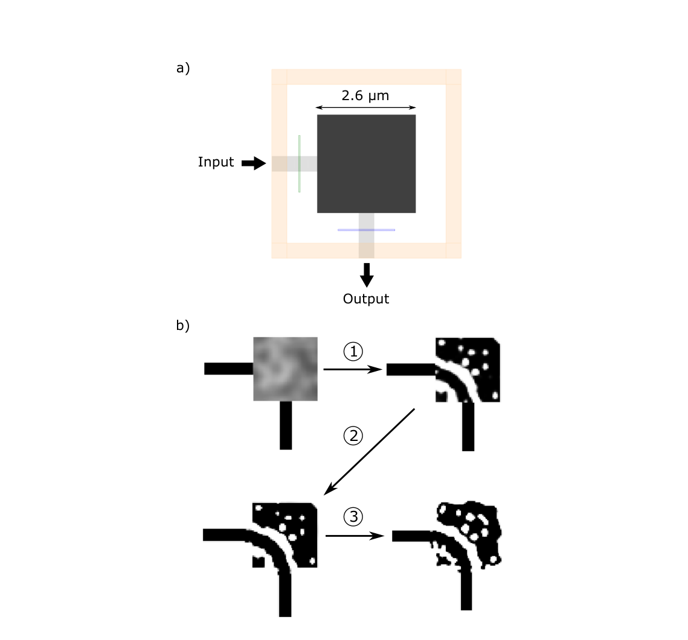

**How to read this figure.** (a) Top view of the simulation. The orange frame is the simulation domain edge (the PML). The light grey bars are the input waveguide (left) and output waveguide (bottom). The dark square (2.6 µm wide) is the **design area**, where material may change. The thin green line is the **mode source** and the thin blue line is the **overlap monitor**, which measures power in the output mode. (b) The optimisation sequence. ① A continuous optimisation turns a grey random start into a mostly black-and-white structure with a curved channel. ② Discretisation makes it fully binary (and extends the design area). ③ A discrete optimisation reshapes the binary device's boundary. The takeaway: the job is a *sequence* of sub-optimisations, not a single run.

### §2.4 Objective function $f(E)$

The objective is one of the designer's most important **control knobs**. Common forms:

**Maximise transmission:**

$$f_{obj}(p) = -\,|c^\dagger E(p)|^2 \qquad (4)$$

Here $c^\dagger E$ is the **modal overlap** of the field with the target mode $c$ at the output port. With a suitably normalised $c$, $|c^\dagger E|^2$ is the power in that mode. The minus sign turns "maximise" into "minimise".

**Hit a target transmission $t$:**

$$f_{obj}(p) = \big(t - |c^\dagger E(p)|\big)^2 \qquad (5)$$

This is useful for splitters (e.g. $t = 1/\sqrt2$ in amplitude, meaning 50% power) or for deliberately partial transmission.

**Several sub-objectives** (e.g. several wavelengths):

$$f_{obj}(p) = f_{obj,1}\big(E_1(\epsilon_1(p))\big) + f_{obj,2}\big(E_2(\epsilon_2(p))\big) \qquad (6)$$

How these are combined decides the **trade-off** between them (Appendix B.3).

**Small numeric example.** Suppose the overlap at the output is $c^\dagger E = 0.92\,e^{i0.4}$. Then the transmission is $0.92^2 = 0.846$. Eq. (4) gives $f = -0.846$. Eq. (5) with $t = 1$ gives $f = (1 - 0.92)^2 = 0.0064$.

### §2.5 Solving the design problem

Optimising a *discrete*, fabrication-constrained device directly usually gives poor results, because the landscape is very **non-convex** (bumpy, with many local minima) and you would need a good starting point. Starting from a classical design works, but it limits you to designs near that classical one.

The standard alternative: break the job into **stages** (Fig. 1b).

1. **Continuous stage.** Let the permittivity vary continuously between cladding and device material. This smooths the landscape.
2. **Discretisation.** Convert the continuous result into a discrete device.
3. **Discrete stage.** Optimise the discrete device under fabrication constraints.

**Discretisation methods.**

- *Thresholding:* a pixel becomes 1 if the continuous value is > 0.5, and 0 otherwise. It is simple, but "usually does not provide the best results".
- *Projection by optimisation* (what SPINS usually does): find the discrete, fabricable structure closest to the continuous one,

$$\min_p \; \|\epsilon_{disc}(p) - \epsilon_{cont}\| \qquad (7)$$

subject to the fabrication constraints. This involves no field, so no simulation is needed and it is fast. How you solve it depends on the parametrisation.

**A key abstraction: the transformation.** Each stage is a **transformation**: something that changes the state of the optimisation. Some keep the parametrisation *type* and change its values (a continuous or discrete optimisation stage). Others change the *type* (discretisation turns a pixel parametrisation into a level set). Solving a design problem = choosing a sequence of transformations that goes from a random structure to a finished one.

## §3 Framework Overview

> **In one sentence:** An *optimisation plan* = a *problem graph* of nodes (what to compute) + a *sequence of transformations* (how to optimise); the graph is a pure description, which makes gradients automatic and runs reproducible, resumable and portable.

Design problems differ, but they share building blocks. For example, nearly all need the overlap $|c^\dagger E|$. So SPINS is built from **small reusable blocks**.

**The two parts of an optimisation plan:**

1. **Problem graph.** Basic blocks called **nodes** (parametrisation, permittivity, source, simulation space, simulation, overlap, abs, power, sum, constant, ...) are connected into a graph that fully describes the problem, from simulation details to the exact objective (Fig. 2).
2. **Transformations.** An ordered list (continuous optimisation, discretisation, discrete optimisation, ...) that defines the **strategy**. Transformations *use* the graph to compute what they need (objective values, gradients).

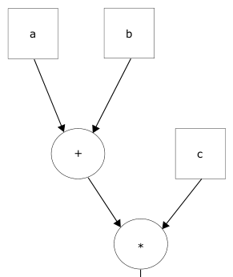

**How to read this figure.** Boxes are inputs and outputs; circles are operations. Panel (a), shown here, computes $(a + b)\cdot c$: $a$ and $b$ feed "+", and that result and $c$ feed "×". (The extracted image contains only panel (a). The paper's panel (b) shows the photonic version: $p$ branches into $\epsilon_1$ and $\epsilon_2$, each goes through an "EM Sim." at $\lambda_1$ or $\lambda_2$, then an "Obj." node, and the two objectives are added into a "Total Obj.". The generated figure below draws that photonic pipeline in more detail.)

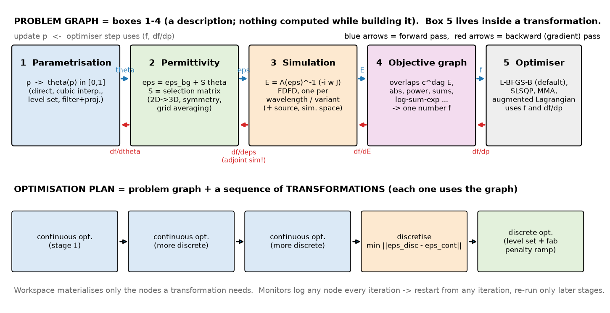

**How to read this figure (generated for this page).** Top row: the problem graph as a pipeline of five stages. Blue arrows show the **forward pass** ($p \to \theta \to \epsilon \to E \to f$). Red arrows show the **backward pass**, which carries the gradient back from the objective to the parameters. The step from $\partial f/\partial E$ back to $\partial f/\partial \epsilon$ is where the **adjoint simulation** happens. Box 5, the optimiser, is not part of the graph: in SPINS an optimiser is an argument handed to a transformation. Bottom row: an example **optimisation plan**, three continuous stages that each push the structure to be more binary, then a discretisation, then a discrete stage with a fabrication penalty that ramps up. This is the plan that produced Device A2 (Fig. 5).

### Why "description, not implementation" matters

Building the graph does **no computation**, like static graphs in TensorFlow. The authors list six benefits.

1. **Easy experiments.** Swap objective functions by snapping blocks together, and share blocks between users.
2. **Automatic gradients** by reverse-mode autodiff, so there is no hand-written gradient code.
3. **A complete record.** The graph stores the exact optimisation sequence *and* all hyperparameters (which matter a lot for results). After a run you can compute the value of *any* node, even one you did not save.
4. **Resume from any iteration**, after a crash or to try a different later stage (e.g. a new discrete stage without re-running the continuous ones).
5. **Portable.** The whole problem is a **JSON file plus GDS files**, so it can be generated on a laptop and run on a remote server. In principle a designer could define problems without programming.
6. **Batching.** Problems can be generated now and run later, e.g. queue a parameter sweep.

**Typical workflow:** (1) set up the problem graph, (2) choose the transformations, (3) execute the plan. Users can add **custom nodes and transformations**. Depending on the results, the designer then tries other objectives or transformation sequences. Mix-and-match is the point.

**The typical graph** (Fig. 2b): parametrisation (the primary input) → permittivity function → simulation function → electric fields → a subgraph of function nodes → objective value. If there are several sub-objectives, they are combined into one total objective. Appendix A explains each component.

## §4 Wavelength Demultiplexer Design Examples

> **In one sentence:** Three 3D demultiplexers (1400 nm up, 1550 nm down) show the workflow: a continuous device to estimate the best possible performance, a fabricable discrete device, and a device that also controls output phase.

A **wavelength demultiplexer** is a canonical benchmark. At these tiny sizes no classical design exists, and a random structure does not work at all. Three designs:

- **A1:** continuous, used to estimate the maximum possible performance;
- **A2:** discrete and fabricable;
- **B:** controls both amplitude *and* phase at the outputs.

### §4.1 Simulation space setup

- Platform: 220 nm SOI, with silicon index $n = 3.5$ ("for illustration").
- Design area 2.5 × 2.5 µm; input and output waveguides 400 nm wide.
- Goal: 1400 nm to the **upper** waveguide, 1550 nm to the **lower** waveguide.

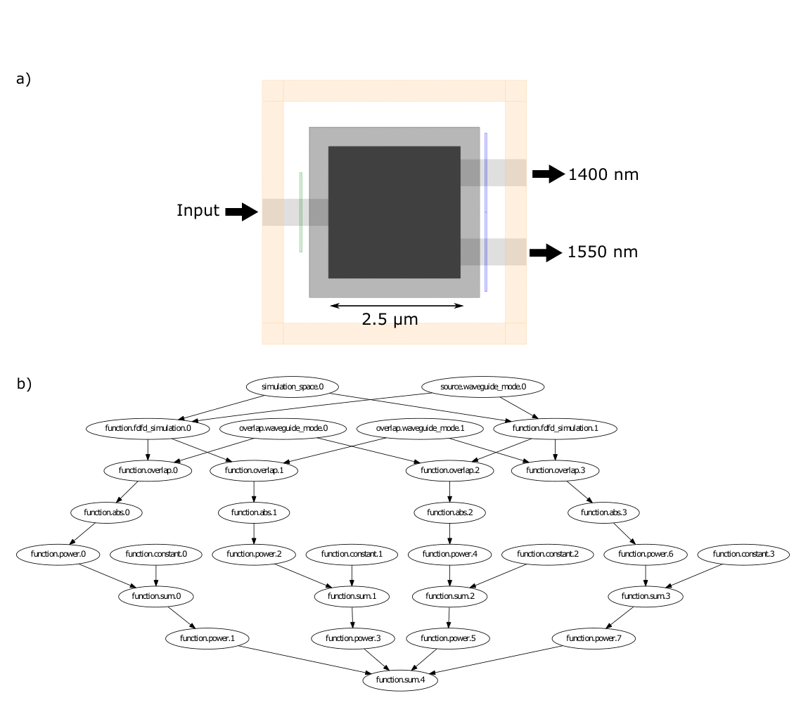

**How to read this figure.** (a) Top view. The dark grey square is the design area for the **continuous** stages. The larger light grey square around it is the enlarged design area for the **discrete** stage. It is bigger so the discrete optimisation can blend the device smoothly into the waveguides; otherwise fabrication constraints could be violated at the seam. The light grey bars are the waveguides, which run into the orange PML. The green line is the mode source and the blue lines are the overlap monitors. (b) The **problem graph** of eq. (8). At the top are `simulation_space.0` and `source.waveguide_mode.0`. These feed two `function.fdfd_simulation` nodes, one per wavelength. Each field goes to two `function.overlap` nodes (top and bottom output modes, `overlap.waveguide_mode.0/1`). Then come `abs`, `power` (square), `sum` with a `constant` (subtract the target), `power` again (square the error), and finally one `function.sum.4`, the total objective. Notice that this is just eq. (8) drawn as a graph, and that the two simulations sit in parallel branches.

**The rest of the setup** is a normal simulation: the waveguides run into the PML (the absorbing border). The mode source injects the fundamental mode, and the overlap monitors measure power in each output's fundamental mode. Those overlap values feed the objective.

### §4.2 Objective function

$$\min_{p, E_1, E_2}\; f\big(|c_{t,1}^\dagger E_1|^2, 1\big) + f\big(|c_{t,2}^\dagger E_2|^2, 0\big) + f\big(|c_{b,2}^\dagger E_2|^2, 1\big) + f\big(|c_{b,1}^\dagger E_1|^2, 0\big) \qquad (8)$$

subject to Maxwell's equations at each frequency:

$$\nabla\times\tfrac1\mu\nabla\times E_n - \omega_n^2\epsilon(p)E_n = -i\omega_n J_n,\quad n = 1, 2$$

Symbols:

- $\omega_1, \omega_2$: frequencies for 1400 nm and 1550 nm; $E_1, E_2$ are the fields at each;
- $J_n$: a **TFSF** (total-field/scattered-field) source that injects the input mode at frequency $\omega_n$;
- $c_{a,n}$: the overlap vector for the **t**op ($a = t$) or **b**ottom ($a = b$) output at frequency $n$, normalised so that $|c_{a,n}^\dagger E_n|^2$ is the power in that output's fundamental mode;
- $f(x, y) = (x - y)^2$: the squared error from a target.

**The four terms:**

| Term | Meaning | Target |
|---|---|---|
| $f(\lvert c_{t,1}^\dagger E_1\rvert^2, 1)$ | 1400 nm into the top port | 1 (all of it) |
| $f(\lvert c_{b,2}^\dagger E_2\rvert^2, 1)$ | 1550 nm into the bottom port | 1 |
| $f(\lvert c_{t,2}^\dagger E_2\rvert^2, 0)$ | 1550 nm leaking into the top port | 0 (rejection) |
| $f(\lvert c_{b,1}^\dagger E_1\rvert^2, 0)$ | 1400 nm leaking into the bottom port | 0 (rejection) |

Without the **rejection** terms, crosstalk would be higher. The sub-objectives **compete**. A step might raise 1400 nm transmission in the top port but also let more 1550 nm into it. Squaring the error makes the optimiser prefer **balanced** devices. With equal-quality wavelengths, the sum of squared shortfalls is smaller than with one great and one poor wavelength.

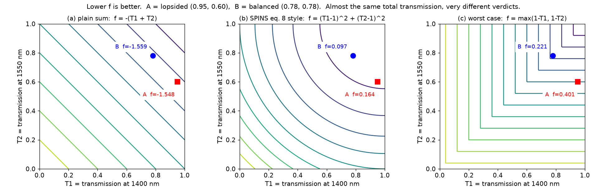

**How to read this figure (generated for this page).** Each panel is a map of two transmissions, $T_1$ (1400 nm) and $T_2$ (1550 nm). The lines are contours of equal objective (lower is better). Device A is lopsided (0.95, 0.60) and device B is balanced (0.78, 0.78), with almost the same total transmission. (a) A plain sum barely tells them apart (−1.548 versus −1.559). (b) The squared-error form of eq. (8) clearly prefers B (0.097 versus 0.164): its circular contours punish the larger shortfall more. (c) A worst-case (max) objective prefers B even more strongly (0.22 versus 0.40). The way you combine sub-objectives is a design choice with real consequences (Appendix B.3.2).

**Possible extra terms:** minimise back-reflection at the input; add more wavelengths near 1400 and 1550 nm for a **broadband** response (Appendix B.3.3). The authors also note that **broadband behaviour is a crude proxy for robustness**. A small change in index or shape mostly shifts the spectrum, and a broad spectrum tolerates shifts. That is the same heuristic as in Lu & Vučković §4.5.

### §4.3 Device A1: continuous device for estimating performance

Before designing something fabricable, check that the design area is **big enough**. Use the **direct parametrisation**: each pixel's permittivity is its own free continuous variable. That space is much bigger than the space of fabricable devices, so the result estimates an **upper bound** on what this area can do.

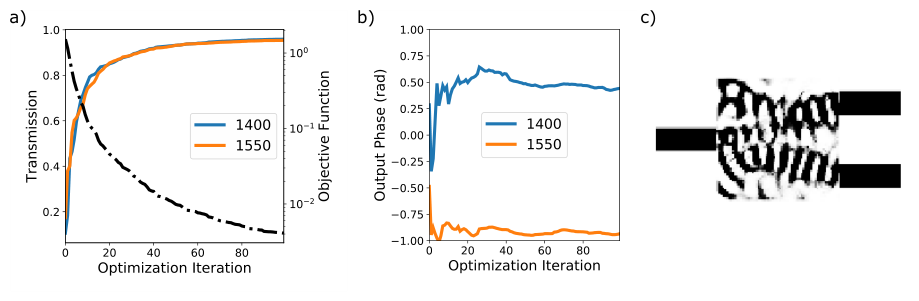

**How to read this figure.** (a) Transmission at 1400 nm (blue) and 1550 nm (orange) against iteration (left axis, solid lines), and the objective (right axis, log scale, dash-dot). Transmission shoots up in the first ~20 iterations and then creeps towards about 0.95. The objective falls steadily, because the line search only accepts steps that lower it. (b) Output **phase** of each wavelength against iteration. It settles at about +0.45 rad (1400 nm) and −0.95 rad (1550 nm), so the two phases differ by roughly 1.4–1.5 rad. Nobody asked for any particular phase. (c) The final structure: grey, curvy, with intermediate values. It is not fabricable, but it is a useful performance estimate.

**Results:** 95% transmission at both wavelengths and > 19 dB **crosstalk suppression**, after 100 iterations in about 3.5 h on 4 Titan Black GPUs.

**Crosstalk in numbers:** 19 dB means a power ratio of $10^{19/10} \approx 79$. If 95% goes to the right port, at most about $0.95/79 \approx 1.2\%$ goes to the wrong one.

**Practical lesson:** the optimisation had mostly converged by **iteration 30**; the last 70 iterations added only about 5%. To estimate performance, **20–30 iterations is usually enough**. If you are far from your targets after a few tens of iterations, use a larger design area.

### §4.4 Device A2: fabricable discrete device

Now use the full continuous-relaxation workflow (§2.5), with two changes:

- in the continuous stage, a **cubic-interpolation parametrisation** replaces the direct one. A coarse grid of control values is smoothly interpolated, which builds in a feature size and discretises better (Vercruysse et al. 2019, ref. [8]);
- in the discrete stage, a **constraint** enforces features ≥ 100 nm and radius of curvature ≥ 50 nm.

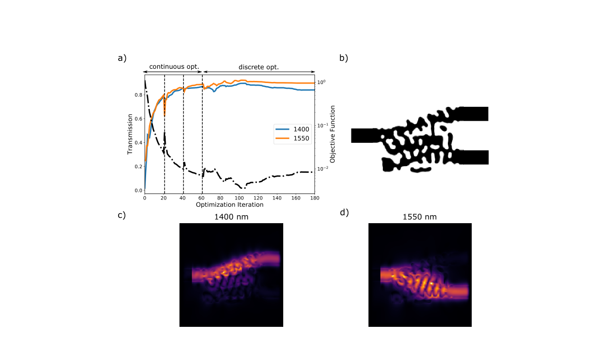

**How to read this figure.** (a) Transmission (solid; blue 1400, orange 1550) and objective (dash-dot, log scale) over 180 iterations. The vertical dashed lines at about 20, 40 and 60 separate the **transformations**: three continuous stages (0–60), then discretisation, then one long discrete stage (60–180). At each boundary the objective *jumps up*, because each new continuous stage pushes the structure to be more binary, and discretisation makes it fully binary. In the discrete stage the objective wiggles up and down, because the fabrication penalty is **gradually increased**. Even so, the transmission recovers to roughly its continuous-stage level. (b) Final binary device: black silicon blobs, all smooth and larger than 100 nm. (c), (d) Field intensity at 1400 nm, sent to the upper output, and at 1550 nm, sent to the lower output.

Notes:

- The continuous stage here does *worse* than A1. First, the cubic parametrisation is more restrictive (it avoids small features). Second, the continuous stages were stopped before converging, so at some iterations the discrete stage even beat them.
- **Results:** 84% at 1400 nm and 90% at 1550 nm, crosstalk suppression > 20 dB. (The paper's text says "84% dB", a typo for 84%.) This took about 11 h on 2 K80 GPUs.
- **Lesson:** a good discretisation is one *the discrete stage can recover from*, not one that keeps performance immediately.

### §4.5 Device B: phase control

Some applications care about the output **phase** (interferometers, phased arrays, coherent combining). To control it, compare the *complex* overlap directly with a complex target:

$$\min_{p,E_1,E_2}\; |c_{t,1}^\dagger E_1 - e^{i\theta_1}|^2 + f(|c_{t,2}^\dagger E_2|^2, 0) + |c_{b,2}^\dagger E_2 - e^{i\theta_2}|^2 + f(|c_{b,1}^\dagger E_1|^2, 0) \qquad (9)$$

with the same Maxwell constraints. $\theta_1, \theta_2$ are the desired phases (both set to 0 here). The term $|c^\dagger E - e^{i\theta}|^2$ is small only if the overlap has **both** amplitude ≈ 1 **and** phase ≈ $\theta$. It is the distance between two points in the complex plane.

**Numeric example.** If $c^\dagger E = 0.95\,e^{i0.5}$ and the target is $e^{i0}$, then $|0.95e^{i0.5} - 1|^2 = 0.95^2 + 1 - 2(0.95)\cos 0.5 = 0.9025 + 1 - 1.667 = 0.235$. With the right phase ($0.95 e^{i0}$) it would be $0.05^2 = 0.0025$. The phase error dominates.

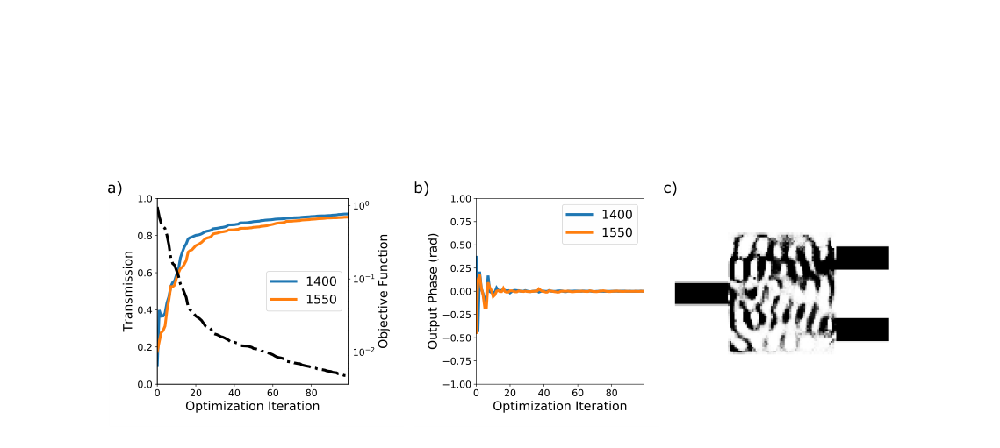

**How to read this figure.** (a) Transmission and objective against iteration, as in Fig. 4a. Transmission ends near 0.91 and 0.90. (b) Output phases. After a few wild early iterations, both lock onto **0 rad** by about iteration 15, unlike Fig. 4b where they drifted about 1.4 rad apart. (c) The final (grey, continuous) structure. It looks different from A1.

**Results:** 91% at 1400 nm and 90% at 1550 nm, about 19 dB crosstalk suppression, with both output phases near zero. The cost of the extra phase constraint is about 5% less transmission. To win it back, enlarge the design area. The run takes the same number of simulations as A1 (about 3.5 h), and again 20–30 iterations suffice for an estimate.

## §5 Practical Considerations

> **In one sentence:** Local minima found from random starts perform similarly, and the initial *mean* permittivity steers which kind of device you get; performance improves with more area and smaller features.

### §5.1 Local minima and initialisation

A local gradient method converges to a **local minimum**, and there are many. Finding the global minimum is intractable for these non-convex problems. Luckily, you usually only need a device that **meets the spec**. And with the continuous relaxation, the local minima you find tend to have **similar performance**, so a few repeated runs estimate the achievable performance.

**Experiment:** rerun the exact demultiplexer optimisation **297 times** from random initial conditions (Appendix D) and look at the final discrete devices.

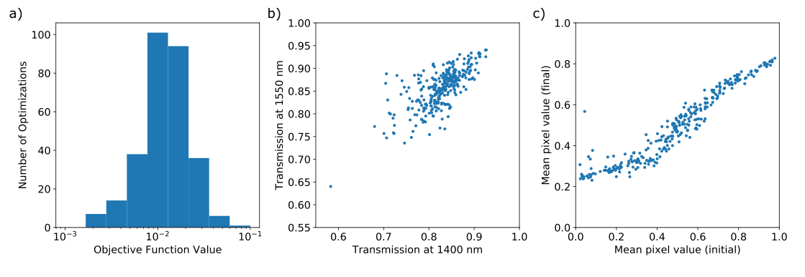

**How to read this figure.** (a) Histogram of the final objective values (log axis). Most runs land between $5\times10^{-3}$ and $3\times10^{-2}$, peaking near $10^{-2}$. The spread is narrow considering the starts were wildly different. (b) Transmission at 1550 nm against 1400 nm, one dot per run. Most dots sit at 0.8–0.9 on both axes, and the two are **correlated**, because the squared objective rewards balance (§4.2). One outlier sits at about 0.6/0.6. (c) Mean pixel value of the initial structure (x) against the final structure (y). There is a strong, roughly S-shaped correlation. Starting with more silicon ends with more silicon. But the final means stay between about 0.2 and 0.8, because an almost-all-silica or almost-all-silicon device cannot work, so the optimiser steers away from both extremes.

Most devices reach 80–90% at both wavelengths, against about 95% for the continuous upper bound (§4.3). So most local minima are decent.

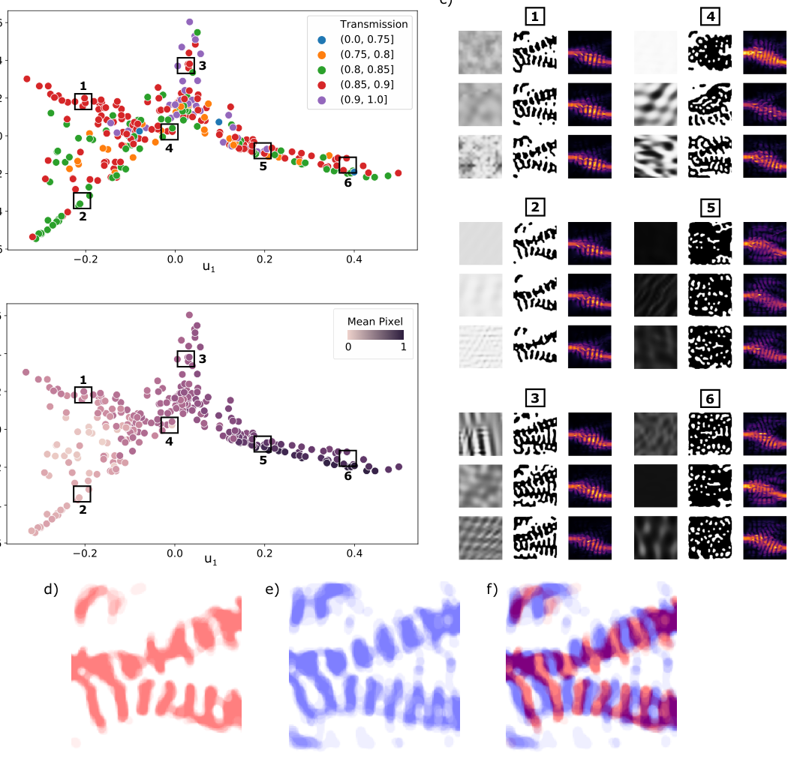

**How to read this figure.** (a) Each dot is one final design, placed by spectral embedding (axes $u_1, u_2$ are the first two embedding vectors) so that similar-looking designs sit close together. The colour is 1550 nm transmission. The cloud has **branches**, which suggests about four classes of minima. (b) The same plot coloured by the initial mean pixel value. The colour changes smoothly along the branches: the start's mean silicon fraction largely decides the branch. (c) For boxes 1–6, the three nearest designs: left column the initial condition, middle the final structure, right the 1550 nm field. (d), (e) Averages of 8 designs near box 1 (red) and box 2 (blue). (f) Their overlay. The "grating" bars of class 1 sit in the gaps of class 2: they are **complements**.

**The four classes:**

1. **Silicon blocks with holes** (boxes 5, 6). The field spreads over the whole device, which suggests **multi-path interference** does the work.
2. **Two "splitter-like" classes** (boxes 1, 2). The light mostly follows one of two paths. The structures look like tiny **Bragg mirrors** (periodic gratings) that reflect the unwanted wavelength. The two classes differ mainly in where the grating bars sit (Fig. 8d–f), yet one clearly outperforms the other.
3. **Splitter-grating hybrids with less separated paths** (box 3). These seem to perform best.
4. **Mixtures** in the centre of the plot (box 4).

**Practical heuristics from this study:**

- **The initial mean permittivity steers the outcome.** Use it to bias towards more silicon or more cladding if you expect one regime to work better.
- **Add noise to the initial condition.** Even within one class, performance varies quite a lot, so small differences in the start matter. Run several starts with a little Gaussian noise and pick the best result.

### §5.2 Device performance bounds

In general, **more degrees of freedom → better performance**. That means a bigger design area or a smaller allowed feature size.

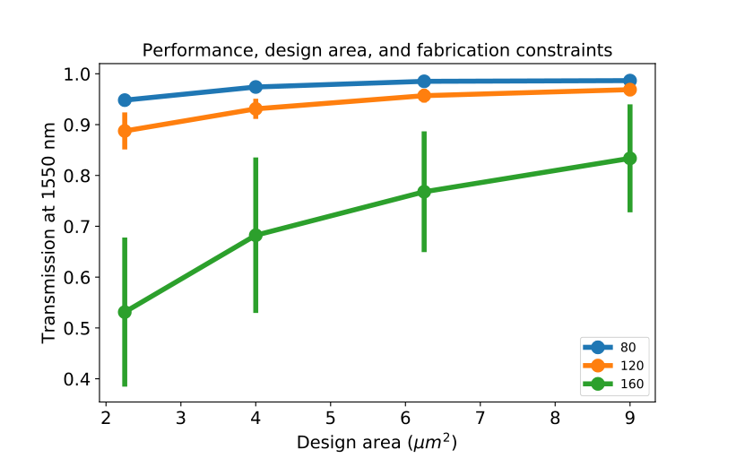

**How to read this figure.** The x-axis is the design area (2.25 to 9 µm²). The y-axis is 1550 nm transmission of a 2D demultiplexer. The colours are minimum feature sizes: 80 nm (blue), 120 nm (orange), 160 nm (green). Dots are averages and bars show the spread over runs. With 80 nm features the transmission is about 0.95–0.99 at every size. With 160 nm features it is about 0.53 at 2.25 µm², rising to about 0.83 at 9 µm², with huge spread. **Takeaways:** smaller features and bigger areas both help, and they also *reduce run-to-run variation*. When features are large or the area small, run **more optimisations**, because the spread is wide. (Data from ref. [8].)

Why does performance approach the continuous design as the feature size goes to zero? With deep sub-wavelength features, a mix of silicon and silica acts like an intermediate permittivity (the **effective-medium** idea). So a continuous design can in principle be imitated.

**How to estimate quickly:**

- *Which design area?* Run a few short continuous optimisations (§4.3).
- *What performance at a given feature size?* Run continuous optimisations with the cubic-interpolation parametrisation (§4.4), which respects feature size.
- *Is the target physically possible at all?* Rigorous bounds exist only in limited cases and are not necessarily tight (Angeris et al.; Shim et al.). As a rough **upper bound**, optimise with *no* fabrication constraints at all, not even top-down extrusion: free, intermediate permittivity in the full 3D volume. This can also suggest which fabrication method would be ideal.

## §6 Conclusion

> **In one sentence:** SPINS is a flexible framework of small blocks; backpropagation gives automatic gradients, explicit dependencies give reproducibility and restarts, and the demultiplexer study turns into practical heuristics.

- SPINS = framework, not methodology: it structures problems so they are easy to extend and experiment with.
- Automatic gradients via backpropagation → quick testing of new objectives.
- Explicit dependencies → all hyperparameters recorded; restart from any point. In future the graph itself could be optimised for the hardware.
- Practical knobs: objective, parametrisation, initial condition, plus (Appendix) simulation settings, discretisation and optimiser choice.

## Appendix A — Framework Details

### A.1 Parametrisation, selection matrix and permittivity

Most devices are made by top-down lithography, so a **2D image** is enough to describe the full 3D permittivity. SPINS formalises this with a **selection matrix** $S$:

$$\epsilon(p) = \epsilon_{bg} + S\,\theta(p) \qquad (10)$$

- $\epsilon_{bg}$: a fixed **background** permittivity (the waveguides, the cladding);
- $\theta(p)$: values between **0 and 1**, usually a 2D slice, so it is much smaller than $\epsilon$;
- $S$: a (sparse) matrix that "paints" the 2D values into the 3D grid, scaled so that $\theta = 1$ means full device material.

There is no loss of generality: $S$ can always be the identity.

**Why the selection matrix is useful:**

1. It encodes **equality constraints** such as symmetry or periodicity (several grid cells copy the same $\theta$).
2. It **normalises** $\theta$ to [0, 1], so parametrisations do not care which materials are used. The same parametrisation works for Si/SiO₂ or SiN/SiO₂.
3. It handles **permittivity averaging** on the simulation grid (A.2.1).

**Worked example.** Si/SiO₂ at 1550 nm: $\epsilon_{\text{Si}} = 3.48^2 = 12.11$, $\epsilon_{\text{SiO}_2} = 1.44^2 = 2.07$. In a design cell, $\epsilon_{bg} = 2.07$ and the matching row of $S$ has the entry $12.11 - 2.07 = 10.04$. So $\theta = 0 \to 2.07$, $\theta = 0.5 \to 7.09$, and $\theta = 1 \to 12.11$. A 2D pixel inside a 220 nm layer gridded at 20 nm in $z$ maps to 11 vertical cells, so that column of $S$ has 11 non-zero entries.

The parametrisation is the map $p \to \theta$. Options:

- **direct**: $\theta(p) = p$. Not good for fabrication constraints, but useful for sizing the design area (§5.2);
- **boundary-based** (Michaels & Yablonovitch 2018);
- **sets of rectangles** with variable positions and sizes (Petykiewicz thesis);
- **cubic interpolation** and **level sets**.

Parametrisations should have **many degrees of freedom**, so as not to restrict the design space. If you only have a handful of parameters, **Bayesian optimisation or even brute-force sweeps** may beat inverse design.

#### A.1.1 Level sets

For lithographic devices in the **discrete** stage, level sets are convenient because they **always define a discrete structure**. The permittivity takes one value where the level-set function is > 0 and the other where it is < 0. The boundary is the zero crossing.

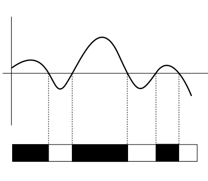

**How to read this figure.** (The extracted image shows only panel (c).) A smooth curve, the level-set function, crosses the horizontal zero line several times. Below it, a bar is black wherever the curve is on one side of zero and white on the other. The dotted lines show that each colour change sits exactly at a zero crossing. However the curve moves, the bar stays strictly black-and-white. Panels (a)–(b), described in the caption: a binary square aligned to the grid gives binary pixels, but the same square shifted by half a cell gives **grey** pixels at its edges.

**Two advantages over a binary direct parametrisation:**

1. **A binary device does not mean binary pixels** (Fig. 10a–b). Forcing every pixel to be 0 or 1 actually *over-constrains* the design: it forbids edges that fall between grid points.
2. **Differentiable fabrication constraints** such as minimum feature size are natural for level sets (curvature and gap width can be read from the function), and hard for pixels.

#### A.1.2 Implementation details

The selection matrix can represent arbitrary polygonal design regions, for example keeping a gap free of structure. Writing $S$ by hand is painful, so SPINS builds it from two permittivity distributions:

- **foreground**: the permittivity when $\theta$ is all ones;
- **background**: the permittivity when $\theta$ is all zeros.

Steps:

1. Subtract the two to get a **mask** of where the permittivity is allowed to change (anywhere non-zero).
2. Build a uniform selection matrix by sampling **twice as finely as the Yee grid** over the design area, then average onto the Yee grid. (The **Yee grid** is the staggered grid of FDFD/FDTD, where the $E_x, E_y, E_z$ components sit at slightly different positions in each cell.)
3. Weight it element-wise by the mask.
4. Apply any symmetry conditions.

### A.2 Simulation

From the graph's point of view, the simulation node takes permittivity and returns fields. But it also needs **sources** and **boundary conditions**. In SPINS, sources and the **simulation space** (region plus boundary conditions) are *their own nodes*. So the simulation node only runs the simulation and does not care which source or space it was given.

**Choose the solver to suit the problem** (simulation time dominates everything):

- a few wavelengths, waveguide devices → **FDFD** is usually faster;
- broadband → **FDTD** may be better;
- periodic structures (metasurfaces) → **RCWA** may be faster.

SPINS implements only FDFD so far, but the framework is solver-agnostic.

#### A.2.1 Implementation details

- **Own FDFD and mode solvers.** Exact adjoint calculations need precise control over the problem (e.g. arbitrary sources). Radiation boundaries use **SC-PMLs** (Shin & Fan).
- **2D as a special case of 3D:** one axis has exactly one cell and periodic boundaries. This avoids special-casing the code, at the cost of some memory.
- **2D solve:** direct matrix inversion is possible and empirically faster than iterative methods, so by default it runs on the CPU with standard linear-algebra libraries.
- **3D solve:** direct inversion is impossible (time and memory), so an iterative solver needing only matrix–vector products is used. With SC-PMLs and periodic boundaries a **symmetriser** makes the operator **complex symmetric** ($A^T = A$, but not Hermitian), allowing **COCG** (conjugate orthogonal conjugate gradient). Convergence guarantees for Hermitian matrices do not apply, but COCG works well in practice. **Bloch** (phase-shifted periodic) boundaries break the symmetry and need a non-symmetric solver such as **BiCGSTAB**.
- **Multi-GPU.** The domain is sliced along one axis, one slab per GPU. GPUs on different motherboards are undesirable for one simulation, because they must exchange data every iteration. But they are fine for *independent* simulations (e.g. different wavelengths).

### A.3 Objectives and function nodes

The objective is built from generic **function nodes**. Each takes one or more inputs, usually produces one output, and can compute its **gradient** with respect to any input. They range from addition and exponentiation to **log-sum-exp**.

- **Prefer small, simple nodes**: they compose more flexibly.
- **Fuse into one node when needed**: log-sum-exp is a single node because a naive implementation overflows or underflows. Likewise the FDFD simulation could in principle be split into smaller operations, but that would be slow.

### A.4 Transformations

A **transformation** is any operation that changes the optimisation's state. It can be big (find the $p$ minimising the objective) or small (threshold the structure). The full optimisation is a chain of transformations. One "stage" from §2.5 may be several transformations, e.g. several continuous transformations on increasingly discrete structures. Transformations make it easy to swap parametrisations and stages.

**Optimisers.** Many transformations take an **optimiser** as an argument. The optimiser solves a *generic* problem (it knows nothing about electromagnetics). SPINS defines a **lightweight optimiser interface**, so third-party optimisers plug in. The common choice is a wrapper around **SciPy**. **Higher-order optimisers** (optimisers that use other optimisers) are possible too. For example SPINS provides an **augmented-Lagrangian** optimiser that solves *constrained* problems using an *unconstrained* inner optimiser.

### A.5 Executing the optimisation plan

Transformations run in order. When a transformation refers to a graph node (say the objective), the **workspace** **materialises** that node into a Python object that can actually compute. Because the graph knows all the dependencies, the workspace builds *only the nodes needed*, which avoids wasted computation.

There is a one-to-one map between problem-graph nodes and Python objects, so a **computational graph** mirroring the function nodes is built. It is used to evaluate functions and their gradients. Explicit dependencies allow **automatic parallelisation**. In practice the EM simulations are run in parallel as much as possible, and the cheap remaining operations run serially.

**Gradients** come from **reverse-mode autodiff** (backpropagation), which is efficient for one output and many inputs. Backpropagation through the EM simulation is the **adjoint method**. The name comes from the fact that it requires another EM simulation with the *same* permittivity but a *different* source.

**Why SPINS writes its own backpropagation:** (1) complex-valued backprop must be handled correctly, and many libraries at the time did not fully support it; (2) backprop must handle the parallel EM simulations properly.

#### A.5.1 Monitoring and logging

**Monitors** capture the output of any node and save it to log files. That lets you probe *any* value: fields (probe the simulation node), sub-objectives (probe their function nodes), or extra nodes that the objective does not use, e.g. a mode monitor at the input to watch **back-reflection**.

SPINS uses a **standard log format** that stores the *full state* at any moment, so analysis tools can be shared. Because the plan fully describes the problem, SPINS can **restore any optimisation from any iteration** using the logs. This helps after a crash, and avoids re-running earlier transformations when you experiment. For example, try a new discrete stage by restoring the state right after discretisation.

## Appendix B — More Practical Considerations

### B.1 FDFD simulation considerations

Optimisation, especially early on, **does not need highly accurate simulations**. Save time:

- **Coarse grid.** $\Delta x \approx \lambda/10$, where $\lambda$ is the wavelength *in the material*, is enough during optimisation. Example: in silicon at 1550 nm, $\lambda_{Si} = 1550/3.48 \approx 445$ nm, so $\Delta x \approx 45$ nm (Meep users often use 20–40 nm). Much finer grids rarely help, because without very precise fabrication the **fabrication error degrades performance far more than the simulation error**.
- **This works only thanks to permittivity averaging.** At a boundary between two materials, SPINS uses the **volume-weighted average** of the permittivities in the cell. More sophisticated averaging (Farjadpour et al.) needs a full permittivity tensor. Because the Yee grid is staggered, in 3D averaging is needed **even for perfectly binary pixels**.
- **Loose solver tolerance.** Fields only need to be accurate where they are *used*. With COCG, the fields inside the PML converge slowest, but they do not matter.
- **If you need accuracy** (e.g. resonators), optimise coarse first and switch to a fine grid later.
- **Pick the right linear solver.** For 2D, **UMFPACK** is much faster than SciPy's default **SuperLU**.
- **Pick the right number of GPUs per simulation** (Fig. 11). More is not always faster. With 2 GPUs and 2 simulations (e.g. 2 wavelengths), run each simulation on 1 GPU at the same time, rather than each on 2 GPUs one after the other.

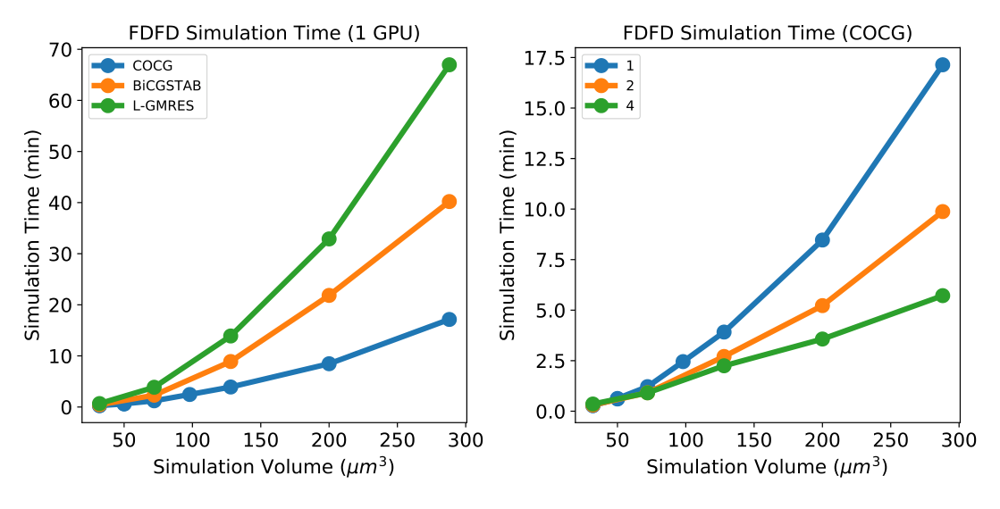

**How to read this figure.** Left: simulation time (minutes) against simulation volume (µm³) on one K80 GPU for three iterative solvers, to reach $10^{-6}$ error. **COCG** (blue) is fastest: about 17 min at 290 µm³, against about 40 min for BiCGSTAB and about 67 min for L-GMRES. Right: COCG with 1, 2 or 4 GPUs. At 290 µm³, 1 GPU takes about 17 min, 2 GPUs about 10 min and 4 GPUs about 5.7 min. So 4 GPUs give only about 3× the speed of 1, and at small volumes the gain is nearly nothing. That is the reason to spread independent simulations across GPUs rather than split one simulation.

### B.2 Discretisation

Think of the continuous optimisation as an elaborate **initialisation** for the discrete one. The discretisation should not destroy that progress. In practice performance usually **drops** at discretisation, so a good discretisation is one the discrete stage can **recover** from.

Two factors matter:

1. **Discreteness**: how binary the continuous structure already is. More binary → better discretisation. The optimisation sometimes produces nearly binary results by itself, but not reliably, and running longer does not guarantee it. There are local minima with grey values. Fixes: add a **discreteness penalty** (Su et al. 2017), or force more discrete structures over several stages (ref. [8]).
2. **Feature size**: discretising under large feature-size constraints is harder. "Feature size" of a grey structure is ill-defined; use the thresholded structure's feature size as a proxy. Trouble arises when the continuous "features" are much smaller than the allowed discrete features.

**Techniques:** the **cubic-interpolation parametrisation** (ref. [8]) makes continuous "feature size" map onto discrete feature size. **Several continuous stages** with rising discreteness handle the discreteness problem. Alternatively, **filtered direct parametrisations** (Zhou, Lazarov, Wang & Sigmund 2015) impose feature size on continuous structures. That is the **filter + projection** route used by Meep and Tidy3D, and the one in your schedule. More options are in the topology-optimisation literature (Sigmund 2009; Wang, Lazarov & Sigmund 2011).

### B.3 Crafting objective functions

The objective is a main lever on the result. (Further forms appear in refs. [10, 13, 35–38].)

#### B.3.1 Phase objective

$f(b) = |b - b_t|^2$, where $b$ is the complex scattering-matrix element at an output and $b_t = a_t e^{i\theta_t}$ is the target, with amplitude $a_t$ and phase $\theta_t$. Amplitude and phase are two degrees of freedom, so this objective **implicitly trades them off**. If the amplitude is right but the phase is far off, the optimiser works on the phase. If both are off, which one it favours depends on the numbers. **Pitfall:** if $a_t$ is unrealistic (e.g. 1 for too small a device), the optimiser may chase amplitude forever and neglect phase.

#### B.3.2 Aggregating sub-objectives

Photonic design is usually **multi-objective**, but the optimiser needs one number. *How* you combine the sub-objectives sets the trade-off.

- **Weighted sum:** $\sum_i w_i f_i$. Sweeping the weights traces the **trade-off curve** (Pareto front, Boyd & Vandenberghe). But choosing weights in advance is trial and error.
- **Equal priority:** $f = \max_i f_i$ forces work on the **worst** metric (a minimax objective).
- **Smooth max:** $\max$ is not differentiable where two terms tie, so use **log-sum-exp**, $\frac1\beta\log\sum_i e^{\beta f_i}$, or $\sum_i f_i^q$ for a large integer $q$.

For your robust objective (eroded / nominal / dilated), this is exactly the choice between a mean and a worst case.

#### B.3.3 Broadband objective

If $f_\lambda(p)$ is the objective at wavelength $\lambda$, the broadband version is

$$f(p) = \sum_{i=-n}^{n} f_{\lambda + i\Delta}(p)$$

so there are $2n + 1$ wavelengths spaced $\Delta$ apart. Choosing $\Delta$ is the crux. Too big, and the spectrum may misbehave *between* the sampled wavelengths. Too small, and you need many wavelengths (large $n$) to cover the band, which is slow. Pick $\Delta$ with a few quick continuous runs.

**Example:** cover 1530–1570 nm with $\Delta = 10$ nm → $n = 2$, five wavelengths (1530, 1540, 1550, 1560, 1570), so five forward and five adjoint FDFD solves per iteration. With FDTD (Meep), one run gives all wavelengths, which is part of why FDTD is preferred for broadband.

### B.4 Selecting an optimiser

- **Gradient-free** methods (particle swarm, genetic algorithms, Nelder–Mead, Bayesian optimisation) sample cleverly, but need many evaluations as the dimension grows. They are ineffective in the high-dimensional spaces SPINS targets.
- **First-order** methods (gradient descent, Adagrad, Adam, RMSProp) converge slowly and need step-size tuning. Unlike machine-learning losses, **EM objectives are expensive to evaluate**, so wasted evaluations hurt.
- **Second-order** (Newton) would be ideal, but the Hessian is intractable.
- **Quasi-Newton**: the default is **SciPy L-BFGS-B**, which empirically beats first-order methods and the other SciPy methods. *Bonus:* L-BFGS-B tends to give **more discrete** continuous-stage structures, which discretise better.
- Other cases: cavities did better with **MMA + L-BFGS-B**; gratings used **SLSQP**, since L-BFGS-B cannot handle general constraints. **Interior-point** methods had not yet been tried and might do better.
- The optimiser is "yet another knob".

## Appendix C — Mathematical Details (the adjoint gradient, derived)

### The general problem

$$\min_p\; f_{obj}(E_1,\dots,E_n,\epsilon_1,\dots,\epsilon_n,p)\quad\text{s.t.}\quad g_i(p) = 0\;(i = 1..m),\quad h_i(p) \le 0\;(i = 1..q) \qquad (11)$$

Each $\epsilon_i$ depends on $p$, and each $E_i$ is the field for $\epsilon_i$. The flexibility is large. $E_i$ may be FDFD or FDTD fields. **Each $\epsilon_i$ may be the permittivity at a different wavelength, temperature or carrier density, or "enlarged and shrunken versions of the structure to model fabrication errors".** That last phrase is your project's robust objective, stated in the SPINS paper. $g_i, h_i$ are equality and inequality constraints on $p$, especially fabrication constraints.

With selection matrices:

$$\epsilon_i = \epsilon_{0,i} + S_i\,\theta_i(p) \qquad (12)$$

where $\theta_i$ is the parametrisation and $p$ the parametrisation vector. Because $S_i$'s shape fixes the size of $\theta_i$, parametrisations are often written for a particular kind of selection matrix.

### Step 1: the total derivative with complex variables

We need $df_{obj}/dp$. $E$ and $\epsilon$ may be complex, while $f$ is real, so $f$ is not holomorphic and we must use Wirtinger derivatives. By the chain rule, counting both $E$ and $E^*$ (and $\epsilon$, $\epsilon^*$) as separate dependencies:

$$\frac{df}{dp} = \frac{\partial f}{\partial p} + \sum_i\left(\frac{\partial f}{\partial E_i}\frac{dE_i}{dp} + \frac{\partial f}{\partial E_i^*}\frac{dE_i^*}{dp} + \frac{\partial f}{\partial \epsilon_i}\frac{d\epsilon_i}{dp} + \frac{\partial f}{\partial \epsilon_i^*}\frac{d\epsilon_i^*}{dp}\right) \qquad (13)$$

with the Wirtinger derivatives (14), (15) defined in the background section.

### Step 2: use that $f$ is real

For real $f$: $\partial f/\partial z^* = (\partial f/\partial z)^*$. And since $p$ is real, $dE^*/dp = (dE/dp)^*$. So each pair is "something plus its complex conjugate", which equals $2\,\mathrm{Re}[\text{something}]$:

$$\frac{df}{dp} = \frac{\partial f}{\partial p} + 2\,\mathrm{Re}\left[\sum_i\left(\frac{\partial f}{\partial E_i}\frac{dE_i}{dp} + \frac{\partial f}{\partial \epsilon_i}\frac{d\epsilon_i}{dp}\right)\right] \qquad (16)$$

$\partial f/\partial p$, $\partial f/\partial E_i$ and $\partial f/\partial\epsilon_i$ depend on the specific objective. They are the cheap, local derivatives each function node supplies.

### Step 3: the structure gradient (easy)

From eq. (12):

$$\frac{d\epsilon_i}{dp} = \frac{d\epsilon_i}{d\theta_i}\frac{d\theta_i}{dp} = S_i\,\frac{d\theta_i}{dp} \qquad (17, 18)$$

This is the selection matrix times the parametrisation's Jacobian. For a filter + projection parametrisation, $d\theta/dp$ is "projection derivative × filter matrix".

### Step 4: the simulation gradient (hard)

The FDFD equation:

$$\big(D - \omega^2\,\mathrm{diag}(\epsilon)\big)E = -i\omega J \qquad (19)$$

where $D$ is the discretised $\nabla\times\frac1\mu\nabla\times$ (constant $\mu$). Write $A = D - \omega^2\mathrm{diag}(\epsilon)$.

Differentiate with respect to $\epsilon_k$ (one cell's permittivity). The source does not depend on $\epsilon$. By the product rule:

$$\frac{\partial A}{\partial\epsilon_k}E + A\frac{\partial E}{\partial\epsilon_k} = 0$$

$\partial A/\partial\epsilon_k = -\omega^2 e_k e_k^\top$, where $e_k$ is the $k$-th unit vector. So $\frac{\partial A}{\partial\epsilon_k}E = -\omega^2 E_k e_k$. Rearranging, and stacking all $k$ as columns:

$$\big(D - \omega^2\mathrm{diag}(\epsilon)\big)\frac{dE}{d\epsilon} = \omega^2\,\mathrm{diag}(E) \qquad (20)$$

Therefore:

$$\frac{dE_i}{dp} = \frac{dE_i}{d\epsilon_i}\frac{d\epsilon_i}{dp} = \big(D - \omega_i^2\mathrm{diag}(\epsilon_i)\big)^{-1}\,\omega_i^2\,\mathrm{diag}(E_i)\,\frac{d\epsilon_i}{dp} \qquad (21, 22)$$

**The problem:** $dE_i/dp$ is a huge matrix. Computing it means applying $A^{-1}$ to every column, i.e. **one simulation per parameter**.

### Step 5: the adjoint trick (re-bracket the product)

We never need $dE/dp$ by itself, only the *row vector* $\frac{\partial f}{\partial E}\frac{dE}{dp}$. Matrix multiplication is associative, so multiply from the **left** first:

$$\frac{\partial f}{\partial E_i}\frac{dE_i}{dp} = \underbrace{\frac{\partial f}{\partial E_i}\,A_i^{-1}}_{\text{one row vector}}\;\omega_i^2\,\mathrm{diag}(E_i)\,\frac{d\epsilon_i}{dp} \qquad (23)$$

$$= \Big(A_i^{-T}\,\Big(\frac{\partial f}{\partial E_i}\Big)^{T}\Big)^{T}\,\omega_i^2\,\mathrm{diag}(E_i)\,\frac{d\epsilon_i}{dp} \qquad (24)$$

(using $(vA^{-1})^T = A^{-T}v^T$). Define the **adjoint field** $\lambda_i$ by solving

$$A_i^T\,\lambda_i = \Big(\frac{\partial f}{\partial E_i}\Big)^T$$

That is **one** linear solve, whatever the number of parameters. Because $A$ is (made) **complex symmetric**, $A^T = A$, it is the *same* operator as the forward simulation: same structure, different source. To write it as a normal simulation $A\lambda = -i\omega J_{adj}$, set the adjoint source to $J_{adj} = (\partial f/\partial E_i)^T/(-i\omega_i)$, which is the paper's statement.

Then, element by element, the gradient with respect to cell $k$'s permittivity is

$$\frac{df}{d\epsilon_k} = 2\,\mathrm{Re}\big[\omega^2\,\lambda_k\,E_k\big]$$

the product of the adjoint field and the forward field in that cell (and then multiplied by $S\,d\theta/dp$). **Two simulations give the whole gradient.** This is the core of every adjoint inverse-design code, including Meep's and Tidy3D's.

**What $\partial f/\partial E$ looks like for eq. (4).** $f = -|c^\dagger E|^2 = -(c^\dagger E)(c^\dagger E)^*$. Treating $E^*$ as constant: $\partial f/\partial E = -(c^\dagger E)^*\,c^\dagger$. So the adjoint source is (a multiple of) the conjugated target mode $c$, weighted by the current overlap, and placed at the **output monitor**. Physically, you "shine the desired mode back in from the output".

### A runnable check: adjoint versus finite differences

This builds a 1D FDFD toy with a selection matrix (eq. 10), the objective of eq. (4), and the adjoint gradient (eqs. 16–24). It then checks the gradient against brute-force finite differences, which cost one extra solve per parameter.

```python
import numpy as np
rng = np.random.default_rng(0)
# Tiny 1D FDFD: (D - w^2 diag(eps)) E = -i w J      (SPINS eq. 19)
N, dx, lam = 100, 0.02, 1.55
w = 2*np.pi/lam
D = -(np.diag(-2*np.ones(N)) + np.diag(np.ones(N-1), 1) + np.diag(np.ones(N-1), -1)) / dx**2
J = np.zeros(N, complex); J[10] = 1/dx                  # source
c = np.zeros(N, complex); c[90] = 1.0                   # "overlap vector": probe at cell 90
S = np.zeros((N, 40)); S[np.arange(30, 70), np.arange(40)] = 3.48**2 - 1.44**2  # selection matrix
eps_bg = np.full(N, 1.44**2) + 0.05j                    # oxide + a little loss (stands in for PML)
def forward(p):
    eps = eps_bg + S @ p                                 # eq. 10: eps = eps_bg + S theta(p), theta = p
    A = D - w**2*np.diag(eps)
    E = np.linalg.solve(A, -1j*w*J)
    return -abs(c.conj() @ E)**2, E, A                   # eq. 4: f = -|c^dagger E|^2
p = rng.uniform(0, 1, 40)
f, E, A = forward(p)
# Adjoint (eq. 24): one extra solve with the TRANSPOSED operator
dfdE = -np.conj(c.conj() @ E) * c.conj()                 # Wirtinger derivative, a row vector
lam_adj = np.linalg.solve(A.T, dfdE)                     # the adjoint simulation
grad = 2*np.real((lam_adj * w**2 * E) @ S)               # eq. 16 + 22 + 18 chained
# Check against finite differences, one parameter at a time (40 extra solves!)
h = 1e-6
fd = np.array([(forward(p + h*np.eye(40)[k])[0] - f)/h for k in range(40)])
print("adjoint grad[:4]:", grad[:4].round(5))
print("finite-diff[:4]:  ", fd[:4].round(5))
print("max relative error:", np.max(abs(grad-fd))/np.max(abs(fd)))
```

**What you should see.** The two rows agree to five decimals (`[-0.18118  0.01288  0.26568  0.55767]` for both), and the maximum relative error is about $10^{-6}$, which is just finite-difference noise. The adjoint used **2** linear solves; the finite-difference check used **41**. Try removing the `2*` or the `np.real`: the check fails, which shows why the Wirtinger "2 Re" matters. This "gradient check" is a test you should keep in your own package (see `tests/` below).

## Appendix D — Local Minima Analysis Details

**Initial conditions**, three kinds, to cover many types of minima:

- **blurred random noise**: uniform random values, Gaussian-filtered with a random width, then randomly zoomed and rotated;
- **Perlin noise**: procedural graphics noise with controllable feature size and "turbulence";
- **Gabor noise**: noise with controllable frequency content.

Perlin and Gabor starts were randomly scaled and offset to vary their amplitude and mean permittivity. **No correlation was found between the initialisation method and the final performance**, so the *type* of random start does not seem to matter much. (The *mean* value does, §5.1.)

**Embedding.** PCA is linear and may miss nonlinear structure. **Spectral embedding** comes from the spectral decomposition of a graph. Each structure is linked to its $n = 10$ nearest neighbours (2-norm distance between pixel vectors), and the eigenvectors of that graph's Laplacian give the coordinates. It was computed with scikit-learn defaults. If the graph had two disconnected components, the embedding would cleanly separate them, which is why it reveals clusters.

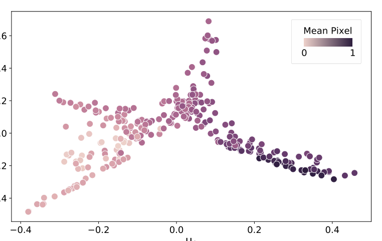

**How to read this figure.** (The extracted image shows panel (b): the embedding of the *continuous* final structures, coloured by initial mean pixel value from light, mostly silica, to dark, mostly silicon. Panel (a) in the paper colours the same points by 1550 nm transmission.) The same branched, curved manifold appears as for the discrete structures in Fig. 8, and the colour again changes smoothly along it. **Takeaway:** the "discrete local minimum" is decided already in the **continuous** stage. The discrete design closely resembles its continuous parent, so all the conclusions of §5.1 carry over.

## How this connects to your project

- **Architecture.** Your project is a pipeline: parameters → filtered/projected density → permittivity (for each of the eroded / nominal / dilated variants) → Meep or Tidy3D simulation → overlaps → robust objective → optimiser. That is SPINS's eq. (1) with eq. (2)/(11) for the variants. Copy the *seams*, not the code.
- **Robust objective.** Appendix C names "enlarged and shrunken versions of the structure to model fabrication errors" as one choice of $\epsilon_i$. Cite SPINS (with Lu & Vučković §4.5 and Schubert et al. 2022) when you motivate the multi-variant objective. B.3.2 tells you how to aggregate: mean, weighted sum, or smooth worst case.
- **Practical defaults to adopt:** 20–30 iterations for quick feasibility checks; several random starts with a controlled mean density plus noise; coarse grids early, fine grids for the final check; L-BFGS-B or MMA rather than Adam; log *everything*, so you can restart and re-analyse.
- **Monte-Carlo yield and ML surrogate.** SPINS's logging (every node, every iteration) is exactly the data you will want for training a surrogate later. Design `monitor.py` with that in mind.

## Evening task: reading SPINS-B's code structure (30 minutes)

!!! warning "Read the repository itself"
    The directory names below are given from memory of the public `stanfordnqp/spins-b` repository, as a reading map. They could not be checked live while this page was written. Open the repo and correct any name that differs. The *concepts* come straight from the paper.

**Where to look (roughly, inside `spins/`):**

| Concept in the paper | Where to look in SPINS-B (approximate) | What to note |
|---|---|---|
| Problem graph, nodes, JSON plan (§3) | `invdes/problem_graph/` (the `optplan` schema, node "creators" for EM and parametrisations, `workspace`) | How a node is *declared* (a schema) separately from how it is *computed* (a creator function) |
| Parametrisation $p \to \theta$ (§2.2, A.1) | `invdes/parametrization/` | The methods each parametrisation must provide (encode, decode, derivative, bounds, project) |
| Selection matrix, permittivity (A.1.2) | grid / selection-matrix helpers, `gds/` for reading layouts | How the foreground/background permittivities become $S$ |
| FDFD simulation and adjoint (A.2) | `fdfd_tools/`, `fdfd_solvers/` | The solver interface: operator in, field out, plus a transposed solve |
| Function nodes and objective (A.3) | `invdes/problem/` (objective and EM-objective classes) | Each node has `eval` and `grad`: the backprop contract |
| Transformations and optimisers (A.4) | `invdes/optimization/` and the transformation entries in the plan | How an optimiser sees only (f, ∇f, bounds), never Maxwell |
| Logging and restart (A.5.1) | monitor and log tools in `problem_graph/` | What state is saved per iteration |
| Newer API | `goos/`, `goos_sim/` | A later, more "functional" redesign; skim only |

Write down, for each arrow between the boxes, the **interface**: what goes in and what comes out (type, shape, units).

## Suggested layout for `pic-sim/sim/adjoint/`

This layout copies SPINS's seams, adapted to a **filter + projection density** workflow on **Meep / Tidy3D** with a **robust (multi-variant) objective**. It extends the schedule's suggestion (`fom.py`, `filters.py`, `projection.py`, `robust.py`, `run.py`) with the pieces SPINS shows you will need.

```text
pic-sim/sim/adjoint/
├── __init__.py        # public API: build_problem(), run_plan()
├── spec.py            # SPINS "problem graph" as plain data: dataclasses -> JSON
├── params.py          # p -> rho in [0,1] on the design grid; symmetry; init (mean + noise)
├── filters.py         # conic filter (radius r <-> min feature)           [Thu 26 Nov]
├── projection.py      # tanh projection, beta schedule; eroded/dilated thresholds
├── materials.py       # rho -> eps = eps_bg + S*rho (SPINS eq. 10); per-wavelength eps
├── backends/
│   ├── base.py        # Simulator protocol: forward(eps) -> monitors; adjoint(...) -> dF/deps
│   ├── meep_backend.py
│   └── tidy3d_backend.py
├── fom.py             # overlaps -> transmissions -> sub-objectives -> one number (+ grads)
├── robust.py          # variants (eroded / nominal / dilated [x wavelengths]); aggregation
├── constraints.py     # optional: length-scale / fab constraints g(p)=0, h(p)<=0
├── optimizers.py      # thin wrapper: nlopt MMA, scipy L-BFGS-B; sees only (f, grad, bounds)
├── stages.py          # SPINS "transformations": continuous(beta_k), binarise, final check
├── monitor.py         # log every node every iteration; checkpoint + restart
└── run.py             # execute plan = spec + list of stages; CLI entry point
tests/sim/adjoint/
└── test_gradcheck.py  # adjoint vs finite differences on a tiny 2D problem (like the snippet above)
```

### Interfaces between the modules (write these into the docstrings)

| From → to | Passes | Shape / type | Mirrors SPINS |
|---|---|---|---|
| `optimizers` → `run` / `stages` | parameter vector `p` | 1D float array, bounds [0, 1] | optimiser interface (A.4) |
| `params` → `filters` | raw density `rho0` | 2D array on the design grid | parametrisation $\theta(p)$ |
| `filters` → `projection` | filtered `rho_f` | same 2D array | (part of $\theta$) |
| `projection` → `robust` | projected densities per variant (`eta_e`, `eta_n`, `eta_d`) | dict[str, 2D array] | multiple $\epsilon_i$ (eq. 11) |
| `materials` → `backends` | permittivity per variant and wavelength | 2D/3D arrays | $\epsilon = \epsilon_{bg} + S\theta$ |
| `backends` → `fom` | complex mode overlaps (and optionally fields) | dict[(variant, λ, port)] → complex | simulation node output |
| `fom` → `robust` | sub-objective values and their gradients | floats + arrays | function nodes |
| `robust` → `optimizers` | one scalar $F$ and $dF/dp$ | float, 1D array | total objective |
| every module → `monitor` | named values per iteration | dict | monitors (A.5.1) |

**The backward pass runs the same chain in reverse.** $dF/d(\text{overlaps})$ from `fom`/`robust` goes back to the backend, which runs the adjoint simulation and returns $dF/d\epsilon$. Then `materials` gives $dF/d\rho$, `projection` and `filters` apply their Jacobians, and you arrive at $dF/dp$. In Meep this is handled by `mpa.OptimizationProblem` together with `autograd` for the filter and projection. Your `meep_backend.py` wraps that, so the rest of the package never imports Meep.

### Stub example (docstrings only, the evening EXIT)

```python
# backends/base.py
from typing import Protocol, Mapping
import numpy as np

class Simulator(Protocol):
    """One EM solver behind a fixed interface (SPINS A.2: the simulation node
    is agnostic to sources and simulation space, which are inputs).

    Units: um, wavelengths in um. eps arrays are on the design grid.
    """
    def forward(self, eps: Mapping[str, np.ndarray], wavelengths: list[float]
                ) -> Mapping[tuple, complex]:
        """Run forward simulations for each variant/wavelength.
        Returns complex mode overlaps keyed by (variant, wavelength, port)."""
        ...
    def vjp(self, dF_doverlaps: Mapping[tuple, complex]
            ) -> Mapping[str, np.ndarray]:
        """Adjoint (vector-Jacobian product): given dF/d(overlap) from the
        last forward call, run adjoint simulations and return dF/deps per
        variant. Must pass tests/sim/adjoint/test_gradcheck.py."""
        ...
```

```python
# fom.py
"""Figures of merit: overlaps -> transmissions -> one scalar (SPINS §2.4, B.3).

Functions here are pure and differentiable (autograd/numpy), never call a
solver, and are normalised so a perfect device scores 0.
- transmission(overlap, norm) -> |c^dagger E|^2 / P_in
- target_sq(T, t) -> (T - t)^2                       (SPINS eq. 8 form)
- phase_target(overlap, a_t, theta_t) -> |b - a_t e^{i theta_t}|^2  (B.3.1)
- crosstalk_db(T_wanted, T_leak)                     (reporting only)
"""
```

```python
# robust.py
"""Robust objective over fabrication variants (SPINS eq. 2 / App. C).

variants: eroded / nominal / dilated (projection thresholds eta_e, 0.5, eta_d),
optionally x wavelengths (B.3.3 broadband).
aggregate(values, mode): 'mean' | 'weighted' | 'softmax' (log-sum-exp, B.3.2)
Returns (F, dF/dvalue_i). Choice of mode is a recorded hyperparameter.
"""
```

```python
# stages.py
"""SPINS 'transformations': each stage maps state -> state.

ContinuousStage(beta, max_iter, optimizer)  # beta schedule e.g. 1, 2, 4, ..., 64
BinariseStage(threshold=0.5)                # or projection to beta -> inf
FinalCheck(resolution_fine)                 # coarse-optimise, fine-verify (B.1)
State = {p, beta, iteration, history}; every stage is restartable from monitor logs.
"""
```

```python
# run.py
"""Execute a plan = spec (JSON) + ordered list of stages (SPINS §3, A.5).

- load spec, build params/filters/projection/materials/backend/fom/robust
- for stage in stages: state = stage(state); monitor.checkpoint(state)
- --resume <log_dir> --from-stage k  restarts without re-running stages < k
Logs: every node value per iteration (A.5.1) -> later Monte-Carlo / surrogate data.
"""
```

**Design rules taken from SPINS** (write them at the top of `__init__.py`):

1. The **spec is data** (JSON-serialisable). All hyperparameters live there, so a run is reproducible from its spec plus its logs.
2. **Only `backends/` knows about Meep or Tidy3D.** Everything else is numpy/autograd and testable without a solver.
3. **Small pure functions** in `fom.py` and `robust.py`. Fuse only for numerical safety (log-sum-exp).
4. **Optimisers see only $(F, \nabla F, \text{bounds})$.**
5. **Stages are swappable** and restartable from checkpoints.
6. **Log every node** (including unused diagnostics such as back-reflection).
7. **Gradient check test from day one.**

!!! warning "Common confusions"
    - **"SPINS is an algorithm."** It is a *framework*: a way to express problems. The algorithm (continuous relaxation + adjoint + L-BFGS-B) is just the usual recipe run inside it.
    - **"The problem graph runs the optimisation."** The graph only *describes*. Transformations drive the optimisation, and the workspace computes nodes on demand.
    - **"The optimiser is a node in the graph."** No. It is an argument to a transformation and knows nothing about electromagnetics.
    - **"The adjoint is a different kind of physics."** It is the same Maxwell solve, with the (transposed, here identical) operator and a different source at the monitor. It is backprop through the simulation.
    - **"Drop the 2 Re[...]."** For a real objective of complex fields, the Wirtinger derivative pairs give exactly $2\,\mathrm{Re}$. Without it the gradient is wrong by a factor and/or a phase.
    - **"Binary device = binary pixels."** An edge between grid points makes grey pixels. Forcing binary pixels over-constrains the design. Level sets avoid this.
    - **"Discretisation should keep performance."** It usually drops performance. What matters is whether the discrete stage recovers it.
    - **"More GPUs per simulation is always faster."** Scaling is sub-linear. Run independent simulations side by side instead.
    - **"Grey continuous results are a failure."** They are useful upper bounds on performance and a good initialisation.
    - **"The objective is just 'maximise transmission'."** How you combine sub-objectives (sum, squared error, max) decides which trade-offs you get.

## Check yourself

1. Name the four nested pieces of eq. (1) and the role of $S_{fab}$.

    ??? note "Answer"
        Parametrisation $p$ → permittivity $\epsilon(p)$ → simulation $E(\epsilon)$ → objective $f_{obj}(E)$, minimised over $p$. $S_{fab}$ is the set of fabricable designs (e.g. minimum feature ≥ 100 nm), imposed as a constraint or built into the parametrisation.

2. What is the difference between the problem graph and the transformations?

    ??? note "Answer"
        The problem graph describes *what* is computed (nodes and dependencies, from the parametrisation to the objective) and performs no computation when built. Transformations are the ordered *steps* of the strategy (continuous optimisation, discretisation, discrete optimisation) that use the graph to evaluate objectives and gradients.

3. Give four benefits of a static, serialisable problem graph.

    ??? note "Answer"
        Any four of: building-block experimentation and sharing; automatic gradients by reverse-mode autodiff; a full record of the sequence and hyperparameters, with any node computable afterwards; resume from any iteration and re-run only later stages; JSON + GDS portability to remote servers; queueing problems for batch sweeps.

4. In eq. (8), why include the "target 0" terms, and why square the errors?

    ??? note "Answer"
        The zero-target terms are rejection terms that penalise light going to the wrong port, reducing crosstalk. Squaring the shortfall makes balanced devices score better than lopsided ones with a similar total transmission.

5. Why is Device A1's result an upper bound, and what practical rule does Fig. 4 give?

    ??? note "Answer"
        The direct continuous parametrisation contains every fabricable design and more, so its optimum bounds what a fabricable design of that area can reach (in practice, up to local-minimum effects). The rule: the run is mostly converged by about iteration 30, so 20–30 iterations suffice to judge whether the design area is large enough.

6. In Fig. 5a, why does the objective jump up at the dashed lines and wobble in the discrete stage?

    ??? note "Answer"
        Each new continuous transformation changes a parameter that makes the structure more discrete, and discretisation makes it fully binary. Both change the device abruptly. In the discrete stage the fabrication-constraint penalty is gradually increased, so the objective rises and falls as the optimiser adapts.

7. How does eq. (9) control phase, and what did it cost?

    ??? note "Answer"
        It compares the complex overlap with $e^{i\theta}$, so the term is small only when both the amplitude (≈ 1) and the phase (≈ θ) are right. Both output phases converged to about 0 rad (against about 1.4 rad apart without it), at the cost of about 5% transmission.

8. What two practical lessons come from the 297-run local-minima study?

    ??? note "Answer"
        (i) Local minima from random starts have broadly similar performance (mostly 80–90%), so a few runs estimate what is achievable. (ii) The initial *mean* pixel value strongly steers the final class (and the final mean stays at 0.2–0.8). Bias the mean towards the regime you expect to work, and add small Gaussian noise to get variety within a class.

9. Derive why the adjoint method needs only one extra simulation.

    ??? note "Answer"
        $\frac{\partial f}{\partial E}\frac{dE}{dp} = \frac{\partial f}{\partial E}A^{-1}\omega^2\mathrm{diag}(E)\frac{d\epsilon}{dp}$. Compute the row vector $\frac{\partial f}{\partial E}A^{-1}$ first, as the solution $\lambda$ of $A^T\lambda = (\partial f/\partial E)^T$. That is one solve, and $A^T = A$ for the symmetrised operator, so it is a normal simulation with source $(\partial f/\partial E)^T/(-i\omega)$. The remaining factors are cheap element-wise products and sparse matrices.

10. Why does the gradient formula contain $2\,\mathrm{Re}[\cdot]$?

    ??? note "Answer"
        $f$ is real but depends on complex $E$, so the chain rule has terms in both $E$ and $E^*$ (Wirtinger derivatives). For real $f$, $\partial f/\partial E^* = (\partial f/\partial E)^*$, so the two terms are complex conjugates, and their sum is $2\,\mathrm{Re}$ of one of them.

11. Why can SPINS use a grid of about λ/10 during optimisation, and what makes it acceptable?

    ??? note "Answer"
        Early optimisation does not need high accuracy, and fabrication errors exceed the simulation error anyway. It is acceptable only because of permittivity averaging at material boundaries (volume-weighted). For accuracy-critical devices, optimise coarse and switch to fine later.

12. Map SPINS's architecture onto your `sim/adjoint/` package: which module plays the "simulation node", which the "function nodes", which the "transformations"?

    ??? note "Answer"
        Simulation node → `backends/` (Meep / Tidy3D behind a `Simulator` protocol with `forward` and `vjp`). Function nodes → `fom.py` and `robust.py` (pure differentiable functions from overlaps to one scalar). Parametrisation/permittivity → `params.py`, `filters.py`, `projection.py`, `materials.py`. Transformations → `stages.py`, run by `run.py`. Optimiser → `optimizers.py`. Monitors → `monitor.py`. The problem description → `spec.py` (JSON).

## Key takeaways

- **SPINS = a framework, not a method.** It separates *what* to compute (the problem graph of nodes) from *how* to optimise (a sequence of transformations), executed lazily by a workspace.
- **The pipeline:** parametrisation $p \to \theta$ → permittivity $\epsilon = \epsilon_{bg} + S\theta$ → simulation $E(\epsilon)$ → objective graph $f(E)$ → optimiser. Gradients flow back through the same chain by reverse-mode autodiff. Through the simulation this is the **adjoint** (one extra solve with the same operator).
- **Wirtinger derivatives** handle real objectives of complex fields, giving $df/dp = \partial f/\partial p + 2\,\mathrm{Re}[\dots]$.
- **Multi-$\epsilon$ problems** (eq. 2, Appendix C) cover temperature, wavelength, and "enlarged and shrunken" fabrication variants: the template for your robust objective.
- **Workflow:** continuous relaxation → discretisation (projection by optimisation) → discrete level-set optimisation with a ramped fabrication penalty. Judge discretisation by recovery.
- **Heuristics:** 20–30 iterations to size the design area; a continuous direct parametrisation as an upper bound; initial mean density steers the result; add noise for variety; more area or smaller features means better, less variable results; Δx ≈ λ/10 with permittivity averaging; L-BFGS-B by default.
- **Objective design is a knob:** rejection terms, squared errors for balance, max / log-sum-exp for worst case, complex targets for phase, wavelength sums for bandwidth.
- **For tonight:** copy the seams. Spec as data, solver isolated in `backends/`, pure FoM and robust functions, swappable stages, log everything, and a gradient check test.

## Glossary

| Term | Plain meaning |
|---|---|
| SPINS / SPINS-B | Stanford Photonic INverse design Software / its open-source version |
| Framework vs methodology | A way to express and run problems vs a specific recipe for solving them |
| Inverse design | Computer search for a device shape from a desired behaviour, using gradients |
| Figure of merit / objective | The single number the optimiser minimises |
| Parametrisation $\theta(p)$ | Map from optimiser variables $p$ to normalised material values in [0, 1] |
| Direct parametrisation | Every pixel is its own continuous variable, $\theta = p$ |
| Cubic-interpolation parametrisation | Coarse control values smoothly interpolated; builds in a feature size |
| Level set | Smooth function whose zero contour is the device boundary; always binary |
| Selection matrix $S$ | Sparse matrix painting 2D design values into the 3D permittivity grid |
| Foreground / background permittivity | Permittivity when $\theta$ is all ones / all zeros; used to build $S$ |
| Problem graph | Description of all computations from parameters to objective, as connected nodes |
| Node | One building block of the graph (source, simulation, overlap, sum, ...) |
| Function node | A node computing a value and its gradient with respect to its inputs |
| Transformation | One step of the strategy that changes the optimisation state |
| Optimisation plan | Problem graph + sequence of transformations |
| Workspace | Turns graph nodes into computing objects only when needed |
| Monitor | Records any node's value during optimisation |
| Static computational graph | Graph built fully before it is run (vs recorded while running) |
| Reverse-mode autodiff / backpropagation | One backward chain-rule sweep giving gradients for all inputs |
| Adjoint method | Backpropagation through a simulation: one extra solve, same structure, different source |
| Adjoint field $\lambda$ | Solution of $A^T\lambda = (\partial f/\partial E)^T$ |
| Wirtinger derivatives | Derivatives treating $z$ and $z^*$ as independent; work for non-holomorphic $f$ |
| Holomorphic | Complex-differentiable (e.g. $z^2$, but not $\lvert z\rvert^2$) |
| FDFD / FDTD / RCWA | Frequency-domain grid solver / time-stepping grid solver / periodic-structure solver |
| Yee grid | Staggered grid where field components sit at offset positions |
| PML / SC-PML | Absorbing boundary layer / stretched-coordinate version for FDFD |
| TFSF source | Total-field/scattered-field source that injects a clean incoming wave |
| Mode overlap $c^\dagger E$ | Amplitude of the field in a target mode; its square is power |
| Rejection term | Objective term pushing unwanted-port power to 0 |
| Crosstalk suppression (dB) | $10\log_{10}$ of wanted-to-unwanted power ratio |
| Continuous relaxation | Allowing intermediate permittivities during early optimisation |
| Discretisation | Converting a continuous structure into a binary one |
| Thresholding | Discretising by "> 0.5 → 1, else 0" |
| Permittivity averaging | Volume-weighted permittivity in cells cut by a boundary |
| Direct solver (UMFPACK, SuperLU) | Exact factorisation of the matrix; fine in 2D |
| Iterative solver (COCG, BiCGSTAB, GMRES) | Repeated matrix-vector products until converged; needed in 3D |
| Complex symmetric | $A^T = A$ but not Hermitian; allows COCG |
| Bloch boundary | Periodic boundary with a phase shift |
| L-BFGS-B | Limited-memory quasi-Newton optimiser with box bounds |
| MMA / SLSQP | Optimisers that handle general constraints |
| Augmented Lagrangian | Turns a constrained problem into a series of unconstrained ones |
| Line search | Shrinking a step until the objective decreases |
| Log-sum-exp | Smooth approximation of the max function |
| Pareto / trade-off curve | Set of best compromises between competing objectives |
| Broadband objective | Sum of objectives at several nearby wavelengths |
| Local minimum | Point where no small change improves the objective |
| Spectral embedding | Nonlinear 2D map of high-dimensional data from a nearest-neighbour graph |
| Perlin / Gabor noise | Procedural random patterns with controllable feature size / frequency |
| Effective medium | Sub-wavelength mix of materials acting like an intermediate permittivity |
| Bragg mirror | Periodic structure that reflects a band of wavelengths |
| Vector-Jacobian product (vjp) | Gradient-propagation primitive: $v^\top J$ without forming $J$ |
