# Week 10 · Day 4 — Thursday 26 Nov 2026 · Hammond 2021 (foundry design rules)

*Simple-English study version of Alec M. Hammond, Ardavan Oskooi, Steven G. Johnson & Stephen E. Ralph, "Photonic topology optimization with semiconductor-foundry design-rule constraints", Optics Express 29(15), 23916 (2021)*

---

!!! abstract "Today's slot"
    **Thursday 26 Nov 2026, 06:15–07:45 (Morning, 1.5 h):** *"Filters and projections: the conic filter radius ↔ minimum feature size relation; the tanh projection and its β schedule."*
    **EXIT:** *"The filter-radius/min-feature relation written down; a β schedule chosen and justified."*

    **Evening, 20:00–21:30:** *"Implement `sim/adjoint/filters.py`: conic filter plus tanh projection."* **EXIT:** *"Filtered and projected density plotted at β = 1, 8, 64"*, plus an eroded/dilated pair (η = 0.75 / 0.25) and a measured minimum feature.

    In the day's HOW block this paper is cited as *"the design-rule constraint implementation the [Meep adjoint] tutorial cites"*. The Meep function `mpa.get_conic_radius_from_eta_e(min_length, eta_e)` that the schedule asks you to use is simply Eq. (14) of this paper solved for the radius. The schedule's warning, *"the filter radius and the achieved minimum feature are not the same number — the relation runs through the erosion threshold η_e"*, is exactly what Section 3.1 below derives.

    **After reading this page you should be able to:**

    - write down the filter → projection → permittivity chain (Eqs. 3–7) and say what each knob ($R$, $\beta$, $\eta$) does;
    - derive, in 1-D, why a minimum linewidth $l_w$ and a filter radius $R$ fix an erosion threshold $\eta_e$ (Eq. 14), and invert it to get $R$ from $l_w$;
    - explain the linewidth and spacing constraints (Eqs. 10–13) as "indicator function × squared violation", and say where on a design they switch on;
    - explain the new minimum-area / enclosed-area constraints and the robust (eroded/blueprint/dilated) optimisation;
    - say clearly what this paper already did, so your own project can claim something beyond it.

    **This paper comes back on other days:**

    - **Thu 19 Nov 2026** (one week earlier) — erosion/dilation as the proxy for over/under-etch. The schedule notes that the Meep implementation "follows Schubert et al. 2022 and Hammond et al. 2021": erosion and dilation are **different sigmoid thresholds on the same filtered, projected density** (η = 0.75 / 0.5 / 0.25). Read Section 2 and Section 5 below to see that Hammond 2021 itself actually *prefers a different method* (harmonic morphological filters) for robustness, and why.
    - **Mon 10 May 2027** — Novelty check #2. The bar is that *"a reviewer cannot say this is Hammond 2021 / Wang 2025 with a different component"*. Hammond 2021 already combines foundry design rules **and** ±20 nm over/under-etch robustness in Meep. The section "How this connects to your project" lists what it does *not* do.

---

## Before you start: the big picture

Topology optimisation (also called **inverse design**) lets a computer "draw" a photonic device pixel by pixel. You tell it what you want (say, "reflect as much light as possible between 1.5 and 1.6 µm") and it decides, for every little square of a 3 µm × 3 µm patch, whether that square should be silicon or glass. The results look organic: blobs, holes, little islands. They often work beautifully in simulation.

The trouble comes when you send such a design to a **foundry** (a factory that makes chips). A foundry has a rulebook called the **design rules**. It says things like "no silicon line may be thinner than 90 nm", "no gap may be narrower than 90 nm", "no island of silicon may be smaller than 0.08 µm²". These rules exist because the lithography and etching tools physically cannot make smaller things reliably. Before the foundry accepts a layout, software runs a **design rule check (DRC)** on it. A raw topology-optimised design usually fails DRC in dozens of places.

You could "fix" the failing spots by hand afterwards. But the device was finely tuned; editing it breaks it. The better idea, and the subject of this paper, is to **build the rules into the optimisation itself**, so the computer only ever lands on designs that pass DRC.

An everyday analogy: imagine a cake decorator who is told "make the most beautiful cake you can". They pipe hair-thin sugar threads and tiny floating dots. Then the bakery says "our piping nozzle cannot do lines thinner than 2 mm, and blobs smaller than a pea fall off". You can either scrape off the bad bits afterwards (and ruin the look) or give the decorator the nozzle from the start. This paper hands the optimiser the nozzle.

The paper does three things:

1. It gathers known methods for **minimum linewidth, minimum spacing and minimum curvature** (the "1-D" rules) into one framework.
2. It invents new constraints for **minimum area and minimum enclosed area** (the "2-D" rules: no tiny islands, no tiny holes).
3. It adds **robustness**: the design must still work if the factory over-etches or under-etches every edge by about 20 nm.

It shows all this on three devices (a mirror, a 90° bend, a T-splitter), each designed under nine different rulebooks.

## Background you need

### Density-based topology optimisation

Split the design region into a grid of small squares (pixels). Give each pixel a number $\rho_i$ between 0 and 1, called the **density**. $\rho = 0$ means "glass (void)", $\rho = 1$ means "silicon (solid)". In between means a fictitious mixture. These numbers are the **design variables**. A 3 µm × 3 µm region at 17 nm pixels has about $176 \times 176 \approx 31{,}000$ of them.

The optimiser changes all these numbers a little at a time to improve the device. At the end we want every pixel to be 0 or 1 (a **binary** design), because a real chip has no "half silicon".

Raw pixel values are not used directly. They pass through a short pipeline first:

1. **filter** (blur) them, to remove features that are too small;
2. **project** (sharpen) the blurred field back toward 0 and 1;
3. turn the result into a **permittivity** (the material property Maxwell's equations need).

The raw numbers are often called the **latent** density $\rho$, the blurred version the **filtered** density $\tilde\rho$, and the sharpened version the **projected** density $\bar\rho$. Keep these three symbols straight; the whole paper depends on them.

### Convolution and filters

A **convolution** replaces each pixel by a weighted average of its neighbours. The weights are the **kernel** $w$. Written out in 1-D:

$$\tilde\rho(x) = (w * \rho)(x) = \int w(s)\, \rho(x - s)\, ds .$$

If the weights add up to 1, a region that is all 1 stays 1, and a region that is all 0 stays 0. Only edges and small features change: edges become ramps, and a feature much smaller than the kernel gets "averaged away" into a low bump. That is exactly why a filter enforces a minimum feature size: **a thin line cannot survive a wide blur**.

Two kernels appear in this paper:

- **Uniform ("top-hat") kernel:** every neighbour inside a shape $\mathcal N$ (a disc, square or ellipse) gets the same weight. Used for erosion/dilation.
- **Conic kernel:** weight falls off linearly from the centre to zero at radius $R$, like a cone (in 1-D, like a tent). Used for the length-scale constraints.

### Projection: the tanh "sharpener"

After blurring, edges are soft ramps. The **projection** pushes every value below a threshold $\eta$ toward 0 and every value above it toward 1. The steepness of this push is $\beta$. With small $\beta$ it barely changes anything; with large $\beta$ it is almost a hard step. Because it is a smooth function, the optimiser can still differentiate through it.

### Erosion and dilation (morphology)

**Erosion** shrinks every solid shape: each edge moves inward by a fixed distance. **Dilation** grows every solid shape: each edge moves outward. In a factory, **over-etching** removes a little too much silicon (like erosion), and **under-etching** leaves a little too much (like dilation). So erosion and dilation are the standard model of etch-bias errors.

Two combinations matter:

- **Opening** = erode, then dilate. Anything thinner than the erosion distance vanishes in the first step and never comes back. Wide shapes return to their original size. So opening removes thin solid features.
- **Closing** = dilate, then erode. A gap narrower than the dilation distance fills in and stays filled. So closing removes narrow gaps.

If a design is unchanged by both opening and closing, it has no too-thin lines and no too-narrow gaps.

### Gradients, the chain rule and the adjoint method

The optimiser needs the **gradient**: how much the objective (say, reflected power) changes when each pixel changes. With 31,000 pixels you cannot afford 31,000 simulations. The **adjoint method** gets all 31,000 derivatives from just **two** simulations (one "forward", one "adjoint", run backwards from the output). You met this idea earlier in the course; here we only need to know it gives $\partial f / \partial \bar\rho$ cheaply.

Because $\bar\rho$ depends on $\tilde\rho$ which depends on $\rho$, the **chain rule** gives the derivative with respect to the actual design variables:

$$\frac{df}{d\rho} = \frac{df}{d\bar\rho}\,\frac{d\bar\rho}{d\tilde\rho}\,\frac{d\tilde\rho}{d\rho}.$$

This is the same "backpropagation" used to train neural networks. Every operation in the pipeline must therefore be differentiable, or at least have a usable derivative.

### Constraints of the form $g \le 0$

Gradient-based optimisers handle rules written as **inequality constraints**: some function $g(\text{design}) \le 0$. Think of $g$ as a "badness score" that is zero (or negative) when the rule is obeyed and positive when it is broken. The optimiser must also know $\partial g / \partial \rho$, so it knows which way to push pixels to reduce the badness. The paper's entire job is to write each foundry rule as such a smooth $g$.

The optimiser used is **MMA (method of moving asymptotes)**, a standard algorithm for problems with many variables and a handful of inequality constraints. You do not need its internals; it takes the objective, the constraints and their gradients.

### Minimax and the epigraph trick

For a broadband device we care about the **worst** wavelength. "Make the worst wavelength as good as possible" is a **minimax** problem: minimise the maximum of several functions. A maximum has kinks where the "worst" wavelength switches, so it is not smooth. The **epigraph trick** fixes this with an extra variable $t$: "minimise $t$, subject to every $f_n \le t$". Each constraint is smooth, and at the optimum $t$ equals the worst $f_n$.

### Indicator functions

An **indicator function** is a mask that is about 1 where you want to look and about 0 elsewhere. The paper builds smooth indicators that light up, for example, "in the middle of a solid region", or "inside a too-small island". Multiplying a penalty by an indicator makes the penalty act only there.

### Design rules in silicon photonics

Typical foundry rules for 220 nm SOI with 193 nm deep-UV lithography are a minimum linewidth and spacing of roughly 100–200 nm, and minimum areas of order 0.01–0.1 µm². This paper's synthetic rules (60–120 nm, 0.005–0.2 µm²) are in that range or slightly more aggressive. They are given in Fig. 1.

---

## 1. Introduction

The introduction makes four points.

**TO needs fabrication constraints.** Topology optimisation can tune thousands to millions of pixels and finds designs no human would draw. But without limits it produces features no factory can make. Earlier work already controlled **minimum length scales** (linewidth and spacing) and **curvature**. A real foundry adds two more rules: **minimum area** (no tiny islands) and **minimum enclosed area** (no tiny holes). The challenge is to write these as differentiable $g \le 0$ constraints that fit into normal TO.

**What is new here.** The paper (i) consolidates the existing linewidth/spacing/curvature methods (Sec. 3), (ii) proposes new area and enclosed-area constraints (Sec. 4), (iii) combines both with **robust** optimisation against over/under-etch (Sec. 5), and (iv) demonstrates three broadband devices with Meep (Sec. 6). Importantly, all of this works on the ordinary density-and-projection pipeline. There is **no re-parameterisation**: no level sets, no splines. That matters, because those alternatives fix the topology (number of holes) in advance, which removes the main strength of TO.

**1-D versus 2-D rules.** Linewidth, spacing and curvature are "1-D" rules: you can check them along a line cut through the design. Area rules are "2-D": you must look at a whole shape. 2-D rules were previously only enforceable with B-spline shape optimisation, which cannot change topology.

**Robustness.** A design that passes DRC can still be very sensitive to small process errors. Robust optimisation means "optimise the worst case over a set of possible errors". Here the set is {eroded, nominal, dilated}. A new twist: the DRC constraints are applied only to the nominal ("blueprint") design, and the eroded/dilated versions are made with a morphological filter. So the three versions are no longer forced to have the same topology. The authors say satisfying their five fundamental rules often satisfies higher-order rules (maximum area, run length, density) automatically, too.

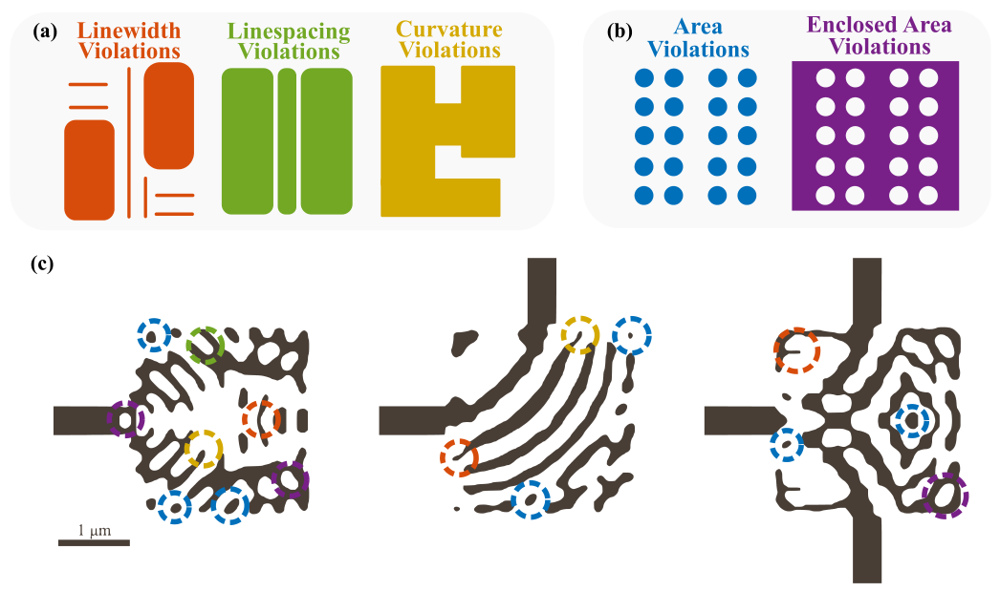

**How to read this figure.** Panel (a) shows the three "1-D" rules: a silicon line that is too thin (linewidth), a gap that is too narrow (spacing), and a corner that is too sharp (curvature). Panel (b) shows the two "2-D" rules on a pixel grid: an island that is too small (area) and a hole that is too small (enclosed area). Panel (c) highlights real violations, in matching colours, on unconstrained TO designs of a mirror, a bend and a T-splitter. The takeaway: a raw TO design breaks every one of these rules, in many places.

---

## 2. Photonic topology optimization overview

### The optimisation problem (Eq. 1)

The paper first writes broadband design as a minimax problem:

$$
\begin{aligned}
& \min_{\boldsymbol{\rho}} \left[ \max_{n} f_{n}(\boldsymbol{E}) \right], \quad n \in \{1,\dots,N\} \\
\text{s.t.}\quad & \nabla \times \frac{1}{\mu_0\mu_r}\nabla \times \boldsymbol{E} - \omega_m^2 \epsilon_0 \epsilon_r(\boldsymbol{\rho}) \boldsymbol{E} = -i\omega_m \boldsymbol{J}, \quad m \in \{1,\dots,M\} \\
& 0 \le \boldsymbol{\rho} \le 1 \\
& g_k(\boldsymbol{\rho}) \le 0, \quad k \in \{1,\dots,K\}
\end{aligned}
\tag{1}
$$

In words:

- $\boldsymbol\rho$ is the vector of all pixel densities (the design).
- $f_n$ is the $n$-th objective, e.g. "1 − reflected power at wavelength $n$". Smaller is better. We minimise the **worst** of them.
- The second line is **Maxwell's equations in frequency domain**, one for each frequency $\omega_m$. $\boldsymbol E$ is the electric field, $\boldsymbol J$ the source current (the input waveguide mode), $\mu_0,\epsilon_0$ the vacuum constants, $\mu_r = 1$ for these materials, and $\epsilon_r(\boldsymbol\rho)$ the relative permittivity, which depends on the design. This line just says "the fields must be physically correct".
- $0 \le \rho \le 1$ keeps densities in range.
- $g_k \le 0$ are the $K$ fabrication constraints this paper is about.

Usually $N = M$: one objective per frequency. (In the robust version of Sec. 5, each frequency has three objectives, one per eroded/blueprint/dilated design.)

### The epigraph form (Eq. 2)

The max in Eq. (1) is not differentiable where the worst frequency switches. So the paper rewrites it:

$$
\begin{aligned}
& \min_{\boldsymbol{\rho},\, t}\; t \\
\text{s.t.}\quad & \text{Maxwell's equations at every } \omega_m \\
& 0 \le \boldsymbol{\rho} \le 1 \\
& f_n - t \le 0, \quad n \in \{1,\dots,N\} \\
& g_k \le 0, \quad k \in \{1,\dots,K\}
\end{aligned}
\tag{2}
$$

**Why this is the same problem.** Every $f_n \le t$ means $t \ge \max_n f_n$. Minimising $t$ pushes it down until it touches the largest $f_n$. So at the optimum $t = \max_n f_n$, and minimising $t$ is minimising the worst objective. Each individual constraint $f_n - t \le 0$ is smooth, so MMA can use it. (The paper writes $f_n(\mathbf x)$ in Eq. 2; it means the same $f_n$ as in Eq. 1.)

**Worked example.** Suppose at some iteration the mirror reflects 97 %, 95 % and 92 % at three wavelengths. Then $f = 0.03, 0.05, 0.08$. The smallest feasible $t$ is 0.08. The optimiser's progress is measured by pushing $t$ (the 92 % wavelength) down; improving the 97 % wavelength alone does nothing for $t$.

### Step 1: the filter (Eqs. 3–5)

$$\tilde{\boldsymbol\rho} = w(\mathbf x) * \boldsymbol\rho \tag{3}$$

$\tilde\rho$ is the filtered design and $*$ is 2-D convolution. Two kernels are used.

The **uniform kernel**:

$$w(\mathbf{x}) = \begin{cases} \dfrac{1}{|\mathcal{N}|} & \mathbf{x} \in \mathcal{N} \\ 0 & \mathbf{x} \notin \mathcal{N} \end{cases} \tag{4}$$

$\mathcal N$ is a shape (disc, square, ellipse) and $|\mathcal N|$ its area (in pixels, the number of pixels in it). Dividing by $|\mathcal N|$ makes the weights sum to 1, so this is a plain average over the shape. Because foundry devices are 2-D shapes extruded upward, only 2-D shapes are needed.

The **conic kernel**:

$$w(\mathbf{x}) = \begin{cases} \dfrac{1}{a}\left(1 - \dfrac{|\mathbf{x}-\mathbf{x}_0|}{R}\right) & \mathbf{x} \in \mathcal{N} \\ 0 & \mathbf{x} \notin \mathcal{N} \end{cases} \tag{5}$$

$\mathcal N$ is a disc of radius $R$ centred at $\mathbf x_0$. The weight is largest at the centre and drops linearly to zero at the rim. $a$ normalises the weights to sum to 1. (In continuous 2-D, the cone's volume is $\pi R^2/3$, so $a = \pi R^2/3$. In 1-D the tent's area is $R$, so $a = R$.)

Why a cone rather than a flat disc? The cone gives a smooth filtered field whose slopes and curvatures have a simple, known relation to $R$. Section 3.1 exploits this to link $R$ to the minimum linewidth.

### Step 2: the projection (Eq. 6)

$$\bar{\boldsymbol{\rho}} = \frac{\tanh(\beta\eta) + \tanh\big(\beta(\tilde{\boldsymbol{\rho}}-\eta)\big)}{\tanh(\beta\eta) + \tanh\big(\beta(1-\eta)\big)} \tag{6}$$

Symbols: $\eta$ is the **threshold** (the value that maps to the middle), $\beta$ is the **steepness**.

**Why it has this form — check the ends.**

- At $\tilde\rho = 0$: the numerator is $\tanh(\beta\eta) + \tanh(-\beta\eta) = 0$ (tanh is odd). So $\bar\rho = 0$.
- At $\tilde\rho = 1$: numerator equals denominator, so $\bar\rho = 1$.
- So the map always sends 0 → 0 and 1 → 1, whatever $\beta$ and $\eta$ are. The awkward-looking constant terms are there only to guarantee this.
- In between, $\tanh(\beta(\tilde\rho-\eta))$ is an S-curve centred at $\tilde\rho = \eta$. As $\beta \to \infty$ it becomes a step: $\bar\rho = 0$ if $\tilde\rho < \eta$, $1$ if $\tilde\rho > \eta$.
- The slope at the threshold is $d\bar\rho/d\tilde\rho = \beta / [\tanh(\beta\eta)+\tanh(\beta(1-\eta))]$, which for $\eta = 0.5$ and large $\beta$ is about $\beta/2$. This is the factor $d\bar\rho/d\tilde\rho$ that appears in every chain rule later.

**Worked example** ($\eta = 0.5$, $\tilde\rho = 0.6$):

- $\beta = 8$: $\tanh(4) = 0.9993$, $\tanh(0.8) = 0.6640$. Numerator $= 1.6634$, denominator $= 2 \times 0.9993 = 1.9987$. So $\bar\rho = 0.832$.
- $\beta = 32$: $\tanh(16) \approx 1$, $\tanh(3.2) = 0.9967$. So $\bar\rho = (1 + 0.9967)/2 = 0.998$.

The same slightly-grey pixel is pushed almost fully to silicon once $\beta$ is large. That is why the optimisation "anneals" $\beta$ upward in stages (here 8 → 16 → 32): early on the landscape is smooth and the design can change topology freely; later the design binarises.

### Step 3: permittivity (Eq. 7)

$$\epsilon_r(\bar{\boldsymbol{\rho}}) = \epsilon_{\min} + \bar{\boldsymbol{\rho}}\,(\epsilon_{\max} - \epsilon_{\min}) \tag{7}$$

A straight-line interpolation between cladding ($\epsilon_{\min}$) and core ($\epsilon_{\max}$). With the paper's indices, $\epsilon_{\min} = 1.44^2 = 2.07$ and $\epsilon_{\max} = 3.4^2 = 11.56$. A pixel with $\bar\rho = 0.5$ gets $\epsilon_r = 2.07 + 0.5 \times 9.49 = 6.82$, a fictitious material. Grey pixels are allowed during optimisation but must be gone at the end.

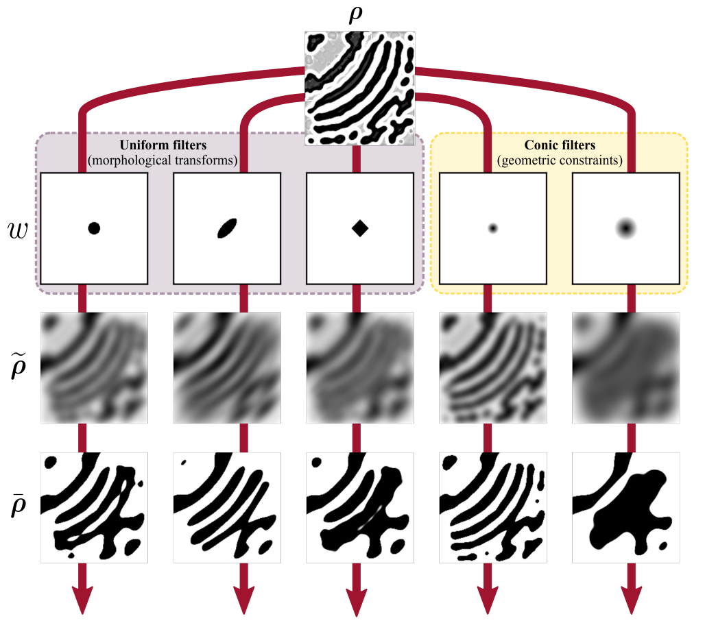

**How to read this figure.** The top row is one set of latent design variables $\rho$. Each column applies a different kernel $w$ (middle row: the kernel's shape), giving the filtered field $\tilde\rho$ and then the projected field $\bar\rho$ (bottom row). The left three are uniform kernels (disc, 45°-rotated ellipse, 45°-rotated square), used for morphological transforms; the right two are conic kernels with radius $R$ and $2R$, used for the geometric constraints. Notice that the kernel shape leaves its "fingerprint" on the projected design (rounded vs diagonal edges), and that a larger cone wipes out more of the small detail.

### A 1-D picture of filter and projection

The paper's figures are 2-D. A 1-D line cut makes the mechanism much easier to see.

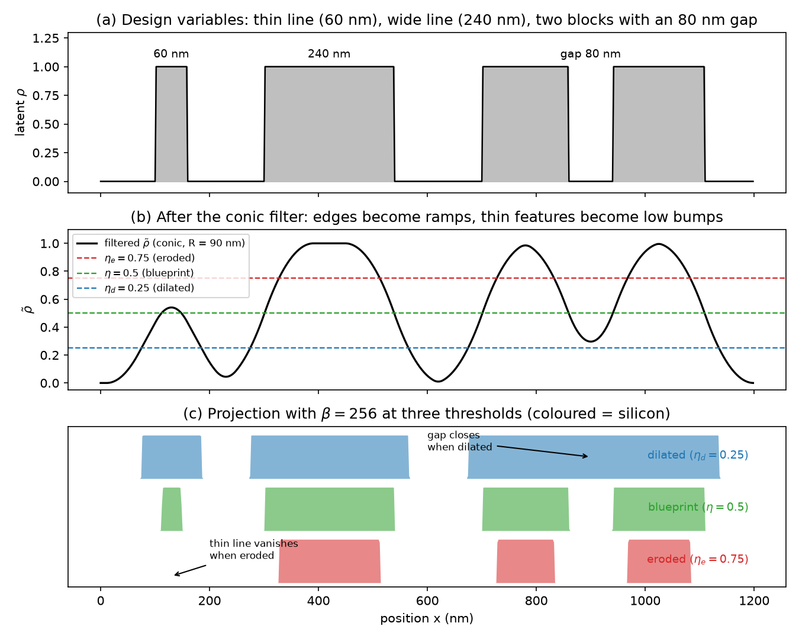

**How to read this figure.** (a) A latent density along a 1.2 µm line: a 60 nm line, a 240 nm line, and two blocks separated by an 80 nm gap. (b) After a conic filter with $R = 90$ nm, every edge is a ramp about $2R$ wide, the 60 nm line has become a low bump (peak 0.54), and the 80 nm gap has become a shallow dip (lowest value 0.30). (c) Projecting the same filtered field at three thresholds: at $\eta = 0.5$ (green, blueprint) all four features exist; at $\eta_e = 0.75$ (red, eroded) the 60 nm line disappears because its peak never reaches 0.75; at $\eta_d = 0.25$ (blue, dilated) the gap fills because its dip never goes below 0.25. In numbers from this run: the 240 nm line is 238 nm wide in the blueprint, 186 nm eroded and 290 nm dilated, so each edge moves by about 26 nm. **This is the core idea of Section 3.1: a feature is "too thin" if it does not survive erosion at $\eta_e$, and a gap is "too narrow" if it does not survive dilation at $\eta_d$.**

### Two ways to erode and dilate (Fig. 3, Eqs. 8–9)

**Way 1: shift the threshold.** Project the same $\tilde\rho$ with $\eta > 0.5$ (erosion) or $\eta < 0.5$ (dilation). This is what the Meep tutorial does (0.75 / 0.5 / 0.25), and what the 19 Nov schedule entry describes. The problem: how far an edge moves depends on how steep $\tilde\rho$ is at that edge. A soft, grey edge moves further than a sharp one for the same $\eta$. So "η = 0.7" does not mean "20 nm of over-etch" in any fixed way.

**Way 2: a morphological filter after projection.** Keep $\eta = 0.5$ and apply a separate nonlinear filter to the (already near-binary) $\bar\rho$. The **harmonic erosion filter** is

$$\mathcal{E}_{\mathcal{N}}(\boldsymbol{\rho}) = \left( \frac{1}{\boldsymbol{\rho}+\alpha} * w \right)^{-1} - \alpha \tag{8}$$

and the **harmonic dilation filter** is

$$\mathcal{D}_{\mathcal N}(\boldsymbol\rho) = 1 - \left(\frac{1}{1 - \boldsymbol\rho + \alpha} * w\right)^{-1} - \alpha \tag{9}$$

where $w$ is usually a uniform kernel over shape $\mathcal N$ and $\alpha$ is a small regularisation number ($10^{-3}$ in the paper). The $^{-1}$ means "one over" (a pixel-wise reciprocal), not a matrix inverse.

**Why Eq. (8) erodes — step by step.** The bracket is "take $1/(\rho+\alpha)$ of every pixel, average over the window, take one over the result". That is the **harmonic mean** of $\rho+\alpha$ over the window. The harmonic mean is dragged down hard by any small value. Take a window of 5 pixels:

- All five are silicon ($\rho = 1$): each $1/(1.001) \approx 0.999$, average 0.999, reciprocal 1.001, minus $\alpha$ gives **1.000**. Silicon stays silicon.
- Four are silicon, one is void ($\rho = 0$): the void pixel gives $1/0.001 = 1000$. Average $= (4 \times 0.999 + 1000)/5 = 200.8$. Reciprocal $= 0.00498$, minus $\alpha$ gives **0.004 ≈ 0**. One void pixel anywhere in the window turns the centre to void.

So the output is 1 only if the *whole* window is solid. That is exactly erosion by the window's radius: every edge moves inward by the window radius. As $\alpha \to 0$ it becomes the exact "minimum over the window" (true morphological erosion); $\alpha > 0$ keeps it differentiable.

Eq. (9) is the same trick applied to the void phase: $1-\rho$ is the void density, erode the void, then flip back with "1 −". Eroding the void is dilating the solid.

**The advantage.** A disc kernel of radius 20 nm erodes or dilates by 20 nm everywhere, regardless of the slope of $\tilde\rho$. **The cost.** It is limited by the pixel size (a 20 nm radius on a 17 nm grid is 1.2 pixels), and it is an extra nonlinear step.

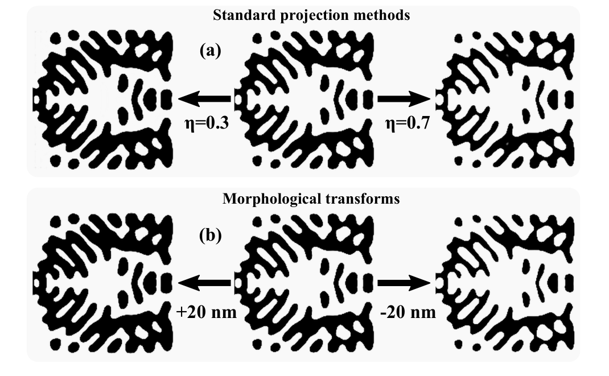

**How to read this figure.** Row (a) dilates (η = 0.3, left) and erodes (η = 0.7, right) a design by shifting the projection threshold. Row (b) does it with the harmonic filters (+20 nm, −20 nm). In row (a) different edges move by different amounts, because the filtered field has different slopes in different places. In row (b) every edge moves by the same 20 nm. That predictability is why Section 5 uses row (b) for robust design.

The following 1-D toy shows the same effect with numbers.

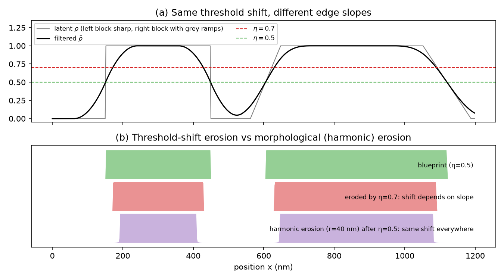

**How to read this figure.** (a) The left block has sharp latent edges; the right block has grey ramps in the latent design, so its filtered edges are less steep. (b) Measured edge shifts in this run: with η = 0.7 the sharp edges move 20 nm and 20 nm, but the soft edges move 24 nm and 30 nm. With a harmonic erosion of radius 40 nm applied after an η = 0.5 projection, all four edges move 40 nm (38 nm at the softest edge, within one 2 nm pixel). The threshold method's erosion depends on the design's history; the morphological one does not.

!!! tip "Link to 19 Nov and to the schedule's gotcha"
    The 19 Nov gotcha says: *"erosion and dilation of a binary pattern are not the same as thresholding a grayscale field at 0.25/0.75 — they agree only in the limit of a binarised design."* This section is the reason. Pick one convention for `variation.py` and say which one in its docstring. For a fixed physical etch bias δw (e.g. ±10 nm), the morphological (Way 2) definition is the one that means "δw nm" literally.

---

## 3. Minimum linewidth, spacing, and curvature constraints

This section collects earlier methods (Zhou et al. 2015 [13], Hägg & Wadbro 2018 [18], Qian & Sigmund 2013 [26], Wang et al. 2011 [36]).

### 3.1 Geometric constraints

**The idea in words.** Take the blueprint design. Imagine eroding it (threshold $\eta_e$) and dilating it (threshold $\eta_d$). If eroding makes no solid feature disappear, and dilating makes no gap disappear, then every solid feature is at least the minimum linewidth and every gap is at least the minimum spacing. The paper calls this "the topology is consistent": no islands or holes appear or vanish between the three versions.

To turn this into a smooth constraint you need two things:

1. a way to find the places where a feature would vanish — the "inflection regions" (more precisely the **ridges** of solid features and the **valleys** of gaps, where $\tilde\rho$ is flat); and
2. a known link between the filter radius $R$ and the thresholds $\eta_e$, $\eta_d$ for a given linewidth $l_w$ and spacing $l_s$.

#### The linewidth constraint (Eqs. 10–11)

$$g_{LW} = \frac{1}{n} \sum_{i} I_i^{LW} \cdot \Big[ \min\{ \tilde{\rho}_i - \eta_e,\; 0 \} \Big]^2 \tag{10}$$

$$I^{LW} = \bar{\boldsymbol{\rho}} \cdot \exp\!\left( -c\, |\nabla \tilde{\boldsymbol{\rho}}|^2 \right) \tag{11}$$

Read it piece by piece:

- The sum runs over all $n$ pixels $i$; dividing by $n$ makes it an average.
- $\min\{\tilde\rho_i - \eta_e, 0\}$ is zero when $\tilde\rho_i \ge \eta_e$ and negative when $\tilde\rho_i < \eta_e$. Squaring makes it a **one-sided quadratic penalty**: zero if the pixel's filtered value is high enough to survive erosion, growing smoothly as it falls short. Squaring also makes the penalty differentiable at the switch point (its slope there is 0, no kink).
- $I^{LW}$ decides **where** we check. It has two factors.
    - $\bar\rho$: about 1 in solid, 0 in void. So we only check solid regions.
    - $\exp(-c\,|\nabla\tilde\rho|^2)$: about 1 where the filtered field is flat ($\nabla\tilde\rho \approx 0$) and about 0 on steep edges. In a solid feature, $\tilde\rho$ is flat at its ridge (the centre line of a line, the middle of a blob).
- So $I^{LW} \approx 1$ only **at the centre of each solid feature**. There, the filtered value is the feature's peak. If the peak is below $\eta_e$, the feature would vanish under erosion: it is too thin, and the constraint penalises it.

**Why not check everywhere in the solid?** Because near every edge $\tilde\rho$ passes through values below $\eta_e$ even for a very wide line (look at the ramps in the 1-D figure above). Checking there would penalise every edge. Only the ridge value tells you whether the feature as a whole survives.

**The damping constant $c$.** It sets how "flat" a point must be to count. The paper uses $c = r^4$ with $r$ the design-grid resolution ($r = 1/\Delta x$; 60 pixels/µm here). This is a very large number, so the indicator is a narrow spike at true ridges. (The paper gives no units; read $r$ in its own grid units.)

**The derivative.** The optimiser needs $\partial g_{LW}/\partial\tilde\rho_i$. For the penalty factor alone, $\frac{d}{d\tilde\rho}[\min(\tilde\rho-\eta_e,0)]^2 = 2\min(\tilde\rho-\eta_e,0)$, which is negative when violated. So reducing $g$ means **raising** $\tilde\rho$ at the ridge: making the line wider/denser. The optimiser can either thicken a too-thin line or remove it entirely (then $\bar\rho \to 0$ and the indicator switches off). Both clear the violation.

#### The spacing constraint (Eqs. 12–13)

$$g_{LS} = \frac{1}{n} \sum_{i} I_i^{LS} \cdot \Big[ \min\{ \eta_d - \tilde{\rho}_i,\; 0 \} \Big]^2 \tag{12}$$

$$I^{LS} = (1 - \bar{\boldsymbol{\rho}}) \cdot \exp\!\left( -c\, |\nabla \tilde{\boldsymbol{\rho}}|^2 \right) \tag{13}$$

This is the mirror image. $1-\bar\rho$ selects void regions; the exponential again selects flat spots, which in void are the **bottoms of valleys** (the middle of a gap). If the valley floor $\tilde\rho$ is above $\eta_d$, the gap would close under dilation: it is too narrow. Then $\eta_d - \tilde\rho < 0$ and the penalty switches on.

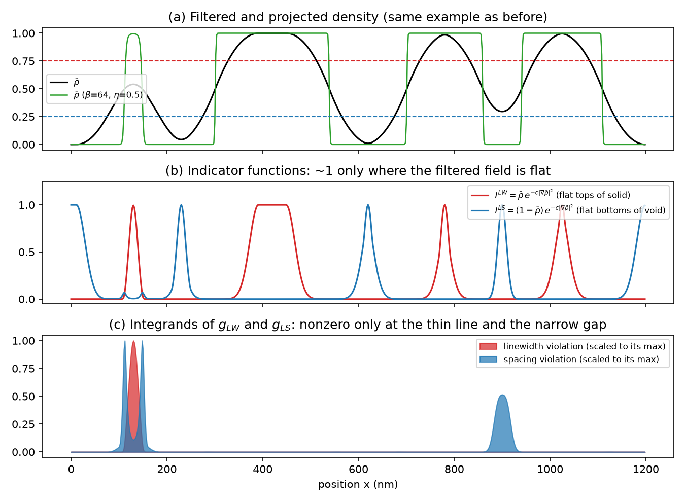

**How to read this figure.** (a) The same 1-D example: filtered $\tilde\rho$ (black) and projected $\bar\rho$ (green), with $\eta_e = 0.75$ and $\eta_d = 0.25$ as dashed lines. (b) The two indicators: red spikes sit on the flat tops of solid features, blue spikes on the flat bottoms of gaps (the wide 240 nm line has a flat plateau, so its red indicator is a wide block). (c) The integrands of Eqs. (10) and (12). The red linewidth penalty is nonzero only at the 60 nm line, whose ridge (0.54) is below 0.75. The blue spacing penalty is nonzero in the 80 nm gap, whose floor (0.30) is above 0.25. Every other feature is clean. Notice the small blue spikes on the flanks of the 60 nm line: that bump is so weak that its sides are nearly flat too, so the void indicator "leaks" there. This toy shows why these geometric constraints are approximate and, in the paper, need a small tolerance rather than an exact zero (see Sec. 4 and Sec. 6).

#### How the filter radius fixes the thresholds (Eqs. 14–15)

This is the relation the Thursday morning slot asks you to write down.

$$
\eta_e =
\begin{cases}
\frac{1}{4}\left(\frac{l_w}{R}\right)^2 + \frac{1}{2}, & \frac{l_w}{R} \in [0, 1] \\
-\frac{1}{4}\left(\frac{l_w}{R}\right)^2 + \frac{l_w}{R}, & \frac{l_w}{R} \in [1, 2] \\
1, & \frac{l_w}{R} \in [2, \infty)
\end{cases}
\tag{14}
$$

$$
\eta_d =
\begin{cases}
\frac{1}{2} - \frac{1}{4}\left(\frac{l_s}{R}\right)^2, & \frac{l_s}{R} \in [0, 1] \\
1 + \frac{1}{4}\left(\frac{l_s}{R}\right)^2 - \frac{l_s}{R}, & \frac{l_s}{R} \in [1, 2] \\
0, & \frac{l_s}{R} \in [2, \infty)
\end{cases}
\tag{15}
$$

$R$ is the conic filter radius, $l_w$ the minimum linewidth, $l_s$ the minimum spacing. The paper takes these from Qian & Sigmund [26] without derivation. Here is a 1-D derivation that reproduces them. (It uses the 1-D tent kernel $w(s) = \frac{1}{R}(1 - |s|/R)$ for $|s| \le R$. The paper applies the same formulas in 2-D with a 2-D cone; treat them as a very good guide and confirm by measurement, as the schedule's evening task does.)

**Question we answer.** In the blueprint (threshold 0.5), the thinnest allowed solid feature has width $l_w$. What ridge value $\eta_e$ does such a feature have? Then "ridge $\ge \eta_e$" (the constraint) means "width $\ge l_w$".

**Branch 2 ($R \le l_w \le 2R$): a binary line.** Take a latent line of 1s of width $l$, centred at 0. Its filtered value at the centre is the area of the tent inside $[-l/2, l/2]$:

$$\tilde\rho(0) = \int_{-l/2}^{l/2} \frac{1}{R}\left(1 - \frac{|s|}{R}\right) ds = \frac{2}{R}\int_0^{l/2}\left(1 - \frac{s}{R}\right) ds .$$

Do the integral:

$$\frac{2}{R}\left[\, s - \frac{s^2}{2R} \,\right]_0^{l/2} = \frac{2}{R}\left(\frac{l}{2} - \frac{l^2}{8R}\right) = \frac{l}{R} - \frac{1}{4}\left(\frac{l}{R}\right)^2 .$$

This is exactly the middle line of Eq. (14). Is the blueprint width of this line really $l$? At the edge $x = l/2$ the window $[0, l]$ covers half the tent when $l \ge R$, so $\tilde\rho(l/2) = 1/2$. Yes: a binary line of width $l \ge R$ crosses 0.5 exactly at its own edges. So for $l$ in $[R, 2R]$: **a line exactly $l_w$ wide has ridge value $l_w/R - \tfrac14 (l_w/R)^2$**. Set $\eta_e$ to that, and anything thinner falls below $\eta_e$.

**Branch 1 ($l_w \le R$): the sharpest possible ridge.** A binary line narrower than $R$ cannot even reach 0.5 at its centre (try $l = 0.5R$: ridge $= 0.5 - 0.0625 = 0.44$). So thin features in the blueprint come from grey latent patterns, and we need a different argument. Differentiate the tent twice. Its slope is $-\text{sign}(s)/R^2$, so its second derivative is a spike of $-2/R^2$ at the centre and spikes of $+1/R^2$ at $s = \pm R$. Convolving with $\rho$:

$$\tilde\rho''(x) = \frac{\rho(x+R) + \rho(x-R) - 2\rho(x)}{R^2} .$$

Because $0 \le \rho \le 1$, the most negative this can be is $-2/R^2$ (when $\rho(x)=1$ and $\rho(x\pm R)=0$). So **no filtered ridge can be more sharply curved than $-2/R^2$**. Near a ridge at $x_0$ with value $\eta$ (where $\tilde\rho' = 0$), Taylor's theorem gives

$$\tilde\rho(x_0 + u) \;\ge\; \eta - \frac{1}{2}\cdot\frac{2}{R^2}\,u^2 = \eta - \frac{u^2}{R^2}.$$

The field cannot drop to 0.5 before $\eta - u^2/R^2 = 1/2$, i.e. $u = R\sqrt{\eta - 1/2}$. The narrowest blueprint feature with ridge $\eta$ is therefore $l = 2u = 2R\sqrt{\eta - 1/2}$. Solve for $\eta$:

$$\eta_e = \frac12 + \frac{1}{4}\left(\frac{l_w}{R}\right)^2 ,$$

the first line of Eq. (14). The two branches meet smoothly at $l_w = R$: both give 0.75, and both have slope 1/2.

**Branch 3 ($l_w \ge 2R$).** A ridge cannot exceed 1, and a binary line of width $2R$ already reaches 1. Asking for wider features than $2R$ cannot be expressed by a threshold, so $\eta_e$ saturates at 1.

**Spacing, Eq. (15), by symmetry.** Swap silicon and glass: replace $\rho$ by $1-\rho$. A gap in the solid is a "line" in the void, and a threshold $\eta$ on $\rho$ becomes $1-\eta$ on $1-\rho$. So $\eta_d(l_s) = 1 - \eta_e(l_s)$. Check: $1 - (\tfrac14 r^2 + \tfrac12) = \tfrac12 - \tfrac14 r^2$ and $1 - (-\tfrac14 r^2 + r) = 1 + \tfrac14 r^2 - r$. These are exactly the lines of Eq. (15).

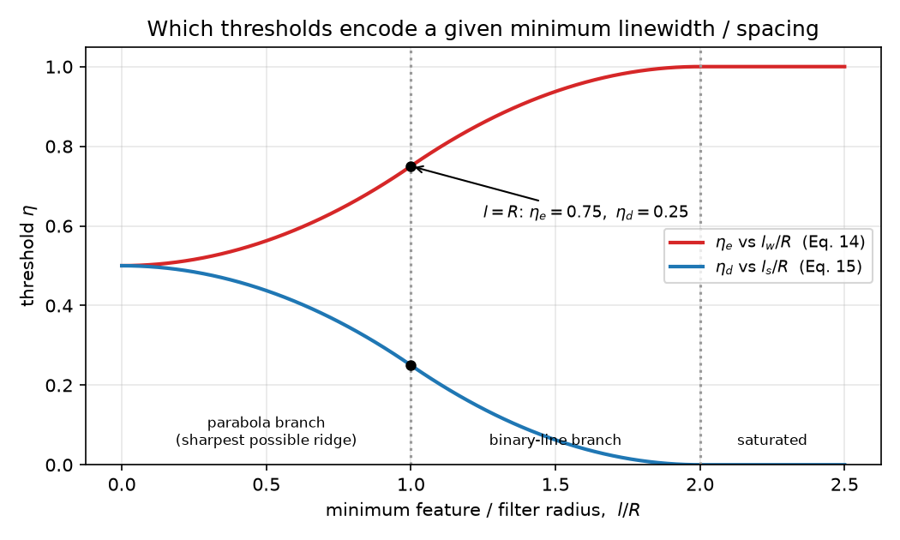

**How to read this figure.** The horizontal axis is the minimum feature divided by the filter radius. The red curve is the erosion threshold you need for a linewidth rule; the blue curve is the dilation threshold for a spacing rule. They are mirror images about 0.5. The marked points show the most common choice: $l = R$ gives $\eta_e = 0.75$ and $\eta_d = 0.25$. Moving right (bigger features for the same $R$) pushes $\eta_e$ toward 1 and $\eta_d$ toward 0.

**Choosing $R$ in practice.** You may pick any $R$, then compute $\eta_e,\eta_d$. Smaller $R$ allows smaller features but can make the problem "stiff" (the constraint Hessian, the matrix of second derivatives, becomes badly conditioned, so the optimiser takes tiny steps). The paper's recipe:

- if $l_w > l_s$: fix $\eta_e = 0.75$, get $R$ from $l_w$, then compute $\eta_d$ from Eq. (15);
- if $l_w < l_s$: fix $\eta_d = 0.25$, get $R$ from $l_s$, then compute $\eta_e$ from Eq. (14).

!!! warning "R = l_w or R = 2 l_w?"
    The paper says typical values $\eta_e = 0.75$, $\eta_d = 0.25$ "correspond to $R = 2l_w = 2l_s$". But plugging $\eta_e = 0.75$ into its own Eq. (14) gives $l_w/R = 1$, i.e. **$R = l_w$**, and that is also what Meep's `get_conic_radius_from_eta_e` returns (it inverts Eq. 14). Trust the formula, not the sentence. With $R = 2l_w$, Eq. (14) would give $\eta_e = 0.5625$. The schedule's rule of thumb "removes features smaller than ~2r" is a looser, different statement (it is about the full kernel width, $2R$); the precise link always runs through $\eta_e$. Settle it the way the evening task says: measure the achieved feature by an erosion test.

**Worked example (the paper's 90 nm rules).** $l_w = l_s = 90$ nm, $\eta_e = 0.75$. Then $R = 90$ nm. On the paper's 17 nm design grid that is about 5.3 pixels. And $\eta_d = 0.25$.

**Worked example (unequal rules).** $l_w = 120$ nm, $l_s = 90$ nm. Since $l_w > l_s$, fix $\eta_e = 0.75$, so $R = 120$ nm. Then $l_s/R = 0.75$ (first branch of Eq. 15): $\eta_d = 0.5 - 0.25 \times 0.5625 = 0.359$. Sanity check: the gap rule is looser relative to $R$, so $\eta_d$ is closer to 0.5 (a milder dilation).

**Inverting Eq. (14) — what Meep does.** For $\eta_e \in [0.5, 0.75]$: $\eta_e - \tfrac12 = \tfrac14 (l_w/R)^2$, so $R = l_w / (2\sqrt{\eta_e - 1/2})$. For $\eta_e \in [0.75, 1]$: $(l_w/R)^2 - 4(l_w/R) + 4\eta_e = 0$, take the root in $[1,2]$: $l_w/R = 2 - 2\sqrt{1-\eta_e}$, so $R = l_w/(2 - 2\sqrt{1-\eta_e})$.

```python
import numpy as np

def eta_e_from(l, R):                      # Eq. (14)
    r = l / R
    if r <= 1:  return 0.25 * r**2 + 0.5
    if r <= 2:  return -0.25 * r**2 + r
    return 1.0

def eta_d_from(l, R):                      # Eq. (15) = 1 - Eq. (14)
    return 1.0 - eta_e_from(l, R)

def radius_from(l, eta_e):                 # invert Eq. (14), as Meep's get_conic_radius_from_eta_e does
    if 0.5 <= eta_e < 0.75:  return l / (2 * np.sqrt(eta_e - 0.5))
    if 0.75 <= eta_e <= 1.0: return l / (2 - 2 * np.sqrt(1 - eta_e))
    raise ValueError("eta_e must be in [0.5, 1]")

# design rules: 120 nm min linewidth, 90 nm min spacing (l_w > l_s case from Sec. 3.1)
lw, ls = 120.0, 90.0
R = radius_from(lw, 0.75)                  # fix eta_e = 0.75 for the larger rule
print(f"R = {R:.1f} nm, eta_e = {eta_e_from(lw, R):.3f}, eta_d = {eta_d_from(ls, R):.3f}")

# 1-D check: a binary line of width w, filtered with a conic (tent) kernel of radius R
dx = 0.5
x = np.arange(-600, 600, dx)
k = np.arange(-R, R + dx / 2, dx); w = 1 - np.abs(k) / R; w /= w.sum()
for width in [60, 90, 120, 160]:
    rho = (np.abs(x) <= width / 2).astype(float)
    peak = np.convolve(rho, w, mode="same").max()
    print(f"line {width:4.0f} nm: filtered peak = {peak:.3f}  ->  survives erosion? {peak >= eta_e_from(lw, R) - 1e-3}")
```

**What you should see:** `R = 120.0 nm, eta_e = 0.750, eta_d = 0.359`, then peaks 0.441, 0.612, 0.752, 0.890. Only the 120 nm and 160 nm lines survive erosion at 0.75. The 120 nm line sits right on the boundary, which is the whole point of Eq. (14).

#### Gradual enforcement and the tolerance $G_k$

The constraints are not imposed as hard $g \le 0$ from the start. The paper uses $g_k \le G_k$, with $G_k$ shrinking as the optimisation proceeds (details in Sec. 6). The choice of $G_k$ also trades off the geometric constraints against the area constraints.

#### Curvature comes for free (Eq. 16)

With a circular filter, a satisfied linewidth constraint means no solid feature can contain a circle smaller than $l_w$ across. A convex corner is the edge of such a circle. So the sharpest solid corner has radius

$$\kappa_{w,s} = \frac{l_{w,s}}{2}. \tag{16}$$

The same for void corners with $l_s$. **Example:** $l_w = 90$ nm gives a minimum radius of curvature of 45 nm. If a process can make sharper corners than this, these constraints are too strict; Sec. 3.2 offers a way to set curvature separately.

### 3.2 Morphological-transform constraints

This is an alternative way to enforce linewidth, spacing and curvature, using the erosion/dilation filters of Eqs. (8)–(9).

$$\mathcal{O}_\mathcal{N}(\boldsymbol{\rho}) = \mathcal{D}_\mathcal{N}\big(\mathcal{E}_\mathcal{N}(\boldsymbol{\rho})\big) \tag{17}$$

$$\mathcal{C}_{\mathcal{N}'}(\boldsymbol{\rho}) = \mathcal{E}_{\mathcal{N}'}\big(\mathcal{D}_{\mathcal{N}'}(\boldsymbol{\rho})\big) \tag{18}$$

$\mathcal O$ is **opening** (erode, then dilate, with window $\mathcal N$). $\mathcal C$ is **closing** (dilate, then erode, with window $\mathcal N'$). The two windows may differ.

$$\mathcal{O}_\mathcal{N}(\boldsymbol{\rho}) = \mathcal{C}_{\mathcal{N}'}(\boldsymbol{\rho}) \tag{19}$$

If opening and closing give the same result, the design has no feature that either operation would remove, so it satisfies the rules encoded by the window shapes. The paper states that the opening window's shape sets the rules for the **void** regions and the closing window's shape sets the rules for the **solid** regions. (Do not try to match this against the one-line intuition in the background section, "opening removes thin solids, closing fills narrow gaps": when the two results are forced to be equal, both windows act on both phases, and the paper's assignment is the one to quote. The point that matters is that the two window shapes set the rules.) Because each window has a size and a corner rounding, $\mathcal N$ and $\mathcal N'$ together encode **four** rules: linewidth, spacing, and a curvature for each phase. Example from the paper: a closing window that is a 90 nm square with 10 nm rounded corners enforces a 90 nm linewidth and a 10 nm radius of curvature. This lets curvature be set independently of linewidth, which Eq. (16) cannot.

The obvious constraint is the distance between the two:

$$g_{LW,LS,\kappa} = \big\|\mathcal{O}_\mathcal{N}(\boldsymbol{\rho}) - \mathcal{C}_{\mathcal{N}'}(\boldsymbol{\rho})\big\|_2 \le G_{LW,LS,\kappa} \tag{20}$$

**Why the paper does not use it for DRC.** In practice it does not push the design toward binary. If the design is still grey, the optimiser stalls trying to make two grey fields agree. So the paper uses the geometric constraints of Sec. 3.1 for DRC, and keeps the morphological operators for robustness (Sec. 5).

---

## 4. Minimum area and enclosed area constraints

This is the paper's main new contribution.

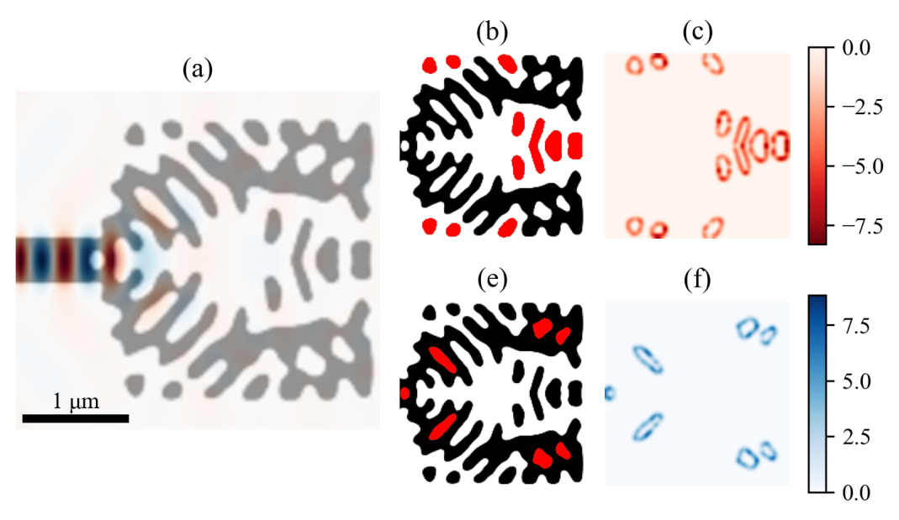

**How to read this figure.** (a) A nominal design (1 µm scale bar). (b) Islands that violate the minimum-area rule, highlighted in red over the black-and-white design. (c) The gradient of the area constraint: red (negative) values sit exactly on those islands, telling the optimiser "reduce density here", i.e. erase them. (e) Holes that violate the enclosed-area rule. (f) The gradient of the enclosed-area constraint: blue (positive) values on the holes, telling the optimiser "increase density here", i.e. fill them. Everywhere else the gradient is zero, so the constraint does not disturb good parts of the design.

### The idea

1. Find the offending regions: islands that are too small, and holes that are too small.
2. Build a mask (indicator) around each one.
3. Penalise the amount of silicon inside island masks, and the amount of void inside hole masks.

Driving the penalty to zero **eliminates** each offending island (erodes it away completely) or hole (fills it completely). The constraint does not try to *grow* a small island into an allowed one. That one-directional choice keeps the maths simple; the authors list a two-directional version as future work.

### The constraint functions (Eqs. 21–24)

$$g_A = \int \bar{\rho}\, I_A(\bar{\rho})\, d\bar\rho \tag{21}$$

$$g_{EA} = \int (1 - \bar{\rho})\, I_{EA}(1 - \bar{\rho})\, d\bar\rho \tag{22}$$

$$g_A \le 0 \tag{23}$$

$$g_{EA} \le 0 \tag{24}$$

The integral notation is unusual; read it as "sum over all pixels". $I_A$ is 1 on the (slightly enlarged) area of every too-small island, 0 elsewhere. So $g_A$ is **the total amount of silicon sitting in too-small islands**. Likewise $g_{EA}$ is **the total amount of void sitting in too-small holes**. Both are non-negative, so "$\le 0$" really means "$= 0$": no offending islands or holes at all.

### How the indicators are built

1. **Find contours.** Use the **marching-squares** algorithm (scikit-image's `find_contours`) on $\bar\rho$ with threshold 0.6. Marching squares walks over the grid and traces the outline where the field crosses the threshold, like contour lines on a map.
2. **Measure each region's area.** Sum the density values inside each contour (the paper uses a SciPy routine; the region is found with morphological operations).
3. **Flag small ones.** If an island's (or hole's) area is below the rule, fill that contour, dilate it by **one pixel** (e.g. with Eq. 9), and add it to the indicator.

Why dilate by one pixel? So that the indicator's edge sits just outside the island, where $\bar\rho$ is already essentially zero. Then small changes in where the indicator ends have almost no effect on $g_A$. This is what makes the gradient trick below valid.

**Worked numbers.** The paper's design pixel is 17 nm, so one pixel is $0.017^2 = 2.9 \times 10^{-4}$ µm². A minimum area of 0.08 µm² is about 277 pixels, the same as a disc of diameter $2\sqrt{0.08/\pi} = 0.32$ µm. The loosest rule, 0.005 µm², is a disc of diameter 80 nm (about 17 pixels); the strictest, 0.2 µm², a disc of diameter 0.50 µm. Compare with a 90 nm linewidth: a 90 nm-wide disc has area only 0.0064 µm². So the **area rule is usually stricter than the linewidth rule**, which is why it is needed: a blob can be 150 nm across (passing linewidth) and still be too small in area.

### Why driving to zero is well behaved

As the optimiser shrinks an offending island, $\bar\rho$ inside it falls, so $g_A$ falls **continuously** to zero; when the island is gone, the contour finder no longer finds it and the indicator is empty. Gradient-based optimisers need this continuity. And because the indicator is exactly zero when nothing violates, $g_A$ and $g_{EA}$ can be driven to exactly zero. The geometric constraints of Sec. 3.1 cannot: their spatial-gradient term always leaves a small discretisation error, so they need a tolerance.

### The gradients (Eqs. 25–30)

By the product rule, differentiating Eq. (21) with respect to $\bar\rho$:

$$\frac{dg_A}{d\bar{\rho}} = I_A + \bar{\rho}\,\frac{dI_A}{d\bar{\rho}} \tag{25}$$

and for Eq. (22), remembering $d(1-\bar\rho)/d\bar\rho = -1$:

$$\frac{dg_{EA}}{d\bar{\rho}} = -I_{EA} - (1 - \bar{\rho})\,\frac{dI_{EA}}{d\bar{\rho}} \tag{26}$$

(The paper says "w.r.t. the filtered design parameters"; these are with respect to the *projected* $\bar\rho$, as the symbols show.) Then the chain rule back to the design variables:

$$\frac{dg_A}{d\rho} = \frac{dg_A}{d\bar{\rho}}\,\frac{d\bar{\rho}}{d\tilde{\rho}}\,\frac{d\tilde{\rho}}{d\rho} \tag{27}$$

$$\frac{dg_{EA}}{d\rho} = \frac{dg_{EA}}{d\bar{\rho}}\,\frac{d\bar{\rho}}{d\tilde{\rho}}\,\frac{d\tilde{\rho}}{d\rho} \tag{28}$$

- $d\bar\rho/d\tilde\rho$ is the derivative of the tanh projection (Eq. 6), pixel by pixel: $\beta\,\text{sech}^2(\beta(\tilde\rho-\eta))$ divided by the denominator of Eq. (6).
- $d\tilde\rho/d\rho$ is the filter again: multiplying a gradient by it means convolving the gradient with the (mirror-flipped) kernel. For a symmetric kernel, that is just filtering the gradient.

**The awkward term.** $dI_A/d\bar\rho$ is the derivative of "which pixels the contour finder flags". That is not smooth; it jumps when a contour appears or vanishes. The paper's argument for dropping it: the geometric constraints of Sec. 3 keep islands well separated, and the one-pixel dilation puts the indicator's boundary where $\bar\rho$ (for $I_A$) or $1-\bar\rho$ (for $I_{EA}$) is exponentially small. So in Eq. (25), $\bar\rho \cdot dI_A/d\bar\rho \approx 0 \cdot (\text{something}) \approx 0$. What is left:

$$\frac{dg_A}{d\rho} = I_A(\bar\rho)\,\frac{d\bar\rho}{d\tilde\rho}\,\frac{d\tilde\rho}{d\rho} \tag{29}$$

$$\frac{dg_{EA}}{d\rho} = -I_{EA}(1-\bar\rho)\,\frac{d\bar\rho}{d\tilde\rho}\,\frac{d\tilde\rho}{d\rho} \tag{30}$$

In words: **the area gradient is the indicator mask, pushed back through the projection and filter.** Positive on offending islands (so a gradient step lowers $\rho$ there, erasing them) and negative on offending holes (raising $\rho$, filling them). This is the red/blue pattern in Fig. 4(c, f) (plotted there with the opposite sign convention: red = "decrease").

**Competition between constraints.** Sometimes the linewidth constraint wants to thicken a small feature while the area constraint wants to erase it. The optimiser can stall. The paper resolves this by weighting the two sets of constraints differently through the tolerances $G_k$ (Sec. 6).

---

## 5. Robust optimization

**The problem.** Lithography and etching are never perfect. A common systematic error is that every edge moves in or out by some nanometres (over- or under-etch). A device that works only at the exact nominal geometry has poor **yield** (fraction of fabricated chips that meet spec).

**The usual approach and its weaknesses.** Earlier density-based robust TO optimises the worst of three designs: eroded, blueprint, dilated, all made by threshold shifting (η > 0.5, 0.5, η < 0.5). Two problems:

1. The three must share the same **topology** (same number of holes and islands). That is restrictive with small features, where a hole might legitimately close in the dilated version.
2. How many nanometres the threshold shift corresponds to depends on the dynamic range and history of the latent $\rho$ (the slope issue of Fig. 3). So you cannot say "this is robust to ±20 nm" with confidence.

**The paper's approach.**

- Apply the DRC constraints (Sec. 3.1 geometric + Sec. 4 area) **only to the blueprint**.
- Make the eroded and dilated designs with the **harmonic morphological filters** (Eqs. 8–9) applied after projection. A disc of radius 20 nm means exactly ±20 nm.
- Optimise the worst case over all three designs and all frequencies (with 10 frequencies, 30 objective terms in the epigraph).
- Topology is allowed to differ between the three versions.

So DRC and robustness are fully **decoupled**: you can turn either on without the other.

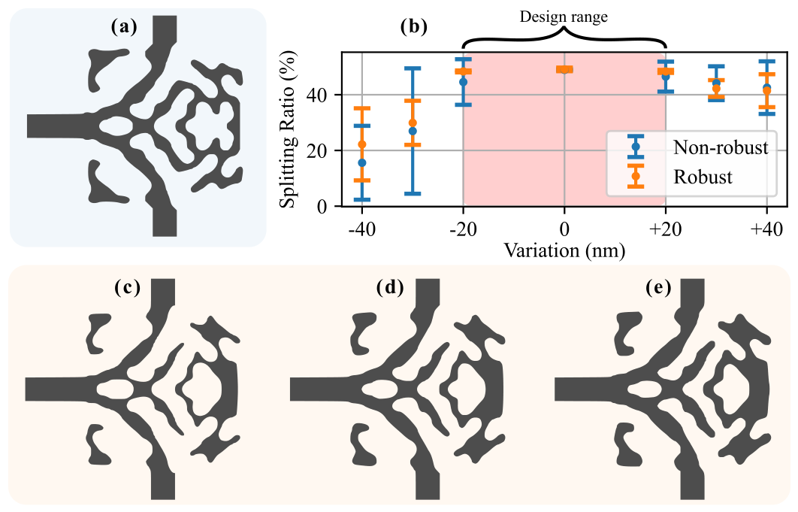

**How to read this figure.** (a) A T-splitter optimised without robustness. (b) Splitting ratio (target 50 %) versus etch variation in nm, for the non-robust (blue) and robust (orange) designs; the error bars show the spread across the wavelength band, and the shaded "design range" is ±20 nm. (c–e) The robust design's eroded, blueprint and dilated versions (smoothed only for display). The robust design's curve stays flatter and its error bars are much smaller inside ±20 nm, and it still holds up better out to ±40 nm.

**Details and numbers.**

- Design grid 17 nm. The ±20, ±30 and ±40 nm perturbations are harmonic filters of radius 1.2, 1.8 and 2.4 pixels. These are only approximate on a 17 nm grid, but distinct enough.
- Robustness costs **two extra Maxwell solves per iteration** (eroded and dilated), so three forward (and three adjoint) simulations instead of one.
- The nominal broadband splitter is already somewhat robust, because optimising over a band removes the extremely sharp resonant behaviour of single-frequency designs. But for the specific error it was trained on, the robust design is much better: error bars up to **24× smaller** for variations of 20 nm or less.

**Limitation stated by the authors.** This handles a **uniform** over/under-etch. **Random, spatially varying** perturbations (over-etched here, under-etched there; roughness) are left for future work. Randomly varying η could be used, but it inherits the slope problem of Fig. 3.

---

## 6. Numerical examples

### Set-up

Three 2-D broadband devices inside a 3 µm × 3 µm design region: a **mirror**, a **90° bend** and a **T-splitter**. These were chosen because routing light sharply in a small space tends to produce small islands and holes, i.e. lots of DRC violations to fix. Each device is designed under **nine** synthetic rulebooks, 27 designs in all.

**Objective via mode overlap (Eqs. 31–32).** The figure of merit uses the amount of light in a particular waveguide mode, obtained by an overlap integral over a cross-section $A$ of the output waveguide:

$$a_m^{\pm} = c \int_A \left[ \boldsymbol{E}^*(\boldsymbol{r}) \times \boldsymbol{H}_m^{\pm}(\boldsymbol{r}) + \boldsymbol{E}_m^{\pm}(\boldsymbol{r}) \times \boldsymbol{H}^*(\boldsymbol{r}) \right] \cdot \hat{\boldsymbol{n}}\, dA \tag{31}$$

$$|a_m^{\pm}|^2 = P \tag{32}$$

- $\boldsymbol E, \boldsymbol H$: the simulated fields at one frequency (Fourier-transformed from the time-domain FDTD run).
- $\boldsymbol E_m^\pm, \boldsymbol H_m^\pm$: the profile of mode $m$ travelling forward (+) or backward (−).
- $\hat{\boldsymbol n}$: the normal to the cross-section; $^*$ is complex conjugate.
- $c$: a normalisation so that $|a|^2$ is the **power** $P$ carried by that mode (Eq. 32).

Why this form: it projects the total field onto one mode, using the fact that different waveguide modes are orthogonal under this cross-product integral. The result is proportional to an **S-parameter** (an entry of the scattering matrix). If $|a_1^+|^2 = 0.95$ (with input power normalised to 1), 95 % of the power leaves in the fundamental forward mode.

**Gradual constraints (Eq. 33).** The fabrication constraints are applied as $g_k \le G_k$ with $G_k$ shrinking during the run:

$$
\begin{aligned}
& \min_{\rho,\,t}\; t \\
\text{s.t.}\quad & \text{Maxwell's equations at } \omega_m,\ m \in \{1,\dots,10\} \\
& 0 \le \rho \le 1 \\
& f(\omega_n) - t \le 0, \quad n \in \{1,\dots,10\} \\
& g_k \le G_k, \quad k \in \{LS, LW, A, EA\}
\end{aligned}
\tag{33}
$$

Why gradual? Early on, the design must be free to change topology. A newly appearing hole is briefly a "too-small hole", which would violate the rules; hard constraints from the start would freeze the topology.

The neat trick: for these problems the objective goes to zero as the device improves (e.g. $f = 1 - $ transmission). So set

$$G_k = a_k\, t,$$

with $a_k = 10^{-5}$ for all four constraints. As the worst-case objective $t$ shrinks, the tolerance on DRC violations shrinks with it, automatically. **Example:** if $t = 0.05$ (worst wavelength 95 % efficient), the allowed constraint value is $5 \times 10^{-7}$. The constants $a_k$ and $\beta$ are tuning knobs when an optimisation stalls (see 6.3).

**Simulation settings.**

- Solver: **Meep** (FDTD), time-domain, so one pulsed run gives all 10 frequencies at once.
- Simulation grid: 30 pixels/µm (33 nm). Design grid: 60 pixels/µm (17 nm). The design grid is finer than the simulation grid.
- Materials: silicon $n = 3.4$, oxide $n = 1.44$, no dispersion (for simplicity).
- Schedule: 70 iterations at each of $\beta = 8, 16, 32$, so 210 iterations. **Constraints switched on only at $\beta = 32$** (iteration 140). MMA (from the NLopt library) restarted at each $\beta$ change.
- Cost: 6–8 hours per device on 4 CPU cores.

Compare with the schedule's Meep example ($\beta$ = 8 → 256 in six stages, 80–120 evaluations each): same principle, a smooth early landscape, binarisation late.

### 6.1 Mirror

Goal: reflect the incoming fundamental mode straight back into the same waveguide.

$$f(\omega_n) = 1 - |a_1^-(\omega_n)|^2 \tag{34}$$

$a_1^-$ is the backward-travelling fundamental mode amplitude at frequency $\omega_n$ (the paper writes $\alpha$; same thing). Minimax over 10 frequencies with the four constraints, $a_k = 10^{-5}$.

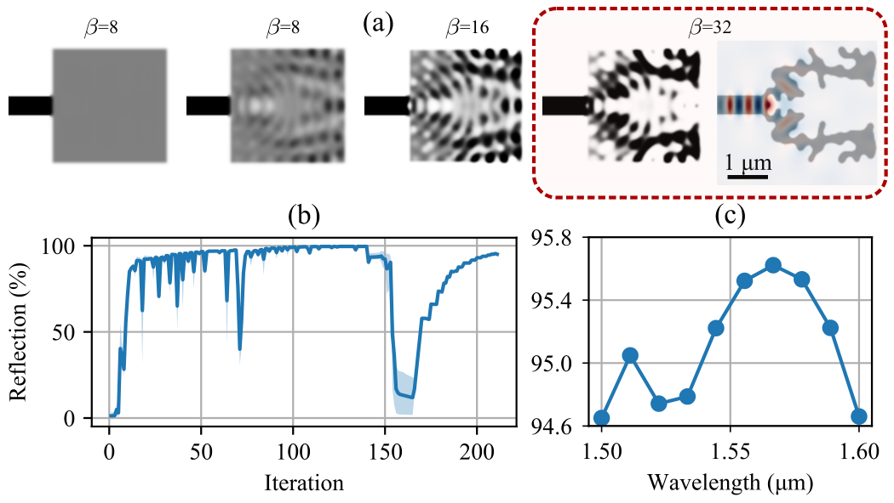

**How to read this figure.** (a) The projected design at several iterations, from a uniform grey start to the final binary device, plus the steady-state field at the centre wavelength. (b) Reflection versus iteration: it climbs quickly near 100 %, then **drops sharply** around iteration 140–160 when the constraints switch on (all the small islands and holes it relied on are now forbidden), and then recovers while the design becomes DRC-clean. (c) Final reflection versus wavelength from 1.50 to 1.60 µm: flat, with less than 1 % variation. Rules here: 90 nm linewidth and spacing, 0.08 µm² area, 0.2 µm² enclosed area.

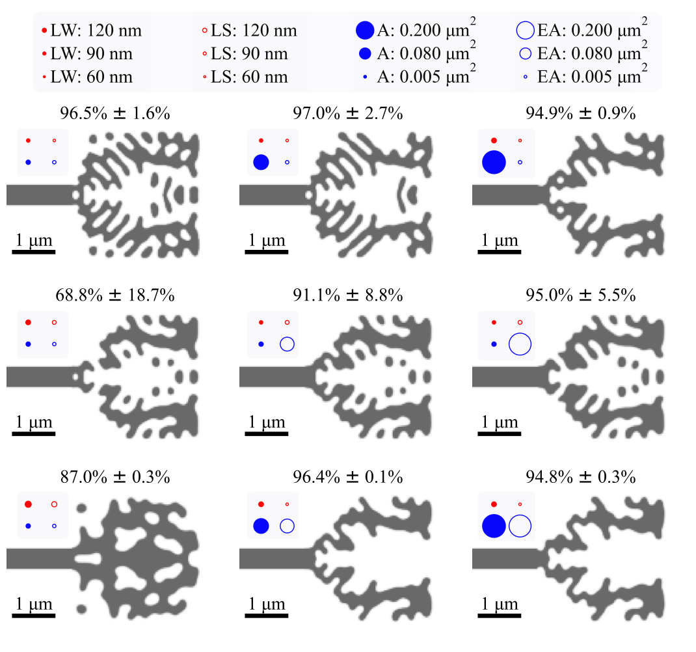

**How to read this figure.** The top legend draws each rule to scale: red dots for linewidth/spacing (diameter = the rule), solid and hollow blue circles for area and enclosed area (circle with that area). Rules get stricter from upper-left (60 nm, 0.005 µm²) to lower-right (120 nm, 0.2 µm²). Above each device is its mean reflection over 1.5–1.6 µm with the min–max spread. Stricter rules give visibly chunkier, simpler shapes.

**Results.** All but two of the nine mirrors reflect more than 90 %; the strictest one varies by only ±0.3 % across the band. Looser rules do **not** always win. One design (90 nm, 0.005 µm²) reached only 68.8 % with 18.7 % variation, even though the design to its right (same 90 nm rule, stricter area) did much better, and that better design also satisfies the looser rulebook. So a global optimiser could have found it. This is the nature of **local** optimisation in a non-convex landscape: the result depends on the path, and you may need restarts or different constraint weights.

### 6.2 Bend

Goal: turn the fundamental mode by 90° into the north-going output.

$$f(\omega_n) = 1 - |a_1^+|^2 \tag{35}$$

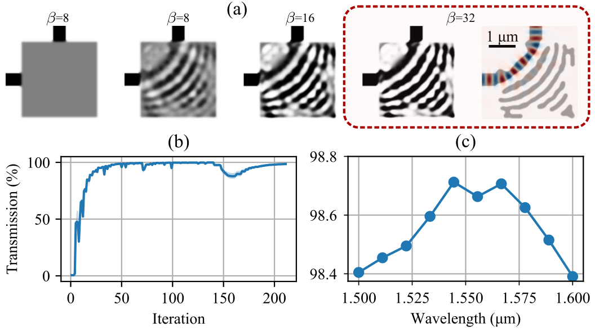

**How to read this figure.** Same layout as Fig. 6. A red box marks the iteration where the constraints became active. The drop in transmission at that point is only about 10 %, because the bend's design naturally preferred large, elongated features and gaps that already nearly obeyed the area rules. Final transmission near 98.7 % at the band centre.

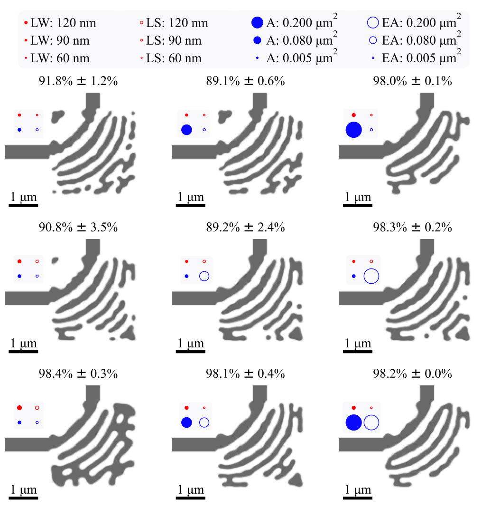

**How to read this figure.** Same layout as Fig. 7, for bends. All nine transmit more than 89 % on average. The strictest rulebook (lower-right) gives 98.2 % with almost no variation across the band. In that case the area constraints removed small Bragg-mirror-like ripples at the boundary the moment they switched on, and the design then evolved along a different path from the others.

### 6.3 T-splitter

Goal: split the input equally into two outputs that leave at 90° (left and right), forming a "T". Turning light sharply suggests small reflecting islands and holes will appear, which makes this the hardest DRC case.

$$f(\omega_n) = 1 - |a_{(1,1)}^+|^2 - |a_{(1,2)}^+|^2 \tag{36}$$

$a_{(1,1)}^+$ and $a_{(1,2)}^+$ are the fundamental-mode amplitudes in output ports 1 and 2. Minimising $f$ maximises the total output; a **mirror-symmetry constraint** on the geometry forces the split to be 50:50.

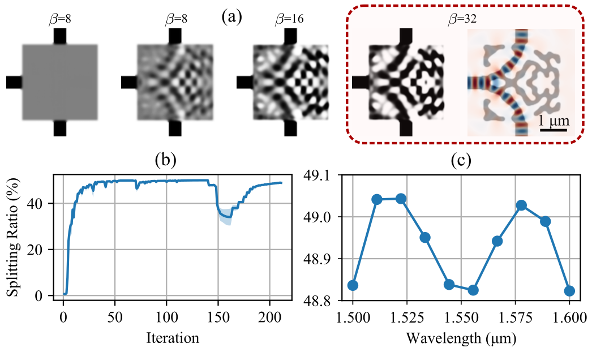

**How to read this figure.** (a) The design through the $\beta$ stages: small islands form in the first two stages. When the constraints switch on, the **geometric** constraints "bridge" islands that are closer than the spacing rule (merging them into one piece), and the **area** constraints erase remaining isolated small islands. The enclosed-area constraint stops new small holes forming during this bridging. (b) Splitting ratio versus iteration. (c) Final splitting ratio versus wavelength: 49 % mean per port with 0.2 % variation.

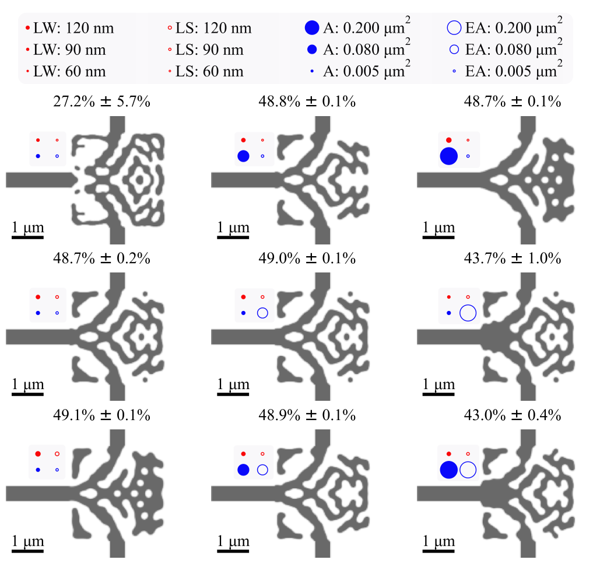

**How to read this figure.** Same layout as Figs. 7 and 9, for splitters (ideal value 50 % per port). Most are close to 50 %. The least-constrained one (upper-left) is poor: 27.2 % ± 5.7 %.

**The lesson from the bad splitter.** It was an unlucky local optimum. Re-running the same rulebook with looser constraint weights, $a_k = 10^{-3}$ instead of $10^{-5}$, gave 49.5 % ± 0.05 %, still fully DRC-clean. Too-strict weights can trap the optimiser. The weights $a_k$ are a practical knob for slow or stuck runs.

---

## 7. Conclusion

The paper delivers one density-based TO framework that enforces all five fundamental foundry rules (linewidth, spacing, curvature, area, enclosed area) with no re-parameterisation, plus robust optimisation against uniform etch bias using differentiable morphological filters, demonstrated on three devices × nine rulebooks.

**Future work they name** (useful for your novelty check):

- an area constraint that can **grow or shrink** violating regions, not only erase them;
- a principled way to choose the tolerances $G_k$ and weights, so runs need less hand-tuning (maybe via constraints built on morphological transforms);
- handling **non-uniform** uncertainty: over-etch in some places and under-etch in others, and **surface roughness**;
- including foundry calibration steps such as **optical proximity correction (OPC)**, which current DRC pipelines assume.

---

## How this connects to your project

Your project is robust, fabrication-aware inverse design in Meep/Tidy3D, with Monte-Carlo yield and maybe an ML surrogate. This paper is the reference implementation of the "fabrication-aware" half:

- **Your `filters.py` (26 Nov evening)** is Eqs. (3), (5) and (6). Use Eq. (14) (or Meep's `get_conic_radius_from_eta_e`) to get $R$ from your foundry's minimum feature, and check the achieved feature with an erosion test, as the schedule says. Recent Meep versions also ship the indicator-based linewidth/spacing constraints of Eqs. (10)–(13) in the adjoint filters module (look for functions named like `constraint_solid` / `constraint_void`; check your installed version).
- **Your `variation.py` (19 Nov)**: this paper shows why threshold-shift erosion (η = 0.75/0.25) is not a fixed nanometre bias, and gives the harmonic filter (Eqs. 8–9) for a literal ±δw. Choose one convention and document it.
- **Your novelty (10 May 2027)**: Hammond 2021 already does DRC + worst-case ±20 nm uniform etch robustness, in Meep, in 2-D, on a T-splitter. To not be "Hammond 2021 with a different component", your contribution should sit in what it leaves open: **spatially varying / random** perturbations, **thickness and sidewall-angle** variation, **3-D** validation, a **Monte-Carlo yield** measurement rather than three corner cases, a measured **cost of robustness** in performance, or an ML surrogate to make many-sample robustness affordable.

!!! warning "Common confusions"
    - **Three densities.** $\rho$ (latent, what MMA changes), $\tilde\rho$ (filtered), $\bar\rho$ (projected, what Maxwell sees). The linewidth constraint compares $\tilde\rho$ with $\eta_e$ but uses $\bar\rho$ in its indicator. Mixing them up breaks the constraint.
    - **Filter radius ≠ minimum feature.** For $\eta_e = 0.75$, Eq. (14) gives $R = l_w$; other $\eta_e$ give other $R$. The paper's sentence "$R = 2l_w$" disagrees with its own Eq. (14); Meep follows the equation.
    - **"Inflection region"** in the paper means the flat ridge or valley where $\nabla\tilde\rho \approx 0$, not the steepest point of the edge (which is the mathematical inflection point).
    - **Threshold-shift erosion is not a fixed distance.** η = 0.75 moves an edge by an amount that depends on the local slope of $\tilde\rho$. The harmonic filter moves it by the window radius.
    - **The area constraint only removes.** It erases too-small islands and fills too-small holes; it never enlarges them into legal ones.
    - **The DRC constraints are imposed on the blueprint only** in the robust scheme; the eroded and dilated variants are allowed to break them and to change topology.
    - **$\beta$ is not a constraint.** It is the projection steepness, raised in stages; the paper switches the DRC constraints on only at the last stage ($\beta = 32$).
    - **$\alpha$ appears twice.** In Eqs. (8)–(9) it is the harmonic-filter regulariser ($10^{-3}$); in Eqs. (34)–(36) the paper writes $\alpha$ for the mode amplitude $a$. Unrelated.

## Check yourself

**Q1.** Write the three-step pipeline from $\rho$ to $\epsilon_r$ and say what each of $R$, $\beta$, $\eta$ controls.

??? note "Answer"
    $\tilde\rho = w * \rho$ (conic filter, radius $R$ sets how small a feature can survive), then $\bar\rho$ = tanh projection (Eq. 6; $\eta$ is the threshold that maps to the middle, $\beta$ the steepness), then $\epsilon_r = \epsilon_{\min} + \bar\rho(\epsilon_{\max}-\epsilon_{\min})$.

**Q2.** Show that Eq. (6) maps 0 to 0 and 1 to 1 for any $\beta$ and $\eta$.

??? note "Answer"
    At $\tilde\rho = 0$ the numerator is $\tanh(\beta\eta) + \tanh(-\beta\eta) = 0$ since tanh is odd. At $\tilde\rho = 1$ the numerator is $\tanh(\beta\eta) + \tanh(\beta(1-\eta))$, identical to the denominator, so the result is 1.

**Q3.** Why is the minimax problem rewritten in epigraph form?

??? note "Answer"
    $\max_n f_n$ has kinks where the worst frequency changes, so it is not differentiable. Introducing $t$ with constraints $f_n \le t$ and minimising $t$ gives the same optimum, but every function involved is smooth, which MMA needs.

**Q4.** In Eq. (10), what does the indicator $I^{LW}$ select, and why not penalise every solid pixel with $\tilde\rho < \eta_e$?

??? note "Answer"
    It selects solid pixels ($\bar\rho \approx 1$) where the filtered field is flat ($\nabla\tilde\rho \approx 0$), i.e. the ridges/centres of solid features. Every edge, even of a very wide line, passes through values below $\eta_e$, so penalising all such pixels would penalise every edge. Only the ridge value tells you whether the feature survives erosion.

**Q5.** Rules: $l_w = l_s = 100$ nm, and you choose $\eta_e = 0.75$. What are $R$ and $\eta_d$?

??? note "Answer"
    From Eq. (14), $\eta_e = 0.75$ means $l_w/R = 1$, so $R = 100$ nm. Then $l_s/R = 1$ and Eq. (15) gives $\eta_d = 0.5 - 0.25 = 0.25$.

**Q6.** Rules: $l_w = 80$ nm, $l_s = 120$ nm. Follow the paper's recipe to get $R$, $\eta_e$, $\eta_d$.

??? note "Answer"
    $l_w < l_s$, so fix $\eta_d = 0.25$ and take $R = l_s = 120$ nm. Then $l_w/R = 0.667$, first branch of Eq. (14): $\eta_e = 0.25 \times 0.444 + 0.5 = 0.611$.

**Q7.** Derive the middle branch of Eq. (14) for a 1-D tent kernel.

??? note "Answer"
    Ridge of a binary line of width $l$: $\int_{-l/2}^{l/2}\frac1R(1-|s|/R)\,ds = \frac{2}{R}\big(\frac{l}{2} - \frac{l^2}{8R}\big) = \frac{l}{R} - \frac14\frac{l^2}{R^2}$. For $l \ge R$ its 0.5-crossing is exactly at its edges, so this is the ridge of a blueprint feature of width $l$; set $\eta_e$ equal to it.

**Q8.** Explain in two sentences why the harmonic filter of Eq. (8) erodes.

??? note "Answer"
    It takes the harmonic mean of $\rho + \alpha$ over the window, and a single void pixel contributes $1/\alpha = 1000$ to the average of reciprocals, making the result nearly 0. So the output is 1 only if the whole window is solid, which moves every edge inward by the window radius.

**Q9.** Why can the term $\bar\rho\, dI_A/d\bar\rho$ be dropped from the area gradient?

??? note "Answer"
    The indicator is built from violating contours dilated by one pixel, and the geometric constraints keep islands separated, so the indicator's boundary lies where $\bar\rho$ is exponentially small. Any change of the indicator there multiplies a near-zero $\bar\rho$, so it contributes negligibly to the gradient.

**Q10.** A 90 nm linewidth rule is satisfied. Can the design still fail a 0.08 µm² minimum-area rule? Give numbers.

??? note "Answer"
    Yes. A disc 150 nm across passes the linewidth rule but has area $\pi(0.075)^2 = 0.018$ µm², far below 0.08 µm² (which needs a disc about 320 nm across). That is why area constraints are needed in addition.

**Q11.** What does $G_k = a_k t$ achieve, and what happened when $a_k$ was raised from $10^{-5}$ to $10^{-3}$ for the worst T-splitter?

??? note "Answer"
    It ties the allowed DRC violation to the current worst-case objective, so constraints tighten automatically as the device improves, without a hand-made schedule. Loosening $a_k$ let the optimiser escape a bad local optimum: performance went from 27.2 % ± 5.7 % to 49.5 % ± 0.05 % per port, still DRC-clean.

**Q12.** Name two things Hammond 2021 does **not** do that your project could.

??? note "Answer"
    Any two of: spatially varying or random perturbations (only uniform ±etch is handled); thickness or sidewall-angle variation; 3-D simulation (examples are 2-D); Monte-Carlo yield statistics instead of three corner cases; OPC/lithography modelling; an ML surrogate to make robust evaluation cheap.

## Key takeaways

- Foundry rules (linewidth, spacing, curvature, area, enclosed area) can all be written as differentiable $g \le 0$ constraints on the standard filter → project → permittivity pipeline, without level sets or splines.
- **Linewidth/spacing:** an indicator picks the flat ridge of each solid feature (or flat valley of each gap); a one-sided squared penalty fires if the ridge is below $\eta_e$ (or the valley above $\eta_d$), meaning the feature would vanish under erosion (or the gap under dilation).
- **Filter radius ↔ feature size** runs through the threshold: $\eta_e = \tfrac12 + \tfrac14(l_w/R)^2$ for $l_w \le R$, $l_w/R - \tfrac14(l_w/R)^2$ for $R \le l_w \le 2R$; $\eta_d = 1 - \eta_e(l_s)$. The common choice $\eta_e = 0.75$, $\eta_d = 0.25$ means $R = l_w = l_s$.
- Curvature follows from linewidth with a circular filter: minimum radius $l/2$.
- **Area / enclosed area (new):** marching squares finds too-small islands/holes; penalise silicon in islands and void in holes; gradient ≈ the indicator mask pushed back through projection and filter.
- **Robustness:** apply DRC only to the blueprint; make ±δ eroded/dilated variants with harmonic morphological filters (exact nanometre bias), optimise the worst case. Error bars up to 24× smaller within ±20 nm.
- Practicalities: switch constraints on late (highest β), tie tolerances to the objective ($G_k = a_k t$), and loosen $a_k$ if the optimiser stalls.

## Glossary

| Term | Plain definition |
|---|---|
| Topology optimisation (TO) / inverse design | Letting an optimiser decide, pixel by pixel, where material goes, including how many holes and pieces there are. |
| Foundry | A factory that manufactures chips for many customers using a fixed process. |
| Design rules / DRC | The foundry's list of geometric limits; DRC is the software check that a layout obeys them. |
| Minimum linewidth | Thinnest allowed piece of silicon. |
| Minimum spacing (linespacing) | Narrowest allowed gap between silicon pieces. |
| Minimum curvature (radius of curvature) | Sharpest allowed corner, given as the radius of the smallest circle fitting the corner. |
| Minimum area | Smallest allowed isolated silicon island. |
| Minimum enclosed area | Smallest allowed hole fully surrounded by silicon. |
| Density, latent density $\rho$ | Per-pixel number in [0, 1] that the optimiser changes; 0 = oxide, 1 = silicon. |
| Filtered density $\tilde\rho$ | The density after blurring with a kernel. |
| Projected density $\bar\rho$ | The filtered density after the tanh sharpening; what sets the permittivity. |
| Convolution | Replacing each pixel by a weighted average of its neighbours. |
| Kernel | The weights used in a convolution. |
| Uniform (top-hat) kernel | Equal weights inside a shape, zero outside. |
| Conic kernel | Weights falling linearly from the centre to zero at radius $R$. |
| Filter radius $R$ | Radius of the conic kernel; together with $\eta_e$ it sets the minimum feature. |
| Projection | Smooth step that pushes values below $\eta$ toward 0 and above toward 1. |
| Threshold $\eta$ | The filtered value that maps to the middle of the projection. |
| $\eta_e$, $\eta_d$ | Erosion (above 0.5) and dilation (below 0.5) thresholds tied to the linewidth and spacing rules. |
| Steepness $\beta$ | How sharp the projection step is; raised in stages during optimisation. |
| Blueprint | The nominal design, projected at $\eta = 0.5$. |
| Binary design | A design with every pixel exactly 0 or 1. |
| Permittivity $\epsilon_r$ | Material property in Maxwell's equations; refractive index squared for these materials. |
| Erosion / dilation | Moving every edge inward / outward by a fixed distance; models over-etch / under-etch. |
| Opening / closing | Erode-then-dilate (removes thin solids) / dilate-then-erode (removes narrow gaps). |
| Harmonic erosion filter | A smooth erosion built from a harmonic mean; one void pixel in the window makes the output void. |
| Regulariser $\alpha$ | Small number ($10^{-3}$) that keeps the harmonic filters differentiable. |
| Morphological transform | Shape-changing operation like erosion, dilation, opening, closing. |
| Indicator function | A smooth mask that is about 1 where a check applies and about 0 elsewhere. |
| Damping coefficient $c$ | Sets how flat a point must be for the linewidth/spacing indicator to switch on. |
| Ridge / valley ("inflection region") | Flat top of a solid feature / flat bottom of a gap in $\tilde\rho$. |
| Marching squares | Algorithm that traces contour lines of a 2-D field at a chosen threshold. |
| Constraint $g \le 0$ | A badness score the optimiser must keep at or below zero. |
| Tolerance $G_k$, weight $a_k$ | Allowed constraint value, set as $a_k$ times the current worst objective $t$. |
| Gradient | The vector of derivatives of a quantity with respect to every design variable. |
| Chain rule / backpropagation | Multiplying derivatives through a sequence of operations to get the total derivative. |
| Adjoint method | Way to get the gradient for all pixels from two simulations. |
| Minimax | Minimise the worst (maximum) of several objectives. |
| Epigraph form | Rewriting a minimax as "minimise $t$ subject to every objective ≤ $t$". |
| MMA | Method of moving asymptotes, a gradient optimiser for many variables with inequality constraints. |
| NLopt | Open-source optimisation library providing MMA. |
| Hessian / stiff problem | Matrix of second derivatives; "stiff" means it is badly conditioned, so steps must be tiny. |
| Meep | Free, open-source FDTD Maxwell solver with an adjoint module. |
| FDTD | Finite-difference time-domain: simulating Maxwell's equations by stepping fields forward in time on a grid. |
| Mode overlap coefficient $a_m^\pm$ | Amplitude of mode $m$ going forward/backward, from an overlap integral; its square is the power in that mode. |
| S-parameter | Entry of the scattering matrix: how much of the input goes into each output mode. |
| Broadband | Working over a range of wavelengths (here 1.5–1.6 µm), not a single one. |
| Robust optimisation | Optimising the worst case over a set of possible errors. |
| Over-etch / under-etch | Fabrication removing too much / too little material, shifting all edges. |
| Yield | Fraction of fabricated devices that meet specification. |
| Local optimum | A design no small change can improve, though better designs may exist elsewhere. |
| OPC | Optical proximity correction: pre-distorting a mask so lithography prints the intended shape. |
| Bragg mirror | A periodic structure that reflects light by constructive interference of many small reflections. |
