# Week 31 · Day 1 — Monday 19 Apr 2027 · Jiang, Chen & Fan 2021

*Simple-English study version of Jiaqi Jiang, Mingkun Chen & Jonathan A. Fan, "Deep neural networks for the evaluation and design of photonic devices", Nature Reviews Materials (2021). arXiv:2007.00084, DOI 10.1038/s41578-020-00260-1*

---

!!! abstract "Today's slot"
    **Evening, 20:00–21:30 (1.5 h):** *"Jiang, Chen & Fan 2021 — deep neural networks for inverse design (review)."*

    **EXIT:** `paper-notes/2021-jiang-dnn-inverse-design.md` filed, with **one sentence on what surrogates actually buy**.

    **Context for the day.** This morning (06:15–07:45) is a **DECISION** checkpoint: are weeks 25–30 fully finished (results section complete, designs locked as `designs-v1`, Monte-Carlo done with confidence intervals, Δ-sweep done)? Any "no" sends the ML surrogate to `parked.md` today. Either way, this paper gets read tonight, and tomorrow (Tue 20 Apr) you branch into "surrogate" or "analysis".

    **What the schedule's HOW block asks you to pull out** (read it as a *review*, not a tutorial):

    1. the **taxonomy**: discriminative vs generative networks;
    2. **one concrete speed-up number** for surrogate-assisted inverse design;
    3. their **list of failure modes** (data coverage, extrapolation).

    Then write the note with the paper *closed*, using the Note Protocol fields: Question / Method (3 sentences) / Result + one number / What I don't believe (at least one entry) / What it changes for my device / Next paper.

    **Gotcha from the schedule:** a surrogate that needs *new* 3-D simulations to train is out of scope this cycle. The paper's own main limitation (training data is expensive and must cover the design space) is your argument for that.

    **After reading this page you should be able to:** explain from scratch what a neural network is and how it is trained; say what a forward surrogate is and when it is worth building; explain why "spectrum → geometry" networks fail and how tandem networks, VAEs and GANs work around it; explain how GLOnets use adjoint gradients to do global optimisation without a training set; and list the failure modes that matter for your own project.

    **This paper comes back on other dates:**

    - **Fri 27 Nov 2026** — it is listed as your "machine-learning context" citation when you seed the related-work list.
    - **Tue 20 – Thu 22 Apr 2027** — the surrogate branch (if chosen) follows its advice: smallest model, 2-D data only, held-out error, iterations saved.
    - **Fri 23 Apr 2027** — linked again when you write up whichever branch you took.
    - **Sun 25 Apr 2027** — the weekly review checks that this note is filed with a "What I don't believe" line.
    - **Wed 12 May 2027** — cited in the related-work section as the ML/surrogate family ("your Future Work neighbour").

---

## Before you start: the big picture

Imagine you run a bakery. Every time you want to know how a new cake recipe tastes, you have to bake it. Baking takes an hour. If you want to try 10,000 recipes, that is more than a year of baking.

Now suppose you bake 5,000 cakes once, write down every recipe and how it tasted, and then train an assistant who has eaten all 5,000 cakes. Afterwards, you read the assistant a new recipe, and it *guesses* the taste in one second. It is usually close. Sometimes it is badly wrong, especially for recipes nothing like the ones it tasted.

That assistant is a **surrogate model**. In photonics, "baking the cake" is running a full electromagnetic simulation (FDTD, FDFD, RCWA, FEM — the kind of thing you have done all year in Meep and Tidy3D). A simulation of one device might take minutes to hours. A trained **neural network** can give an approximate answer in milliseconds.

There is a harder, reverse question: "I want a cake that tastes *exactly like this*. What recipe should I use?" This is the **inverse problem** — given the optical response you want, find the device. It is hard because many different recipes can taste the same, and because there are astronomically many recipes to search.

This review by Jiang, Chen and Fan (Stanford) surveys how **deep neural networks** have been used for both problems:

- As **fast stand-ins for simulators** (the "forward" direction: device → response).
- As **design tools** (the "inverse" direction: response → device), including networks that learn what good device shapes look like, and a newer idea called **GLOnets** that uses the simulator's own gradients to train a network that hunts for the *best possible* device, with no training data at all.

The review also says, honestly, when *not* to use neural networks: when you have only a few design parameters, when you need exact answers, or when the simulations needed to build a training set cost more than just doing the optimisation directly. That last point is exactly the decision you are making this week.

## Background you need

You come from maths and data science, so some of this will be familiar. It is built from zero anyway, so every term on this page is defined before it is used, and so that the photonics side and the ML side use the same words.

### 1. Functions, data and "learning"

A **function** takes an input and gives an output. In photonics:

- the input $\boldsymbol{x}$ is a description of a device — for example the width and gap of a directional coupler, or a pixel image of a freeform splitter;
- the output $\boldsymbol{y}$ is what the device does — for example its transmission at 200 wavelengths.

Bold letters mean **vectors** (lists of numbers). Maxwell's equations define the true function $\boldsymbol{y} = F(\boldsymbol{x})$. A simulator evaluates $F$ exactly (up to numerical error) but slowly.

**Supervised learning** means: you are given many example pairs $(\boldsymbol{x}^{(n)}, \hat{\boldsymbol{y}}^{(n)})$, $n = 1 \dots N$, called the **training set**. The hat on $\hat{\boldsymbol{y}}$ marks the *true* answer, often called the **ground truth** or **label**. You build a flexible function $f_{\boldsymbol{w}}(\boldsymbol{x})$ with adjustable numbers $\boldsymbol{w}$ (the **weights** or **parameters**). "Learning" means choosing $\boldsymbol{w}$ so that $f_{\boldsymbol{w}}(\boldsymbol{x}^{(n)}) \approx \hat{\boldsymbol{y}}^{(n)}$ for all the examples, and — this is the point — so that it is also close for *new* $\boldsymbol{x}$ it has never seen.

Two kinds of supervised task:

- **Regression:** the output is a real number or vector (transmission, efficiency, Q factor). Almost everything in this paper is regression.
- **Classification:** the output is a category ("this pixel is silicon or air", "this device is fabricable or not").

### 2. The neuron: a weighted sum plus a bend

The basic building block is the **artificial neuron**. It takes inputs $x_1, x_2, \dots$ and does two things. First, a **weighted sum** with a **bias** $b$:

$$a = \sum_i w_i x_i + b = \boldsymbol{w}^T \boldsymbol{x} + b$$

Second, a **non-linear "bend"** called the **activation function** $f$:

$$y = f(a)$$

Common activation functions:

| Name | Formula | Shape |
|---|---|---|
| Sigmoid | $\sigma(a) = 1/(1+e^{-a})$ | smooth step from 0 to 1 |
| tanh | $\tanh(a) = (e^a - e^{-a})/(e^a + e^{-a})$ | smooth step from −1 to 1 |
| ReLU (rectified linear unit) | $\max(0, a)$ | zero for negative, straight line for positive |

**Why the bend matters.** If you stack layers of weighted sums *without* a bend, the result is still just one big weighted sum: $W_2(W_1 \boldsymbol{x}) = (W_2 W_1)\boldsymbol{x}$. A product of matrices is just another matrix. So without non-linearity, a 100-layer network can only draw straight lines (planes). A ring resonator's transmission dip is not a straight line. The bend is what lets the network draw curves.

**Worked example.** Inputs $\boldsymbol{x} = (1, 2)$, weights $\boldsymbol{w} = (0.5, -0.3)$, bias $b = 0.1$, activation tanh.
$a = 0.5 \cdot 1 + (-0.3)\cdot 2 + 0.1 = 0.0$, so $y = \tanh(0) = 0$. We will train this neuron below.

### 3. Layers and the multilayer perceptron (MLP)

Put many neurons side by side and you get a **layer**. If every neuron in a layer receives *every* output of the previous layer, the layer is **fully connected (FC)**, also called **dense**. In matrix form, a whole layer is

$$\boldsymbol{h} = f(W \boldsymbol{x} + \boldsymbol{b})$$

where $W$ is a matrix (one row of weights per neuron), $\boldsymbol{b}$ a vector of biases, and $f$ is applied to each entry separately.

Stack several FC layers and you have a **multilayer perceptron (MLP)**, the simplest **deep neural network**. "Deep" just means "more than one hidden layer". The layers between input and output are **hidden layers**. Each layer can re-combine the features found by the layer before, so later layers capture more abstract patterns.

**Counting parameters (worked example).** A network 1 → 32 → 32 → 1 (one input, two hidden layers of 32 neurons, one output) has

- layer 1: $1 \times 32$ weights + 32 biases = 64,
- layer 2: $32 \times 32$ + 32 = 1056,
- output: $32 \times 1$ + 1 = 33,

for 1153 adjustable numbers in total. This is the network we fit to a ring-resonator spectrum later on this page.

A useful theorem to know (the **universal approximation theorem**): an MLP with one big enough hidden layer can approximate any continuous function on a bounded region as closely as you like. It says nothing about how many neurons you need, or how much data. Those are the practical problems.

### 4. The loss function: one number that says "how wrong"

To improve the network we need to measure how wrong it is. The **loss function** $L$ turns all the errors into one number. For regression the standard choice is the **mean squared error (MSE)**:

$$L = \frac{1}{N}\sum_{n=1}^{N} \left(y^{(n)} - \hat{y}^{(n)}\right)^2$$

Squaring makes every error positive and punishes big errors much more than small ones (an error of 0.2 costs 4 times as much as an error of 0.1).

**Example.** The network predicts transmissions $(0.90, 0.40, 0.75)$; the simulator says $(0.95, 0.30, 0.75)$. Errors: $-0.05, 0.10, 0$. Squares: $0.0025, 0.01, 0$. MSE $= 0.0125/3 = 0.0042$. Its square root, the **RMS error**, is $0.065$ — "typically off by about 6.5 percentage points of transmission". Always convert MSE back to RMS when you judge whether a surrogate is good enough.

### 5. Gradient descent: walking downhill

The loss depends on the weights: $L(\boldsymbol{w})$. Picture it as a landscape with hills and valleys over "weight space". We want the lowest valley.

The **gradient** $\nabla_{\boldsymbol{w}} L$ is the vector of partial derivatives $\partial L / \partial w_i$. It points in the direction of steepest *uphill*. So we step the other way:

$$\boldsymbol{w} \leftarrow \boldsymbol{w} - \alpha \nabla_{\boldsymbol{w}} L$$

The step size $\alpha$ is the **learning rate**.

**Worked example.** One weight, $L(w) = (w-3)^2$, so $dL/dw = 2(w-3)$. Start at $w=0$ with $\alpha = 0.1$:

- step 1: gradient $= -6$, $w = 0 + 0.6 = 0.6$
- step 2: gradient $= -4.8$, $w = 0.6 + 0.48 = 1.08$
- step 3: gradient $= -3.84$, $w = 1.464$

Each step closes 20 % of the remaining gap: $w_k - 3 = (1 - 2\alpha)^k (w_0 - 3) = 0.8^k \cdot (-3)$. With $\alpha = 1.1$ the factor becomes $1 - 2.2 = -1.2$: the weight overshoots further every step and **diverges**. Too small a learning rate is slow; too large explodes. This is the same trade-off as the step size in your adjoint optimisations.

### 6. The chain rule and backpropagation

A deep network is a chain of simple functions: input → weighted sum → bend → weighted sum → bend → … → loss. To get $\partial L/\partial w$ for a weight deep inside, we use the **chain rule** from calculus: if $L$ depends on $y$, which depends on $a$, which depends on $w$, then

$$\frac{\partial L}{\partial w} = \frac{\partial L}{\partial y}\cdot\frac{\partial y}{\partial a}\cdot\frac{\partial a}{\partial w}$$

**Backpropagation** is the bookkeeping that applies the chain rule from the loss *backwards* through the network, layer by layer, reusing the intermediate results so that the gradient for *all* weights costs about as much as one extra pass through the network. (This is the same trick as the adjoint method: one backward pass gives the sensitivity to every parameter at once. Auto-differentiation tools like PyTorch, JAX and `autograd` do it automatically.)

**Worked example (single neuron, continuing from above).** Inputs $\boldsymbol{x}=(1,2)$, $\boldsymbol{w}=(0.5,-0.3)$, $b=0.1$, tanh activation, target $\hat{y}=0.5$, loss $L=(y-\hat{y})^2$.

- Forward: $a = 0$, $y = \tanh 0 = 0$, $L = (0 - 0.5)^2 = 0.25$.
- $\partial L/\partial y = 2(y - \hat{y}) = -1$.
- $\partial y/\partial a = 1 - \tanh^2 a = 1$.
- So $\partial L/\partial a = -1 \times 1 = -1$.
- $\partial a/\partial w_i = x_i$, so $\partial L/\partial \boldsymbol{w} = -1 \times (1, 2) = (-1, -2)$, and $\partial L/\partial b = -1$.
- Update with $\alpha = 0.1$: $\boldsymbol{w} = (0.5, -0.3) - 0.1(-1,-2) = (0.6, -0.1)$, $b = 0.1 + 0.1 = 0.2$.
- New forward: $a = 0.6 - 0.2 + 0.2 = 0.6$, $y = \tanh 0.6 = 0.537$, $L = 0.037^2 \approx 0.0014$.

One step cut the loss from 0.25 to 0.0014. Real networks do this for millions of weights at once.

### 7. Batches, epochs and Adam

Computing the gradient over the *whole* training set each step is **batch gradient descent**. Using one random example per step is **stochastic gradient descent (SGD)**. Using a random handful (say 32 or 128) is **mini-batch gradient descent** — the usual choice, because the gradient from a mini-batch is a good, cheap estimate of the full gradient. One pass through the whole training set is an **epoch**.

**Adam** is a popular improvement on plain gradient descent. It keeps a running average of recent gradients (**momentum**, so it rolls through small bumps) and a running average of squared gradients (so every weight gets its own automatically scaled step). For a gradient $g_t$ at step $t$:

$$m_t = \beta_1 m_{t-1} + (1-\beta_1) g_t, \qquad v_t = \beta_2 v_{t-1} + (1-\beta_2) g_t^2$$

$$w \leftarrow w - \alpha \frac{m_t/(1-\beta_1^t)}{\sqrt{v_t/(1-\beta_2^t)} + \epsilon}$$

with typical $\beta_1 = 0.9$, $\beta_2 = 0.999$, $\epsilon = 10^{-8}$. The $(1-\beta^t)$ factors correct for $m$ and $v$ starting at zero.

### 8. Generalisation: the only thing that matters

A network that matches its training data perfectly is useless if it is wrong on new devices. The ability to be right on unseen inputs is **generalisation**. Standard practice:

- Split the data into a **training set** (used to fit weights), a **validation set** (used to choose settings like layer sizes and learning rate — these settings are called **hyperparameters**), and a **test set** or **held-out set** (touched once, at the end, to report honest error).
- **Overfitting:** training error keeps falling but held-out error rises — the network is memorising noise instead of learning the pattern.
- **Interpolation vs extrapolation:** predicting *between* training examples is interpolation; networks are good at it. Predicting *outside* the region covered by the training data is extrapolation; networks are generally bad at it, and give no warning. You will see this in the ring-resonator example below. This single fact drives most of the paper's caveats.

### 9. Convolution and convolutional neural networks (CNNs)

A freeform device is an **image**: a grid of pixels (or 3-D **voxels**), each holding a permittivity. A $64 \times 64$ image has 4096 numbers. A fully connected layer from 4096 inputs to 4096 outputs needs $4096^2 \approx 16.8$ million weights, and it ignores the fact that nearby pixels matter to each other more than distant ones.

A **convolutional layer** instead slides a small **kernel** (a filter, e.g. $3 \times 3$ weights) across the image. At each position it takes the dot product of the kernel with the patch underneath, adds a bias and applies the activation. The output is a new image called a **feature map**. The *same* 9 weights are used everywhere (**weight sharing**), so the layer has very few parameters and finds a pattern wherever it appears.

**1-D worked example.** Signal (a cut through a waveguide: 0 = oxide, 1 = silicon) $[0,0,1,1,1,0,0]$, kernel $[-1, 1]$. Sliding it along:

$$[0\cdot(-1)+0\cdot 1,\; 0\cdot(-1)+1\cdot 1,\; 1\cdot(-1)+1,\; -1+1,\; -1+0,\; 0+0] = [0, 1, 0, 0, -1, 0]$$

The output is non-zero only at the two edges: this kernel is an **edge detector**. In a trained CNN the kernels are learned, and they end up detecting edges, gaps, corners and other features that control how light scatters.

A **CNN** stacks several convolutional layers, often shrinking the image (**down-sampling**) while increasing the number of feature maps. To output an image (e.g. a field map), the network can then grow it back with **transposed convolutions** ("deconvolutions"). This shrink-then-grow shape is an **encoder–decoder**.

### 10. Probability distributions, sampling and divergences

Generative networks (Section 4 of the paper) are about **distributions**, not single answers.

- A **probability distribution** $P(\boldsymbol{x})$ says how likely each device $\boldsymbol{x}$ is to be picked. A **Gaussian** (normal) distribution $\mathcal{N}(\mu, \sigma^2)$ is the bell curve with mean $\mu$ and standard deviation $\sigma$. A **uniform** distribution makes every value in a range equally likely.
- **Sampling** means drawing random examples from a distribution.
- A **conditional distribution** $P(\boldsymbol{x} \mid \boldsymbol{\theta})$ is "the distribution of $\boldsymbol{x}$ given that the label is $\boldsymbol{\theta}$" — e.g. "good grating shapes *for* $\lambda = 900$ nm".

To compare two distributions we need a "distance". The **Kullback–Leibler (KL) divergence** from $Q$ to $P$ is

$$D_{KL}(P \Vert Q) = \sum_x P(x) \log\frac{P(x)}{Q(x)}$$

(an integral for continuous $x$). It is zero only when $P = Q$, and positive otherwise. It is **not symmetric**.

**Worked example (two outcomes, natural log).** $P = (0.5, 0.5)$, $Q = (0.9, 0.1)$.

$D_{KL}(P\Vert Q) = 0.5\ln(0.5/0.9) + 0.5 \ln(0.5/0.1) = 0.5(-0.588) + 0.5(1.609) = 0.511$.

$D_{KL}(Q\Vert P) = 0.9 \ln(0.9/0.5) + 0.1\ln(0.1/0.5) = 0.9(0.588) + 0.1(-1.609) = 0.368$.

Different numbers: direction matters. The **Jensen–Shannon (JS) divergence** fixes this by comparing both to their average $M = (P+Q)/2 = (0.7, 0.3)$:

$D_{KL}(P\Vert M) = 0.5\ln(0.5/0.7)+0.5\ln(0.5/0.3) = 0.087$, $D_{KL}(Q \Vert M) = 0.9\ln(0.9/0.7)+0.1\ln(0.1/0.3) = 0.116$,

$D_{JS} = \tfrac12(0.087 + 0.116) = 0.102$ — symmetric, and never larger than $\ln 2 = 0.693$.

### 11. Forward problems, inverse problems, and "one-to-many"

- **Forward problem:** given the device $\boldsymbol{x}$, find the response $\boldsymbol{y}$. Maxwell's equations give exactly one answer. The map is a proper function: **one-to-one** (each device gives a different response) or **many-to-one** (several devices give the same response). Both are fine for a regression network.
- **Inverse problem:** given a desired $\boldsymbol{y}$, find $\boldsymbol{x}$. Often *many* devices give the same response, so the reverse map is **one-to-many**. That is not a function at all, and a regression network trained with MSE does something specific and bad: it learns the **average** of all the valid answers, which is usually *not* itself a valid answer.

Why the average? For a fixed input, the number $c$ that minimises $\sum_n (c - x^{(n)})^2$ is the mean of the $x^{(n)}$ (set the derivative $2\sum_n (c - x^{(n)})$ to zero). If half the training devices with response $y$ have a width offset of $+20$ nm and half have $-20$ nm, the MSE-optimal prediction is $0$ nm, which might not work at all.

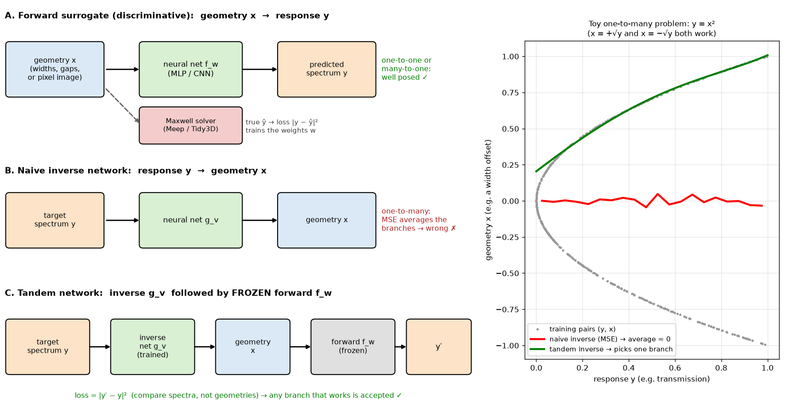

**How to read this figure.** Left: the three ways of wiring a network for photonics. (A) A forward surrogate maps geometry to response; it is trained against simulator outputs and the problem is well posed. (B) A naive inverse network maps response to geometry; it fails when several geometries share a response. (C) A tandem network puts a trained inverse network in front of a *frozen* forward network and compares *spectra*, not geometries. Right: a toy forward map $y = x^2$, where $x = +\sqrt{y}$ and $x = -\sqrt{y}$ both work. The grey points are the training pairs. The naive MSE inverse (red) converges to the average, $x \approx 0$, which is wrong for every $y > 0$. The tandem inverse (green, actually trained by gradient descent with the loss $(g(y)^2 - y)^2$) simply picks one branch.

### 12. The adjoint method in one paragraph (you already know this)

From your earlier weeks: for a figure of merit $\text{FOM}(\varepsilon)$ that depends on the permittivity $\varepsilon$ at every pixel, the **adjoint method** gets the gradient $\partial \text{FOM}/\partial \varepsilon_i$ for *every* pixel using just two simulations — a **forward** simulation (source at the input) and an **adjoint** simulation (source at the output, chosen from the FOM). The paper calls this gradient the **performance gradient** $\boldsymbol{g}$. **Auto-differentiation** through a differentiable simulator gives the same thing. Remember this: GLOnets (Section 4.3) plug exactly this gradient into a neural network's training.

### 13. Ring resonator transmission (for our worked example)

We will use an all-pass ring as the "simulator" in our toy surrogate. With self-coupling (through-coupling) coefficient $r$, round-trip amplitude transmission $a$, and round-trip phase $\varphi = 2\pi n_{\text{eff}} L/\lambda$ (ring length $L$):

$$T(\lambda) = \frac{a^2 - 2ra\cos\varphi + r^2}{1 - 2ar\cos\varphi + (ra)^2}$$

Dips (resonances) occur when $\varphi = 2\pi m$, i.e. $\lambda_m = n_{\text{eff}} L / m$. With $n_{\text{eff}} = 2.4$ and $L = 200\ \mu$m, $n_{\text{eff}} L = 480\ \mu$m, so $m = 310$ gives $\lambda = 1548.4$ nm and $m = 309$ gives $1553.4$ nm. The spacing is the **free spectral range** $\text{FSR} \approx \lambda^2/(n_g L) = 1550^2/(2.4 \times 200{,}000) \approx 5.0$ nm (here we ignore dispersion, so $n_g = n_{\text{eff}}$). The depth at resonance is $T_{\min} = (a - r)^2/(1 - ar)^2$; for $r = 0.80$, $a = 0.85$ that is $0.05^2/0.32^2 = 0.024$.

### 14. Dimensionality and the curse of dimensionality

The **dimensionality** of a design is the number of numbers needed to describe it. A directional coupler with width, gap and length: 3. A $50 \times 50$ pixel freeform region: 2500.

If you want 10 sample values along each dimension, a grid needs $10^d$ points: 1000 for $d=3$, $10^{10}$ for $d=10$, and an unthinkable $10^{2500}$ for the freeform region. Random sampling does not escape this: the volume to cover grows exponentially with $d$. This is the **curse of dimensionality**, and it is why "just simulate enough examples" stops working for freeform devices. The escape is **dimensionality reduction**: find a small number of features that capture the devices you care about (Section 3.3).

---

## Abstract — what the paper claims

The authors argue that photonics is a natural home for machine learning for two reasons. First, computational electromagnetics is mostly about capturing *non-linear relationships in high-dimensional spaces* (geometry → field → spectrum), which is exactly what neural networks are good at. Second, Maxwell solvers are widely available, so anyone can generate training data and evaluate networks.

The review covers three things:

1. **Discriminative networks** trained on simulated data act as **high-speed surrogate solvers**.
2. **Generative networks** learn the geometric features of good device *distributions*, and can even be turned into **global optimisers** (GLOnets).
3. The underlying data-science ideas, explained for photonics people: training, network classes and architectures, and dimensionality reduction.

## 1 Introduction

**What it says.** Photonic devices — integrated circuits, light sources, quantum processors, metamaterials and metasurfaces — owe their versatility to the strong link between **geometry** and **optical response**. Change the shape and you change what the light does.

There are two problems:

- The **forward problem** (structure → response) is "easy": established solvers handle it accurately. The difficulty is cost — big simulation domains, or big batches of simulations.
- The **inverse problem** (desired response → structure) cannot be computed directly. Its solution space is **non-convex**: it has many **local optima** (designs that are better than all their close neighbours but not the best overall). Classical approaches include simulated annealing, evolutionary (genetic) algorithms, objective-first methods, and adjoint-based optimisation. They work, but finding the *best overall* device is still hard.

**Deep neural networks** stack many non-linear layers and can model highly non-linear relationships, so they offer a fresh angle on both problems: as fast surrogate Maxwell solvers, and as device optimisers.

The authors give four reasons deep learning should matter beyond hype:

1. **It is proven.** Deep learning already captures, interpolates and optimises complex phenomena in robotics, drug discovery, image recognition and translation.
2. **It is accessible.** Free, open-source software (TensorFlow, PyTorch), a culture of sharing code, and plenty of courses.
3. **Photonic structures are easy to evaluate.** Many simulators exist, and they can also compute **gradients** (e.g. the effect of a small permittivity change on a figure of merit). Combining such gradients with deep learning gives new design methods, like global topology optimisation. Simulators can be scripted from Python and linked to ML code via **APIs** (application programming interfaces).
4. **Compute is available.** Cloud and distributed computing let you run many simulations in parallel; **GPUs** (graphics processing units) and **TPUs** (tensor processing units) speed up both simulation and training.

The outline follows: principles of networks (Section 2), discriminative networks as surrogates and for inverse design (Section 3), generative networks and global optimisation (Section 4), and future directions (Section 5).

## 2 Principles of deep neural networks

**What it says.** A deep network is many layers of neurons in series. Each neuron computes a non-linear function of a weighted sum of its inputs (Box 1). Low layers capture simple features; higher layers combine them into abstract ones, so complicated input–output relations can be fitted. Training: first **generate a training set with electromagnetic simulations**, then repeatedly adjust weights (via **backpropagation**) to reduce a **loss function** that measures the mismatch between network output and ground truth (Box 2).

**Two kinds of label.** The paper describes every device with two kinds of numbers:

- **Physical variables** $\boldsymbol{x}$: geometry (thickness $t$, diameter $d$, width $w$), materials (permittivity $\varepsilon$, permeability $\mu$), and the excitation (frequency $\omega$, polarisation $p$, angle).
- **Physical responses** $\boldsymbol{y}$: transmission spectra, field maps, band structures, radiation patterns, efficiency, Q factor.

The key asymmetry:

- $\boldsymbol{x} \to \boldsymbol{y}$ is **single-valued**. A thin-film stack with fixed layers has exactly one transmission spectrum.
- $\boldsymbol{y} \to \boldsymbol{x}$ is generally **multi-valued**. Many different stacks can give the same spectrum.

Because of this, two different classes of network are used: **discriminative** and **generative**.

## 2.1 Discriminative and generative deep neural networks

### Discriminative networks

A **discriminative network** is an ordinary deterministic network: the same input always gives the same output. It does regression or classification and learns a single-valued map $\boldsymbol{y} = f(\boldsymbol{x})$, which can be one-to-one or many-to-one. So it is the natural tool for the **forward problem**: a **surrogate model** of the simulator. Once trained, it evaluates the forward problem "orders of magnitude" faster than a numerical solver.

A technical note in the paper: networks take **discretised** data — a fixed-length vector or a pixel grid — while real devices and signals are continuous. This is not a real restriction, because Maxwell's equations can be accurately discretised anyway (that is what every FDTD grid already does).

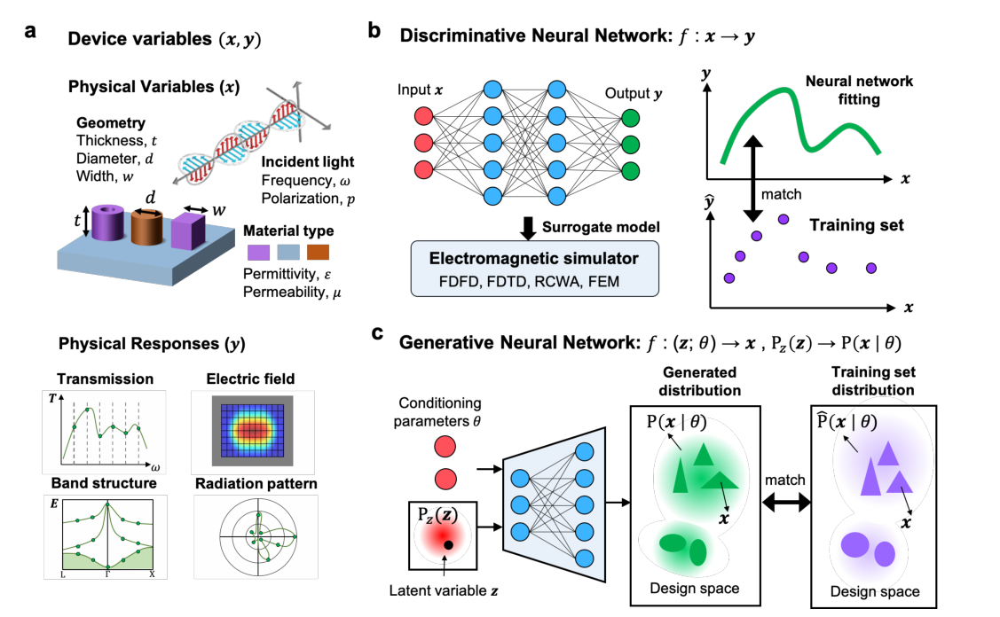

**How to read this figure.** Panel a lists the two label types: physical variables $\boldsymbol{x}$ (geometry, material, incident light) and physical responses $\boldsymbol{y}$ (transmission spectrum, field map, band structure, radiation pattern). Panel b is a discriminative network $f: \boldsymbol{x} \to \boldsymbol{y}$. The purple dots on the right are the training set (simulated examples), and the green curve is the smooth function the network fits through them. It replaces the electromagnetic simulator (FDFD, FDTD, RCWA, FEM). Panel c is a generative network: it takes conditioning labels $\boldsymbol{\theta}$ and a random latent variable $\boldsymbol{z}$, and its output is a *distribution* of devices $P(\boldsymbol{x}\mid\boldsymbol{\theta})$, trained to match the training distribution $\hat P(\boldsymbol{x}\mid\boldsymbol{\theta})$ (the triangles and ellipses are two families of shapes).

### Generative networks

A **generative network** looks like a discriminative network, but one of its inputs is a **latent variable** $\boldsymbol{z}$: a random vector drawn from a simple distribution, such as a standard Gaussian or a uniform distribution. "Latent" means hidden — $\boldsymbol{z}$ has no physical meaning by itself.

- One random $\boldsymbol{z}$ → one output device.
- Many random $\boldsymbol{z}$ → many devices, i.e. a **distribution** of devices.

So the network is a machine that **turns a simple distribution into a complicated one**. If $\boldsymbol{z} \sim P_z$, the outputs $\boldsymbol{x} = G(\boldsymbol{z})$ follow some distribution $P(\boldsymbol{x})$, and training shapes $G$ so that $P(\boldsymbol{x})$ looks like the training devices.

**A tiny example of "shaping a distribution".** If $z$ is uniform on $[0,1]$ and $G(z) = 300 + 200 z$ nm, the outputs are widths spread evenly between 300 and 500 nm. If instead $G(z) = 450 + 10\,\Phi^{-1}(z)$ (with $\Phi^{-1}$ the inverse Gaussian cumulative distribution), the outputs bunch around 450 nm with a 10 nm spread. A neural network can learn far more complicated versions of $G$, for example one that outputs whole freeform images that "look like good splitters".

In photonics the network is usually **conditional**: its inputs are $\boldsymbol{z}$ *and* labels $\boldsymbol{\theta}$ (a subset of the device labels, e.g. the target wavelength, or the target spectrum). Its output distribution is then $P(\boldsymbol{x}\mid\boldsymbol{\theta})$, and training makes it match the training-set distribution $\hat{P}(\boldsymbol{x}\mid\boldsymbol{\theta})$. An **unconditional** network has only $\boldsymbol{z}$ as input and learns an unlabelled distribution. There are also generative schemes that need **no training set** at all (GLOnets, Section 4.3).

**The key difference.** Discriminative networks learn the *relationship* between layout and response. Generative networks learn the *properties of the layout distribution itself* — what good devices look like. And because a generative network outputs a distribution for each $\boldsymbol{\theta}$, it performs a **one-to-many** mapping, which is exactly what the inverse problem needs. (Some generative models, such as autoregressive models, do not use latent variables, but they are rarely used in photonics.)

### Box 1 — Building blocks of artificial neural networks

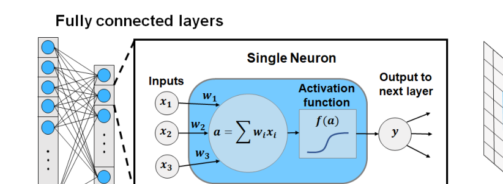

**How to read this figure.** Left: two fully connected layers; every neuron in layer $i$ feeds every neuron in layer $i+1$. The inset shows one neuron: inputs $x_1, x_2, x_3$ times weights $w_1, w_2, w_3$, summed to $a = \sum w_i x_i$, passed through the activation $f(a)$ to give $y$. Right: a convolutional layer, where a small kernel slides over the input matrix and each position produces one entry of the output feature map.

The box says, in summary (all of this is built in the Background above):

- A neuron computes $a = \boldsymbol{w}^T\boldsymbol{x} + b$ and outputs $y = f(a)$, with $f$ continuous, differentiable and non-linear (sigmoid, ReLU, tanh). Differentiable matters: backpropagation needs derivatives.
- **FC layers**: every input feeds every neuron; layer sizes can differ. Stacking FC layers with non-linear activations adds expressive power that a single layer cannot provide.
- **Convolutional layers** capture **local spatial features**. A kernel with trainable weights moves over the image with a fixed step (the **stride**). At each position, one output value = dot product with the patch + non-linear activation — the same operation as a single neuron. The output is a **feature map** that lights up where the kernel's pattern appears. Usually many kernels are used, each producing its own map, and the maps are stacked into an output **tensor** (a multi-dimensional array).

### Box 2 — Training of artificial neural networks

**Start.** Weights begin random. Training pushes the network's input–output behaviour towards the training set by minimising a loss function.

**Discriminative regression loss (Eq. 1).** For training pairs $(\boldsymbol{x}, \hat{\boldsymbol{y}})$ and network outputs $\boldsymbol{y}$:

$$L(\mathbf{y}, \hat{\mathbf{y}}) = \frac{1}{N} \sum_{n=1}^{N} \left(y^{(n)} - \hat{y}^{(n)}\right)^2 \tag{1}$$

$N$ is the **batch size** — how many examples are used per weight update:

- $N$ = whole training set → batch gradient descent;
- $N = 1$ → stochastic gradient descent;
- in between → **mini-batch gradient descent**, the practical standard: a good estimate of the full gradient at a fraction of the cost.

**Generative losses (Eqs. 2 and 3).** For a generative network, think in distributions. Let the design space be $S$. The training devices $\{x_i\}$ are samples from a target distribution $\hat{P}(x)$ — "the probability that randomly picking a device from $S$ gives $x$". The generator's outputs, as $\boldsymbol{z}$ varies, follow $P(x)$. Training should make $P$ match $\hat{P}$, so the loss must measure their dissimilarity. The **KL divergence**:

$$D_{KL}(\hat{P}\Vert P) = \int_S \hat{P}(x) \log \frac{\hat{P}(x)}{P(x)}\, dx \tag{2}$$

*In words:* average, over training-like devices, of the log of "how much more likely the training data finds this device than the generator does". If the generator rarely produces a device that is common in the training set, $\hat P/P$ is large there and the loss is large. *Why this form:* it is the extra information (in nats) you waste by describing data from $\hat P$ with a code designed for $P$; it is $\geq 0$ with equality only when $P = \hat{P}$ (by Jensen's inequality, since $-\log$ is convex: $D_{KL} = \mathbb{E}_{\hat P}[-\log(P/\hat P)] \ge -\log \mathbb{E}_{\hat P}[P/\hat P] = -\log \int P = -\log 1 = 0$).

The **JS divergence**, symmetric, compares each distribution to their mixture:

$$D_{JS}(\hat{P}, P) = \frac{1}{2} D_{KL}\!\left(\hat{P}\,\Big\Vert\,\frac{\hat{P}+P}{2}\right) + \frac{1}{2} D_{KL}\!\left(P\,\Big\Vert\,\frac{\hat{P}+P}{2}\right) \tag{3}$$

Both are minimised (to zero) exactly when $P = \hat P$, so either can serve as the training objective. (See the worked numbers in Background §10.) In practice you never have $\hat P$ as a formula — only samples — which is why VAEs and GANs (Section 4.2) need clever ways to *estimate* these quantities.

**Backpropagation.** For both network types, weights are updated using $\nabla_{\boldsymbol{w}}L$. For a single neuron $y = f(a)$, $a = \boldsymbol{w}^T\boldsymbol{x} + b$:

$$\frac{\partial L}{\partial a} = \frac{\partial L}{\partial y}\cdot\frac{\partial y}{\partial a}, \qquad \frac{\partial L}{\partial \boldsymbol{w}} = \frac{\partial L}{\partial a}\cdot\frac{\partial a}{\partial \boldsymbol{w}} = \frac{\partial L}{\partial a}\,\boldsymbol{x}$$

The first factor says how the pre-activation $a$ should move to lower the loss; the second converts that into how each weight should move. All functions must be differentiable. In a deep network the same pattern repeats layer by layer. Then every weight is updated by gradient descent:

$$\boldsymbol{w} \leftarrow \boldsymbol{w} - \alpha \nabla_{\boldsymbol{w}} L$$

with learning rate $\alpha$. In mini-batch training, per-example gradients are summed (or averaged) over the batch before the update. (Worked numbers: Background §6.)

**Deriving backprop for one hidden layer (what the code below does).** Take $\boldsymbol{h} = \tanh(W_1 x + \boldsymbol{b}_1)$, $y = W_2 \boldsymbol{h} + b_2$, $L = (y - \hat y)^2$. Then:

- $\partial L/\partial y = 2(y - \hat y) \equiv \delta$
- $\partial L/\partial W_2 = \delta\,\boldsymbol{h}^T$, $\partial L/\partial b_2 = \delta$
- $\partial L/\partial \boldsymbol{h} = W_2^T \delta$
- $\partial L/\partial \boldsymbol{a}_1 = (W_2^T\delta) \odot (1 - \boldsymbol{h}^2)$ (using $\tanh' = 1 - \tanh^2$; $\odot$ is element-wise product)
- $\partial L/\partial W_1 = \left[(W_2^T\delta)\odot(1-\boldsymbol{h}^2)\right] x$, $\partial L/\partial \boldsymbol{b}_1 = (W_2^T\delta)\odot(1-\boldsymbol{h}^2)$

Each line reuses the one above. That reuse is what makes backpropagation cheap.

## 2.2 Data structures describing electromagnetics phenomena

**What it says.** The *shape* of your data decides the network architecture. Four data structures appear in electromagnetics: vectors, images, graphs and time sequences.

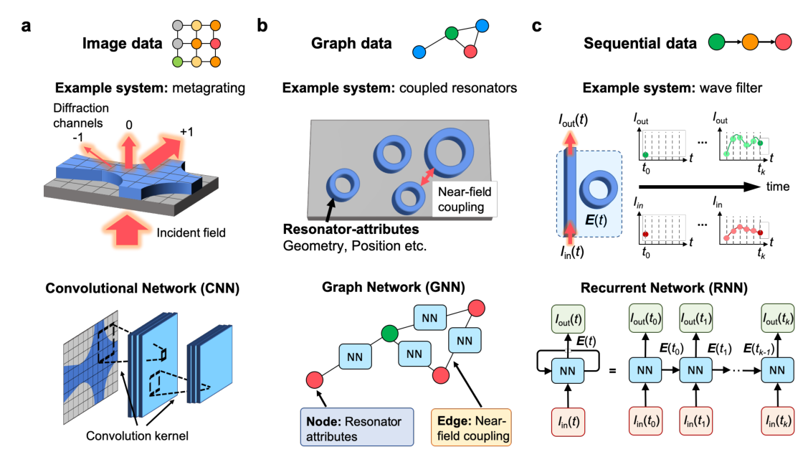

**How to read this figure.** (a) A freeform metagrating stored as a pixel image, processed by a CNN whose kernels slide over it; the output might be the efficiency into each diffraction channel. (b) Coupled ring resonators stored as a graph: each node holds one resonator's attributes, each edge the near-field coupling between neighbours; a graph neural network processes it. (c) A ring-loaded waveguide as a time sequence: input intensity $I_{\text{in}}(t)$, internal field $\mathbf{E}(t)$, output $I_{\text{out}}(t)$, processed by a recurrent neural network unrolled in time.

**Discrete (vector) data.** Simple devices are described by a short vector of parameters: height, width, period, permittivity, wavelength, angle. Responses can also be vectors: efficiency, Q factor, bandgap, a spectrum sampled at fixed points. Vectors go naturally into **fully connected networks**; for vector-to-vector problems a deep FC network usually suffices. *Your project:* "design knobs (gap, width, etch bias, thickness) → T at 1550 nm, bandwidth, excess loss" is exactly this case.

**Image data.** Freeform devices need pixel or voxel images with thousands of elements. These are processed by **CNNs**. To output an image (e.g. internal fields or polarisation), use an all-convolutional network. To output a vector (spectrum, efficiency), finish the convolutional layers with FC layers.

**Graph data.** Some systems are collections of interacting objects — e.g. an on-chip chain of ring resonators coupled through their near fields. A **graph** stores each object as a **node** (with its attributes: radius, width…) and each interaction as an **edge** (e.g. gap → coupling strength). Graphs can be **irregular**: different nodes have different numbers of neighbours, and only significantly coupled pairs get an edge.

A **graph neural network (GNN)** updates each node using information **aggregated from its neighbours**. One common form of a layer ("message passing") is

$$\boldsymbol{h}_i^{\text{new}} = \phi\Big(\boldsymbol{h}_i,\ \sum_{j \in \text{neighbours}(i)} \psi(\boldsymbol{h}_i, \boldsymbol{h}_j, \boldsymbol{e}_{ij})\Big)$$

where $\boldsymbol{h}_i$ is node $i$'s feature vector, $\boldsymbol{e}_{ij}$ the edge features, and $\psi$ (edge processor) and $\phi$ (node processor) are small neural networks shared across the whole graph. Because the same $\psi$ and $\phi$ apply everywhere, a GNN can learn "how two neighbouring rings interact" and reuse it for new arrangements. Stacking $k$ layers lets information travel $k$ hops — so next-nearest-neighbour effects appear after two layers. GNNs were then little used in photonics but successful elsewhere (glassy phase transitions, molecular fingerprints, drug discovery); variants include graph attention, graph recurrent and graph generative networks.

**Time-sequence data.** Dynamic systems are described by signals in time, which can be discretised without loss if the time step is small enough. In a ring-modulated waveguide, the output at time $t_k$ depends on the input at $t_k$ *and* on the device's internal field from the previous step. A **recurrent neural network (RNN)** has exactly this structure: it carries a **hidden state** forward in time,

$$\mathbf{E}(t_k) = \Phi\big(\mathbf{E}(t_{k-1}),\, I_{\text{in}}(t_k)\big), \qquad I_{\text{out}}(t_k) = \Psi\big(\mathbf{E}(t_k)\big)$$

with the *same* network $\Phi, \Psi$ at every step — matching the **time-translation invariance** of Maxwell's equations (the physics does not change from one time step to the next). The paper notes an exact correspondence between RNN recurrences and time-domain wave propagation: an FDTD update, $\mathbf{E}^{n+1} = \mathbf{E}^{n} + (\Delta t/\varepsilon)\,\nabla\times\mathbf{H}^{n+1/2}$, *is* a recurrent linear update of a hidden state. RNNs are general and can be combined with any of the architectures above. (The text refers to "FIG. 1e" here; it means Fig. 2c.)

## 3 Surrogate modeling and inverse design with discriminative models

### 3.1 Overview of electromagnetic devices modeled by discriminative networks

**History, in three waves.**

1. **Microwaves, from the early 1990s.** Microwave circuits are a good analogue of nanophotonics: both are governed by Maxwell's equations with sub-wavelength components. One of the first uses was a **Hopfield network** (a type of recurrent network) for **impedance matching**: it iteratively suggested how to change the position and length of a matching stub. Its weights came from known simulated relationships, not from training. Soon after, deep FC networks (at least two layers) modelled MESFETs, heterojunction bipolar transistor amplifiers, coplanar waveguide components, and 3-D lumped capacitors and inductors. For complex devices, **space mapping** paired a network for coarse features with one for fine features. In the last decade: frequency-selective surfaces, metamaterials, metasurfaces, filters.
2. **Guided-wave photonics, from the early 2010s.** First networks (2–3 layers) learned photonic-crystal bandgaps, photonic-crystal-fibre dispersion, and plasmonic transmission lines. Later: more geometric freedom — 3-D photonic crystals, photonic-crystal cavities, plasmonic filters, **in-plane mode couplers and splitters**, **Bragg gratings**, and **grating couplers**. These are your device families.
3. **Free-space nanophotonics, from 2017.** First: scattering spectra of concentric nanoshells. Then chiral nanostructures, planar scatterers, absorbers, structural colour, phase-change smart windows, Fano-resonant nanoslits, dielectric metagratings and metasurfaces, graphene metamaterials, thin-film colour filters, and topological insulators.

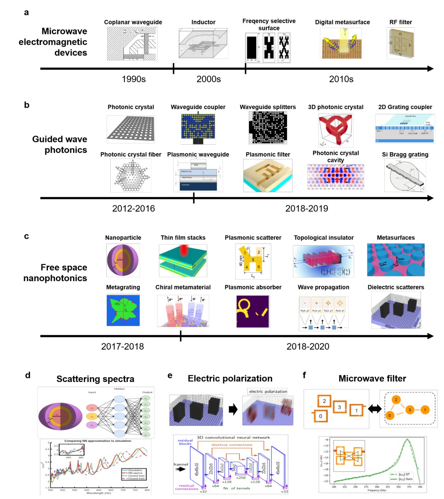

**How to read this figure.** Panels a–c are timelines: microwave devices from the 1990s (coplanar waveguide → RF filter), guided-wave photonics from 2012 (photonic crystals → Si Bragg gratings, grating couplers), free-space nanophotonics from 2017 (nanoparticles → metasurfaces). Panels d–f are the three worked examples discussed next: (d) an FC network predicting nanoshell scattering spectra — compare the predicted curve with the simulated one in the plot; (e) a 3-D CNN (encoder–decoder with shortcut connections) predicting the internal polarisation of a dielectric structure; (f) a GNN that represents a split-ring filter as a graph and predicts its $s_{21}$, with the network output (solid) on top of the ground truth (dashed).

**Example 1 — scattering spectra (Fig. 3d).** Nanoparticles made of **eight concentric shells**, alternating silica and titania. Input: the 8 shell thicknesses. Output: the scattering cross-section at 200 wavelengths from 400 to 800 nm. Network: **4 FC layers × 250 neurons**. Training data: **50,000** random particles simulated with the **transfer-matrix method** (fast and exact for layered spheres). The trained network reproduced spectra of random new particles accurately — good **interpolation**.

*Back-of-envelope parameter count:* $8\cdot250+250 = 2250$; three hidden-to-hidden layers $3\times(250^2+250) = 188{,}250$; output $250\cdot200+200 = 50{,}200$; total $\approx 2.4\times 10^5$ weights, trained on $50{,}000 \times 200 = 10^7$ numbers. Plenty of data per weight, and only 8 inputs — an easy regime.

**Example 2 — electric polarisation (Fig. 3e).** Input: a 3-D voxel grid of a nanostructure. Output: the vector polarisation in every voxel (fixed excitation). A **fully convolutional** network is the right choice because the field at a voxel depends mainly on the geometry *near* that voxel. Architecture: an **encoder–decoder** of convolution and deconvolution layers. Training: about **30,000** random structures with simulated fields. Accuracy was high, *but about 5 % of random inputs gave predictions that strongly deviated from the simulation*. Remember this number: one in twenty is badly wrong, and the network does not tell you which ones.

**Example 3 — microwave filter (Fig. 3f).** A circuit of 3 to 6 **split-ring resonators**. Graph: nodes = individual resonator geometries; edges = relative positions. Each GNN layer has an **edge processor** (learns near-field coupling between neighbours) and a **node processor** (learns each resonator's response given its geometry and its couplings). Output: the $s_{21}$ spectrum (the microwave "transmission"). Training: **80,000** random circuits simulated with a commercial full-wave solver. The trained GNN computed $s_{21}$ **four orders of magnitude (10,000×) faster** than the commercial solver.

**General trends the authors draw.**

1. Surrogates are reasonably accurate for devices with **limited complexity — about ten physical parameters**. (The CNN field-map case is an exception, because geometry and local field are so tightly linked.) A surrogate is an approximation, so **there is always a fraction of cases where it is poor**.
2. **Training is expensive, and almost all the cost is the training data**: tens of thousands of full-wave simulations or more.
3. A trained network is **orders of magnitude faster** than a full-wave solver.

So: *build a surrogate only if you will use it enough times that the speed-up pays back the one-time data cost.*

### Worked example: a tiny surrogate for a ring resonator

Let us see these three trends in a toy you can run in two seconds. The "simulator" is the ring formula from Background §13 ($r=0.80$, $a=0.85$, $n_{\text{eff}}=2.4$, $L=200\ \mu$m). We sample wavelengths between 1545 and 1555 nm, train an MLP on 120 of them, and keep 30 aside as a held-out test set.

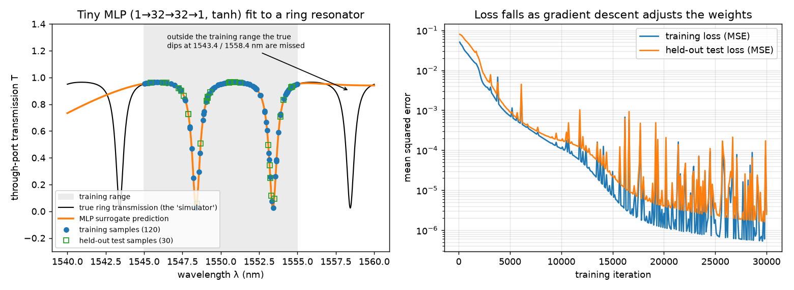

**How to read this figure.** Left: the black curve is the true transmission; the grey band is the training range; blue dots are training samples; green squares are held-out test samples; orange is the network's prediction. Inside the grey band the orange curve sits on the black one, including both resonance dips — the network has learned the function there, and the held-out squares confirm it is not just memorising. Outside the band the network draws a smooth, confident line and completely misses the real dips at 1543.4 and 1558.4 nm: **no extrapolation**. Right: training loss and held-out loss falling over 30,000 Adam steps (the spikes are normal noise from Adam's adaptive steps); held-out loss tracks training loss, so there is no overfitting here.

The runnable version (≤ 40 lines, numpy only):

```python
import numpy as np
rng = np.random.default_rng(0)

def ring_T(lam, r=0.80, a=0.85, neff=2.4, L=200e3):      # lam, L in nm
    phi = 2*np.pi*neff*L/lam                               # round-trip phase
    return (a*a - 2*r*a*np.cos(phi) + r*r) / (1 - 2*r*a*np.cos(phi) + (r*a)**2)

lam = rng.uniform(1545, 1555, 150); y = ring_T(lam)[:, None]   # "simulations"
x = ((lam - 1550) / 5)[:, None]                                 # scale input to [-1, 1]
tr, te = np.arange(120), np.arange(120, 150)                    # train / held-out split

H = 64                                                          # hidden neurons
P = [rng.normal(0, 2, (1, H)), np.zeros(H), rng.normal(0, 0.1, (H, 1)), np.zeros(1)]
M = [0*p for p in P]; V = [0*p for p in P]

def net(x, P):
    h = np.tanh(x @ P[0] + P[1])              # hidden layer: weighted sum + tanh
    return h @ P[2] + P[3], h                 # linear output neuron

for t in range(1, 20001):
    yp, h = net(x[tr], P)
    dy = 2 * (yp - y[tr]) / len(tr)           # dL/dy for the MSE loss (Eq. 1)
    dh = (dy @ P[2].T) * (1 - h**2)           # chain rule back through tanh
    G = [x[tr].T @ dh, dh.sum(0), h.T @ dy, dy.sum(0)]
    for i in range(4):                        # Adam update (gradient descent + momentum)
        M[i] = 0.9*M[i] + 0.1*G[i]; V[i] = 0.999*V[i] + 0.001*G[i]**2
        P[i] -= 3e-3 * (M[i]/(1-0.9**t)) / (np.sqrt(V[i]/(1-0.999**t)) + 1e-8)

mse = lambda idx: np.mean((net(x[idx], P)[0] - y[idx])**2)
print(f"train MSE {mse(tr):.2e}   held-out MSE {mse(te):.2e}")
print("predict 1558.4 nm (outside training range):",
      net(np.array([[(1558.4-1550)/5]]), P)[0].item(), " truth:", ring_T(1558.4))
```

**What you should see:** train MSE about $3\times10^{-4}$ and held-out MSE about $6\times10^{-4}$ (RMS error ≈ 0.02 in transmission — good). Then the extrapolation test: the network predicts about **1.65** at 1558.4 nm (an impossible transmission above 1) while the truth is **0.04**. Notes on the code: inputs are **scaled** to roughly $[-1,1]$ (always do this; raw nanometres would saturate the tanh units); the `dy`, `dh`, `G` lines are exactly the backprop derivation from Box 2; and the hidden layer has 64 neurons because sharp resonances need many "bends" to draw.

**Cost lesson.** Here the "simulator" is a formula that costs microseconds, so the surrogate buys nothing. Now suppose each training point were a 3-D FDTD run of 5 minutes: 150 points = 12.5 CPU-hours. If one evaluation of the trained network takes ~1 ms, the surrogate pays for itself only when you need more than about 150 more evaluations *inside the same range*. That is the break-even logic for any surrogate:

$$N_{\text{uses}} \gtrsim \frac{N_{\text{train}}\, t_{\text{sim}}}{t_{\text{sim}} - t_{\text{NN}}} \approx N_{\text{train}}$$

when $t_{\text{NN}} \ll t_{\text{sim}}$. In words: *a surrogate is worth it only if you will query it more times than the number of simulations it took to build — and only inside the region those simulations covered.*

## 3.2 Inverse design with deep discriminative networks

**What it says.** Once you have a trained discriminative network, there are **three ways** to use it for inverse design.

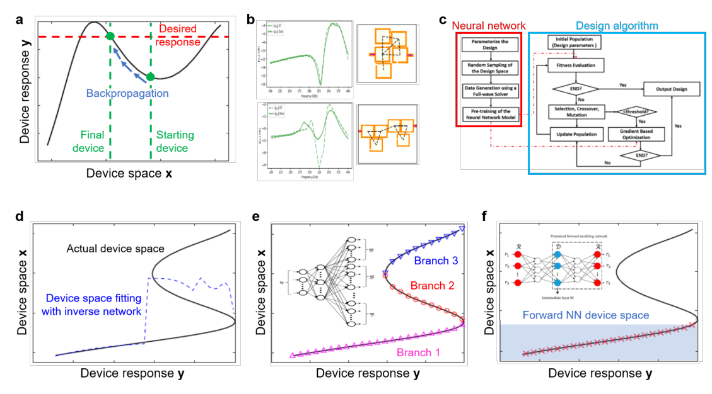

**How to read this figure.** (a) A 1-D cartoon of backpropagation-based design: the black curve is the device response predicted by the trained network as a function of the device parameter; starting from a device (right green dot), gradient steps move it until its response hits the desired value (red dashed line). (b) Microwave filters designed this way with a GNN: the top design's spectrum (solid) matches the target (dashed); the bottom one does not. (c) A hybrid flowchart: the red box builds the surrogate (parameterise, sample randomly, simulate, pre-train), the blue box is a genetic algorithm that uses the surrogate for fitness evaluation and a gradient step for local refinement. (d) The inverse problem plotted with response on the horizontal axis and device on the vertical: the true "device space" (black) is an S-shaped curve with three branches for some responses; a naive inverse network (blue dashed) jumps around and fits none of them. (e) A multi-branch network fits each branch separately (pink, red, blue markers). (f) A tandem network: the forward network's simpler, single-valued "device space" (shaded) means the inverse network learns one consistent branch (red crosses).

### Class 1 — Backpropagation through the frozen network ("gradient descent on the input")

1. Start from a random or educated-guess device $\boldsymbol{x}_0$.
2. Run it through the trained network $f_{\boldsymbol{w}}$ and compare with the target response $\boldsymbol{y}^*$ using a loss such as $\mathcal{L}(\boldsymbol{x}) = \Vert f_{\boldsymbol{w}}(\boldsymbol{x}) - \boldsymbol{y}^*\Vert^2$.
3. **Freeze the weights** $\boldsymbol{w}$ and backpropagate the loss all the way to the *input*:

$$\boldsymbol{x} \leftarrow \boldsymbol{x} - \eta\, \nabla_{\boldsymbol{x}} \mathcal{L}, \qquad \nabla_{\boldsymbol{x}}\mathcal{L} = 2\, J_f(\boldsymbol{x})^T\big(f_{\boldsymbol{w}}(\boldsymbol{x}) - \boldsymbol{y}^*\big)$$

where $J_f = \partial f/\partial \boldsymbol{x}$ is the network's **Jacobian** (matrix of derivatives of each output with respect to each input), computed for free by backprop. *Why this form:* it is just the chain rule — the loss depends on $\boldsymbol{x}$ only through $f$. Compare training: there, $\boldsymbol{x}$ is fixed and $\boldsymbol{w}$ moves; here, $\boldsymbol{w}$ is fixed and $\boldsymbol{x}$ moves.

This is exactly your adjoint optimisation, except the gradient comes from the network instead of a forward + adjoint simulation pair. Because many layouts can give the same response, **different starting points end up at different final designs**.

History: microwave circuits in the 1990s; more recently nanoparticle scatterers, microwave filters, photonic crystals. It works sometimes (Fig. 4b top) and fails sometimes (Fig. 4b bottom), for two reasons:

- **The network is inaccurate** in the region the optimiser visits. Fix: more training data. *Important subtlety the paper does not dwell on:* an optimiser is *actively searching* for inputs where the network predicts a great response, so it is attracted to exactly the places where the network is wrong in your favour. Always re-simulate the final design.
- **Local optima**: the design gets stuck. Fix: many random starts, or better optimisers such as **Adam** (momentum helps roll past small bumps).

### Class 2 — Hybrid optimisation: classical optimiser, network as the solver

Keep any classical optimisation algorithm and simply replace each expensive simulation with a network call. Algorithms used: Newton's methods, interior-point, evolutionary/genetic algorithms, iterative multivariable methods, trust-region methods, a fast forward dictionary search, particle swarm. Reported effect: **total optimisation time reduced from hours or days to minutes** ("orders of magnitude").

The freedom to choose the optimiser is the advantage: a **global** optimiser (genetic algorithm) if the landscape is rugged; a **local** optimiser (Newton) if you have a good starting design and a smooth landscape; or both. Fig. 4c shows a combined scheme for microwave patch antennas and filters: a genetic algorithm searches coarsely, then gradient-based refinement polishes. The network serves both as the fast solver and as the source of gradients.

### Class 3 — Inverse networks: response in, geometry out

The most direct idea: train a network with the *desired response* as input and the *device* as output. It is hard because of **non-uniqueness** (Background §11). In Fig. 4d some responses have three valid devices on three branches. During training, examples from each branch pull the network towards that branch; the result is a network that **converges to no branch** — roughly an average that is not a valid device.

Three fixes:

1. **Restrict the design space** by a parameterisation where the map is (mostly) unique. Used for plasmonic metasurfaces of coupled metal disks.
2. **Multi-branch networks** (Fig. 4e): the network has several output heads, each producing a candidate design, and a special loss ensures each head maps onto a distinct branch. (One simple way to build such a loss, for intuition: for each training pair, only penalise the head whose prediction is closest to the true device, so the heads specialise.)
3. **Tandem networks** (Fig. 4f):
    - First train a forward network $f_{\boldsymbol{w}}: \boldsymbol{x}\to\boldsymbol{y}$ as a surrogate, then **freeze** its weights.
    - Put an inverse network $g_{\boldsymbol{v}}: \boldsymbol{y}\to\boldsymbol{x}$ in front of it and train only $\boldsymbol{v}$ with the loss below.

$$\mathcal{L}_{\text{tandem}}(\boldsymbol{v}) = \frac{1}{N}\sum_{n}\big\Vert f_{\boldsymbol{w}}\big(g_{\boldsymbol{v}}(\hat{\boldsymbol{y}}^{(n)})\big) - \hat{\boldsymbol{y}}^{(n)}\big\Vert^2$$

*In words:* "propose a device for this spectrum; check, using the frozen surrogate, that the device really gives this spectrum." The loss compares **spectra**, not geometries, so it does not care *which* of several valid devices the inverse network proposes — any one that works gives zero loss. The averaging problem disappears. The paper adds that the forward surrogate is a *smoothed, simplified* version of the true design space, which reduces the number of non-unique solutions the inverse network faces. Tandem networks have been used for core–shell particles, metasurface filters, topological photonic crystals, planar plasmonic scatterers and high-Q dielectric arrays. (The green curve in the generated figure above is exactly a tiny tandem model.)

*Caveat:* the tandem loss is only as good as the frozen surrogate. If the surrogate is wrong in some region, the inverse network will happily propose devices there.

## 3.3 Dimensionality reduction with discriminative networks

**The problem.** To train a good surrogate you must sample the design space and the response space well enough. With a handful of parameters, brute force is costly but possible (tens of thousands of simulations). With more parameters, the **curse of dimensionality** bites: the required training-set size grows **exponentially** with the number of degrees of freedom. A freeform device with hundreds to thousands of voxels would need "many billions" of training devices. Not practical.

**The escape.** Good devices usually live in (or near) a **low-dimensional subspace**. If you can map devices from the big space to a small one without losing the important information, the surrogate only has to learn the small space. Three techniques have been used in photonics.

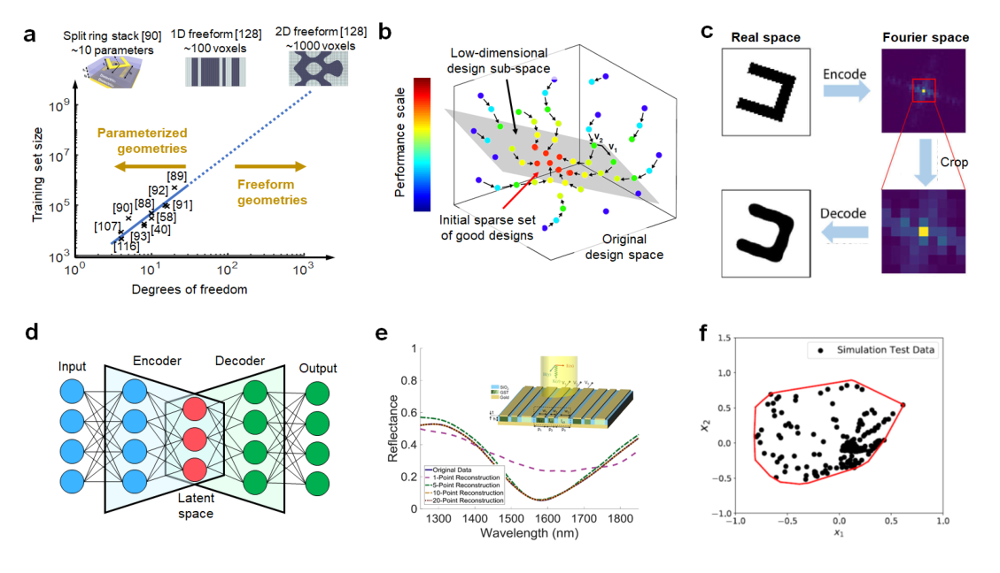

**How to read this figure.** (a) Log–log plot of training-set size vs number of geometric degrees of freedom from ten published studies: the points follow a straight line on log–log axes, extrapolated (dotted) to about $10^9$ examples for ~1000-voxel freeform devices; split-ring stacks (~10 parameters) sit at the bottom left. (b) PCA for grating couplers: locally optimised designs (coloured by performance, red = best) collapse onto a 2-D plane (grey) inside the original design space. (c) Fourier encoding: a binary shape is Fourier-transformed, only the low-frequency centre is kept, and the inverse transform + threshold gives back a smoothed version of the shape. (d) An autoencoder: encoder squeezes the input to a small latent layer (red), decoder rebuilds it. (e) Reflectance spectra reconstructed from 1, 5, 10 and 20 latent points: from about 5 points the reconstruction overlaps the original. (f) Test devices in a 2-D latent space enclosed by a convex hull (red outline) marking the "feasible" region.

**Principal components analysis (PCA).** A classical linear method. Collect your devices as vectors $\boldsymbol{x}^{(n)}\in\mathbb{R}^D$. Subtract the mean $\bar{\boldsymbol{x}}$, form the **covariance matrix**

$$C = \frac{1}{N}\sum_n (\boldsymbol{x}^{(n)} - \bar{\boldsymbol{x}})(\boldsymbol{x}^{(n)} - \bar{\boldsymbol{x}})^T$$

and find its **eigenvectors** $\boldsymbol{v}_1, \boldsymbol{v}_2, \dots$ ordered by eigenvalue $\lambda_1 \ge \lambda_2 \ge \dots$. Each eigenvalue is the **variance** (spread) of the data along that direction — what the paper calls the "component score", i.e. how much information is kept by projecting onto that direction. Keep the top $k$ and describe each device by $k$ numbers $c_j = \boldsymbol{v}_j^T(\boldsymbol{x} - \bar{\boldsymbol{x}})$. The fraction of variance kept is $\sum_{j\le k}\lambda_j / \sum_j \lambda_j$. *Tiny example:* if a set of 5-parameter grating designs has eigenvalues $(4.0, 1.5, 0.3, 0.15, 0.05)$, the first two components keep $5.5/6.0 = 92\%$ of the variance — a 2-D description is nearly lossless.

In the cited grating-coupler study (5 parameters), local optimisation from a sparse set of starts gave a collection of good designs; PCA on them found a **2-D subspace** containing the locally optimal designs; a brute-force search inside that plane then found even better devices. No neural network was used there, but a surrogate could be trained on the 2-D coordinates. (This is the Melati-style idea you read tomorrow morning.)

**Fourier transformations.** Remove high spatial frequencies from device images. Steps: (1) represent the shape by a **level-set function** (a smooth function whose zero contour is the shape boundary — this guarantees the reconstructed image is binary after thresholding); (2) Fourier transform; (3) crop to the low-frequency centre, $64\times64 \to 9\times9$; (4) by symmetry only **9 numbers** are unique, which form the reduced design space. To go back: inverse Fourier transform, then threshold. Using this encoding, a surrogate for freeform diffraction gratings was trained with **only 12,000 devices**. (Compression ratio: $4096 \to 9$, about 450×. Cropping high frequencies also enforces smooth boundaries — a built-in minimum-feature-size effect, which is relevant to fabrication.)

**Autoencoders.** An **autoencoder** is a pair of networks: an **encoder** that maps the input to a small **latent vector**, and a **decoder** that maps the latent vector back, trying to reconstruct the input. Trained with a **reconstruction loss**, usually MSE:

$$\mathcal{L}_{\text{rec}} = \frac{1}{N}\sum_n \big\Vert \text{Dec}(\text{Enc}(\boldsymbol{x}^{(n)})) - \boldsymbol{x}^{(n)}\big\Vert^2$$

The narrow middle forces the network to keep only the essential information. Compared with PCA, which can only use *linear* projections (flat planes), an autoencoder can learn *curved* low-dimensional surfaces. (An autoencoder with linear activations and MSE loss learns the same subspace as PCA.)

Three uses in the literature:

- **Phase-change reconfigurable metasurfaces** (Fig. 5e): design space reduced from **10 to 5** dimensions and response space (spectra) from **200 to 10**. In the reduced spaces the design↔response map was approximately **one-to-one**, so a plain inverse network could be trained with **only 4000 devices**. Encoder + inverse network + decoder together did accurate inverse design.
- **Digital metasurfaces** (grids of metal/air pixels): an autoencoder compressed spectra from **1000 to 128** numbers; then one **support vector machine (SVM)** per pixel — a classical binary classifier — learned to predict "metal or air" for that pixel from the 128 latent numbers. The encoder + SVM scheme produced layouts whose spectra closely matched the targets.
- **Mapping feasibility** (Fig. 5f): in the latent space of device geometries, fit a **convex hull** (the smallest convex shape containing all training devices) or train an SVM to label regions as feasible / unfeasible. Applied to digital plasmonic nanostructures and dielectric nanopillar arrays. *For you:* a convex hull in latent space is a simple, honest "am I extrapolating?" check for any surrogate.

## 4 Generative networks

### 4.1 Adapting generative networks to photonic systems

**What it says.** In computer science, generative networks are famous for things like photorealistic faces, trained on millions of internet images. There, the goal is **diversity** ("make many different realistic faces"), and training relies *only* on the statistics of the training set, because no equation scores how "face-like" an image is, and there is no gradient to make it more face-like.

Photonic inverse design is different in two ways:

1. The goal is **one or a few excellent devices** for a specific objective, not diversity.
2. A **simulator** can score any generated device exactly, and give **performance gradients** — how to perturb each voxel's permittivity to improve the figure of merit — via the **adjoint method** (one forward + one adjoint simulation) or **auto-differentiation** (mathematically equivalent to backprop, needs a differentiable solver). Iterating these gradients is ordinary local freeform optimisation.

So photonic generative models can use physics during training, which faces and cats never could.

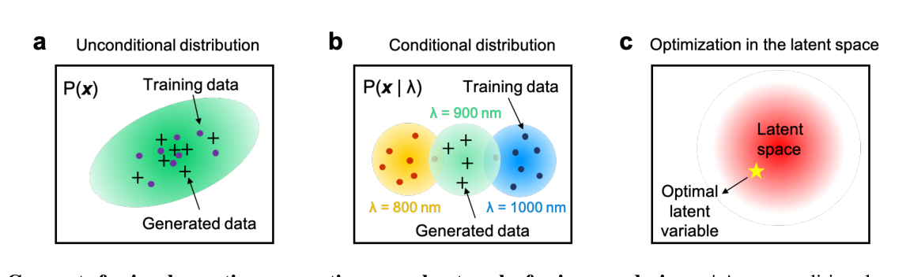

**How to read this figure.** (a) Unconditional: purple dots are training devices in design space; the green blob is the learned distribution $P(\boldsymbol{x})$; black crosses are newly generated devices that fill in the same favourable region. (b) Conditional: training data exist only at $\lambda = 800$, 900 and 1000 nm (coloured blobs); the network can generate devices for intermediate conditions. (c) Optimisation in latent space: the red disc is the latent distribution; a classical optimiser searches it for the latent vector (star) whose decoded device performs best.

With a training set, there are three strategies:

1. **Unconditional network on a targeted subset** (Fig. 6a). Train on devices that already do roughly what you want. The network "fills in" that region with new variants — some better than any training device.
2. **Conditional network on high-performance devices** (Fig. 6b). Train with labels like wavelength or deflection angle at a few discrete values; the network generalises to the **continuous range** in between — the generative analogue of regression.
3. **Latent-space optimisation** (Fig. 6c). Train a generator, then run a classical optimiser over its latent vector $\boldsymbol{z}$ to find the input that produces a device with the desired properties. Similar to Class 2 in Section 3.2, but with two advantages: the generated devices are **constrained to look like the training set** (realistic), and the latent space is **low-dimensional** (easy to search).

## 4.2 Generative model types

A short family tree:

- **Autoregressive models** (images from 2011): generate pixel by pixel, each pixel drawn from an **explicit** conditional probability given all previous pixels, $P(\boldsymbol{x}) = \prod_i P(x_i \mid x_1,\dots,x_{i-1})$. No latent variable. "Explicit" means the probability has a formula.
- **Variational autoencoders (VAEs)**, 2013: learn salient features and generate variants by sampling an **explicit** latent distribution (a Gaussian). Easier to train; may not capture every variation.
- **Generative adversarial networks (GANs)**, 2014: learn an **implicit** distribution — no assumed form. More expressive (photorealistic faces) but harder to train.

### Variational autoencoders

**Why a plain autoencoder is not a generator.** A trained autoencoder's decoder maps latent vectors to devices. You might hope to sample random latent vectors and decode them into new devices. It does not work: the encoder places training devices at scattered, irregular points in latent space, and random points in between decode to garbage with no relation to the training set.

**What the VAE changes** (Fig. 7a):

1. The encoder outputs a **distribution**, not a point: a mean vector $\boldsymbol{\mu}(\boldsymbol{x})$ and a (usually diagonal) covariance $\boldsymbol{\sigma}^2(\boldsymbol{x})$, defining a Gaussian $q(\boldsymbol{z}\mid\boldsymbol{x}) = \mathcal{N}(\boldsymbol{\mu}, \text{diag}\,\boldsymbol{\sigma}^2)$. A latent vector is **sampled** from it and decoded.
2. The loss has two terms:

$$\mathcal{L}_{\text{VAE}} = \underbrace{\Vert \text{Dec}(\boldsymbol{z}) - \boldsymbol{x}\Vert^2}_{\text{reconstruction}} + \underbrace{D_{KL}\big(\mathcal{N}(\boldsymbol{\mu},\boldsymbol{\sigma}^2)\,\Vert\,\mathcal{N}(\boldsymbol{0},I)\big)}_{\text{regularisation}}, \qquad \boldsymbol{z} = \boldsymbol{\mu} + \boldsymbol{\sigma}\odot\boldsymbol{\epsilon},\ \ \boldsymbol{\epsilon}\sim\mathcal{N}(\boldsymbol{0}, I)$$

The **reconstruction** term is the autoencoder loss. The **regularisation** term pulls every encoded distribution towards the standard Gaussian, so the encoded clouds overlap and fill the latent space smoothly, with no gaps. Then a random $\boldsymbol{z}\sim\mathcal{N}(\boldsymbol{0}, I)$ lands somewhere meaningful and decodes to a plausible device.

The way $\boldsymbol{z}$ is written, $\boldsymbol{\mu} + \boldsymbol{\sigma}\odot\boldsymbol{\epsilon}$, is the **reparameterisation trick**: the randomness is moved into $\boldsymbol{\epsilon}$, so $\boldsymbol{z}$ is a differentiable function of $\boldsymbol{\mu}$ and $\boldsymbol{\sigma}$ and backprop can pass through the sampling step. (The same word "reparameterisation" reappears in Section 4.3 with a related meaning: express what you optimise through a differentiable transformation.)

**Deriving the KL term for one latent dimension.** For $q = \mathcal{N}(\mu,\sigma^2)$ and $p=\mathcal{N}(0,1)$:

$$\log\frac{q(z)}{p(z)} = -\log\sigma - \frac{(z-\mu)^2}{2\sigma^2} + \frac{z^2}{2}$$

Take the average over $z\sim q$, using $\mathbb{E}[(z-\mu)^2] = \sigma^2$ and $\mathbb{E}[z^2] = \mu^2+\sigma^2$:

$$D_{KL}(q\Vert p) = -\log\sigma - \tfrac12 + \tfrac12(\mu^2+\sigma^2) = \tfrac12\left(\mu^2 + \sigma^2 - 1 - \ln\sigma^2\right)$$

It is zero only at $\mu = 0, \sigma = 1$. *Example:* $\mu = 1$, $\sigma = 0.5$: $\tfrac12(1 + 0.25 - 1 - \ln 0.25) = \tfrac12(0.25 + 1.386) = 0.82$ nats. For a multi-dimensional diagonal Gaussian, sum this over dimensions.

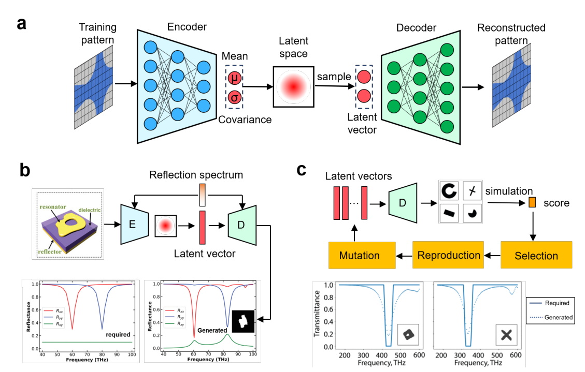

**How to read this figure.** (a) VAE: training pattern → encoder → mean $\mu$ and covariance $\sigma$ → Gaussian latent space → sampled latent vector → decoder → reconstructed pattern. (b) A conditional VAE for meta-atoms: the reflection spectrum is fed to both encoder and decoder; at design time you give the *required* spectrum (left plot: $R_{xx}$ and $R_{yy}$ dips at 60 and 80 THz) plus a random latent vector, and the decoder outputs a pattern whose simulated spectrum (right plot) has the dips in the right places. (c) Latent-space evolution: latent vectors are decoded into shapes, simulated, scored, and then selected, recombined and mutated; the bottom plots compare required (solid) and generated (dotted) transmittance notches.

Two VAE strategies for freeform meta-atoms:

1. **Conditional VAE** (Fig. 7b): both the patterns and their spectra are encoded; the decoder receives a latent variable *and* the desired spectrum. At design time, sample $\boldsymbol{z}$ from a standard Gaussian, give the target spectrum, decode → a distribution of candidate patterns for that spectrum (one-to-many, as required).
2. **VAE + evolutionary optimisation** (Fig. 7c): train a VAE on varied shapes (circles, crosses, polygons); run a genetic algorithm in its latent space; decode each latent vector, evaluate with simulation or a surrogate, evolve until a good device appears.

### Generative adversarial networks

A **GAN** is two networks trained against each other (Fig. 8a):

- a **generator** $G$ that turns a latent vector (and labels) into a device image;
- a **discriminator** $D$, a classifier that outputs the probability that an image is *real* (from the training set) rather than *fake* (from $G$).

It is a two-player game: $G$ tries to fool $D$; $D$ tries to catch $G$. The original GAN objective is

$$\min_G \max_D\ V(D,G) = \mathbb{E}_{\boldsymbol{x}\sim\hat P}\big[\log D(\boldsymbol{x})\big] + \mathbb{E}_{\boldsymbol{z}\sim P_z}\big[\log\big(1 - D(G(\boldsymbol{z}))\big)\big]$$

**Why this connects to the JS divergence (Eq. 3).** Write $P$ for the generator's distribution. For a fixed $G$, maximise the integrand $\hat P(x)\log D + P(x)\log(1-D)$ pointwise in $D$: setting the derivative $\hat P/D - P/(1-D)$ to zero gives the best discriminator

$$D^*(x) = \frac{\hat P(x)}{\hat P(x) + P(x)}$$

Substituting back:

$$V(D^*, G) = \int \hat P \log\frac{\hat P}{\hat P + P} + \int P \log\frac{P}{\hat P + P} = -\log 4 + 2\,D_{JS}(\hat P, P)$$

(each fraction has a hidden factor of 2: $\hat P/(\hat P+P) = \tfrac12 \hat P/M$ with $M = (\hat P+P)/2$, which produces the $-\log 4$). So: the **discriminator** maximising $V$ is estimating the JS divergence, and the **generator** minimising $V$ is minimising the JS divergence — exactly as the paper says. At the end of ideal training, $P = \hat P$ and $D = 1/2$ everywhere: the discriminator can no longer tell real from fake. Note that the generator never sees a formula for $\hat P$; the discriminator learns it implicitly from samples.

**WGANs.** Training with the JS objective can be unstable and suffer **mode collapse** (the generator produces only a narrow set of outputs). **Wasserstein GANs** replace the JS divergence with the **Wasserstein (earth-mover's) distance** — the minimum "amount of probability mass × distance moved" needed to turn one distribution into the other — optionally with a **gradient penalty**. This gives smoother, more stable training and broader output distributions.

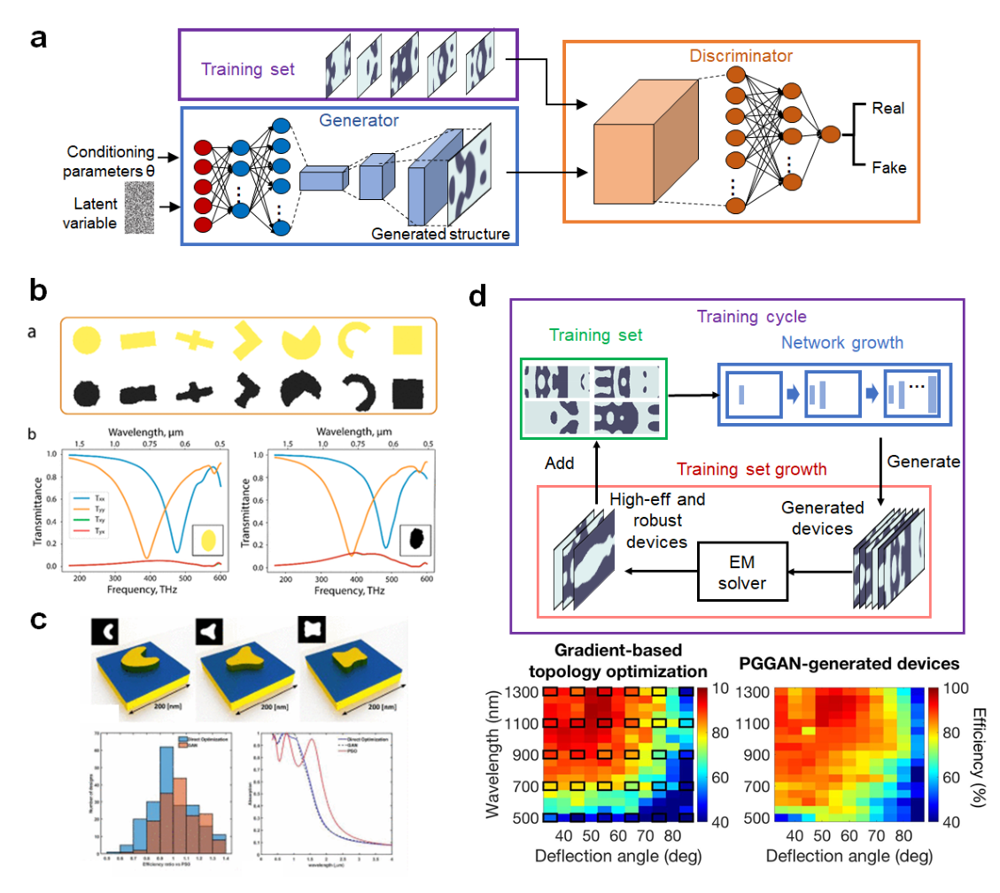

**How to read this figure.** (a) GAN schematic: generator (blue) maps conditioning parameters + latent noise to a structure; the discriminator (orange) sees training-set structures and generated ones and outputs "real" or "fake". (b) Conditional GAN for plasmonic shapes: top row are target shapes, bottom row the generated shapes; plots compare transmittance spectra of a target and a generated structure. (c) Thermal-emitter GAN: generated 3-D plasmonic shapes, a histogram of efficiencies relative to a reference optimiser, and spectra. (d) PGGAN: the training cycle grows both the network and the training set (generate → EM solver → keep high-efficiency, robust devices → add to training set); the two heatmaps compare efficiencies over wavelength (500–1300 nm) and deflection angle (35–85°) for gradient-based topology optimisation (left) and PGGAN-generated devices (right) — similar colours, i.e. comparable efficiencies.

**GAN examples in photonics.**

- **Conditional GAN for plasmonic nanostructures** (Fig. 8b): input the desired transmission spectrum; output a shape. Training data: freeform shapes from disks to crosses, with their spectra. Training used **two** discriminative networks: the adversarial discriminator (makes shapes look like the training set) and a **pretrained surrogate simulator** (makes the shape's predicted spectrum match the request). Similar two-discriminator schemes generated single- and multi-layer RF metasurfaces. Other GANs (plasmonic shapes from reflection spectra; dielectric meta-atoms from amplitude and phase) had no surrogate: one added spectral-matching terms to the generator loss, the other simulated generated devices afterwards and kept the good ones.
- **GANs trained on topology-optimised devices.** Restrict the training set to *high-performance* freeform devices, so the network spends its capacity only on learning what good devices look like. For **thermophotovoltaic emitters** (Fig. 8c) an unconditional GAN, trained on locally optimised designs (from random starts), generated many complex devices, **some better than the training set**. The same group found an **adversarial autoencoder (AAE)** — a VAE-like model where a discriminator, instead of the KL term, pushes the latent codes towards a Gaussian — generated even better devices than the GAN.
- **Metagratings** (periodic structures that send light into the +1 diffraction order; good model systems for metasurfaces). A GAN conditioned on wavelength and deflection angle, trained on topology-optimised silicon metagratings at selected (wavelength, angle) pairs, could generate devices across the **continuous** range — but **the best generated devices were not robust or highly efficient and needed further optimisation**. The follow-up **progressive-growing GAN (PGGAN)** grew the network and the training set over several cycles (adding the best, robust generated devices back into the training data, Fig. 8d) and used **self-attention layers** (which capture long-range spatial correlations). It generated robust devices with efficiencies **comparable to the best topology-optimised ones**.

## 4.3 Global topology optimization networks

**The problem.** Freeform inverse design wants the **global optimum** — the best device in the whole design space. Heuristic methods and gradient-based topology optimisation both struggle, because the space is vast and non-convex: adjoint optimisation finds *a* local optimum near wherever it started. And every network method so far depends on a training set, so it can only reach the global optimum **if devices near it are already in the training set**. Networks fit and interpolate; they **cannot meaningfully extrapolate** beyond their data.

**The idea of GLOnets.** A **global topology optimisation network (GLOnet)** is a generative network trained **without any training set** ("dataless" training). Instead of fitting a dataset's distribution, it is trained to output a distribution that is **narrowly peaked around the global optimum** (Fig. 9b). Training *is* the optimisation.

**How one training step works** (Fig. 9a):

1. Sample a batch of latent vectors $\boldsymbol{z}^{(1)},\dots,\boldsymbol{z}^{(N)}$ and generate $N$ devices $\boldsymbol{x}^{(n)} = G_{\boldsymbol{w}}(\boldsymbol{z}^{(n)})$ (index profiles; a deep generative CNN, optionally conditioned on labels such as wavelength and angle).
2. For each device, run a **forward** and an **adjoint** simulation to get its figure of merit $\text{Met}^{(n)}$ (e.g. diffraction efficiency) and its **performance gradient** $\boldsymbol{g}^{(n)} = \partial\,\text{Met}/\partial\boldsymbol{x}$ (or use auto-differentiation).
3. Put them into the loss below and backpropagate to update the generator weights $\boldsymbol{w}$.

$$L(\mathbf{x}, \mathbf{g}; \text{Met}) = -\frac{1}{N}\sum_{n=1}^N \frac{1}{\sigma} \exp\!\left(\frac{\text{Met}^{(n)}}{\sigma}\right) \mathbf{x}^{(n)} \cdot \mathbf{g}^{(n)} \tag{4}$$

Symbols: $N$ batch size; $\sigma$ a tunable **hyperparameter** (a "temperature"); $\text{Met}^{(n)}$, $\mathbf{x}^{(n)}$, $\mathbf{g}^{(n)}$ the performance, layout and performance gradient of the $n$-th device. The dot is a sum over all voxels: $\mathbf{x}\cdot\mathbf{g} = \sum_i x_i g_i$.

**Why this strange form? A derivation.** In Eq. 4, $\text{Met}^{(n)}$ and $\mathbf{g}^{(n)}$ are numbers handed over by the simulator: they are treated as **constants** during backprop. Only $\mathbf{x}^{(n)} = G_{\boldsymbol{w}}(\boldsymbol{z}^{(n)})$ depends on the network weights. So

$$\frac{\partial L}{\partial \boldsymbol{w}} = -\frac{1}{N}\sum_n \frac{1}{\sigma}e^{\text{Met}^{(n)}/\sigma}\ \mathbf{g}^{(n)T}\frac{\partial \mathbf{x}^{(n)}}{\partial \boldsymbol{w}}$$

Now use the chain rule backwards: $\mathbf{g}^T\,\partial\mathbf{x}/\partial\boldsymbol{w} = \partial\,\text{Met}/\partial\boldsymbol{w}$, and $\frac{1}{\sigma}e^{\text{Met}/\sigma}\,\partial\text{Met}/\partial\boldsymbol{w} = \partial\big(e^{\text{Met}/\sigma}\big)/\partial\boldsymbol{w}$. Therefore

$$\frac{\partial L}{\partial \boldsymbol{w}} = -\frac{\partial}{\partial\boldsymbol{w}}\left[\frac{1}{N}\sum_n e^{\text{Met}(G_{\boldsymbol{w}}(\boldsymbol{z}^{(n)}))/\sigma}\right]$$

So minimising Eq. 4 by gradient descent is the same as **maximising the batch average of $e^{\text{Met}/\sigma}$**. The $\mathbf{x}\cdot\mathbf{g}$ product is simply a trick to inject the simulator's gradient into an auto-differentiation framework (the framework only needs to differentiate $\mathbf{x}$ with respect to $\boldsymbol{w}$; the adjoint simulation supplies the rest).

**What the exponential does.** Each device's gradient is weighted by $e^{\text{Met}/\sigma}$. Good devices get exponentially more say in how the generator moves:

- Met = 0.95 vs 0.90 with $\sigma = 0.05$: weight ratio $e^{0.05/0.05} = e^1 \approx 2.7$.
- Same devices with $\sigma = 0.01$: ratio $e^{5} \approx 148$ — almost only the best device counts.
- With large $\sigma$, $e^{\text{Met}/\sigma}\approx 1 + \text{Met}/\sigma$ and all devices count equally: GLOnet becomes "many parallel adjoint optimisations sharing one network".

Small $\sigma$ = greedy, focuses on the current best; large $\sigma$ = democratic, explores more. Because only *ratios* of weights matter (a constant factor can be absorbed into the learning rate), **you do not need to know the value of the global optimum** — the paper stresses this.

**Why a network instead of many independent optimisations?** The generator maps a whole cloud of latent vectors to a cloud of devices, all through *shared* weights. A gradient that improves one device changes the network and therefore moves *all* devices. Early on the cloud is broad and samples many valleys (exploration); the exponential weighting lets the devices in the best valley pull the whole distribution towards them; the cloud then narrows onto the best region. No compute is wasted polishing devices in poor valleys, which is the reason for the efficiency numbers below.

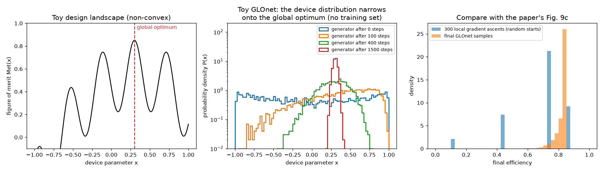

**How to read this figure.** Left: a toy 1-D "design landscape" with several local optima and a global optimum at $x = 0.3$ (in a real device, $x$ would be thousands of voxels and Met would come from forward + adjoint simulations). Middle: a deliberately tiny "generator" $x = \tanh(\mu + s z)$ with only two weights ($\mu$, $\log s$), trained with Eq. 4 ($\sigma = 0.1$, batch of 100, slowly decaying learning rate). Its device distribution starts broad (blue, step 0), drifts and narrows (orange, green), and ends as a narrow peak on the global optimum (red, step 1500). In our runs, 10 out of 10 random seeds ended at $x \approx 0.30$. Right: final efficiencies. Ordinary gradient ascent from 300 random starts (blue) piles up on whichever local peak is nearest — only about 20 % reach the global one. The GLOnet samples (orange) are all near the top. Compare with the paper's Fig. 9c. (This 2-weight toy is only for intuition; a real GLOnet uses a deep CNN generator.)

**Results.**

- **Unconditional GLOnets for silicon-ridge metagratings:** 63 separate GLOnets, one per (wavelength, deflection angle) pair, each benchmarked against **500** adjoint-optimised devices from random starts. For **57 of 63**, the best GLOnet device was as good as or better than the best of the 500 local optimisations. GLOnet efficiency histograms are narrow and pushed to high efficiency (Fig. 9c). Stability: of 8 GLOnets trained from different random initialisations on the same problem, **6 found the same device, with 97 % efficiency**.
- **Conditional GLOnets** (one network for a whole range of wavelengths and angles): **75 %** of its best devices beat the local-optimisation benchmark, using **10× less computation** than the benchmark. Conditioning worked because good designs for neighbouring wavelengths/angles are strongly correlated.

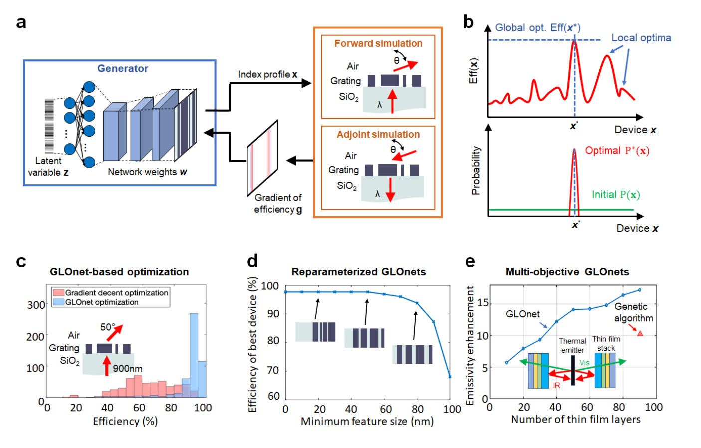

**How to read this figure.** (a) The GLOnet loop: latent variable $\boldsymbol{z}$ → generator (weights $\boldsymbol{w}$) → index profile $\boldsymbol{x}$ → forward and adjoint simulations of the grating (light incident through SiO₂, diffracted at angle $\theta$ into air) → efficiency gradient $\boldsymbol{g}$ → backpropagated into the generator. (b) Top: efficiency vs device with several local optima and the global optimum $\boldsymbol{x}^*$; bottom: the generator's distribution goes from flat (green, initial) to a spike at $\boldsymbol{x}^*$ (red). (c) Histograms for a 900 nm, 50° metagrating: gradient-descent (adjoint) optimisation (red) spreads from 20 % to 100 %; GLOnet (blue) is concentrated above 90 %. (d) Reparameterised GLOnets: best efficiency vs enforced minimum feature size, with device pictures: flat at ~98 % for small constraints, then falling steeply past ~80 nm to under 70 % at 100 nm. (e) Multi-objective GLOnets for thin-film thermal filters: emissivity enhancement grows with layer count; the genetic-algorithm reference (red triangle) needs many more layers for a similar enhancement.

### Incorporating constraints with reparameterisation

Real devices must obey **fabrication constraints**, like a **minimum feature size** or robustness to imperfections. The usual approach — add **penalty terms** to the figure of merit — pushes designs towards compliance but **does not guarantee** it.

**Reparameterisation** gives **hard constraints**: let the optimiser work with **unconstrained latent variables** $u$, and map them to the real device through a **differentiable transformation** that can only produce legal devices. Example: a ridge width that must exceed $w_{\min}$:

$$w = w_{\min} + \text{softplus}(u) = w_{\min} + \ln(1+e^{u})$$

Whatever real number $u$ the optimiser chooses, $w > w_{\min}$. Gradients flow back by the chain rule:

$$\frac{\partial\,\text{Met}}{\partial u} = \frac{\partial\,\text{Met}}{\partial w}\cdot\frac{\partial w}{\partial u} = \frac{\partial\,\text{Met}}{\partial w}\cdot\frac{1}{1+e^{-u}}$$

(The softplus is our example; the paper only requires that the transformation be differentiable.) In the demonstration: metagratings deflecting light to **65°**, topology fixed at **four silicon ridges**, latent variables transformed into ridge widths and gaps with a hard minimum feature size. Silicon/air regions used grey-scale profiles defined by analytic functions so adjoint gradients applied directly (a **shape optimisation**). Result (Fig. 9d): the unconstrained global optimum has a **20 nm** smallest feature, so constraints ≤ 20 nm give the same device; **as the minimum feature size grows, the best efficiency falls**, and every constrained optimum contains at least one feature *exactly at* the minimum size — small features help diffraction.

*For you:* this is the same philosophy as the filter + projection pipeline in your density-based topology optimisation (blur with radius $R$, then threshold), which is also a differentiable map from free variables to (approximately) constrained geometries.

### Multi-objective GLOnets

"Multi-objective" here means the design involves more than one binary choice per voxel: e.g. a **multilayer thin-film stack** where each layer can be one of $M$ materials. GLOnets represent the stack as a matrix: one row per layer, each row a $1\times M$ vector of scores. The **softmax** turns each row into probabilities:

$$p_m = \frac{e^{s_m}}{\sum_{k=1}^{M} e^{s_k}}$$

The layer's **expected refractive index** $\bar n = \sum_m p_m n_m$ is fed to the solver; loss and backprop proceed as usual. As training proceeds, one probability per row approaches 1 — that material is chosen.

*Worked example:* three candidate materials, MgF₂ ($n=1.38$), SiO₂ (1.45), TiO₂ (2.4), with scores $(0, 2, 0)$: $e^2 = 7.39$, sum $= 9.39$, so $p = (0.106, 0.787, 0.106)$ and $\bar n = 0.106\cdot1.38 + 0.787\cdot1.45 + 0.106\cdot2.4 = 1.54$. As the SiO₂ score grows, $\bar n \to 1.45$.

Results:

- **Broadband, wide-angle anti-reflection coating** on silicon solar cells (three layers, continuous index per layer). Benchmarks: brute-force search for the global optimum took **over 19 days of CPU time**; a multi-start gradient method took **15 minutes**. **GLOnet: 7 seconds on one GPU.**
- **Thermal filters** (transmit visible, reflect infrared) from **seven** materials (MgF₂, SiO₂, SiC, SiN, Al₂O₃, HfO₂, TiO₂). A **45-layer** GLOnet design transmits almost perfectly at 500–700 nm and reflects almost perfectly in the near-infrared, at normal incidence and averaged over all angles. GLOnets beat a genetic-algorithm reference and matched its performance with about **two-thirds the number of layers** (fewer layers = easier to make).

## 5 Future research directions and practices

**Where things stand.** Discriminative networks are effective surrogates of Maxwell solvers. Generative networks are a new framework for freeform inverse design, both by learning from device datasets and by dataless training with Maxwell solvers.

**When *not* to use neural networks** (the paper's own failure modes and caveats — this is the list your schedule asks for):

1. **They need large training sets** — thousands to millions of devices — a big one-time cost. *If conventional simulation/optimisation fits in an equal or smaller compute budget, use the conventional approach.*
2. **No accuracy guarantee.** Even the best network should not replace a simulator when an exact physics answer is needed. (Recall the ~5 % badly wrong field predictions in Section 3.1.)
3. **Low-dimensional problems** (a few design parameters) are often handled just as well by classical statistics, ML and optimisation toolboxes (e.g. Gaussian-process regression, Bayesian optimisation, standard optimisers), which **do not need extensive hyperparameter tuning**.
4. Collected from earlier sections: **no extrapolation** beyond the training data; the **curse of dimensionality** for freeform designs; **inverse non-uniqueness**; gradient-based design on a surrogate can fail from **inaccuracy or local optima**; GAN-generated devices may be **not robust or efficient** without further refinement.

**Where neural networks shine.**

1. **Speed** after training — orders of magnitude faster than simulation, for when simulation time is the bottleneck.
2. **Regression power** beyond classical fitting, scaling to complex, high-dimensional systems.
3. **Many related variants**: one conditional network can co-design a whole family (grating couplers for different input modes; metasurface sections for different amplitudes and phases).
4. **Better devices**: GLOnets already beat conventional gradient-based optimisers.

**What is needed next.** Four directions.

**(i) Physics + ML hybrids.** Not generic ML but methods that build in the structure of Maxwell's equations. GLOnets are one example. Another is training networks to **solve differential equations** directly — the idea behind **physics-informed neural networks (PINNs)**, where the loss is the residual of the governing equation rather than a mismatch with data. For example, for a network $\mathbf{E}_{\boldsymbol{w}}(\mathbf{r})$ that outputs the frequency-domain field at position $\mathbf{r}$:

$$\mathcal{L}_{\text{PINN}} = \frac{1}{K}\sum_{k=1}^{K}\Big\Vert \nabla\times\nabla\times\mathbf{E}_{\boldsymbol{w}}(\mathbf{r}_k) - k_0^2\,\varepsilon(\mathbf{r}_k)\,\mathbf{E}_{\boldsymbol{w}}(\mathbf{r}_k)\Big\Vert^2 + \text{(boundary and source terms)}$$

It is evaluated at $K$ "collocation" points, with the curls computed by auto-differentiation, and needs no simulated training data. The authors predict that **dataless training** — using physics calculations, not datasets, to train networks — will be especially effective and computationally efficient.

**(ii) Faster solvers**, because bigger problems need bigger training sets or bigger simulation batches. Ideas: **neural-network-enhanced preconditioners** (a network predicts an approximate field; the exact solver starts from it and converges much faster — the network *accelerates* the solver instead of replacing it, so accuracy is not sacrificed); and revisiting fast specialised methods such as **integral-equation solvers** and **T-matrix** approaches.

**(iii) Streamlined training.** Today every new problem needs a network trained from scratch. **Transfer learning** reuses weights from a network trained on a related (or cheaper, simplified) problem — e.g. weights from a concentric-shell scatterer network improved training for a thin-film-stack network. **Meta-learning** ("learning to learn") may automate network setup, though it is data-hungry.

**(iv) Open culture and benchmarks.** Computer vision advanced fast partly through shared datasets (ImageNet, CIFAR-10) and contests such as the ImageNet challenge, where everyone solves the same task on the same data. Photonics should agree on benchmark problems, share training sets and code, and standardise how freeform layouts are shared, so devices can be compared on performance *and* on **robustness to geometric imperfections**. The authors' repository **MetaNet** held over 100,000 freeform metagrating designs plus local and global optimisation codes.

---

## Reading for your note: the three things the schedule asks for

Use this section to check yourself *after* you have written the note with the paper closed.

**(1) Taxonomy.**

- **Discriminative** = deterministic map, one output per input. Uses: forward surrogate; inverse design by backprop through it, by a classical optimiser using it, or by inverse/tandem/multi-branch networks.
- **Generative** = latent variable in, distribution out (one-to-many). Uses: unconditional (fill a good region), conditional (interpolate across labels), latent-space search; model types VAE, GAN (and AAE, PGGAN, autoregressive). Special case: **GLOnet**, generative + physics gradients, no training set.
- Orthogonal axis — **data structure**: vectors → FC; images → CNN; graphs → GNN; time series → RNN.

**(2) One concrete speed-up number.** Pick one and quote it with its context:

- GNN surrogate for microwave filters: **~10⁴× faster** than the commercial solver (after 80,000 training simulations).
- Hybrid surrogate + classical optimiser: "hours and days → minutes".
- Conditional GLOnet: **10× less compute** than the adjoint local-optimisation benchmark, with 75 % of devices better.
- GLOnet anti-reflection coating: **7 s** (one GPU) vs **15 min** (multi-start gradient) vs **>19 days** (brute force).

Note the honesty trap: the surrogate speed-ups exclude the cost of generating the training data, while the GLOnet comparisons include all simulations (no training data needed).

**(3) Failure modes.** Training data cost (thousands to millions of simulations); data coverage and no extrapolation; curse of dimensionality (exponential training-set growth, Fig. 5a); a fraction of predictions always poor (~5 % in the CNN field example), with no warning; non-uniqueness breaks naive inverse networks; surrogate-based optimisation finds local optima or exploits surrogate errors; generated devices need refinement; heavy hyperparameter tuning; classical tools are as good for low-dimensional problems.

**A candidate "what surrogates actually buy" sentence** (rewrite in your own words): *A surrogate buys cheap repeated evaluations inside the region its training simulations already covered; it pays off only when you will query it many more times than the simulations it cost, and it buys nothing — or misleads — outside that region.*

## How this connects to your project

Your project is robust, fabrication-aware inverse design of silicon photonic devices with Meep/Tidy3D, with Monte-Carlo yield analysis and a *possible* ML surrogate. This paper feeds tomorrow's decision directly:

- **Your design space is "discrete vector" data.** Inputs: a few design knobs, etch bias, thickness. Outputs: T at 1550 nm, bandwidth, excess loss. The paper says this regime (≈ 10 parameters) is exactly where surrogates work *and* where **classical tools (a Gaussian process, a 1-hidden-layer MLP) are often just as good** — which is why the schedule asks for "a GP or a small MLP", not a deep network.
- **Data coverage is your binding constraint.** Your dataset can only come from runs you already have (optimisation histories + Monte-Carlo samples). Those cluster around your optimisation paths and nominal designs. A surrogate trained on them can interpolate there, but the ring example on this page shows what happens outside: confident nonsense. Check coverage (distinct values per input; a convex hull in standardised input space) before trusting any prediction.
- **Monte-Carlo yield is the natural use.** Each Monte-Carlo sample is a small perturbation of a fixed design — inside the training region if your existing Monte-Carlo runs sampled the same perturbation range. That is the best case for a surrogate: many cheap queries in a small, well-covered region. But a yield number from a surrogate must be spot-checked against real simulations.
- **Warm-starting is the safe use.** The schedule's version — use the surrogate only to propose a starting point, then run the real adjoint optimisation — is robust to surrogate error, because the final design is always verified by Meep/Tidy3D. Measure the value as **iterations saved** against a named baseline run; below 20 % saved, it is a footnote.
- **GLOnets and reparameterisation** connect to your fabrication-aware methods: hard constraints via differentiable transformations is the same philosophy as your filter–projection pipeline and erosion/dilation robustness. GLOnets themselves would need many simulations per step (a batch of forward + adjoint runs), so they are out of scope this cycle — a "Future Work neighbour", as the schedule says on 12 May.

!!! warning "Common confusions"
    - **"Discriminative" vs "the discriminator".** A *discriminative network* is any deterministic regression/classification network (e.g. a surrogate). *The discriminator* is one specific network inside a GAN that classifies real vs fake. A GAN's discriminator is a discriminative network, but most discriminative networks are not GAN discriminators.
    - **"Latent" means two related things.** In autoencoders and VAEs, the latent vector is the compressed code of a device. In generative networks generally, the latent variable is the random input. In a VAE they coincide.
    - **Backprop for training vs backprop for design.** Training moves the *weights* with the inputs fixed. Inverse design through a frozen network moves the *inputs* with the weights fixed. Same chain rule, different variables.
    - **The adjoint gradient and backprop are the same idea.** Both get all sensitivities with one extra "backward" computation. GLOnets literally chain them: adjoint simulation gives $\partial\text{Met}/\partial\boldsymbol{x}$, backprop gives $\partial\boldsymbol{x}/\partial\boldsymbol{w}$.
    - **"Orders of magnitude faster" excludes the training data.** The speed-up is per evaluation, after paying for tens of thousands of simulations. Count both.
    - **Low training loss ≠ good surrogate.** Only held-out error, measured inside the region you will actually query, tells you that. And held-out error says nothing about extrapolation.
    - **GLOnets do not need a training set**, but they *do* need many simulations (a batch of forward + adjoint runs per training step). "Dataless" is not "simulation-free".
    - **Tandem networks don't solve non-uniqueness by finding all solutions.** They avoid the averaging problem by accepting *any one* valid solution. To get several, you need multi-branch or generative models.
    - **The MSE-trained inverse network doesn't "pick a branch at random".** It converges to the conditional *average*, which is typically not on any branch.

## Check yourself

**Q1.** In one sentence each, what is the difference between a discriminative and a generative network, and which one maps one-to-many?

??? note "Answer"
    A discriminative network is deterministic: one input gives one output, so it learns a single-valued function (one-to-one or many-to-one), which suits the forward problem. A generative network also takes a random latent variable, so for a fixed input (label) it outputs a whole distribution of devices: it maps one-to-many, which suits the inverse problem.

**Q2.** A neuron has $\boldsymbol{x} = (2, -1)$, $\boldsymbol{w} = (0.5, 1)$, $b = 0$, ReLU activation, target $\hat y = 1$, loss $(y-\hat y)^2$. Compute $y$, $L$, and $\partial L/\partial\boldsymbol{w}$.

??? note "Answer"
    $a = 0.5\cdot2 + 1\cdot(-1) + 0 = 0$. ReLU(0) = 0, so $y = 0$ and $L = 1$. But ReLU's derivative at $a \le 0$ is 0, so $\partial L/\partial\boldsymbol{w} = 2(y-\hat y)\cdot 0\cdot\boldsymbol{x} = (0,0)$. The neuron cannot learn from this example: a "dead ReLU". This is one reason smooth activations like tanh are often used for small regression surrogates.

**Q3.** Why does a network trained with MSE to map a target spectrum to a geometry fail when two geometries give the same spectrum?

??? note "Answer"
    For a fixed input, the output that minimises the mean squared error over the training examples is their mean. If two (or more) valid geometries share a spectrum, the network converges to their average, which usually lies on no branch and does not produce the target spectrum.

**Q4.** How does a tandem network avoid that failure? What must be true for it to work?

??? note "Answer"
    It feeds the inverse network's proposed geometry into a frozen, pre-trained forward surrogate and computes the loss on the *spectrum*: $\Vert f(g(\boldsymbol{y})) - \boldsymbol{y}\Vert^2$. Any geometry that reproduces the spectrum gives zero loss, so there is nothing to average. It works only as well as the forward surrogate is accurate over the region the inverse network ends up proposing.

**Q5.** The paper's Fig. 5a shows training-set size growing exponentially with degrees of freedom. Why, and what are the three dimensionality-reduction methods it discusses?

??? note "Answer"
    Covering a $d$-dimensional space at a fixed resolution needs about $k^d$ samples: the curse of dimensionality. The methods: PCA (a linear projection onto the highest-variance directions), Fourier truncation of level-set images (keep low spatial frequencies, e.g. $64\times64\to9$ unique numbers), and autoencoders (non-linear encoder/decoder with a small latent layer).

**Q6.** Write the two parts of the VAE loss and say what each one does. Compute the KL term for $\mu = 0$, $\sigma = 2$.

??? note "Answer"
    Reconstruction loss (decoded output vs input) keeps the information. The KL regularisation $D_{KL}(\mathcal{N}(\mu,\sigma^2)\Vert\mathcal{N}(0,1))$ forces encoded distributions towards a standard Gaussian, so the latent space is filled smoothly and random samples decode to plausible devices. For $\mu=0,\sigma=2$: $\tfrac12(0 + 4 - 1 - \ln 4) = \tfrac12(3 - 1.386) = 0.81$ nats.

**Q7.** In a GAN, what is the optimal discriminator for a fixed generator, and what does the generator then minimise?

??? note "Answer"
    $D^*(x) = \hat P(x)/(\hat P(x) + P(x))$. Substituting gives $V = -\log 4 + 2D_{JS}(\hat P, P)$, so the generator minimises the Jensen–Shannon divergence between the training distribution and its own output distribution.

**Q8.** Show that minimising the GLOnet loss (Eq. 4) is the same as maximising the batch average of $e^{\text{Met}/\sigma}$. Why does $\sigma$ matter?

??? note "Answer"
    Met and $\mathbf{g}$ are constants from the simulator, so $\partial L/\partial\boldsymbol{w} = -\frac1N\sum\frac1\sigma e^{\text{Met}/\sigma}\mathbf{g}^T\partial\mathbf{x}/\partial\boldsymbol{w}$. Since $\mathbf{g}^T\partial\mathbf{x}/\partial\boldsymbol{w} = \partial\text{Met}/\partial\boldsymbol{w}$, this equals $-\partial_{\boldsymbol{w}}\frac1N\sum e^{\text{Met}/\sigma}$. Small $\sigma$ makes the best devices dominate exponentially (greedy, focused); large $\sigma$ weights all devices about equally (more exploratory, close to parallel local optimisation).

**Q9.** Why can GLOnets find better devices than training-set-based generative networks?

??? note "Answer"
    Training-set-based networks can only interpolate within their data, so they reach the global optimum only if it (or something near it) is already in the training set. GLOnets use simulator-computed performance gradients during training and move the whole distribution towards higher performance, so they can go beyond any existing designs.

**Q10.** How does reparameterisation enforce a hard minimum feature size, and why must the transformation be differentiable?

??? note "Answer"
    The optimiser works on unconstrained latent variables, which a fixed transformation maps to geometric parameters that satisfy the constraint by construction (e.g. $w = w_{\min} + \text{softplus}(u) > w_{\min}$). The performance gradient is computed for the real device and has to be backpropagated through the transformation to the latent variables by the chain rule, which needs derivatives.

**Q11.** Your 2-D surrogate dataset has 100 rows from existing runs. A design query lies 30 nm outside the range of etch biases in the data. Should you trust the surrogate's prediction there?

??? note "Answer"
    No. That is extrapolation, and networks give confident but unreliable outputs outside their training coverage (see the ring example: a prediction of 1.65 where the truth was 0.04). Either simulate it directly or restrict the surrogate to warm-start use inside the covered region.

**Q12.** Give the break-even condition for building a surrogate, in words and as a rough formula.

??? note "Answer"
    The total time saved must exceed the time spent generating training data: $N_{\text{uses}}(t_{\text{sim}} - t_{\text{NN}}) > N_{\text{train}}\,t_{\text{sim}}$, roughly $N_{\text{uses}} > N_{\text{train}}$ when the network is much faster. All those uses must also lie inside the region the training data covers.

## Key takeaways

- Neural networks are flexible functions $f_{\boldsymbol{w}}$, trained by minimising a loss (MSE for regression) with gradient descent, using backpropagation (the chain rule, same spirit as the adjoint method) to get all gradients cheaply.
- **Discriminative networks** = fast forward surrogates (device → response). Accurate for ~10-parameter devices, 10³–10⁴× faster per evaluation, but they need tens of thousands of simulations to train, always have a fraction of poor predictions, and **cannot extrapolate**.
- Inverse design with discriminative networks: backprop to the input, hybrid classical optimisers, or inverse networks — the last breaks on **one-to-many** non-uniqueness unless you restrict the space, use multi-branch outputs, or use a **tandem** network.
- **Curse of dimensionality**: training-set size grows exponentially with degrees of freedom; PCA, Fourier truncation and autoencoders compress the design space to make learning tractable.
- **Generative networks** (VAEs, GANs) learn distributions of good device shapes and give one-to-many inverse maps; VAE = reconstruction + KL regularisation; GAN = generator vs discriminator, minimising JS divergence (or Wasserstein distance in WGANs).
- **GLOnets** train a generator without data, using adjoint gradients and an exponentially weighted loss (maximise the mean of $e^{\text{Met}/\sigma}$), and outperform many local optimisations (57/63 cases; 10× less compute; 7 s vs 19 days for an AR coating).
- Hard fabrication constraints can be enforced by **differentiable reparameterisation**.
- The authors' own verdict: networks complement, not replace, simulators. Use them when many evaluations are needed in a well-covered region. For low-dimensional problems, classical tools are often as good with less tuning. **Physics-informed, dataless** methods are the most promising direction.

## Glossary

| Term | Plain definition |
|---|---|
| Activation function | The non-linear "bend" applied after a neuron's weighted sum (sigmoid, tanh, ReLU). |
| Adam | A gradient-descent variant with momentum and per-weight automatic step sizes. |
| Adjoint method | Gets the gradient of a figure of merit with respect to every design pixel from one forward and one adjoint simulation. |
| Adversarial autoencoder (AAE) | A VAE-like model that uses a discriminator instead of the KL term to shape the latent space. |
| Autoencoder | Encoder + decoder network trained to reconstruct its input through a small latent layer. |
| Auto-differentiation | Software that computes exact derivatives of a program by applying the chain rule automatically. |
| Autoregressive model | A generative model that produces data one element at a time from explicit conditional probabilities. |
| Backpropagation | Applying the chain rule backwards through a network to get the gradient of the loss for every weight. |
| Batch / mini-batch | The set of training examples used for one weight update. |
| Bias (neuron) | A trainable constant added to a neuron's weighted sum. |
| Conditional network | A generative network that also takes labels (e.g. wavelength) as input, giving $P(\boldsymbol{x}\mid\boldsymbol{\theta})$. |
| Convex hull | The smallest convex region containing a set of points; used to mark where data exist. |
| Convolutional layer | A layer that slides small trainable kernels over an image to produce feature maps. |
| CNN | Convolutional neural network: a network built mainly from convolutional layers, for images. |
| Covariance matrix | Matrix of how pairs of variables vary together; its eigenvectors are the PCA directions. |
| Curse of dimensionality | The number of samples needed to cover a space grows exponentially with its dimension. |
| Dataless training | Training a network using physics calculations instead of a pre-computed dataset. |
| Decoder | The part of an autoencoder that maps a latent vector back to full data. |
| Deep neural network | A neural network with more than one hidden layer. |
| Design space | The set of all devices that the parameterisation allows. |
| Dimensionality reduction | Describing data with fewer numbers while keeping the important information. |
| Discriminative network | A deterministic network mapping inputs to outputs (regression or classification). |
| Discriminator (GAN) | The GAN network that tries to tell real training devices from generated ones. |
| Encoder | The part of an autoencoder that compresses data into a latent vector. |
| Epoch | One full pass through the training set. |
| Extrapolation | Predicting outside the range covered by training data; networks are unreliable here. |
| Feature map | The output image of a convolutional kernel, showing where its pattern occurs. |
| Forward problem | Given the device, find its response. |
| Free spectral range (FSR) | Wavelength spacing between neighbouring ring resonances, about $\lambda^2/(n_g L)$. |
| Fully connected (FC) layer | A layer where every neuron receives every output of the previous layer. |
| GAN | Generative adversarial network: generator and discriminator trained against each other. |
| Generalisation | Being accurate on new inputs not seen during training. |
| Generative network | A network with a random latent input that outputs a distribution of devices. |
| Generator | The network that produces devices from latent variables (in GANs and GLOnets). |
| GLOnet | Global topology optimisation network: a generator trained with simulator gradients to concentrate on the global optimum. |
| Global optimum | The best design in the entire design space. |
| GNN | Graph neural network: processes nodes and edges by aggregating neighbour information. |
| Gradient | Vector of partial derivatives; points in the steepest uphill direction. |
| Gradient descent | Repeatedly stepping parameters opposite to the gradient to reduce a loss. |
| Ground truth | The true value (here, from the simulator) that a network is trained to match. |
| Held-out (test) set | Data kept aside during training, used only to measure honest error. |
| Hidden layer | Any layer between a network's input and output. |
| Hyperparameter | A setting chosen by the user, not learned (learning rate, layer sizes, $\sigma$ in GLOnets). |
| Interpolation | Predicting between training examples; networks are good at this. |
| Inverse problem | Given the desired response, find a device that produces it. |
| Jacobian | Matrix of derivatives of every output with respect to every input. |
| JS divergence | Jensen–Shannon divergence: a symmetric, bounded measure of difference between two distributions. |
| Kernel (filter) | The small matrix of trainable weights in a convolutional layer. |
| KL divergence | Kullback–Leibler divergence: a non-symmetric measure of how one distribution differs from another. |
| Latent variable / vector | A hidden, low-dimensional variable: the random input to a generator or the code in an autoencoder. |
| Learning rate | The step size in gradient descent. |
| Level-set function | A smooth function whose zero contour defines a shape's boundary. |
| Local optimum | A design better than all nearby designs, but not necessarily the best overall. |
| Loss function | One number measuring how wrong the network is; training minimises it. |
| Meta-learning | Methods in which networks learn how to learn new tasks quickly. |
| MetaNet | The authors' online repository of metagrating designs and optimisation codes. |
| Metagrating | A periodic nanostructure designed to diffract light into one chosen order. |
| Mode collapse | A GAN failure in which the generator produces only a narrow set of outputs. |
| MLP | Multilayer perceptron: a stack of fully connected layers. |
| MSE | Mean squared error: average of squared differences between prediction and truth. |
| Multi-branch network | An inverse network with several output heads, one per solution branch. |
| Neuron | Weighted sum of inputs plus bias, passed through an activation function. |
| Non-convex | Having many valleys (local optima), so local search does not guarantee the best answer. |
| One-to-many | One input corresponds to several valid outputs (the inverse design situation). |
| Overfitting | Fitting training data, including noise, so well that accuracy on new data drops. |
| PCA | Principal components analysis: linear projection onto the directions of largest variance. |
| Performance gradient | Derivative of the figure of merit with respect to each design voxel. |
| PGGAN | Progressive-growing GAN: grows network and training set over cycles. |
| Physics-informed neural network (PINN) | A network trained to satisfy a governing equation (e.g. Maxwell's) through its loss. |
| Preconditioner | A transformation or starting guess that makes an iterative solver converge faster. |
| Regression | Predicting continuous numbers. |
| Regularisation | An extra loss term that discourages unwanted solutions (e.g. the KL term in a VAE). |
| ReLU | Rectified linear unit, $\max(0,a)$. |
| Reparameterisation | Optimising unconstrained variables mapped by a differentiable function to valid designs (or, in VAEs, writing a sample as $\mu+\sigma\epsilon$). |
| RNN | Recurrent neural network: carries a hidden state from one time step to the next. |
| Self-attention | A layer that lets every part of an image interact with every other part (long-range correlations). |
| SGD | Stochastic gradient descent: updating weights using one random example (or small batch) at a time. |
| Softmax | Turns a vector of scores into probabilities: $e^{s_m}/\sum_k e^{s_k}$. |
| Softplus | Smooth function $\ln(1+e^u)$ that is always positive. |
| Space mapping | Pairing a coarse-feature model with a fine-feature model (microwave design). |
| Supervised learning | Learning a function from input–output example pairs. |
| Surrogate model | A fast approximate stand-in for an expensive simulator. |
| SVM | Support vector machine: a classical classifier that separates two classes with a boundary. |
| Tandem network | Inverse network trained through a frozen forward surrogate, with the loss on the response. |
| Tensor | A multi-dimensional array (generalises vectors and matrices). |
| Training set | The examples (inputs with true outputs) used to fit the weights. |
| Transfer learning | Reusing weights from a network trained on a related problem. |
| Transfer-matrix method | Exact, fast calculation of light in layered structures. |
| Universal approximation theorem | A big enough network can approximate any continuous function on a bounded region. |
| VAE | Variational autoencoder: an autoencoder whose encoder outputs Gaussians, regularised by a KL term so it can generate. |
| Validation set | Data used to choose hyperparameters, separate from training and test data. |
| Voxel | A 3-D pixel of a discretised device. |
| Wasserstein distance | "Earth-mover's" distance between distributions, used in WGANs for stabler training. |
| Weights | The adjustable numbers in a network that training changes. |
| Weight sharing | Using the same kernel weights at every position in a convolutional layer. |
