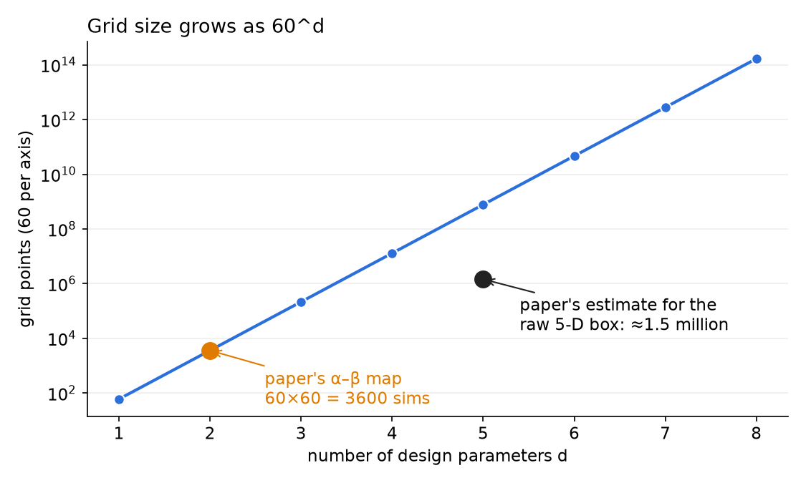
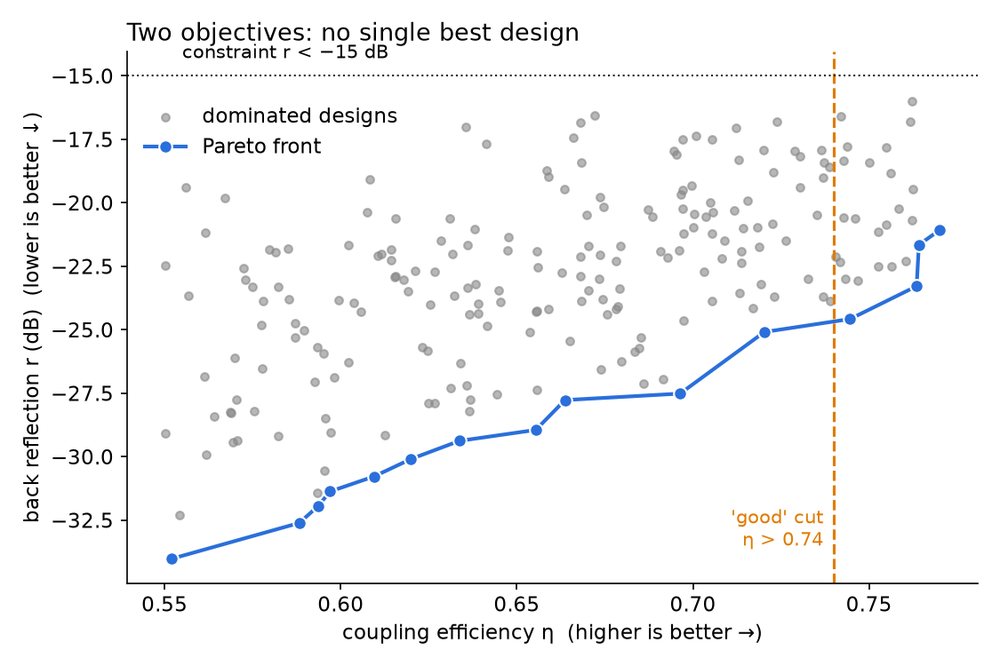
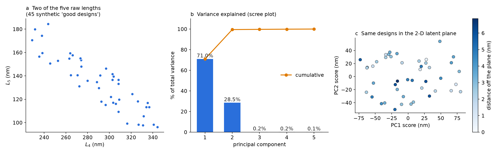
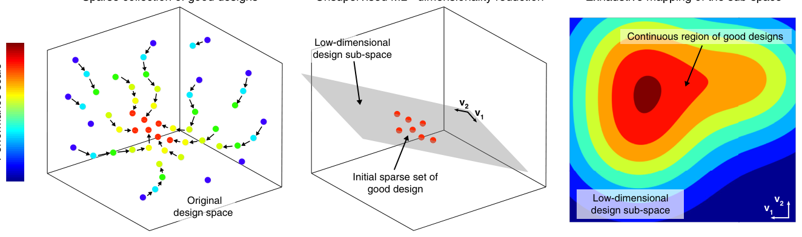
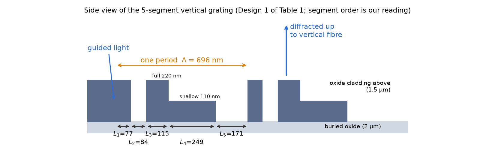
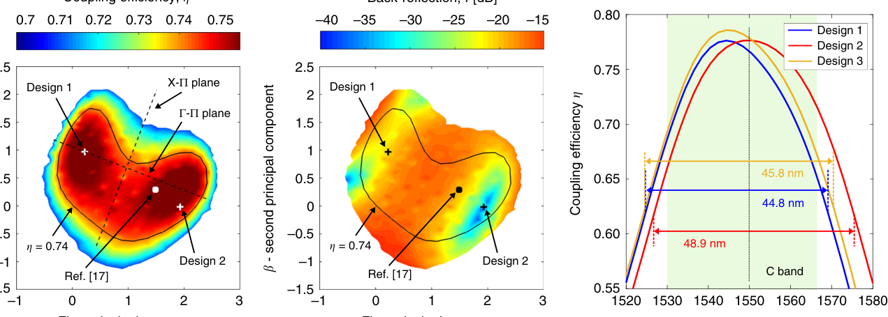
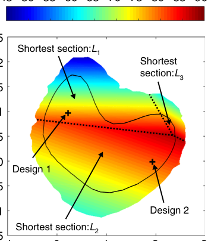
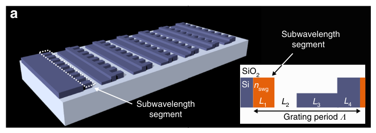

# Week 31 · Day 2 — Tuesday 20 Apr 2027 · Melati 2019: mapping the design space

*Simple-English study version of Melati, Grinberg, Kamandar Dezfouli, Janz, Cheben, Schmid, Sánchez-Postigo & Xu, "Mapping the global design space of nanophotonic components using machine learning pattern recognition", Nature Communications 10, 4775 (2019), DOI 10.1038/s41467-019-12698-1*

---

!!! abstract "Today's slot"
    **06:15–07:45 · Morning** — "Melati et al. 2019 — mapping the global design space with ML and dimensionality reduction."

    **EXIT:** note filed (`paper-notes/2019-melati-design-space.md`); one sentence on why dimensionality reduction is the useful part.

    The schedule's **HOW** block asks you to pull out exactly two things:

    - **(a) the training set:** how many full-wave simulations, and how they were sampled;
    - **(b) the dimensionality-reduction step:** which latent variables are kept and how much of the variance they explain;
    - plus one sentence on why *working in a reduced latent space* is the idea you can carry over, not the specific ML model.

    **Evening (20:00–21:30):** *If surrogate:* define the smallest useful version — design parameters (µm) → S-parameters at fixed frequencies, 2-D data only, warm-start use only, hard stop Saturday, kill criterion "fewer than 20 % iterations saved". *If analysis:* deepen the week-27 mechanism analysis with one more physical test (for example, close the two narrowest gaps of the nominal design and show the loss change).

    **Gotchas from the schedule:** a "latent space" you cannot map back to geometry is useless for warm-starting — check that a decoder exists. A surrogate's value is measured in *iterations saved*, so fix the baseline iteration count now (the week-25/26 runs).

    **After reading this page you should be able to:** explain the three-stage method; do PCA by hand on a tiny data set and in numpy; read the paper's α–β maps; state the simulation budget (≈5000 + 3600 simulations, ≈400× saving); and say what transfers to your own project.

    **This paper comes back on:** Fri 23 Apr 2027 (linked again when you write up your surrogate/analysis branch), Sun 25 Apr 2027 (weekly review checks this note is filed with a "What I don't believe" line), Wed 12 May 2027 (related-work section: Melati is the "ML/surrogate-accelerated design" neighbour for your Future Work), Thu 13 May 2027 (`refs.bib`: key `melati2019mapping`).

!!! note "A note on the brief"
    Your assignment mentioned "sub-wavelength grating (SWG) MMI coupler basics". The paper's device is actually a **vertical fibre grating coupler**, and in the last part it adds an **SWG metamaterial** segment to that grating. There is no MMI in this paper. So this page teaches grating couplers and SWG metamaterials from zero, and only mentions MMIs in passing.

## Before you start: the big picture

Most design methods for photonic devices give you **one** answer. You choose a score (say, "how much light gets into the fibre"), you let an optimiser turn the knobs, and at the end it hands you one set of knob positions. You do not learn *why* that design is good, whether other equally good designs exist, or which of them would be easier to make.

Think of looking for a good place to live. One approach: ask an estate agent for "the cheapest flat within 30 minutes of work". You get one flat. Another approach: first find a handful of flats you like, notice they all lie along one tram line, and then walk the whole tram line, writing down rent, noise, and size at every stop. Now you have a **map**, and you can choose by any criterion you like — even ones you did not think of at the start.

Melati and co-workers do the second thing for a photonic device. Their device has **five** lengths to choose. They:

1. find a few dozen good designs with an optimiser;
2. notice, using a standard statistics tool (PCA), that all of these good designs lie on a flat **2-D sheet** inside the 5-D space of possible designs — the "tram line";
3. sweep over that sheet on a fine grid and draw maps of everything they care about: efficiency, back reflection, smallest feature size, sensitivity to fabrication errors.

Because a 2-D sheet is tiny compared with a 5-D box, step 3 costs about **400 times less** than sweeping the full space. The maps then show things no single optimisation run would: for instance, that **no** good design of this shape has all its features wider than 88 nm. That discovery led the authors to a new grating with a sub-wavelength section that does get above 100 nm.

## Background you need

### Design parameters and the design space

A **design parameter** is a number you are free to choose when you draw the device: a length, a width, a gap, an etch depth, sometimes a material index. If a device has $n$ such numbers, every possible device is one point in an $n$-dimensional space. That space is the **design space**. A device with five lengths $[L_1,\dots,L_5]$ is a point in 5-D space.

Each design gives some **performance metrics** (also called **figures of merit**): numbers that say how good it is. Here they are coupling efficiency $\eta$, back reflection $r$, bandwidth, minimum feature size, and sensitivity to fabrication errors.

A **"good design"** in this paper is simply any design whose coupling efficiency is above a threshold ($\eta > 0.74$) while meeting the constraints.

### Why sweeping a grid gets hopeless fast (the curse of dimensionality)

The most honest way to understand a design space is to sample it on a regular grid and simulate every grid point. If you want 60 points along each axis:

- 1 parameter: 60 simulations;
- 2 parameters: $60^2 = 3600$;
- 5 parameters: $60^5 \approx 7.8\times10^8$.

The cost grows like $60^d$: **exponentially** in the number of dimensions $d$. This is the **curse of dimensionality**. With one simulation per second, $60^5$ points take about 25 years. This is why people use optimisers instead of grids — and why reducing $d$ is so valuable.



**How to read this figure.** The vertical axis is logarithmic, so the straight blue line means exponential growth: each extra parameter multiplies the cost by 60. The orange point is what the paper actually simulated (a 60 × 60 grid on a 2-D sheet). The black point is the paper's own estimate for the 5-D grid; it sits below the blue line because the authors only boxed in the narrow range where good designs live, not a full 60 steps per axis. Even so, it is about 400 times more than 3600.

### Single-objective optimisation and constraints

An **optimiser** is an algorithm that changes the design parameters step by step to make one number (the **objective**) as large or as small as possible. A **constraint** is a rule the answer must obey, such as "back reflection below −15 dB" or "every segment at least 50 nm long".

Common optimisers named in the paper:

- **gradient-based** (including adjoint methods): use the slope of the objective to decide which way to step;
- **genetic algorithms** and **particle swarm**: keep a population of candidate designs and mix/move them, no slopes needed;
- **random-restart local search** (what this paper uses): start from a random design, make small changes until no change helps, then start again somewhere else.

A **local optimum** is a design that cannot be improved by small steps. Different starting points usually end in different local optima. The paper exploits that on purpose: many restarts → many different good designs.

### Multi-objective optimisation and Pareto fronts

Real devices have several objectives at once, and they often fight. Higher efficiency might come with more back reflection. Then there is no single "best" design.

Design A **dominates** design B if A is at least as good as B on every objective and strictly better on at least one. A design that no other design dominates is **Pareto-optimal**. The set of all Pareto-optimal designs is the **Pareto front**. Moving along the front, you can only improve one objective by giving up some of another — it is the menu of honest trade-offs.



**How to read this figure.** This is synthetic data, just to show the idea. Each grey dot is a design; right is better (more efficiency) and down is better (less reflection). The blue staircase is the Pareto front: for each of these designs, nothing exists that is both further right and further down. Every grey dot is beaten by some blue dot.

There are three standard ways to handle several objectives:

1. **Weighted sum:** maximise $w_1\eta - w_2 r$. You must choose the weights in advance.
2. **ε-constraint:** maximise one objective, and turn the others into constraints ("$r < -15$ dB"). This is what Melati et al. do in stage 1 (Eq. 1 below).
3. **Map first, choose later:** describe the whole region of good designs, then look at all metrics on it and pick. This is the paper's main contribution: it does not compute a formal Pareto front, but its maps (Figs. 3–4) let you *see* the trade-offs and pick the design that suits your priorities.

### Vectors, planes and "hyperplanes"

A design $\mathbf{L}=[L_1,\dots,L_5]$ is a **vector** with 5 entries. A flat 2-D sheet inside 5-D space can be written as

$$\mathbf{L} = \mathbf{C} + \alpha\,\mathbf{V}_1 + \beta\,\mathbf{V}_2,$$

where $\mathbf{C}$ is one point on the sheet (the origin of the sheet), $\mathbf{V}_1,\mathbf{V}_2$ are two directions along the sheet, and $\alpha,\beta$ are any real numbers. Turning the two knobs $\alpha,\beta$ moves you around the sheet; you can never leave it. Mathematicians call a flat sheet of any dimension inside a bigger space a **hyperplane** (strictly, an affine subspace); the paper uses "hyperplane" for this 2-D sheet.

Two vectors are **orthogonal** if their dot product is zero: $\mathbf{V}_1\cdot\mathbf{V}_2=\sum_i V_{1,i}V_{2,i}=0$. Orthogonal directions are "at right angles" — moving along one does not move you along the other.

Two ways to measure the distance between designs A and B:

- **Euclidean (L2):** $\sqrt{\sum_i (L_{i,A}-L_{i,B})^2}$ — the straight-line distance.
- **Manhattan (L1):** $\sum_i |L_{i,A}-L_{i,B}|$ — add up how much each segment changed, like walking city blocks. The paper uses this one, because "total nanometres of change across all segments" is easy to picture.

### Variance and covariance

For a list of numbers $x_1,\dots,x_m$ with mean $\bar x$, the **variance** is $\frac{1}{m-1}\sum_j (x_j-\bar x)^2$: how spread out they are. For two quantities $x$ and $y$, the **covariance** $\frac{1}{m-1}\sum_j (x_j-\bar x)(y_j-\bar y)$ says whether they tend to move together (positive), in opposite directions (negative), or unrelatedly (≈0).

For 5-D data you get a 5 × 5 **covariance matrix** $\Sigma$: variances on the diagonal, covariances off the diagonal. In the paper's good designs, $L_4$ and $L_5$ are strongly negatively correlated (when one gets longer, the other gets shorter) — see the left panel of the PCA figure below.

### Principal component analysis (PCA) from zero

**The question PCA answers:** "My data points live in $n$ dimensions. Is there a smaller number of directions that captures nearly all of how they differ from each other?"

**The idea.** Find the single direction along which the data are most spread out. That is **principal component 1 (PC1)**. Then, among directions at right angles to PC1, find the one with the most remaining spread: PC2. And so on, until you have $n$ orthogonal directions. Each PC comes with a number, its **variance** $\lambda_i$, saying how much spread lies along it. If the first $k$ variances add up to almost the total, the data are (nearly) $k$-dimensional and you can throw the other directions away.

**The recipe.**

1. Collect the $m$ data points as rows of a matrix $\mathbf{L}$ ($m\times n$).
2. **Centre** it: subtract the column mean $\boldsymbol\mu$ from every row. Call the result $\mathbf{X}$.
3. Build the covariance matrix $\Sigma = \frac{1}{m-1}\mathbf{X}^T\mathbf{X}$ ($n\times n$).
4. Find its **eigenvectors** $\mathbf{V}_i$ and **eigenvalues** $\lambda_i$: $\Sigma\mathbf{V}_i=\lambda_i\mathbf{V}_i$. Sort from largest $\lambda$ to smallest. The eigenvectors are the principal components; the eigenvalues are the variances along them.
5. The **explained-variance fraction** of PC $i$ is $\lambda_i/\sum_j\lambda_j$.
6. Keep the first $k$: $\mathbf{R}_k=[\mathbf{V}_1\ \cdots\ \mathbf{V}_k]$ ($n\times k$).
7. **Encode** (go to the small space): $\mathbf{z}=\mathbf{R}_k^T(\mathbf{L}-\boldsymbol\mu)$ — $k$ numbers per design, called **scores** or **latent coordinates**.
8. **Decode** (go back to real geometry): $\hat{\mathbf{L}}=\mathbf{R}_k\mathbf{z}+\boldsymbol\mu$.

**Why eigenvectors?** The spread of the data along a unit direction $\mathbf{v}$ is $\mathrm{Var}(\mathbf{X}\mathbf{v}) = \mathbf{v}^T\Sigma\mathbf{v}$. We want to maximise this subject to $\mathbf{v}^T\mathbf{v}=1$. Use a Lagrange multiplier $\lambda$:

$$\mathcal{J}(\mathbf{v})=\mathbf{v}^T\Sigma\mathbf{v}-\lambda(\mathbf{v}^T\mathbf{v}-1).$$

Set the gradient to zero: $2\Sigma\mathbf{v}-2\lambda\mathbf{v}=0$, so $\Sigma\mathbf{v}=\lambda\mathbf{v}$. The best direction must be an eigenvector. The spread along it is $\mathbf{v}^T\Sigma\mathbf{v}=\lambda\,\mathbf{v}^T\mathbf{v}=\lambda$, so the *best* one is the eigenvector with the *largest* eigenvalue. Repeating with the extra condition "orthogonal to the earlier ones" gives the next eigenvectors in order.

**Why "maximise spread" is the same as "minimise reconstruction error".** For each centred point $\mathbf{x}$, Pythagoras splits its squared length into the part inside the kept subspace and the part outside: $\|\mathbf{x}\|^2=\|\mathbf{R}_k^T\mathbf{x}\|^2+\|\mathbf{x}-\mathbf{R}_k\mathbf{R}_k^T\mathbf{x}\|^2$. The left side is fixed by the data. So making the kept part as large as possible is the same as making the thrown-away part (the reconstruction error) as small as possible. Summed over all points, the leftover squared error is exactly $(m-1)\sum_{i>k}\lambda_i$: the sum of the dropped eigenvalues. This is the form the paper writes in its Methods (see below).

**Tiny worked example by hand.** Three 2-D points: $(-2,-1)$, $(0,0)$, $(2,1)$. The mean is $(0,0)$, so they are already centred.

$$\Sigma=\frac{1}{2}\begin{pmatrix}(-2)^2+0+2^2 & (-2)(-1)+0+(2)(1)\\ \cdot & (-1)^2+0+1^2\end{pmatrix}=\frac12\begin{pmatrix}8&4\\4&2\end{pmatrix}=\begin{pmatrix}4&2\\2&1\end{pmatrix}.$$

Eigenvalues solve $\lambda^2-(\text{trace})\lambda+\det=\lambda^2-5\lambda+0=0$, so $\lambda_1=5$, $\lambda_2=0$. For $\lambda_1=5$: $(4-5)v_x+2v_y=0\Rightarrow v_y=v_x/2$, so $\mathbf{V}_1=(2,1)/\sqrt5$. PC1 explains $5/(5+0)=100\%$ of the variance — the three points lie exactly on a line. Their scores are $\mathbf{V}_1\cdot\mathbf{x}$: $-5/\sqrt5=-2.24$, $0$, $+2.24$. One number per point now describes each point perfectly, and decoding $z\,\mathbf{V}_1$ gives the points back exactly.

**What PCA can and cannot find.** PCA finds **flat** (linear) structure. If the good designs lay on a curved sheet, PCA would need extra components to follow the curve. The paper checks this (Fig. 3b–c) and finds a slight curvature that a flat sheet still approximates well. Nonlinear cousins — kernel PCA, principal manifolds, autoencoders — are mentioned in the Discussion for harder cases.

**Units matter.** PCA measures spread in the units you give it. If one parameter is in nanometres (spread ~50) and another is a refractive index (spread ~0.3), the nanometres will dominate just because the numbers are bigger. The fix is to **standardise** each column (divide by its standard deviation) before PCA. The paper does exactly this for its mixed length + index design space.



**How to read this figure.** We made 45 fake "good designs" by taking the paper's own plane (its $\mathbf{V}_1,\mathbf{V}_2,\mathbf{C}$ from the Methods), picking random $(\alpha,\beta)$, and adding 2 nm of random noise in all five directions. (a) Looking at just two of the raw lengths, $L_4$ and $L_5$, you see a strong negative trend but not the full structure. (b) The scree plot: PC1 and PC2 carry about 71 % + 28.5 % ≈ 99.5 % of the variance; PCs 3–5 carry only noise. (c) The 45 designs plotted with their two PC scores; the colour shows how far each one sits off the plane (a few nm, i.e. the noise we added). This is the paper's stage 2 in miniature.

### Grating couplers from zero

Light in a silicon waveguide is about 0.5 µm wide; light in an optical fibre has a mode about 10 µm across. A **grating coupler** is a common way to get light between them. It is a stretch of waveguide with a periodic pattern of teeth and gaps etched into it. Each tooth scatters a little of the guided light upward. If all the scattered wavelets leave **in step** (in phase) in one direction, they add up into a beam that a fibre held above the chip can catch.

**The grating equation (phase matching).** Light travels along the grating with an average effective index $\bar N$ (the **effective index** $n_{eff}$ is the "refractive index felt by a guided mode"; in a grating it is an average over the teeth and gaps). Over one **period** $\Lambda$ the guided light gains phase $k_0\bar N\Lambda$, where $k_0=2\pi/\lambda$. Light leaving upward at angle $\theta$ (from vertical) into a cladding of index $n_c$ gains phase $k_0 n_c\Lambda\sin\theta$ over the same distance along the chip. For constructive addition, the difference must be a whole number $m$ of cycles:

$$k_0\bar N\Lambda-k_0 n_c\Lambda\sin\theta=2\pi m\quad\Longrightarrow\quad \bar N\Lambda=m\lambda+n_c\Lambda\sin\theta.$$

For a grating made of several segments of lengths $L_i$ and local effective indices $N_i$, the total phase per period is $\sum_i N_iL_i$ (the sum replaces $\bar N\Lambda$) and $\Lambda=\sum_i L_i$. This is exactly the "scalar grating equation" that appears in the paper's Methods.

**Worked example.** For perfectly **vertical** emission, $\theta=0$ and $m=1$: $\bar N\Lambda=\lambda$. With $\lambda=1550$ nm and the paper's Design 1 ($\Lambda=696$ nm), the grating needs $\bar N=1550/696\approx2.23$. A rough check: a full 220 nm silicon slab has $N\approx2.85$ (TE), a 110 nm partly-etched slab roughly $N\approx2.4$, and an etched gap filled with oxide roughly $1.45$. Weighting by Design 1's segment lengths (77 + 115 nm full, 249 nm shallow, 84 + 171 nm gap):

$$\bar N\approx\frac{(77+115)(2.85)+249(2.4)+(84+171)(1.45)}{696}\approx\frac{547+598+370}{696}\approx2.18.$$

Close to 2.23 — good enough for a crude estimate that treats every segment as an independent slab.

**Why vertical gratings reflect light back.** A grating can also send light straight back down the waveguide (a Bragg reflection). That happens when the forward and backward waves differ in phase by a whole number of cycles per period: $2\bar N\Lambda=m'\lambda$. For $m'=2$ this is $\bar N\Lambda=\lambda$ — *exactly* the vertical-emission condition. So a perfectly vertical grating is automatically sitting on its second-order Bragg reflection. Simple symmetric teeth reflect a lot. To fight this, designers use **asymmetric** (blazed) teeth: here a full-height pillar plus an L-shaped tooth that is partly etched to 110 nm. Many segments per period are needed, and they all interact — which is why this device is a good test case.

**Coupling efficiency and back reflection.** The **coupling efficiency** $\eta$ is the fraction of the guided power that ends up in the fibre's mode. It is computed as an **overlap integral** between the upward field from the grating, $E_{up}(x)$, and the fibre mode, which is modelled as a Gaussian $E_f(x)$ with mode-field diameter 10.4 µm:

$$\eta = \frac{P_{up}}{P_{in}}\cdot\frac{\left|\int E_{up}(x)E_f^*(x)\,dx\right|^2}{\int|E_{up}|^2dx\int|E_f|^2dx}.$$

The first factor is "how much light went up", the second is "how well its shape matches the fibre". In decibels, $\eta=0.76$ is $10\log_{10}0.76=-1.19$ dB of loss. The **back reflection** $r$ is the fraction of power reflected back into the input waveguide, usually in dB: $-15$ dB is 3.2 % of the power, $-37$ dB is 0.02 %. Lasers are disturbed by reflections, so lower is better.

The **1-dB bandwidth** is the range of wavelengths over which $\eta$ stays within 1 dB (a factor 0.79) of its peak. The **C band** is the telecom band 1530–1565 nm.

### Sub-wavelength grating (SWG) metamaterials

If you pattern silicon with a period much **shorter** than the wavelength inside the material, light cannot "see" the individual pieces. It behaves as if it were in a uniform material with an index somewhere between silicon and oxide. Such a finely patterned region is a **sub-wavelength grating (SWG) metamaterial**, and its averaged index is called $n_{swg}$. By choosing the **duty cycle** $f$ (the fraction of each period that is silicon), you can dial the index to any value between about 1.44 and 3.48 — a continuous knob you do not get with plain materials.

A simple estimate is the zeroth-order **Rytov** (effective-medium) formula. For light with its electric field **parallel** to the stripes:

$$n_{\parallel}^2 = f\,n_{Si}^2+(1-f)\,n_{SiO_2}^2,$$

and with the field **perpendicular** to the stripes:

$$\frac{1}{n_{\perp}^2}=\frac{f}{n_{Si}^2}+\frac{1-f}{n_{SiO_2}^2}.$$

Worked example, $f=0.5$, $n_{Si}=3.48$, $n_{SiO_2}=1.44$: $n_\parallel=\sqrt{0.5(12.11)+0.5(2.07)}=\sqrt{7.09}=2.66$, and $1/n_\perp^2=0.5/12.11+0.5/2.07=0.0413+0.2415=0.283$, so $n_\perp=1.88$. The paper's search range $1.6<n_{swg}<3$ sits comfortably inside what such patterns can give.

The pattern must stay sub-wavelength, roughly $\Lambda_{swg}<\lambda/(2n_{eff})$ to avoid Bragg reflection; at 1550 nm with $n_{eff}\approx2.5$ this is about 310 nm. So a 250 nm pitch with 125 nm silicon and 125 nm gap has both pieces wider than 100 nm, which is what the paper is after. (SWG metamaterials are also used to make broadband **MMI** couplers — multimode interference splitters — but that is a different paper.)

### Supervised vs unsupervised machine learning

- **Supervised learning** learns a map from inputs to a known label, from examples. In stage 1 the paper trains **gradient-boosted trees** (an ensemble of small decision trees, each one correcting the errors of the ones before) to answer a yes/no question: "will this 5-length design radiate within 5° of vertical?" That is a **classifier**.
- **Unsupervised learning** looks for structure in data with no labels. PCA is unsupervised: it only sees the list of good designs, not their scores.

A **surrogate model** is a cheap supervised model that imitates an expensive simulation (here, only the angle). A **latent space** is the small set of coordinates (here $\alpha,\beta$) in which you describe the data after dimensionality reduction.

### Fabrication variability, briefly

Real chips never match the drawing. Lithography and etching make features a few nanometres wider or narrower (**width deviation** $\delta_w$), and partial etches come out a bit deeper or shallower (**etch-depth deviation** $\delta_e$). A design is **robust** if its performance changes little under these errors. One way to measure that is the slope (derivative) of performance with respect to $\delta_w$ — but at an optimum the ordinary slope is zero, so the paper uses a cleverer quantity (the "degradation derivative", below).

## Introduction (the paper's opening pages)

**What it says.** A photonic device's quality depends on many parameters (materials, geometry, dimensions) and must be judged on many criteria (main function, insertion loss, temperature, back reflections, fabrication yield). The traditional route — intuition picks a structure, then you sweep a few parameters one after another — breaks down once there are many strongly interacting parameters, as in metamaterials or inverse-designed shapes. Optimisers (genetic algorithms, particle swarm, gradients) and newer neural-network approaches find good designs faster, but they share three limits:

1. they usually optimise **one** criterion;
2. they return **one or a handful** of designs;
3. they must be **rerun** when the criteria change, and an isolated design says nothing about how the parameters affect performance.

The authors propose instead to **map** the design space using ML, and demonstrate it on a vertical fibre grating coupler on SOI. Their headline claims: dimensionality reduction finds a low-dimensional sub-space holding all good designs; mapping it is orders of magnitude cheaper; the map reveals a hard limit on minimum feature size; and that limit inspired a new SWG-based grating with features above 100 nm. They say this is the first use of unsupervised ML to get such a global view in nanophotonics.

## Results

### Strategy for characterizing a multiparameter design space

**Plain words.** The method has three stages:

- **Stage 1 (Fig. 1a):** run an optimiser many times from random starting points to collect a sparse set of different good designs. A supervised ML predictor speeds this up by throwing away bad starting points.
- **Stage 2 (Fig. 1b):** apply dimensionality reduction (PCA) to these good designs to find a lower-dimensional sub-space in which they all lie.
- **Stage 3 (Fig. 1c):** sample that sub-space densely, compute all the metrics you care about at every point, and find the continuous region of good designs.

The good designs found in stage 1 are **degenerate**: they have (almost) the same efficiency but different geometries, like different roads to the same town.



**How to read this figure.** Left: a cartoon 3-D design space. Coloured dots are designs (blue = poor, red = good, colour bar on the far left); arrows show optimiser runs from random starts climbing towards good designs. Middle: the red good designs all sit near one grey plane; $\mathbf{v}_1,\mathbf{v}_2$ are the two directions PCA finds along it. Right: the plane is now swept like an ordinary 2-D map, revealing a whole continuous region of good designs (red/dark red), not just the few dots found in stage 1.

**The test device.** A vertical fibre grating coupler with **five segments per period**. Perfectly vertical emission is attractive (simple packaging) but hard, because — as we derived above — it lands right on the second-order Bragg reflection. Earlier work (Watanabe et al. 2017, ref. 17) found one good design with particle swarm optimisation. Each period has a 220 nm-tall pillar and an L-shaped section partly etched to 110 nm.



**How to read this figure.** The image file extracted for the paper's Fig. 2 in our sources is a duplicate of Fig. 1, so this is our own redrawing to the paper's description, using Design 1's dimensions from Table 1. Light arrives from the left in the 220 nm silicon layer; one period (696 nm) contains a full-height pillar, a gap, an L-shaped tooth (a full-height part plus a 110 nm shelf) and another gap. The order of the five segments is our inference from the paper's fabrication-error model (which says $L_1,L_3$ shrink and $L_2,L_5$ grow when silicon gets narrower, and $L_4$ is the shallow-etched part); check it against the original Fig. 2 in the journal. The upward blue arrow is the beam sent to a fibre held vertically above.

### Discovery of a sparse collection of good designs

**Plain words.** An in-house optimiser is launched from random starting points. Many random designs do not radiate anywhere near vertical, so polishing them is wasted effort. The authors therefore train a supervised predictor to guess the radiation angle without running a full **Bloch-mode** calculation (the proper calculation of the periodic structure's guided mode). It is used to screen out random starting designs that will not radiate near vertical. This makes the search about "250 %" faster, and still covers the design space widely.

The design parameters are the five lengths $[L_1\dots L_5]$. The primary objective is the coupling efficiency $\eta$ of TE-polarised light into a standard single-mode fibre (SMF-28) placed vertically above the grating. Back reflection $r$ matters too, but is handled as a constraint. The optimisation problem is:

$$\underset{L_1,\cdots ,L_5}{\text{maximize}}\ \ \eta(L_1,\dots,L_5)\quad\text{subject to}\quad r(L_1,\dots,L_5)<-15\ \text{dB},\quad 400\ \text{nm}<\Lambda<1\ \mu\text{m},\quad L_i>50\ \text{nm}. \tag{1}$$

**Every symbol.** $\eta$: fraction of input power coupled into the fibre mode. $r$: reflected power fraction, in dB. $\Lambda=\sum_iL_i$: grating period. $L_i>50$ nm: a minimum-feature-size rule so the device can be made. Wavelength fixed at $\lambda=1550$ nm.

**Why this form.** This is the **ε-constraint** way of handling two objectives: maximise the main one, cap the other. The period range keeps the solution near first-order vertical emission ($\bar N\Lambda\approx\lambda$ with $\bar N$ between about 1.5 and 3.5 gives $\Lambda$ roughly 440–1030 nm). Only designs with $\eta>0.74$ are kept and called **good designs**.

**The simulator.** Performance is computed with a fast 2-D **Fourier-type eigenmode expansion** solver (it represents the field in each uniform slice as a sum of modes and stitches slices together — much faster than a full time-domain simulation for layered periodic structures). "2-D" means the grating is treated as infinitely wide in the direction across the chip.

**The cost.** On average, about **1000 simulations per good design**. This is one of the two numbers the schedule asks for — see the summary box at the end of the Methods section.

### Sub-space identification through dimensionality reduction

**Plain words.** This is the key step. The goal is to turn a set of correlated variables (the five lengths of the good designs) into a smaller set of new, uncorrelated variables that keep most of the information. Linear PCA works well enough here.

The finding: **two principal components** describe the whole pool of good designs. All good designs lie approximately on a 2-D plane inside the 5-D space. The rest of the 5-D space can be ignored.

How many good designs are needed? The supplementary error analysis says **five good designs** are already enough for PCA to find the plane accurately. The authors collected **45** to check that the result had converged.

Every design $k$ on the plane is written as

$$\mathbf{L}_k=\alpha_k\mathbf{V}_{1\alpha\beta}+\beta_k\mathbf{V}_{2\alpha\beta}+\mathbf{C}_{\alpha\beta}. \tag{2}$$

**Every symbol.** $\mathbf{L}_k=[L_{1,k},\dots,L_{5,k}]$: the five segment lengths of design $k$ (nm). $\mathbf{V}_{1\alpha\beta},\mathbf{V}_{2\alpha\beta}$: the two orthogonal basis vectors of the plane (the first two principal components, rescaled; in nm). $\mathbf{C}_{\alpha\beta}$: a fixed point on the plane, the "origin" of the $\alpha$–$\beta$ coordinate system (nm). $\alpha_k,\beta_k$: two plain numbers — the design's coordinates on the plane.

**Why this form.** Equation (2) is just the PCA decoder from the background section, $\hat{\mathbf{L}}=\mathbf{R}_k\mathbf{z}+\boldsymbol\mu$, with $k=2$ and $\mathbf{z}=(\alpha,\beta)$. Its key property for you: **it is a decoder.** Any point $(\alpha,\beta)$ turns straight back into a manufacturable list of five lengths — no ambiguity. That is exactly the "check the decoder exists" warning in your schedule.

**Worked example — reproduce Design 1 from Eq. (2).** The Methods give $\mathbf{V}_{1\alpha\beta}=[-0.43,\ 3.78,\ -20.82,\ 44.77,\ -30.21]$ nm, $\mathbf{V}_{2\alpha\beta}=[-25.80,\ 10.81,\ -37.69,\ -3.86,\ 21.93]$ nm, $\mathbf{C}_{\alpha\beta}=[102,\ 73,\ 156,\ 243,\ 156]$ nm. Design 1 is at $(\alpha,\beta)=(0.22,0.97)$. Segment by segment:

- $L_1=0.22(-0.43)+0.97(-25.80)+102=-0.09-25.03+102=76.9$ nm
- $L_2=0.22(3.78)+0.97(10.81)+73=0.83+10.49+73=84.3$ nm
- $L_3=0.22(-20.82)+0.97(-37.69)+156=-4.58-36.56+156=114.9$ nm
- $L_4=0.22(44.77)+0.97(-3.86)+243=9.85-3.74+243=249.1$ nm
- $L_5=0.22(-30.21)+0.97(21.93)+156=-6.65+21.27+156=170.6$ nm

Rounded: $[77,84,115,249,171]$ nm — exactly Table 1, with $\Lambda=696$ nm.

**Two checks on the vectors.**

- Orthogonal? $\mathbf{V}_1\cdot\mathbf{V}_2=11.1+40.9+784.7-172.8-662.5\approx1.3$ nm², tiny compared with $|\mathbf{V}_1|^2\approx3365$ — yes, orthogonal up to rounding.
- Scaling: $\sum_i|V_{1,i}|=0.43+3.78+20.82+44.77+30.21=100.0$ nm, and $\sum_i|V_{2,i}|=100.1$ nm. So the vectors are **not** unit length (their L2 lengths are 58 and 52 nm); they are scaled so that one unit of $\alpha$ or $\beta$ changes the design by **100 nm in Manhattan distance**. That is exactly the scale the paper states.

**Stage 3: exhaustive mapping.** With only two parameters left, a classical sweep is affordable. A uniform **60 × 60 grid** on the $\alpha$–$\beta$ plane gives **3600** designs. For each $(\alpha,\beta)$, Eq. (2) gives the five lengths, and the simulator gives $\eta$. Since the plane spans about 3 units = 300 nm (Manhattan) per axis, 60 steps give about **5 nm** resolution. Sampling the original 5-D space at the same resolution would need about **1.5 million** designs — more than **400×** as much computation (detail in the Methods).

The map (Fig. 3a) shows a large, well-defined region with $\eta>0.74$ (black contour). It contains a **continuum** of good designs, far more than the 45 found in stage 1. All of them have $\eta$ between 0.74 and 0.76, yet their geometries differ a lot. Without the dimensionality reduction there would be no obvious way to find these alternatives.

**Validation: is the plane really enough?** The authors build two more 2-D planes, called $\Gamma$–$\Pi$ and X–$\Pi$, that are **orthogonal** to the $\alpha$–$\beta$ plane and to each other, and that cut through it (dashed black lines in Fig. 3a). They sweep these planes too. If good designs existed far from the $\alpha$–$\beta$ plane, they would show up as big good regions on these cross-cuts. Instead (Fig. 3b–c), the good region on each cut is only a **thin stripe** around the line where it crosses the $\alpha$–$\beta$ plane. So the good region really is roughly 2-D. It is slightly **curved** (visible in the $\Gamma$–$\Pi$ cut), but the flat plane still approximates it well and is much simpler to use.

An analogy: you think all good restaurants are on one street. To check, you walk a few side streets that cross it at right angles. You find good restaurants only right at the corner, never further down the side street. Your one-street model is confirmed.



**How to read this figure.** The image in our sources shows three of the six panels. Left (panel a): coupling efficiency over the $\alpha$–$\beta$ plane, only where $\eta>0.7$; the black contour encloses $\eta>0.74$, the region of good designs. Design 1, Design 2, the earlier particle-swarm design (Ref. [17], white dot) and the traces of the two cross-cut planes (dashed) are marked. Middle (panel d): back reflection over the same plane — note the blue pocket (below −35 dB) near Design 2, while Design 1 sits in an orange (≈−21 dB) area. Right (panel e): efficiency vs wavelength for Designs 1–3 from independent 2-D FDTD; the arrows give the 1-dB bandwidths (44.8, 48.9, 45.8 nm), all wider than the green C band. Panels b and c (the $\Gamma$–$\Pi$ and X–$\Pi$ cross-cuts showing a thin stripe) and panel f (reflection vs wavelength) are described in the text above and below.

### Characterization of the low-dimensional good design sub-space

**Plain words.** Once you have the plane, you can draw **any** metric on it, not only the one you optimised. That gives the full range (best and worst) of every metric across all good designs, so trade-offs become visible and you can choose by your own priorities. Besides $\eta$, the authors map three more criteria: back reflection, minimum feature size, and tolerance to fabrication errors. All maps use the same axes and grid; the black contour always marks $\eta>0.74$.

**Table 1 — the selected designs.**

| Design | $[\alpha,\beta]$ | $[L_1\dots L_5]$ (nm) | $\Lambda$ (nm) | Manhattan distance from Design 1 (nm) | $\eta$ | $r$ (dB) | 1-dB BW (nm) |
|---|---|---|---|---|---|---|---|
| 1 | [0.22, 0.97] | [77, 84, 115, 249, 171] | 696 | – | 0.76 | −21 | 44.8 |
| 2 | [1.93, −0.02] | [102, 80, 117, 330, 98] | 727 | 216 | 0.76 | −37 | 48.9 |
| 3 | [0.97, 0.68] (closest point on plane) | [82, 87, 111, 283, 139] | 702 | 78 | 0.77 | −20 | 45.8 |
| ref. 17 | [1.49, 0.29] | [95, 83, 112, 314, 109] | 713 | 149 | 0.75 | −25 | 46.2 |

$\eta$ and $r$ are at 1550 nm. The ref. 17 design was re-simulated with the same 2-D solver for a fair comparison.

**What the table shows.**

- Designs 1 and 2 lie on the $\alpha$–$\beta$ plane. Design 3 is the best design found on the two cross-cuts; it is slightly off the plane, so its $[\alpha,\beta]$ is the nearest point on the plane.
- The earlier particle-swarm design (ref. 17) also lies inside the good region — the map "contains" the prior art.
- The efficiencies are all about the same (0.75–0.77), but the L-shaped part ($L_4$, $L_5$) differs by up to ~80 nm.
- Back reflection differs enormously: −21 dB (Design 1) vs −37 dB (Design 2). A factor of 40 in reflected power, at the same efficiency. You would never learn this from a single optimised design.

Quick check of the "distance" column: Design 3 vs Design 1 is $|82-77|+|87-84|+|111-115|+|283-249|+|139-171|=5+3+4+34+32=78$ nm ✓, and ref. 17 gives $18+1+3+65+62=149$ nm ✓. For Design 2 the same sum gives $25+4+2+81+73=185$ nm, not the printed 216 nm — a small inconsistency worth noting in your "What I don't believe" line.

**Wavelength behaviour (Fig. 3e–f, computed with 2-D FDTD as a cross-check).** FDTD (finite-difference time-domain) is an independent, brute-force solver; it agrees well with the eigenmode-expansion results. All three designs have a 1-dB bandwidth wider than the C band, Design 2 slightly the widest. Design 2's reflection is very low near 1550 nm, which matters when the grating feeds a laser — but it stays below −30 dB only over a **7 nm** window. Designs 1 and 3 have reflection that wobbles between −26 and −17 dB across the whole C band. So "lowest reflection at one wavelength" and "low reflection over a band" are different goals.

**Minimum feature size (Fig. 4a).** The smallest of the five segments sets how hard the device is to make. On the plane this needs **no new simulations**: for each $(\alpha,\beta)$, Eq. (2) gives the five lengths, and you just take the smallest. The map shows that **no good design has a minimum feature larger than 88 nm**, even if you accept slightly lower efficiency. The bottleneck is mostly $L_1$ or $L_2$ (and $L_3$ in a small corner). A conventional optimiser could never prove a "does not exist" statement like this — it only reports what it found, not what is impossible. This finding motivated the SWG grating in the next section.

**Robustness to fabrication errors (Fig. 4b–e).** Two kinds of error are modelled:

- a width deviation $\delta_w$ that affects both shallow- and deep-etched edges;
- an etch-depth deviation $\delta_e$ of the nominal 110 nm shallow etch.

Sensitivity is measured by a **degradation derivative** (defined precisely in the Methods): roughly, how fast the metric gets *worse* when the error grows in either direction. Higher = more sensitive. Findings:

- For width errors, $\eta$ is particularly sensitive near Design 1.
- Back reflection is particularly sensitive to width errors near Design 2 — the same area where reflection is lowest (Fig. 3d). So Design 2 and its neighbours are the best for reflection but need tight fabrication. (A deep, narrow dip is a fragile dip.)
- For etch-depth errors, almost the whole good region has low sensitivity for both $\eta$ and $r$.

The authors confirm these maps in the supplement with **polynomial chaos**, a stochastic method that fits a polynomial in the random variables to estimate the spread of performance cheaply.



**How to read this figure.** The image in our sources shows panel a only: the length of the shortest of the five segments, coloured across the $\alpha$–$\beta$ plane (red = larger minimum feature, blue = smaller). The thin black contour is the good region $\eta>0.74$; the dotted lines divide the plane into areas where $L_1$, $L_2$ or $L_3$ is the shortest segment. Inside the contour the colour never reaches the top of the scale: no good design has all features above 88 nm. Panels b–e (described above) show the degradation derivatives of $\eta$ and $r$ for width and etch-depth errors on the same plane.

### Dimensionality-reduction generality and ML inspired geometry

**Plain words.** The method makes no physical assumptions, so it should work for other devices and other kinds of parameters. The authors show this twice:

1. In the supplement they design the same kind of grating for the **O band** (1310 nm).
2. Here, they design a **new** grating in which one segment is replaced by an SWG metamaterial, aiming for minimum features **above 100 nm** in both the propagation direction and across the chip. This geometry was directly inspired by the 88 nm limit found above.

The new design space mixes four lengths and one **refractive index**: $\mathbf{L}=[L_1,L_2,L_3,L_4,n_{swg}]$. The optimisation problem is the same as Eq. (1) plus $1.6<n_{swg}<3$. The structure is still simulated with the 2-D eigenmode expansion solver, with the SWG segment represented by its effective index $n_{swg}$.

**The units problem.** Lengths are tens to hundreds of nm; the index is around 2–3. Before PCA, each variable is **normalised by its estimated standard deviation**, otherwise PCA would see only the lengths. Result: again **two principal components** are enough.



**How to read this figure.** The image in our sources shows panel a. The 3-D sketch shows grating teeth running across the chip; the first segment of each period (dashed box) is broken into small sub-wavelength pieces, so it acts as a material of index $n_{swg}$. The inset is a side view of one period: SWG segment $L_1$ (orange, index $n_{swg}$), gap $L_2$, shallow-etched section $L_3$, full-height section $L_4$. Panels b–c (efficiency and reflection maps on the new 2-D plane) and d–e (spectra of three designs from 2-D FDTD) are described below.

In Fig. 5b–c the authors map efficiency and reflection over the new plane and again find a large continuous region with $\eta>0.74$. The black contour now encloses designs with **minimum feature > 100 nm in both directions and $\eta\ge0.74$** — exactly what the first structure could not do. Three designs are checked with 2-D FDTD (details in Supplementary Note 3). Physically different devices with similar performance can be found quickly.

## Discussion

**Plain words.** The authors restate the contribution: instead of one optimised design, find (with dimensionality reduction) the lower-dimensional sub-space of good designs, which "exponentially scales down" the problem and makes exhaustive mapping possible. Comparing many good designs on several criteria reveals big differences (reflection, feature size, tolerance) and hard limits (no good design above 88 nm features for the first structure), and inspired the SWG grating that reaches above 100 nm.

They expect the method to apply to other devices, circuits and even sub-systems, and point to nonlinear dimensionality reduction — **kernel PCA**, **principal manifolds**, **autoencoders** (neural networks that compress data to a small code and decode it back) — for design spaces where the good region is curved rather than flat.

## Methods

### Grating coupler simulation

The simulated stack: silicon substrate, 2 µm buried oxide, 220 nm silicon core, 1.5 µm silica upper cladding; $n_{Si}=3.45$, $n_{SiO_2}=1.45$ at 1550 nm. The SMF-28 fibre mode is a Gaussian with **mode-field diameter 10.4 µm** (so the $1/e$ field radius is $w_0=5.2$ µm). The fibre facet touches the top of the cladding; its position along the grating is optimised for each design. $\eta$ is the overlap integral between the upward field and the Gaussian (formula in the background section). The solver is either the 2-D Fourier eigenmode-expansion code or commercial 2-D FDTD.

### Machine learning enhanced optimization

**The optimiser.** Random-restart local search: from a random design, try small perturbations until one improves $\eta$; then do a **line search** (keep stepping in that improving direction while it helps) until convergence; repeat perturb + line search until no perturbation helps. Then restart from a new random point.

**The ML predictor.** After a first round produced a few good designs, the authors trained **gradient-boosted trees** to predict whether a design radiates within **5° of vertical**. New random starts are drawn and kept only if the predictor says "near-vertical"; only those go on to local search. This gave about a **250 % increase in optimiser speed** (the paper does not say whether that means 2.5× or 3.5× as fast; either way, a big saving from a cheap filter).

**A physics-based alternative.** The authors note that a simple formula does about as well as the general ML model — the scalar grating equation:

$$\sum_{i=1}^{5}N_iL_i=c+a\sin\theta\cdot\sum_{i=1}^{5}L_i.$$

**Every symbol.** $N_i$: effective index of segment $i$. $L_i$: its length. $\theta$: radiation angle. $a,c$: constants.

**Why this form.** It is exactly the phase-matching condition we derived, $\sum_iN_iL_i=m\lambda+n_c\Lambda\sin\theta$ with $\Lambda=\sum_iL_i$. So $c=m\lambda$ (with $m=1$, $c\approx1550$ nm) and $a$ is the effective index of the over-cladding ($\approx n_c$). Since the unknowns $N_i$, $a$, $c$ enter linearly once you know $\theta$ and $L_i$ from simulations, you can fit them all by **linear regression**, then predict $\theta$ for any new set of lengths. The ML model was never told this formula yet matches it — and, unlike the formula, it can learn quantities with no closed-form expression.

### PCA

The paper's formal definition. Take $m$ data points in $n$ dimensions, as a **centred** data matrix $\mathbf{L}\in\mathbb{R}^{m\times n}$ (column means subtracted). Find orthonormal vectors $\mathbf{V}_1,\dots,\mathbf{V}_n$ ($\|\mathbf{V}_i\|_2=1$, $\mathbf{V}_i\perp\mathbf{V}_j$) such that, for every $k<n$, they minimise

$$\left\|\mathbf{L}\mathbf{R}-\mathbf{L}\left[\mathbf{R}_k\ \ \mathbf{0}^{n\times(n-k)}\right]\right\|_2.$$

**Every symbol.** $\mathbf{R}=[\mathbf{V}_1,\dots,\mathbf{V}_n]$: $n\times n$ rotation whose columns are all PCs. $\mathbf{L}\mathbf{R}$: the data written in PC coordinates (all $n$ of them). $\mathbf{R}_k=[\mathbf{V}_1,\dots,\mathbf{V}_k]$: only the first $k$ PCs. $[\mathbf{R}_k\ \mathbf{0}]$: $\mathbf{R}_k$ padded with zero columns so the shapes match. $\|\cdot\|_2$: size of a matrix.

**In words and why.** $\mathbf{L}\mathbf{R}$ keeps every coordinate; $\mathbf{L}[\mathbf{R}_k\ \mathbf{0}]$ keeps the first $k$ and sets the rest to zero. Their difference is the part of the data in the dropped directions $\mathbf{V}_{k+1},\dots,\mathbf{V}_n$. Minimising it for every $k$ means each new PC soaks up as much of what is left as possible — the "maximise spread" and "minimise reconstruction error" views from the background, which we showed are the same. In practice you get the $\mathbf{V}_i$ from the eigenvectors of the covariance matrix, or from the singular value decomposition (SVD) of $\mathbf{L}$. The "weights" the authors mention are the eigenvalues; they tell you which components to keep.

The reduced data are $\mathbf{L}^{PCA}=\mathbf{L}\mathbf{R}_k$ ($m\times k$: each row is a design's $k$ latent coordinates). Mapping back is $\mathbf{L}^{st}=\mathbf{L}\mathbf{R}_k\mathbf{R}_k^T$, and comparing $\mathbf{L}^{st}$ with $\mathbf{L}$ measures the error caused by throwing dimensions away. (Add back the mean to get real lengths.) In Eq. (2) the authors rescale $\mathbf{V}_1,\mathbf{V}_2$ to 100 nm Manhattan length and use $\mathbf{C}$ as origin, so $\alpha,\beta$ are rescaled PC scores.

### A tiny numpy reproduction

This builds 45 fake good designs on the paper's own plane, runs PCA by hand, checks that it recovers the plane, and decodes Design 1 with Eq. (2).

```python
import numpy as np
rng = np.random.default_rng(1)

# The paper's own plane (Methods): two direction vectors and an origin, all in nm
V1 = np.array([-0.43, 3.78, -20.82, 44.77, -30.21])
V2 = np.array([-25.80, 10.81, -37.69, -3.86, 21.93])
C  = np.array([102, 73, 156, 243, 156.0])

# Fake "good designs": random (alpha, beta) on the plane + 2 nm of off-plane noise
m = 45
ab = rng.uniform([-0.2, -0.4], [2.3, 1.4], size=(m, 2))
L = ab[:, :1]*V1 + ab[:, 1:]*V2 + C + rng.normal(0, 2.0, size=(m, 5))

# --- PCA by hand ---
mu = L.mean(axis=0)                  # 1. average design
X  = L - mu                          # 2. centre the data
cov = X.T @ X / (m - 1)              # 3. 5x5 covariance matrix
lam, R = np.linalg.eigh(cov)         # 4. eigenvalues / eigenvectors
lam, R = lam[::-1], R[:, ::-1]       #    sort largest first
print("variance fractions:", np.round(lam / lam.sum(), 4))

Rk = R[:, :2]                        # keep k = 2 components
Z  = X @ Rk                          # encode: 5 numbers -> 2 numbers
Lrec = Z @ Rk.T + mu                 # decode: 2 numbers -> 5 lengths
print("rms reconstruction error (nm):", np.sqrt(((L - Lrec)**2).mean()).round(2))

# Does PCA recover the paper's plane? Angle between subspaces:
Q, _ = np.linalg.qr(np.c_[V1, V2])
s = np.linalg.svd(Q.T @ Rk, compute_uv=False)
print("cosines of principal angles:", np.round(s, 4))

# Decode the paper's Design 1 (alpha=0.22, beta=0.97) with Eq. (2)
print("Design 1 lengths:", np.round(0.22*V1 + 0.97*V2 + C))
```

**What you should see:**

```
variance fractions: [0.6196 0.3768 0.0016 0.001  0.001 ]
rms reconstruction error (nm): 1.3
cosines of principal angles: [0.9999 0.9998]
Design 1 lengths: [ 77.  84. 115. 249. 171.]
```

The first two PCs carry about 99.6 % of the variance. Reconstruction from 2 numbers is off by only ~1.3 nm (the noise we added). The cosines near 1 mean PCA's plane and the paper's plane are the same plane. Try raising the noise from 2 nm to 15 nm and watch PCs 3–5 grow — that is what a "not really 2-D" good region would look like.

### Hyperplanes definitions

The plane of Eq. (2) is set by three 5-D vectors (already used above):

- $\mathbf{V}_{1\alpha\beta}=[-0.43,\ 3.78,\ -20.82,\ 44.77,\ -30.21]$ nm
- $\mathbf{V}_{2\alpha\beta}=[-25.80,\ 10.81,\ -37.69,\ -3.86,\ 21.93]$ nm
- $\mathbf{C}_{\alpha\beta}=[102,\ 73,\ 156,\ 243,\ 156]$ nm

Reading them: $\mathbf{V}_1$ is mostly "make $L_4$ longer and $L_5$ (and $L_3$) shorter" — a trade between the shallow shelf and the following gap, with the period nearly unchanged ($\sum_iV_{1,i}=-2.9$ nm). $\mathbf{V}_2$ mostly shortens $L_1$ and $L_3$ while lengthening $L_5$ ($\sum_iV_{2,i}=-34.6$ nm, so it also shortens the period a little).

The two **cross-cut planes**, built by linear algebra:

- **$\Gamma$–$\Pi$:** passes through Design 1, $[77,84,115,249,171]$ nm, and through $[95,83,104,336,98]$ nm, and is orthogonal to the $\alpha$–$\beta$ plane. $\mathbf{V}_{1\Gamma\Pi}=[9.45,-0.35,-6.13,45.95,-38.35]$ nm, $\mathbf{V}_{2\Gamma\Pi}=[-22.48,33.08,9.87,-17.87,-28.78]$ nm, $\mathbf{C}_{\Gamma\Pi}=[85,84,110,289,138]$ nm.
- **X–$\Pi$:** orthogonal to both planes above and passing through Design 3, $[82,87,111,283,139]$ nm. $\mathbf{V}_{1X\Pi}=[-25.92,11.96,-44.16,10.05,12.61]$ nm, $\mathbf{V}_{2X\Pi}=\mathbf{V}_{2\Gamma\Pi}$, $\mathbf{C}_{X\Pi}=[85,84,110,284,142]$ nm.

(Three fully orthogonal 2-D planes would need 6 independent directions, but the space has only 5. So the two cross-cuts share one direction, $\mathbf{V}_{2\Gamma\Pi}$, which plays the "$\Pi$" axis in both.)

For the **SWG grating**, the plane is $\mathbf{V}_{1\alpha\beta}=[13.37\text{ nm},-3.34\text{ nm},17.21\text{ nm},-19.5\text{ nm},-0.03]$, $\mathbf{V}_{2\alpha\beta}=[5.07\text{ nm},14.07\text{ nm},-7.33\text{ nm},2.53\text{ nm},-0.076]$, $\mathbf{C}_{\alpha\beta}=[272\text{ nm},71\text{ nm},247\text{ nm},120\text{ nm},2.63]$. The last entry is the index: one unit of $\beta$ changes $n_{swg}$ by only −0.076 around a centre of 2.63. (The second entry of $\mathbf{V}_2$ is printed without a unit in the paper; it is presumably nm.)

### Computational resources

Almost all the time goes into photonic simulations; the ML and PCA cost is negligible.

- **Stage 1:** about **5000** simulations (with the ML angle filter) to find the first **five** good designs — enough for PCA. (The paper's convergence check used 45 good designs; at ~1000 simulations each that is of order $4.5\times10^4$ simulations, although only five are needed in practice.)
- **Stage 3:** **3600** simulations on the 60 × 60 grid, each giving both $\eta$ and $r$ at once.
- Extra metrics may cost extra simulations: the degradation derivatives need perturbed designs ($\delta_w=\pm5$ nm, and likewise small $\pm\delta_e$ steps), while minimum feature size costs **nothing** (pure geometry).
- Sparser grids or smarter sampling could cut the stage-3 count further.

**The 400× estimate.** The good designs from stage 1 span 60, 27, 86, 138 and 118 nm in $L_1\dots L_5$. A 5-nm grid over that box, plus two extra points per axis to confirm the edges, has

$$14\times7\times19\times30\times26=1{,}452{,}360\approx1.5\times10^6\ \text{points}.$$

(For example $60/5=12$ steps, plus 2 → 14.) Compared with the 3600-point plane: $1.45\times10^6/3600\approx403$, the "about 400 times". In more dimensions the ratio would be far larger (see the grid-growth figure).

!!! tip "The two numbers your schedule asks for"
    **(a) Training set.** Stage 1: random-restart local search from random starting points, filtered by a gradient-boosted-tree angle classifier; ≈1000 2-D eigenmode-expansion simulations per good design; ≈5000 simulations for the first 5 good designs (enough for PCA); 45 good designs collected to check convergence. Stage 3: 3600 simulations on a uniform 60 × 60 grid in the latent plane. All simulations are **2-D** (eigenmode expansion; 2-D FDTD only for cross-checks).

    **(b) Dimensionality reduction.** Linear PCA on the 5 segment lengths of the good designs; **2 principal components** kept (α, β), with an explicit linear decoder (Eq. 2). The **exact fraction of variance explained is not given in the main text**; it is in Supplementary Note 1 (error analysis). Record it from the supplement, or write "not reported in main text" — do not invent a number. For the SWG grating, PCA is run on standardised variables, again keeping 2 PCs.

    **One sentence for the note:** "The transferable idea is that good designs occupy a much lower-dimensional region than the full parameter space, so once you find that region (with a decoder back to geometry) you can afford to map every metric on it exhaustively instead of re-optimising for each one."

### Uncertainty model

**Width deviation.** A width error $\delta_w$ (silicon narrower by $\delta_w$) changes the segments as

$$L_1'=L_1-\delta_w,\quad L_2'=L_2+\delta_w,\quad L_3'=L_3-\delta_w,\quad L_4'=L_4,\quad L_5'=L_5+\delta_w.$$

(The paper prints $l_3'$; it means $L_3'$.) Silicon segments shrink, the gaps next to them grow by the same amount, the shallow shelf $L_4$ is unchanged, and the period stays the same: $-\delta_w+\delta_w-\delta_w+0+\delta_w=0$. That makes sense: lithography errors move edges, not the period.

**Why not just the ordinary derivative?** At a locally optimal design, $\partial\eta/\partial\delta_w\approx0$ — the top of a hill is flat. A derivative of zero would wrongly say "perfectly robust". Also, over-etch and under-etch can hurt differently. So the authors take the slope on each side separately:

- right-side slope: $\dfrac{\partial^+\eta}{\partial\delta_w}\approx\dfrac{\eta^+-\eta_0}{\Delta}$,
- left-side slope: $\dfrac{\partial^-\eta}{\partial\delta_w}\approx\dfrac{\eta_0-\eta^-}{\Delta}$,

with $\Delta=|\Delta\delta_w|=5$ nm, $\eta^\pm$ the efficiency at $\delta_w=\pm5$ nm and $\eta_0$ at $\delta_w=0$. The **degradation derivative** for efficiency is

$$\alpha_\eta=-\frac12\left(\frac{\partial^+\eta}{\partial\delta_w}-\frac{\partial^-\eta}{\partial\delta_w}\right)\cong-\frac{1}{2|\Delta\delta_w|}\left(\eta^++\eta^--2\eta_0\right).$$

**The algebra.** $\dfrac{\eta^+-\eta_0}{\Delta}-\dfrac{\eta_0-\eta^-}{\Delta}=\dfrac{\eta^++\eta^--2\eta_0}{\Delta}$. Multiply by $-\tfrac12$ and you get the right-hand side. Notice $\eta^++\eta^--2\eta_0$ is the familiar **second difference**: $\alpha_\eta\approx-\tfrac{\Delta}{2}\,\eta''$, i.e. it measures the **curvature** of the hill. The minus sign makes $\alpha_\eta>0$ mean "efficiency gets worse".

**Worked example.** $\eta_0=0.76$, $\eta^+=0.74$, $\eta^-=0.75$: $\alpha_\eta=-\frac{1}{10\ \text{nm}}(0.74+0.75-1.52)=\frac{0.03}{10\ \text{nm}}=0.003$ per nm. A sharper peak with $\eta^\pm=0.72$ would give $0.008$ per nm — more sensitive.

**For reflection** (in dB, where *higher* is worse) the sign flips:

$$\alpha_r=+\frac{1}{2|\Delta\delta_w|}\left(r^++r^--2r_0\right).$$

(The paper's printed formula reuses $\eta$ here — a typo; it means $r$.) Positive $\alpha_r$ means reflection rises when the width errs.

The plotted quantity keeps only the "gets worse" part:

$$d=\begin{cases}\alpha & \text{if }\alpha>0\\ 0&\text{otherwise.}\end{cases}$$

**Etch depth.** The same definitions with $\delta_e$, the error in the 110 nm shallow etch of segment 4.

### Data and code availability

Data and code are available from the corresponding author on request (not public). So you cannot directly rerun their pipeline; the numbers in the Methods are enough to rebuild the plane, as the numpy example shows.

## How this connects to your project

Your project is robust, fabrication-aware inverse design (Meep/Tidy3D) with Monte-Carlo yield, plus a possible ML surrogate. Melati 2019 gives you three things:

- **The transferable idea is the reduced latent space with a decoder, not the ML model.** If your best designs from different seeds or different erosion/dilation settings cluster in a low-dimensional region, you can map yield, loss and minimum feature size on that region instead of re-running optimisations. For a parametric device (a few lengths and widths), PCA on your existing good runs is a one-hour experiment. For a topology-optimised density with thousands of pixels, linear PCA will blur designs into grey (non-binary) mixtures — its decoder exists but may not give manufacturable shapes, which is exactly the schedule's gotcha.
- **Their "degradation derivative" is a cheap cousin of your Monte-Carlo yield.** It uses 3 simulations per point and second differences; your Monte-Carlo with confidence intervals is more honest but more expensive. Mapping a cheap robustness proxy across a latent plane, then running full Monte-Carlo only at a few chosen points, is a sensible budget split.
- **For tonight's surrogate branch:** inputs = design parameters (µm), outputs = S-parameters at fixed frequencies, 2-D data only, from runs you already have; used only to warm-start; hard stop Saturday; kill if fewer than 20 % iterations saved against a named baseline. Melati's ML part was a modest **filter** (screen bad starting points), and it gave a solid speed-up — the same "warm-start / screen" role your schedule allows. Their data needs were also modest (thousands of cheap 2-D simulations), which supports keeping your surrogate to 2-D data.
- **If analysis branch:** the "minimum feature size costs zero simulations" trick also applies to you — any purely geometric metric (narrowest gap, smallest radius) can be computed over a whole family of designs for free and plotted next to the physics.

## Common confusions

!!! warning "Common confusions"
    - **"The ML found the good designs."** No. A conventional local optimiser found them. The supervised ML only filtered starting points; the unsupervised ML (PCA) only found the plane they share.
    - **"PCA was trained on performance."** No. PCA only sees the five lengths of the good designs, never $\eta$. The performance maps come from new simulations on the plane.
    - **"The plane contains all good designs exactly."** Approximately. The good region is slightly curved and has some thickness (Fig. 3b–c); the flat plane is a good approximation, and Design 3 actually sits just off it.
    - **"$\alpha$ and $\beta$ are unit vectors' coordinates."** The vectors are rescaled so one unit = 100 nm of Manhattan change, not unit L2 length.
    - **"400× faster in total."** The 400× compares mapping the plane (3600 sims) with mapping a 5-D box at the same resolution (1.5 M sims). It does not include stage 1's ~5000 simulations, and an optimiser alone would need far fewer than 1.5 M simulations to find *one* design.
    - **"Low reflection is a free bonus."** Design 2's −37 dB holds only in a 7 nm window and is the most width-sensitive area of the map.
    - **"88 nm is a limit of grating couplers."** It is a limit of *this* five-segment geometry under these constraints. Changing the geometry (SWG) removed it.
    - **"The variance fraction is 9x %."** The main text never states the fraction of variance explained. Do not quote a number without the supplement.
    - **"Mixed variables are fine in PCA."** Only after standardising; otherwise the biggest-unit variable wins.

## Check yourself

1. What are the three stages of the method, and which one uses unsupervised learning?

    ??? note "Answer"
        Stage 1: random-restart optimisation (helped by a supervised angle classifier) collects a sparse set of good designs. Stage 2: unsupervised dimensionality reduction (PCA) finds the low-dimensional sub-space they lie on. Stage 3: exhaustive grid mapping of that sub-space for all metrics.

2. Using Eq. (2) and the paper's vectors, what are the segment lengths at $(\alpha,\beta)=(0,0)$? At $(1,0)$?

    ??? note "Answer"
        At $(0,0)$ you get the origin $\mathbf{C}=[102,73,156,243,156]$ nm. At $(1,0)$ add $\mathbf{V}_1$: $[101.6,\ 76.8,\ 135.2,\ 287.8,\ 125.8]$ nm. The total Manhattan change is 100 nm, as designed.

3. Why does a perfectly vertical grating tend to reflect strongly back into the waveguide?

    ??? note "Answer"
        Vertical first-order emission needs $\bar N\Lambda=\lambda$. The second-order Bragg back-reflection condition $2\bar N\Lambda=2\lambda$ is the same equation, so the grating automatically sits on a strong reflection. Asymmetric (blazed / L-shaped) teeth are used to suppress it.

4. Do PCA by hand on the points $(1,2)$, $(3,6)$, $(5,10)$. How much variance does PC1 explain, and what is its direction?

    ??? note "Answer"
        Mean $(3,6)$; centred points $(-2,-4),(0,0),(2,4)$. They lie on the line through the origin with direction $(1,2)/\sqrt5$. All the variance is along it: PC1 explains 100 %, PC2 0 %.

5. Why must the variables be standardised before PCA in the SWG grating, but not (necessarily) in the first grating?

    ??? note "Answer"
        In the first grating all five variables are lengths in nm, so their spreads are comparable. In the SWG grating one variable is a refractive index (spread ~0.1–0.3) while the others are lengths (spread tens of nm); without standardising, PCA would effectively ignore the index.

6. Where does the "1.5 million" come from, and how does it lead to "400×"?

    ??? note "Answer"
        The good designs span 60, 27, 86, 138, 118 nm per segment. A 5 nm grid with two extra points per axis gives $14\times7\times19\times30\times26\approx1.45\times10^6$ designs. The plane needs $60\times60=3600$. Ratio ≈ 403.

7. Why is the ordinary derivative $\partial\eta/\partial\delta_w$ a bad robustness measure for an optimised design, and what does the degradation derivative measure instead?

    ??? note "Answer"
        At an optimum the slope is zero, so it would wrongly say "insensitive". The degradation derivative takes the difference of the one-sided slopes, which equals a second difference $(\eta^++\eta^--2\eta_0)/(2\Delta)$ — essentially the curvature of the peak, i.e. how fast performance drops in either direction.

8. Compute $\alpha_\eta$ for $\eta_0=0.75$, $\eta^+=0.70$, $\eta^-=0.74$ with $\Delta\delta_w=5$ nm. Is this design more or less robust than the worked example on this page (0.003 /nm)?

    ??? note "Answer"
        $\alpha_\eta=-\frac{1}{10}(0.70+0.74-1.50)=0.006$ per nm. Twice as large, so less robust.

9. How did the paper prove that no good design of the first grating has all features above 88 nm, and why couldn't a normal optimiser do this?

    ??? note "Answer"
        By computing the minimum segment length (pure geometry, no simulation) at every point of the mapped plane and seeing that the maximum inside the $\eta>0.74$ region is 88 nm. An optimiser reports only the designs it found; it cannot show that something does not exist in the region of good designs.

10. How did the authors check that two PCs were enough, beyond the PCA error analysis?

    ??? note "Answer"
        They swept two extra planes ($\Gamma$–$\Pi$, X–$\Pi$) orthogonal to the $\alpha$–$\beta$ plane. The good designs appeared only as a thin stripe where these planes cross the $\alpha$–$\beta$ plane, so there are no good designs far off it.

11. Your schedule says a latent space without a decoder is useless for warm-starting. Does PCA have a decoder? Would PCA on a 10 000-pixel density field give manufacturable designs?

    ??? note "Answer"
        Yes: Eq. (2), $\hat{\mathbf{L}}=\mathbf{R}_k\mathbf{z}+\boldsymbol\mu$, maps any latent point back to real parameters. For pixel densities the decoder still exists, but linear combinations of binary designs are usually grey/blurry, so decoded points would need re-binarisation and re-optimisation — fine for a warm start, not as a final design.

12. State the training-set facts and the dimensionality-reduction facts your note needs.

    ??? note "Answer"
        Training set: random-restart local search from random starts, screened by gradient-boosted trees (within 5° of vertical); ~1000 2-D simulations per good design; ~5000 sims for the first 5 good designs; 45 good designs for convergence; then 3600 sims on a 60 × 60 latent grid. Reduction: linear PCA on 5 lengths, 2 PCs (α, β) kept with a linear decoder; the variance fraction is in Supplementary Note 1, not the main text.

## Key takeaways

- Most optimisers give one design for one objective; Melati et al. instead **map the whole region of good designs** and look at every metric on it.
- The three stages: **optimise many times → PCA on the good designs → grid-sweep the low-dimensional sub-space**.
- For a 5-segment vertical grating coupler, good designs ($\eta>0.74$) lie on an approximately **2-D plane** in 5-D space; **Eq. (2)** both describes and decodes it.
- Cost: ~5000 simulations to find 5 good designs, then **3600** to map the plane, versus ~**1.5 million** for a 5-D grid — about **400×** cheaper.
- Designs with the same efficiency differ hugely in **back reflection** (−21 vs −37 dB), bandwidth of low reflection, and **fabrication sensitivity**.
- The map proved a **structural limit** (no good design with all features > 88 nm), which inspired an **SWG metamaterial** grating with features > 100 nm; PCA again found a 2-D plane after **standardising** mixed length/index variables.
- Robustness is measured by a **degradation derivative** — a second difference that works even at an optimum where the slope is zero.
- What transfers to your project: **work in a reduced latent space that has a decoder**, and compute cheap geometric metrics there for free.

## Glossary

| Term | Plain meaning |
|---|---|
| Design parameter | A number you choose when drawing the device (length, width, index). |
| Design space | The set of all possible designs; one axis per design parameter. |
| Performance metric / figure of merit | A number saying how good a design is (efficiency, reflection, ...). |
| Good design | Here: a design with coupling efficiency $\eta>0.74$ that meets the constraints. |
| Degenerate designs | Different designs with (nearly) the same performance. |
| Curse of dimensionality | Grid-sampling cost grows exponentially with the number of parameters. |
| Objective | The single number an optimiser tries to maximise or minimise. |
| Constraint | A rule the solution must satisfy (e.g. $r<-15$ dB). |
| ε-constraint method | Optimise one objective while capping the others with constraints. |
| Dominates | Better or equal on every objective, strictly better on one. |
| Pareto front | The set of designs not dominated by any other — the menu of trade-offs. |
| Local optimum | A design that small changes cannot improve. |
| Random-restart local search | Repeated local improvement from many random starting points. |
| Line search | Keep stepping in an improving direction until it stops helping. |
| Particle swarm / genetic algorithm | Population-based optimisers that do not need gradients. |
| Supervised learning | Learning an input → label map from labelled examples. |
| Unsupervised learning | Finding structure in unlabelled data. |
| Gradient-boosted trees | An ensemble of small decision trees, each fixing the previous ones' errors. |
| Classifier | A model that outputs a category (e.g. "near-vertical or not"). |
| Surrogate model | A cheap model that imitates an expensive simulation. |
| Dimensionality reduction | Describing data with fewer variables while keeping most information. |
| PCA (principal component analysis) | Linear dimensionality reduction that finds orthogonal directions of largest variance. |
| Principal component | One of those directions (an eigenvector of the covariance matrix). |
| Explained variance fraction | Share of the total spread carried by one principal component. |
| Scree plot | Bar chart of variance per principal component. |
| Covariance matrix | Table of how each pair of variables varies together. |
| Eigenvector / eigenvalue | A direction a matrix only stretches, and the stretch factor. |
| Centring / standardising | Subtracting the mean / also dividing by the standard deviation. |
| Latent space / latent coordinates | The reduced coordinates (here $\alpha,\beta$) describing a design. |
| Encoder / decoder | Maps from real parameters to latent coordinates and back. |
| Hyperplane (here) | A flat 2-D sheet inside the 5-D design space. |
| Orthogonal | At right angles; dot product zero. |
| Manhattan distance | Sum of absolute differences of the coordinates. |
| Kernel PCA / principal manifolds / autoencoder | Nonlinear dimensionality-reduction methods for curved data. |
| SVD | Singular value decomposition; a standard way to compute PCA. |
| Grating coupler | A periodic pattern that scatters guided light out of the chip into a fibre (or back). |
| Period $\Lambda$ | Length of one repeating unit of the grating. |
| Effective index $n_{eff}$, $N_i$ | The index a guided mode "feels"; sets its phase speed. |
| Grating equation / phase matching | Condition that scattered wavelets add in phase in one direction. |
| Bragg reflection | Reflection back along the waveguide from a periodic structure. |
| Blazed / asymmetric grating | Teeth shaped to favour one direction and suppress reflection. |
| Partial (shallow) etch | Etching only part-way through the silicon (here to 110 nm). |
| Bloch mode | The guided mode of a periodic structure. |
| Coupling efficiency $\eta$ | Fraction of guided power that ends up in the fibre mode. |
| Back reflection $r$ | Fraction of power reflected into the input waveguide (dB). |
| Overlap integral | Measures how well two field shapes match. |
| Mode-field diameter (MFD) | Width of a fibre's mode (10.4 µm for SMF-28 at 1550 nm). |
| SMF-28 | Standard single-mode telecom fibre. |
| 1-dB bandwidth | Wavelength range where efficiency stays within 1 dB of its peak. |
| C band / O band | Telecom bands near 1530–1565 nm and around 1310 nm. |
| TE polarisation | Electric field lying in the chip plane. |
| Eigenmode expansion | Solver that writes fields as sums of local modes and stitches slices. |
| FDTD | Finite-difference time-domain: brute-force time-stepping Maxwell solver. |
| SWG metamaterial | Silicon patterned finer than the wavelength, acting as a uniform material of tunable index. |
| $n_{swg}$ | The effective index of the SWG segment. |
| Duty cycle $f$ | Fraction of each SWG period that is silicon. |
| Rytov formula | Simple averaging rule for the index of a fine layered material. |
| MMI | Multimode interference coupler; not used in this paper. |
| Minimum feature size | The smallest dimension in the device; limits manufacturability. |
| Width deviation $\delta_w$ | Fabrication error making silicon features narrower/wider. |
| Etch-depth deviation $\delta_e$ | Fabrication error in a partial-etch depth. |
| Degradation derivative | Half the difference of one-sided slopes; a curvature-like sensitivity that is non-zero at an optimum. |
| Second difference | $f(x+h)+f(x-h)-2f(x)$; approximates $h^2 f''$. |
| Polynomial chaos | Stochastic method approximating performance as a polynomial in random variables. |
| Monte-Carlo yield | Fraction of randomly perturbed devices that meet spec. |
